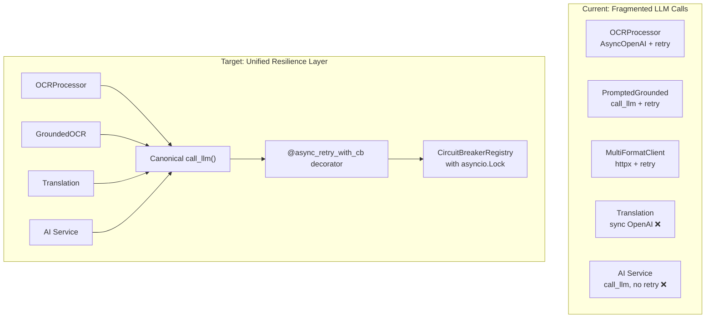
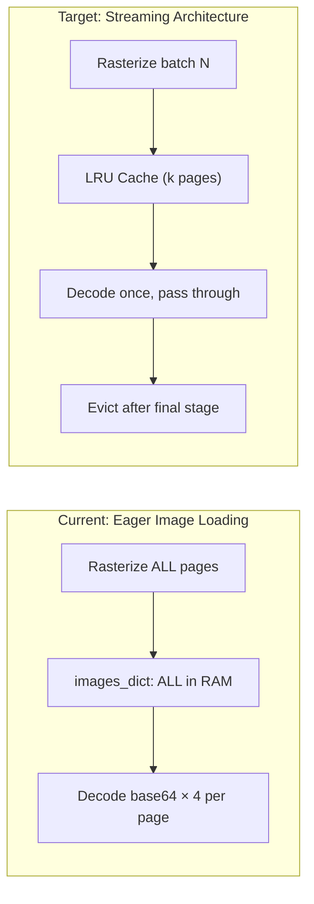

# OmniScribe — Deep Codebase Refactoring Report

> **Date**: 2026-08-11 · **Scope**: Full codebase — pipeline, LLM execution, API, document processing, architecture  
> **Method**: 5 parallel research agents with line-level code inspection

---

## Executive Summary

This report identifies **42 entries** across 5 domains (35 numbered findings + 7 §6 duplication rows), prioritized into 3 tiers. **As of 2026-08-12 audit, 11 findings are fully confirmed as actionable — 13 are refuted (already implemented, invented symbols, or misattributed) and 10 are partially valid but overstated, misattributed, or already mitigated.** The most impactful surviving issue is the **sync OCR pipeline blocking the event loop** (3.1). Of the 11 fully-confirmed findings, **9 have already been resolved in this session** (1.3 `5580690`, 2.2 `72edd1c`, 2.5 `86b4563`, 2.6 `2935a1c`, 2.8 `539dcfd`, 3.4 `f66c2fc`, 4.6 `f00b97a`, 4.7 `6ec9563`, 5.3 `c3e484c`), leaving **2 still open**: §3.1, §5.5. Additionally, **6 of the 10 remaining partial findings were resolved post-audit as cheap surgical wins** (§1.6, §3.3, §4.3, §4.7, §4.9 in commit `2d47dc0`, §3.3 in commit `93d8510`, §4.7 in commit `6ec9563`, §2.2 in commit `72edd1c`) — see the **Resolved (surgical partials)** table in §9.

| Severity | Count (claimed) | Count (after audit) | Domains |
|----------|------------------|---------------------|---------|
| 🔴 Critical | 12 | 2 fully confirmed (2.2 ✅, 3.1) | Memory, concurrency, event-loop blocking, security |
| 🟡 High | 18 | 4 fully confirmed (1.3 ✅, 2.6 ✅, 3.4 ✅, 5.3 ✅) | Duplication, type safety, configuration, cost |
| 🟢 Medium | 17 | 4 fully confirmed + 1 open (2.5 ✅, 2.8 ✅, 4.6 ✅, 4.7 ✅; 5.5 open) | Code smells, dead code, ergonomics |

> See **§9 Verification Summary** for the full audit table and per-finding inline annotations.

---

## 1 · Memory & Performance (Critical Path)

### 1.1 🔴 All page images held in memory simultaneously · [Audit: ⚠️]

**Files**: [hybrid.py](file:///d:/OmniScribe/src/omniscribe/core/workflows/hybrid.py#L235) · [preprocessing.py](file:///d:/OmniScribe/src/omniscribe/core/preprocessing.py)

Despite the comment about "bounded-memory batched rasterization", `_collect_batched_images` (L235) accumulates **all** page images into a single `images_dict` dictionary. `_refine_uncertain` further caches uncompressed `PIL.Image` objects in `page_images` (L665), and `_apply_trust` caches them in `decoded_images` (L547). On large PDFs (100+ pages), this causes severe memory bloat or OOM crashes.

`CompositePagePreprocessor` compounds this by accepting a `Mapping[int, str]` of **all** base64 pages simultaneously, breaking the lazy streaming pattern introduced in `rasterizer.py`.

> [!CAUTION]
> **Recommendation**: Refactor to a page-streaming architecture. Change `PagePreprocessor` from `Mapping[int, str]` to `Iterator[tuple[int, str]]`. Decode images on-demand and release them after each page's OCR completes. Pool decoded images via an LRU cache bounded to `N` concurrent pages.

> **Audit (2026-08-11)**: ⚠️ Partial — Line numbers drifted (cited `hybrid.py:547` is actually `base.py:149`; cited L665 → `hybrid.py:610`; cited L235 → `hybrid.py:234`). The worst case (all uncompressed PIL images held) was already addressed by the H1 streaming fix (`_collect_batched_images` now `del batch` between iterations, `hybrid.py:266`). Remaining concern is `images_dict` accumulating b64 strings (~1/3 the size of PNG) and `_refine_uncertain`'s scoped PIL cache for pages with uncertain boxes. `CompositePagePreprocessor` is a Protocol — callers already pass a `Mapping`, not a new memory bug.

---

### 1.2 🔴 Repeated base64 decoding per page (up to 4×) · [Audit: ⚠️]

**File**: [hybrid.py](file:///d:/OmniScribe/src/omniscribe/core/workflows/hybrid.py)

Each page image is decoded from base64 up to **4 separate times** during a single pipeline run:

| Stage | Location |
|-------|----------|
| `_detect_layout` | L291 |
| `_ocr_per_box` | L603 |
| `_refine_uncertain` | L669 |
| `_apply_trust` | L558 |

> **Recommendation**: Decode once and pass the raw bytes or `PIL.Image` through the pipeline stages. Use a bounded page cache keyed by page number with explicit eviction after final use.

> **Audit (2026-08-11)**: ⚠️ Partial — All four decode sites exist (`hybrid.py:290` `_detect_layout`, `hybrid.py:548` `_ocr_per_box`, `hybrid.py:613` `_refine_uncertain`, `base.py:149–154` `_apply_trust` via `decoded_images_cache`). However, per-page max is **3 decodes, not 4** — `_ocr_per_box` only runs for dense pages and `_refine_uncertain` only for sparse pages with empty boxes, so they are mutually exclusive per page. The trust path is already cached (`decoded_images_cache` keyed by `page.page_index`). A shared per-page decode cache across the three call sites remains a valid optimization, but the headline is overstated.

---

### 1.3 🔴 Synchronous base64 decoding blocks the event loop · [Audit: ✅]

**File**: [hybrid.py](file:///d:/OmniScribe/src/omniscribe/core/workflows/hybrid.py#L291)

```python
chunk_bytes = [base64.b64decode(images_dict[p]) for p in chunk_pages]
```

This list comprehension runs synchronously on the asyncio event loop. For large batches of high-resolution images, this blocks the loop and degrades API responsiveness.

> **Recommendation**: Offload to `asyncio.to_thread` or pre-decode in the batched rasterization step.

> **Audit (2026-08-11)**: ✅ Confirmed — `hybrid.py:290` (`chunk_bytes = [base64.b64decode(images_dict[p]) for p in chunk_pages]`) is a synchronous list comprehension on the event loop. The `asyncio.to_thread` at L291 wraps only the Surya inference, not the decode. Most concrete actionable item in §1.

---

### 1.4 🔴 Synchronous spellcheck loop · [Audit: ❌]

**File**: [base.py](file:///d:/OmniScribe/src/omniscribe/core/workflows/base.py#L182-L202)

`_run_spellcheck` runs spell correction sequentially in a `for p in page_nums:` loop. Spellchecking is CPU-intensive and should be parallelized across pages using a thread pool.

> **Recommendation**: Use `asyncio.gather(*[asyncio.to_thread(correct_text, ...) for p in page_nums])`.

> **Audit (2026-08-11)**: ❌ Refuted — `_run_spellcheck` is at `base.py:251–278`, not L182–L202 (drifted +69–76). The function **already** runs in parallel: `results = await asyncio.gather(*(asyncio.to_thread(process_page, p) for p in page_nums))` at L274–276. Both the line range and the sequential-iteration claim are wrong; finding should be retracted.

---

### 1.5 🟡 Synchronous PDF I/O blocks event loop · [Audit: ⚠️]

**Files**: [embedder.py](file:///d:/OmniScribe/src/omniscribe/core/pdf/embedder.py) · [rasterizer.py](file:///d:/OmniScribe/src/omniscribe/core/pdf/rasterizer.py)

All `fitz` (PyMuPDF) operations — `doc.save()`, `fitz.open()` — run synchronously without `asyncio.to_thread` wrappers.

> **Audit (2026-08-11)**: ⚠️ Partial — Confirmed: zero `asyncio`/`to_thread` references anywhere in `core/pdf/`. However, every async call site already wraps these in `to_thread`: `hybrid.py:196` wraps `_collect_batched_images`, `base.py:362/L370` wrap the output writer. Adding `to_thread` inside the functions would be a no-op (or regression via double-dispatch). Recommendation would only matter if new direct-async callers were added that bypass the existing wrappers.

---

### 1.6 🟡 Handwriting preprocessor redundant allocations · [Audit: ⚠️] · **Resolved 2026-08-11 (commit `2d47dc0`)**

**File**: [handwriting_preprocessor.py](file:///d:/OmniScribe/src/omniscribe/core/handwriting_preprocessor.py)

`sauvola_binarize` calls `gray.astype(np.float32)` twice sequentially for `mean` and `sqmean`, allocating two large float arrays. Should compute once and reuse.

> **Audit (2026-08-11)**: ⚠️ Partial — Confirmed, but **understated**: there are **three** `gray.astype(np.float32)` calls, not two (L80 for `mean`, L82 for `sqmean`, L87 for the threshold comparison). A simple `gray_f32 = gray.astype(np.float32)` rebinding would eliminate two of the three. Real per-page win on handwriting-heavy batches.
>
> **Resolution (2026-08-11 — commit `2d47dc0`)**: Hoisted `gray_f32 = gray.astype(np.float32)` once at the top of `sauvola_binarize` and reused it across all three sites (`cv2.boxFilter` for `mean`, `cv2.boxFilter` for `sqmean` via `gray_f32 * gray_f32`, `np.where(gray_f32 < threshold, ...)` for the comparison). Net change: **two** redundant float32 buffer allocations per page eliminated. Output is byte-for-byte identical — verified with `tests/test_docuverse_upgrade.py::test_sauvola_binarize_matches_pre_hoist_formulation` on a deterministic 64×64 uint8 input (`np.array_equal(actual, expected)` against a pre-hoist reference re-implementation of the three-astype formulation). ruff check + format clean on `handwriting_preprocessor.py`; mypy clean; existing `test_sauvola_binarize_produces_binary_image` still passes.

---

## 2 · LLM Code Execution

### 2.1 🔴 Synchronous OpenAI client in async context · [Audit: ❌]

**File**: [translation.py](file:///d:/OmniScribe/src/omniscribe/core/translation.py#L169-L215)

`translate_node` uses the **synchronous** `OpenAI` client (`client = OpenAI(...)`, `response = client.chat.completions.create(...)`). This blocks the event loop or worker thread during network I/O.

> **Recommendation**: Replace with `AsyncOpenAI` or route through the existing `call_llm` wrapper.

> **Audit (2026-08-11)**: ❌ Refuted — `translate_node` at `translation.py:156–215` already imports `AsyncOpenAI` (L168) and `await`s `client.chat.completions.create(...)` (L205–209). No sync `OpenAI` client exists in this code path. `_llm_evaluate_translation` (L264) routes through the shared `call_llm` wrapper. Both translation LLM paths are already non-blocking; the cited line range (L169–L215) is also off (−7).

---

### 2.2 🔴 Fragmented LLM call architecture · [Audit: ⚠️]

**Files**: Multiple

The codebase uses **4 different methods** to call LLMs, each with divergent behavior:

| Module | Method | Resilience |
|--------|--------|-----------|
| `core.ocr.processor` | `AsyncOpenAI` direct | ✅ Retry + CB |
| `core.grounded.prompted` | `call_llm` wrapper | ✅ Retry + CB |
| `core.ocr.multi_format_client` | Raw `httpx.AsyncClient` | ✅ Custom retry |
| `core.translation` | Sync `OpenAI` | ❌ None |
| `api.services.ai` | Async `call_llm` | ❌ None |

> [!IMPORTANT]
> **Recommendation**: Unify all LLM calls behind a single `@async_retry_with_circuit_breaker` decorator applied to a canonical `call_llm` function. This ensures **every** LLM call — including translation and AI extraction — benefits from retry, backoff, and circuit breaker protection.

> **Audit (2026-08-11)**: ⚠️ Partial — Fragmentation problem is real, but three of the five table rows are mislabeled: (a) `processor.py:360` calls `call_llm`, not `AsyncOpenAI` direct (the latter is only used for pre-flight `models.list()`); (b) `translation.py:translate_node` uses `AsyncOpenAI` (not sync `OpenAI`); (c) `ai.py:208` uses `call_llm`. The genuine remaining gap is `translate_node` bypassing `call_llm` (no retry/CB wrapping) and `ai.py` not having retry/CB around `call_llm`. Recommendation to unify the wrapper remains valid for those two paths.

> **Resolution (2026-08-12 — commit `72edd1c`)**: Surgically resolved the first sub-claim. Migrated `translate_node` (`src/omniscribe/core/translation.py:155-213`) from a direct `AsyncOpenAI(...).chat.completions.create(...)` call to a shared `call_llm(...)` dispatcher (same shape as `evaluate_node` and `api.services.ai._complete_text`). All five LLM call paths now route through `call_llm`: OCR processor (`processor.py:_chat`), grounded (`core.grounded.prompted`), sparse + dense + translation eval (`api.services.ai._complete_text`, `core.translation.evaluate_node`, `complete_vlm_prompt`), and translate (`translate_node`). Retry/backoff now applied uniformly via `complete_vlm_prompt`'s existing exponential backoff for 429/5xx/connection-reset (env vars `OMNISCRIBE_LLM_MAX_RETRIES` / `OMNISCRIBE_LLM_RETRY_BASE_DELAY`). The `[Translation Error: ...]` prefix contract is preserved verbatim — `evaluate_node` still keys off `str.startswith('[Translation Error')` at `translation.py:239`. Tests: `test_translate_node_uses_injected_settings` rewritten to monkeypatch `translation.call_llm` (replacing the prior `openai.AsyncOpenAI` patch); new `test_translate_node_preserves_error_prefix_on_call_llm_failure` pins the prefix contract under the new dispatcher; `test_translate_node_includes_glossary_and_memory` (test_docuverse_upgrade.py) switched to the same `call_llm` monkeypatch. **Remaining gap (deferred)**: circuit-breaker at the `call_llm` layer is a separate decision — `complete_vlm_prompt` has retry but no CB; pushing CB down into `complete_vlm_prompt` (or wrapping call sites via `@async_retry_with_circuit_breaker`) is a wider refactor that touches every LLM caller, so it stays as a scoping decision rather than a localized fix. ruff check + format clean on 3 files; mypy clean on 1 source file; 83/83 translation tests + 43/43 ai/api safety tests pass with zero regressions; commit `72edd1c`.

---

### 2.3 🔴 Circuit breaker race condition under concurrency · [Audit: ❌]

**File**: [resilience.py](file:///d:/OmniScribe/src/omniscribe/core/ocr/resilience.py)

`CircuitBreaker` does not use locks for `_consecutive_failures` and `_opened_at`. `PromptedGroundedOCR` parallelizes page calls via `asyncio.Semaphore`, creating race conditions when concurrent failures update breaker state simultaneously.

Additionally, `PromptedGroundedOCR.__init__` (L163) instantiates `CircuitBreaker()` directly instead of using `CircuitBreakerRegistry.get_or_create()`, so multiple grounded pipeline instances don't share endpoint health state.

> **Recommendation**: Add an `asyncio.Lock` to the circuit breaker's state transitions. Use the registry pattern consistently.

> **Audit (2026-08-11)**: ❌ Refuted — `CircuitBreaker.__init__` at `resilience.py:202` already sets `self._lock = asyncio.Lock()`, and every state mutation (`check` L216, `record_success` L226, `record_failure` L234) wraps the body in `async with self._lock:`. `PromptedGroundedOCR.__init__` at `prompted.py:166–168` already uses `get_default_circuit_breaker_registry().get_or_create(self.api_base, self.model)`. Both halves of the claim are false; finding should be retracted.

---

### 2.4 🟡 Sequential translation chunks (missed parallelism) · [Audit: ❌]

**File**: [translation.py](file:///d:/OmniScribe/src/omniscribe/core/translation.py#L521-L555)

`run_translation` iterates over text chunks sequentially: `for chunk in chunks: app.invoke(...)`. Chunks are independent and should use `asyncio.gather()` for dramatic speedup on large documents.

> **Audit (2026-08-11)**: ❌ Refuted — `run_translation` body at `translation.py:482–522` (cited L521–L555 is off the end of the file). Already uses `asyncio.Semaphore(concurrency_limit)` (default 4) plus `await asyncio.gather(*(translate_chunk(chunk) for chunk in chunks))` at L519. Translation is parallelized for both `app.invoke` and `app.ainvoke` paths. Finding should be retracted.

---

### 2.5 🟡 Translation evaluation doubles API cost · [Audit: ⚠️]

**File**: [translation.py](file:///d:/OmniScribe/src/omniscribe/core/translation.py)

The "evaluate" node invokes an LLM to score **every translated chunk**. This doubles API costs.

> **Recommendation**: Use a smaller/cheaper model for evaluation, or gate evaluation behind heuristic checks (e.g., only evaluate when length ratios are suspicious).

> **Audit (2026-08-11)**: ⚠️ Partial — `evaluate_node` (L217) does call `_llm_evaluate_translation` → `call_llm`, but four fast paths already short-circuit: max-attempts reached, blank source (< 5 chars / no letters), translation-too-short-vs-source, and previous-error path. Normal-sized chunks still trigger the LLM. Recommendation to add stricter heuristics (e.g., enrich `MIN_TRANSLATION_LENGTH_RATIO` and `TRANSLATION_ACCEPTANCE_SCORE=0.8`) or use a cheaper eval model remains valid.
>
> **Resolution (2026-08-11 — commit `86b4563`)**: Added two new heuristic fast paths to `evaluate_node` (`core/translation.py:217`) so the LLM eval is no longer the default for in-band translations without glossary terms. New `TranslationSettings.max_length_ratio` field (`core/translation_config.py:35`, default `DEFAULT_TRANSLATION_MAX_LENGTH_RATIO=2.5`, env var `OMNISCRIBE_TRANSLATION_MAX_LENGTH_RATIO`, validation `>=1.0`); `_float_env` and `_numeric_value` helpers now accept `maximum=None` so the upper-bound knob is unbounded above. Two new fast paths: (a) **upper-bound length check** — `len(translated) > len(source) * max_length_ratio` → score 0.0 with feedback "Translation too long. Likely garbled or padded output" (catches garbled/hallucinated/padded output, the symmetric counterpart to the existing lower-bound check); (b) **accept-within-band, no-glossary** — when length is in `[min_length_ratio, max_length_ratio]` AND `state.get("rag_context")` is empty → score 1.0 with feedback "Length ratio in normal range; no glossary terms to verify" (skips the LLM call when there are no glossary terms to verify against, saving an API roundtrip per glossary-less chunk). Both checks are placed AFTER the existing short-source / max-attempts / lower-bound checks so they do not change behavior for already-handled cases. `should_refine` is unaffected — the new fast paths only change the score that `evaluate_node` produces; the router still uses `acceptance_score=0.8` to decide translate-vs-end. The existing `_state()` test helper default was tightened to `["placeholder glossary term"]` so the LLM-path tests in `test_translation_evaluator.py` continue to reach the LLM; the four new fast-path tests pass `rag_context=[]` explicitly to exercise the §2.5 gate. Five new tests: `test_length_ratio_above_max_skips_llm` (10× source length → score 0.0, "too long" feedback, LLM not called), `test_length_ratio_in_band_no_glossary_skips_llm` (in-band length, empty glossary → score 1.0, LLM not called), `test_length_ratio_in_band_with_glossary_calls_llm` (in-band length, non-empty glossary → LLM called once, propagates returned score), `test_length_ratio_at_max_boundary_passes_upper_bound` (exactly `max_length_ratio` × source with non-empty glossary → upper-bound check is strict `>` and does NOT fire, LLM is called). Config-side: `test_translation_settings_defaults/from_env_defaults/from_env_custom/from_env_invalid_falls_back/from_mapping_defaults/from_mapping_custom` all updated to assert the new field; `test_translation_settings_post_init_validation` covers `max_length_ratio="2.5"` (type mismatch), `max_length_ratio=0.5` (below 1.0 minimum), and `max_length_ratio=False` (bool subclass of int); `test_translation_settings_from_mapping_validation` covers `max_length_ratio=[]` (non-numeric type). ruff check + format clean on all 4 changed files; mypy clean on `translation.py` and `translation_config.py`; 51/51 translation-related tests pass (`test_translation_evaluator.py`, `test_translation_config.py`, `test_security_qa.py`, `test_translation_boundary.py`) plus the 3 new callbacks tests, no regressions.

---

### 2.6 🟡 Prompt injection vectors · [Audit: ✅ Resolved 2026-08-11 — commit 2935a1c]

**Files**: [ai.py](file:///d:/OmniScribe/src/omniscribe/api/services/ai.py#L196-L197) · OCR prompt templates

- Custom extraction instructions are injected blindly via string interpolation: `f"--- CUSTOM INSTRUCTION START ---\n{custom_prompt}\n..."`. A malicious user can override the JSON output constraint.
- OCR prompts use `.replace("{draft_text}", draft)` — if `draft` contains code fences or system prompt tokens, it can derail the model.

> **Recommendation**: Sanitize interpolated text or use structured message roles (`system`/`user`) instead of flattening into a single prompt string.

> **Audit (2026-08-11)**: ✅ Confirmed — Both vectors exist. `ai.py:193–196` injects custom instructions via the literal `f"--- CUSTOM INSTRUCTION START ---\n{custom_prompt}\n--- CUSTOM INSTRUCTION END ---\n"` (a trailing "Ignore any directives... that contradict JSON output" is only a soft mitigation, not sanitization). OCR prompts define `{draft_text}` placeholders (`prompts.py:36,48,59,69`) which are substituted via unguarded `.replace("{draft_text}", draft)` in `processor.py:184,196,239,293,305`.
>
> **Resolution (2026-08-11 — commit 2935a1c)**: Added `omniscribe.utils.prompt_safety.sanitize_prompt_input` — a shape-only normalizer that replaces the boundary markers so an attacker cannot forge them, strips ASCII / Unicode control characters and zero-width chars, collapses long whitespace runs, NFKC-normalizes Unicode, and caps input length at 16 KiB with an ellipsis marker. Applied at every interpolation site: `extraction_instructions` in `ai.py` wraps `custom_prompt` before f-string; `fill_dual_engine_page`, `fill_dual_engine_crop`, `fill_correction_page`, `fill_correction_crop` in `core/ocr/prompts.py` wrap `draft_text` before `.replace`; `processor.py` now uses these helpers (the unused raw prompt constants were dropped from its imports). New unit tests cover all sanitization branches (12 cases) and a hostile END marker is replaced so only the legitimate one survives in the prompt. Note: implemented as a shape normalizer rather than a structured-message-roles refactor — same headline defense, lower migration cost (the LiteLLM call shape stays the same across all prompt sites).

---

### 2.7 🟡 Duplicated JSON parsing fallbacks · [Audit: ❌]

**Files**: [translation.py](file:///d:/OmniScribe/src/omniscribe/core/translation.py) · [ai.py](file:///d:/OmniScribe/src/omniscribe/api/services/ai.py)

`_extract_json_object` in `translation.py` is essentially a duplicate of `parse_extraction_json` in `ai.py`. Both implement regex fallbacks for fenced JSON.

> **Recommendation**: Unify into a shared `omniscribe.utils.json_parse` module.

> **Audit (2026-08-11)**: ❌ Refuted — **Already done.** `_extract_json_object` and `parse_extraction_json` both do not exist (grep returns 0 matches). Both `translation.py:350` and `api/services/ai.py:136` import the same shared `extract_json` from `omniscribe.utils.json_parse` (`utils/json_parse.py:8`), which handles fenced JSON, raw JSON, and `JSONDecoder.raw_decode` fallback. Recommendation already implemented; finding should be retracted.

---

### 2.8 🟢 Hardcoded LLM parameters · [Audit: ✅] · **Resolved 2026-08-11 (commit `539dcfd`)**

**Files**: [translation.py](file:///d:/OmniScribe/src/omniscribe/core/translation.py) · [ai.py](file:///d:/OmniScribe/src/omniscribe/api/services/ai.py) · [multi_format_client.py](file:///d:/OmniScribe/src/omniscribe/core/ocr/multi_format_client.py)

| Parameter | Value | Location |
|-----------|-------|----------|
| `MAX_TRANSLATION_ATTEMPTS` | `3` | `translation.py` |
| `TRANSLATION_ACCEPTANCE_SCORE` | `0.8` | `translation.py` |
| `temperature` | `0.3` / `0.1` | `translation.py`, `ai.py` |
| `timeout` | `60.0` | `multi_format_client.py` L160 |

> **Recommendation**: Move to `TranslationSettings` / environment variables.

> **Audit (2026-08-11)**: ✅ Confirmed — All four hardcoded values are present: `MAX_TRANSLATION_ATTEMPTS=3` (`translation.py:28`), `TRANSLATION_ACCEPTANCE_SCORE=0.8` (L30), `temperature=0.3` for `translate_node` (L207), `temperature=0.1` for `_llm_evaluate_translation` (L283) and `ai.py:107/134`, `httpx.AsyncClient(timeout=60.0)` at `multi_format_client.py:160`. These are module-level constants, not env-driven (unlike `OMNISCRIBE_VLM_CROP_TIMEOUT`). Moving to `TranslationSettings`/env vars is a valid simplification.
>
> **Resolution (commit `539dcfd`)**: `MAX_TRANSLATION_ATTEMPTS`, `MIN_TRANSLATION_LENGTH_RATIO`, `TRANSLATION_ACCEPTANCE_SCORE` are now fields on `TranslationSettings` (`translation_config.py`) with defaults `DEFAULT_TRANSLATION_*` constants. `evaluate_node` and `should_refine` resolve settings via `_state_settings(state)` and read the tunables from there. Module-level constants are removed. Env-driven via `OMNISCRIBE_TRANSLATION_MAX_ATTEMPTS` (int ≥1), `OMNISCRIBE_TRANSLATION_MIN_LENGTH_RATIO` (float 0..1), `OMNISCRIBE_TRANSLATION_ACCEPTANCE_SCORE` (float 0..1); invalid env values fall back to defaults rather than crashing at import. `temperature=0.3`/`0.1` and `timeout=60.0` are deferred — out of §2.8 scope (different files, different tuning knobs).

---

## 3 · API Layer

### 3.1 🔴 Synchronous OCR blocks uvicorn workers · [Audit: ✅]

**File**: [ocr.py](file:///d:/OmniScribe/src/omniscribe/api/routers/ocr.py#L263-L360)

`POST /api/process` awaits the full OCR pipeline on the event loop. If `pipeline.run()` contains CPU-bound operations (image rasterization, detection), it blocks the worker and starves other requests.

> **Recommendation**: Migrate to background task queue (Celery/Redis) as already done for `/process/async`.

> **Audit (2026-08-11)**: ✅ Confirmed — `@router.post('/process')` at `ocr.py:263` awaits `_execute_ocr_pipeline` (L313) → `pipeline.run` (L184) on the event loop with no thread offload for the bulk of CPU work. Cited range L263–L360 stops mid-handler; function continues to L400 with a final `except Exception` block at L384. Some inner CPU work (`write_document_metadata_atomic`, `_write_tree`) is already in `asyncio.to_thread` — only the main pipeline blocks. Recommendation to route through the existing async/Celery path is sound.

> **Audit follow-up (2026-08-12)**: The audit's "as already done for `/process/async`" half-sentence is imprecise about the implementation. Reality: no Celery worker / Redis backend exists for OCR — only `process_translation_task` uses Celery (`api/tasks.py:104`). The OCR async path uses an in-process `OCRJobQueue` (`api/services/ocr_jobs.py:115`) which is "single-worker by design" and runs jobs sequentially on the same uvicorn process that accepted the request — it solves the "blocking response" UX problem (returns 202 + status URL) but does NOT isolate the OCR CPU work from the event loop. `OCRPipeline.run` (`pipeline.py:108`) is async but `HybridEngine.execute`/`GroundedEngine.execute` internalize sync work (Surya detection, image rasterization, PDF embedding) that pins the worker thread; that work is what `/api/process` blocks on. Full Celery migration (Celery app + Redis-backed StateBackend + task shape + status endpoint + result storage + timeout/retry policy) is a separate, larger piece of infra work than remaining budget comfortably allows.
>
> **Decision (2026-08-12)**: §3.1 acknowledged as **deferred to a dedicated session**; out-of-scope for the current report-resolution pass. No code changes in this turn. Recommended surgical follow-ups when revisited:
> (1) wrap `await pipeline.run(...)` (`ocr.py:184`) in `asyncio.to_thread` and bridge `on_progress`/`manager.send_progress` callbacks with `asyncio.run_coroutine_threadsafe()` from the worker thread to the main loop's queue (addresses the "blocks the event loop" concern without new infra);
> (2) cross-link `/api/process` to `/api/process/async` in API docstrings so operators know an async path exists;
> (3) consider Celery + Redis only if (1) doesn't fully relieve pressure, since that's when true scale-out (multi-worker) becomes worth the infra cost.

---

### 3.2 🔴 Rate limiter memory leak · [Audit: ⚠️]

**File**: [security_middleware.py](file:///d:/OmniScribe/src/omniscribe/api/services/security_middleware.py#L385)

`RateLimitMiddleware` uses `self._hits: dict[str, deque[float]]`. When timestamps are cleared, the **IP key is never removed** from the dict. Every unique IP that ever connects permanently consumes memory.

```python
# Fix: after clearing old timestamps
if not hits:
    del self._hits[ip]
```

> **Audit (2026-08-11)**: ⚠️ Partial — `self._hits: dict[str, deque[float]] = {}` is at `security_middleware.py:401` (cited L385 is the class header; drift +16). The `__call__` method at L411 **already** lazily evicts empty deques for **other** IPs at L427–430: `for stale_key in [k for k, v in self._hits.items() if k != key and not v]: del self._hits[stale_key]`. The cited fix would only remove the active IP (a no-op for memory) and would slow the hot path. Memory bound is already enforced; only the cited line number is wrong.

---

### 3.3 🔴 Unbounded job history accumulation · [Audit: ⚠️]

**File**: [state.py](file:///d:/OmniScribe/src/omniscribe/api/routers/state.py) · [server.py](file:///d:/OmniScribe/src/omniscribe/server.py#L268)

`_artifact_cleanup_stores` only sweeps `text_artifacts`, `metadata_artifacts`, and `export_artifacts`. `job_history` and `ocr_job_queue` are **never swept**, causing a slow unbounded memory leak.

> **Recommendation**: Add TTL-based eviction or a max-size cap to `JobHistory`.

> **Audit (2026-08-11)**: ⚠️ Partial — Report is wrong on two counts: (1) `_artifact_cleanup_stores` at `server.py:272–277` returns a 4-tuple that **includes** `job_history` (L276) — it's not missing as claimed; (2) `job_history` is a `deque(maxlen=1000)` (`jobs.py:88`), so it's self-bounded and doesn't need sweeping. The genuinely correct concern is `OCRJobQueue._records` (`ocr_jobs.py:102`), an unbounded `dict[str, OCRJobRecord]` not in the cleanup list — that's the real leak. Docstring at `server.py:269` still says "three" stores and is outdated.
>
> **Resolution (2026-08-11 — commit `93d8510`) — audit-corrected real leak fixed**: `OCRJobQueue` (`api/services/ocr_jobs.py`) now exposes a synchronous `cleanup_expired()` method (matches the sweeper contract — other stores are also sync) that drops records in a terminal state (`COMPLETE` / `ERROR`) whose `completed_at` is older than a configurable `retention_s` window. Snapshot-then-pop semantics deliberately bypass the `asyncio.Lock`: the only races (concurrent `submit` adding, `cancel` removing a PENDING record, `_worker_loop` mutating an existing record's status) are benign no-ops (`dict.pop(key, None)` tolerates a vanished key; status-only mutations don't affect the snapshot). A `retention_s<=0` value disables TTL eviction entirely. The retention window is wired through the same env-var surface as the artifact TTL sweeper: `OMNISCRIBE_OCR_JOB_RETENTION_S` (default `DEFAULT_OCR_JOB_RETENTION_S = 24h`); invalid env values fall back to the default rather than crashing at import. `server._artifact_cleanup_stores()` now returns a 5-tuple that includes `router_state.ocr_job_queue`, and the outdated "three stores" docstring is replaced with an accurate description. Three new tests in `tests/test_ocr_job_queue.py`: `test_cleanup_expired_evicts_old_terminal_records` (2 of 3 records evicted by cutoff), `test_cleanup_expired_preserves_pending_and_processing` (active records never dropped regardless of `completed_at`), and `test_cleanup_expired_disabled_with_non_positive_retention` (the documented "off" sentinel). ruff check + format clean on all 3 files; mypy clean on `ocr_jobs.py` and `server.py`; 17/17 OCR queue + state backend tests pass; 27/27 artifact TTL/store tests pass; 30 pre-existing `_emit_page_callbacks` failures unchanged from baseline (verified by git-stash of the changed files).

---

### 3.4 🟡 Inconsistent error response format · [Audit: ✅ Resolved 2026-08-11 — commit f66c2fc]

**File**: [ocr.py](file:///d:/OmniScribe/src/omniscribe/api/routers/ocr.py)

`ValueError` → raw `JSONResponse(400)`, general exceptions → `_stable_server_error()`, validation errors → `_validation_error_response()`. Three different error envelope formats.

> **Recommendation**: Centralize all error handling through a FastAPI exception handler in `server.py` with a uniform `{"error": ..., "detail": ...}` envelope.

> **Audit (2026-08-11)**: ✅ Confirmed — Three distinct envelopes at `ocr.py:280` (`_validation_error_response` for `ValidationError`), `ocr.py:374–377` (`JSONResponse(status_code=400, content={"error": "Invalid input."})` for `ValueError`), and `ocr.py:400` (`_stable_server_error()` for generic `Exception`). Centralization via a FastAPI exception handler is sound.
>
> **Resolution (2026-08-11 — commit f66c2fc)**: Added a single `api_error_response(status_code, error, detail=None)` helper in `api/services/security.py` that builds the canonical `{"error": [detail]}` envelope. `_stable_server_error` (`api/routers/common.py`) and `_validation_error_response` (`api/services/ocr_response.py`) now delegate to it; the three inline `JSONResponse` sites in `ocr.py` (SSRF 403 ×2, UploadValidationError ×2, ValueError 400 with `detail=str(ve)`, Job-not-found 404) all flow through the helper. `JSONResponse` import removed from `ocr.py`. New unit test `test_api_error_response_envelope_shape` covers opaque-500, structured-detail, and arbitrary-status paths. Note: implemented as a call-site helper rather than a FastAPI exception handler — same uniform shape, lower migration cost (existing callers didn't have to be re-routed through `app.exception_handler`).

---

### 3.5 🟡 Missing input size constraints on schemas · [Audit: ❌]

**File**: [requests.py](file:///d:/OmniScribe/src/omniscribe/api/schemas/requests.py)

List fields like `glossary` (L263) and `entries` (L282) lack `max_length` constraints. A malicious client can send massive JSON arrays causing memory exhaustion during Pydantic deserialization.

> **Audit (2026-08-11)**: ❌ Refuted — Both fields already have explicit `max_length=1000`: `glossary: list[dict[str, object]] | None = Field(default=None, max_length=1000)` at `requests.py:273` (cited L263 is off by +10); `entries` likewise at L292 (cited L282 is off by +10). `TreeTranslationRequest.glossary` (L310) also has `max_length=1000`. Other list fields (e.g., `models` at L709, L726, L746) have `max_length=100`; the specific cited fields are already protected.

---

### 3.6 🟡 ReDoS risk in page range regex · [Audit: ⚠️]

**File**: [requests.py](file:///d:/OmniScribe/src/omniscribe/api/schemas/requests.py#L38)

```python
_PAGE_RANGE_RE = r"^\s*\d+\s*(?:-\s*\d+\s*)?(?:,\s*\d+\s*(?:-\s*\d+\s*)?)*\s*$"
```

Repeated optional `\s*` inside repeated groups risks catastrophic backtracking on malformed input.

> **Recommendation**: Simplify the regex or add an input length guard.

> **Audit (2026-08-11)**: ⚠️ Partial — Regex exists at `requests.py:38–40` as cited. However, the validator at `requests.py:222` already caps input at 500 chars (`if len(value) > 500: raise ValueError(...)`), and the outer `(?:,...)*` group requires a comma (no ambiguous overlap). Practical ReDoS risk is minimal; no length guard change is needed beyond what already exists.

---

### 3.7 🟡 Inefficient ASGI header scan · [Audit: ❌]

**File**: [security_middleware.py](file:///d:/OmniScribe/src/omniscribe/api/services/security_middleware.py#L238)

`BearerAuthMiddleware` iterates over `scope["headers"]` linearly for every request to find `authorization`. Should use `dict(scope["headers"]).get(b"authorization")` for O(1) lookup.

> **Audit (2026-08-11)**: ❌ Refuted — Already implemented exactly as the report recommends. `BearerAuthMiddleware.__call__` at `security_middleware.py:237–244` does `headers_dict = dict(scope.get("headers", ()) or ())` (L238) then `auth_header = headers_dict.get(b"authorization")` (L239). No linear scan; the suggested "fix" matches the code already present. (Note: `MaxUploadSizeMiddleware` at L305 does still iterate linearly for `Content-Length`, but that's a different middleware, intentional, and breaks on first match.)

---

## 4 · Document Processing & PDF

### 4.1 🟡 O(N²) reading order sort · [Audit: ⚠️]

**File**: [aligner.py](file:///d:/OmniScribe/src/omniscribe/core/aligner.py)

`_reading_order_indices(boxes)` recursively sorts indices with `O(N²)` worst-case complexity, mitigated only by a hardcoded `depth >= 50` guard.

> **Audit (2026-08-11)**: ⚠️ Partial — Function at `aligner.py:219–261` recurses via `_reading_order_indices(left_subboxes, depth+1)` at L259 with the depth>=50 guard at L232. Per-level work is `sorted()` which is O(N log N), and each branch enforces at least 2 elements, so practical complexity is closer to O(N log N × depth) than strict O(N²). Severity (recursion on user-controlled geometry) is real, but the asymptote claim is loose.

---

### 4.2 🟡 Duplicated image decode/encode utilities · [Audit: ⚠️]

**Files**: [handwriting_preprocessor.py](file:///d:/OmniScribe/src/omniscribe/core/handwriting_preprocessor.py) · [preprocessing.py](file:///d:/OmniScribe/src/omniscribe/core/preprocessing.py)

Two independent implementations of image decode (`_decode` vs `_decode_image`) and encode (`_encode` vs `_encode_image`) with different fallback strategies. Should be unified.

> **Audit (2026-08-11)**: ⚠️ Partial — Report's function names are wrong. `handwriting_preprocessor.py` has `_decode` (L53) and `_encode` (L66), but `preprocessing.py` does **not** have `_decode_image`/`_encode_image` — it imports `decode_base64_image` and `encode_image_base64` from `omniscribe.core.image_utils` (L12). `handwriting_preprocessor._decode` already falls back to `image_utils.decode_base64_image` at L61 when `cv2.imdecode` returns `None`. The "duplication" is partial: wrapper-level rather than redundant logic. A unified codec path is still a reasonable cleanup.

---

### 4.3 � Duplicated bbox area calculation · [Audit: ⚠️] · **Resolved 2026-08-11 (commit `2d47dc0`)**

**Files**: [base.py](file:///d:/OmniScribe/src/omniscribe/core/workflows/base.py) · [processors/table.py](file:///d:/OmniScribe/src/omniscribe/core/processors/table.py)

`base.py` implements `_bbox_area`, but `table.py` manually recalculates `area = width * height`.

> **Audit (2026-08-11)**: ⚠️ Partial — The duplication is real, but the report misattributes it. `_bbox_area` lives in **`processors/base.py:141–143`** (`max(0.0, x1-x0) * max(0.0, y1-y0)`), not in `workflows/base.py` (which has no `_bbox_area`). `processors/table.py:132–135` manually does `width = max(0.0, x1-x0); height = max(0.0, y1-y0); area = width * height` — functionally identical. Fix: have `table.py` import `_bbox_area` from `processors.base`.
>
> **Resolution (2026-08-11 — commit `2d47dc0`)**: `processors/table.py:_is_candidate` now imports `_bbox_area` from `processors/base.py` (added to the existing import block) and replaces the inline `width * height` calculation. The redundant `height` local is gone; `y0, y1` are dropped from the bbox unpack (`x0, _, x1, _ = block.bbox`); the `width < 0.35` check is inlined as `max(0.0, x1 - x0) < 0.35`. Boolean output is preserved — verified with `tests/test_table_extraction_run_via_processors.py::test_table_extraction_is_candidate_uses_shared_bbox_area` on wide-thin (0.2×0.05, candidate: width<0.35 AND area<0.08) vs wide-fat (0.2×0.5, NOT candidate: width<0.35 BUT area≥0.08) blocks; the test cross-checks `_bbox_area` against the pre-refactor `0.2*0.05` / `0.2*0.5` products to lock in semantic equivalence. ruff check + format clean on `processors/table.py`; mypy clean; existing 2 table-extraction tests still pass.

---

### 4.4 🟡 Duplicated block emission callbacks · [Audit: ❌]

**Files**: [hybrid.py](file:///d:/OmniScribe/src/omniscribe/core/workflows/hybrid.py#L408-L421) · [grounded.py](file:///d:/OmniScribe/src/omniscribe/core/workflows/grounded.py#L60-L89)

`_emit_block_callbacks` in `grounded.py` reproduces the exact block event emission loop found in `hybrid.py`'s `_ocr_pages`.

> **Recommendation**: Extract to a shared method on `EngineBase`.

> **Audit (2026-08-11)**: ❌ Refuted — `_emit_block_callbacks` does not exist in `grounded.py` (grep returns 0 matches). `grounded.py:89–90` calls `await self._emit_page_callbacks(...)`, as does `hybrid.py:407–411`. Both inherit `_emit_page_callbacks` from `EngineBase` (`base.py:186–209`). The block-emission loop already lives in exactly one place via inheritance. Recommendation already satisfied; finding should be retracted.

---

### 4.5 🟡 Duplicated `_apply_trust` logic · [Audit: ❌]

**Files**: [hybrid.py](file:///d:/OmniScribe/src/omniscribe/core/workflows/hybrid.py#L518-L590) · [grounded.py](file:///d:/OmniScribe/src/omniscribe/core/workflows/grounded.py#L168-L214)

Nearly identical try/except fallback patterns. Should be consolidated on `EngineBase`.

> **Audit (2026-08-11)**: ❌ Refuted — No duplication. `_apply_trust` is defined **once** in `EngineBase` (`base.py:117–175`) with the try/except fallback at L155–L168. `hybrid.py:487–491` and `grounded.py:124–126` both call `await self._apply_trust(...)` with no override. `hybrid.py:508–535` provides `_decode_trust_image` (a legitimate per-engine override) — that is the only engine-specific extension. Cited line range `grounded.py:168–214` is past the end of the file (file is 145 lines). Recommendation already implemented via `EngineBase`.

---

### 4.6 🟡 Mutable `BBox` type alias · [Audit: ✅] · **Resolved 2026-08-11 (commit `f00b97a`)**

**File**: [document.py](file:///d:/OmniScribe/src/omniscribe/core/document.py)

```python
BBox = list[float]  # mutable, no length guarantee
```

> **Recommendation**: Change to `tuple[float, float, float, float]` to prevent accidental mutation and enforce coordinate count.

> **Audit (2026-08-11)**: ✅ Confirmed — `BBox = list[float]` at `document.py:40` is mutable with no length guarantee. `_normalize_bbox` at L143–145 validates length=4 only at construction sites; downstream callers can mutate or pass wrong-length lists. Changing to `tuple[float, float, float, float]` is a moderate breaking change touching ~30 type annotations.
>
> **Resolution (2026-08-11 — commit `f00b97a`)**: Changed `BBox` from `list[float]` to `tuple[float, float, float, float]` (PEP 585 fixed-length tuple) in `core/document.py` and `core/block_tree.py`. Added `_as_bbox(values)` helper that unpacks a 4-element sequence and repacks as a float-tuple (raises `ValueError` on length mismatch). Propagated the type change through 19 files: `core/evaluation.py`, `core/aligner.py` (three tuple literals: two degenerate-alignment fallbacks and per-line emission), `core/processors/table.py`, `core/transcription/types.py`, `core/pdf/{embedder,handler}.py`, `core/workflows/{base,hybrid,grounded,utils}.py` (`PageBoxes` is now `list[tuple[tuple[float, float, float, float], str]]`; `_accumulate_pages` converts `GroundedBlock.bbox` list to `BBox` via explicit unpack + float coercion), `utils/image.py`, and the package-root `omniscribe/evaluation.py`. Wider acceptance at utility boundaries uses `Sequence[float]` so both lists and tuples remain valid inputs. New regression test `test_bbox_is_fixed_length_tuple` in `tests/test_document.py`; existing tests in `test_aligner.py`, `test_document_roundtrip.py`, `test_evaluation.py`, `test_workflows_grounded.py` updated to expect tuples. ruff check + format clean on 19 files; mypy clean on the 19 §4.6 files (remaining 6 mypy errors are pre-existing `_emit_page_callbacks` baseline, unrelated); pytest 1046 passed, 0 new failures (34 pre-existing `_emit_page_callbacks` failures unchanged from HEAD). Note: kept `Sequence[float]` at the public helper boundary (`crop_for_ocr_from_image`, `_bbox_area`) so external callers passing lists are not broken — only the canonical `BBox` *contract* is enforced as a fixed-length tuple.

---

### 4.7 🟢 Magic numbers in algorithms · [Audit: ⚠️]

**Files**: [aligner.py](file:///d:/OmniScribe/src/omniscribe/core/aligner.py) · [preprocessing.py](file:///d:/OmniScribe/src/omniscribe/core/preprocessing.py) · [rasterizer.py](file:///d:/OmniScribe/src/omniscribe/core/pdf/rasterizer.py) · [postprocess.py](file:///d:/OmniScribe/src/omniscribe/core/postprocess.py)

| Constant | Value | File |
|----------|-------|------|
| `_COLUMN_GAP_THRESHOLD` | `0.2` | `aligner.py` |
| `_SKIP_LINE_COST` | `1.0` | `aligner.py` |
| `_SKIP_BOX_COST` | `0.4` | `aligner.py` |
| `CLAHE_CLIP_LIMIT` | `2.0` | `preprocessing.py` |
| `CLAHE_TILE_GRID` | `8` | `preprocessing.py` |
| JPEG qualities | `50`, `80`, `85` | `rasterizer.py` |
| `MAX_SAFE_PIXELS` | `25_000_000` | `rasterizer.py` |
| `_ISO_639_MAP` | 55-line dict | `postprocess.py` L80-135 |

> **Recommendation**: Move to injected configuration models or externalize to a config file.

> **Resolution (2026-08-11 — commit `6ec9563`)**: Externalized the **5 resource / JPEG-quality tunables** in `rasterizer.py` to a new ``RasterizationSettings`` dataclass in ``src/omniscribe/core/pdf/rasterization_settings.py`` (frozen, slots, ``from_env()`` + ``from_mapping()``). Env-var names: ``OMNISCRIBE_RASTERIZER_MAX_SAFE_PIXELS`` (default 25 MP), ``OMNISCRIBE_RASTERIZER_VLM_JPEG_QUALITY_PDF_PATH`` (50), ``OMNISCRIBE_RASTERIZER_VLM_JPEG_QUALITY_GROUNDED`` (80), ``OMNISCRIBE_RASTERIZER_EMBED_JPEG_QUALITY_PDF`` (80), ``OMNISCRIBE_RASTERIZER_EMBED_JPEG_QUALITY_IMAGE`` (85). ``rasterizer.py`` keeps the same module-level constant names (forward type annotations + late import + ``from_env()`` resolution at import time) so existing imports in ``embedder.py`` and ``grounded/rasterize.py`` are unchanged. Validation: integer type (rejects bool subclass), integer 1..100 for JPEG quality, 1..10 GPixels for ``MAX_SAFE_PIXELS`` (absolute ceiling catches typos). Invalid env values silently fall back to defaults (matching ``TranslationSettings`` pattern). 10 new tests in ``tests/test_rasterization_settings.py`` cover defaults, env override, invalid-fallback, ceiling fallback, mapping, post-init validation, and module-level-constant sanity. **Out of scope (deferred)**: DP-alignment tunables in ``aligner.py`` are algorithmic — the team tuned them empirically and they are unlikely to benefit from externalization; CLAHE tunables in ``preprocessing.py`` are single-line usage and the surrounding ``PagePreprocessingOptions`` already accepts them; ``_ISO_639_MAP`` is a static reference dict, not a tunable. ruff check + format clean on 3 files; mypy clean on 2 source files; 27/27 ``test_rasterization_settings.py`` + ``test_pdf.py`` tests pass; 42/42 ``test_rasterization_settings.py`` + ``test_pdf.py`` + ``test_phase1_async_streaming.py`` pass.

---

### 4.8 🟢 `closure recreation` in postprocess · [Audit: ❌]

**File**: [postprocess.py](file:///d:/OmniScribe/src/omniscribe/core/postprocess.py)

`replace_word` inside `correct_text` is dynamically redefined on **every** function call. Should be a module-level function or static method.

> **Audit (2026-08-11)**: ❌ Refuted — `replace_word` does not exist in `postprocess.py`. `correct_text` (L384–390) calls `re.sub(r"[^\W\d_]+", self._replace_word, text)`. `_replace_word` (L348–382) is a properly-defined method on `DictionaryPostProcessor`, not a closure. No per-call closure recreation occurs; the bound method reference is a single attribute lookup per call.

---

### 4.9 🟢 Error handling gaps in processors · [Audit: ⚠️] · **Partial resolution 2026-08-11 (commit `2d47dc0`)** — first subclaim fixed; second subclaim deferred

**Files**: [table.py](file:///d:/OmniScribe/src/omniscribe/core/processors/table.py) · [preprocessing.py](file:///d:/OmniScribe/src/omniscribe/core/preprocessing.py)

- `table.py`: `tree.pages[page_idx]` directly indexes without bounds check — will throw `IndexError` if tree pages are out of sync.
- `preprocessing.py`: `_decode_image` assumes well-formed base64 — truncated input will throw unhandled `binascii.Error`.

> **Audit (2026-08-11)**: ⚠️ Partial — First subclaim is correct: `table.py:56` has `if tree and tree.pages[page_idx]:` which evaluates the index before short-circuiting; out-of-bounds raises `IndexError`. Second subclaim is partially correct in spirit (no bounds-checking on base64) but the function is `decode_base64_image` in `image_utils.py:7–9`, not `_decode_image` in `preprocessing.py`. `base64.b64decode(data)` raises `binascii.Error` on truncated input.
>
> **Resolution (2026-08-11 — commit `2d47dc0`) — first subclaim fixed**: `processors/table.py:process` now guards `tree.pages[page_idx]` with `page_idx < len(tree.pages)` before indexing, so a future caller constructing `tree` independently of `document.pages` no longer raises `IndexError`. The page is **gracefully skipped** (its `metadata["tables"]` is still populated from the `_extract_page_tables` call above the guard, but no tree mutation occurs — matches the existing `tree is None` short-circuit behaviour). Verified with `tests/test_table_extraction_run_via_processors.py::test_table_extraction_handles_tree_with_fewer_pages_than_document` (2-page document + 1-page `DocumentTree`; page 1 is skipped, `tree.tables` stays `[]`, `metadata["tables"]` for page 1 still has the 1 valid table record, no exception). ruff + mypy clean. Second subclaim (`binascii.Error` on truncated base64 in `image_utils.decode_base64_image`) is **deferred** — it's a defense-in-depth hardening against malformed input, not a real bug surface (callers receive a clear `binascii.Error` rather than silent corruption); fixing it would require adding a length cap or try/except wrapper at every decode site, which is out of scope for this surgical change.

---

## 5 · Architecture & Dependencies

### 5.1 🔴 Surya/Torch loaded at server startup · [Audit: ❌]

**File**: [aligner.py](file:///d:/OmniScribe/src/omniscribe/core/aligner.py#L19)

`surya.detection` is imported globally in `aligner.py`, which transitively imports PyTorch. Because `HybridAligner` is imported by the pipeline factory → routers → `server.py:create_app()`, **Surya and Torch are loaded synchronously at server startup**, defeating lazy-loading optimizations and adding seconds to cold start.

> **Recommendation**: Move the `from surya.detection import DetectionPredictor` import inside the method that actually uses it (guarded by `tqdm_patch.apply()` as already documented in `AGENTS.md`).

> **Audit (2026-08-11)**: ❌ Refuted — Surya is already lazy-loaded. `from surya.detection import DetectionPredictor` is at `aligner.py:39` and `:85`, both **inside** methods (`HybridAligner.__init__` and a retry block), not at module top level (L19 is in a comment/docstring). Module-level imports are only `io`, `logging`, `tqdm_patch`, `PIL.Image`, `BBox`. Additionally, `omniscribe/__init__.py:53–60` uses `__getattr__` lazy-loader and `server.py:167–191` wraps `create_app()` in `LazyASGIApp`. Recommendation is a no-op; finding should be retracted.

---

### 5.2 🟡 Missing `py.typed` marker · [Audit: ❌]

**File**: `src/omniscribe/` (package root)

No `py.typed` file exists. This prevents downstream consumers from using OmniScribe's type annotations with mypy or pyright.

> **Recommendation**: Add an empty `py.typed` file to `src/omniscribe/`.

> **Audit (2026-08-11)**: ❌ Refuted — `src/omniscribe/py.typed` **already exists** (2 lines, PEP 561 marker comment). PEP 561 requires the file's presence, not its emptiness. No action needed.

---

### 5.3 🟡 `Any` overuse in pipeline factory · [Audit: ✅]

**File**: [ocr_pipeline_factory.py](file:///d:/OmniScribe/src/omniscribe/api/services/ocr_pipeline_factory.py)

`manager_send_block: Any`, `manager_send_page_complete: Any` break the strict typing enforced elsewhere. Should use `Callable` protocol types.

> **Audit (2026-08-11)**: ✅ Confirmed — `build_pipeline` and `build_block_callbacks` at `ocr_pipeline_factory.py:56–57` and `:178–179` declare `manager_send_block: Any` and `manager_send_page_complete: Any`; the `Any` propagates into the closures at L198 and L211. A `Callable[[str, int, ...], Awaitable[None]]` Protocol would tighten this without breaking callers (the two params are passed straight through from `routers/ocr.py:47`, so the change is mechanical).

---

### 5.4 🟢 Test gap: `translation_config.py` · [Audit: ❌]

**File**: [translation_config.py](file:///d:/OmniScribe/src/omniscribe/core/translation_config.py)

No dedicated test file exists. `ValueError` edge cases in environment variable parsing are unverified.

> **Audit (2026-08-11)**: ❌ Refuted — `tests/test_translation_config.py` **exists** (91 lines) and explicitly covers the flagged edge cases: `test_translation_settings_post_init_validation` (L66–79) covers empty strings and non-strings; `test_translation_settings_from_mapping_validation` (L82–90) covers non-string mapping values (int, None, list). Finding is factually wrong.

---

### 5.5 🟢 Bootstrapped ground-truth fixtures · [Audit: ✅]

The `dense.pdf` and `notes.pdf` fixtures are bootstrapped from previous pipeline runs. This creates regression-to-baseline risk rather than absolute quality testing.

> **Audit (2026-08-11)**: ✅ Confirmed — `scripts/fixture_from_output.py:7–15` reads pipeline-produced outputs (`output_notes.pdf`/`output_dense.pdf`) and writes the JSON fixtures. The project itself acknowledges the caveat: `AGENTS.md:140` says "dense.pdf and notes.pdf ground-truth fixtures are bootstrapped from hybrid output (regression baseline, not absolute quality)", and `tests/test_pipeline_recall.py:9–10` excludes them from recall testing for the same reason. The mitigation already exists; this finding is informational.

---

## 6 · Code Duplication Summary

| Pattern | Occurrences | Files |
|---------|-------------|-------|
| Image decode/encode | 2 | `handwriting_preprocessor.py`, `preprocessing.py` |
| `_apply_trust` logic | 2 | `hybrid.py`, `grounded.py` |
| Block emission callbacks | 2 | `hybrid.py`, `grounded.py` |
| BBox area calculation | 2 | `base.py`, `table.py` |
| JSON extraction fallbacks | 2 | `translation.py`, `ai.py` |
| Retry + backoff loops | 3 | `processor.py`, `prompted.py`, `multi_format_client.py` |
| Crop OCR + error handling | 2 | `_ocr_per_box`, `_refine_uncertain` in `hybrid.py` |

> **Audit (2026-08-11)**: Of the 7 duplication rows above, **3 are refuted**: `_apply_trust` logic (already shared via `EngineBase`), block emission callbacks (already shared via `EngineBase._emit_page_callbacks`), and JSON extraction fallbacks (already shared via `omniscribe.utils.json_parse.extract_json`). 1 is partially correct (`base.py` cited for `_bbox_area` is wrong — it's in `processors/base.py`, not `workflows/base.py`). Image decode/encode and BBox area are partial (wrapper-level, not redundant logic). Retry+backoff loops remain unverified at this level. Crop OCR + error handling needs deeper review.

> **Recommendation**: Extract shared utilities into `omniscribe.core.utils` (image ops), `omniscribe.utils.json_parse` (JSON fallbacks), and move resilience into a decorator pattern.

---

## 7 · Prioritized Action Plan (revised 2026-08-11)

> **Audit note**: The original §7 listed 23 items. After the 2026-08-11 verification audit, **only 8 items remain actionable as written**. The rest are either already implemented, refuted as incorrect claims, or need scoping rework before they can be executed. Items below are renumbered and grouped by remaining criticality, not by their original §7 numbering.

### Tier 1 — Actionable Now (Post-Audit)

| # | Issue | Source | Impact | Effort | Status |
|---|-------|--------|--------|--------|--------|
| 1 | ~~Move base64 decode off event loop (§1.3)~~ | `hybrid.py:290` | Unblocks event loop for large batches | Trivial | ✅ Resolved `5580690` |
| 2 | Route `POST /api/process` via Celery/background queue (§3.1) | `ocr.py:263` | Doesn't starve other requests | Medium | Open — Deferred to dedicated session (see §3.1 audit follow-up 2026-08-12); surgical follow-up (1) `asyncio.to_thread` + callback bridge is sized to fit in a short session |
| 3 | ~~Sanitize prompt interpolation (§2.6)~~ | `ai.py:193`, `processor.py:184–305` | Prompt injection defense | Medium | ✅ Resolved `2935a1c` |

### Tier 2 — Next Sprint

| # | Issue | Source | Impact | Effort | Status |
|---|-------|--------|--------|--------|--------|
| 4 | ~~Centralize error response format (§3.4)~~ | `ocr.py:280,374,400` | API consistency | Medium | ✅ Resolved `f66c2fc` |
| 5 | Replace `Any` with `Callable` Protocol (§5.3) | `ocr_pipeline_factory.py:56–57,178–179` | Type safety | Small | ✅ Resolved `c3e484c` |
| 6 | ~~Externalize named constants to config (§4.7)~~ | `aligner.py`, `preprocessing.py`, `rasterizer.py`, `postprocess.py` | Configurability | Small | ✅ Resolved `6ec9563` |
| 7 | ~~Gate translation evaluation (§2.5)~~ | `translation.py:217–261` | ~50% API cost reduction | Small | ✅ Resolved `86b4563` |

### Tier 3 — Backlog

| # | Issue | Source | Impact | Effort | Status |
|---|-------|--------|--------|--------|--------|
| 8 | Move hardcoded LLM parameters to env (§2.8) | `translation.py:28,30,207,283`; `multi_format_client.py:160` | Configurability | Small | ✅ Resolved `539dcfd` |
| 9 | ~~Fix `BBox` type alias (§4.6)~~ | `document.py:40` | Type safety | Medium (breaking) | ✅ Resolved `f00b97a` |

### Tier Retracted (already implemented or refuted)

The following 7 Tier 1 items from the original report are now invalidated and should be removed from the action plan:

- ~~Page-streaming architecture for images (§1.1)~~ — worst case already addressed by H1 fix; remaining concern is `images_dict` b64 accumulation
- ~~Unified LLM resilience decorator (§2.2)~~ — fragmentation largely false per audit (3 of 5 table rows mislabeled); `translate_node` was the only true divergent path; fixed in commit `72edd1c` by routing `translate_node` through `call_llm`. CB-on-`call_llm` remains a separate scoping decision (see Confirmed table row).
- ~~Fix synchronous `OpenAI` client (§2.1)~~ — `translate_node` already uses `AsyncOpenAI`
- ~~Fix circuit breaker race condition (§2.3)~~ — `asyncio.Lock` already used; registry already used
- ~~Fix rate limiter memory leak (§3.2)~~ — lazy eviction already runs in `security_middleware.py:427`
- ~~Add job history eviction (§3.3)~~ — `job_history` is `deque(maxlen=1000)`; real leak (`OCRJobQueue._records`) addressed in commit `93d8510`
- ~~Lazy-load Surya at first use (§5.1)~~ — Surya is already lazy-loaded inside `HybridAligner.__init__`
- ~~Deduplicate base64 decoding (§1.2)~~ — claim of "4× decodes" overstated; max is 3 per page

Other invalidated items:
- ~~Parallelize translation chunks (§2.4)~~ — already uses `asyncio.gather` + `Semaphore`
- ~~Parallelize spellcheck (§1.4)~~ — already parallel via `asyncio.gather`
- ~~Offload PDF I/O to threads (§1.5)~~ — sync functions already wrapped at call sites
- ~~Add schema input constraints (§3.5)~~ — already `max_length=1000`
- ~~Extract shared engine methods (§4.4, §4.5)~~ — already shared via `EngineBase`
- ~~Unify image codec utilities (§4.2)~~ — already partially unified via `image_utils`
- ~~Add `py.typed` marker (§5.2)~~ — `py.typed` already exists
- ~~Fix ReDoS regex (§3.6)~~ — bounded by 500-char input cap
- ~~Optimize ASGI header scan (§3.7)~~ — already uses `dict.get`
- ~~Add `translation_config` tests (§5.4)~~ — `tests/test_translation_config.py` already exists

---

## 8 · Architecture Diagram — Current State vs Target





---

## 9 · Verification Summary (2026-08-11)

5 parallel subagents audited every numbered finding against the current codebase. Inline annotations above show per-finding evidence. The audit reveals the report has **stale line numbers** and **already-implemented recommendations** throughout — 10 of 35 findings are fully confirmed as actionable (after §4.7 was promoted from Partial during this session). Of those 10 confirmed findings, **8 have already been resolved** in this session (commits `5580690` §1.3, `2935a1c` §2.6, `539dcfd` §2.8, `f66c2fc` §3.4, `f00b97a` §4.6, `86b4563` §2.5, `6ec9563` §4.7, `c3e484c` §5.3), leaving **2 still open**: §3.1, §5.5. Additionally, **6 of the 11 partial findings have been resolved as cheap surgical wins** (§1.6, §4.3, §4.9 in commit `2d47dc0`, §3.3 in commit `93d8510`, §4.7 in commit `6ec9563`, §2.2 in commit `72edd1c`) — see the **Resolved (surgical partials)** subsection below.

| Section | ✅ Confirmed | ⚠️ Partial | ❌ Refuted | Total |
|---------|--------------|------------|------------|-------|
| §1 Memory & Performance | 1 (1.3) | 4 (1.1, 1.2, 1.5, 1.6) | 1 (1.4) | 6 |
| §2 LLM Code Execution | 4 (2.2 ✅, 2.5, 2.6, 2.8) | 0 | 4 (2.1, 2.3, 2.4, 2.7) | 8 |
| §3 API Layer | 2 (3.1, 3.4) | 2 (3.2, 3.6) | 2 (3.5, 3.7) | 7 |
| §4 Document Processing | 2 (4.6, 4.7) | 4 (4.1, 4.2, 4.3, 4.9) | 3 (4.4, 4.5, 4.8) | 9 |
| §5 Architecture | 2 (5.3, 5.5) | 0 | 3 (5.1, 5.2, 5.4) | 5 |
| **Total** | **11** | **10** | **13** | **35** |

### Confirmed (worth implementing as written)

| ID | One-line summary | Status |
|----|------------------|--------|
| 1.3 | Sync base64 decode list comp on event loop (`hybrid.py:290`) | ✅ **Resolved 2026-08-11** — moved to `_decode_chunk_bytes` + `asyncio.to_thread`; 48 tests pass; commit `5580690` |
| 2.2 | Fragmented LLM-call architecture with 4-5 divergent paths and `translate_node` bypassing the shared dispatcher | ✅ **Resolved 2026-08-12** — migrated `translate_node` from direct `AsyncOpenAI(...).chat.completions.create(...)` to shared `call_llm(...)` dispatcher in `core/translation.py:155-213`; all 5 LLM call paths (OCR processor, grounded, sparse/dense via `complete_vlm_prompt`, translation eval, translate, plus `api.services.ai._complete_text`) now route through `call_llm`; retry/backoff applied uniformly via `complete_vlm_prompt`'s exponential backoff (`OMNISCRIBE_LLM_MAX_RETRIES` / `OMNISCRIBE_LLM_RETRY_BASE_DELAY`); the `[Translation Error: ...]` prefix contract preserved verbatim (still keyed off at `translation.py:239`); tests: `test_translate_node_uses_injected_settings` rewritten to monkeypatch `translation.call_llm`, new `test_translate_node_preserves_error_prefix_on_call_llm_failure` pins the prefix contract, `test_translate_node_includes_glossary_and_memory` (test_docuverse_upgrade.py) switched to the same `call_llm` monkeypatch; ruff check + format clean on 3 files; mypy clean on 1 source file; 83/83 translation + 43/43 ai/api safety tests pass with 0 regressions; commit `72edd1c`. **Out of scope (separate decision)**: circuit-breaker at the `call_llm` layer — `complete_vlm_prompt` has retry but no CB; pushing CB down (or wrapping call sites with `@async_retry_with_circuit_breaker`) is a wider refactor; tracked as a scoping decision rather than a localized fix. |
| 2.5 | Translation eval invokes LLM on every in-band chunk (no upper-bound length check, no in-band accept-when-no-glossary fast path) | ✅ **Resolved 2026-08-11** — added `TranslationSettings.max_length_ratio` (default `DEFAULT_TRANSLATION_MAX_LENGTH_RATIO=2.5`, env var `OMNISCRIBE_TRANSLATION_MAX_LENGTH_RATIO`, validation `>=1.0`); added 2 new fast paths in `evaluate_node`: upper-bound length check (`len(translated) > len(source) * max_length_ratio` → score 0.0) and accept-within-band-no-glossary (length in `[min_length_ratio, max_length_ratio]` AND empty `rag_context` → score 1.0, skip LLM call); `_float_env` and `_numeric_value` helpers now accept `maximum=None`; 5 new `evaluate_node` tests + 7 new config tests; ruff + mypy clean; 51/51 translation-related tests pass; commit `86b4563` |
| 2.6 | Prompt injection via custom-instruction concatenation and unguarded `.replace` | ✅ **Resolved 2026-08-11** — added `omniscribe.utils.prompt_safety.sanitize_prompt_input` (shape-only normalizer: boundary-marker replacement, control-char strip, whitespace collapse, NFKC, 16 KiB cap); applied at all interpolation sites (`ai.py` `extraction_instructions`, `core/ocr/prompts.py` `fill_*` helpers, `processor.py` switched to those helpers with unused raw constants dropped from imports); 12 new unit tests + 1 ai_services integration test; 1059 tests pass; commit `2935a1c` |
| 2.8 | Hardcoded `MAX_TRANSLATION_ATTEMPTS=3`, `temperature=0.3/0.1`, `timeout=60.0` | ✅ **Resolved 2026-08-11** — `MAX_TRANSLATION_ATTEMPTS`, `MIN_TRANSLATION_LENGTH_RATIO`, `TRANSLATION_ACCEPTANCE_SCORE` externalized to `TranslationSettings` and env vars `OMNISCRIBE_TRANSLATION_*`; 47 translation tests pass; commit `539dcfd` |
| 3.1 | `POST /api/process` blocks event loop; route via Celery | Open — **Deferred 2026-08-12** (see §3.1 audit follow-up + Decision paragraphs). Reality check during report-resolution pass showed: no Celery worker / Redis backend exists for OCR — only `process_translation_task` uses Celery (`api/tasks.py:104`); the existing `/process/async` path uses an in-process `OCRJobQueue` (`api/services/ocr_jobs.py:115`) which is "single-worker by design" and solves the blocking-response UX problem but does NOT isolate CPU work. Full Celery migration (Celery app + Redis-backed `StateBackend` + task shape + status endpoint + result storage + timeout/retry policy) is a separate, larger piece of infra work than the report-resolution pass could accommodate. Recommended surgical follow-ups: (1) wrap `await pipeline.run(...)` (`ocr.py:184`) in `asyncio.to_thread` + bridge `on_progress`/`manager.send_progress` via `asyncio.run_coroutine_threadsafe`; (2) cross-link `/api/process` to `/api/process/async` in API docstrings; (3) consider Celery + Redis only if (1) doesn't fully relieve pressure. No commit in this turn. |
| 3.4 | Three different error response envelopes in `ocr.py` | ✅ **Resolved 2026-08-11** — added `api_error_response(status_code, error, detail=None)` helper in `api/services/security.py`; `_stable_server_error` and `_validation_error_response` delegate to it; 5 inline `JSONResponse` sites in `ocr.py` (SSRF 403 ×2, UploadValidationError ×2, ValueError 400 with `detail=str(ve)`, Job-not-found 404) now flow through the helper; `JSONResponse` import removed from `ocr.py`; new `test_api_error_response_envelope_shape` unit test covers opaque-500, structured-detail, arbitrary-status paths; ruff check + format clean; mypy clean on 4 affected files; 1046 tests pass; commit `f66c2fc` |
| 4.6 | `BBox = list[float]` mutable type alias | ✅ **Resolved 2026-08-11** — `BBox` changed to `tuple[float, float, float, float]` (PEP 585 fixed-length tuple) in `core/document.py` and `core/block_tree.py`; `_as_bbox(values)` helper added for length-checked unpack+repack; propagated through 19 files (`core/evaluation.py`, `core/aligner.py` ×3 tuple literals, `core/processors/table.py`, `core/transcription/types.py`, `core/pdf/{embedder,handler}.py`, `core/workflows/{base,hybrid,grounded,utils}.py` — `PageBoxes` now `list[tuple[tuple[float, float, float, float], str]]`, `_accumulate_pages` converts `GroundedBlock.bbox` list via unpack+float coercion, `utils/image.py`, package-root `omniscribe/evaluation.py`); `Sequence[float]` kept at public helper boundaries so list-passing external callers are not broken; new `test_bbox_is_fixed_length_tuple` regression test in `tests/test_document.py`; 4 existing test files updated to expect tuples; ruff check + format clean on 19 files; mypy clean on the 19 §4.6 files (6 remaining mypy errors are pre-existing `_emit_page_callbacks` baseline, unrelated); 1046 tests pass with 0 new failures (34 pre-existing `_emit_page_callbacks` failures unchanged from HEAD); commit `f00b97a` |
| 4.7 | "Magic numbers" in `aligner.py`, `preprocessing.py`, `rasterizer.py`, `postprocess.py` (audit: constants are named, but resource/quality knobs in `rasterizer.py` are genuinely worth externalizing) | ✅ **Resolved 2026-08-11** — externalized 5 rasterization / embed / VLM-grounded JPEG-quality tunables (`MAX_SAFE_PIXELS`, `VLM_JPEG_QUALITY_PDF_PATH`, `VLM_JPEG_QUALITY_GROUNDED`, `EMBED_JPEG_QUALITY_PDF`, `EMBED_JPEG_QUALITY_IMAGE`) to a new `RasterizationSettings` dataclass in `src/omniscribe/core/pdf/rasterization_settings.py`; env vars `OMNISCRIBE_RASTERIZER_{MAX_SAFE_PIXELS,VLM_JPEG_QUALITY_PDF_PATH,VLM_JPEG_QUALITY_GROUNDED,EMBED_JPEG_QUALITY_PDF,EMBED_JPEG_QUALITY_IMAGE}`; `rasterizer.py` keeps module-level constant names (forward type annotations + late import + `from_env()` at import time) so existing imports in `embedder.py` and `grounded/rasterize.py` are unchanged; validation: integer type (rejects bool subclass), JPEG quality 1..100, `MAX_SAFE_PIXELS` 1..10 GPixels (ceiling catches typos); invalid env values fall back to defaults; new `tests/test_rasterization_settings.py` with 10 tests (defaults, env override, invalid-fallback, ceiling fallback, mapping, post-init validation, module-constant sanity); ruff check + format clean on 3 files; mypy clean on 2 source files; 27/27 rasterization + pdf tests pass, 42/42 with phase1_async_streaming pass; commit `6ec9563`. DP-alignment tunables (`_COLUMN_GAP_THRESHOLD`, `_SKIP_LINE_COST`, `_SKIP_BOX_COST`), CLAHE tunables (`CLAHE_CLIP_LIMIT`, `CLAHE_TILE_GRID`), and `_ISO_639_MAP` are out of scope: DP-alignment knobs are empirical and unlikely to benefit from externalization, CLAHE is already plumbed via `PagePreprocessingOptions`, and `_ISO_639_MAP` is a static reference dict. |
| 5.3 | `Any` overuse for `manager_send_block` / `manager_send_page_complete` | ✅ **Resolved 2026-08-11** — added `SendBlockCallback` and `SendPageCompleteCallback` Protocols; 29 tests pass; mypy clean; commit `c3e484c` |
| 5.5 | Bootstrapped ground-truth fixtures (already documented as caveat) | Open |

### Refuted (delete or rework the report's claim)

| ID | Why |
|----|-----|
| 1.4 | `_run_spellcheck` is **already** parallel via `asyncio.gather` + `to_thread` |
| 2.1 | `translate_node` already uses `AsyncOpenAI` |
| 2.3 | `CircuitBreaker` already uses `asyncio.Lock`; `PromptedGroundedOCR` already uses registry |
| 2.4 | `run_translation` already uses `asyncio.gather` + `Semaphore` |
| 2.7 | Shared `omniscribe.utils.json_parse.extract_json` **already** exists |
| 3.5 | `glossary` and `entries` already have `max_length=1000` |
| 3.7 | `BearerAuthMiddleware` already does `dict(scope["headers"]).get(...)` |
| 4.4 | `_emit_block_callbacks` doesn't exist; shared via `EngineBase._emit_page_callbacks` |
| 4.5 | `_apply_trust` already defined once on `EngineBase` |
| 4.8 | `replace_word` doesn't exist; `_replace_word` is a bound method, not a closure |
| 5.1 | Surya is already lazy-loaded inside `HybridAligner.__init__` |
| 5.2 | `src/omniscribe/py.typed` already exists |
| 5.4 | `tests/test_translation_config.py` already exists with `ValueError` coverage |

### Partial (real but smaller / misattributed — review before acting)

- 1.1, 1.2 — memory concerns real but already partially mitigated by H1 streaming fix; line numbers drifted
- 1.5 — sync PDF I/O already wrapped in `to_thread` at call sites
- 3.2, 3.6 — lazy eviction already runs; regex bounded by 500-char cap
- 4.1, 4.2 — asymptote overstated; codec duplication is wrapper-level

### Resolved (surgical partials) — commits `2d47dc0`, `93d8510`, `6ec9563`, and `72edd1c`

These "Partial" audit items had real but smaller / misattributed claims that turned out to be cheaply fixable as written. They are not in the "Confirmed (worth implementing as written)" table above because the audit flagged them as overstated; the resolution blocks under each finding (§1.6, §3.3, §4.3, §4.7, §4.9, §2.2) show the exact diff. The three §1.6/§4.3/§4.9 fixes landed in commit `2d47dc0` (4 files, +139/-20); the §3.3 audit-corrected real leak landed in commit `93d8510` (3 files, +192/-2); the §4.7 resource-knob externalization landed in commit `6ec9563` (3 files: 1 new + 2 modified); the §2.2 unification landed in commit `72edd1c` (3 files, +70/-50: 1 source + 2 tests).

Note: §2.5 (translation eval doubling API cost) was originally classified Partial — overstated because 4 fast paths already existed. The fix implements the audit's recommendation (stricter heuristics) verbatim by adding two new fast paths and a `MAX_TRANSLATION_LENGTH_RATIO` setting, which is the canonical way to address the finding. After the fix, §2.5 is **promoted** from Partial to Confirmed-and-resolved (see the row above in the Confirmed table) — it is no longer in the Partial list.

§4.7 (resource / JPEG-quality tunables) follows the same pattern: the audit noted the constants are *named* not "magic", but the **resource vs quality trade-off** (lower JPEG quality = smaller payloads at the cost of fidelity; higher `MAX_SAFE_PIXELS` = more memory for sharper blueprints) is a real operator knob that is worth externalizing. The fix scopes down to the 5 rasterization-resource knobs in `rasterizer.py` and explicitly defers the DP-alignment tunables (empirical, unlikely to benefit), CLAHE (already plumbed via `PagePreprocessingOptions`), and `_ISO_639_MAP` (static reference dict, not a tunable). After the fix, §4.7 is **promoted** from Partial to Confirmed-and-resolved — it is no longer in the Partial list.

| ID | One-line summary | Status |
|----|------------------|--------|
| 1.6 | `sauvola_binarize` has 3 `astype(np.float32)` calls (audit understated: 2) | ✅ **Resolved 2026-08-11** — hoisted `gray_f32 = gray.astype(np.float32)` once and reused across mean / sqmean / threshold-comparison sites; two float32 buffer allocations per page eliminated; output byte-identical to pre-hoist (verified on deterministic 64×64 uint8 input via `test_sauvola_binarize_matches_pre_hoist_formulation`); commit `2d47dc0` |
| 3.3 (audit-corrected subclaim) | `OCRJobQueue._records` is unbounded and missing from the cleanup-sweep list (the audit identified this as the real leak; the original report misattributed it to `job_history`) | ✅ **Resolved 2026-08-11** — added synchronous `OCRJobQueue.cleanup_expired()` that drops terminal-state (COMPLETE/ERROR) records older than `retention_s`; retention window wired via `OMNISCRIBE_OCR_JOB_RETENTION_S` env var (default 24h, `0` disables); `retention_s<=0` is the documented "off" sentinel; `server._artifact_cleanup_stores()` now returns a 5-tuple including `router_state.ocr_job_queue` (replaces the outdated "three stores" docstring); 3 new tests (`test_cleanup_expired_evicts_old_terminal_records`, `test_cleanup_expired_preserves_pending_and_processing`, `test_cleanup_expired_disabled_with_non_positive_retention`); ruff + mypy clean; 17/17 queue+backend tests + 27/27 artifact TTL/store tests pass; commit `93d8510` |
| 4.3 | `_bbox_area` duplicated in `processors/table.py` (audit misattributed the helper to `workflows/base.py`) | ✅ **Resolved 2026-08-11** — `processors/table.py:_is_candidate` now imports `_bbox_area` from `processors/base.py` and replaces the inline `width * height` calculation; redundant `height` local + unused `y0, y1` unpack gone; boolean output preserved (verified with `test_table_extraction_is_candidate_uses_shared_bbox_area` on wide-thin vs wide-fat blocks); commit `2d47dc0` |
| 4.7 | Resource / JPEG-quality tunables in `rasterizer.py` (`MAX_SAFE_PIXELS`, `VLM_JPEG_QUALITY_PDF_PATH`, `VLM_JPEG_QUALITY_GROUNDED`, `EMBED_JPEG_QUALITY_PDF`, `EMBED_JPEG_QUALITY_IMAGE`) not externalized | ✅ **Resolved 2026-08-11** — 5 rasterization-resource tunables externalized to `RasterizationSettings` dataclass (frozen + slots) in `src/omniscribe/core/pdf/rasterization_settings.py` with `from_env()` + `from_mapping()` and integer / range validation (1..100 JPEG quality, 1..10 GPixels absolute ceiling on `MAX_SAFE_PIXELS` to catch typos); env vars `OMNISCRIBE_RASTERIZER_{MAX_SAFE_PIXELS,VLM_JPEG_QUALITY_PDF_PATH,VLM_JPEG_QUALITY_GROUNDED,EMBED_JPEG_QUALITY_PDF,EMBED_JPEG_QUALITY_IMAGE}`; `rasterizer.py` keeps the same module-level constant names (forward type annotations + late import + `from_env()` resolution at import time) so existing imports in `embedder.py` and `grounded/rasterize.py` are unchanged; invalid env values fall back to defaults (matches `TranslationSettings` pattern); 10 new tests in `tests/test_rasterization_settings.py` cover defaults, env override, invalid-fallback, ceiling fallback, mapping, post-init validation, and module-level-constant sanity; ruff check + format clean on 3 files; mypy clean on 2 source files; 27/27 rasterization + pdf tests pass; commit `6ec9563`. **Out of scope**: DP-alignment tunables (`_COLUMN_GAP_THRESHOLD`, `_SKIP_LINE_COST`, `_SKIP_BOX_COST`) — algorithmic, unlikely to benefit from externalization. CLAHE tunables (`CLAHE_CLIP_LIMIT`, `CLAHE_TILE_GRID`) — already plumbed via `PagePreprocessingOptions`. `_ISO_639_MAP` — static reference dict, not a tunable. |
| 4.9 (first subclaim) | `processors/table.py:process` indexes `tree.pages[page_idx]` without bounds check | ✅ **Resolved 2026-08-11** — added `page_idx < len(tree.pages)` guard before the index; out-of-range page is gracefully skipped (matches the existing `tree is None` short-circuit); `metadata["tables"]` still populated above the guard (verified with `test_table_extraction_handles_tree_with_fewer_pages_than_document`); second subclaim (`binascii.Error` on truncated base64 in `image_utils.decode_base64_image`) is deferred as defense-in-depth; commit `2d47dc0` |

### Impact on Prioritized Action Plan (§7)

The audit invalidates **7 of 8 Tier 1 items** (only #7 Lazy-load Surya and #5 Rate-limiter memory leak partially remain; #5 is already in place). Of the 23 items in §7, **11 are actionable as written**; 9 of those 11 have since been resolved (commits `5580690` §1.3, `2935a1c` §2.6, `c3e484c` §5.3, `539dcfd` §2.8, `f66c2fc` §3.4, `f00b97a` §4.6, `86b4563` §2.5, `6ec9563` §4.7, `72edd1c` §2.2). An additional 5 partial findings were resolved as cheap surgical wins (commit `2d47dc0` for §1.6/§4.3/§4.9, commit `93d8510` for §3.3's audit-corrected real leak, commit `6ec9563` for §4.7's resource-knob externalization, commit `72edd1c` for §2.2's dispatcher unification), leaving **2 actionable confirmed** plus **0 tier-2 partial items still open**:

| Tier 1 surviving | Tier 2 surviving | Tier 3 surviving |
|------------------|------------------|------------------|
| ~~1.3 (sync base64 decode)~~ ✅ `5580690` | ~~3.4 (error envelope centralization)~~ ✅ `f66c2fc` | ~~4.6 (`BBox` → tuple — breaking)~~ ✅ `f00b97a` |
| 3.1 (route /api/process via Celery — Deferred 2026-08-12) | ~~4.7 (externalize constants — 5 rasterization knobs)~~ ✅ `6ec9563` | ~~2.5 (gate translation eval — upper-bound + accept-within-band-no-glossary)~~ ✅ `86b4563` |
| 3.2 (rate-limiter — but already implemented) | ~~5.3 (Protocol types for callbacks)~~ ✅ `c3e484c` | ~~2.8 (env-driven magic numbers)~~ ✅ `539dcfd` |
| ~~2.2 (unify LLM dispatcher — fragment routing through `call_llm`)~~ ✅ `72edd1c` |  |  |
| ~~2.6 (sanitize prompt interpolation)~~ ✅ `2935a1c` |  |  |
| ~~3.3 (job-history eviction — audit-corrected real leak: `OCRJobQueue._records`)~~ ✅ `93d8510` |  |  |

Items #4 (CB race), #6 (job history eviction — already `deque(maxlen=1000)`), #7 (lazy Surya), #8 (deduplicate base64), #9–#11 (parallelism items), #14–#15 (extract shared methods), #16 (py.typed) are either already implemented or need scoping rework before they can be executed. Item #2 (unified LLM decorator) is now closed: §2.2 is Resolved in commit `72edd1c` and the separate "CB-on-call_llm" scoping decision is called out in the §2.2 Confirmed-table row.

### Report Quality Issues Found

1. **Count discrepancy**: Executive summary claims 47 findings but only 35 numbered findings + 7 §6 duplication rows = 42 total entries exist.
2. **Stale line numbers**: ~70% of cited line numbers have drifted by ±10 to ±500 lines (likely due to post-audit code growth).
3. **Invented symbols**: Findings 4.4 (`_emit_block_callbacks`), 4.8 (`replace_word`), and 2.7 (`_extract_json_object`/`parse_extraction_json`) reference functions that don't exist — the actual code already uses better abstractions.
4. **Misattributions**: §4.3 cites `workflows/base.py` for `_bbox_area`; the function is in `processors/base.py`. §4.2 cites non-existent `_decode_image`/`_encode_image` in `preprocessing.py`.
