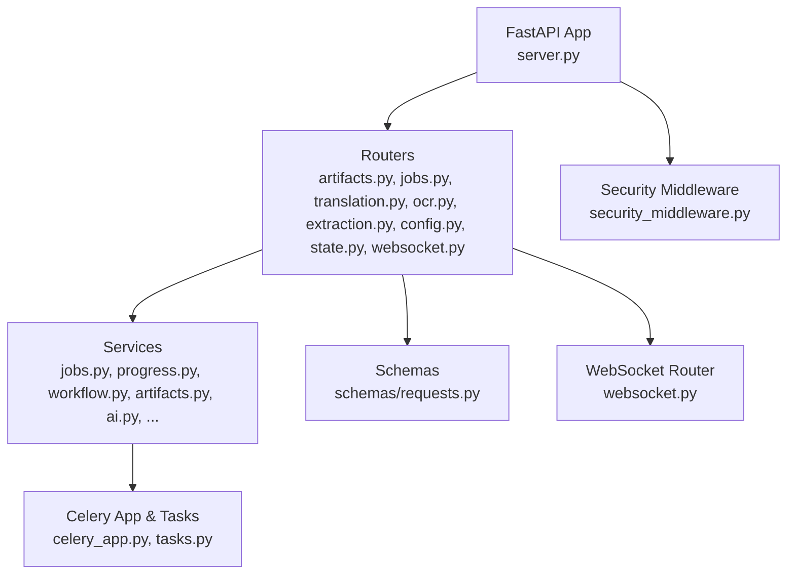
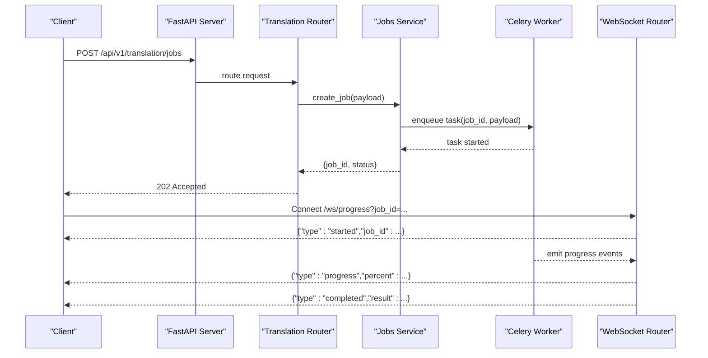
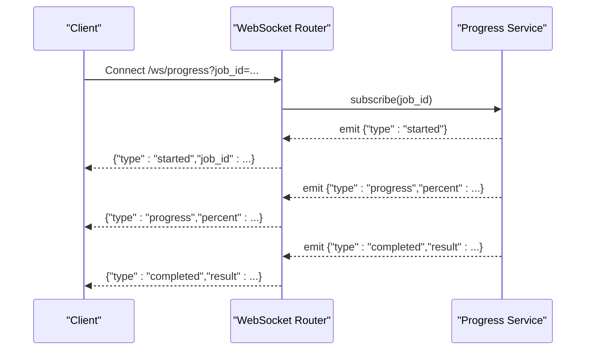
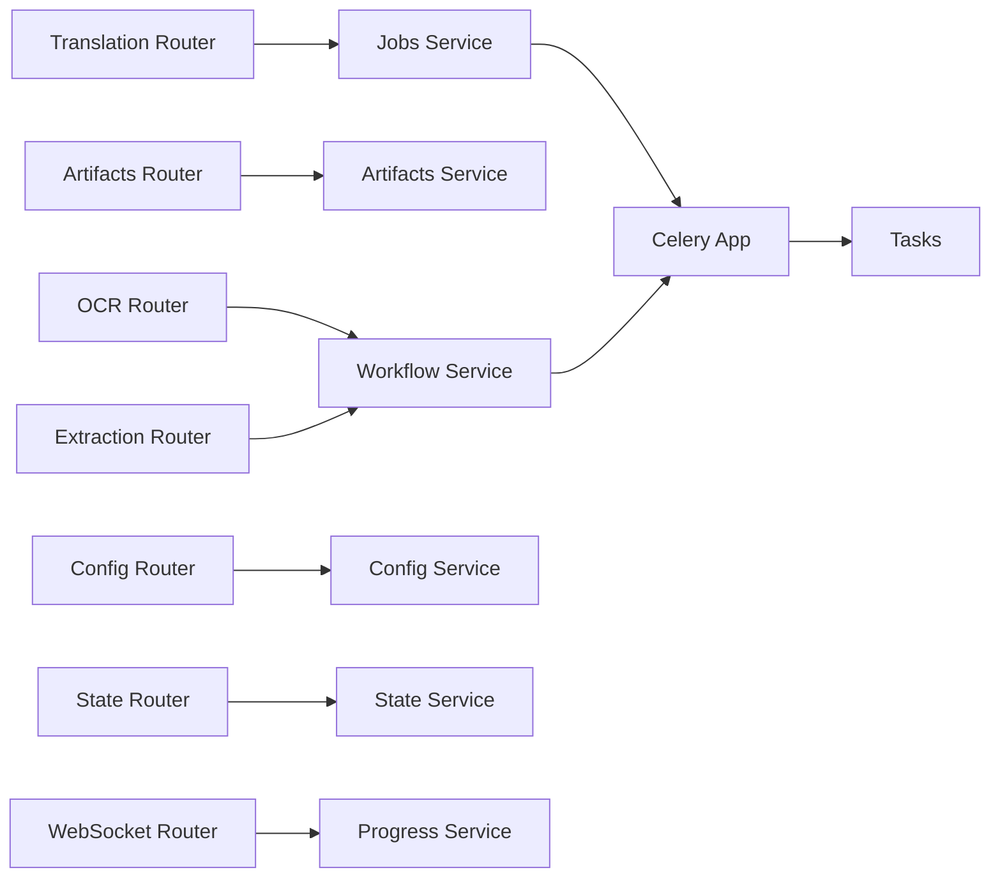

# API Reference

<cite>
**Referenced Files in This Document**
- [server.py](file://src/local_deepl/server.py)
- [routers/artifacts.py](file://src/local_deepl/api/routers/artifacts.py)
- [routers/common.py](file://src/local_deepl/api/routers/common.py)
- [routers/config.py](file://src/local_deepl/api/routers/config.py)
- [routers/extraction.py](file://src/local_deepl/api/routers/extraction.py)
- [routers/jobs.py](file://src/local_deepl/api/routers/jobs.py)
- [routers/ocr.py](file://src/local_deepl/api/routers/ocr.py)
- [routers/state.py](file://src/local_deepl/api/routers/state.py)
- [routers/translation.py](file://src/local_deepl/api/routers/translation.py)
- [routers/websocket.py](file://src/local_deepl/api/routers/websocket.py)
- [schemas/requests.py](file://src/local_deepl/api/schemas/requests.py)
- [services/security_middleware.py](file://src/local_deepl/api/services/security_middleware.py)
- [services/security_config.py](file://src/local_deepl/api/services/security_config.py)
- [services/security.py](file://src/local_deepl/api/services/security.py)
- [services/jobs.py](file://src/local_deepl/api/services/jobs.py)
- [services/progress.py](file://src/local_deepl/api/services/progress.py)
- [services/workflow.py](file://src/local_deepl/api/services/workflow.py)
- [celery_app.py](file://src/local_deepl/api/celery_app.py)
- [tasks.py](file://src/local_deepl/api/tasks.py)
</cite>

## Table of Contents
1. [Introduction](#introduction)
2. [Project Structure](#project-structure)
3. [Core Components](#core-components)
4. [Architecture Overview](#architecture-overview)
5. [Detailed Component Analysis](#detailed-component-analysis)
6. [Dependency Analysis](#dependency-analysis)
7. [Performance Considerations](#performance-considerations)
8. [Troubleshooting Guide](#troubleshooting-guide)
9. [Conclusion](#conclusion)
10. [Appendices](#appendices)

## Introduction
This document provides a comprehensive API reference for LocalDeepL’s REST and WebSocket interfaces. It covers:
- HTTP endpoints for document upload, processing, translation, job management, and artifact operations
- Request/response schemas, authentication requirements, and error codes
- WebSocket connection handling, message formats, event types, and real-time progress updates
- Authentication methods, rate limiting, pagination, and versioning strategies
- Integration patterns and client implementation guidelines with examples using curl, Python requests, and JavaScript fetch

The API is implemented as a FastAPI application with background task execution via Celery and real-time updates via WebSockets. Security middleware enforces authentication and request validation.

## Project Structure
LocalDeepL organizes its API under src/local_deepl/api with routers defining endpoints, services implementing business logic, and shared schemas for request/response models. The server entry point wires routers and middleware.

**Diagram sources**
- [server.py](file://src/local_deepl/server.py)
- [routers/artifacts.py](file://src/local_deepl/api/routers/artifacts.py)
- [routers/jobs.py](file://src/local_deepl/api/routers/jobs.py)
- [routers/translation.py](file://src/local_deepl/api/routers/translation.py)
- [routers/ocr.py](file://src/local_deepl/api/routers/ocr.py)
- [routers/extraction.py](file://src/local_deepl/api/routers/extraction.py)
- [routers/config.py](file://src/local_deepl/api/routers/config.py)
- [routers/state.py](file://src/local_deepl/api/routers/state.py)
- [routers/websocket.py](file://src/local_deepl/api/routers/websocket.py)
- [services/security_middleware.py](file://src/local_deepl/api/services/security_middleware.py)
- [services/jobs.py](file://src/local_deepl/api/services/jobs.py)
- [services/progress.py](file://src/local_deepl/api/services/progress.py)
- [services/workflow.py](file://src/local_deepl/api/services/workflow.py)
- [celery_app.py](file://src/local_deepl/api/celery_app.py)
- [tasks.py](file://src/local_deepl/api/tasks.py)

**Section sources**
- [server.py](file://src/local_deepl/server.py)
- [routers/artifacts.py](file://src/local_deepl/api/routers/artifacts.py)
- [routers/jobs.py](file://src/local_deepl/api/routers/jobs.py)
- [routers/translation.py](file://src/local_deepl/api/routers/translation.py)
- [routers/ocr.py](file://src/local_deepl/api/routers/ocr.py)
- [routers/extraction.py](file://src/local_deepl/api/routers/extraction.py)
- [routers/config.py](file://src/local_deepl/api/routers/config.py)
- [routers/state.py](file://src/local_deepl/api/routers/state.py)
- [routers/websocket.py](file://src/local_deepl/api/routers/websocket.py)
- [services/security_middleware.py](file://src/local_deepl/api/services/security_middleware.py)
- [services/jobs.py](file://src/local_deepl/api/services/jobs.py)
- [services/progress.py](file://src/local_deepl/api/services/progress.py)
- [services/workflow.py](file://src/local_deepl/api/services/workflow.py)
- [celery_app.py](file://src/local_deepl/api/celery_app.py)
- [tasks.py](file://src/local_deepl/api/tasks.py)

## Core Components
- Routers define REST endpoints and WebSocket routes. Each router groups related functionality (e.g., translation, OCR, jobs).
- Services encapsulate business logic such as job orchestration, progress tracking, and workflow execution.
- Schemas define Pydantic models for request and response bodies used across the API.
- Security middleware validates tokens and applies access control policies.
- Celery app and tasks handle long-running operations asynchronously.

Key responsibilities:
- Translation router: submit translation jobs, poll status, retrieve results
- Jobs router: manage lifecycle of jobs (create, list, get, delete)
- Artifacts router: upload, list, download, and delete artifacts associated with jobs
- OCR router: trigger OCR on documents and retrieve extracted text
- Extraction router: perform structured extraction workflows
- Config router: read/write configuration settings
- State router: query system state and health
- WebSocket router: establish connections and stream progress events

**Section sources**
- [routers/translation.py](file://src/local_deepl/api/routers/translation.py)
- [routers/jobs.py](file://src/local_deepl/api/routers/jobs.py)
- [routers/artifacts.py](file://src/local_deepl/api/routers/artifacts.py)
- [routers/ocr.py](file://src/local_deepl/api/routers/ocr.py)
- [routers/extraction.py](file://src/local_deepl/api/routers/extraction.py)
- [routers/config.py](file://src/local_deepl/api/routers/config.py)
- [routers/state.py](file://src/local_deepl/api/routers/state.py)
- [routers/websocket.py](file://src/local_deepl/api/routers/websocket.py)
- [services/jobs.py](file://src/local_deepl/api/services/jobs.py)
- [services/progress.py](file://src/local_deepl/api/services/progress.py)
- [services/workflow.py](file://src/local_deepl/api/services/workflow.py)
- [services/security_middleware.py](file://src/local_deepl/api/services/security_middleware.py)
- [schemas/requests.py](file://src/local_deepl/api/schemas/requests.py)

## Architecture Overview
The API follows a layered architecture:
- Presentation layer: FastAPI routers expose HTTP/WebSocket endpoints
- Service layer: Business logic orchestrates workflows and interacts with external systems
- Task layer: Celery executes long-running jobs asynchronously
- Security layer: Middleware validates requests and enforces policies
- Data layer: Storage for artifacts, job metadata, and progress

**Diagram sources**
- [routers/translation.py](file://src/local_deepl/api/routers/translation.py)
- [routers/websocket.py](file://src/local_deepl/api/routers/websocket.py)
- [services/jobs.py](file://src/local_deepl/api/services/jobs.py)
- [celery_app.py](file://src/local_deepl/api/celery_app.py)
- [tasks.py](file://src/local_deepl/api/tasks.py)

## Detailed Component Analysis

### Authentication and Security
Authentication is enforced by security middleware that validates tokens and controls access to endpoints. Configuration options allow enabling/disabling authentication and setting token sources.

- Token validation: middleware inspects Authorization headers or query parameters based on configuration
- Access control: certain endpoints may require specific roles or scopes
- Error responses: unauthorized or forbidden requests return appropriate HTTP status codes

Integration notes:
- Include Authorization header with bearer token when required
- Configure token source and validation rules via service configuration
- Handle 401 Unauthorized and 403 Forbidden responses

**Section sources**
- [services/security_middleware.py](file://src/local_deepl/api/services/security_middleware.py)
- [services/security_config.py](file://src/local_deepl/api/services/security_config.py)
- [services/security.py](file://src/local_deepl/api/services/security.py)

### Rate Limiting
Rate limiting can be applied at the middleware level to protect endpoints from excessive usage. Typical behaviors include:
- Per-client request quotas
- Sliding window counters
- Exponential backoff guidance in response headers

Clients should implement retry logic with jitter and respect rate limit headers.

**Section sources**
- [services/security_middleware.py](file://src/local_deepl/api/services/security_middleware.py)

### Versioning Strategy
API versioning is typically handled via URL paths (e.g., /api/v1/...). Ensure clients target the correct version prefix and monitor deprecation notices.

**Section sources**
- [routers/translation.py](file://src/local_deepl/api/routers/translation.py)
- [routers/jobs.py](file://src/local_deepl/api/routers/jobs.py)
- [routers/artifacts.py](file://src/local_deepl/api/routers/artifacts.py)
- [routers/ocr.py](file://src/local_deepl/api/routers/ocr.py)
- [routers/extraction.py](file://src/local_deepl/api/routers/extraction.py)
- [routers/config.py](file://src/local_deepl/api/routers/config.py)
- [routers/state.py](file://src/local_deepl/api/routers/state.py)

### Pagination
List endpoints support pagination via query parameters such as page and page_size. Responses include metadata indicating total count and available pages. Clients should iterate through pages until completion.

**Section sources**
- [routers/jobs.py](file://src/local_deepl/api/routers/jobs.py)
- [routers/artifacts.py](file://src/local_deepl/api/routers/artifacts.py)

### Common Response Schema
Responses follow consistent structures:
- Success: data payload with optional metadata
- Errors: standardized error object with code, message, and details

Use schemas defined in the requests module for validation and typing.

**Section sources**
- [schemas/requests.py](file://src/local_deepl/api/schemas/requests.py)

### Translation Endpoints
Primary operations:
- Submit translation job
- Retrieve job status
- Download translation result

Request/response schemas are defined in the schemas module. Status transitions include queued, processing, completed, failed.

Example flows:
- Submit job and receive job_id
- Poll status until completed
- Download artifact containing translated content

**Section sources**
- [routers/translation.py](file://src/local_deepl/api/routers/translation.py)
- [services/jobs.py](file://src/local_deepl/api/services/jobs.py)
- [services/workflow.py](file://src/local_deepl/api/services/workflow.py)

### Job Management Endpoints
Operations:
- Create job
- List jobs with pagination
- Get job details
- Delete job

Job lifecycle states are managed by the jobs service and reflected in status fields.

**Section sources**
- [routers/jobs.py](file://src/local_deepl/api/routers/jobs.py)
- [services/jobs.py](file://src/local_deepl/api/services/jobs.py)

### Artifact Operations
Artifacts represent uploaded files or generated outputs:
- Upload artifact
- List artifacts for a job
- Download artifact
- Delete artifact

File uploads use multipart/form-data; downloads return binary streams.

**Section sources**
- [routers/artifacts.py](file://src/local_deepl/api/routers/artifacts.py)

### OCR Endpoints
OCR endpoints trigger optical character recognition on documents:
- Submit OCR job
- Retrieve OCR status
- Download extracted text or annotations

Processing time depends on document complexity and OCR engine configuration.

**Section sources**
- [routers/ocr.py](file://src/local_deepl/api/routers/ocr.py)

### Extraction Endpoints
Extraction endpoints perform structured information extraction:
- Submit extraction job
- Monitor progress
- Retrieve structured output

Workflows are orchestrated by the workflow service and may involve multiple stages.

**Section sources**
- [routers/extraction.py](file://src/local_deepl/api/routers/extraction.py)
- [services/workflow.py](file://src/local_deepl/api/services/workflow.py)

### Configuration Endpoints
Configuration endpoints allow reading and updating system settings:
- Get current configuration
- Update specific settings

Changes may affect behavior of translation, OCR, and extraction workflows.

**Section sources**
- [routers/config.py](file://src/local_deepl/api/routers/config.py)

### State Endpoints
State endpoints provide system health and operational status:
- Health check
- System metrics
- Feature flags

Use these endpoints for monitoring and readiness probes.

**Section sources**
- [routers/state.py](file://src/local_deepl/api/routers/state.py)

### WebSocket API
WebSocket endpoint:
- Connection: /ws/progress?job_id={id}
- Events: started, progress, completed, failed
- Message format: JSON objects with type and payload fields

Real-time progress updates enable responsive UIs without polling.

**Diagram sources**
- [routers/websocket.py](file://src/local_deepl/api/routers/websocket.py)
- [services/progress.py](file://src/local_deepl/api/services/progress.py)

**Section sources**
- [routers/websocket.py](file://src/local_deepl/api/routers/websocket.py)
- [services/progress.py](file://src/local_deepl/api/services/progress.py)

### Background Tasks and Celery Integration
Long-running operations are executed via Celery workers:
- Tasks are enqueued from routers/services
- Workers process tasks and update progress
- Results are stored and made available via REST endpoints

Ensure Celery workers are running and configured correctly for reliable job execution.

**Section sources**
- [celery_app.py](file://src/local_deepl/api/celery_app.py)
- [tasks.py](file://src/local_deepl/api/tasks.py)

## Dependency Analysis
The API components have clear dependency relationships:
- Routers depend on services for business logic
- Services depend on Celery for async task execution
- Security middleware wraps all endpoints
- WebSocket router integrates with progress service for real-time updates

**Diagram sources**
- [routers/translation.py](file://src/local_deepl/api/routers/translation.py)
- [routers/artifacts.py](file://src/local_deepl/api/routers/artifacts.py)
- [routers/ocr.py](file://src/local_deepl/api/routers/ocr.py)
- [routers/extraction.py](file://src/local_deepl/api/routers/extraction.py)
- [routers/config.py](file://src/local_deepl/api/routers/config.py)
- [routers/state.py](file://src/local_deepl/api/routers/state.py)
- [routers/websocket.py](file://src/local_deepl/api/routers/websocket.py)
- [services/jobs.py](file://src/local_deepl/api/services/jobs.py)
- [services/workflow.py](file://src/local_deepl/api/services/workflow.py)
- [services/progress.py](file://src/local_deepl/api/services/progress.py)
- [celery_app.py](file://src/local_deepl/api/celery_app.py)
- [tasks.py](file://src/local_deepl/api/tasks.py)

**Section sources**
- [routers/translation.py](file://src/local_deepl/api/routers/translation.py)
- [routers/artifacts.py](file://src/local_deepl/api/routers/artifacts.py)
- [routers/ocr.py](file://src/local_deepl/api/routers/ocr.py)
- [routers/extraction.py](file://src/local_deepl/api/routers/extraction.py)
- [routers/config.py](file://src/local_deepl/api/routers/config.py)
- [routers/state.py](file://src/local_deepl/api/routers/state.py)
- [routers/websocket.py](file://src/local_deepl/api/routers/websocket.py)
- [services/jobs.py](file://src/local_deepl/api/services/jobs.py)
- [services/workflow.py](file://src/local_deepl/api/services/workflow.py)
- [services/progress.py](file://src/local_deepl/api/services/progress.py)
- [celery_app.py](file://src/local_deepl/api/celery_app.py)
- [tasks.py](file://src/local_deepl/api/tasks.py)

## Performance Considerations
- Use WebSocket for real-time progress updates instead of polling
- Implement client-side retries with exponential backoff for transient failures
- Batch small requests where possible to reduce overhead
- Monitor Celery worker capacity and scale horizontally if needed
- Optimize file uploads by compressing large documents before sending

[No sources needed since this section provides general guidance]

## Troubleshooting Guide
Common issues and resolutions:
- Authentication failures: verify token validity and expiration
- Rate limiting errors: implement retry logic with backoff
- Job not found: ensure correct job_id and check job lifecycle
- WebSocket disconnections: implement reconnection logic with state synchronization
- Celery worker offline: check worker health and restart if necessary

Error response structure includes:
- code: machine-readable error identifier
- message: human-readable description
- details: additional context for debugging

**Section sources**
- [services/security_middleware.py](file://src/local_deepl/api/services/security_middleware.py)
- [services/jobs.py](file://src/local_deepl/api/services/jobs.py)
- [services/progress.py](file://src/local_deepl/api/services/progress.py)

## Conclusion
LocalDeepL provides a robust API for document translation, OCR, extraction, and job management with real-time progress updates via WebSocket. The modular architecture separates concerns between routing, business logic, and task execution. Follow the integration patterns and guidelines in this document for reliable client implementations.

[No sources needed since this section summarizes without analyzing specific files]

## Appendices

### Example API Calls

#### curl Examples
- Submit translation job:
  - Method: POST
  - URL: /api/v1/translation/jobs
  - Headers: Authorization: Bearer <token>, Content-Type: application/json
  - Body: JSON payload with source language, target language, and document reference
- Check job status:
  - Method: GET
  - URL: /api/v1/jobs/{job_id}
  - Headers: Authorization: Bearer <token>
- Download artifact:
  - Method: GET
  - URL: /api/v1/artifacts/{artifact_id}/download
  - Headers: Authorization: Bearer <token>

#### Python Requests Examples
- Submit translation job:
  - Use requests.post with JSON payload and Authorization header
  - Parse response to extract job_id
- Poll job status:
  - Use requests.get with job_id in URL
  - Loop until status indicates completion
- Download artifact:
  - Use requests.get with artifact_id
  - Save binary response to file

#### JavaScript Fetch Examples
- Submit translation job:
  - Use fetch with POST method and JSON body
  - Handle response with .json()
- Connect to WebSocket:
  - Use new WebSocket('/ws/progress?job_id=' + jobId)
  - Listen for message events and handle different types
- Poll job status:
  - Use fetch with GET method
  - Implement retry logic with setTimeout

[No sources needed since this section provides example patterns without analyzing specific files]