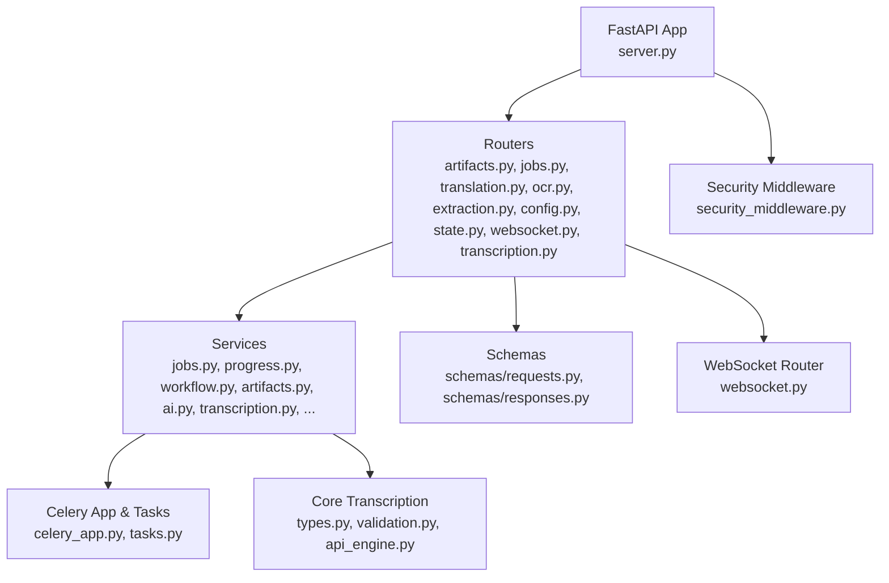
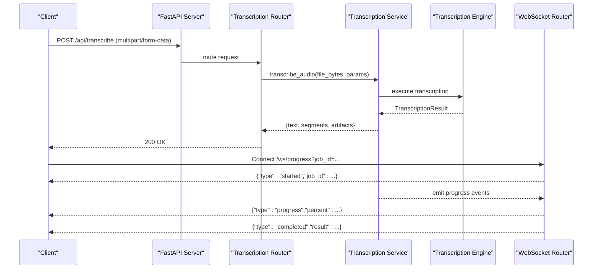
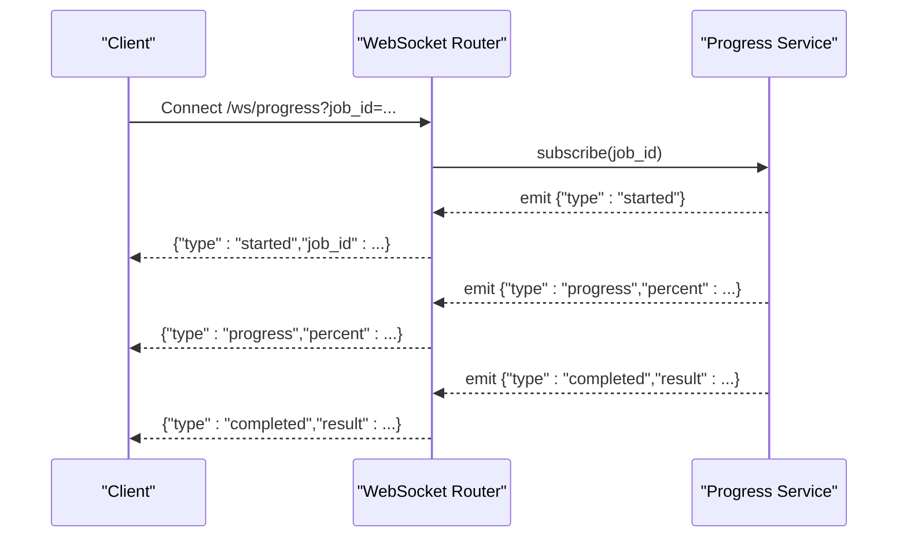
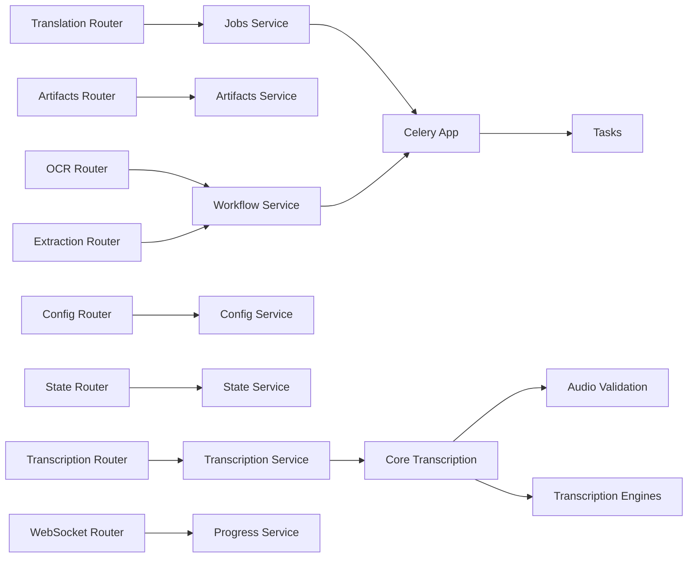

# API Reference

<cite>
**Referenced Files in This Document**
- [server.py](file://src/omniscribe/server.py)
- [routers/artifacts.py](file://src/omniscribe/api/routers/artifacts.py)
- [routers/common.py](file://src/omniscribe/api/routers/common.py)
- [routers/config.py](file://src/omniscribe/api/routers/config.py)
- [routers/extraction.py](file://src/omniscribe/api/routers/extraction.py)
- [routers/jobs.py](file://src/omniscribe/api/routers/jobs.py)
- [routers/ocr.py](file://src/omniscribe/api/routers/ocr.py)
- [routers/state.py](file://src/omniscribe/api/routers/state.py)
- [routers/transcription.py](file://src/omniscribe/api/routers/transcription.py)
- [routers/translation.py](file://src/omniscribe/api/routers/translation.py)
- [routers/websocket.py](file://src/omniscribe/api/routers/websocket.py)
- [schemas/requests.py](file://src/omniscribe/api/schemas/requests.py)
- [schemas/responses.py](file://src/omniscribe/api/schemas/responses.py)
- [services/security_middleware.py](file://src/omniscribe/api/services/security_middleware.py)
- [services/security_config.py](file://src/omniscribe/api/services/security_config.py)
- [services/security.py](file://src/omniscribe/api/services/security.py)
- [services/jobs.py](file://src/omniscribe/api/services/jobs.py)
- [services/progress.py](file://src/omniscribe/api/services/progress.py)
- [services/workflow.py](file://src/omniscribe/api/services/workflow.py)
- [services/transcription.py](file://src/omniscribe/api/services/transcription.py)
- [celery_app.py](file://src/omniscribe/api/celery_app.py)
- [tasks.py](file://src/omniscribe/api/tasks.py)
- [core/transcription/__init__.py](file://src/omniscribe/core/transcription/__init__.py)
- [core/transcription/types.py](file://src/omniscribe/core/transcription/types.py)
- [core/transcription/validation.py](file://src/omniscribe/core/transcription/validation.py)
</cite>

## Update Summary
**Changes Made**
- Added comprehensive documentation for new voice transcription API endpoints
- Documented `/api/transcribe` endpoint with multipart form data support for audio files
- Added `/api/models/transcription` endpoint for discovering available transcription models
- Added `/api/config/transcription` endpoints (GET and POST) for managing transcription configuration
- Included detailed information about supported audio formats, validation rules, and error handling
- Updated architecture diagrams to reflect the new transcription service integration

## Table of Contents
1. [Introduction](#introduction)
2. [Project Structure](#project-structure)
3. [Core Components](#core-components)
4. [Architecture Overview](#architecture-overview)
5. [Detailed Component Analysis](#detailed-component-analysis)
6. [Dependency Analysis](#dependency-analysis)
7. [Performance Considerations](#performance-considerations)
8. [Troubleshooting Guide](#troubleshooting-guide)
9. [Conclusion](#conclusion)
10. [Appendices](#appendices)

## Introduction
This document provides a comprehensive API reference for OmniScribe's REST and WebSocket interfaces. It covers:
- HTTP endpoints for document upload, processing, translation, job management, artifact operations, and **voice transcription**
- Request/response schemas, authentication requirements, and error codes
- WebSocket connection handling, message formats, event types, and real-time progress updates
- Authentication methods, rate limiting, pagination, and versioning strategies
- Integration patterns and client implementation guidelines with examples using curl, Python requests, and JavaScript fetch

The API is implemented as a FastAPI application with background task execution via Celery and real-time updates via WebSockets. Security middleware enforces authentication and request validation.

## Project Structure
OmniScribe organizes its API under src/omniscribe/api with routers defining endpoints, services implementing business logic, and shared schemas for request/response models. The server entry point wires routers and middleware.



**Diagram sources**
- [server.py](file://src/omniscribe/server.py)
- [routers/artifacts.py](file://src/omniscribe/api/routers/artifacts.py)
- [routers/jobs.py](file://src/omniscribe/api/routers/jobs.py)
- [routers/translation.py](file://src/omniscribe/api/routers/translation.py)
- [routers/ocr.py](file://src/omniscribe/api/routers/ocr.py)
- [routers/extraction.py](file://src/omniscribe/api/routers/extraction.py)
- [routers/config.py](file://src/omniscribe/api/routers/config.py)
- [routers/state.py](file://src/omniscribe/api/routers/state.py)
- [routers/transcription.py](file://src/omniscribe/api/routers/transcription.py)
- [routers/websocket.py](file://src/omniscribe/api/routers/websocket.py)
- [services/security_middleware.py](file://src/omniscribe/api/services/security_middleware.py)
- [services/jobs.py](file://src/omniscribe/api/services/jobs.py)
- [services/progress.py](file://src/omniscribe/api/services/progress.py)
- [services/workflow.py](file://src/omniscribe/api/services/workflow.py)
- [services/transcription.py](file://src/omniscribe/api/services/transcription.py)
- [celery_app.py](file://src/omniscribe/api/celery_app.py)
- [tasks.py](file://src/omniscribe/api/tasks.py)
- [core/transcription/__init__.py](file://src/omniscribe/core/transcription/__init__.py)
- [core/transcription/types.py](file://src/omniscribe/core/transcription/types.py)
- [core/transcription/validation.py](file://src/omniscribe/core/transcription/validation.py)

**Section sources**
- [server.py](file://src/omniscribe/server.py)
- [routers/artifacts.py](file://src/omniscribe/api/routers/artifacts.py)
- [routers/jobs.py](file://src/omniscribe/api/routers/jobs.py)
- [routers/translation.py](file://src/omniscribe/api/routers/translation.py)
- [routers/ocr.py](file://src/omniscribe/api/routers/ocr.py)
- [routers/extraction.py](file://src/omniscribe/api/routers/extraction.py)
- [routers/config.py](file://src/omniscribe/api/routers/config.py)
- [routers/state.py](file://src/omniscribe/api/routers/state.py)
- [routers/transcription.py](file://src/omniscribe/api/routers/transcription.py)
- [routers/websocket.py](file://src/omniscribe/api/routers/websocket.py)
- [services/security_middleware.py](file://src/omniscribe/api/services/security_middleware.py)
- [services/jobs.py](file://src/omniscribe/api/services/jobs.py)
- [services/progress.py](file://src/omniscribe/api/services/progress.py)
- [services/workflow.py](file://src/omniscribe/api/services/workflow.py)
- [services/transcription.py](file://src/omniscribe/api/services/transcription.py)
- [celery_app.py](file://src/omniscribe/api/celery_app.py)
- [tasks.py](file://src/omniscribe/api/tasks.py)
- [core/transcription/__init__.py](file://src/omniscribe/core/transcription/__init__.py)
- [core/transcription/types.py](file://src/omniscribe/core/transcription/types.py)
- [core/transcription/validation.py](file://src/omniscribe/core/transcription/validation.py)

## Core Components
- Routers define REST endpoints and WebSocket routes. Each router groups related functionality (e.g., translation, OCR, jobs, **transcription**).
- Services encapsulate business logic such as job orchestration, progress tracking, workflow execution, and **audio transcription processing**.
- Schemas define Pydantic models for request and response bodies used across the API.
- Security middleware validates tokens and applies access control policies.
- Celery app and tasks handle long-running operations asynchronously.

Key responsibilities:
- Translation router: submit translation jobs, poll status, retrieve results
- Jobs router: manage lifecycle of jobs (create, list, get, delete)
- Artifacts router: upload, list, download, and delete artifacts associated with jobs
- OCR router: trigger OCR on documents and retrieve extracted text
- Extraction router: perform structured extraction workflows
- Config router: read/write configuration settings
- State router: query system state and health
- **Transcription router: handle voice transcription, model discovery, and configuration management**
- WebSocket router: establish connections and stream progress events

**Section sources**
- [routers/translation.py](file://src/omniscribe/api/routers/translation.py)
- [routers/jobs.py](file://src/omniscribe/api/routers/jobs.py)
- [routers/artifacts.py](file://src/omniscribe/api/routers/artifacts.py)
- [routers/ocr.py](file://src/omniscribe/api/routers/ocr.py)
- [routers/extraction.py](file://src/omniscribe/api/routers/extraction.py)
- [routers/config.py](file://src/omniscribe/api/routers/config.py)
- [routers/state.py](file://src/omniscribe/api/routers/state.py)
- [routers/transcription.py](file://src/omniscribe/api/routers/transcription.py)
- [routers/websocket.py](file://src/omniscribe/api/routers/websocket.py)
- [services/jobs.py](file://src/omniscribe/api/services/jobs.py)
- [services/progress.py](file://src/omniscribe/api/services/progress.py)
- [services/workflow.py](file://src/omniscribe/api/services/workflow.py)
- [services/transcription.py](file://src/omniscribe/api/services/transcription.py)
- [services/security_middleware.py](file://src/omniscribe/api/services/security_middleware.py)
- [schemas/requests.py](file://src/omniscribe/api/schemas/requests.py)

## Architecture Overview
The API follows a layered architecture:
- Presentation layer: FastAPI routers expose HTTP/WebSocket endpoints
- Service layer: Business logic orchestrates workflows and interacts with external systems
- Task layer: Celery executes long-running jobs asynchronously
- Security layer: Middleware validates requests and enforces policies
- Data layer: Storage for artifacts, job metadata, and progress



**Diagram sources**
- [routers/transcription.py](file://src/omniscribe/api/routers/transcription.py)
- [routers/websocket.py](file://src/omniscribe/api/routers/websocket.py)
- [services/transcription.py](file://src/omniscribe/api/services/transcription.py)
- [core/transcription/types.py](file://src/omniscribe/core/transcription/types.py)
- [celery_app.py](file://src/omniscribe/api/celery_app.py)
- [tasks.py](file://src/omniscribe/api/tasks.py)

## Detailed Component Analysis

### Authentication and Security
Authentication is enforced by security middleware that validates tokens and controls access to endpoints. Configuration options allow enabling/disabling authentication and setting token sources. Per-service authentication tokens are supported for OCR, translation, and transcription namespaces.

- Token validation: middleware inspects Authorization headers or query parameters based on configuration
- Access control: certain endpoints may require specific roles or scopes
- Error responses: unauthorized or forbidden requests return appropriate HTTP status codes
- **Per-service tokens**: separate authentication tokens can be configured for transcription endpoints

Integration notes:
- Include Authorization header with bearer token when required
- Configure token source and validation rules via service configuration
- Handle 401 Unauthorized and 403 Forbidden responses
- **Use transcription-specific tokens for enhanced security isolation**

**Section sources**
- [services/security_middleware.py](file://src/omniscribe/api/services/security_middleware.py)
- [services/security_config.py](file://src/omniscribe/api/services/security_config.py)
- [services/security.py](file://src/omniscribe/api/services/security.py)
- [server.py](file://src/omniscribe/server.py)

### Rate Limiting
Rate limiting can be applied at the middleware level to protect endpoints from excessive usage. Typical behaviors include:
- Per-client request quotas
- Sliding window counters
- Exponential backoff guidance in response headers

Clients should implement retry logic with jitter and respect rate limit headers.

**Section sources**
- [services/security_middleware.py](file://src/omniscribe/api/services/security_middleware.py)

### Versioning Strategy
API versioning is typically handled via URL paths (e.g., /api/v1/...). Ensure clients target the correct version prefix and monitor deprecation notices.

**Section sources**
- [routers/translation.py](file://src/omniscribe/api/routers/translation.py)
- [routers/jobs.py](file://src/omniscribe/api/routers/jobs.py)
- [routers/artifacts.py](file://src/omniscribe/api/routers/artifacts.py)
- [routers/ocr.py](file://src/omniscribe/api/routers/ocr.py)
- [routers/extraction.py](file://src/omniscribe/api/routers/extraction.py)
- [routers/config.py](file://src/omniscribe/api/routers/config.py)
- [routers/state.py](file://src/omniscribe/api/routers/state.py)
- [routers/transcription.py](file://src/omniscribe/api/routers/transcription.py)

### Pagination
List endpoints support pagination via query parameters such as page and page_size. Responses include metadata indicating total count and available pages. Clients should iterate through pages until completion.

**Section sources**
- [routers/jobs.py](file://src/omniscribe/api/routers/jobs.py)
- [routers/artifacts.py](file://src/omniscribe/api/routers/artifacts.py)

### Common Response Schema
Responses follow consistent structures:
- Success: data payload with optional metadata
- Errors: standardized error object with code, message, and details

Use schemas defined in the requests module for validation and typing.

**Section sources**
- [schemas/requests.py](file://src/omniscribe/api/schemas/requests.py)
- [schemas/responses.py](file://src/omniscribe/api/schemas/responses.py)

### Voice Transcription Endpoints
**New Feature**: Comprehensive voice transcription capabilities with multiple engine support and real-time progress updates.

#### Audio Upload and Transcription (`POST /api/transcribe`)
Accepts audio files in various formats and performs speech-to-text conversion:

**Request Parameters (multipart/form-data)**:
- `file`: Required audio file (supports .mp3, .wav, .m4a, .flac, .ogg, .webm, .aac, .opus, .mp4)
- `model`: Optional model name (default: whisper-1)
- `engine`: Optional engine type (api, whisper_api, local, whisper_local, auto)
- `api_base`: Optional API base URL (default: https://api.openai.com/v1)
- `api_key`: Optional API key for external services
- `language`: Optional language code for transcription
- `prompt`: Optional prompt for guiding transcription
- `temperature`: Optional temperature parameter (0.0-2.0, default: 0.0)
- `channel_id`: Optional channel ID for real-time progress updates

**Response Schema**:
```json
{
  "text": "transcribed text content",
  "language": "detected language code",
  "duration": 123.456,
  "text_artifact_id": "artifact_id_for_text",
  "text_artifact_token": "token_for_access",
  "metadata_artifact_id": "artifact_id_for_metadata",
  "metadata_artifact_token": "token_for_metadata_access",
  "job_id": "unique_job_identifier",
  "segments": [
    {
      "id": 0,
      "start": 0.0,
      "end": 2.5,
      "text": "first segment text",
      "confidence": 0.98
    }
  ]
}
```

**Error Handling**:
- 400: Invalid audio filename or empty file
- 413: File size exceeds maximum (default 100MB)
- 415: Unsupported audio format or MIME type
- 500: Internal transcription errors

#### Model Discovery (`GET /api/models/transcription`)
Retrieves available transcription models from the configured backend:

**Response Schema**:
```json
{
  "models": ["whisper-1", "whisper-large-v3", "whisper-medium", "whisper-base", "whisper-small", "whisper-tiny"],
  "error": null
}
```

#### Configuration Management (`GET /api/config/transcription`, `POST /api/config/transcription`)
Manages runtime configuration for voice transcription:

**GET Response Schema**:
```json
{
  "transcription_api_base": "https://api.openai.com/v1",
  "transcription_api_key": "****masked****",
  "transcription_model": "whisper-1",
  "transcription_engine": "api",
  "transcription_auth_token": "****masked****",
  "language": null,
  "prompt": null,
  "temperature": 0.0
}
```

**POST Request Schema**:
```json
{
  "api_base": "https://custom-api.example.com/v1",
  "api_key": "your-api-key-here",
  "transcription_api_key": "alternative-api-key",
  "model": "whisper-large-v3",
  "engine": "local",
  "language": "en",
  "prompt": "Please transcribe this audio clearly",
  "temperature": 0.1
}
```

**Supported Audio Formats**:
- Extensions: .mp3, .wav, .m4a, .flac, .ogg, .webm, .aac, .opus, .mp4
- MIME Types: audio/mpeg, audio/wav, audio/mp4, audio/m4a, audio/flac, audio/ogg, audio/webm, audio/aac, audio/opus, video/mp4, video/webm

**Section sources**
- [routers/transcription.py](file://src/omniscribe/api/routers/transcription.py)
- [services/transcription.py](file://src/omniscribe/api/services/transcription.py)
- [core/transcription/validation.py](file://src/omniscribe/core/transcription/validation.py)
- [core/transcription/types.py](file://src/omniscribe/core/transcription/types.py)
- [schemas/requests.py](file://src/omniscribe/api/schemas/requests.py)
- [schemas/responses.py](file://src/omniscribe/api/schemas/responses.py)

### Job Management Endpoints
Operations:
- Create job
- List jobs with pagination
- Get job details
- Delete job

Job lifecycle states are managed by the jobs service and reflected in status fields.

**Section sources**
- [routers/jobs.py](file://src/omniscribe/api/routers/jobs.py)
- [services/jobs.py](file://src/omniscribe/api/services/jobs.py)

### Artifact Operations
Artifacts represent uploaded files or generated outputs:
- Upload artifact
- List artifacts for a job
- Download artifact
- Delete artifact

File uploads use multipart/form-data; downloads return binary streams.

**Section sources**
- [routers/artifacts.py](file://src/omniscribe/api/routers/artifacts.py)

### OCR Endpoints
OCR endpoints trigger optical character recognition on documents:
- Submit OCR job
- Retrieve OCR status
- Download extracted text or annotations

Processing time depends on document complexity and OCR engine configuration.

**Section sources**
- [routers/ocr.py](file://src/omniscribe/api/routers/ocr.py)

### Extraction Endpoints
Extraction endpoints perform structured information extraction:
- Submit extraction job
- Monitor progress
- Retrieve structured output

Workflows are orchestrated by the workflow service and may involve multiple stages.

**Section sources**
- [routers/extraction.py](file://src/omniscribe/api/routers/extraction.py)
- [services/workflow.py](file://src/omniscribe/api/services/workflow.py)

### Configuration Endpoints
Configuration endpoints allow reading and updating system settings:
- Get current configuration
- Update specific settings

Changes may affect behavior of translation, OCR, and extraction workflows.

**Section sources**
- [routers/config.py](file://src/omniscribe/api/routers/config.py)

### State Endpoints
State endpoints provide system health and operational status:
- Health check
- System metrics
- Feature flags

Use these endpoints for monitoring and readiness probes.

**Section sources**
- [routers/state.py](file://src/omniscribe/api/routers/state.py)

### WebSocket API
WebSocket endpoint:
- Connection: /ws/progress?job_id={id}
- Events: started, progress, completed, failed
- Message format: JSON objects with type and payload fields

Real-time progress updates enable responsive UIs without polling.



**Diagram sources**
- [routers/websocket.py](file://src/omniscribe/api/routers/websocket.py)
- [services/progress.py](file://src/omniscribe/api/services/progress.py)

**Section sources**
- [routers/websocket.py](file://src/omniscribe/api/routers/websocket.py)
- [services/progress.py](file://src/omniscribe/api/services/progress.py)

### Background Tasks and Celery Integration
Long-running operations are executed via Celery workers:
- Tasks are enqueued from routers/services
- Workers process tasks and update progress
- Results are stored and made available via REST endpoints

Ensure Celery workers are running and configured correctly for reliable job execution.

**Section sources**
- [celery_app.py](file://src/omniscribe/api/celery_app.py)
- [tasks.py](file://src/omniscribe/api/tasks.py)

## Dependency Analysis
The API components have clear dependency relationships:
- Routers depend on services for business logic
- Services depend on Celery for async task execution
- Security middleware wraps all endpoints
- WebSocket router integrates with progress service for real-time updates
- **Transcription service integrates with core transcription engines and validation modules**



**Diagram sources**
- [routers/translation.py](file://src/omniscribe/api/routers/translation.py)
- [routers/artifacts.py](file://src/omniscribe/api/routers/artifacts.py)
- [routers/ocr.py](file://src/omniscribe/api/routers/ocr.py)
- [routers/extraction.py](file://src/omniscribe/api/routers/extraction.py)
- [routers/config.py](file://src/omniscribe/api/routers/config.py)
- [routers/state.py](file://src/omniscribe/api/routers/state.py)
- [routers/transcription.py](file://src/omniscribe/api/routers/transcription.py)
- [routers/websocket.py](file://src/omniscribe/api/routers/websocket.py)
- [services/jobs.py](file://src/omniscribe/api/services/jobs.py)
- [services/workflow.py](file://src/omniscribe/api/services/workflow.py)
- [services/transcription.py](file://src/omniscribe/api/services/transcription.py)
- [services/progress.py](file://src/omniscribe/api/services/progress.py)
- [core/transcription/__init__.py](file://src/omniscribe/core/transcription/__init__.py)
- [core/transcription/validation.py](file://src/omniscribe/core/transcription/validation.py)
- [celery_app.py](file://src/omniscribe/api/celery_app.py)
- [tasks.py](file://src/omniscribe/api/tasks.py)

**Section sources**
- [routers/translation.py](file://src/omniscribe/api/routers/translation.py)
- [routers/artifacts.py](file://src/omniscribe/api/routers/artifacts.py)
- [routers/ocr.py](file://src/omniscribe/api/routers/ocr.py)
- [routers/extraction.py](file://src/omniscribe/api/routers/extraction.py)
- [routers/config.py](file://src/omniscribe/api/routers/config.py)
- [routers/state.py](file://src/omniscribe/api/routers/state.py)
- [routers/transcription.py](file://src/omniscribe/api/routers/transcription.py)
- [routers/websocket.py](file://src/omniscribe/api/routers/websocket.py)
- [services/jobs.py](file://src/omniscribe/api/services/jobs.py)
- [services/workflow.py](file://src/omniscribe/api/services/workflow.py)
- [services/transcription.py](file://src/omniscribe/api/services/transcription.py)
- [services/progress.py](file://src/omniscribe/api/services/progress.py)
- [celery_app.py](file://src/omniscribe/api/celery_app.py)
- [tasks.py](file://src/omniscribe/api/tasks.py)

## Performance Considerations
- Use WebSocket for real-time progress updates instead of polling
- Implement client-side retries with exponential backoff for transient failures
- Batch small requests where possible to reduce overhead
- Monitor Celery worker capacity and scale horizontally if needed
- Optimize file uploads by compressing large documents before sending
- **Configure appropriate audio file size limits based on deployment needs**
- **Use appropriate transcription engines based on performance requirements**

## Troubleshooting Guide
Common issues and resolutions:
- Authentication failures: verify token validity and expiration
- Rate limiting errors: implement retry logic with backoff
- Job not found: ensure correct job_id and check job lifecycle
- WebSocket disconnections: implement reconnection logic with state synchronization
- Celery worker offline: check worker health and restart if necessary
- **Audio validation errors: verify file format, MIME type, and size constraints**
- **Transcription engine failures: check engine configuration and connectivity**

Error response structure includes:
- code: machine-readable error identifier
- message: human-readable description
- details: additional context for debugging

**Section sources**
- [services/security_middleware.py](file://src/omniscribe/api/services/security_middleware.py)
- [services/jobs.py](file://src/omniscribe/api/services/jobs.py)
- [services/progress.py](file://src/omniscribe/api/services/progress.py)
- [core/transcription/validation.py](file://src/omniscribe/core/transcription/validation.py)

## Conclusion
OmniScribe provides a robust API for document translation, OCR, extraction, job management, and **voice transcription** with real-time progress updates via WebSocket. The modular architecture separates concerns between routing, business logic, and task execution. The new transcription capabilities support multiple audio formats, configurable engines, and comprehensive error handling. Follow the integration patterns and guidelines in this document for reliable client implementations.

## Appendices

### Example API Calls

#### curl Examples
- Submit translation job:
  - Method: POST
  - URL: /api/v1/translation/jobs
  - Headers: Authorization: Bearer <token>, Content-Type: application/json
  - Body: JSON payload with source language, target language, and document reference
- Check job status:
  - Method: GET
  - URL: /api/v1/jobs/{job_id}
  - Headers: Authorization: Bearer <token>
- Download artifact:
  - Method: GET
  - URL: /api/v1/artifacts/{artifact_id}/download
  - Headers: Authorization: Bearer <token>
- **Upload audio for transcription:**
  - Method: POST
  - URL: /api/transcribe
  - Headers: Authorization: Bearer <token>
  - Body: multipart/form-data with file field containing audio file
- **Get transcription models:**
  - Method: GET
  - URL: /api/models/transcription
  - Headers: Authorization: Bearer <token>
- **Update transcription configuration:**
  - Method: POST
  - URL: /api/config/transcription
  - Headers: Authorization: Bearer <token>, Content-Type: application/json
  - Body: JSON with transcription configuration parameters

#### Python Requests Examples
- Submit translation job:
  - Use requests.post with JSON payload and Authorization header
  - Parse response to extract job_id
- Poll job status:
  - Use requests.get with job_id in URL
  - Loop until status indicates completion
- Download artifact:
  - Use requests.get with artifact_id
  - Save binary response to file
- **Upload audio for transcription:**
  - Use requests.post with files parameter for multipart upload
  - Handle response with transcription results and artifact IDs
- **Get transcription models:**
  - Use requests.get and parse models list from response
- **Update transcription configuration:**
  - Use requests.post with JSON body containing configuration parameters

#### JavaScript Fetch Examples
- Submit translation job:
  - Use fetch with POST method and JSON body
  - Handle response with .json()
- Connect to WebSocket:
  - Use new WebSocket('/ws/progress?job_id=' + jobId)
  - Listen for message events and handle different types
- Poll job status:
  - Use fetch with GET method
  - Implement retry logic with setTimeout
- **Upload audio for transcription:**
  - Use FormData object with audio file
  - Handle streaming response for large files
- **Get transcription models:**
  - Use fetch GET request and parse models array
- **Update transcription configuration:**
  - Use fetch POST with JSON configuration object

[No sources needed since this section provides example patterns without analyzing specific files]