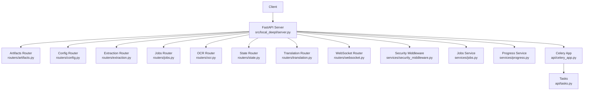
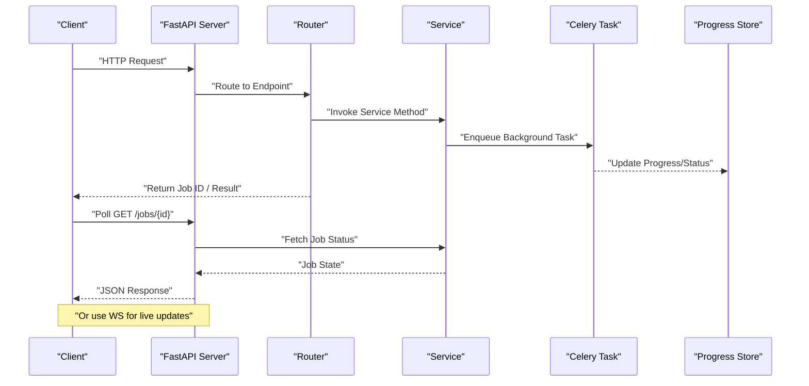
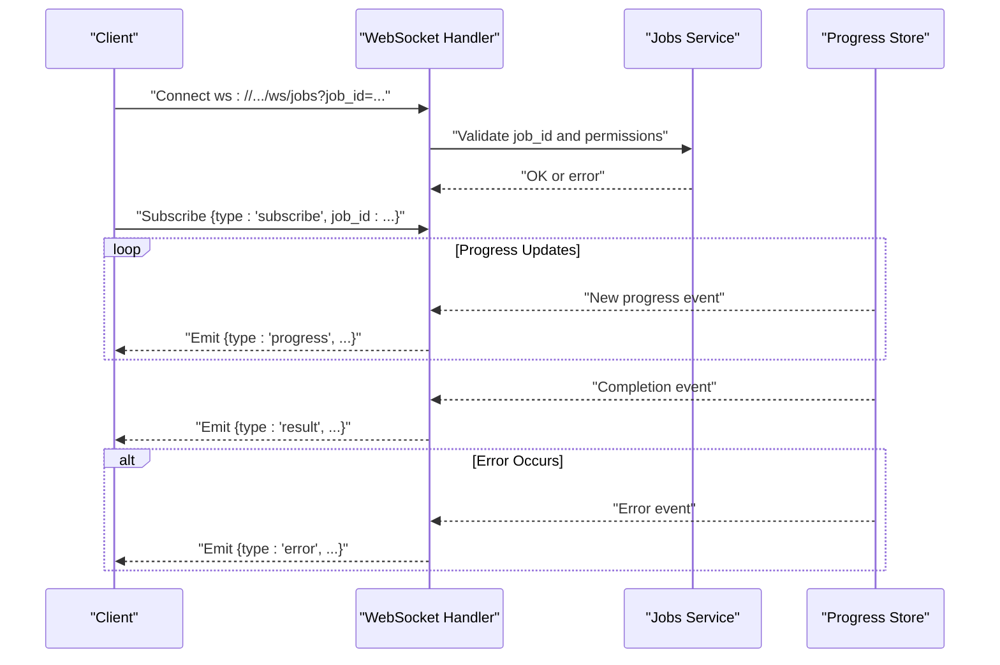
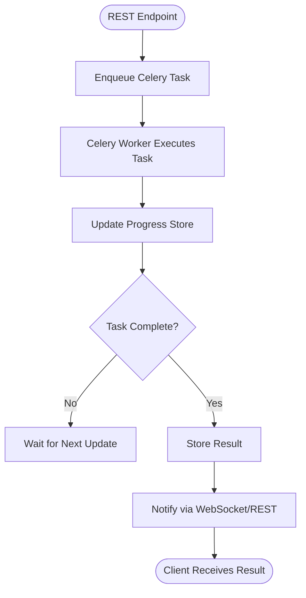
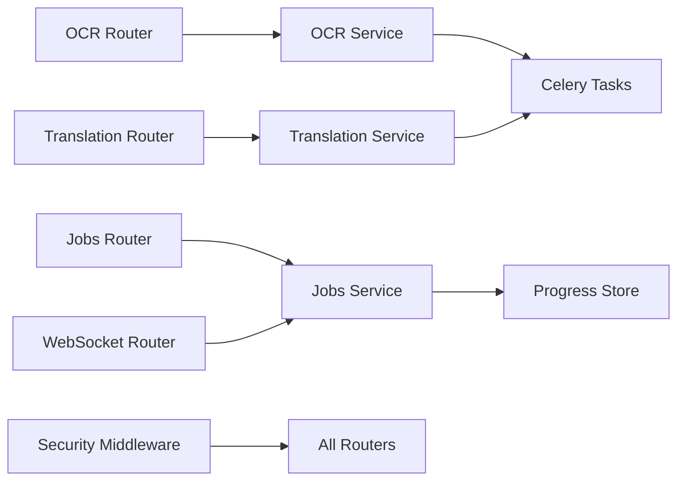

# API Reference

<cite>
**Referenced Files in This Document**
- [server.py](file://src/local_deepl/server.py)
- [routers/artifacts.py](file://src/local_deepl/api/routers/artifacts.py)
- [routers/common.py](file://src/local_deepl/api/routers/common.py)
- [routers/config.py](file://src/local_deepl/api/routers/config.py)
- [routers/extraction.py](file://src/local_deepl/api/routers/extraction.py)
- [routers/jobs.py](file://src/local_deepl/api/routers/jobs.py)
- [routers/ocr.py](file://src/local_deepl/api/routers/ocr.py)
- [routers/state.py](file://src/local_deepl/api/routers/state.py)
- [routers/translation.py](file://src/local_deepl/api/routers/translation.py)
- [routers/websocket.py](file://src/local_deepl/api/routers/websocket.py)
- [schemas/requests.py](file://src/local_deepl/api/schemas/requests.py)
- [services/security_middleware.py](file://src/local_deepl/api/services/security_middleware.py)
- [services/security_config.py](file://src/local_deepl/api/services/security_config.py)
- [services/jobs.py](file://src/local_deepl/api/services/jobs.py)
- [services/progress.py](file://src/local_deepl/api/services/progress.py)
- [celery_app.py](file://src/local_deepl/api/celery_app.py)
- [tasks.py](file://src/local_deepl/api/tasks.py)
</cite>

## Table of Contents
1. [Introduction](#introduction)
2. [Project Structure](#project-structure)
3. [Core Components](#core-components)
4. [Architecture Overview](#architecture-overview)
5. [Detailed Component Analysis](#detailed-component-analysis)
6. [Dependency Analysis](#dependency-analysis)
7. [Performance Considerations](#performance-considerations)
8. [Troubleshooting Guide](#troubleshooting-guide)
9. [Conclusion](#conclusion)
10. [Appendices](#appendices)

## Introduction
This document provides a comprehensive API reference for LocalDeepL’s REST and WebSocket interfaces. It covers HTTP endpoints for document upload, OCR processing, translation, job management, and artifact retrieval; and the WebSocket interface for real-time progress tracking and status updates. It also includes authentication, error handling, rate limiting, versioning guidance, client implementation tips, and performance optimization recommendations.

## Project Structure
LocalDeepL exposes its APIs through FastAPI routers under src/local_deepl/api/routers. The application server wires these routers and optional middleware (security, CORS, etc.). Background jobs are handled via Celery tasks, and progress is surfaced through both REST polling and WebSocket events.

**Diagram sources**
- [server.py](file://src/local_deepl/server.py)
- [routers/artifacts.py](file://src/local_deepl/api/routers/artifacts.py)
- [routers/config.py](file://src/local_deepl/api/routers/config.py)
- [routers/extraction.py](file://src/local_deepl/api/routers/extraction.py)
- [routers/jobs.py](file://src/local_deepl/api/routers/jobs.py)
- [routers/ocr.py](file://src/local_deepl/api/routers/ocr.py)
- [routers/state.py](file://src/local_deepl/api/routers/state.py)
- [routers/translation.py](file://src/local_deepl/api/routers/translation.py)
- [routers/websocket.py](file://src/local_deepl/api/routers/websocket.py)
- [services/security_middleware.py](file://src/local_deepl/api/services/security_middleware.py)
- [services/jobs.py](file://src/local_deepl/api/services/jobs.py)
- [services/progress.py](file://src/local_deepl/api/services/progress.py)
- [celery_app.py](file://src/local_deepl/api/celery_app.py)
- [tasks.py](file://src/local_deepl/api/tasks.py)

**Section sources**
- [server.py](file://src/local_deepl/server.py)
- [routers/artifacts.py](file://src/local_deepl/api/routers/artifacts.py)
- [routers/config.py](file://src/local_deepl/api/routers/config.py)
- [routers/extraction.py](file://src/local_deepl/api/routers/extraction.py)
- [routers/jobs.py](file://src/local_deepl/api/routers/jobs.py)
- [routers/ocr.py](file://src/local_deepl/api/routers/ocr.py)
- [routers/state.py](file://src/local_deepl/api/routers/state.py)
- [routers/translation.py](file://src/local_deepl/api/routers/translation.py)
- [routers/websocket.py](file://src/local_deepl/api/routers/websocket.py)
- [services/security_middleware.py](file://src/local_deepl/api/services/security_middleware.py)
- [services/jobs.py](file://src/local_deepl/api/services/jobs.py)
- [services/progress.py](file://src/local_deepl/api/services/progress.py)
- [celery_app.py](file://src/local_deepl/api/celery_app.py)
- [tasks.py](file://src/local_deepl/api/tasks.py)

## Core Components
- REST Routers: Define HTTP endpoints grouped by feature (artifacts, config, extraction, jobs, ocr, state, translation).
- Schemas: Pydantic models defining request/response structures used across endpoints.
- Services: Business logic and shared utilities (jobs, progress, security).
- Celery Integration: Asynchronous task execution for long-running operations.
- WebSocket Interface: Real-time event streaming for progress and status.

Key responsibilities:
- Authentication and authorization are enforced via security middleware and configuration.
- Job lifecycle management coordinates background tasks and progress updates.
- OCR and translation endpoints orchestrate processing pipelines and return structured results.
- Artifacts endpoint manages storage and retrieval of intermediate or final artifacts.

**Section sources**
- [routers/artifacts.py](file://src/local_deepl/api/routers/artifacts.py)
- [routers/config.py](file://src/local_deepl/api/routers/config.py)
- [routers/extraction.py](file://src/local_deepl/api/routers/extraction.py)
- [routers/jobs.py](file://src/local_deepl/api/routers/jobs.py)
- [routers/ocr.py](file://src/local_deepl/api/routers/ocr.py)
- [routers/state.py](file://src/local_deepl/api/routers/state.py)
- [routers/translation.py](file://src/local_deepl/api/routers/translation.py)
- [routers/websocket.py](file://src/local_deepl/api/routers/websocket.py)
- [schemas/requests.py](file://src/local_deepl/api/schemas/requests.py)
- [services/jobs.py](file://src/local_deepl/api/services/jobs.py)
- [services/progress.py](file://src/local_deepl/api/services/progress.py)
- [services/security_middleware.py](file://src/local_deepl/api/services/security_middleware.py)
- [services/security_config.py](file://src/local_deepl/api/services/security_config.py)
- [celery_app.py](file://src/local_deepl/api/celery_app.py)
- [tasks.py](file://src/local_deepl/api/tasks.py)

## Architecture Overview
The API follows a layered architecture:
- Presentation layer: FastAPI routers expose REST and WebSocket endpoints.
- Application layer: Services implement business logic and coordinate workflows.
- Infrastructure layer: Celery executes background tasks; progress service tracks state; security middleware enforces access control.

**Diagram sources**
- [routers/jobs.py](file://src/local_deepl/api/routers/jobs.py)
- [services/jobs.py](file://src/local_deepl/api/services/jobs.py)
- [services/progress.py](file://src/local_deepl/api/services/progress.py)
- [celery_app.py](file://src/local_deepl/api/celery_app.py)
- [tasks.py](file://src/local_deepl/api/tasks.py)

## Detailed Component Analysis

### Authentication and Security
- Security middleware validates requests based on configured rules and headers.
- Security configuration defines allowed origins, headers, and credentials policies.
- Endpoints may require tokens or API keys depending on configuration.

Implementation highlights:
- Middleware applies authorization checks before routing to endpoints.
- Configuration-driven policy allows flexible deployment modes (open, token-based, CORS-restricted).

**Section sources**
- [services/security_middleware.py](file://src/local_deepl/api/services/security_middleware.py)
- [services/security_config.py](file://src/local_deepl/api/services/security_config.py)

### REST Endpoints

#### Artifacts
- Purpose: Upload, list, retrieve, and delete artifacts produced by OCR/translation pipelines.
- Typical methods:
  - POST /artifacts/upload: Upload an artifact file with metadata.
  - GET /artifacts/{artifact_id}: Retrieve artifact content or metadata.
  - DELETE /artifacts/{artifact_id}: Remove an artifact.
- Request/Response schemas: Defined in request schemas module; responses include artifact identifiers, URLs, and status codes.
- Error handling: Returns standard HTTP error codes for invalid IDs, missing files, and permission errors.

**Section sources**
- [routers/artifacts.py](file://src/local_deepl/api/routers/artifacts.py)
- [schemas/requests.py](file://src/local_deepl/api/schemas/requests.py)

#### Config
- Purpose: Read and update runtime configuration exposed to clients.
- Typical methods:
  - GET /config: Return current configuration snapshot.
  - PUT /config: Update specific configuration fields (if enabled).
- Request/Response schemas: Typed configuration objects; partial updates supported where applicable.
- Error handling: Validation errors for malformed payloads; forbidden if write operations are disabled.

**Section sources**
- [routers/config.py](file://src/local_deepl/api/routers/config.py)
- [schemas/requests.py](file://src/local_deepl/api/schemas/requests.py)

#### Extraction
- Purpose: Extract structured information from documents (e.g., tables, sections, reading order).
- Typical methods:
  - POST /extraction: Submit a document for extraction with options.
  - GET /extraction/{job_id}: Poll extraction job status and result.
- Request/Response schemas: Input includes document bytes or URL; output includes extracted structures and confidence metrics.
- Error handling: Invalid input formats, unsupported document types, and pipeline failures.

**Section sources**
- [routers/extraction.py](file://src/local_deepl/api/routers/extraction.py)
- [schemas/requests.py](file://src/local_deepl/api/schemas/requests.py)

#### Jobs
- Purpose: Manage asynchronous jobs for OCR, translation, and other long-running tasks.
- Typical methods:
  - POST /jobs: Create a new job with parameters.
  - GET /jobs/{job_id}: Retrieve job status and result when complete.
  - GET /jobs: List recent jobs with filters.
  - DELETE /jobs/{job_id}: Cancel or remove a job.
- Request/Response schemas: Job creation payload includes task type, inputs, and options; responses include job ID, status, timestamps, and result references.
- Error handling: Duplicate job prevention, invalid parameters, and resource limits.

**Section sources**
- [routers/jobs.py](file://src/local_deepl/api/routers/jobs.py)
- [services/jobs.py](file://src/local_deepl/api/services/jobs.py)
- [schemas/requests.py](file://src/local_deepl/api/schemas/requests.py)

#### OCR
- Purpose: Perform optical character recognition on images or PDFs.
- Typical methods:
  - POST /ocr: Submit image/PDF for OCR with language and layout options.
  - GET /ocr/{job_id}: Poll OCR job status and text output.
- Request/Response schemas: Input includes binary data or file path; output includes recognized text, bounding boxes, and confidence scores.
- Error handling: Unsupported formats, corrupted files, and OCR engine failures.

**Section sources**
- [routers/ocr.py](file://src/local_deepl/api/routers/ocr.py)
- [schemas/requests.py](file://src/local_deepl/api/schemas/requests.py)

#### State
- Purpose: Query system state, health, and capabilities.
- Typical methods:
  - GET /state: Return system readiness, available features, and resource usage.
- Request/Response schemas: Lightweight status object indicating operational state.
- Error handling: Minimal; returns internal errors if core services are unavailable.

**Section sources**
- [routers/state.py](file://src/local_deepl/api/routers/state.py)
- [schemas/requests.py](file://src/local_deepl/api/schemas/requests.py)

#### Translation
- Purpose: Translate text or extracted content between languages.
- Typical methods:
  - POST /translation: Submit text or structured content for translation.
  - GET /translation/{job_id}: Retrieve translation job status and translated output.
- Request/Response schemas: Input includes source text, target language, and style options; output includes translated text and metadata.
- Error handling: Invalid language pairs, excessive input size, and translation engine errors.

**Section sources**
- [routers/translation.py](file://src/local_deepl/api/routers/translation.py)
- [schemas/requests.py](file://src/local_deepl/api/schemas/requests.py)

### WebSocket Interface
- Purpose: Real-time progress and status updates for long-running jobs.
- Connection:
  - Establish connection to ws://host/ws/jobs?job_id={job_id}.
  - Authenticate using query parameters or headers as configured.
- Message Format:
  - Client sends: {"type": "subscribe", "job_id": "..."}
  - Server emits: {"type": "progress", "job_id": "...", "status": "...", "percent": number}
  - Server emits: {"type": "result", "job_id": "...", "data": {...}}
  - Server emits: {"type": "error", "job_id": "...", "message": "..."}
- Event Types:
  - subscribe: Client subscribes to a job’s events.
  - progress: Periodic progress updates during processing.
  - result: Final result payload upon completion.
  - error: Error notifications with details.
- Disconnection Handling:
  - Reconnect with backoff strategy.
  - Resume subscription if server retains state.

**Diagram sources**
- [routers/websocket.py](file://src/local_deepl/api/routers/websocket.py)
- [services/jobs.py](file://src/local_deepl/api/services/jobs.py)
- [services/progress.py](file://src/local_deepl/api/services/progress.py)

**Section sources**
- [routers/websocket.py](file://src/local_deepl/api/routers/websocket.py)
- [services/jobs.py](file://src/local_deepl/api/services/jobs.py)
- [services/progress.py](file://src/local_deepl/api/services/progress.py)

### Background Jobs and Celery Integration
- Enqueueing: REST endpoints enqueue Celery tasks for long-running operations.
- Execution: Celery workers process tasks and update progress store.
- Completion: Results are stored and made accessible via job queries or WebSocket events.

**Diagram sources**
- [celery_app.py](file://src/local_deepl/api/celery_app.py)
- [tasks.py](file://src/local_deepl/api/tasks.py)
- [services/progress.py](file://src/local_deepl/api/services/progress.py)

**Section sources**
- [celery_app.py](file://src/local_deepl/api/celery_app.py)
- [tasks.py](file://src/local_deepl/api/tasks.py)
- [services/progress.py](file://src/local_deepl/api/services/progress.py)

## Dependency Analysis
- Routers depend on services for business logic and validation.
- Services depend on progress store and Celery for async execution.
- Security middleware wraps all routes to enforce access control.
- WebSocket handler depends on jobs service and progress store for real-time updates.

**Diagram sources**
- [routers/ocr.py](file://src/local_deepl/api/routers/ocr.py)
- [routers/translation.py](file://src/local_deepl/api/routers/translation.py)
- [routers/jobs.py](file://src/local_deepl/api/routers/jobs.py)
- [routers/websocket.py](file://src/local_deepl/api/routers/websocket.py)
- [services/jobs.py](file://src/local_deepl/api/services/jobs.py)
- [services/progress.py](file://src/local_deepl/api/services/progress.py)
- [services/security_middleware.py](file://src/local_deepl/api/services/security_middleware.py)
- [celery_app.py](file://src/local_deepl/api/celery_app.py)
- [tasks.py](file://src/local_deepl/api/tasks.py)

**Section sources**
- [routers/ocr.py](file://src/local_deepl/api/routers/ocr.py)
- [routers/translation.py](file://src/local_deepl/api/routers/translation.py)
- [routers/jobs.py](file://src/local_deepl/api/routers/jobs.py)
- [routers/websocket.py](file://src/local_deepl/api/routers/websocket.py)
- [services/jobs.py](file://src/local_deepl/api/services/jobs.py)
- [services/progress.py](file://src/local_deepl/api/services/progress.py)
- [services/security_middleware.py](file://src/local_deepl/api/services/security_middleware.py)
- [celery_app.py](file://src/local_deepl/api/celery_app.py)
- [tasks.py](file://src/local_deepl/api/tasks.py)

## Performance Considerations
- Use WebSocket for high-frequency progress updates to reduce polling overhead.
- Batch large document uploads where possible to minimize network round-trips.
- Configure Celery worker concurrency based on CPU and memory resources.
- Enable compression for large JSON responses when appropriate.
- Cache frequently accessed configuration and static assets.

[No sources needed since this section provides general guidance]

## Troubleshooting Guide
Common issues and resolutions:
- Authentication failures: Verify token/header configuration and CORS settings.
- Job not found: Ensure correct job_id and that the job has been created.
- WebSocket disconnects: Implement exponential backoff reconnection logic.
- OCR/translation errors: Check input format, language support, and model availability.
- Rate limiting: Monitor response headers for retry-after values and adjust client behavior.

Debugging tools:
- Use browser DevTools Network tab for REST calls.
- Use browser WebSocket inspector or CLI tools like wscat for real-time messages.
- Inspect server logs for task execution and error traces.

**Section sources**
- [services/security_middleware.py](file://src/local_deepl/api/services/security_middleware.py)
- [routers/websocket.py](file://src/local_deepl/api/routers/websocket.py)
- [routers/jobs.py](file://src/local_deepl/api/routers/jobs.py)
- [routers/ocr.py](file://src/local_deepl/api/routers/ocr.py)
- [routers/translation.py](file://src/local_deepl/api/routers/translation.py)

## Conclusion
LocalDeepL’s API provides robust REST endpoints for document processing and a WebSocket interface for real-time updates. By following the documented schemas, authentication requirements, and best practices, clients can build reliable integrations for OCR, translation, and job management. For ongoing maintenance, monitor performance metrics and adapt to deprecations via migration guides.

[No sources needed since this section summarizes without analyzing specific files]

## Appendices

### Versioning and Deprecation
- API versioning is managed via URL prefixes or header flags as implemented in router definitions.
- Deprecated endpoints return warnings in response headers and documentation updates.
- Clients should implement graceful fallbacks and monitor deprecation notices.

### Common Use Cases
- End-to-end OCR workflow:
  - Upload document via POST /ocr.
  - Subscribe to WebSocket for progress.
  - Poll GET /ocr/{job_id} until complete.
  - Retrieve result and artifacts.
- Translation pipeline:
  - Submit text via POST /translation.
  - Monitor progress via WebSocket.
  - Fetch translated output and metadata.

### Client Implementation Guidelines
- Use typed SDKs or generated clients from OpenAPI specs if available.
- Implement retries with exponential backoff for transient errors.
- Validate responses against schemas to catch early mismatches.
- Handle WebSocket reconnections and message ordering carefully.

### Migration Guides
- When endpoints change, update base URLs and payload schemas accordingly.
- Replace deprecated parameters with new ones as documented.
- Test against staging environments before production rollout.

[No sources needed since this section provides general guidance]