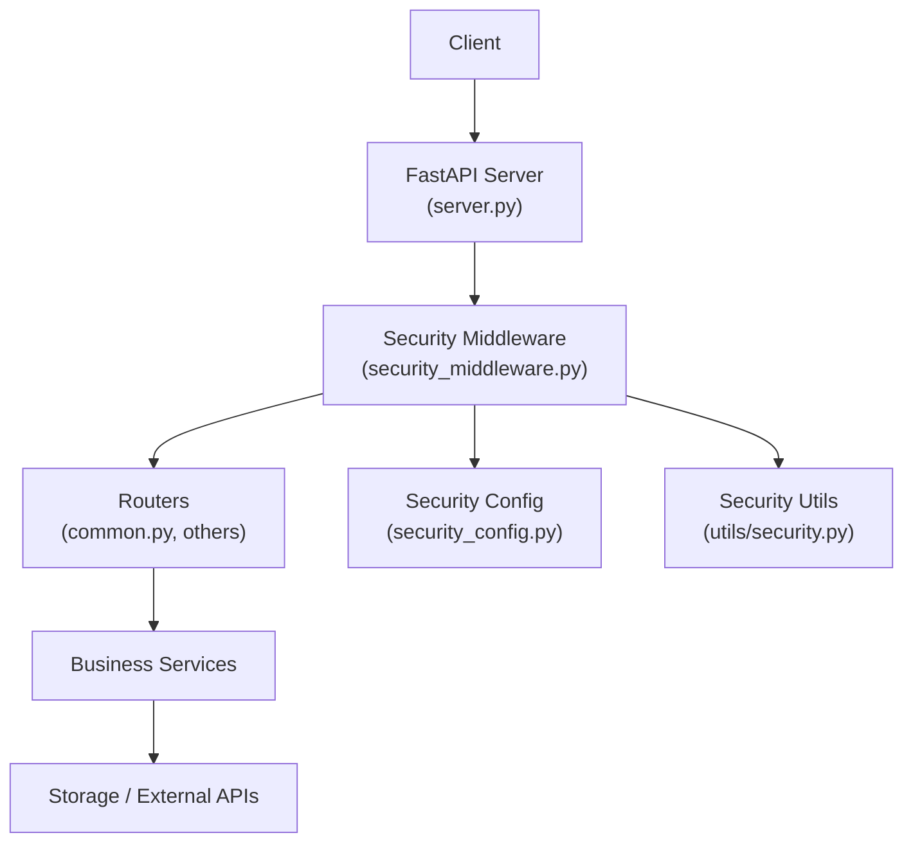
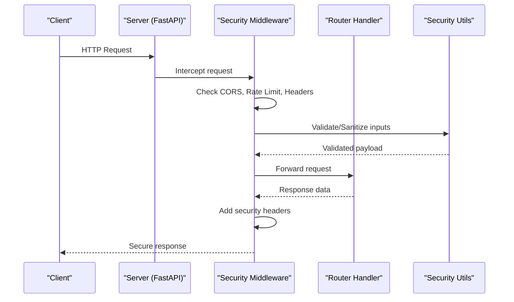
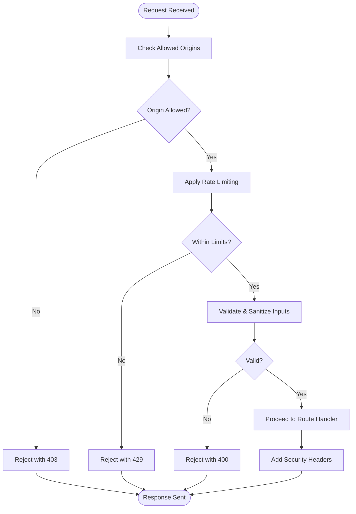
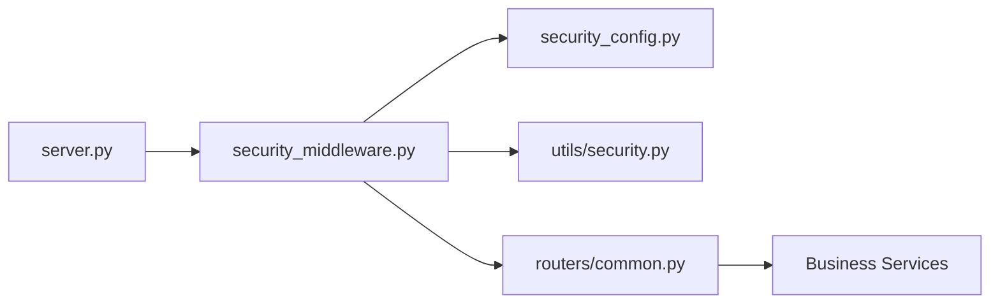

# Authentication & Security

<cite>
**Referenced Files in This Document**
- [server.py](file://src/local_deepl/server.py)
- [security_middleware.py](file://src/local_deepl/api/services/security_middleware.py)
- [security_config.py](file://src/local_deepl/api/services/security_config.py)
- [security.py](file://src/local_deepl/api/services/security.py)
- [security.py](file://src/local_deepl/utils/security.py)
- [routers/common.py](file://src/local_deepl/api/routers/common.py)
- [test_api_safety.py](file://tests/test_api_safety.py)
- [test_security_qa.py](file://tests/test_security_qa.py)
</cite>

## Table of Contents
1. [Introduction](#introduction)
2. [Project Structure](#project-structure)
3. [Core Components](#core-components)
4. [Architecture Overview](#architecture-overview)
5. [Detailed Component Analysis](#detailed-component-analysis)
6. [Dependency Analysis](#dependency-analysis)
7. [Performance Considerations](#performance-considerations)
8. [Troubleshooting Guide](#troubleshooting-guide)
9. [Conclusion](#conclusion)
10. [Appendices](#appendices)

## Introduction
This document explains LocalDeepL’s authentication and security mechanisms for API protection. It covers how the server is configured, how middleware enforces security policies, and how configuration options control behavior such as rate limiting, CORS, HTTPS requirements, and security headers. It also provides guidance on secure usage patterns, token management, and best practices to mitigate common vulnerabilities like XSS, CSRF, and injection attacks.

## Project Structure
LocalDeepL implements security through a combination of application-level configuration, middleware, and utility functions:
- Server initialization wires up middleware and routes.
- Security middleware applies request/response protections and policy enforcement.
- Security configuration centralizes settings for rate limiting, CORS, and other controls.
- Utility modules provide helpers for validation and safe handling of inputs.
- Routers define endpoints that rely on middleware for authorization and input validation.
- Tests validate safety behaviors and security QA checks.

**Diagram sources**
- [server.py](file://src/local_deepl/server.py)
- [security_middleware.py](file://src/local_deepl/api/services/security_middleware.py)
- [security_config.py](file://src/local_deepl/api/services/security_config.py)
- [security.py](file://src/local_deepl/utils/security.py)
- [routers/common.py](file://src/local_deepl/api/routers/common.py)

**Section sources**
- [server.py](file://src/local_deepl/server.py)
- [security_middleware.py](file://src/local_deepl/api/services/security_middleware.py)
- [security_config.py](file://src/local_deepl/api/services/security_config.py)
- [security.py](file://src/local_deepl/utils/security.py)
- [routers/common.py](file://src/local_deepl/api/routers/common.py)

## Core Components
- Security middleware: Applies cross-cutting concerns (rate limiting, CORS, headers, input validation).
- Security configuration: Centralized settings for rate limits, allowed origins, TLS requirements, and header policies.
- Security utilities: Helpers for validating and sanitizing inputs, generating tokens, and enforcing constraints.
- Server wiring: Initializes middleware and routes with security policies applied globally or per-route.

Key responsibilities:
- Enforce consistent security headers on all responses.
- Validate and sanitize incoming requests before they reach business logic.
- Apply rate limiting and origin restrictions.
- Provide hooks for role-based access control and permission checks at route boundaries.

**Section sources**
- [security_middleware.py](file://src/local_deepl/api/services/security_middleware.py)
- [security_config.py](file://src/local_deepl/api/services/security_config.py)
- [security.py](file://src/local_deepl/utils/security.py)
- [server.py](file://src/local_deepl/server.py)

## Architecture Overview
The security architecture follows a layered approach:
- Request enters the FastAPI server.
- Security middleware intercepts requests to enforce global policies.
- Routes receive validated requests and perform fine-grained authorization if needed.
- Responses are sanitized and enriched with security headers before being sent back.

**Diagram sources**
- [server.py](file://src/local_deepl/server.py)
- [security_middleware.py](file://src/local_deepl/api/services/security_middleware.py)
- [security.py](file://src/local_deepl/utils/security.py)

## Detailed Component Analysis

### Security Middleware
Responsibilities:
- Enforce CORS policies based on configuration.
- Apply rate limiting per client/IP or user identity when available.
- Inject security headers into responses (e.g., HSTS, CSP, X-Frame-Options).
- Validate and sanitize request payloads using utility functions.
- Provide hooks for role-based access control and permission checks at route level.

Behavioral flow:
- On request entry, check origin against allowed list; reject if not permitted.
- Evaluate rate limit counters; return appropriate error when exceeded.
- Sanitize inputs to prevent injection and ensure schema compliance.
- Attach security headers to all responses.

**Diagram sources**
- [security_middleware.py](file://src/local_deepl/api/services/security_middleware.py)
- [security.py](file://src/local_deepl/utils/security.py)

**Section sources**
- [security_middleware.py](file://src/local_deepl/api/services/security_middleware.py)

### Security Configuration
Centralizes settings for:
- Rate limiting parameters (window size, max requests).
- CORS allowed origins and methods.
- HTTPS/TLS enforcement flags.
- Security header policies (HSTS, CSP, X-Content-Type-Options).
- Optional features like session cookie settings and token lifetimes.

Configuration usage:
- Middleware reads settings to apply policies consistently across all routes.
- Server initialization loads configuration and passes it to middleware.
- Tests assert expected behavior under different configurations.

**Section sources**
- [security_config.py](file://src/local_deepl/api/services/security_config.py)
- [server.py](file://src/local_deepl/server.py)

### Security Utilities
Provides reusable helpers for:
- Input validation and sanitization to mitigate XSS and injection.
- Token generation and verification utilities.
- Safe string processing and encoding.
- Permission checks and role evaluation helpers.

Usage patterns:
- Middleware calls utilities to normalize and validate payloads.
- Routers use utilities for fine-grained authorization decisions.
- Tests verify correctness of validation and sanitization logic.

**Section sources**
- [security.py](file://src/local_deepl/utils/security.py)
- [security.py](file://src/local_deepl/api/services/security.py)

### Server Wiring and Route-Level Authorization
- The server initializes middleware and routes, ensuring security policies are applied globally.
- Routers may define additional authorization guards for specific endpoints.
- Common router utilities standardize request parsing and error responses.

Best practices:
- Keep sensitive operations behind explicit authorization checks.
- Use minimal privileges for service accounts and API keys.
- Prefer stateless tokens where possible; avoid storing secrets in client-side code.

**Section sources**
- [server.py](file://src/local_deepl/server.py)
- [routers/common.py](file://src/local_deepl/api/routers/common.py)

### Conceptual Overview
Authentication methods supported by design:
- API Keys: Used for machine-to-machine authentication; validated early in the pipeline.
- JWT Tokens: Stateless tokens carrying claims; verified via signature and expiration.
- Session-Based Authentication: Optional, for interactive flows; managed via secure cookies.

Authorization model:
- Role-Based Access Control (RBAC): Roles map to permissions; enforced at route boundaries.
- Permission Management: Fine-grained checks for resource access; supports least privilege.

Security headers and encryption:
- Enforce HTTPS/TLS in production.
- Set HSTS, CSP, X-Frame-Options, and X-Content-Type-Options.
- Encrypt sensitive data at rest and in transit; use strong ciphers and key rotation.

Compliance considerations:
- Audit logging for security events.
- Data minimization and retention policies.
- Regular vulnerability assessments and dependency updates.

[No sources needed since this section doesn't analyze specific files]

## Dependency Analysis
Security components depend on each other as follows:
- Middleware depends on configuration and utilities.
- Routers depend on middleware-provided context (validated inputs, user identity).
- Server depends on middleware registration and configuration loading.

**Diagram sources**
- [server.py](file://src/local_deepl/server.py)
- [security_middleware.py](file://src/local_deepl/api/services/security_middleware.py)
- [security_config.py](file://src/local_deepl/api/services/security_config.py)
- [security.py](file://src/local_deepl/utils/security.py)
- [routers/common.py](file://src/local_deepl/api/routers/common.py)

**Section sources**
- [server.py](file://src/local_deepl/server.py)
- [security_middleware.py](file://src/local_deepl/api/services/security_middleware.py)
- [security_config.py](file://src/local_deepl/api/services/security_config.py)
- [security.py](file://src/local_deepl/utils/security.py)
- [routers/common.py](file://src/local_deepl/api/routers/common.py)

## Performance Considerations
- Rate limiting should be tuned to balance security and throughput; consider sliding windows and distributed counters for scale.
- Avoid heavy validation in hot paths; pre-validate schemas and cache immutable configuration.
- Use asynchronous I/O where possible to reduce latency under load.
- Monitor middleware overhead and optimize bottlenecks identified by profiling.

[No sources needed since this section provides general guidance]

## Troubleshooting Guide
Common issues and resolutions:
- CORS errors: Verify allowed origins and methods in configuration; ensure preflight requests are handled.
- Rate limit rejections: Adjust limits or investigate abnormal traffic patterns; log source IPs for analysis.
- Validation failures: Inspect input schemas and sanitization rules; ensure clients send correctly formatted payloads.
- Missing security headers: Confirm middleware is registered and headers are enabled in configuration.

Diagnostic steps:
- Enable detailed logging for middleware decisions.
- Use test suites to simulate attack vectors and verify defenses.
- Review configuration drift between environments.

**Section sources**
- [test_api_safety.py](file://tests/test_api_safety.py)
- [test_security_qa.py](file://tests/test_security_qa.py)

## Conclusion
LocalDeepL’s security model combines centralized configuration, robust middleware, and utility-driven validation to protect APIs against common threats. By enforcing strict CORS, rate limiting, and security headers, and by providing hooks for RBAC and permission checks, the system supports secure deployments. Follow best practices for token management, HTTPS enforcement, and compliance to maintain a strong security posture.

[No sources needed since this section summarizes without analyzing specific files]

## Appendices

### Secure API Usage Examples
- Use API keys for service-to-service calls; store them securely and rotate regularly.
- Issue short-lived JWT tokens with minimal claims; verify signatures and expiration on each request.
- For session-based flows, set secure, HttpOnly cookies and validate session integrity server-side.

### Token Management Best Practices
- Store tokens in memory or secure storage; never expose in logs or client-side code.
- Implement token refresh strategies with bounded lifetimes.
- Revoke compromised tokens immediately and audit usage.

### Security Headers Checklist
- HSTS: Enforce HTTPS with long max-age.
- CSP: Restrict script sources and inline content.
- X-Frame-Options: Prevent clickjacking.
- X-Content-Type-Options: Disable MIME sniffing.
- Referrer-Policy: Control referrer information.

### Compliance Considerations
- Maintain audit logs for authentication and authorization events.
- Apply data retention and deletion policies.
- Conduct regular security reviews and penetration testing.

[No sources needed since this section provides general guidance]