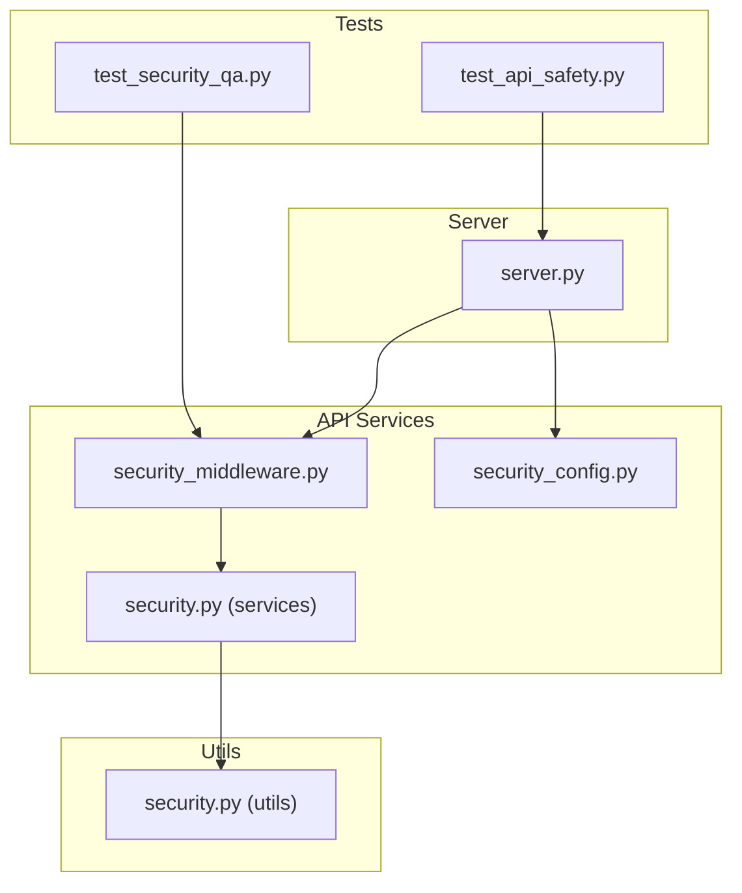
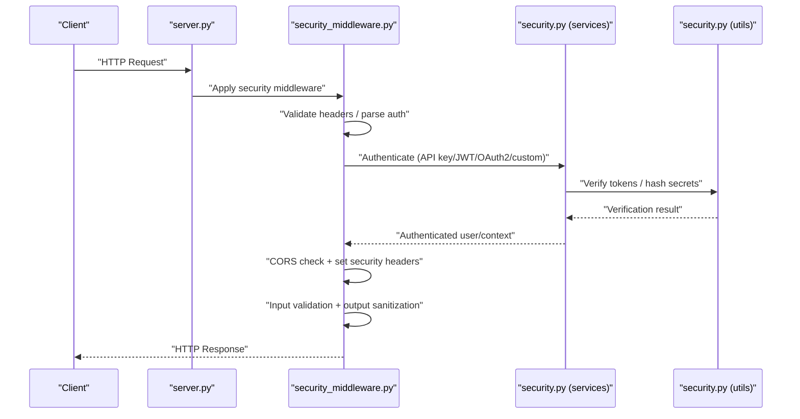
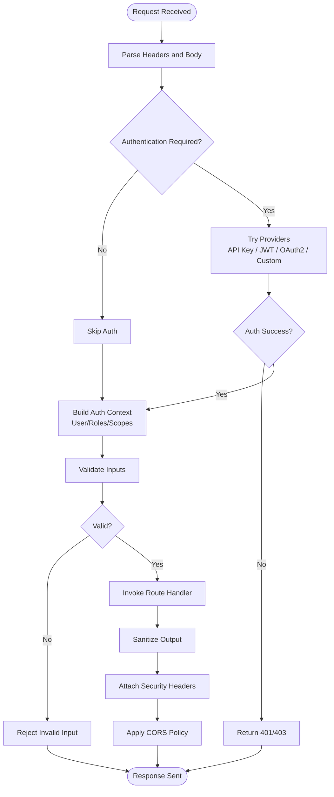
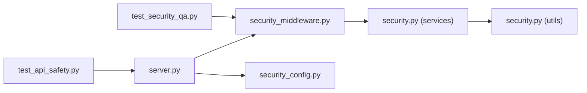

# Authentication & Security

<cite>
**Referenced Files in This Document**
- [server.py](file://src/local_deepl/server.py)
- [security_middleware.py](file://src/local_deepl/api/services/security_middleware.py)
- [security_config.py](file://src/local_deepl/api/services/security_config.py)
- [security.py](file://src/local_deepl/api/services/security.py)
- [security.py](file://src/local_deepl/utils/security.py)
- [test_security_qa.py](file://tests/test_security_qa.py)
- [test_api_safety.py](file://tests/test_api_safety.py)
</cite>

## Table of Contents
1. [Introduction](#introduction)
2. [Project Structure](#project-structure)
3. [Core Components](#core-components)
4. [Architecture Overview](#architecture-overview)
5. [Detailed Component Analysis](#detailed-component-analysis)
6. [Dependency Analysis](#dependency-analysis)
7. [Performance Considerations](#performance-considerations)
8. [Troubleshooting Guide](#troubleshooting-guide)
9. [Conclusion](#conclusion)
10. [Appendices](#appendices)

## Introduction
This document describes LocalDeepL’s authentication and security features as implemented in the codebase. It covers how requests are authenticated, authorized, validated, and protected by middleware; how CORS is configured; what security headers are applied; and how encryption and secure communication are handled. It also outlines authorization patterns, role-based access control (RBAC), permission management, best practices, vulnerability mitigation strategies, and compliance considerations.

## Project Structure
Security-related functionality is primarily located under:
- API services for middleware, configuration, and shared security utilities
- Application server wiring that registers middleware and routes
- Utility helpers for cryptographic operations
- Tests validating security behavior and safety constraints

**Diagram sources**
- [server.py](file://src/local_deepl/server.py)
- [security_middleware.py](file://src/local_deepl/api/services/security_middleware.py)
- [security_config.py](file://src/local_deepl/api/services/security_config.py)
- [security.py](file://src/local_deepl/api/services/security.py)
- [security.py](file://src/local_deepl/utils/security.py)
- [test_security_qa.py](file://tests/test_security_qa.py)
- [test_api_safety.py](file://tests/test_api_safety.py)

**Section sources**
- [server.py](file://src/local_deepl/server.py)
- [security_middleware.py](file://src/local_deepl/api/services/security_middleware.py)
- [security_config.py](file://src/local_deepl/api/services/security_config.py)
- [security.py](file://src/local_deepl/api/services/security.py)
- [security.py](file://src/local_deepl/utils/security.py)
- [test_security_qa.py](file://tests/test_security_qa.py)
- [test_api_safety.py](file://tests/test_api_safety.py)

## Core Components
- Security Middleware: Centralizes request/response processing including authentication checks, input validation, output sanitization, and security headers.
- Security Configuration: Provides settings for CORS, allowed origins, methods, headers, credentials, and other security options.
- Shared Security Utilities: Common helpers used across services and utils for token handling, hashing, and secure operations.
- Server Wiring: Registers middleware, applies configuration, and exposes endpoints with appropriate protections.
- Tests: Validate security behaviors such as header presence, CORS behavior, and safe handling of inputs/outputs.

Key responsibilities:
- Enforce authentication via supported mechanisms (API keys, JWT tokens, OAuth2 integration points, custom providers).
- Apply CORS policies and security headers to responses.
- Validate and sanitize inputs; ensure outputs are safe.
- Provide RBAC and permission checks at route/service boundaries.
- Integrate with secure communication protocols and encryption standards.

**Section sources**
- [security_middleware.py](file://src/local_deepl/api/services/security_middleware.py)
- [security_config.py](file://src/local_deepl/api/services/security_config.py)
- [security.py](file://src/local_deepl/api/services/security.py)
- [security.py](file://src/local_deepl/utils/security.py)
- [server.py](file://src/local_deepl/server.py)

## Architecture Overview
The security architecture follows a layered approach:
- HTTP layer: Server registers middleware and routes.
- Middleware layer: Applies authentication, authorization, CORS, headers, validation, and sanitization.
- Service layer: Uses shared security utilities for cryptographic operations and token handling.
- Test layer: Verifies security properties and safety constraints.

**Diagram sources**
- [server.py](file://src/local_deepl/server.py)
- [security_middleware.py](file://src/local_deepl/api/services/security_middleware.py)
- [security.py](file://src/local_deepl/api/services/security.py)
- [security.py](file://src/local_deepl/utils/security.py)

## Detailed Component Analysis

### Security Middleware
Responsibilities:
- Authentication enforcement: Supports multiple schemes (API keys, JWT tokens, OAuth2 integration points, and pluggable custom providers).
- Authorization and RBAC: Checks roles and permissions before allowing access to protected resources.
- Input validation and output sanitization: Ensures payloads conform to expected schemas and removes dangerous content.
- Security headers: Adds recommended headers (e.g., HSTS, X-Content-Type-Options, Referrer-Policy, Content-Security-Policy) based on configuration.
- CORS policy application: Validates preflight and actual requests against configured origins, methods, and headers.

Operational flow:
- Parse incoming request headers and body.
- Attempt authentication using configured providers in priority order.
- Build an authenticated context (user identity, roles, scopes).
- Validate request inputs against schema constraints.
- Execute route handler.
- Sanitize response data and attach security headers.
- Apply CORS rules and return response.

**Diagram sources**
- [security_middleware.py](file://src/local_deepl/api/services/security_middleware.py)

**Section sources**
- [security_middleware.py](file://src/local_deepl/api/services/security_middleware.py)

### Security Configuration
Responsibilities:
- Define CORS settings: allowed origins, methods, headers, credentials, and max age.
- Configure security headers: enable/disable HSTS, CSP, X-Frame-Options, etc.
- Set authentication defaults: required schemes, token locations, secret/key management.
- Control rate limiting and logging levels for security events.

Configuration usage:
- Loaded at startup and consumed by middleware and services.
- Environment-driven where applicable for deployment flexibility.

**Section sources**
- [security_config.py](file://src/local_deepl/api/services/security_config.py)

### Shared Security Utilities
Responsibilities:
- Token verification and parsing helpers for JWT and API keys.
- Cryptographic primitives: hashing, signing, and secure random generation.
- Safe string handling and encoding utilities.

Integration points:
- Called by middleware during authentication and authorization.
- Used by services for secure operations like secret validation and payload integrity checks.

**Section sources**
- [security.py](file://src/local_deepl/api/services/security.py)
- [security.py](file://src/local_deepl/utils/security.py)

### Server Wiring
Responsibilities:
- Register security middleware globally or per-route.
- Load security configuration and apply it to the application lifecycle.
- Expose endpoints with appropriate protection levels.

Lifecycle:
- On startup, load config, initialize middleware, and bind routes.
- Ensure consistent security posture across all endpoints.

**Section sources**
- [server.py](file://src/local_deepl/server.py)

### Tests and Validation
Responsibilities:
- Verify presence and correctness of security headers.
- Validate CORS behavior for allowed and disallowed origins/methods.
- Confirm authentication failures and authorization denials.
- Ensure input validation rejects malformed payloads and output sanitization prevents unsafe content.

Coverage highlights:
- Header assertions and CORS tests.
- Negative cases for invalid tokens and unauthorized access.
- Safety checks for file uploads and large payloads.

**Section sources**
- [test_security_qa.py](file://tests/test_security_qa.py)
- [test_api_safety.py](file://tests/test_api_safety.py)

## Dependency Analysis
Security components interact as follows:
- Server depends on middleware and configuration.
- Middleware depends on shared security services and utilities.
- Tests depend on server and middleware to assert security behavior.

**Diagram sources**
- [server.py](file://src/local_deepl/server.py)
- [security_middleware.py](file://src/local_deepl/api/services/security_middleware.py)
- [security_config.py](file://src/local_deepl/api/services/security_config.py)
- [security.py](file://src/local_deepl/api/services/security.py)
- [security.py](file://src/local_deepl/utils/security.py)
- [test_security_qa.py](file://tests/test_security_qa.py)
- [test_api_safety.py](file://tests/test_api_safety.py)

**Section sources**
- [server.py](file://src/local_deepl/server.py)
- [security_middleware.py](file://src/local_deepl/api/services/security_middleware.py)
- [security_config.py](file://src/local_deepl/api/services/security_config.py)
- [security.py](file://src/local_deepl/api/services/security.py)
- [security.py](file://src/local_deepl/utils/security.py)
- [test_security_qa.py](file://tests/test_security_qa.py)
- [test_api_safety.py](file://tests/test_api_safety.py)

## Performance Considerations
- Minimize overhead in middleware by caching configuration and avoiding expensive operations on hot paths.
- Use efficient token verification and short-circuit early on invalid inputs.
- Limit payload sizes and enforce timeouts to prevent resource exhaustion.
- Prefer streaming for large files and avoid loading entire payloads into memory when unnecessary.

[No sources needed since this section provides general guidance]

## Troubleshooting Guide
Common issues and resolutions:
- Missing or incorrect security headers: Review configuration and middleware registration.
- CORS errors: Check allowed origins, methods, and headers; ensure credentials policy matches client requirements.
- Authentication failures: Validate token formats, key placement, and provider configuration.
- Authorization denials: Inspect roles and permissions assigned to users and requested resources.
- Input validation rejections: Align client payloads with expected schemas and constraints.
- Output sanitization stripping content: Adjust sanitization rules if legitimate content is being removed.

Diagnostic steps:
- Enable detailed security logs for authentication and authorization decisions.
- Run test suites focused on security QA and API safety to reproduce issues.
- Inspect request/response cycles through middleware hooks.

**Section sources**
- [test_security_qa.py](file://tests/test_security_qa.py)
- [test_api_safety.py](file://tests/test_api_safety.py)

## Conclusion
LocalDeepL implements a robust, layered security model centered around configurable middleware, comprehensive configuration, and shared utilities. The system supports multiple authentication mechanisms, enforces authorization and RBAC, validates inputs, sanitizes outputs, and applies security headers and CORS policies. Tests validate these behaviors, ensuring consistent security posture across deployments.

[No sources needed since this section summarizes without analyzing specific files]

## Appendices

### Authentication Methods
- API Keys: Supported via middleware and utilities; configure key locations and rotation policies.
- JWT Tokens: Verified using shared utilities; configure algorithms, issuers, and audiences.
- OAuth2 Integration Points: Pluggable provider interface allows integration with external identity providers.
- Custom Authentication Providers: Extend the provider interface to support proprietary schemes.

**Section sources**
- [security_middleware.py](file://src/local_deepl/api/services/security_middleware.py)
- [security.py](file://src/local_deepl/api/services/security.py)
- [security.py](file://src/local_deepl/utils/security.py)

### Security Middleware Configurations
- Registration: Global or per-route middleware binding.
- Order: Ensure authentication precedes authorization and validation precedes sanitization.
- Extensibility: Hooks for custom logic within the middleware pipeline.

**Section sources**
- [security_middleware.py](file://src/local_deepl/api/services/security_middleware.py)
- [server.py](file://src/local_deepl/server.py)

### CORS Settings
- Allowed Origins: Whitelist domains; consider environment-specific configurations.
- Methods and Headers: Restrict to necessary subsets.
- Credentials: Enable only when clients require cookies or auth headers.
- Preflight Handling: Ensure OPTIONS requests are correctly processed.

**Section sources**
- [security_config.py](file://src/local_deepl/api/services/security_config.py)
- [test_security_qa.py](file://tests/test_security_qa.py)

### Input Validation and Output Sanitization
- Schema Enforcement: Validate request bodies and parameters against defined schemas.
- Dangerous Content Removal: Strip scripts, unsafe attributes, and potentially harmful markup from outputs.
- Size Limits: Enforce maximum payload sizes to mitigate DoS risks.

**Section sources**
- [security_middleware.py](file://src/local_deepl/api/services/security_middleware.py)
- [test_api_safety.py](file://tests/test_api_safety.py)

### Security Headers
- Recommended Headers: HSTS, X-Content-Type-Options, Referrer-Policy, Content-Security-Policy, X-Frame-Options.
- Configuration: Toggle headers based on deployment needs and browser compatibility.

**Section sources**
- [security_config.py](file://src/local_deepl/api/services/security_config.py)
- [test_security_qa.py](file://tests/test_security_qa.py)

### Encryption Standards and Secure Communication
- TLS: Enforce HTTPS in production; configure certificate management.
- Algorithms: Use modern, vetted algorithms for hashing and signing.
- Secrets Management: Store keys and secrets securely; rotate regularly.

**Section sources**
- [security.py](file://src/local_deepl/utils/security.py)

### Authorization Patterns and RBAC
- Role-Based Access Control: Assign roles to users and enforce at route/service boundaries.
- Permission Checks: Validate fine-grained permissions for sensitive operations.
- Scopes: Support OAuth2-style scopes for granular authorization.

**Section sources**
- [security_middleware.py](file://src/local_deepl/api/services/security_middleware.py)
- [security.py](file://src/local_deepl/api/services/security.py)

### Best Practices and Compliance
- Least Privilege: Grant minimal permissions required for each role.
- Audit Logging: Log authentication and authorization events for compliance.
- Data Protection: Encrypt sensitive data at rest and in transit; sanitize outputs.
- Compliance: Align with OWASP guidelines and relevant regulations (e.g., GDPR, HIPAA) as applicable.

[No sources needed since this section provides general guidance]