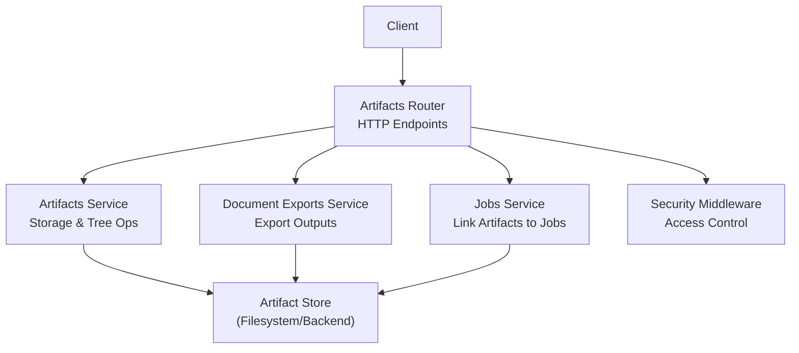
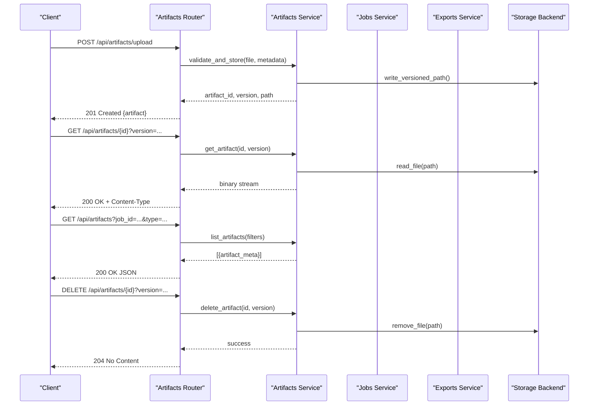
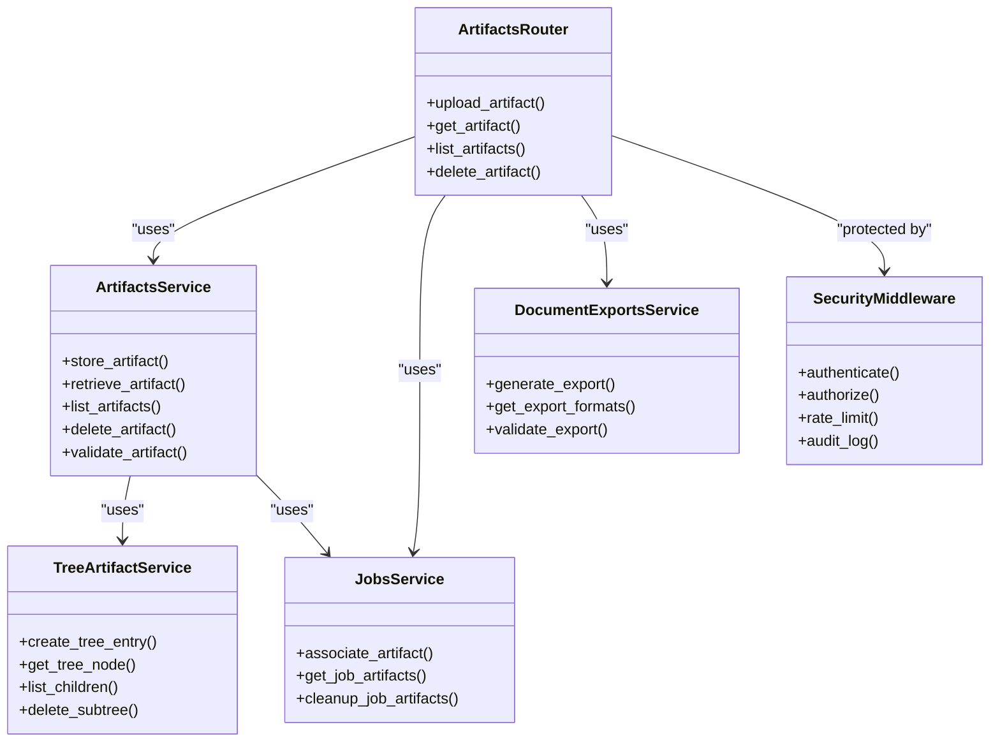

# Artifact Endpoints

<cite>
**Referenced Files in This Document**
- [artifacts.py](file://src/local_deepl/api/routers/artifacts.py)
- [artifacts_service.py](file://src/local_deepl/api/services/artifacts.py)
- [tree_artifact.py](file://src/local_deepl/api/services/tree_artifact.py)
- [document_exports.py](file://src/local_deepl/api/services/document_exports.py)
- [jobs.py](file://src/local_deepl/api/services/jobs.py)
- [security_middleware.py](file://src/local_deepl/api/services/security_middleware.py)
- [security_config.py](file://src/local_deepl/api/services/security_config.py)
- [test_artifact_store.py](file://tests/test_artifact_store.py)
</cite>

## Table of Contents
1. [Introduction](#introduction)
2. [Project Structure](#project-structure)
3. [Core Components](#core-components)
4. [Architecture Overview](#architecture-overview)
5. [Detailed Component Analysis](#detailed-component-analysis)
6. [Dependency Analysis](#dependency-analysis)
7. [Performance Considerations](#performance-considerations)
8. [Troubleshooting Guide](#troubleshooting-guide)
9. [Conclusion](#conclusion)
10. [Appendices](#appendices)

## Introduction
This document provides comprehensive API documentation for LocalDeepL’s artifact storage endpoints. It covers HTTP methods for uploading, retrieving, listing, and deleting processing artifacts such as OCR results, intermediate files, and export outputs. It includes request/response schemas for binary uploads, metadata handling, structured data retrieval, artifact versioning, access control, cleanup policies, supported file formats, size limitations, storage backends, and integration patterns.

## Project Structure
The artifact subsystem is implemented across the API router layer and service modules:
- Router layer exposes HTTP endpoints for artifact operations.
- Service layer implements artifact storage, tree-based organization, exports, and job linkage.
- Security middleware enforces access control and policy checks.
- Tests validate behavior and edge cases.

**Diagram sources**
- [artifacts.py](file://src/local_deepl/api/routers/artifacts.py)
- [artifacts_service.py](file://src/local_deepl/api/services/artifacts.py)
- [jobs.py](file://src/local_deepl/api/services/jobs.py)
- [document_exports.py](file://src/local_deepl/api/services/document_exports.py)
- [security_middleware.py](file://src/local_deepl/api/services/security_middleware.py)

**Section sources**
- [artifacts.py](file://src/local_deepl/api/routers/artifacts.py)
- [artifacts_service.py](file://src/local_deepl/api/services/artifacts.py)
- [jobs.py](file://src/local_deepl/api/services/jobs.py)
- [document_exports.py](file://src/local_deepl/api/services/document_exports.py)
- [security_middleware.py](file://src/local_deepl/api/services/security_middleware.py)

## Core Components
- Artifacts Router: Defines HTTP endpoints for artifact CRUD operations (upload, get, list, delete), query parameters for filtering, and response formats (binary or JSON).
- Artifacts Service: Implements storage logic, tree structure management, versioning, metadata handling, and validation.
- Document Exports Service: Manages export artifacts (e.g., DOCX, HTML, PDF) with associated metadata and lifecycle.
- Jobs Service: Associates artifacts with jobs, enabling retrieval by job context and cleanup policies.
- Security Middleware: Enforces authentication, authorization, and policy enforcement for artifact access.

Key responsibilities:
- Binary upload/download with content-type handling.
- Metadata persistence and retrieval.
- Versioned artifact paths and naming conventions.
- Listing with filters (job_id, type, tags, date range).
- Deletion with cascade rules and retention policies.

**Section sources**
- [artifacts.py](file://src/local_deepl/api/routers/artifacts.py)
- [artifacts_service.py](file://src/local_deepl/api/services/artifacts.py)
- [document_exports.py](file://src/local_deepl/api/services/document_exports.py)
- [jobs.py](file://src/local_deepl/api/services/jobs.py)
- [security_middleware.py](file://src/local_deepl/api/services/security_middleware.py)

## Architecture Overview
The artifact system follows a layered architecture:
- HTTP Layer: FastAPI routers expose REST endpoints.
- Service Layer: Business logic for artifact operations, tree navigation, and export generation.
- Storage Layer: Filesystem-backed store with optional backend abstraction; supports versioned paths and metadata.
- Security Layer: Middleware validates requests and enforces access policies.

**Diagram sources**
- [artifacts.py](file://src/local_deepl/api/routers/artifacts.py)
- [artifacts_service.py](file://src/local_deepl/api/services/artifacts.py)
- [jobs.py](file://src/local_deepl/api/services/jobs.py)
- [document_exports.py](file://src/local_deepl/api/services/document_exports.py)

## Detailed Component Analysis

### Artifacts Router
Exposes endpoints for artifact operations:
- Upload: Accepts multipart/form-data with binary payload and optional metadata fields.
- Retrieve: Returns binary content or structured metadata based on query parameters.
- List: Supports filtering by job_id, artifact_type, tags, and date ranges.
- Delete: Removes specific versions or all versions depending on query flags.

Request/Response Schemas:
- Upload Request:
  - Body: multipart/form-data
  - Fields: file (binary), job_id (optional), artifact_type (enum), tags (list), custom_metadata (object)
- Upload Response:
  - Status: 201 Created
  - Body: {artifact_id, version, path, content_type, size_bytes, created_at}
- Retrieve Request:
  - Path: /api/artifacts/{artifact_id}
  - Query: version (optional), format (json|binary)
- Retrieve Response:
  - Binary: 200 OK with appropriate Content-Type
  - JSON: 200 OK with metadata object
- List Request:
  - Query: job_id, artifact_type, tags, created_after, created_before, limit, offset
- List Response:
  - 200 OK JSON array of artifact metadata objects
- Delete Request:
  - Path: /api/artifacts/{artifact_id}
  - Query: version (optional), force (boolean)
- Delete Response:
  - 204 No Content on success

Supported artifact types:
- ocr_result: OCR output in structured formats (JSON, XML)
- intermediate: Processing intermediates (images, masks, alignments)
- export_output: Final exports (DOCX, HTML, PDF)

Size limitations:
- Default max upload size enforced by server configuration
- Per-artifact limits configurable via environment variables

**Section sources**
- [artifacts.py](file://src/local_deepl/api/routers/artifacts.py)

### Artifacts Service
Implements core artifact storage logic:
- Versioning: Each upload creates a new version with unique identifier
- Metadata: Stores structured metadata alongside binary content
- Tree Structure: Organizes artifacts in hierarchical paths for efficient listing
- Validation: Validates file types, sizes, and metadata constraints
- Cleanup: Supports scheduled deletion based on retention policies

Data structures:
- ArtifactMetadata: Contains id, version, job_id, type, tags, timestamps, content_type, size
- ArtifactTree: Hierarchical organization with parent-child relationships
- StorageConfig: Backend-specific settings (path templates, retention rules)

Complexity considerations:
- Upload: O(1) for metadata insertion, O(n) for file writing
- List: O(k log k) for filtered results with pagination
- Delete: O(1) per version removal with cascade options

**Section sources**
- [artifacts_service.py](file://src/local_deepl/api/services/artifacts.py)

### Tree Artifact Service
Manages hierarchical artifact organization:
- Path Generation: Creates consistent directory structures based on job_id and artifact_type
- Navigation: Provides methods to traverse parent-child relationships
- Aggregation: Supports bulk operations on artifact trees
- Indexing: Maintains indexes for fast lookup by various criteria

Operations:
- create_tree_entry(job_id, artifact_type, metadata)
- get_tree_node(path)
- list_children(parent_path, filters)
- delete_tree_subtree(path, recursive)

**Section sources**
- [tree_artifact.py](file://src/local_deepl/api/services/tree_artifact.py)

### Document Exports Service
Handles export artifact lifecycle:
- Export Generation: Creates formatted documents from processed data
- Format Support: DOCX, HTML, PDF with customizable templates
- Versioning: Maintains multiple export versions per job
- Quality Checks: Validates output integrity and completeness

Supported formats:
- DOCX: Rich text with embedded images and tables
- HTML: Web-friendly format with CSS styling
- PDF: Print-ready documents with proper formatting

**Section sources**
- [document_exports.py](file://src/local_deepl/api/services/document_exports.py)

### Jobs Service Integration
Links artifacts to processing jobs:
- Job Association: Each artifact references its originating job
- Lifecycle Management: Coordinates artifact creation/deletion with job status
- Progress Tracking: Updates artifact availability during long-running jobs
- Cleanup Policies: Automatic deletion when jobs are terminated or completed

**Section sources**
- [jobs.py](file://src/local_deepl/api/services/jobs.py)

### Security Middleware
Enforces access control and policies:
- Authentication: Validates user credentials and session tokens
- Authorization: Checks permissions for artifact operations
- Rate Limiting: Prevents abuse through request throttling
- Audit Logging: Records all artifact access attempts

Policy enforcement:
- Role-based access control (RBAC)
- Job-scoped visibility
- Time-based access restrictions
- IP whitelisting for sensitive operations

**Section sources**
- [security_middleware.py](file://src/local_deepl/api/services/security_middleware.py)
- [security_config.py](file://src/local_deepl/api/services/security_config.py)

## Dependency Analysis
The artifact system has clear dependency boundaries:

**Diagram sources**
- [artifacts.py](file://src/local_deepl/api/routers/artifacts.py)
- [artifacts_service.py](file://src/local_deepl/api/services/artifacts.py)
- [tree_artifact.py](file://src/local_deepl/api/services/tree_artifact.py)
- [document_exports.py](file://src/local_deepl/api/services/document_exports.py)
- [jobs.py](file://src/local_deepl/api/services/jobs.py)
- [security_middleware.py](file://src/local_deepl/api/services/security_middleware.py)

**Section sources**
- [artifacts.py](file://src/local_deepl/api/routers/artifacts.py)
- [artifacts_service.py](file://src/local_deepl/api/services/artifacts.py)
- [tree_artifact.py](file://src/local_deepl/api/services/tree_artifact.py)
- [document_exports.py](file://src/local_deepl/api/services/document_exports.py)
- [jobs.py](file://src/local_deepl/api/services/jobs.py)
- [security_middleware.py](file://src/local_deepl/api/services/security_middleware.py)

## Performance Considerations
- Streaming Uploads: Large files are streamed directly to storage without buffering in memory
- Pagination: List operations support cursor-based pagination for large result sets
- Caching: Frequently accessed artifacts can be cached at the application level
- Compression: Optional gzip compression for text-based artifacts
- Async Operations: Long-running export generation uses background tasks
- Connection Pooling: Efficient database connections for metadata operations

Optimization strategies:
- Use chunked uploads for files larger than 10MB
- Implement conditional requests with ETags for better caching
- Pre-generate thumbnails for image artifacts
- Use connection pooling for concurrent operations

## Troubleshooting Guide
Common issues and solutions:

Upload failures:
- Check file size limits and content type validation
- Verify storage backend connectivity and permissions
- Monitor disk space and quota limits

Retrieval errors:
- Validate artifact IDs and version numbers
- Check network connectivity and timeout settings
- Verify authentication tokens and permissions

Listing performance:
- Optimize filter queries with proper indexing
- Use pagination for large result sets
- Consider caching frequently accessed lists

Cleanup issues:
- Review retention policies and scheduled jobs
- Check for orphaned artifacts not linked to jobs
- Monitor storage usage and implement monitoring alerts

Error responses:
- 400 Bad Request: Invalid input parameters or file formats
- 401 Unauthorized: Missing or invalid authentication
- 403 Forbidden: Insufficient permissions
- 404 Not Found: Artifact or job not found
- 413 Payload Too Large: File exceeds size limits
- 500 Internal Server Error: Unexpected server issues

**Section sources**
- [test_artifact_store.py](file://tests/test_artifact_store.py)

## Conclusion
LocalDeepL's artifact storage system provides a robust, scalable solution for managing processing artifacts throughout the document pipeline. The modular architecture separates concerns between HTTP routing, business logic, and storage implementation, enabling easy maintenance and extension. With comprehensive security controls, versioning support, and flexible cleanup policies, the system meets the needs of production environments while maintaining simplicity for developers.

## Appendices

### Supported File Formats
OCR Results:
- JSON: Structured OCR output with confidence scores
- XML: Standardized format for interoperability
- TXT: Plain text extraction

Intermediate Files:
- PNG/JPEG: Processed images and masks
- PDF: Intermediate document representations
- CSV: Tabular data exports

Export Outputs:
- DOCX: Microsoft Word documents
- HTML: Web-compatible markup
- PDF: Print-ready documents

### Size Limitations
- Default maximum upload: 100MB (configurable)
- Recommended maximum for optimal performance: 50MB
- Memory usage scales with file size during processing

### Storage Backends
- Local filesystem: Default backend for development and small deployments
- Network storage: NFS/SMB for distributed deployments
- Cloud storage: S3-compatible backends for scalability
- Database blob storage: For small artifacts with metadata

### Integration Patterns
REST API:
- Standard HTTP methods with JSON metadata
- Multipart form data for binary uploads
- OAuth2/Bearer token authentication

SDK Integration:
- Python client library for programmatic access
- Batch operations for bulk artifact management
- Event-driven updates for real-time synchronization

Webhook Integration:
- Notifications for artifact lifecycle events
- Callback URLs for completion notifications
- Retry mechanisms for failed deliveries