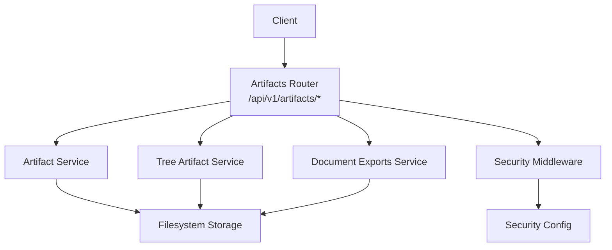
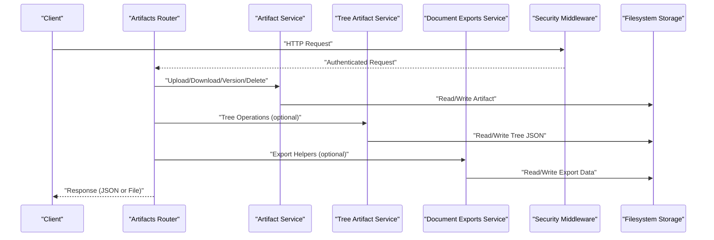
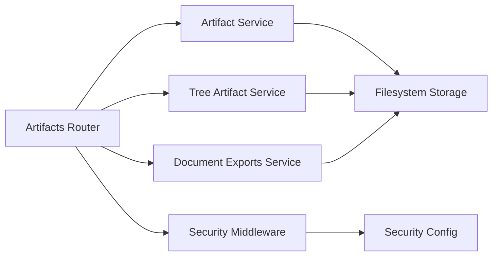

# Artifact Management API

<cite>
**Referenced Files in This Document**
- [artifacts.py](file://src/local_deepl/api/routers/artifacts.py)
- [artifacts_service.py](file://src/local_deepl/api/services/artifacts.py)
- [tree_artifact.py](file://src/local_deepl/api/services/tree_artifact.py)
- [document_exports.py](file://src/local_deepl/api/services/document_exports.py)
- [security_middleware.py](file://src/local_deepl/api/services/security_middleware.py)
- [security_config.py](file://src/local_deepl/api/services/security_config.py)
- [server.py](file://src/local_deepl/server.py)
- [test_artifact_store.py](file://tests/test_artifact_store.py)
- [test_tree_artifact_json.py](file://tests/test_tree_artifact_json.py)
</cite>

## Table of Contents
1. [Introduction](#introduction)
2. [Project Structure](#project-structure)
3. [Core Components](#core-components)
4. [Architecture Overview](#architecture-overview)
5. [Detailed Component Analysis](#detailed-component-analysis)
6. [Dependency Analysis](#dependency-analysis)
7. [Performance Considerations](#performance-considerations)
8. [Troubleshooting Guide](#troubleshooting-guide)
9. [Conclusion](#conclusion)

## Introduction
This document provides comprehensive API documentation for LocalDeepL’s artifact management endpoints. It covers uploading, downloading, versioning, and managing processed files and documents via REST endpoints under /api/v1/artifacts/. You will find URL patterns, request/response schemas, authentication requirements, status codes, examples for common workflows (including large file transfers and chunked uploads), supported formats, storage backends, compression options, and security considerations for access control.

## Project Structure
The artifact management feature is implemented as a FastAPI router with service-layer logic and supporting utilities:
- Router layer defines HTTP endpoints and request/response models.
- Service layer implements business logic for artifact operations, tree-based artifacts, and export helpers.
- Security middleware enforces access control on artifact routes.
- Server wiring registers routers and mounts static assets.

**Diagram sources**
- [artifacts.py](file://src/local_deepl/api/routers/artifacts.py)
- [artifacts_service.py](file://src/local_deepl/api/services/artifacts.py)
- [tree_artifact.py](file://src/local_deepl/api/services/tree_artifact.py)
- [document_exports.py](file://src/local_deepl/api/services/document_exports.py)
- [security_middleware.py](file://src/local_deepl/api/services/security_middleware.py)
- [security_config.py](file://src/local_deepl/api/services/security_config.py)

**Section sources**
- [artifacts.py](file://src/local_deepl/api/routers/artifacts.py)
- [server.py](file://src/local_deepl/server.py)

## Core Components
- Artifacts Router: Defines endpoints for listing, uploading, downloading, deleting, and versioning artifacts.
- Artifact Service: Encapsulates artifact CRUD operations, metadata handling, and versioning logic.
- Tree Artifact Service: Manages hierarchical artifact structures and JSON representations.
- Document Exports Service: Provides export helpers for processed documents.
- Security Middleware: Enforces authentication and authorization checks on artifact endpoints.
- Security Config: Centralizes security settings used by the middleware.

Key responsibilities:
- Validate requests and responses using Pydantic models.
- Manage artifact versions and metadata.
- Stream large files efficiently.
- Apply access controls based on configuration.

**Section sources**
- [artifacts.py](file://src/local_deepl/api/routers/artifacts.py)
- [artifacts_service.py](file://src/local_deepl/api/services/artifacts.py)
- [tree_artifact.py](file://src/local_deepl/api/services/tree_artifact.py)
- [document_exports.py](file://src/local_deepl/api/services/document_exports.py)
- [security_middleware.py](file://src/local_deepl/api/services/security_middleware.py)
- [security_config.py](file://src/local_deepl/api/services/security_config.py)

## Architecture Overview
The artifact management API follows a layered architecture:
- HTTP Layer (FastAPI Router): Parses requests, validates payloads, and returns responses.
- Service Layer: Implements artifact operations, versioning, and export functionality.
- Storage Layer: Persists artifacts to filesystem-backed storage.
- Security Layer: Applies authentication and authorization policies.

**Diagram sources**
- [artifacts.py](file://src/local_deepl/api/routers/artifacts.py)
- [artifacts_service.py](file://src/local_deepl/api/services/artifacts.py)
- [tree_artifact.py](file://src/local_deepl/api/services/tree_artifact.py)
- [document_exports.py](file://src/local_deepl/api/services/document_exports.py)
- [security_middleware.py](file://src/local_deepl/api/services/security_middleware.py)

## Detailed Component Analysis

### Endpoints Reference
Base path: /api/v1/artifacts/

- List Artifacts
  - Method: GET
  - Path: /api/v1/artifacts/
  - Query Parameters:
    - filter: optional string filter for artifact names or tags
    - page: integer page number
    - per_page: integer items per page
  - Response Schema:
    - items: array of artifact objects
    - total: integer count
    - page: integer
    - per_page: integer
  - Status Codes:
    - 200 OK
    - 401 Unauthorized
    - 403 Forbidden
    - 500 Internal Server Error

- Upload Artifact
  - Method: POST
  - Path: /api/v1/artifacts/
  - Headers:
    - Content-Type: multipart/form-data
  - Form Fields:
    - file: binary file data
    - name: string artifact name
    - description: optional string description
    - tags: optional comma-separated tags
    - version: optional string semantic version; defaults to auto-increment if omitted
  - Response Schema:
    - id: string artifact ID
    - name: string
    - version: string
    - size: integer bytes
    - mime_type: string
    - created_at: ISO timestamp
    - updated_at: ISO timestamp
    - checksum: optional string hash
  - Status Codes:
    - 201 Created
    - 400 Bad Request
    - 401 Unauthorized
    - 403 Forbidden
    - 413 Payload Too Large
    - 500 Internal Server Error

- Download Artifact
  - Method: GET
  - Path: /api/v1/artifacts/{artifact_id}
  - Query Parameters:
    - version: optional string version selector; defaults to latest if omitted
    - format: optional string output format conversion hint (if supported by exporter)
  - Response: Binary file stream
  - Content-Disposition: attachment with filename
  - Status Codes:
    - 200 OK
    - 404 Not Found
    - 401 Unauthorized
    - 403 Forbidden
    - 500 Internal Server Error

- Delete Artifact
  - Method: DELETE
  - Path: /api/v1/artifacts/{artifact_id}
  - Query Parameters:
    - version: optional string version selector; deletes specific version if provided
  - Response: Empty body
  - Status Codes:
    - 204 No Content
    - 404 Not Found
    - 401 Unauthorized
    - 403 Forbidden
    - 500 Internal Server Error

- Get Artifact Metadata
  - Method: GET
  - Path: /api/v1/artifacts/{artifact_id}/metadata
  - Query Parameters:
    - version: optional string version selector
  - Response Schema:
    - id: string
    - name: string
    - version: string
    - size: integer
    - mime_type: string
    - checksum: optional string
    - created_at: ISO timestamp
    - updated_at: ISO timestamp
    - tags: array of strings
    - description: optional string
  - Status Codes:
    - 200 OK
    - 404 Not Found
    - 401 Unauthorized
    - 403 Forbidden
    - 500 Internal Server Error

- Update Artifact Metadata
  - Method: PATCH
  - Path: /api/v1/artifacts/{artifact_id}/metadata
  - Request Body:
    - name: optional string
    - description: optional string
    - tags: optional array of strings
  - Response Schema: Updated metadata object
  - Status Codes:
    - 200 OK
    - 400 Bad Request
    - 404 Not Found
    - 401 Unauthorized
    - 403 Forbidden
    - 500 Internal Server Error

- List Versions
  - Method: GET
  - Path: /api/v1/artifacts/{artifact_id}/versions
  - Query Parameters:
    - page: integer
    - per_page: integer
  - Response Schema:
    - items: array of version objects
    - total: integer
    - page: integer
    - per_page: integer
  - Version Object Fields:
    - version: string
    - size: integer
    - checksum: optional string
    - created_at: ISO timestamp
  - Status Codes:
    - 200 OK
    - 404 Not Found
    - 401 Unauthorized
    - 403 Forbidden
    - 500 Internal Server Error

- Create New Version
  - Method: POST
  - Path: /api/v1/artifacts/{artifact_id}/versions
  - Headers:
    - Content-Type: multipart/form-data
  - Form Fields:
    - file: binary file data
    - version: optional string semantic version; auto-increment if omitted
  - Response Schema:
    - id: string
    - name: string
    - version: string
    - size: integer
    - mime_type: string
    - created_at: ISO timestamp
    - updated_at: ISO timestamp
    - checksum: optional string
  - Status Codes:
    - 201 Created
    - 400 Bad Request
    - 404 Not Found
    - 401 Unauthorized
    - 403 Forbidden
    - 413 Payload Too Large
    - 500 Internal Server Error

- Chunked Upload Initiate
  - Method: POST
  - Path: /api/v1/artifacts/chunks/init
  - Request Body:
    - name: string
    - description: optional string
    - tags: optional array of strings
    - version: optional string
    - total_size: integer
    - chunk_count: integer
  - Response Schema:
    - upload_id: string
    - chunk_size: integer
  - Status Codes:
    - 201 Created
    - 400 Bad Request
    - 401 Unauthorized
    - 403 Forbidden
    - 500 Internal Server Error

- Upload Chunk
  - Method: POST
  - Path: /api/v1/artifacts/chunks/{upload_id}
  - Headers:
    - Content-Type: multipart/form-data
  - Form Fields:
    - index: integer chunk index
    - data: binary chunk data
  - Response Schema:
    - uploaded_chunks: integer
    - total_chunks: integer
    - completed: boolean
  - Status Codes:
    - 200 OK
    - 400 Bad Request
    - 404 Not Found
    - 401 Unauthorized
    - 403 Forbidden
    - 413 Payload Too Large
    - 500 Internal Server Error

- Complete Chunked Upload
  - Method: POST
  - Path: /api/v1/artifacts/chunks/{upload_id}/complete
  - Response Schema:
    - id: string
    - name: string
    - version: string
    - size: integer
    - mime_type: string
    - created_at: ISO timestamp
    - updated_at: ISO timestamp
    - checksum: optional string
  - Status Codes:
    - 201 Created
    - 400 Bad Request
    - 404 Not Found
    - 401 Unauthorized
    - 403 Forbidden
    - 500 Internal Server Error

- Abort Chunked Upload
  - Method: DELETE
  - Path: /api/v1/artifacts/chunks/{upload_id}
  - Response: Empty body
  - Status Codes:
    - 204 No Content
    - 404 Not Found
    - 401 Unauthorized
    - 403 Forbidden
    - 500 Internal Server Error

- Export Artifact
  - Method: GET
  - Path: /api/v1/artifacts/{artifact_id}/export
  - Query Parameters:
    - format: string export format (e.g., json, pdf, docx)
    - version: optional string version selector
  - Response: Exported file stream
  - Status Codes:
    - 200 OK
    - 400 Bad Request
    - 404 Not Found
    - 401 Unauthorized
    - 403 Forbidden
    - 500 Internal Server Error

Notes:
- Authentication and authorization are enforced by the security middleware on all artifact endpoints.
- Large file uploads should use the chunked upload flow to avoid timeouts and memory pressure.
- The format parameter may be honored by exporters when available; otherwise, the original artifact content is returned.

**Section sources**
- [artifacts.py](file://src/local_deepl/api/routers/artifacts.py)
- [artifacts_service.py](file://src/local_deepl/api/services/artifacts.py)
- [tree_artifact.py](file://src/local_deepl/api/services/tree_artifact.py)
- [document_exports.py](file://src/local_deepl/api/services/document_exports.py)
- [security_middleware.py](file://src/local_deepl/api/services/security_middleware.py)

### Authentication and Authorization
- All artifact endpoints require authentication.
- Access control is enforced by the security middleware, which consults security configuration.
- Typical failure responses:
  - 401 Unauthorized: Missing or invalid credentials.
  - 403 Forbidden: Valid credentials but insufficient permissions.

Configuration:
- Security settings are centralized in the security config module and consumed by the middleware.

**Section sources**
- [security_middleware.py](file://src/local_deepl/api/services/security_middleware.py)
- [security_config.py](file://src/local_deepl/api/services/security_config.py)

### Supported File Formats and Export Options
- Ingestion supports common document and image formats typically handled by OCR and processing pipelines.
- Export formats depend on the document exports service capabilities.
- When exporting, specify the desired format via query parameters where supported.

Examples:
- Export to JSON structure for programmatic consumption.
- Export to PDF or DOCX for human-readable documents.

**Section sources**
- [document_exports.py](file://src/local_deepl/api/services/document_exports.py)

### Storage Backends and Compression
- Artifacts are persisted to a filesystem-backed storage backend.
- Compression options can be applied during export or archival workflows as supported by the services.
- For large files, prefer chunked uploads to reduce memory usage and improve reliability.

**Section sources**
- [artifacts_service.py](file://src/local_deepl/api/services/artifacts.py)
- [tree_artifact.py](file://src/local_deepl/api/services/tree_artifact.py)

### Examples

- Upload a processed document
  - Use POST /api/v1/artifacts/ with multipart form containing file, name, and optional metadata fields.
  - Expect 201 Created with artifact metadata including version and checksum.

- Download an artifact in a specific format
  - Use GET /api/v1/artifacts/{id}?format=json&version=1.2.3.
  - Receive a streamed response with appropriate Content-Disposition.

- Manage file versions
  - List versions via GET /api/v1/artifacts/{id}/versions.
  - Create a new version via POST /api/v1/artifacts/{id}/versions with file payload.
  - Delete a specific version via DELETE /api/v1/artifacts/{id}?version=1.2.3.

- Handle large file transfers
  - Initiate chunked upload via POST /api/v1/artifacts/chunks/init.
  - Upload chunks sequentially via POST /api/v1/artifacts/chunks/{upload_id}.
  - Complete via POST /api/v1/artifacts/chunks/{upload_id}/complete.
  - Abort via DELETE /api/v1/artifacts/chunks/{upload_id}.

- Implement chunked uploads
  - Ensure client respects chunk_size from init response.
  - Track uploaded_chunks and completed flag after each chunk.
  - On completion, verify final metadata and checksum.

[No sources needed since this section provides example guidance]

## Dependency Analysis
The artifact management system composes multiple modules:
- Router depends on services for business logic.
- Services depend on storage and export utilities.
- Security middleware wraps route handlers to enforce access control.

**Diagram sources**
- [artifacts.py](file://src/local_deepl/api/routers/artifacts.py)
- [artifacts_service.py](file://src/local_deepl/api/services/artifacts.py)
- [tree_artifact.py](file://src/local_deepl/api/services/tree_artifact.py)
- [document_exports.py](file://src/local_deepl/api/services/document_exports.py)
- [security_middleware.py](file://src/local_deepl/api/services/security_middleware.py)
- [security_config.py](file://src/local_deepl/api/services/security_config.py)

**Section sources**
- [artifacts.py](file://src/local_deepl/api/routers/artifacts.py)
- [server.py](file://src/local_deepl/server.py)

## Performance Considerations
- Streaming downloads: Use streaming responses for large artifacts to minimize memory footprint.
- Chunked uploads: Split large files into smaller chunks to avoid timeouts and reduce memory pressure.
- Pagination: Use page and per_page parameters for list endpoints to limit payload sizes.
- Checksums: Compute and validate checksums to ensure integrity without re-downloading entire files.
- Concurrency: Avoid concurrent writes to the same artifact version; rely on server-side locking if necessary.

[No sources needed since this section provides general guidance]

## Troubleshooting Guide
Common issues and resolutions:
- 401 Unauthorized: Verify credentials and token validity.
- 403 Forbidden: Confirm user has permission to access the requested artifact or perform the operation.
- 404 Not Found: Check artifact ID and version selector; ensure the resource exists.
- 400 Bad Request: Validate request schema and required fields; ensure correct Content-Type headers.
- 413 Payload Too Large: Switch to chunked upload for large files.
- 500 Internal Server Error: Inspect server logs for stack traces and underlying storage errors.

Operational tips:
- Enable detailed logging for artifact operations.
- Monitor disk space and I/O performance for storage backends.
- Validate checksums post-upload to detect corruption.

**Section sources**
- [artifacts.py](file://src/local_deepl/api/routers/artifacts.py)
- [artifacts_service.py](file://src/local_deepl/api/services/artifacts.py)
- [security_middleware.py](file://src/local_deepl/api/services/security_middleware.py)

## Conclusion
LocalDeepL’s artifact management API provides robust endpoints for uploading, downloading, versioning, and exporting processed documents. With secure access controls, efficient streaming, and chunked upload support, it enables reliable handling of large files and complex workflows. Follow the endpoint specifications and best practices outlined here to integrate effectively and maintain high performance and security.