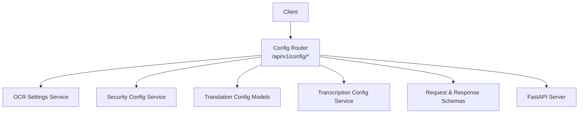
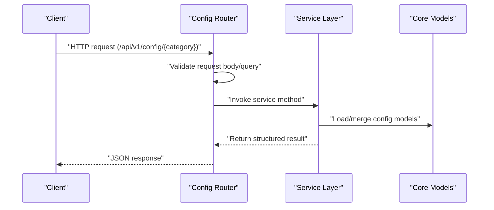
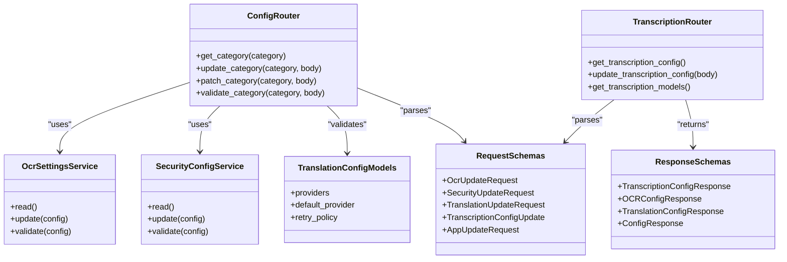

# Configuration API

<cite>
**Referenced Files in This Document**
- [config.py](file://src/omniscribe/api/routers/config.py)
- [transcription.py](file://src/omniscribe/api/routers/transcription.py)
- [ocr_settings.py](file://src/omniscribe/api/services/ocr_settings.py)
- [security_config.py](file://src/omniscribe/api/services/security_config.py)
- [translation_config.py](file://src/omniscribe/core/translation_config.py)
- [schemas/requests.py](file://src/omniscribe/api/schemas/requests.py)
- [schemas/responses.py](file://src/omniscribe/api/schemas/responses.py)
- [server.py](file://src/omniscribe/server.py)
</cite>

## Update Summary
**Changes Made**
- Added comprehensive transcription configuration section with dedicated endpoints
- Extended environment variable documentation to include all OMNISCRIBE_TRANSCRIPTION_* variables
- Updated configuration categories to include transcription as a fourth major category
- Added detailed transcription-specific settings including API base URLs, keys, models, languages, prompts, and temperature
- Enhanced response schemas to include TranscriptionConfigResponse model
- Updated architecture diagrams to reflect the new transcription namespace

## Table of Contents
1. [Introduction](#introduction)
2. [Project Structure](#project-structure)
3. [Core Components](#core-components)
4. [Architecture Overview](#architecture-overview)
5. [Detailed Component Analysis](#detailed-component-analysis)
6. [Dependency Analysis](#dependency-analysis)
7. [Performance Considerations](#performance-considerations)
8. [Troubleshooting Guide](#troubleshooting-guide)
9. [Conclusion](#conclusion)
10. [Appendices](#appendices)

## Introduction
This document provides detailed API documentation for OmniScribe's configuration management endpoints. It covers reading, updating, and validating system configuration across categories such as OCR settings, translation providers, security policies, application parameters, and **newly added transcription-specific settings**. The guide includes URL patterns, request/response schemas, authentication requirements, status codes, examples, environment variable overrides, hot-reloading capabilities, and validation rules.

## Project Structure
The configuration API is implemented as a FastAPI router with service-backed logic and Pydantic-based schemas. Key files:
- Router: src/omniscribe/api/routers/config.py
- Transcription Router: src/omniscribe/api/routers/transcription.py
- Services: src/omniscribe/api/services/ocr_settings.py, src/omniscribe/api/services/security_config.py
- Core config models: src/omniscribe/core/translation_config.py
- Request schemas: src/omniscribe/api/schemas/requests.py
- Response schemas: src/omniscribe/api/schemas/responses.py
- Server wiring: src/omniscribe/server.py

**Diagram sources**
- [config.py](file://src/omniscribe/api/routers/config.py)
- [transcription.py](file://src/omniscribe/api/routers/transcription.py)
- [ocr_settings.py](file://src/omniscribe/api/services/ocr_settings.py)
- [security_config.py](file://src/omniscribe/api/services/security_config.py)
- [translation_config.py](file://src/omniscribe/core/translation_config.py)
- [schemas/requests.py](file://src/omniscribe/api/schemas/requests.py)
- [schemas/responses.py](file://src/omniscribe/api/schemas/responses.py)
- [server.py](file://src/omniscribe/server.py)

**Section sources**
- [config.py](file://src/omniscribe/api/routers/config.py)
- [transcription.py](file://src/omniscribe/api/routers/transcription.py)
- [server.py](file://src/omniscribe/server.py)

## Core Components
- Configuration Router: Exposes REST endpoints under /api/v1/config/. Handles GET (read), PUT/PATCH (update), and POST (validate).
- OCR Settings Service: Manages OCR engine selection, model paths, thresholds, and pipeline options.
- Security Config Service: Manages CORS, auth modes, token policies, and related security parameters.
- Translation Config Models: Defines provider-specific configuration structures and defaults.
- **Transcription Config Service**: Manages voice transcription settings including API endpoints, models, languages, prompts, and temperature controls.
- Request Schemas: Pydantic models used to validate incoming requests and responses.

Typical response envelope:
- success: boolean
- message: string
- data: object (configuration payload)
- errors: array of objects (validation or runtime errors)

Authentication:
- If enabled by server configuration, endpoints may require an API key or bearer token. Check the server's middleware and router dependencies for exact requirements.

Status Codes:
- 200 OK: Successful read/update/validation
- 400 Bad Request: Invalid input or schema validation failure
- 401 Unauthorized: Missing or invalid credentials (when auth is enabled)
- 403 Forbidden: Insufficient permissions (if role-based access is enforced)
- 404 Not Found: Unknown configuration category or endpoint
- 422 Unprocessable Entity: Schema validation error from Pydantic
- 500 Internal Server Error: Unexpected server-side error

Hot-reload:
- Some configuration changes can be applied at runtime without restarts. Behavior depends on service implementation; see per-endpoint notes below.

Environment Overrides:
- Many configuration values can be overridden via environment variables. See Appendix A for supported variables and precedence rules.

**Section sources**
- [config.py](file://src/omniscribe/api/routers/config.py)
- [transcription.py](file://src/omniscribe/api/routers/transcription.py)
- [ocr_settings.py](file://src/omniscribe/api/services/ocr_settings.py)
- [security_config.py](file://src/omniscribe/api/services/security_config.py)
- [translation_config.py](file://src/omniscribe/core/translation_config.py)
- [schemas/requests.py](file://src/omniscribe/api/schemas/requests.py)
- [schemas/responses.py](file://src/omniscribe/api/schemas/responses.py)

## Architecture Overview
The configuration API follows a layered design:
- HTTP layer (FastAPI router) validates requests using Pydantic schemas.
- Service layer encapsulates business logic for each configuration domain.
- Core models define canonical configuration shapes and defaults.
- Optional persistence and hot-reload mechanisms are invoked by services.

**Diagram sources**
- [config.py](file://src/omniscribe/api/routers/config.py)
- [transcription.py](file://src/omniscribe/api/routers/transcription.py)
- [ocr_settings.py](file://src/omniscribe/api/services/ocr_settings.py)
- [security_config.py](file://src/omniscribe/api/services/security_config.py)
- [translation_config.py](file://src/omniscribe/core/translation_config.py)
- [schemas/requests.py](file://src/omniscribe/api/schemas/requests.py)
- [schemas/responses.py](file://src/omniscribe/api/schemas/responses.py)

## Detailed Component Analysis

### Endpoints Reference
Base path: /api/v1/config/

Categories:
- ocr: OCR engine and pipeline settings
- translation: Translation provider configurations
- **transcription: Voice transcription settings and parameters**
- security: Security policy settings
- app: Application-level parameters

Common behaviors:
- GET returns current configuration for the category.
- PUT replaces the entire configuration for the category.
- PATCH applies partial updates where supported.
- POST /validate validates a proposed configuration without applying it.

Authentication:
- If the server enables authentication, include required headers (e.g., Authorization: Bearer <token> or X-API-Key). Otherwise, these endpoints may be public within the trusted network.

Response envelope:
- success: boolean
- message: string
- data: object (category-specific configuration)
- errors: array of objects (each with field, message)

#### Read Configuration
- Method: GET
- Path: /api/v1/config/{category}
- Query params: none
- Response: Current configuration for {category}

Example:
- GET /api/v1/config/ocr
- GET /api/v1/config/transcription
- Expected response fields depend on the category configuration model.

**Section sources**
- [config.py](file://src/omniscribe/api/routers/config.py)
- [transcription.py](file://src/omniscribe/api/routers/transcription.py)
- [ocr_settings.py](file://src/omniscribe/api/services/ocr_settings.py)
- [translation_config.py](file://src/omniscribe/core/translation_config.py)
- [security_config.py](file://src/omniscribe/api/services/security_config.py)

#### Update Configuration
- Method: PUT
- Path: /api/v1/config/{category}
- Body: Full configuration object for {category}
- Behavior: Replaces existing configuration atomically. May trigger hot-reload if supported.

Example:
- PUT /api/v1/config/ocr with updated OCR engine settings
- PUT /api/v1/config/transcription with new transcription API settings

Notes:
- For partial updates, prefer PATCH when available.
- On success, response includes updated configuration snapshot.

**Section sources**
- [config.py](file://src/omniscribe/api/routers/config.py)
- [transcription.py](file://src/omniscribe/api/routers/transcription.py)
- [ocr_settings.py](file://src/omniscribe/api/services/ocr_settings.py)
- [security_config.py](file://src/omniscribe/api/services/security_config.py)

#### Partial Update
- Method: PATCH
- Path: /api/v1/config/{category}
- Body: Subset of configuration fields to update
- Behavior: Applies only provided fields; others remain unchanged. Hot-reload may apply immediately.

Example:
- PATCH /api/v1/config/security with new CORS allowlist
- PATCH /api/v1/config/transcription with updated temperature setting

**Section sources**
- [config.py](file://src/omniscribe/api/routers/config.py)
- [transcription.py](file://src/omniscribe/api/routers/transcription.py)
- [security_config.py](file://src/omniscribe/api/services/security_config.py)

#### Validate Configuration
- Method: POST
- Path: /api/v1/config/{category}/validate
- Body: Proposed configuration object for {category}
- Behavior: Validates against schema and business rules without persisting changes. Returns validation results and errors.

Example:
- POST /api/v1/config/translation/validate with new provider settings
- POST /api/v1/config/transcription/validate with new transcription settings

**Section sources**
- [config.py](file://src/omniscribe/api/routers/config.py)
- [transcription.py](file://src/omniscribe/api/routers/transcription.py)
- [translation_config.py](file://src/omniscribe/core/translation_config.py)

### Category: OCR Settings
Purpose: Configure OCR engines, models, preprocessing, and pipeline behavior.

Key fields (representative):
- engine: selected OCR engine identifier
- model_path: path or identifier for model assets
- confidence_threshold: numeric threshold for acceptance
- preprocess: flags for image normalization, deskew, etc.
- languages: list of language codes
- timeout_ms: request timeout for external OCR calls

Hot-reload:
- Engine switching and thresholds may be applied at runtime depending on service implementation.

Validation rules:
- engine must be one of supported values.
- confidence_threshold must be within [0, 1].
- languages must be valid ISO codes.

Examples:
- Read current OCR settings: GET /api/v1/config/ocr
- Update OCR engine: PUT /api/v1/config/ocr with new engine and model_path
- Validate proposed OCR config: POST /api/v1/config/ocr/validate

**Section sources**
- [ocr_settings.py](file://src/omniscribe/api/services/ocr_settings.py)
- [config.py](file://src/omniscribe/api/routers/config.py)

### Category: Translation Providers
Purpose: Manage translation provider configurations and routing preferences.

Key fields (representative):
- providers: map of provider name to provider-specific config
- default_provider: fallback provider name
- retry_policy: retries, backoff strategy
- rate_limits: per-provider limits
- fallback_chain: ordered list of providers for failover

Provider-specific config (example providers):
- openai: api_key, model, temperature, max_tokens
- local_nllb: model_id, device, batch_size
- custom_http: base_url, headers, auth_scheme

Hot-reload:
- Provider toggles and rate limits may be applied at runtime.

Validation rules:
- default_provider must exist in providers.
- Each provider must satisfy its own schema.
- Fallback chain entries must reference configured providers.

Examples:
- Read current translation config: GET /api/v1/config/translation
- Add a new provider: PUT /api/v1/config/translation with updated providers map
- Validate proposed translation config: POST /api/v1/config/translation/validate

**Section sources**
- [translation_config.py](file://src/omniscribe/core/translation_config.py)
- [config.py](file://src/omniscribe/api/routers/config.py)

### Category: Transcription Settings
**New** Purpose: Configure voice transcription engines, models, language processing, and audio parameters.

Key fields (representative):
- transcription_api_base: Base URL for transcription API (default: https://api.openai.com/v1)
- transcription_api_key: API key for transcription service authentication
- transcription_model: Model identifier (default: whisper-1)
- transcription_engine: Engine type (api, whisper_api, local, whisper_local, auto)
- transcription_auth_token: Authentication token for transcription services
- language: Target language code for transcription
- prompt: Custom prompt for transcription guidance
- temperature: Generation temperature (0.0 to 2.0)

Supported engines:
- `api`: Standard API-based transcription
- `whisper_api`: OpenAI Whisper API specifically
- `local`: Local transcription engine
- `whisper_local`: Local Whisper implementation
- `auto`: Automatic engine selection

Hot-reload:
- All transcription settings support runtime updates without service restart.

Validation rules:
- temperature must be between 0.0 and 2.0
- engine must be one of the supported values
- transcription_api_base must be a valid URL
- language should be a valid ISO language code

Examples:
- Read current transcription config: GET /api/v1/config/transcription
- Update transcription API settings: POST /api/v1/config/transcription with new api_base and api_key
- Configure local Whisper engine: POST /api/v1/config/transcription with engine=whisper_local
- Set transcription language and prompt: POST /api/v1/config/transcription with language and prompt fields

**Section sources**
- [transcription.py](file://src/omniscribe/api/routers/transcription.py)
- [config.py](file://src/omniscribe/api/routers/config.py)
- [schemas/requests.py](file://src/omniscribe/api/schemas/requests.py)
- [schemas/responses.py](file://src/omniscribe/api/schemas/responses.py)

### Category: Security Policies
Purpose: Control CORS, authentication, authorization, and other security-related settings.

Key fields (representative):
- cors: allowed_origins, allowed_methods, allowed_headers, allow_credentials
- auth_mode: e.g., none, api_key, bearer_token
- api_keys: list of permitted keys or key prefixes
- token_policies: expiration, rotation, scopes
- ip_whitelist: optional IP allowlist

Hot-reload:
- CORS and token policies may be reloaded at runtime.

Validation rules:
- auth_mode must be a supported value.
- allowed_origins must be valid URLs or wildcards.
- token_policies must have positive durations.

Examples:
- Read current security config: GET /api/v1/config/security
- Enable bearer tokens: PUT /api/v1/config/security with auth_mode and token_policies
- Validate proposed security config: POST /api/v1/config/security/validate

**Section sources**
- [security_config.py](file://src/omniscribe/api/services/security_config.py)
- [config.py](file://src/omniscribe/api/routers/config.py)

### Category: Application Parameters
Purpose: Global application settings such as logging level, feature flags, and resource limits.

Key fields (representative):
- log_level: debug, info, warn, error
- feature_flags: map of flag names to booleans
- resource_limits: max_concurrent_jobs, memory_limit_mb
- ui_enabled: boolean to enable/disable static UI serving

Hot-reload:
- Logging and feature flags typically support runtime updates.

Validation rules:
- log_level must be a recognized level.
- resource_limits must be positive integers.

Examples:
- Read current app config: GET /api/v1/config/app
- Toggle a feature flag: PATCH /api/v1/config/app with feature_flags
- Validate proposed app config: POST /api/v1/config/app/validate

**Section sources**
- [config.py](file://src/omniscribe/api/routers/config.py)

### Request and Response Schemas
All endpoints use Pydantic models defined in the request schemas module. Responses follow a consistent envelope with success, message, data, and errors fields.

- Request schemas: see schemas/requests.py
- Response schemas: see schemas/responses.py
- Response envelope: standardized across endpoints

Validation:
- Requests are validated before reaching service logic. Errors return 422 with details.

**Section sources**
- [schemas/requests.py](file://src/omniscribe/api/schemas/requests.py)
- [schemas/responses.py](file://src/omniscribe/api/schemas/responses.py)
- [config.py](file://src/omniscribe/api/routers/config.py)

## Dependency Analysis
The configuration router depends on services and core models. The following diagram shows relationships between components involved in configuration handling.

**Diagram sources**
- [config.py](file://src/omniscribe/api/routers/config.py)
- [transcription.py](file://src/omniscribe/api/routers/transcription.py)
- [ocr_settings.py](file://src/omniscribe/api/services/ocr_settings.py)
- [security_config.py](file://src/omniscribe/api/services/security_config.py)
- [translation_config.py](file://src/omniscribe/core/translation_config.py)
- [schemas/requests.py](file://src/omniscribe/api/schemas/requests.py)
- [schemas/responses.py](file://src/omniscribe/api/schemas/responses.py)

**Section sources**
- [config.py](file://src/omniscribe/api/routers/config.py)
- [transcription.py](file://src/omniscribe/api/routers/transcription.py)
- [ocr_settings.py](file://src/omniscribe/api/services/ocr_settings.py)
- [security_config.py](file://src/omniscribe/api/services/security_config.py)
- [translation_config.py](file://src/omniscribe/core/translation_config.py)
- [schemas/requests.py](file://src/omniscribe/api/schemas/requests.py)
- [schemas/responses.py](file://src/omniscribe/api/schemas/responses.py)

## Performance Considerations
- Prefer PATCH for small updates to reduce payload size and avoid full reloads.
- Use validate endpoints to catch misconfigurations before applying them.
- Avoid frequent polling of configuration endpoints; cache client-side where appropriate.
- Be mindful of hot-reload costs; some changes may incur transient overhead.
- Transcription configuration updates are lightweight and can be applied at runtime without performance impact.

## Troubleshooting Guide
Common issues and resolutions:
- 401 Unauthorized: Ensure correct authentication header is present when auth is enabled.
- 422 Unprocessable Entity: Review request body against schema; check field types and constraints.
- 404 Not Found: Verify category name and endpoint spelling.
- Validation failures: Use POST /{category}/validate to get detailed error messages before applying changes.
- Hot-reload not taking effect: Confirm that the specific setting supports runtime updates; consult service implementation.
- Transcription API connection issues: Verify transcription_api_base URL is accessible and transcription_api_key is valid.

**Section sources**
- [config.py](file://src/omniscribe/api/routers/config.py)
- [transcription.py](file://src/omniscribe/api/routers/transcription.py)
- [ocr_settings.py](file://src/omniscribe/api/services/ocr_settings.py)
- [security_config.py](file://src/omniscribe/api/services/security_config.py)
- [translation_config.py](file://src/omniscribe/core/translation_config.py)

## Conclusion
OmniScribe's configuration API provides a unified interface to manage OCR, translation, transcription, security, and application settings. Use GET to inspect current state, PUT/PATCH to modify, and POST /validate to ensure correctness. Leverage environment variable overrides and hot-reload features for dynamic operation while maintaining robust validation and clear error reporting. The new transcription configuration system provides comprehensive control over voice transcription settings through both API endpoints and environment variables.

## Appendices

### Appendix A: Environment Variable Overrides
Configuration values can be overridden via environment variables. Typical precedence:
- Runtime API updates (highest)
- Environment variables
- Defaults in code

**Updated** Added comprehensive transcription environment variables:

Supported variables (examples):
- OCR_ENGINE: selects OCR engine
- OCR_MODEL_PATH: path to OCR model assets
- OCR_CONFIDENCE_THRESHOLD: numeric threshold
- TRANSLATION_DEFAULT_PROVIDER: default provider name
- TRANSLATION_PROVIDERS_OPENAI_API_KEY: provider-specific secret
- SECURITY_AUTH_MODE: authentication mode
- SECURITY_CORS_ALLOWED_ORIGINS: comma-separated origins
- APP_LOG_LEVEL: logging verbosity
- APP_FEATURE_FLAG_<NAME>: boolean flags

**New Transcription Environment Variables:**
- OMNISCRIBE_TRANSCRIPTION_API_BASE: Base URL for transcription API (default: https://api.openai.com/v1)
- OMNISCRIBE_TRANSCRIPTION_API_KEY: API key for transcription service
- OMNISCRIBE_TRANSCRIPTION_MODEL: Default transcription model (default: whisper-1)
- OMNISCRIBE_TRANSCRIPTION_ENGINE: Transcription engine type (default: api)
- OMNISCRIBE_TRANSCRIPTION_LANGUAGE: Default language code for transcription
- OMNISCRIBE_TRANSCRIPTION_PROMPT: Custom prompt for transcription guidance
- OMNISCRIBE_TRANSCRIPTION_TEMPERATURE: Generation temperature (default: 0.0)
- OMNISCRIBE_TRANSCRIPTION_AUTH_TOKEN: Authentication token for transcription routes

Notes:
- Secrets should be provided via environment variables rather than persisted configuration.
- Changes via environment variables typically require restart unless explicitly supported by the service.
- Transcription environment variables support both OMNISCRIBE_TRANSCRIPTION_* and legacy LLM_* fallbacks.

**Section sources**
- [ocr_settings.py](file://src/omniscribe/api/services/ocr_settings.py)
- [translation_config.py](file://src/omniscribe/core/translation_config.py)
- [security_config.py](file://src/omniscribe/api/services/security_config.py)
- [config.py](file://src/omniscribe/api/routers/config.py)
- [transcription.py](file://src/omniscribe/api/routers/transcription.py)

### Appendix B: Example Workflows

- Query current configuration:
  - GET /api/v1/config/ocr
  - GET /api/v1/config/translation
  - GET /api/v1/config/transcription
  - GET /api/v1/config/security
  - GET /api/v1/config/app

- Update OCR engine settings:
  - PUT /api/v1/config/ocr with updated engine and model_path
  - Or PATCH /api/v1/config/ocr for minimal changes

- Configure translation providers:
  - PUT /api/v1/config/translation with new providers map and default_provider
  - Validate first: POST /api/v1/config/translation/validate

**New Transcription Configuration Workflows:**
- Configure transcription API settings:
  - GET /api/v1/config/transcription to view current settings
  - POST /api/v1/config/transcription with new api_base and api_key
  - Set transcription model: POST /api/v1/config/transcription with model=whisper-large-v3
  - Configure local Whisper: POST /api/v1/config/transcription with engine=whisper_local

- Set transcription language and prompts:
  - POST /api/v1/config/transcription with language=en&prompt=Transcribe this audio clearly
  - Adjust temperature for creativity: POST /api/v1/config/transcription with temperature=0.7

- Manage transcription authentication:
  - Set transcription auth token via environment: OMNISCRIBE_TRANSCRIPTION_AUTH_TOKEN
  - Update runtime via security configuration

- Validate transcription configuration:
  - POST /api/v1/config/transcription/validate with proposed settings

- Manage security policies:
  - PUT /api/v1/config/security to set auth_mode, CORS, and token policies
  - Validate first: POST /api/v1/config/security/validate

- Validate configuration changes:
  - POST /api/v1/config/{category}/validate with proposed payload

**Section sources**
- [config.py](file://src/omniscribe/api/routers/config.py)
- [transcription.py](file://src/omniscribe/api/routers/transcription.py)
- [ocr_settings.py](file://src/omniscribe/api/services/ocr_settings.py)
- [translation_config.py](file://src/omniscribe/core/translation_config.py)
- [security_config.py](file://src/omniscribe/api/services/security_config.py)