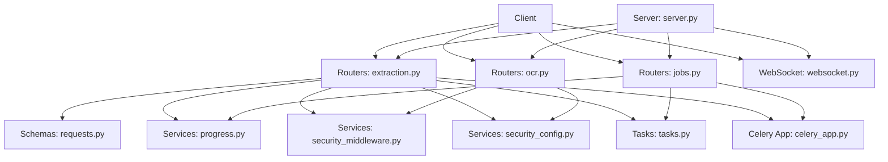
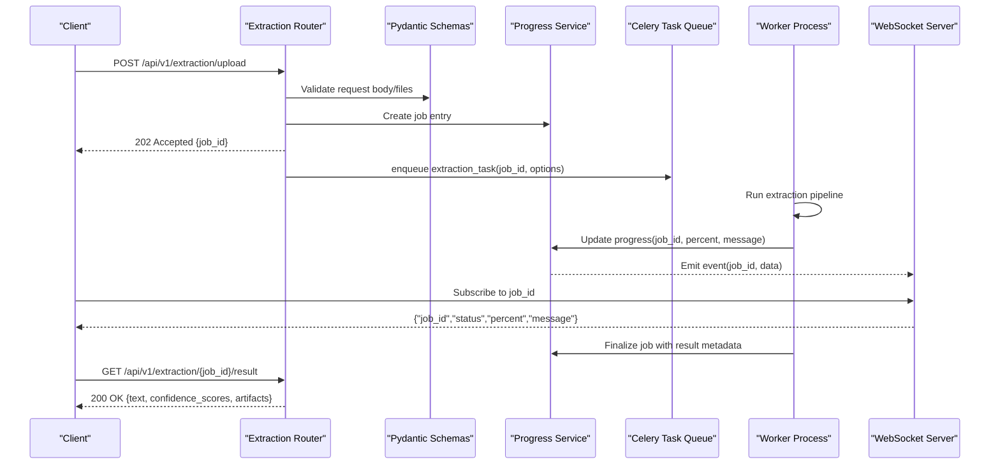
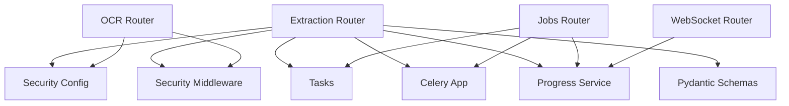

# Document Extraction API

<cite>
**Referenced Files in This Document**
- [extraction.py](file://src/local_deepl/api/routers/extraction.py)
- [jobs.py](file://src/local_deepl/api/routers/jobs.py)
- [ocr.py](file://src/local_deepl/api/routers/ocr.py)
- [requests.py](file://src/local_deepl/api/schemas/requests.py)
- [progress.py](file://src/local_deepl/api/services/progress.py)
- [security_middleware.py](file://src/local_deepl/api/services/security_middleware.py)
- [security_config.py](file://src/local_deepl/api/services/security_config.py)
- [tasks.py](file://src/local_deepl/api/tasks.py)
- [celery_app.py](file://src/local_deepl/api/celery_app.py)
- [server.py](file://src/local_deepl/server.py)
</cite>

## Table of Contents
1. [Introduction](#introduction)
2. [Project Structure](#project-structure)
3. [Core Components](#core-components)
4. [Architecture Overview](#architecture-overview)
5. [Detailed Component Analysis](#detailed-component-analysis)
6. [Dependency Analysis](#dependency-analysis)
7. [Performance Considerations](#performance-considerations)
8. [Troubleshooting Guide](#troubleshooting-guide)
9. [Conclusion](#conclusion)
10. [Appendices](#appendices)

## Introduction
This document provides detailed API documentation for LocalDeepL’s document extraction endpoints. It covers uploading, processing, and retrieving documents (PDFs, images, and text files), including OCR configuration, progress tracking, and response schemas. The API is implemented with FastAPI routers and Pydantic models, integrates asynchronous task processing via Celery, and exposes both REST and WebSocket interfaces for real-time progress updates.

## Project Structure
The extraction-related functionality is organized under the API layer:
- Routers define HTTP endpoints for extraction, jobs, OCR settings, and WebSocket progress.
- Schemas define request/response models using Pydantic.
- Services implement business logic such as progress tracking and security middleware.
- Tasks and Celery app orchestrate background processing.
- Server wires routers and middleware into the application.

**Diagram sources**
- [extraction.py](file://src/local_deepl/api/routers/extraction.py)
- [jobs.py](file://src/local_deepl/api/routers/jobs.py)
- [ocr.py](file://src/local_deepl/api/routers/ocr.py)
- [websocket.py](file://src/local_deepl/api/routers/websocket.py)
- [requests.py](file://src/local_deepl/api/schemas/requests.py)
- [progress.py](file://src/local_deepl/api/services/progress.py)
- [security_middleware.py](file://src/local_deepl/api/services/security_middleware.py)
- [security_config.py](file://src/local_deepl/api/services/security_config.py)
- [tasks.py](file://src/local_deepl/api/tasks.py)
- [celery_app.py](file://src/local_deepl/api/celery_app.py)
- [server.py](file://src/local_deepl/server.py)

**Section sources**
- [server.py](file://src/local_deepl/server.py)
- [extraction.py](file://src/local_deepl/api/routers/extraction.py)
- [jobs.py](file://src/local_deepl/api/routers/jobs.py)
- [ocr.py](file://src/local_deepl/api/routers/ocr.py)
- [websocket.py](file://src/local_deepl/api/routers/websocket.py)
- [requests.py](file://src/local_deepl/api/schemas/requests.py)
- [progress.py](file://src/local_deepl/api/services/progress.py)
- [security_middleware.py](file://src/local_deepl/api/services/security_middleware.py)
- [security_config.py](file://src/local_deepl/api/services/security_config.py)
- [tasks.py](file://src/local_deepl/api/tasks.py)
- [celery_app.py](file://src/local_deepl/api/celery_app.py)

## Core Components
- Extraction router: Uploads documents, triggers extraction jobs, returns job identifiers, and supports status checks.
- Jobs router: Provides job lifecycle management (list, get, cancel).
- OCR router: Manages OCR configuration and retrieval.
- Schemas: Define request and response structures for uploads, OCR settings, and results.
- Progress service: Tracks and reports job progress.
- Security middleware/config: Enforces authentication and authorization policies.
- Celery tasks: Execute long-running extraction pipelines asynchronously.

Key responsibilities:
- Input validation and schema enforcement via Pydantic.
- Asynchronous processing through Celery to avoid blocking requests.
- Real-time progress updates via WebSocket events.
- Secure access control via middleware and configuration.

**Section sources**
- [extraction.py](file://src/local_deepl/api/routers/extraction.py)
- [jobs.py](file://src/local_deepl/api/routers/jobs.py)
- [ocr.py](file://src/local_deepl/api/routers/ocr.py)
- [requests.py](file://src/local_deepl/api/schemas/requests.py)
- [progress.py](file://src/local_deepl/api/services/progress.py)
- [security_middleware.py](file://src/local_deepl/api/services/security_middleware.py)
- [security_config.py](file://src/local_deepl/api/services/security_config.py)
- [tasks.py](file://src/local_deepl/api/tasks.py)
- [celery_app.py](file://src/local_deepl/api/celery_app.py)

## Architecture Overview
The extraction workflow involves client uploads, server-side validation, job creation, asynchronous processing, and result retrieval. Progress can be polled or subscribed to via WebSocket.

**Diagram sources**
- [extraction.py](file://src/local_deepl/api/routers/extraction.py)
- [websocket.py](file://src/local_deepl/api/routers/websocket.py)
- [progress.py](file://src/local_deepl/api/services/progress.py)
- [tasks.py](file://src/local_deepl/api/tasks.py)
- [celery_app.py](file://src/local_deepl/api/celery_app.py)

## Detailed Component Analysis

### Endpoints Reference

#### Upload Document
- Method: POST
- URL: /api/v1/extraction/upload
- Description: Accepts a document file (PDF, image, or text) and optional OCR/preprocessing parameters. Returns a job identifier for asynchronous processing.
- Authentication: Depends on configured security middleware; may require API key or token.
- Request Body:
  - File: multipart/form-data with field name “file”
  - Optional fields:
    - ocr_enabled: boolean
    - language: string (ISO code)
    - preprocess_mode: string (e.g., auto, enhance, none)
    - output_format: string (e.g., plain_text, structured_json)
- Response:
  - 202 Accepted: { job_id: string }
  - 400 Bad Request: Validation error
  - 401 Unauthorized: Missing/invalid credentials
  - 413 Payload Too Large: File exceeds size limit
  - 415 Unsupported Media Type: Invalid content type
  - 500 Internal Server Error: Unexpected failure

Example curl:
- curl -X POST "http://localhost:8000/api/v1/extraction/upload" -F "file=@document.pdf" -F "ocr_enabled=true" -F "language=en" -F "preprocess_mode=enhance" -F "output_format=structured_json"

Example Python (requests):
- Use requests.post with multipart form data containing file and options.

Example JavaScript (fetch):
- Construct FormData, append file and options, then fetch with method POST.

**Section sources**
- [extraction.py](file://src/local_deepl/api/routers/extraction.py)
- [requests.py](file://src/local_deepl/api/schemas/requests.py)
- [security_middleware.py](file://src/local_deepl/api/services/security_middleware.py)
- [security_config.py](file://src/local_deepl/api/services/security_config.py)

#### Get Job Status
- Method: GET
- URL: /api/v1/extraction/{job_id}/status
- Description: Retrieves current job status and progress details.
- Authentication: Required if security middleware is enabled.
- Response:
  - 200 OK: { job_id, status, percent, message, created_at, updated_at }
  - 404 Not Found: Job not found
  - 401 Unauthorized: Missing/invalid credentials

Example curl:
- curl "http://localhost:8000/api/v1/extraction/<job_id>/status"

Example Python (requests):
- requests.get(url) with headers if needed.

Example JavaScript (fetch):
- fetch(url) with appropriate headers.

**Section sources**
- [extraction.py](file://src/local_deepl/api/routers/extraction.py)
- [progress.py](file://src/local_deepl/api/services/progress.py)
- [security_middleware.py](file://src/local_deepl/api/services/security_middleware.py)

#### Retrieve Extraction Result
- Method: GET
- URL: /api/v1/extraction/{job_id}/result
- Description: Retrieves the final extracted text and associated metadata, including confidence scores and artifacts.
- Authentication: Required if security middleware is enabled.
- Response:
  - 200 OK: { job_id, text, confidence_scores, artifacts, format }
  - 404 Not Found: Job not found or result not ready
  - 401 Unauthorized: Missing/invalid credentials

Example curl:
- curl "http://localhost:8000/api/v1/extraction/<job_id>/result"

Example Python (requests):
- requests.get(url) and parse JSON.

Example JavaScript (fetch):
- fetch(url) and handle JSON response.

**Section sources**
- [extraction.py](file://src/local_deepl/api/routers/extraction.py)
- [progress.py](file://src/local_deepl/api/services/progress.py)
- [security_middleware.py](file://src/local_deepl/api/services/security_middleware.py)

#### Manage Jobs
- Methods:
  - GET /api/v1/jobs: List all jobs with pagination and filters.
  - GET /api/v1/jobs/{job_id}: Get specific job details.
  - DELETE /api/v1/jobs/{job_id}: Cancel or delete a job.
- Authentication: Required if security middleware is enabled.
- Responses:
  - 200 OK: Job list or details
  - 404 Not Found: Job not found
  - 401 Unauthorized: Missing/invalid credentials
  - 403 Forbidden: Insufficient permissions

Example curl:
- curl "http://localhost:8000/api/v1/jobs"
- curl "http://localhost:8000/api/v1/jobs/<job_id>"
- curl -X DELETE "http://localhost:8000/api/v1/jobs/<job_id>"

**Section sources**
- [jobs.py](file://src/local_deepl/api/routers/jobs.py)
- [progress.py](file://src/local_deepl/api/services/progress.py)
- [security_middleware.py](file://src/local_deepl/api/services/security_middleware.py)

#### OCR Configuration
- Methods:
  - GET /api/v1/ocr/settings: Retrieve current OCR settings.
  - PUT /api/v1/ocr/settings: Update OCR settings.
- Authentication: Required if security middleware is enabled.
- Request/Response Schema:
  - Fields include language, preprocessing mode, model selection, thresholds, and output preferences.
- Responses:
  - 200 OK: Current settings
  - 400 Bad Request: Invalid settings
  - 401 Unauthorized: Missing/invalid credentials

Example curl:
- curl "http://localhost:8000/api/v1/ocr/settings"
- curl -X PUT "http://localhost:8000/api/v1/ocr/settings" -H "Content-Type: application/json" -d '{"language":"en","preprocess_mode":"enhance"}'

**Section sources**
- [ocr.py](file://src/local_deepl/api/routers/ocr.py)
- [requests.py](file://src/local_deepl/api/schemas/requests.py)
- [security_middleware.py](file://src/local_deepl/api/services/security_middleware.py)

#### WebSocket Progress Updates
- Endpoint: ws://localhost:8000/ws/jobs/{job_id}
- Description: Subscribes to real-time progress events for a specific job.
- Events:
  - progress_update: { job_id, percent, message }
  - job_completed: { job_id, result_summary }
  - job_failed: { job_id, error_message }
- Authentication: May require token in query parameter or header depending on middleware config.

Example curl (wscat):
- wscat -c "ws://localhost:8000/ws/jobs/<job_id>"

Example Python (websockets):
- Connect to WebSocket and listen for events.

Example JavaScript (fetch/WebSocket):
- new WebSocket(url) and handle messages.

**Section sources**
- [websocket.py](file://src/local_deepl/api/routers/websocket.py)
- [progress.py](file://src/local_deepl/api/services/progress.py)
- [security_middleware.py](file://src/local_deepl/api/services/security_middleware.py)

### Request/Response Schemas (Pydantic Models)
- UploadRequest:
  - file: UploadedFile
  - ocr_enabled: bool = False
  - language: str = "auto"
  - preprocess_mode: str = "auto"
  - output_format: str = "plain_text"
- JobStatusResponse:
  - job_id: str
  - status: str
  - percent: int
  - message: str
  - created_at: datetime
  - updated_at: datetime
- ExtractionResultResponse:
  - job_id: str
  - text: str
  - confidence_scores: dict
  - artifacts: list
  - format: str
- OcrSettingsRequest:
  - language: str
  - preprocess_mode: str
  - model: str
  - threshold: float
  - output_preferences: dict
- OcrSettingsResponse:
  - language: str
  - preprocess_mode: str
  - model: str
  - threshold: float
  - output_preferences: dict

Notes:
- Field names and types are defined in the schemas module.
- Validation errors return 400 with descriptive messages.
- Confidence scores are provided per line or block depending on output format.

**Section sources**
- [requests.py](file://src/local_deepl/api/schemas/requests.py)

### Authentication and Authorization
- Security Middleware:
  - Enforces API key or token-based authentication.
  - Can restrict endpoints based on roles or scopes.
- Security Config:
  - Defines allowed keys, token formats, and route-level protections.
- Behavior:
  - Requests without valid credentials receive 401 Unauthorized.
  - Insufficient permissions yield 403 Forbidden.

**Section sources**
- [security_middleware.py](file://src/local_deepl/api/services/security_middleware.py)
- [security_config.py](file://src/local_deepl/api/services/security_config.py)

### Background Processing and Progress Tracking
- Celery Tasks:
  - Long-running extraction tasks are enqueued and executed by workers.
  - Tasks update progress via the progress service.
- Progress Service:
  - Stores job state, percentage, and messages.
  - Emits events to WebSocket subscribers.
- Integration:
  - Routers enqueue tasks and return job IDs immediately.
  - Clients poll status or subscribe to WebSocket for real-time updates.

**Section sources**
- [tasks.py](file://src/local_deepl/api/tasks.py)
- [celery_app.py](file://src/local_deepl/api/celery_app.py)
- [progress.py](file://src/local_deepl/api/services/progress.py)

### Supported File Formats and Limits
- Supported formats:
  - PDF (.pdf)
  - Images (.png, .jpg, .jpeg, .tiff, .bmp)
  - Text files (.txt, .md)
- Size limits:
  - Enforced by server configuration and middleware; large payloads return 413.
- Preprocessing options:
  - Auto-detection, enhancement, noise reduction, rotation correction.
- Output formats:
  - Plain text or structured JSON with blocks and confidence scores.

**Section sources**
- [extraction.py](file://src/local_deepl/api/routers/extraction.py)
- [requests.py](file://src/local_deepl/api/schemas/requests.py)

### Error Handling Patterns
- Common status codes:
  - 400 Bad Request: Invalid input or schema validation failures.
  - 401 Unauthorized: Missing or invalid credentials.
  - 403 Forbidden: Insufficient permissions.
  - 404 Not Found: Resource does not exist.
  - 413 Payload Too Large: File exceeds maximum size.
  - 415 Unsupported Media Type: Invalid content type.
  - 500 Internal Server Error: Unexpected server-side failures.
- Error responses:
  - Include error code, message, and optional details for debugging.

**Section sources**
- [extraction.py](file://src/local_deepl/api/routers/extraction.py)
- [jobs.py](file://src/local_deepl/api/routers/jobs.py)
- [ocr.py](file://src/local_deepl/api/routers/ocr.py)

## Dependency Analysis
The extraction system depends on routers, schemas, services, and background workers. The following diagram shows core dependencies:

**Diagram sources**
- [extraction.py](file://src/local_deepl/api/routers/extraction.py)
- [jobs.py](file://src/local_deepl/api/routers/jobs.py)
- [ocr.py](file://src/local_deepl/api/routers/ocr.py)
- [websocket.py](file://src/local_deepl/api/routers/websocket.py)
- [requests.py](file://src/local_deepl/api/schemas/requests.py)
- [progress.py](file://src/local_deepl/api/services/progress.py)
- [security_middleware.py](file://src/local_deepl/api/services/security_middleware.py)
- [security_config.py](file://src/local_deepl/api/services/security_config.py)
- [tasks.py](file://src/local_deepl/api/tasks.py)
- [celery_app.py](file://src/local_deepl/api/celery_app.py)

**Section sources**
- [extraction.py](file://src/local_deepl/api/routers/extraction.py)
- [jobs.py](file://src/local_deepl/api/routers/jobs.py)
- [ocr.py](file://src/local_deepl/api/routers/ocr.py)
- [websocket.py](file://src/local_deepl/api/routers/websocket.py)
- [requests.py](file://src/local_deepl/api/schemas/requests.py)
- [progress.py](file://src/local_deepl/api/services/progress.py)
- [security_middleware.py](file://src/local_deepl/api/services/security_middleware.py)
- [security_config.py](file://src/local_deepl/api/services/security_config.py)
- [tasks.py](file://src/local_deepl/api/tasks.py)
- [celery_app.py](file://src/local_deepl/api/celery_app.py)

## Performance Considerations
- Asynchronous processing:
  - Use Celery to offload heavy extraction workloads from the web server.
- Concurrency:
  - Configure worker processes and threads to match available CPU/GPU resources.
- Caching:
  - Cache OCR settings and common preprocessing configurations to reduce overhead.
- Streaming:
  - For large files, consider chunked uploads and streaming processing where supported.
- Monitoring:
  - Track job durations, memory usage, and error rates to optimize performance.

[No sources needed since this section provides general guidance]

## Troubleshooting Guide
- Authentication issues:
  - Verify API keys/tokens and middleware configuration.
  - Check 401/403 responses for missing or insufficient credentials.
- Upload failures:
  - Ensure correct content type and payload size within limits.
  - Validate file extensions and MIME types.
- Job not found:
  - Confirm job ID and that the job was successfully created.
- Progress not updating:
  - Check WebSocket connection and subscription to the correct job ID.
  - Verify progress service availability and event emission.
- Extraction errors:
  - Review error messages and logs for pipeline failures.
  - Adjust OCR settings and preprocessing options as needed.

**Section sources**
- [security_middleware.py](file://src/local_deepl/api/services/security_middleware.py)
- [security_config.py](file://src/local_deepl/api/services/security_config.py)
- [progress.py](file://src/local_deepl/api/services/progress.py)
- [tasks.py](file://src/local_deepl/api/tasks.py)

## Conclusion
LocalDeepL’s document extraction API provides robust endpoints for uploading, processing, and retrieving documents with configurable OCR and preprocessing options. The architecture leverages FastAPI routers, Pydantic schemas, Celery tasks, and WebSocket events to deliver scalable and real-time extraction capabilities. Proper authentication, error handling, and performance tuning ensure reliable operation across diverse document types and sizes.

[No sources needed since this section summarizes without analyzing specific files]

## Appendices

### Practical Examples

- curl upload:
  - curl -X POST "http://localhost:8000/api/v1/extraction/upload" -F "file=@document.pdf" -F "ocr_enabled=true" -F "language=en" -F "preprocess_mode=enhance" -F "output_format=structured_json"

- Python requests upload:
  - Use requests.post with multipart form data containing file and options.

- JavaScript fetch upload:
  - Construct FormData, append file and options, then fetch with method POST.

- Polling job status:
  - GET /api/v1/extraction/{job_id}/status until status indicates completion.

- Retrieving result:
  - GET /api/v1/extraction/{job_id}/result to obtain text and confidence scores.

- WebSocket subscription:
  - Connect to ws://localhost:8000/ws/jobs/{job_id} for real-time progress.

**Section sources**
- [extraction.py](file://src/local_deepl/api/routers/extraction.py)
- [websocket.py](file://src/local_deepl/api/routers/websocket.py)
- [progress.py](file://src/local_deepl/api/services/progress.py)