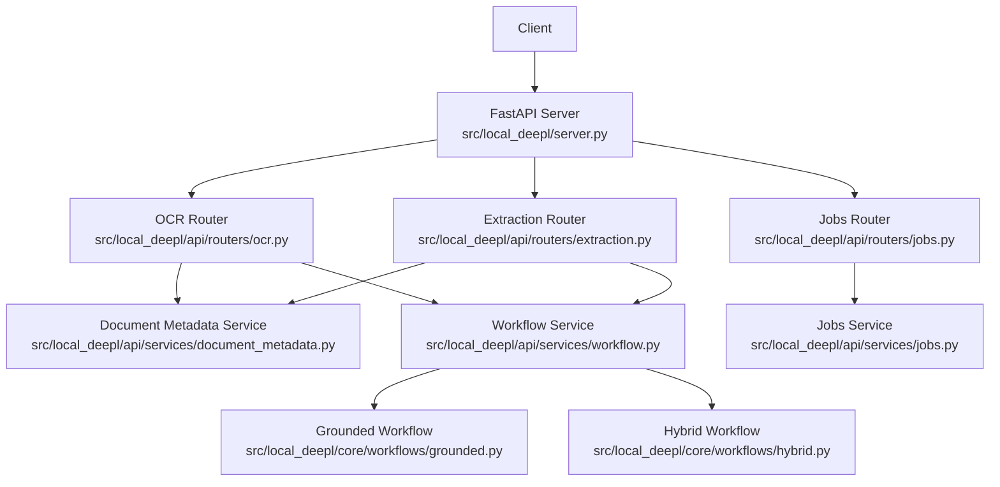
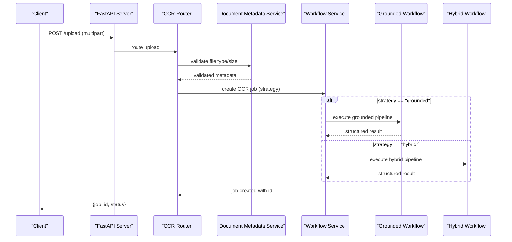
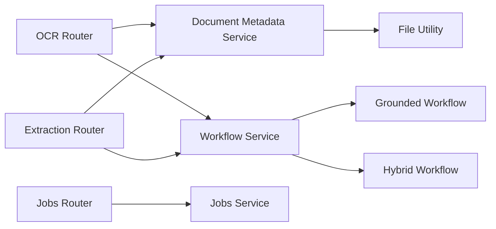

# Document Processing Endpoints

<cite>
**Referenced Files in This Document**
- [server.py](file://src/local_deepl/server.py)
- [routers/ocr.py](file://src/local_deepl/api/routers/ocr.py)
- [routers/extraction.py](file://src/local_deepl/api/routers/extraction.py)
- [routers/jobs.py](file://src/local_deepl/api/routers/jobs.py)
- [schemas/requests.py](file://src/local_deepl/api/schemas/requests.py)
- [services/document_metadata.py](file://src/local_deepl/api/services/document_metadata.py)
- [services/jobs.py](file://src/local_deepl/api/services/jobs.py)
- [services/workflow.py](file://src/local_deepl/api/services/workflow.py)
- [core/workflows/grounded.py](file://src/local_deepl/core/workflows/grounded.py)
- [core/workflows/hybrid.py](file://src/local_deepl/core/workflows/hybrid.py)
- [utils/file.py](file://src/local_deepl/utils/file.py)
</cite>

## Table of Contents
1. [Introduction](#introduction)
2. [Project Structure](#project-structure)
3. [Core Components](#core-components)
4. [Architecture Overview](#architecture-overview)
5. [Detailed Component Analysis](#detailed-component-analysis)
6. [Dependency Analysis](#dependency-analysis)
7. [Performance Considerations](#performance-considerations)
8. [Troubleshooting Guide](#troubleshooting-guide)
9. [Conclusion](#conclusion)

## Introduction
This document provides detailed API documentation for LocalDeepL’s document processing endpoints. It covers uploading documents (PDFs and images), initiating OCR processing with different strategies (grounded and hybrid), extracting text content, and retrieving results. It includes request/response schemas, example payloads, error handling guidance, authentication requirements, rate limiting policies, and performance considerations for large documents.

## Project Structure
LocalDeepL exposes its APIs via FastAPI routers under src/local_deepl/api/routers. The primary endpoints for document processing are implemented in the OCR, extraction, and jobs routers. Schemas for requests are defined in src/local_deepl/api/schemas/requests.py. Supporting services handle metadata, job lifecycle, and workflow orchestration.

**Diagram sources**
- [server.py](file://src/local_deepl/server.py)
- [routers/ocr.py](file://src/local_deepl/api/routers/ocr.py)
- [routers/extraction.py](file://src/local_deepl/api/routers/extraction.py)
- [routers/jobs.py](file://src/local_deepl/api/routers/jobs.py)
- [services/document_metadata.py](file://src/local_deepl/api/services/document_metadata.py)
- [services/workflow.py](file://src/local_deepl/api/services/workflow.py)
- [services/jobs.py](file://src/local_deepl/api/services/jobs.py)
- [core/workflows/grounded.py](file://src/local_deepl/core/workflows/grounded.py)
- [core/workflows/hybrid.py](file://src/local_deepl/core/workflows/hybrid.py)

**Section sources**
- [server.py](file://src/local_deepl/server.py)
- [routers/ocr.py](file://src/local_deepl/api/routers/ocr.py)
- [routers/extraction.py](file://src/local_deepl/api/routers/extraction.py)
- [routers/jobs.py](file://src/local_deepl/api/routers/jobs.py)
- [schemas/requests.py](file://src/local_deepl/api/schemas/requests.py)

## Core Components
- Upload endpoints accept multipart form data for PDFs and images.
- OCR job creation supports strategy selection: grounded or hybrid.
- Extraction endpoints return structured text content based on the processed document.
- Jobs endpoints provide status and result retrieval for asynchronous processing.

Key responsibilities:
- Request validation and schema enforcement via Pydantic models.
- File type and size validation before ingestion.
- Asynchronous job management and progress tracking.
- Workflow orchestration for OCR strategies.

**Section sources**
- [routers/ocr.py](file://src/local_deepl/api/routers/ocr.py)
- [routers/extraction.py](file://src/local_deepl/api/routers/extraction.py)
- [routers/jobs.py](file://src/local_deepl/api/routers/jobs.py)
- [schemas/requests.py](file://src/local_deepl/api/schemas/requests.py)
- [services/document_metadata.py](file://src/local_deepl/api/services/document_metadata.py)
- [services/jobs.py](file://src/local_deepl/api/services/jobs.py)
- [services/workflow.py](file://src/local_deepl/api/services/workflow.py)

## Architecture Overview
The API follows a layered architecture:
- HTTP layer: FastAPI routers define endpoints and validate requests.
- Service layer: Services encapsulate business logic for metadata, jobs, and workflows.
- Core layer: Workflows implement OCR strategies (grounded, hybrid).

**Diagram sources**
- [routers/ocr.py](file://src/local_deepl/api/routers/ocr.py)
- [services/document_metadata.py](file://src/local_deepl/api/services/document_metadata.py)
- [services/workflow.py](file://src/local_deepl/api/services/workflow.py)
- [core/workflows/grounded.py](file://src/local_deepl/core/workflows/grounded.py)
- [core/workflows/hybrid.py](file://src/local_deepl/core/workflows/hybrid.py)

## Detailed Component Analysis

### Upload Documents Endpoint
- Method: POST
- Path: /upload
- Content-Type: multipart/form-data
- Fields:
  - file: binary (PDF or image formats supported by the system)
- Behavior:
  - Validates file type and size limits.
  - Generates document metadata and persists it.
  - Returns an identifier for subsequent OCR job creation.

Request example (multipart):
- Use curl or any HTTP client to send a file field named "file" with the binary content.

Response schema:
- {
    "document_id": "string",
    "filename": "string",
    "mime_type": "string",
    "size_bytes": "integer",
    "status": "uploaded"
  }

Error cases:
- Invalid file type: returns error indicating unsupported format.
- Exceeds size limit: returns error indicating maximum allowed size.
- Corrupted file: returns error indicating unreadable content.

**Section sources**
- [routers/ocr.py](file://src/local_deepl/api/routers/ocr.py)
- [services/document_metadata.py](file://src/local_deepl/api/services/document_metadata.py)
- [utils/file.py](file://src/local_deepl/utils/file.py)

### Create OCR Job Endpoint
- Method: POST
- Path: /ocr/job
- Content-Type: application/json
- Body fields:
  - document_id: string (from upload response)
  - strategy: "grounded" | "hybrid"
  - options: object (optional; may include parameters like language, confidence thresholds, layout preservation)
- Behavior:
  - Validates document existence and strategy.
  - Initiates asynchronous OCR processing using the selected workflow.
  - Returns job identifier and initial status.

Request example (JSON):
- {
    "document_id": "string",
    "strategy": "grounded",
    "options": {}
  }

Response schema:
- {
    "job_id": "string",
    "document_id": "string",
    "strategy": "grounded|hybrid",
    "status": "queued|processing|completed|failed",
    "created_at": "timestamp"
  }

Error cases:
- Missing or invalid document_id: returns error.
- Unsupported strategy: returns error.
- Internal processing failure: returns error with details.

**Section sources**
- [routers/ocr.py](file://src/local_deepl/api/routers/ocr.py)
- [services/workflow.py](file://src/local_deepl/api/services/workflow.py)
- [core/workflows/grounded.py](file://src/local_deepl/core/workflows/grounded.py)
- [core/workflows/hybrid.py](file://src/local_deepl/core/workflows/hybrid.py)

### Extract Text Endpoint
- Method: GET or POST (depending on implementation)
- Path: /extract
- Query or body parameters:
  - document_id: string
  - strategy: optional override
  - output_format: "text" | "structured" | "json"
- Behavior:
  - Retrieves processed content for the given document.
  - Applies formatting based on output_format.
  - Returns extracted text or structured representation.

Request example (query):
- /extract?document_id=string&output_format=text

Response schema:
- For text:
  - { "content": "string" }
- For structured:
  - { "blocks": [...], "metadata": {...} }

Error cases:
- Document not found: returns error.
- No processed content available: returns error.
- Invalid output_format: returns error.

**Section sources**
- [routers/extraction.py](file://src/local_deepl/api/routers/extraction.py)
- [services/document_metadata.py](file://src/local_deepl/api/services/document_metadata.py)

### Retrieve Job Status and Results
- Method: GET
- Path: /jobs/{job_id}
- Behavior:
  - Returns current job status and any available results.
  - Supports polling until completion.

Response schema:
- {
    "job_id": "string",
    "document_id": "string",
    "strategy": "grounded|hybrid",
    "status": "queued|processing|completed|failed",
    "result": "object|null",
    "error": "string|null",
    "updated_at": "timestamp"
  }

Error cases:
- Job not found: returns error.
- Access denied: returns error if authentication is required.

**Section sources**
- [routers/jobs.py](file://src/local_deepl/api/routers/jobs.py)
- [services/jobs.py](file://src/local_deepl/api/services/jobs.py)

### Authentication and Security
- Authentication:
  - If enabled, require API key or token in headers.
  - Validate credentials before processing requests.
- Rate Limiting:
  - Enforce per-client request limits.
  - Return appropriate errors when limits are exceeded.

Example headers:
- Authorization: Bearer <token>
- X-API-Key: <key>

Rate limit responses:
- 429 Too Many Requests with retry-after header.

**Section sources**
- [routers/ocr.py](file://src/local_deepl/api/routers/ocr.py)
- [routers/extraction.py](file://src/local_deepl/api/routers/extraction.py)
- [routers/jobs.py](file://src/local_deepl/api/routers/jobs.py)

### Error Handling Summary
Common error responses:
- 400 Bad Request: invalid input, missing fields, unsupported strategy.
- 401 Unauthorized: missing or invalid credentials.
- 403 Forbidden: insufficient permissions.
- 404 Not Found: document or job not found.
- 413 Payload Too Large: file exceeds size limit.
- 415 Unsupported Media Type: invalid file type.
- 429 Too Many Requests: rate limit exceeded.
- 500 Internal Server Error: unexpected failures.

Error response schema:
- {
    "error": "string",
    "code": "string",
    "details": "object|null"
  }

**Section sources**
- [routers/ocr.py](file://src/local_deepl/api/routers/ocr.py)
- [routers/extraction.py](file://src/local_deepl/api/routers/extraction.py)
- [routers/jobs.py](file://src/local_deepl/api/routers/jobs.py)

## Dependency Analysis
The document processing flow depends on several modules:
- Routers depend on services for validation and orchestration.
- Services depend on core workflows for OCR execution.
- Utilities handle file operations and validation.

**Diagram sources**
- [routers/ocr.py](file://src/local_deepl/api/routers/ocr.py)
- [routers/extraction.py](file://src/local_deepl/api/routers/extraction.py)
- [routers/jobs.py](file://src/local_deepl/api/routers/jobs.py)
- [services/document_metadata.py](file://src/local_deepl/api/services/document_metadata.py)
- [services/workflow.py](file://src/local_deepl/api/services/workflow.py)
- [services/jobs.py](file://src/local_deepl/api/services/jobs.py)
- [core/workflows/grounded.py](file://src/local_deepl/core/workflows/grounded.py)
- [core/workflows/hybrid.py](file://src/local_deepl/core/workflows/hybrid.py)
- [utils/file.py](file://src/local_deepl/utils/file.py)

**Section sources**
- [routers/ocr.py](file://src/local_deepl/api/routers/ocr.py)
- [routers/extraction.py](file://src/local_deepl/api/routers/extraction.py)
- [routers/jobs.py](file://src/local_deepl/api/routers/jobs.py)
- [services/document_metadata.py](file://src/local_deepl/api/services/document_metadata.py)
- [services/workflow.py](file://src/local_deepl/api/services/workflow.py)
- [services/jobs.py](file://src/local_deepl/api/services/jobs.py)
- [core/workflows/grounded.py](file://src/local_deepl/core/workflows/grounded.py)
- [core/workflows/hybrid.py](file://src/local_deepl/core/workflows/hybrid.py)
- [utils/file.py](file://src/local_deepl/utils/file.py)

## Performance Considerations
- Large documents:
  - Stream uploads to avoid memory spikes.
  - Use chunked processing where possible.
- OCR strategies:
  - Grounded workflow may be more accurate but slower.
  - Hybrid workflow balances speed and accuracy.
- Concurrency:
  - Queue jobs to prevent overload.
  - Monitor worker capacity and scale horizontally.
- Caching:
  - Cache intermediate results for repeated extractions.
- Monitoring:
  - Track processing times and error rates.
  - Alert on resource exhaustion.

[No sources needed since this section provides general guidance]

## Troubleshooting Guide
Common issues and resolutions:
- Upload fails due to unsupported file type:
  - Verify MIME type and extension.
  - Ensure file is not corrupted.
- OCR job remains queued:
  - Check worker availability and queue depth.
  - Review logs for blocked tasks.
- Extraction returns empty content:
  - Confirm OCR job completed successfully.
  - Validate document structure and readability.
- Authentication errors:
  - Verify token/key validity and expiration.
  - Check permission scopes.
- Rate limiting triggered:
  - Implement exponential backoff.
  - Adjust client-side request pacing.

**Section sources**
- [routers/ocr.py](file://src/local_deepl/api/routers/ocr.py)
- [routers/extraction.py](file://src/local_deepl/api/routers/extraction.py)
- [routers/jobs.py](file://src/local_deepl/api/routers/jobs.py)

## Conclusion
LocalDeepL’s document processing API provides robust endpoints for uploading files, initiating OCR jobs with flexible strategies, and extracting text content. Proper error handling, authentication, and rate limiting ensure reliable operation. For large documents, consider streaming, caching, and scaling strategies to maintain performance.