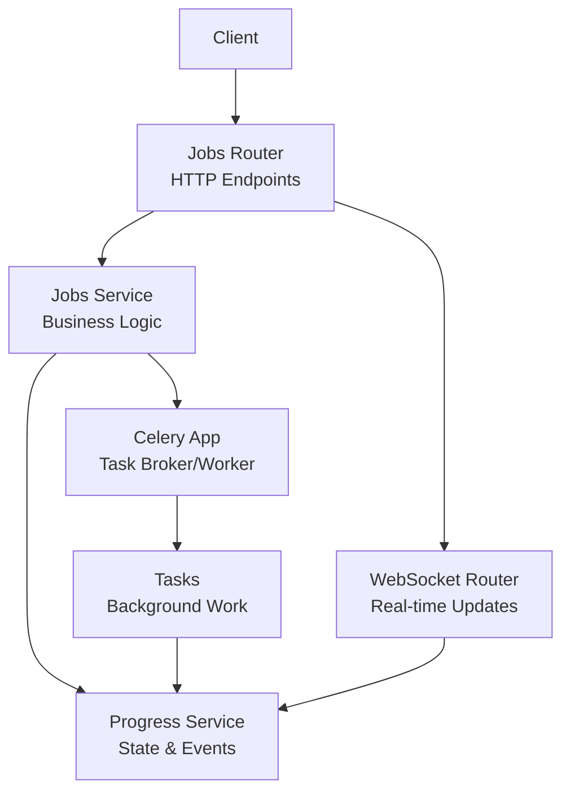
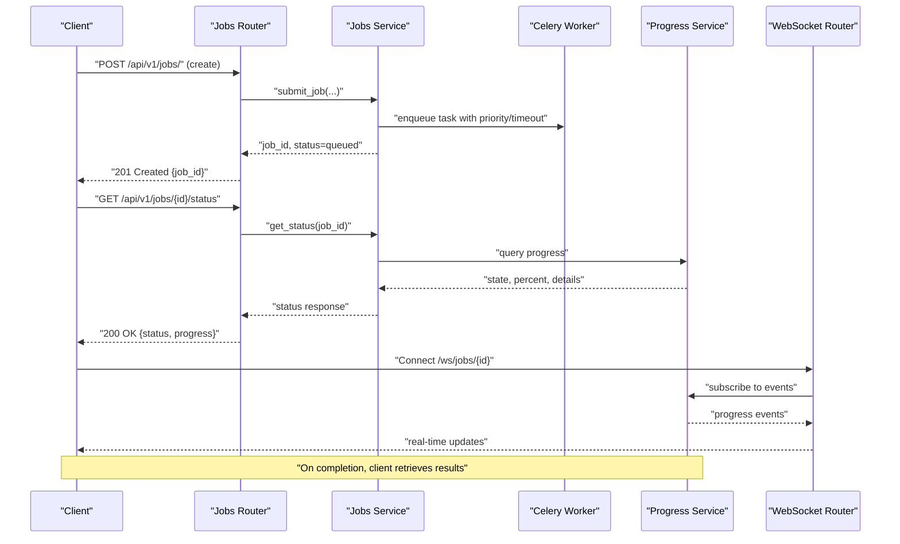
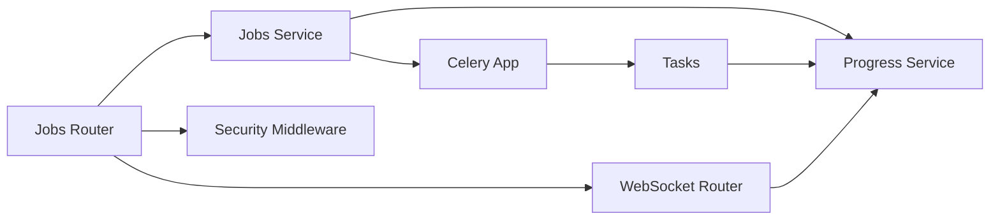

# Job Management API

<cite>
**Referenced Files in This Document**
- [jobs.py](file://src/local_deepl/api/routers/jobs.py)
- [services_jobs.py](file://src/local_deepl/api/services/jobs.py)
- [progress.py](file://src/local_deepl/api/services/progress.py)
- [websocket.py](file://src/local_deepl/api/routers/websocket.py)
- [celery_app.py](file://src/local_deepl/api/celery_app.py)
- [tasks.py](file://src/local_deepl/api/tasks.py)
- [security_middleware.py](file://src/local_deepl/api/services/security_middleware.py)
- [security_config.py](file://src/local_deepl/api/services/security_config.py)
</cite>

## Table of Contents
1. [Introduction](#introduction)
2. [Project Structure](#project-structure)
3. [Core Components](#core-components)
4. [Architecture Overview](#architecture-overview)
5. [Detailed Component Analysis](#detailed-component-analysis)
6. [Dependency Analysis](#dependency-analysis)
7. [Performance Considerations](#performance-considerations)
8. [Troubleshooting Guide](#troubleshooting-guide)
9. [Conclusion](#conclusion)

## Introduction
This document provides detailed API documentation for LocalDeepL’s job management endpoints. It covers creating, monitoring, and managing background processing jobs, including queue operations, progress tracking, result retrieval, authentication requirements, status codes, and error handling. It also explains job lifecycle states, priority queuing, timeout configurations, and recovery mechanisms.

## Project Structure
The job management system is implemented across the API router layer, services, Celery integration, and WebSocket support:
- HTTP endpoints are defined in the jobs router.
- Business logic and persistence are handled by the jobs service.
- Progress updates are managed via a dedicated progress service.
- Background execution uses Celery tasks.
- Real-time updates are provided through a WebSocket endpoint.
- Security middleware enforces authentication and authorization.

**Diagram sources**
- [jobs.py](file://src/local_deepl/api/routers/jobs.py)
- [services_jobs.py](file://src/local_deepl/api/services/jobs.py)
- [progress.py](file://src/local_deepl/api/services/progress.py)
- [websocket.py](file://src/local_deepl/api/routers/websocket.py)
- [celery_app.py](file://src/local_deepl/api/celery_app.py)
- [tasks.py](file://src/local_deepl/api/tasks.py)

**Section sources**
- [jobs.py](file://src/local_deepl/api/routers/jobs.py)
- [services_jobs.py](file://src/local_deepl/api/services/jobs.py)
- [progress.py](file://src/local_deepl/api/services/progress.py)
- [websocket.py](file://src/local_deepl/api/routers/websocket.py)
- [celery_app.py](file://src/local_deepl/api/celery_app.py)
- [tasks.py](file://src/local_deepl/api/tasks.py)

## Core Components
- Jobs Router: Exposes REST endpoints for job creation, listing, status checks, cancellation, and result retrieval.
- Jobs Service: Encapsulates job lifecycle, queueing, persistence, and orchestration with Celery.
- Progress Service: Manages per-job progress events and state transitions; exposes queries and emits real-time updates.
- Celery Integration: Configures workers, queues, retries, and timeouts.
- Tasks: Implements background work units invoked by Celery.
- WebSocket Router: Streams progress events to clients.
- Security Middleware: Enforces authentication and access control on all endpoints.

Key responsibilities:
- Create jobs with optional priority and timeout parameters.
- Poll or subscribe to progress updates.
- Retrieve results when jobs complete.
- Cancel or delete jobs as supported.
- Handle failures with retry policies and error reporting.

**Section sources**
- [jobs.py](file://src/local_deepl/api/routers/jobs.py)
- [services_jobs.py](file://src/local_deepl/api/services/jobs.py)
- [progress.py](file://src/local_deepl/api/services/progress.py)
- [celery_app.py](file://src/local_deepl/api/celery_app.py)
- [tasks.py](file://src/local_deepl/api/tasks.py)
- [websocket.py](file://src/local_deepl/api/routers/websocket.py)
- [security_middleware.py](file://src/local_deepl/api/services/security_middleware.py)
- [security_config.py](file://src/local_deepl/api/services/security_config.py)

## Architecture Overview
The job management architecture follows a decoupled pattern:
- Clients interact with HTTP endpoints to submit and manage jobs.
- The jobs service persists job metadata and enqueues tasks into Celery.
- Celery workers execute tasks and update progress via the progress service.
- Clients can poll for status or connect via WebSocket for live updates.
- Results are stored and retrieved through the same API surface.

**Diagram sources**
- [jobs.py](file://src/local_deepl/api/routers/jobs.py)
- [services_jobs.py](file://src/local_deepl/api/services/jobs.py)
- [progress.py](file://src/local_deepl/api/services/progress.py)
- [websocket.py](file://src/local_deepl/api/routers/websocket.py)
- [celery_app.py](file://src/local_deepl/api/celery_app.py)
- [tasks.py](file://src/local_deepl/api/tasks.py)

## Detailed Component Analysis

### HTTP Endpoints: Jobs
Base path: /api/v1/jobs/

- Create Job
  - Method: POST
  - Path: /api/v1/jobs/
  - Authentication: Required (see Security section)
  - Request body: JSON object containing job definition and options such as priority and timeout.
  - Response: 201 Created with job identifier and initial status.
  - Status Codes: 201, 400 (validation), 401/403 (auth), 429 (rate limit if applicable).

- List Jobs
  - Method: GET
  - Path: /api/v1/jobs/
  - Query Parameters: filters (e.g., status, created_after, limit).
  - Authentication: Required
  - Response: 200 OK with array of job summaries.
  - Status Codes: 200, 401/403, 429.

- Get Job Status
  - Method: GET
  - Path: /api/v1/jobs/{job_id}/status
  - Authentication: Required
  - Response: 200 OK with current status, progress percentage, and details.
  - Status Codes: 200, 404 (not found), 401/403.

- Get Job Result
  - Method: GET
  - Path: /api/v1/jobs/{job_id}/result
  - Authentication: Required
  - Response: 200 OK with processed result payload.
  - Status Codes: 200, 404, 401/403, 412 (precondition failed if not completed).

- Cancel Job
  - Method: DELETE or PATCH (depending on implementation)
  - Path: /api/v1/jobs/{job_id}
  - Authentication: Required
  - Response: 200 OK or 204 No Content upon successful cancellation request.
  - Status Codes: 200/204, 404, 401/403, 409 (conflict if already terminal).

Notes:
- Priority queuing: Higher-priority jobs may be dequeued earlier depending on worker configuration.
- Timeout configuration: Per-job timeout can be specified at submission; tasks exceeding this will be marked failed and retried according to policy.

**Section sources**
- [jobs.py](file://src/local_deepl/api/routers/jobs.py)
- [services_jobs.py](file://src/local_deepl/api/services/jobs.py)

### Jobs Service
Responsibilities:
- Validate requests and construct job payloads.
- Persist job metadata and initial state.
- Enqueue tasks with priority and timeout settings.
- Coordinate progress updates and finalization.
- Provide query methods for status and results.

Key behaviors:
- On create: returns queued status immediately.
- On cancel: attempts graceful termination; marks job as cancelled if possible.
- On failure: records error details and triggers retry policy.

**Section sources**
- [services_jobs.py](file://src/local_deepl/api/services/jobs.py)

### Progress Service
Responsibilities:
- Maintain per-job progress state and events.
- Support polling queries for status and percentage.
- Emit real-time events for WebSocket subscribers.

Lifecycle integration:
- Transitions: queued -> running -> completed | failed | cancelled.
- Percentages and step-level details are updated during processing.

**Section sources**
- [progress.py](file://src/local_deepl/api/services/progress.py)

### Celery Integration and Tasks
- Celery app configuration defines broker, concurrency, and queue routing.
- Tasks implement the actual processing steps and report progress back to the progress service.
- Retry policies and time limits are applied at the task level.

Best practices:
- Use exponential backoff for transient errors.
- Record structured error messages for diagnostics.
- Ensure idempotency where possible.

**Section sources**
- [celery_app.py](file://src/local_deepl/api/celery_app.py)
- [tasks.py](file://src/local_deepl/api/tasks.py)

### WebSocket Endpoint
- Path: /ws/jobs/{job_id}
- Purpose: Stream real-time progress events for a specific job.
- Usage: Connect from client; receive incremental updates until job reaches a terminal state.
- Authentication: Handshake validated via security middleware.

**Section sources**
- [websocket.py](file://src/local_deepl/api/routers/websocket.py)
- [security_middleware.py](file://src/local_deepl/api/services/security_middleware.py)

### Security and Authentication
- All endpoints require authentication unless explicitly exempted.
- Authorization checks ensure users can only access their own jobs.
- Configuration is centralized for token validation and scopes.

Recommendations:
- Use short-lived tokens with refresh flows.
- Implement rate limiting to protect endpoints.

**Section sources**
- [security_middleware.py](file://src/local_deepl/api/services/security_middleware.py)
- [security_config.py](file://src/local_deepl/api/services/security_config.py)

## Dependency Analysis
The following diagram shows how components depend on each other:

**Diagram sources**
- [jobs.py](file://src/local_deepl/api/routers/jobs.py)
- [services_jobs.py](file://src/local_deepl/api/services/jobs.py)
- [progress.py](file://src/local_deepl/api/services/progress.py)
- [websocket.py](file://src/local_deepl/api/routers/websocket.py)
- [celery_app.py](file://src/local_deepl/api/celery_app.py)
- [tasks.py](file://src/local_deepl/api/tasks.py)
- [security_middleware.py](file://src/local_deepl/api/services/security_middleware.py)

**Section sources**
- [jobs.py](file://src/local_deepl/api/routers/jobs.py)
- [services_jobs.py](file://src/local_deepl/api/services/jobs.py)
- [progress.py](file://src/local_deepl/api/services/progress.py)
- [websocket.py](file://src/local_deepl/api/routers/websocket.py)
- [celery_app.py](file://src/local_deepl/api/celery_app.py)
- [tasks.py](file://src/local_deepl/api/tasks.py)
- [security_middleware.py](file://src/local_deepl/api/services/security_middleware.py)

## Performance Considerations
- Batch submissions: Prefer batching multiple jobs in a single request when supported to reduce overhead.
- Polling intervals: Use adaptive polling based on job state; increase interval for long-running jobs.
- WebSocket usage: Prefer WebSocket for high-frequency updates to minimize server load.
- Concurrency: Tune Celery worker concurrency and queue sizes to match workload characteristics.
- Timeouts: Set appropriate per-job timeouts to avoid resource exhaustion.

[No sources needed since this section provides general guidance]

## Troubleshooting Guide
Common issues and resolutions:
- Authentication failures: Verify token validity and permissions; check security configuration.
- Job stuck in queued: Inspect worker availability and queue depth; adjust concurrency.
- Frequent retries: Review error logs; identify transient vs. permanent failures; tune retry policy.
- Missing progress updates: Confirm WebSocket connectivity and subscription; validate progress service health.
- Result not available: Ensure job reached completed state; check storage backend for artifacts.

Operational tips:
- Log structured events with correlation IDs.
- Monitor Celery metrics and queue lengths.
- Implement health checks for progress and storage backends.

**Section sources**
- [security_middleware.py](file://src/local_deepl/api/services/security_middleware.py)
- [security_config.py](file://src/local_deepl/api/services/security_config.py)
- [progress.py](file://src/local_deepl/api/services/progress.py)
- [celery_app.py](file://src/local_deepl/api/celery_app.py)
- [tasks.py](file://src/local_deepl/api/tasks.py)

## Conclusion
LocalDeepL’s job management API provides a robust foundation for asynchronous processing with clear HTTP endpoints, real-time progress streaming, and resilient background execution. By leveraging priority queuing, configurable timeouts, and comprehensive error handling, it supports scalable batch workflows while offering developers straightforward tools for monitoring and result retrieval.

[No sources needed since this section summarizes without analyzing specific files]