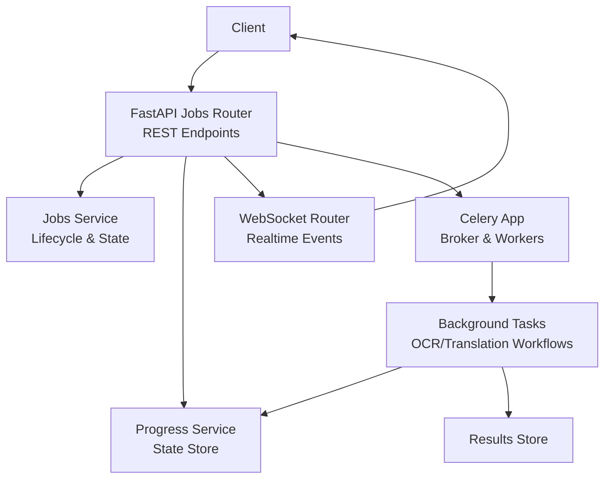
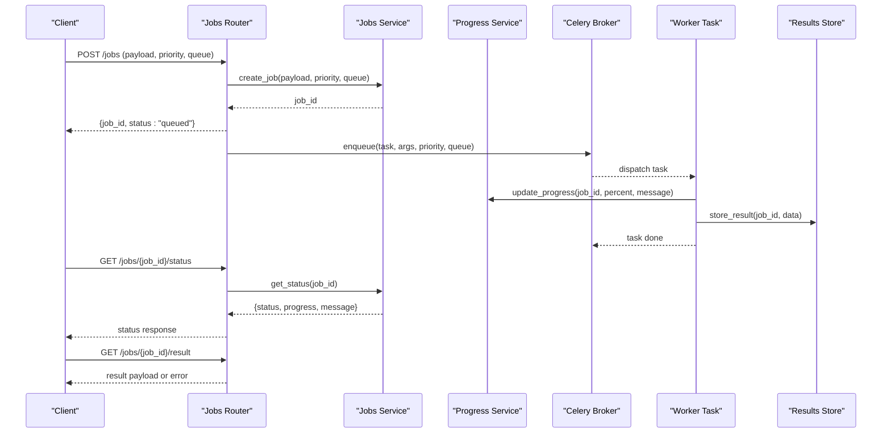
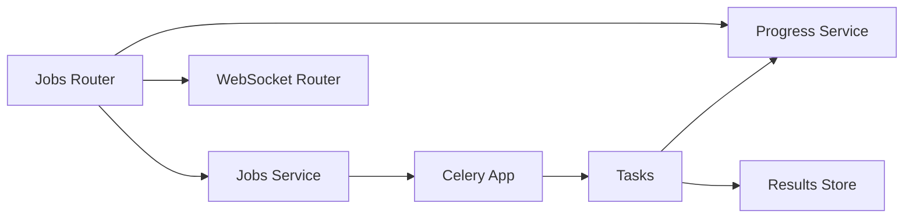

# Job Management Endpoints

<cite>
**Referenced Files in This Document**
- [jobs.py](file://src/local_deepl/api/routers/jobs.py)
- [tasks.py](file://src/local_deepl/api/tasks.py)
- [celery_app.py](file://src/local_deepl/api/celery_app.py)
- [progress.py](file://src/local_deepl/api/services/progress.py)
- [jobs_service.py](file://src/local_deepl/api/services/jobs.py)
- [websocket.py](file://src/local_deepl/api/routers/websocket.py)
- [server.py](file://src/local_deepl/server.py)
</cite>

## Table of Contents
1. [Introduction](#introduction)
2. [Project Structure](#project-structure)
3. [Core Components](#core-components)
4. [Architecture Overview](#architecture-overview)
5. [Detailed Component Analysis](#detailed-component-analysis)
6. [Dependency Analysis](#dependency-analysis)
7. [Performance Considerations](#performance-considerations)
8. [Troubleshooting Guide](#troubleshooting-guide)
9. [Conclusion](#conclusion)
10. [Appendices](#appendices)

## Introduction
This document provides detailed API documentation for LocalDeepL’s job management endpoints that enable asynchronous, background processing of long-running tasks such as OCR and translation workflows. It covers HTTP methods for creating jobs with priority settings, monitoring progress via polling or WebSockets, canceling jobs, and retrieving results. It also documents Celery integration details, queue configuration, job lifecycle states, and monitoring capabilities.

## Project Structure
The job management feature spans the FastAPI router layer, Celery task definitions, a job service abstraction, and WebSocket-based real-time updates:
- Router layer exposes REST endpoints for job submission, status checks, cancellation, and result retrieval.
- Celery app and tasks define background workers and queues.
- Services encapsulate job lifecycle logic and progress tracking.
- WebSocket router streams progress events to clients.

**Diagram sources**
- [jobs.py](file://src/local_deepl/api/routers/jobs.py)
- [jobs_service.py](file://src/local_deepl/api/services/jobs.py)
- [progress.py](file://src/local_deepl/api/services/progress.py)
- [websocket.py](file://src/local_deepl/api/routers/websocket.py)
- [celery_app.py](file://src/local_deepl/api/celery_app.py)
- [tasks.py](file://src/local_deepl/api/tasks.py)

**Section sources**
- [jobs.py](file://src/local_deepl/api/routers/jobs.py)
- [tasks.py](file://src/local_deepl/api/tasks.py)
- [celery_app.py](file://src/local_deepl/api/celery_app.py)
- [progress.py](file://src/local_deepl/api/services/progress.py)
- [jobs_service.py](file://src/local_deepl/api/services/jobs.py)
- [websocket.py](file://src/local_deepl/api/routers/websocket.py)
- [server.py](file://src/local_deepl/server.py)

## Core Components
- Jobs Router: Defines REST endpoints for job creation, status polling, cancellation, and result retrieval.
- Jobs Service: Encapsulates job lifecycle operations (create, query, cancel), state transitions, and persistence.
- Progress Service: Manages per-job progress snapshots and event emission.
- Celery App and Tasks: Configure broker/queues and implement background processing tasks.
- WebSocket Router: Streams progress and completion events to connected clients.

Key responsibilities:
- Accept job submissions with optional priority and queue selection.
- Enqueue tasks via Celery and return a job identifier immediately.
- Provide polling endpoints to check job status and progress.
- Support cancellation requests and propagate to running tasks.
- Stream real-time progress via WebSockets.
- Retrieve final results when jobs complete successfully.

**Section sources**
- [jobs.py](file://src/local_deepl/api/routers/jobs.py)
- [jobs_service.py](file://src/local_deepl/api/services/jobs.py)
- [progress.py](file://src/local_deepl/api/services/progress.py)
- [celery_app.py](file://src/local_deepl/api/celery_app.py)
- [tasks.py](file://src/local_deepl/api/tasks.py)
- [websocket.py](file://src/local_deepl/api/routers/websocket.py)

## Architecture Overview
The system follows an async-first architecture using FastAPI for HTTP/WebSocket endpoints and Celery for background job execution. Clients submit jobs, receive immediate job IDs, and poll or subscribe for updates until completion.

**Diagram sources**
- [jobs.py](file://src/local_deepl/api/routers/jobs.py)
- [jobs_service.py](file://src/local_deepl/api/services/jobs.py)
- [progress.py](file://src/local_deepl/api/services/progress.py)
- [celery_app.py](file://src/local_deepl/api/celery_app.py)
- [tasks.py](file://src/local_deepl/api/tasks.py)

## Detailed Component Analysis

### Jobs Router (REST Endpoints)
Responsibilities:
- Expose endpoints for job submission, status polling, cancellation, and result retrieval.
- Validate request payloads and map them to service calls.
- Return standardized responses including job identifiers and status information.

Typical endpoints:
- Create job: POST /jobs
- Get status: GET /jobs/{job_id}/status
- Cancel job: POST /jobs/{job_id}/cancel
- Get result: GET /jobs/{job_id}/result

Request/response patterns:
- Submission includes payload fields required by the underlying workflow, optional priority, and target queue.
- Status responses include job state, progress percentage, and human-readable messages.
- Result responses contain processed output or error details.

**Section sources**
- [jobs.py](file://src/local_deepl/api/routers/jobs.py)

### Jobs Service (Lifecycle & State)
Responsibilities:
- Manage job creation, querying, and cancellation.
- Maintain job state transitions and persist state changes.
- Coordinate with progress and result stores.

Key behaviors:
- Create job: assign unique ID, initialize state to queued, and enqueue task.
- Query status: return current state, progress, and last message.
- Cancel job: mark job as canceled and signal worker if applicable.

**Section sources**
- [jobs_service.py](file://src/local_deepl/api/services/jobs.py)

### Progress Service (Updates & Events)
Responsibilities:
- Track per-job progress snapshots.
- Emit events for real-time updates.
- Persist latest progress for polling clients.

Key behaviors:
- Update progress: increment percentage, append messages, and broadcast events.
- Read progress: return latest snapshot for a given job.

**Section sources**
- [progress.py](file://src/local_deepl/api/services/progress.py)

### Celery Integration (App & Tasks)
Responsibilities:
- Configure Celery app, broker, and worker queues.
- Define background tasks for OCR/translation workflows.
- Handle retries, timeouts, and error propagation.

Configuration highlights:
- Broker URL and worker concurrency settings.
- Queue routing based on priority or workload type.
- Task decorators specifying retry policies and time limits.

Task lifecycle:
- Enqueue task with job-specific arguments.
- Worker executes task, updates progress, and stores results.
- On failure, raise exceptions captured by the router/service layer.

**Section sources**
- [celery_app.py](file://src/local_deepl/api/celery_app.py)
- [tasks.py](file://src/local_deepl/api/tasks.py)

### WebSocket Router (Real-Time Updates)
Responsibilities:
- Establish WebSocket connections for live progress streaming.
- Broadcast progress updates and completion events to subscribers.
- Manage connection lifecycle and client subscriptions.

Key behaviors:
- Connect endpoint returns a session identifier.
- Progress events include job ID, percentage, and messages.
- Completion events indicate success or failure with result references.

**Section sources**
- [websocket.py](file://src/local_deepl/api/routers/websocket.py)

### Server Initialization
Responsibilities:
- Initialize FastAPI application and mount routers.
- Configure middleware and security settings.
- Start Celery workers and WebSocket handlers.

Startup sequence:
- Load configuration and set up logging.
- Register routes for jobs and WebSocket.
- Launch Celery workers with configured queues.

**Section sources**
- [server.py](file://src/local_deepl/server.py)

## Dependency Analysis
The job management subsystem has clear separation between HTTP endpoints, business logic, background processing, and real-time communication:
- Router depends on services for job lifecycle and progress.
- Services depend on Celery for task enqueuing and on progress/result stores.
- WebSocket router depends on progress events emitted by tasks.

**Diagram sources**
- [jobs.py](file://src/local_deepl/api/routers/jobs.py)
- [jobs_service.py](file://src/local_deepl/api/services/jobs.py)
- [progress.py](file://src/local_deepl/api/services/progress.py)
- [celery_app.py](file://src/local_deepl/api/celery_app.py)
- [tasks.py](file://src/local_deepl/api/tasks.py)
- [websocket.py](file://src/local_deepl/api/routers/websocket.py)

**Section sources**
- [jobs.py](file://src/local_deepl/api/routers/jobs.py)
- [jobs_service.py](file://src/local_deepl/api/services/jobs.py)
- [progress.py](file://src/local_deepl/api/services/progress.py)
- [celery_app.py](file://src/local_deepl/api/celery_app.py)
- [tasks.py](file://src/local_deepl/api/tasks.py)
- [websocket.py](file://src/local_deepl/api/routers/websocket.py)

## Performance Considerations
- Use appropriate queue sizing and worker concurrency to match expected load.
- Implement backpressure by limiting concurrent jobs per queue.
- Optimize progress updates to avoid excessive I/O; batch updates where possible.
- Cache frequently accessed status responses at the service layer if needed.
- Tune Celery broker settings for throughput and reliability.

[No sources needed since this section provides general guidance]

## Troubleshooting Guide
Common issues and resolutions:
- Job stuck in queued state: verify Celery workers are running and consuming the correct queue.
- Progress not updating: ensure tasks emit progress events and the progress store is accessible.
- Cancellation not effective: confirm the task supports interruption and the service propagates cancellation signals.
- Result retrieval errors: check result storage availability and serialization formats.

Operational checks:
- Inspect Celery worker logs for task failures and retries.
- Monitor progress store for missing entries.
- Validate WebSocket connectivity and event delivery.

**Section sources**
- [celery_app.py](file://src/local_deepl/api/celery_app.py)
- [tasks.py](file://src/local_deepl/api/tasks.py)
- [progress.py](file://src/local_deepl/api/services/progress.py)
- [websocket.py](file://src/local_deepl/api/routers/websocket.py)

## Conclusion
LocalDeepL’s job management endpoints provide a robust foundation for asynchronous document processing. By combining FastAPI endpoints, Celery-backed workers, and WebSocket-driven progress streaming, the system supports scalable, observable, and resilient workflows. Proper configuration of queues, priorities, and monitoring ensures reliable operation under varying loads.

[No sources needed since this section summarizes without analyzing specific files]

## Appendices

### Job Lifecycle States
- Queued: Job accepted and enqueued.
- Running: Task executing in a worker.
- Completed: Task finished successfully; result available.
- Failed: Task failed; error details available.
- Canceled: Job canceled by client or system.

### Priority and Queue Configuration
- Priority levels influence task scheduling within a queue.
- Separate queues can be used for different workload types or SLAs.
- Broker settings determine durability and performance characteristics.

### Example Asynchronous Workflow
- Submit job with payload and priority.
- Poll status endpoint until completed or failed.
- Optionally connect via WebSocket for real-time updates.
- Retrieve result upon successful completion.

[No sources needed since this section provides conceptual guidance]