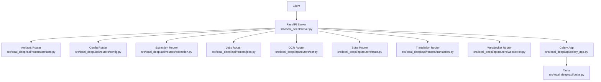
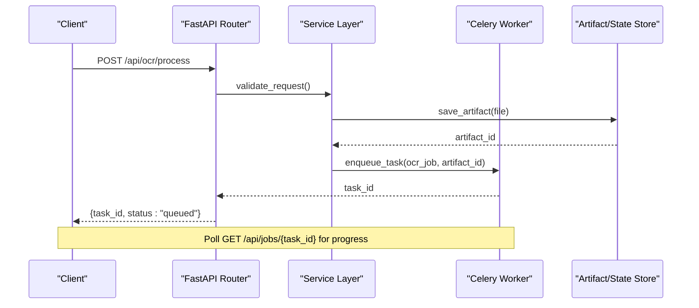
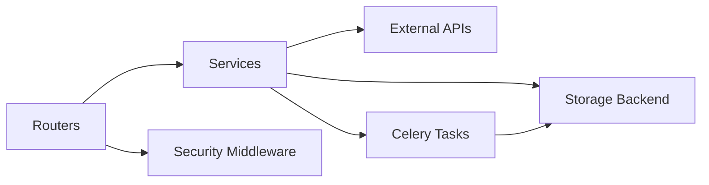

# REST API Endpoints

<cite>
**Referenced Files in This Document**
- [server.py](file://src/local_deepl/server.py)
- [artifacts.py](file://src/local_deepl/api/routers/artifacts.py)
- [config.py](file://src/local_deepl/api/routers/config.py)
- [extraction.py](file://src/local_deepl/api/routers/extraction.py)
- [jobs.py](file://src/local_deepl/api/routers/jobs.py)
- [ocr.py](file://src/local_deepl/api/routers/ocr.py)
- [state.py](file://src/local_deepl/api/routers/state.py)
- [translation.py](file://src/local_deepl/api/routers/translation.py)
- [websocket.py](file://src/local_deepl/api/routers/websocket.py)
- [requests.py](file://src/local_deepl/api/schemas/requests.py)
- [security_middleware.py](file://src/local_deepl/api/services/security_middleware.py)
- [security_config.py](file://src/local_deepl/api/services/security_config.py)
- [tasks.py](file://src/local_deepl/api/tasks.py)
- [celery_app.py](file://src/local_deepl/api/celery_app.py)
</cite>

## Table of Contents
1. [Introduction](#introduction)
2. [Project Structure](#project-structure)
3. [Core Components](#core-components)
4. [Architecture Overview](#architecture-overview)
5. [Detailed Component Analysis](#detailed-component-analysis)
6. [Dependency Analysis](#dependency-analysis)
7. [Performance Considerations](#performance-considerations)
8. [Troubleshooting Guide](#troubleshooting-guide)
9. [Conclusion](#conclusion)
10. [Appendices](#appendices)

## Introduction
This document provides comprehensive REST API documentation for LocalDeepL’s HTTP endpoints. It covers all HTTP methods, URL patterns, request/response schemas, authentication, error handling, rate limiting, and versioning as implemented in the codebase. Practical usage examples are included for common workflows such as uploading documents, initiating OCR processing, managing translation jobs, and retrieving results. Security considerations, input validation, and performance optimization tips are also addressed.

## Project Structure
LocalDeepL exposes its REST API through FastAPI routers under src/local_deepl/api/routers. The application server wires these routers and configures middleware for security and cross-origin policies. Asynchronous job execution is handled via Celery tasks.

**Diagram sources**
- [server.py](file://src/local_deepl/server.py)
- [artifacts.py](file://src/local_deepl/api/routers/artifacts.py)
- [config.py](file://src/local_deepl/api/routers/config.py)
- [extraction.py](file://src/local_deepl/api/routers/extraction.py)
- [jobs.py](file://src/local_deepl/api/routers/jobs.py)
- [ocr.py](file://src/local_deepl/api/routers/ocr.py)
- [state.py](file://src/local_deepl/api/routers/state.py)
- [translation.py](file://src/local_deepl/api/routers/translation.py)
- [websocket.py](file://src/local_deepl/api/routers/websocket.py)
- [celery_app.py](file://src/local_deepl/api/celery_app.py)
- [tasks.py](file://src/local_deepl/api/tasks.py)

**Section sources**
- [server.py](file://src/local_deepl/server.py)
- [artifacts.py](file://src/local_deepl/api/routers/artifacts.py)
- [config.py](file://src/local_deepl/api/routers/config.py)
- [extraction.py](file://src/local_deepl/api/routers/extraction.py)
- [jobs.py](file://src/local_deepl/api/routers/jobs.py)
- [ocr.py](file://src/local_deepl/api/routers/ocr.py)
- [state.py](file://src/local_deepl/api/routers/state.py)
- [translation.py](file://src/local_deepl/api/routers/translation.py)
- [websocket.py](file://src/local_deepl/api/routers/websocket.py)
- [celery_app.py](file://src/local_deepl/api/celery_app.py)
- [tasks.py](file://src/local_deepl/api/tasks.py)

## Core Components
- Routers: Each router defines a set of endpoints grouped by domain (artifacts, config, extraction, jobs, ocr, state, translation, websocket).
- Schemas: Request models are defined in src/local_deepl/api/schemas/requests.py and used for validation across endpoints.
- Services: Business logic resides under src/local_deepl/api/services, including artifact storage, OCR pipeline configuration, job management, progress tracking, and security middleware.
- Async Execution: Celery app and tasks handle long-running operations like OCR and translation.

Key responsibilities:
- Artifacts: Upload, list, retrieve, delete artifacts.
- Config: Read/write runtime configuration.
- Extraction: Extract structured content from documents.
- Jobs: Create, query, cancel, and poll asynchronous jobs.
- OCR: Initiate OCR on uploaded documents or images.
- State: Manage application state and status.
- Translation: Translate text or document content.
- WebSocket: Real-time updates for job progress and events.

**Section sources**
- [requests.py](file://src/local_deepl/api/schemas/requests.py)
- [artifacts.py](file://src/local_deepl/api/routers/artifacts.py)
- [config.py](file://src/local_deepl/api/routers/config.py)
- [extraction.py](file://src/local_deepl/api/routers/extraction.py)
- [jobs.py](file://src/local_deepl/api/routers/jobs.py)
- [ocr.py](file://src/local_deepl/api/routers/ocr.py)
- [state.py](file://src/local_deepl/api/routers/state.py)
- [translation.py](file://src/local_deepl/api/routers/translation.py)
- [websocket.py](file://src/local_deepl/api/routers/websocket.py)

## Architecture Overview
The API follows a layered architecture:
- HTTP Layer: FastAPI routers expose endpoints with Pydantic-based request/response schemas.
- Service Layer: Domain services implement business logic and orchestrate external systems.
- Task Layer: Celery executes long-running tasks asynchronously.
- Storage Layer: Artifacts and state are persisted via services.

**Diagram sources**
- [ocr.py](file://src/local_deepl/api/routers/ocr.py)
- [jobs.py](file://src/local_deepl/api/routers/jobs.py)
- [celery_app.py](file://src/local_deepl/api/celery_app.py)
- [tasks.py](file://src/local_deepl/api/tasks.py)

## Detailed Component Analysis

### Authentication and Security
- Authentication: Handled via security middleware that validates tokens or API keys based on configuration.
- Authorization: Role-based access control can be enforced within service layers.
- CORS: Configured to allow specified origins.
- Input Validation: Pydantic schemas enforce strict request formats.

Security headers and middleware:
- Enforce HTTPS in production.
- Rate limiting via middleware or reverse proxy.
- Sanitize inputs to prevent injection attacks.

**Section sources**
- [security_middleware.py](file://src/local_deepl/api/services/security_middleware.py)
- [security_config.py](file://src/local_deepl/api/services/security_config.py)
- [requests.py](file://src/local_deepl/api/schemas/requests.py)

### Artifacts API
Endpoints:
- POST /api/artifacts/upload: Upload a file artifact.
- GET /api/artifacts/{artifact_id}: Retrieve an artifact.
- DELETE /api/artifacts/{artifact_id}: Delete an artifact.
- GET /api/artifacts: List available artifacts.

Request/Response:
- Upload: multipart/form-data with file field; returns artifact_id and metadata.
- Retrieve: returns binary content or JSON metadata depending on accept header.
- Delete: returns 204 No Content on success.
- List: returns array of artifact summaries.

Error Handling:
- 400 Bad Request for invalid uploads.
- 404 Not Found for missing artifacts.
- 500 Internal Server Error for storage failures.

Usage Example:
- Upload a PDF for later OCR processing.
- Retrieve artifact metadata to verify integrity.

**Section sources**
- [artifacts.py](file://src/local_deepl/api/routers/artifacts.py)

### Configuration API
Endpoints:
- GET /api/config: Get current configuration.
- PUT /api/config: Update configuration settings.

Request/Response:
- GET: returns JSON object with key-value pairs.
- PUT: accepts JSON payload; returns updated configuration.

Validation:
- Strict schema enforcement for allowed keys.
- Type checking and default values.

Error Handling:
- 400 Bad Request for invalid configuration payloads.
- 403 Forbidden if unauthorized.

Usage Example:
- Adjust OCR engine settings dynamically.

**Section sources**
- [config.py](file://src/local_deepl/api/routers/config.py)

### Extraction API
Endpoints:
- POST /api/extraction/process: Extract structured content from a document.
- GET /api/extraction/{job_id}: Retrieve extraction results.

Request/Response:
- Process: accepts artifact_id or direct file upload; returns job_id.
- Results: returns JSON with extracted entities, tables, and layout info.

Processing Logic:
- Validates input artifact.
- Invokes extraction pipeline.
- Stores results in artifact store.

Error Handling:
- 400 Bad Request for invalid inputs.
- 404 Not Found for missing artifacts.
- 500 Internal Server Error for pipeline failures.

Usage Example:
- Extract tables from scanned PDFs using OCR-enhanced extraction.

**Section sources**
- [extraction.py](file://src/local_deepl/api/routers/extraction.py)

### Jobs API
Endpoints:
- POST /api/jobs: Create a new job.
- GET /api/jobs/{job_id}: Get job status and progress.
- DELETE /api/jobs/{job_id}: Cancel a running job.
- GET /api/jobs: List all jobs with filters.

Request/Response:
- Create: accepts job_type, parameters, and artifact_id; returns job_id and initial status.
- Status: returns status, progress percentage, and result reference if completed.
- Cancel: returns 204 No Content on successful cancellation.
- List: returns array of job summaries.

Job Lifecycle:
- queued -> processing -> completed | failed | cancelled.

Progress Tracking:
- Poll endpoint for real-time updates.
- Optional WebSocket subscription for live events.

Error Handling:
- 400 Bad Request for invalid job parameters.
- 404 Not Found for missing jobs.
- 409 Conflict for duplicate job creation.

Usage Example:
- Submit OCR job and poll until completion.

**Section sources**
- [jobs.py](file://src/local_deepl/api/routers/jobs.py)
- [celery_app.py](file://src/local_deepl/api/celery_app.py)
- [tasks.py](file://src/local_deepl/api/tasks.py)

### OCR API
Endpoints:
- POST /api/ocr/process: Initiate OCR on an artifact or image.
- GET /api/ocr/results/{job_id}: Retrieve OCR results.

Request/Response:
- Process: accepts artifact_id or image file; returns job_id.
- Results: returns JSON with recognized text, bounding boxes, confidence scores, and layout information.

Processing Pipeline:
- Preprocesses image (deskew, enhance).
- Runs OCR engine (Tesseract, TROCR, or LLM-based).
- Post-processes output (cleaning, alignment).

Error Handling:
- 400 Bad Request for unsupported formats.
- 404 Not Found for missing artifacts.
- 500 Internal Server Error for OCR failures.

Usage Example:
- Upload a scanned document and retrieve structured text output.

**Section sources**
- [ocr.py](file://src/local_deepl/api/routers/ocr.py)

### State API
Endpoints:
- GET /api/state: Get application state and health.
- PUT /api/state: Update internal state variables.

Request/Response:
- GET: returns JSON with system metrics, active jobs, and configuration snapshot.
- PUT: accepts JSON payload to modify runtime state.

Use Cases:
- Monitor system health and resource usage.
- Dynamically adjust operational parameters.

Error Handling:
- 400 Bad Request for invalid state updates.
- 403 Forbidden if unauthorized.

**Section sources**
- [state.py](file://src/local_deepl/api/routers/state.py)

### Translation API
Endpoints:
- POST /api/translation/process: Translate text or document content.
- GET /api/translation/results/{job_id}: Retrieve translation results.

Request/Response:
- Process: accepts source_text, target_language, and optional context; returns job_id.
- Results: returns translated text with metadata (confidence, model used).

Processing Logic:
- Validates language codes and text length.
- Invokes translation engine (NLLB, custom models).
- Applies post-processing (formatting, glossary).

Error Handling:
- 400 Bad Request for invalid language codes.
- 404 Not Found for missing resources.
- 500 Internal Server Error for translation failures.

Usage Example:
- Translate English text to Spanish with domain-specific glossaries.

**Section sources**
- [translation.py](file://src/local_deepl/api/routers/translation.py)

### WebSocket API
Endpoints:
- WS /ws/events: Subscribe to real-time events.

Events:
- job_progress: Updates on job status and progress.
- job_completed: Final result notification.
- job_failed: Error details for failed jobs.

Connection Flow:
- Client connects to WebSocket endpoint.
- Server sends periodic updates.
- Client handles events and updates UI accordingly.

Error Handling:
- Connection errors handled gracefully with reconnection logic.
- Message format validated on both ends.

Usage Example:
- Display live progress bar during OCR processing.

**Section sources**
- [websocket.py](file://src/local_deepl/api/routers/websocket.py)

## Dependency Analysis
The API components have clear dependencies:
- Routers depend on services for business logic.
- Services depend on storage backends and external APIs.
- Celery tasks execute long-running operations asynchronously.
- Middleware provides cross-cutting concerns like authentication and logging.

**Diagram sources**
- [artifacts.py](file://src/local_deepl/api/routers/artifacts.py)
- [config.py](file://src/local_deepl/api/routers/config.py)
- [extraction.py](file://src/local_deepl/api/routers/extraction.py)
- [jobs.py](file://src/local_deepl/api/routers/jobs.py)
- [ocr.py](file://src/local_deepl/api/routers/ocr.py)
- [state.py](file://src/local_deepl/api/routers/state.py)
- [translation.py](file://src/local_deepl/api/routers/translation.py)
- [security_middleware.py](file://src/local_deepl/api/services/security_middleware.py)
- [celery_app.py](file://src/local_deepl/api/celery_app.py)
- [tasks.py](file://src/local_deepl/api/tasks.py)

**Section sources**
- [artifacts.py](file://src/local_deepl/api/routers/artifacts.py)
- [config.py](file://src/local_deepl/api/routers/config.py)
- [extraction.py](file://src/local_deepl/api/routers/extraction.py)
- [jobs.py](file://src/local_deepl/api/routers/jobs.py)
- [ocr.py](file://src/local_deepl/api/routers/ocr.py)
- [state.py](file://src/local_deepl/api/routers/state.py)
- [translation.py](file://src/local_deepl/api/routers/translation.py)
- [security_middleware.py](file://src/local_deepl/api/services/security_middleware.py)
- [celery_app.py](file://src/local_deepl/api/celery_app.py)
- [tasks.py](file://src/local_deepl/api/tasks.py)

## Performance Considerations
- Use async endpoints for I/O-bound operations.
- Implement caching for frequently accessed configurations and results.
- Optimize file uploads with streaming and chunked transfers.
- Scale Celery workers horizontally for high-throughput scenarios.
- Monitor memory usage and garbage collection during large file processing.
- Use connection pooling for external API calls.

[No sources needed since this section provides general guidance]

## Troubleshooting Guide
Common issues and resolutions:
- Authentication failures: Verify token validity and expiration.
- File upload errors: Check file size limits and supported formats.
- Job timeouts: Increase timeout settings or optimize processing pipeline.
- Memory errors: Reduce batch sizes or increase available memory.
- Network errors: Check connectivity to external services and retry logic.

Debugging Tips:
- Enable detailed logging for API requests and responses.
- Use health check endpoints to monitor system status.
- Inspect Celery worker logs for task execution details.

**Section sources**
- [security_middleware.py](file://src/local_deepl/api/services/security_middleware.py)
- [jobs.py](file://src/local_deepl/api/routers/jobs.py)
- [celery_app.py](file://src/local_deepl/api/celery_app.py)

## Conclusion
LocalDeepL’s REST API provides a comprehensive set of endpoints for document processing, OCR, translation, and job management. The modular architecture ensures scalability and maintainability. By following the documented best practices for security, validation, and performance optimization, developers can build robust applications leveraging LocalDeepL’s capabilities.

[No sources needed since this section summarizes without analyzing specific files]

## Appendices

### Versioning Strategy
- API versioning is handled through URL paths (e.g., /api/v1/...).
- Deprecation notices are communicated via response headers.
- Backward compatibility is maintained for major versions.

### Rate Limiting
- Implement rate limiting at the API gateway level.
- Configure per-user or per-IP limits based on deployment needs.
- Return appropriate status codes (429 Too Many Requests) when limits are exceeded.

### Error Response Format
All error responses follow a consistent structure:
{
  "error": {
    "code": "ERROR_CODE",
    "message": "Human-readable error message",
    "details": "Additional context about the error"
  }
}

### Security Best Practices
- Always use HTTPS in production.
- Validate and sanitize all user inputs.
- Implement proper authentication and authorization.
- Regularly update dependencies and security patches.
- Monitor for suspicious activity and potential attacks.

[No sources needed since this section provides general guidance]