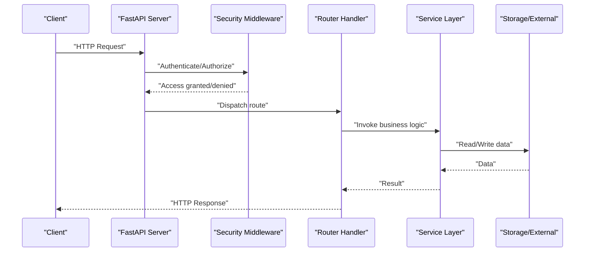
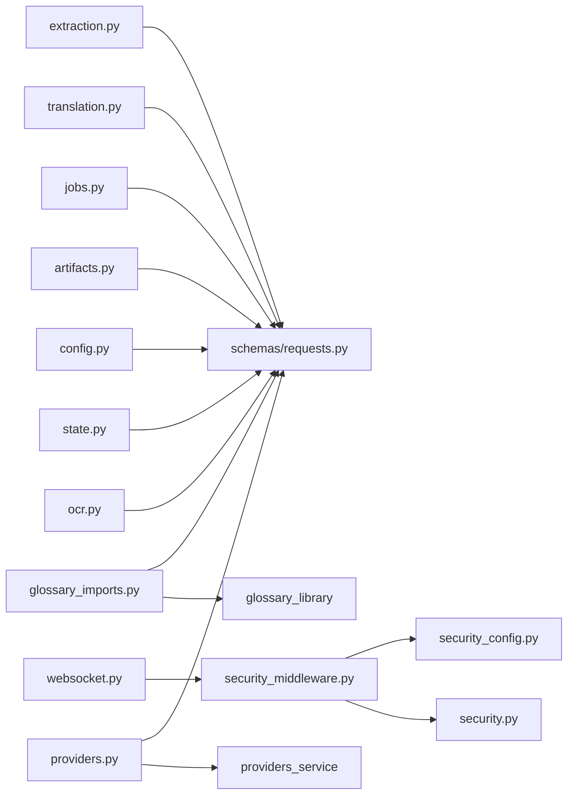

# REST API Endpoints

<cite>
**Referenced Files in This Document**
- [server.py](file://src/omniscribe/server.py)
- [routers/extraction.py](file://src/omniscribe/api/routers/extraction.py)
- [routers/translation.py](file://src/omniscribe/api/routers/translation.py)
- [routers/jobs.py](file://src/omniscribe/api/routers/jobs.py)
- [routers/artifacts.py](file://src/omniscribe/api/routers/artifacts.py)
- [routers/config.py](file://src/omniscribe/api/routers/config.py)
- [routers/state.py](file://src/omniscribe/api/routers/state.py)
- [routers/ocr.py](file://src/omniscribe/api/routers/ocr.py)
- [routers/websocket.py](file://src/omniscribe/api/routers/websocket.py)
- [routers/glossary_imports.py](file://src/omniscribe/api/routers/glossary_imports.py)
- [routers/providers.py](file://src/omniscribe/api/routers/providers.py)
- [schemas/requests.py](file://src/omniscribe/api/schemas/requests.py)
- [services/security_middleware.py](file://src/omniscribe/api/services/security_middleware.py)
- [services/security_config.py](file://src/omniscribe/api/services/security_config.py)
- [services/security.py](file://src/omniscribe/api/services/security.py)
</cite>

## Update Summary
**Changes Made**
- Added new Glossary Imports API endpoints for managing glossary imports and sources
- Added new Providers Management API endpoints for configuring translation providers
- Enhanced State Management endpoints with additional system information
- Expanded Configuration endpoints with new management capabilities
- Updated project structure to reflect new router modules

## Table of Contents
1. [Introduction](#introduction)
2. [Project Structure](#project-structure)
3. [Core Components](#core-components)
4. [Architecture Overview](#architecture-overview)
5. [Detailed Component Analysis](#detailed-component-analysis)
6. [Dependency Analysis](#dependency-analysis)
7. [Performance Considerations](#performance-considerations)
8. [Troubleshooting Guide](#troubleshooting-guide)
9. [Conclusion](#conclusion)
10. [Appendices](#appendices)

## Introduction
This document provides comprehensive REST API documentation for LocalDeepL's HTTP endpoints. It covers document extraction, translation services, job management, artifact operations, configuration management, system state endpoints, glossary imports, and provider management. For each endpoint, it specifies HTTP methods, URL patterns, request/response schemas, authentication requirements, status codes, error responses, parameters, validation rules, content types, headers, and example requests using curl, Python requests, and JavaScript fetch. It also addresses rate limiting, pagination, filtering, and sorting capabilities where applicable.

## Project Structure
LocalDeepL exposes its REST API via FastAPI routers under src/omniscribe/api/routers. The application server wires these routers and applies security middleware. Core request schemas are defined in the schemas module. Security-related logic (authentication, authorization, and configuration) is implemented in the services/security* modules. New modules include glossary imports and providers management for enhanced functionality.

```mermaid
graph TB
Client["Client"] --> Server["FastAPI Server<br/>src/omniscribe/server.py"]
Server --> RouterExtraction["Router: Extraction<br/>src/omniscribe/api/routers/extraction.py"]
Server --> RouterTranslation["Router: Translation<br/>src/omniscribe/api/routers/translation.py"]
Server --> RouterJobs["Router: Jobs<br/>src/omniscribe/api/routers/jobs.py"]
Server --> RouterArtifacts["Router: Artifacts<br/>src/omniscribe/api/routers/artifacts.py"]
Server --> RouterConfig["Router: Config<br/>src/omniscribe/api/routers/config.py"]
Server --> RouterState["Router: State<br/>src/omniscribe/api/routers/state.py"]
Server --> RouterOCR["Router: OCR<br/>src/omniscribe/api/routers/ocr.py"]
Server --> RouterWS["Router: WebSocket<br/>src/omniscribe/api/routers/websocket.py"]
Server --> RouterGlossary["Router: Glossary Imports<br/>src/omniscribe/api/routers/glossary_imports.py"]
Server --> RouterProviders["Router: Providers<br/>src/omniscribe/api/routers/providers.py"]
Server --> Schemas["Request Schemas<br/>src/omniscribe/api/schemas/requests.py"]
Server --> SecMW["Security Middleware<br/>src/omniscribe/api/services/security_middleware.py"]
SecMW --> SecCfg["Security Config<br/>src/omniscribe/api/services/security_config.py"]
SecMW --> SecAuth["Security Auth Utils<br/>src/omniscribe/api/services/security.py"]
```

**Diagram sources**
- [server.py](file://src/omniscribe/server.py)
- [routers/extraction.py](file://src/omniscribe/api/routers/extraction.py)
- [routers/translation.py](file://src/omniscribe/api/routers/translation.py)
- [routers/jobs.py](file://src/omniscribe/api/routers/jobs.py)
- [routers/artifacts.py](file://src/omniscribe/api/routers/artifacts.py)
- [routers/config.py](file://src/omniscribe/api/routers/config.py)
- [routers/state.py](file://src/omniscribe/api/routers/state.py)
- [routers/ocr.py](file://src/omniscribe/api/routers/ocr.py)
- [routers/websocket.py](file://src/omniscribe/api/routers/websocket.py)
- [routers/glossary_imports.py](file://src/omniscribe/api/routers/glossary_imports.py)
- [routers/providers.py](file://src/omniscribe/api/routers/providers.py)
- [schemas/requests.py](file://src/omniscribe/api/schemas/requests.py)
- [services/security_middleware.py](file://src/omniscribe/api/services/security_middleware.py)
- [services/security_config.py](file://src/omniscribe/api/services/security_config.py)
- [services/security.py](file://src/omniscribe/api/services/security.py)

**Section sources**
- [server.py](file://src/omniscribe/server.py)
- [routers/extraction.py](file://src/omniscribe/api/routers/extraction.py)
- [routers/translation.py](file://src/omniscribe/api/routers/translation.py)
- [routers/jobs.py](file://src/omniscribe/api/routers/jobs.py)
- [routers/artifacts.py](file://src/omniscribe/api/routers/artifacts.py)
- [routers/config.py](file://src/omniscribe/api/routers/config.py)
- [routers/state.py](file://src/omniscribe/api/routers/state.py)
- [routers/ocr.py](file://src/omniscribe/api/routers/ocr.py)
- [routers/websocket.py](file://src/omniscribe/api/routers/websocket.py)
- [routers/glossary_imports.py](file://src/omniscribe/api/routers/glossary_imports.py)
- [routers/providers.py](file://src/omniscribe/api/routers/providers.py)
- [schemas/requests.py](file://src/omniscribe/api/schemas/requests.py)
- [services/security_middleware.py](file://src/omniscribe/api/services/security_middleware.py)
- [services/security_config.py](file://src/omniscribe/api/services/security_config.py)
- [services/security.py](file://src/omniscribe/api/services/security.py)

## Core Components
- Routers: Each feature area is implemented as a FastAPI router with path prefixes and route handlers.
- Request Schemas: Pydantic models define validated request bodies and query parameters.
- Security: Middleware enforces authentication and authorization; configuration controls behavior.
- WebSocket: Real-time progress updates are provided via a dedicated WebSocket endpoint.
- Glossary Management: Dedicated endpoints for importing and managing translation glossaries.
- Provider Management: Centralized configuration and management of translation service providers.

Key responsibilities:
- Document extraction: Upload documents and extract structured content.
- Translation: Submit translation jobs and retrieve results.
- Job management: Create, list, get, cancel, and delete jobs.
- Artifact operations: Manage artifacts associated with jobs or documents.
- Configuration: Read and update runtime configuration.
- System state: Health checks and service status.
- Glossary imports: Import and manage translation glossaries from various sources.
- Provider management: Configure and manage external translation service providers.

**Section sources**
- [routers/extraction.py](file://src/omniscribe/api/routers/extraction.py)
- [routers/translation.py](file://src/omniscribe/api/routers/translation.py)
- [routers/jobs.py](file://src/omniscribe/api/routers/jobs.py)
- [routers/artifacts.py](file://src/omniscribe/api/routers/artifacts.py)
- [routers/config.py](file://src/omniscribe/api/routers/config.py)
- [routers/state.py](file://src/omniscribe/api/routers/state.py)
- [routers/ocr.py](file://src/omniscribe/api/routers/ocr.py)
- [routers/websocket.py](file://src/omniscribe/api/routers/websocket.py)
- [routers/glossary_imports.py](file://src/omniscribe/api/routers/glossary_imports.py)
- [routers/providers.py](file://src/omniscribe/api/routers/providers.py)
- [schemas/requests.py](file://src/omniscribe/api/schemas/requests.py)
- [services/security_middleware.py](file://src/omniscribe/api/services/security_middleware.py)
- [services/security_config.py](file://src/omniscribe/api/services/security_config.py)
- [services/security.py](file://src/omniscribe/api/services/security.py)

## Architecture Overview
The API follows a layered architecture:
- Clients send HTTP requests to FastAPI routes.
- Routes validate inputs against Pydantic schemas.
- Business logic executes within router handlers or delegated services.
- Security middleware intercepts requests to enforce authentication and authorization.
- Responses are serialized according to response schemas.

[No sources needed since this diagram shows conceptual workflow, not actual code structure]

## Detailed Component Analysis

### Authentication and Security
- Authentication scheme: Bearer token via Authorization header.
- Token source: Provided by security configuration and validated by security utilities.
- Scope-based access control may be enforced depending on configuration.

Common headers:
- Authorization: "Bearer <token>"
- Content-Type: "application/json" (for JSON payloads)
- Accept: "application/json"

Example usage:
- curl: include -H "Authorization: Bearer YOUR_TOKEN"
- Python requests: set headers["Authorization"] = "Bearer YOUR_TOKEN"
- JavaScript fetch: set headers["Authorization"] = "Bearer YOUR_TOKEN"

Status codes:
- 401 Unauthorized when token is missing or invalid.
- 403 Forbidden when token lacks required scope.

**Section sources**
- [services/security_middleware.py](file://src/omniscribe/api/services/security_middleware.py)
- [services/security_config.py](file://src/omniscribe/api/services/security_config.py)
- [services/security.py](file://src/omniscribe/api/services/security.py)

### Document Extraction
Endpoints:
- POST /api/extraction/upload
  - Purpose: Upload a document for extraction.
  - Request body: multipart/form-data with file field(s).
  - Response: job_id or extraction_id.
  - Status codes: 201 Created, 400 Bad Request, 401 Unauthorized, 413 Payload Too Large.
- GET /api/extraction/{id}
  - Purpose: Retrieve extraction status and result metadata.
  - Response: extraction object with fields such as id, status, created_at, updated_at, result_url.
  - Status codes: 200 OK, 404 Not Found, 401 Unauthorized.
- DELETE /api/extraction/{id}
  - Purpose: Delete an extraction and associated artifacts.
  - Response: success message.
  - Status codes: 204 No Content, 404 Not Found, 401 Unauthorized.

Validation rules:
- File size limits enforced by server configuration.
- Supported formats validated at upload time.

Pagination/filtering/sorting:
- Not applicable for single-resource endpoints.

Examples:
- curl:
  - Upload: curl -X POST -F "file=@document.pdf" https://localhost:8000/api/extraction/upload -H "Authorization: Bearer YOUR_TOKEN"
  - Get: curl https://localhost:8000/api/extraction/EXTRACTION_ID -H "Authorization: Bearer YOUR_TOKEN"
  - Delete: curl -X DELETE https://localhost:8000/api/extraction/EXTRACTION_ID -H "Authorization: Bearer YOUR_TOKEN"
- Python requests:
  - Upload: requests.post(url, files={"file": open("document.pdf", "rb")}, headers=headers)
  - Get/Delete: requests.get/delete(url, headers=headers)
- JavaScript fetch:
  - Upload: fetch(url, {method: "POST", headers: headers, body: formData})
  - Get/Delete: fetch(url, {method: "GET"/"DELETE", headers: headers})

**Section sources**
- [routers/extraction.py](file://src/omniscribe/api/routers/extraction.py)
- [schemas/requests.py](file://src/omniscribe/api/schemas/requests.py)

### Translation Services
Endpoints:
- POST /api/translation/jobs
  - Purpose: Submit a translation job.
  - Request body: JSON with fields like source_text, target_language, source_language, style, glossary_ids, priority.
  - Response: job_id and initial status.
  - Status codes: 201 Created, 400 Bad Request, 401 Unauthorized.
- GET /api/translation/jobs/{job_id}
  - Purpose: Retrieve translation job details and result.
  - Response: job object including status, translations, errors.
  - Status codes: 200 OK, 404 Not Found, 401 Unauthorized.
- PUT /api/translation/jobs/{job_id}
  - Purpose: Update job options (e.g., add glossaries, change priority).
  - Request body: partial update fields.
  - Response: updated job object.
  - Status codes: 200 OK, 400 Bad Request, 404 Not Found, 401 Unauthorized.
- DELETE /api/translation/jobs/{job_id}
  - Purpose: Cancel or delete a translation job.
  - Response: success message.
  - Status codes: 204 No Content, 404 Not Found, 401 Unauthorized.

Validation rules:
- Language codes must be valid ISO codes.
- Text length limits enforced.
- Glossary IDs must exist if provided.

Pagination/filtering/sorting:
- Not applicable for single-resource endpoints.

Examples:
- curl:
  - Submit: curl -X POST -H "Content-Type: application/json" -H "Authorization: Bearer YOUR_TOKEN" -d '{"source_text":"Hello","target_language":"es"}' https://localhost:8000/api/translation/jobs
  - Get: curl https://localhost:8000/api/translation/jobs/JOB_ID -H "Authorization: Bearer YOUR_TOKEN"
  - Update: curl -X PUT -H "Content-Type: application/json" -H "Authorization: Bearer YOUR_TOKEN" -d '{"priority":"high"}' https://localhost:8000/api/translation/jobs/JOB_ID
  - Delete: curl -X DELETE https://localhost:8000/api/translation/jobs/JOB_ID -H "Authorization: Bearer YOUR_TOKEN"
- Python requests:
  - Submit: requests.post(url, json=payload, headers=headers)
  - Get/Update/Delete: requests.get/put/delete(url, headers=headers)
- JavaScript fetch:
  - Submit: fetch(url, {method: "POST", headers: headers, body: JSON.stringify(payload)})
  - Get/Update/Delete: fetch(url, {method: "GET"/"PUT"/"DELETE", headers: headers})

**Section sources**
- [routers/translation.py](file://src/omniscribe/api/routers/translation.py)
- [schemas/requests.py](file://src/omniscribe/api/schemas/requests.py)

### Job Management
Endpoints:
- GET /api/jobs
  - Purpose: List jobs with optional filters and pagination.
  - Query parameters:
    - page: integer, default 1
    - per_page: integer, default 20, max 100
    - status: string filter (e.g., pending, processing, completed, failed)
    - sort_by: string (e.g., created_at, updated_at)
    - order: string (asc, desc)
  - Response: paginated list of jobs with metadata (total, page, per_page).
  - Status codes: 200 OK, 401 Unauthorized.
- GET /api/jobs/{job_id}
  - Purpose: Retrieve a specific job.
  - Response: job object.
  - Status codes: 200 OK, 404 Not Found, 401 Unauthorized.
- DELETE /api/jobs/{job_id}
  - Purpose: Delete a job.
  - Response: success message.
  - Status codes: 204 No Content, 404 Not Found, 401 Unauthorized.

Validation rules:
- Pagination bounds enforced.
- Sort fields restricted to allowed values.

Examples:
- curl:
  - List: curl "https://localhost:8000/api/jobs?page=1&per_page=20&status=completed&sort_by=created_at&order=desc" -H "Authorization: Bearer YOUR_TOKEN"
  - Get: curl https://localhost:8000/api/jobs/JOB_ID -H "Authorization: Bearer YOUR_TOKEN"
  - Delete: curl -X DELETE https://localhost:8000/api/jobs/JOB_ID -H "Authorization: Bearer YOUR_TOKEN"
- Python requests:
  - List: requests.get(url, params=params, headers=headers)
  - Get/Delete: requests.get/delete(url, headers=headers)
- JavaScript fetch:
  - List: fetch(url + "?" + new URLSearchParams(params), {headers: headers})
  - Get/Delete: fetch(url, {method: "GET"/"DELETE", headers: headers})

**Section sources**
- [routers/jobs.py](file://src/omniscribe/api/routers/jobs.py)
- [schemas/requests.py](file://src/omniscribe/api/schemas/requests.py)

### Artifact Operations
Endpoints:
- GET /api/artifacts
  - Purpose: List artifacts with optional filters and pagination.
  - Query parameters:
    - page: integer
    - per_page: integer
    - type: string filter (e.g., image, text, pdf)
    - sort_by: string
    - order: string
  - Response: paginated list of artifacts with metadata.
  - Status codes: 200 OK, 401 Unauthorized.
- GET /api/artifacts/{artifact_id}
  - Purpose: Retrieve artifact metadata and download link.
  - Response: artifact object.
  - Status codes: 200 OK, 404 Not Found, 401 Unauthorized.
- DELETE /api/artifacts/{artifact_id}
  - Purpose: Delete an artifact.
  - Response: success message.
  - Status codes: 204 No Content, 404 Not Found, 401 Unauthorized.

Validation rules:
- Type filters restricted to supported artifact types.
- Pagination bounds enforced.

Examples:
- curl:
  - List: curl "https://localhost:8000/api/artifacts?type=text&page=1&per_page=20" -H "Authorization: Bearer YOUR_TOKEN"
  - Get: curl https://localhost:8000/api/artifacts/ARTIFACT_ID -H "Authorization: Bearer YOUR_TOKEN"
  - Delete: curl -X DELETE https://localhost:8000/api/artifacts/ARTIFACT_ID -H "Authorization: Bearer YOUR_TOKEN"
- Python requests:
  - List: requests.get(url, params=params, headers=headers)
  - Get/Delete: requests.get/delete(url, headers=headers)
- JavaScript fetch:
  - List: fetch(url + "?" + new URLSearchParams(params), {headers: headers})
  - Get/Delete: fetch(url, {method: "GET"/"DELETE", headers: headers})

**Section sources**
- [routers/artifacts.py](file://src/omniscribe/api/routers/artifacts.py)
- [schemas/requests.py](file://src/omniscribe/api/schemas/requests.py)

### Configuration Management
Endpoints:
- GET /api/config
  - Purpose: Retrieve current configuration.
  - Response: configuration object with sections such as security, translation, storage.
  - Status codes: 200 OK, 401 Unauthorized.
- PUT /api/config
  - Purpose: Update configuration settings.
  - Request body: JSON with fields to update.
  - Response: updated configuration object.
  - Status codes: 200 OK, 400 Bad Request, 401 Unauthorized.

Validation rules:
- Only whitelisted keys can be updated.
- Values must conform to expected types and ranges.

Examples:
- curl:
  - Get: curl https://localhost:8000/api/config -H "Authorization: Bearer YOUR_TOKEN"
  - Update: curl -X PUT -H "Content-Type: application/json" -H "Authorization: Bearer YOUR_TOKEN" -d '{"security":{"rate_limit_requests_per_minute":60}}' https://localhost:8000/api/config
- Python requests:
  - Get: requests.get(url, headers=headers)
  - Update: requests.put(url, json=payload, headers=headers)
- JavaScript fetch:
  - Get: fetch(url, {headers: headers})
  - Update: fetch(url, {method: "PUT", headers: headers, body: JSON.stringify(payload)})

**Section sources**
- [routers/config.py](file://src/omniscribe/api/routers/config.py)
- [schemas/requests.py](file://src/omniscribe/api/schemas/requests.py)

### System State
Endpoints:
- GET /api/state/health
  - Purpose: Health check endpoint.
  - Response: health status object.
  - Status codes: 200 OK.
- GET /api/state/status
  - Purpose: Service status and version information.
  - Response: status object including version, uptime, dependencies.
  - Status codes: 200 OK.

Authentication:
- Typically public; no token required unless configured otherwise.

Examples:
- curl:
  - Health: curl https://localhost:8000/api/state/health
  - Status: curl https://localhost:8000/api/state/status
- Python requests:
  - Health/Status: requests.get(url)
- JavaScript fetch:
  - Health/Status: fetch(url)

**Section sources**
- [routers/state.py](file://src/omniscribe/api/routers/state.py)

### OCR Services
Endpoints:
- POST /api/ocr/process
  - Purpose: Process images or documents with OCR.
  - Request body: multipart/form-data with image/document file(s) and options.
  - Response: job_id or processed result.
  - Status codes: 201 Created, 400 Bad Request, 401 Unauthorized.
- GET /api/ocr/results/{job_id}
  - Purpose: Retrieve OCR results.
  - Response: OCR result object with text, bounding boxes, confidence scores.
  - Status codes: 200 OK, 404 Not Found, 401 Unauthorized.

Validation rules:
- Image format and size constraints enforced.
- Options validated against supported OCR engines.

Examples:
- curl:
  - Process: curl -X POST -F "image=@page.png" -F "engine=trocr" https://localhost:8000/api/ocr/process -H "Authorization: Bearer YOUR_TOKEN"
  - Results: curl https://localhost:8000/api/ocr/results/JOB_ID -H "Authorization: Bearer YOUR_TOKEN"
- Python requests:
  - Process: requests.post(url, files={"image": open("page.png", "rb")}, headers=headers)
  - Results: requests.get(url, headers=headers)
- JavaScript fetch:
  - Process: fetch(url, {method: "POST", headers: headers, body: formData})
  - Results: fetch(url, {method: "GET", headers: headers})

**Section sources**
- [routers/ocr.py](file://src/omniscribe/api/routers/ocr.py)
- [schemas/requests.py](file://src/omniscribe/api/schemas/requests.py)

### Glossary Imports
New endpoints for managing translation glossaries:
- POST /api/glossary-imports
  - Purpose: Import a new glossary from various sources (CSV, TSV, JSON, TMX, TBX, XLIFF).
  - Request body: JSON with source_type, source_url, credentials (if required), and import options.
  - Response: import_job_id and initial status.
  - Status codes: 201 Created, 400 Bad Request, 401 Unauthorized.
- GET /api/glossary-imports
  - Purpose: List all glossary imports with filtering and pagination.
  - Query parameters: page, per_page, status, source_type, created_after, created_before.
  - Response: paginated list of import jobs with metadata.
  - Status codes: 200 OK, 401 Unauthorized.
- GET /api/glossary-imports/{import_id}
  - Purpose: Get detailed status and results of a specific glossary import.
  - Response: import job object with progress, errors, and imported terms count.
  - Status codes: 200 OK, 404 Not Found, 401 Unauthorized.
- DELETE /api/glossary-imports/{import_id}
  - Purpose: Cancel or delete a glossary import job.
  - Response: success message.
  - Status codes: 204 No Content, 404 Not Found, 401 Unauthorized.

Validation rules:
- Source types must be supported formats (csv, tsv, json, tmx, tbx, xliff).
- URLs must be accessible and properly formatted.
- Credentials validated based on source type requirements.

Examples:
- curl:
  - Import: curl -X POST -H "Content-Type: application/json" -H "Authorization: Bearer YOUR_TOKEN" -d '{"source_type":"csv","source_url":"https://example.com/glossary.csv"}' https://localhost:8000/api/glossary-imports
  - List: curl "https://localhost:8000/api/glossary-imports?page=1&per_page=20" -H "Authorization: Bearer YOUR_TOKEN"
  - Get: curl https://localhost:8000/api/glossary-imports/IMPORT_ID -H "Authorization: Bearer YOUR_TOKEN"
  - Delete: curl -X DELETE https://localhost:8000/api/glossary-imports/IMPORT_ID -H "Authorization: Bearer YOUR_TOKEN"
- Python requests:
  - Import: requests.post(url, json=payload, headers=headers)
  - List/Get/Delete: requests.get/delete(url, headers=headers)
- JavaScript fetch:
  - Import: fetch(url, {method: "POST", headers: headers, body: JSON.stringify(payload)})
  - List/Get/Delete: fetch(url, {method: "GET"/"DELETE", headers: headers})

**Section sources**
- [routers/glossary_imports.py](file://src/omniscribe/api/routers/glossary_imports.py)
- [schemas/requests.py](file://src/omniscribe/api/schemas/requests.py)

### Providers Management
New endpoints for managing translation service providers:
- GET /api/providers
  - Purpose: List all configured translation providers.
  - Response: array of provider configurations with status and capabilities.
  - Status codes: 200 OK, 401 Unauthorized.
- POST /api/providers
  - Purpose: Add a new translation provider configuration.
  - Request body: provider configuration including type, credentials, and options.
  - Response: created provider configuration.
  - Status codes: 201 Created, 400 Bad Request, 401 Unauthorized.
- GET /api/providers/{provider_id}
  - Purpose: Get specific provider configuration and test connectivity.
  - Response: provider details with connection status.
  - Status codes: 200 OK, 404 Not Found, 401 Unauthorized.
- PUT /api/providers/{provider_id}
  - Purpose: Update provider configuration.
  - Request body: partial update fields.
  - Response: updated provider configuration.
  - Status codes: 200 OK, 400 Bad Request, 404 Not Found, 401 Unauthorized.
- DELETE /api/providers/{provider_id}
  - Purpose: Remove a provider configuration.
  - Response: success message.
  - Status codes: 204 No Content, 404 Not Found, 401 Unauthorized.
- POST /api/providers/{provider_id}/test
  - Purpose: Test provider connectivity and credentials.
  - Response: test result with connection status and any errors.
  - Status codes: 200 OK, 400 Bad Request, 401 Unauthorized.

Validation rules:
- Provider types must be supported (openai, anthropic, google, etc.).
- Credentials validated based on provider requirements.
- Configuration options validated against provider specifications.

Examples:
- curl:
  - List: curl https://localhost:8000/api/providers -H "Authorization: Bearer YOUR_TOKEN"
  - Add: curl -X POST -H "Content-Type: application/json" -H "Authorization: Bearer YOUR_TOKEN" -d '{"type":"openai","api_key":"YOUR_KEY","model":"gpt-4"}' https://localhost:8000/api/providers
  - Test: curl -X POST https://localhost:8000/api/providers/PROVIDER_ID/test -H "Authorization: Bearer YOUR_TOKEN"
  - Update: curl -X PUT -H "Content-Type: application/json" -H "Authorization: Bearer YOUR_TOKEN" -d '{"model":"gpt-4-turbo"}' https://localhost:8000/api/providers/PROVIDER_ID
  - Delete: curl -X DELETE https://localhost:8000/api/providers/PROVIDER_ID -H "Authorization: Bearer YOUR_TOKEN"
- Python requests:
  - CRUD operations: requests.get/post/put/delete(url, json=payload, headers=headers)
- JavaScript fetch:
  - CRUD operations: fetch(url, {method: "GET"/"POST"/"PUT"/"DELETE", headers: headers, body: JSON.stringify(payload)})

**Section sources**
- [routers/providers.py](file://src/omniscribe/api/routers/providers.py)
- [schemas/requests.py](file://src/omniscribe/api/schemas/requests.py)

### WebSocket Progress Updates
Endpoint:
- WS /api/ws/progress
  - Purpose: Receive real-time progress events for long-running jobs.
  - Authentication: Bearer token via connection URL parameter or handshake payload.
  - Events:
    - job_started: {job_id, timestamp}
    - job_progress: {job_id, percent, message}
    - job_completed: {job_id, result_url}
    - job_failed: {job_id, error}
  - Close reason: client disconnect or server shutdown.

Examples:
- curl:
  - wscat -c "wss://localhost:8000/api/ws/progress?token=YOUR_TOKEN"
- Python requests:
  - Use websockets library: await websockets.connect("wss://localhost:8000/api/ws/progress?token=YOUR_TOKEN")
- JavaScript fetch:
  - const ws = new WebSocket("wss://localhost:8000/api/ws/progress?token=YOUR_TOKEN");

**Section sources**
- [routers/websocket.py](file://src/omniscribe/api/routers/websocket.py)
- [services/security_middleware.py](file://src/omniscribe/api/services/security_middleware.py)

## Dependency Analysis
The API layer depends on:
- Request schemas for validation.
- Security middleware for authentication and authorization.
- Optional external services (OCR engines, LLM providers) invoked by routers.
- Glossary import services for processing various file formats.
- Provider management services for external translation APIs.

**Diagram sources**
- [routers/extraction.py](file://src/omniscribe/api/routers/extraction.py)
- [routers/translation.py](file://src/omniscribe/api/routers/translation.py)
- [routers/jobs.py](file://src/omniscribe/api/routers/jobs.py)
- [routers/artifacts.py](file://src/omniscribe/api/routers/artifacts.py)
- [routers/config.py](file://src/omniscribe/api/routers/config.py)
- [routers/state.py](file://src/omniscribe/api/routers/state.py)
- [routers/ocr.py](file://src/omniscribe/api/routers/ocr.py)
- [routers/websocket.py](file://src/omniscribe/api/routers/websocket.py)
- [routers/glossary_imports.py](file://src/omniscribe/api/routers/glossary_imports.py)
- [routers/providers.py](file://src/omniscribe/api/routers/providers.py)
- [schemas/requests.py](file://src/omniscribe/api/schemas/requests.py)
- [services/security_middleware.py](file://src/omniscribe/api/services/security_middleware.py)
- [services/security_config.py](file://src/omniscribe/api/services/security_config.py)
- [services/security.py](file://src/omniscribe/api/services/security.py)

**Section sources**
- [routers/extraction.py](file://src/omniscribe/api/routers/extraction.py)
- [routers/translation.py](file://src/omniscribe/api/routers/translation.py)
- [routers/jobs.py](file://src/omniscribe/api/routers/jobs.py)
- [routers/artifacts.py](file://src/omniscribe/api/routers/artifacts.py)
- [routers/config.py](file://src/omniscribe/api/routers/config.py)
- [routers/state.py](file://src/omniscribe/api/routers/state.py)
- [routers/ocr.py](file://src/omniscribe/api/routers/ocr.py)
- [routers/websocket.py](file://src/omniscribe/api/routers/websocket.py)
- [routers/glossary_imports.py](file://src/omniscribe/api/routers/glossary_imports.py)
- [routers/providers.py](file://src/omniscribe/api/routers/providers.py)
- [schemas/requests.py](file://src/omniscribe/api/schemas/requests.py)
- [services/security_middleware.py](file://src/omniscribe/api/services/security_middleware.py)
- [services/security_config.py](file://src/omniscribe/api/services/security_config.py)
- [services/security.py](file://src/omniscribe/api/services/security.py)

## Performance Considerations
- Rate limiting: Controlled via security configuration; adjust requests_per_minute and burst limits based on capacity.
- Pagination: Always use page and per_page for list endpoints to avoid large payloads.
- Filtering/sorting: Leverage query parameters to reduce server-side processing.
- Asynchronous processing: Long-running tasks should use job endpoints and WebSocket progress updates.
- Caching: Consider caching frequent reads for static configuration and health endpoints.
- Provider pooling: Reuse connections to external translation providers for better performance.
- Glossary import batching: Process large glossary files in chunks to prevent memory issues.

[No sources needed since this section provides general guidance]

## Troubleshooting Guide
Common issues:
- 401 Unauthorized: Ensure Authorization header includes a valid Bearer token.
- 403 Forbidden: Verify token has required scopes.
- 400 Bad Request: Check request body schema and validation rules.
- 404 Not Found: Confirm resource IDs and paths.
- 413 Payload Too Large: Reduce file sizes or adjust server limits.
- 429 Too Many Requests: Respect rate limits; implement backoff.
- Provider connection failures: Verify API keys and network connectivity.
- Glossary import errors: Check file format compatibility and source accessibility.

Debugging steps:
- Inspect request headers and payloads.
- Validate tokens using security configuration.
- Review server logs for detailed error traces.
- Use WebSocket to monitor job progress and failures.
- Test provider connectivity using the test endpoint.
- Validate glossary file formats before import.

**Section sources**
- [services/security_middleware.py](file://src/omniscribe/api/services/security_middleware.py)
- [services/security_config.py](file://src/omniscribe/api/services/security_config.py)
- [services/security.py](file://src/omniscribe/api/services/security.py)

## Conclusion
LocalDeepL's REST API provides a comprehensive set of endpoints for document extraction, translation, job management, artifact operations, configuration, system state, glossary imports, and provider management. Authentication is enforced via Bearer tokens, and robust validation ensures reliable interactions. Clients should leverage pagination, filtering, and sorting to optimize performance and use WebSocket for real-time progress updates. The new glossary import and provider management endpoints enhance the platform's flexibility and integration capabilities.

[No sources needed since this section summarizes without analyzing specific files]

## Appendices

### Error Response Schema
All error responses follow a consistent structure:
- code: string error code
- message: human-readable description
- details: optional additional context

Example error response:
{
  "code": "VALIDATION_ERROR",
  "message": "Invalid language code",
  "details": {"field": "target_language", "value": "xx"}
}

[No sources needed since this section provides general guidance]

### Content Types and Headers
- Content-Type: application/json for JSON payloads; multipart/form-data for file uploads.
- Accept: application/json recommended.
- Authorization: Bearer <token> for protected endpoints.

[No sources needed since this section provides general guidance]

### Supported Glossary Formats
- CSV: Comma-separated values with term pairs
- TSV: Tab-separated values with term pairs
- JSON: JSON format with key-value pairs
- TMX: Translation Memory eXchange format
- TBX: TermBase eXchange format
- XLIFF: XML Localization Interchange File Format

[No sources needed since this section provides general guidance]

### Supported Provider Types
- OpenAI: GPT models and embeddings
- Anthropic: Claude models
- Google: Gemini and other Google AI services
- Custom: Any provider following the standard interface

[No sources needed since this section provides general guidance]