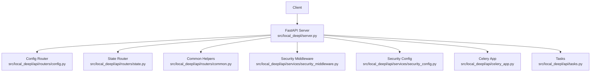
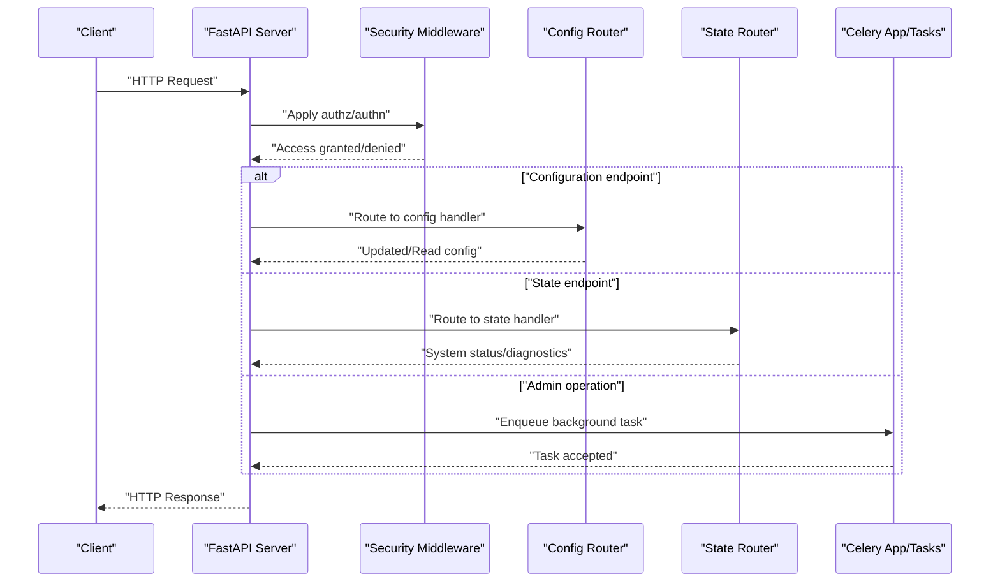
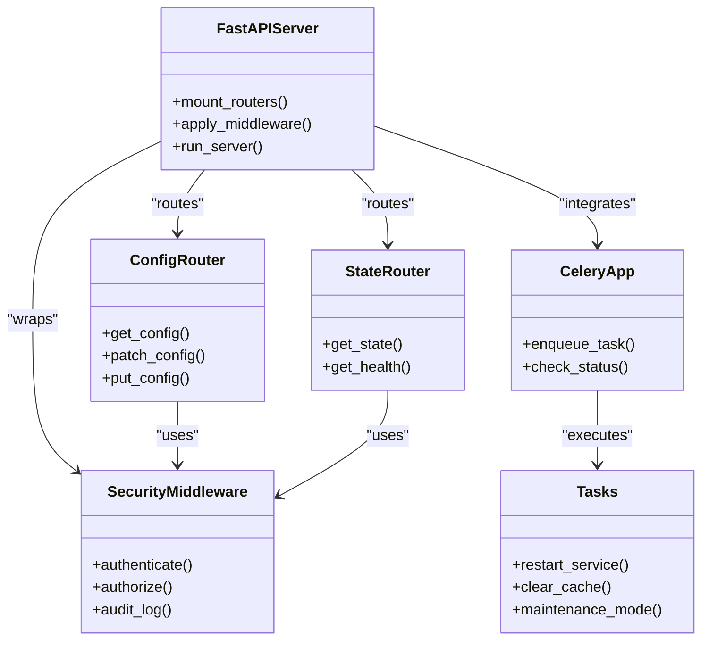

# System Endpoints

<cite>
**Referenced Files in This Document**
- [server.py](file://src/local_deepl/server.py)
- [config.py](file://src/local_deepl/api/routers/config.py)
- [state.py](file://src/local_deepl/api/routers/state.py)
- [common.py](file://src/local_deepl/api/routers/common.py)
- [security_middleware.py](file://src/local_deepl/api/services/security_middleware.py)
- [security_config.py](file://src/local_deepl/api/services/security_config.py)
- [tasks.py](file://src/local_deepl/api/tasks.py)
- [celery_app.py](file://src/local_deepl/api/celery_app.py)
</cite>

## Table of Contents
1. [Introduction](#introduction)
2. [Project Structure](#project-structure)
3. [Core Components](#core-components)
4. [Architecture Overview](#architecture-overview)
5. [Detailed Component Analysis](#detailed-component-analysis)
6. [Dependency Analysis](#dependency-analysis)
7. [Performance Considerations](#performance-considerations)
8. [Troubleshooting Guide](#troubleshooting-guide)
9. [Conclusion](#conclusion)

## Introduction
This document provides detailed API documentation for LocalDeepL’s system management endpoints. It covers configuration management, system state inspection, health checks, and administrative operations. The focus is on HTTP methods, request/response schemas, dynamic configuration updates, environment variable overrides, diagnostics, security considerations, audit logging, and operational best practices for production environments.

## Project Structure
LocalDeepL exposes its APIs through FastAPI routers under src/local_deepl/api/routers. System management endpoints are primarily implemented in:
- Configuration router (read/write settings)
- State router (system status and diagnostics)
- Common utilities (shared helpers and responses)
- Security middleware and configuration (authentication/authorization and admin gating)
- Background task integration (Celery app and tasks)

**Diagram sources**
- [server.py](file://src/local_deepl/server.py)
- [config.py](file://src/local_deepl/api/routers/config.py)
- [state.py](file://src/local_deepl/api/routers/state.py)
- [common.py](file://src/local_deepl/api/routers/common.py)
- [security_middleware.py](file://src/local_deepl/api/services/security_middleware.py)
- [security_config.py](file://src/local_deepl/api/services/security_config.py)
- [celery_app.py](file://src/local_deepl/api/celery_app.py)
- [tasks.py](file://src/local_deepl/api/tasks.py)

**Section sources**
- [server.py](file://src/local_deepl/server.py)
- [config.py](file://src/local_deepl/api/routers/config.py)
- [state.py](file://src/local_deepl/api/routers/state.py)
- [common.py](file://src/local_deepl/api/routers/common.py)
- [security_middleware.py](file://src/local_deepl/api/services/security_middleware.py)
- [security_config.py](file://src/local_deepl/api/services/security_config.py)
- [celery_app.py](file://src/local_deepl/api/celery_app.py)
- [tasks.py](file://src/local_deepl/api/tasks.py)

## Core Components
- Configuration Management: Read and write runtime configuration parameters with validation and persistence where applicable. Supports partial updates and full replacement patterns.
- System State Inspection: Retrieve current system status, component health, and diagnostic information.
- Health Checks: Provide liveness/readiness endpoints to support orchestration and load balancers.
- Administrative Operations: Protected endpoints for privileged actions such as clearing caches, restarting services, or triggering maintenance tasks via background jobs.

Key implementation files:
- Configuration router: src/local_deepl/api/routers/config.py
- State router: src/local_deepl/api/routers/state.py
- Common utilities: src/local_deepl/api/routers/common.py
- Security middleware: src/local_deepl/api/services/security_middleware.py
- Security configuration: src/local_deepl/api/services/security_config.py
- Celery integration: src/local_deepl/api/celery_app.py, src/local_deepl/api/tasks.py

**Section sources**
- [config.py](file://src/local_deepl/api/routers/config.py)
- [state.py](file://src/local_deepl/api/routers/state.py)
- [common.py](file://src/local_deepl/api/routers/common.py)
- [security_middleware.py](file://src/local_deepl/api/services/security_middleware.py)
- [security_config.py](file://src/local_deepl/api/services/security_config.py)
- [celery_app.py](file://src/local_deepl/api/celery_app.py)
- [tasks.py](file://src/local_deepl/api/tasks.py)

## Architecture Overview
The system management layer sits behind a FastAPI server that wires routers and applies security middleware. Configuration and state endpoints interact with internal services and optionally trigger background tasks via Celery.

**Diagram sources**
- [server.py](file://src/local_deepl/server.py)
- [config.py](file://src/local_deepl/api/routers/config.py)
- [state.py](file://src/local_deepl/api/routers/state.py)
- [security_middleware.py](file://src/local_deepl/api/services/security_middleware.py)
- [celery_app.py](file://src/local_deepl/api/celery_app.py)
- [tasks.py](file://src/local_deepl/api/tasks.py)

## Detailed Component Analysis

### Configuration Management Endpoints
Purpose:
- Read current configuration values
- Update configuration parameters dynamically
- Validate inputs and enforce schema constraints
- Persist changes where applicable

Typical HTTP methods:
- GET /api/config: Retrieve configuration snapshot
- PATCH /api/config: Partial update of configuration fields
- PUT /api/config: Full replacement of configuration (if supported)

Request/Response Schemas:
- GET response: Object containing all configuration keys and values; may include metadata like version or last_updated timestamp
- PATCH request: Object with only the fields to update; missing fields remain unchanged
- PATCH response: Updated configuration object reflecting applied changes
- PUT request: Complete configuration object; validated against schema
- PUT response: Confirmation of applied configuration

Validation and Error Handling:
- Invalid field names or types return 400-level errors
- Unauthorized access returns 401/403 when not authenticated or lacking admin privileges
- Validation failures provide structured error messages indicating invalid keys/values

Dynamic Updates:
- Changes take effect immediately for non-persistent runtime parameters
- Persistent parameters are written to storage and reloaded on service restart
- Some parameters may require a reload or restart; responses indicate required actions

Environment Variable Overrides:
- Environment variables can override configuration values at startup or runtime depending on implementation
- Priority order typically: explicit API update > environment variable > default configuration
- Use consistent naming conventions for environment variables corresponding to configuration keys

Operational Notes:
- Audit logging records who changed what and when
- Rate limiting may apply to prevent excessive updates
- Backward compatibility ensures older clients continue working

**Section sources**
- [config.py](file://src/local_deepl/api/routers/config.py)
- [security_middleware.py](file://src/local_deepl/api/services/security_middleware.py)
- [security_config.py](file://src/local_deepl/api/services/security_config.py)

### System State Inspection Endpoints
Purpose:
- Provide real-time system status and diagnostics
- Expose component health and resource utilization metrics
- Support monitoring and alerting integrations

Typical HTTP methods:
- GET /api/state: Retrieve current system state
- GET /api/health: Liveness/readiness check

Request/Response Schemas:
- GET /api/state response: Object including uptime, memory usage, CPU load, active jobs, queue lengths, and component statuses
- GET /api/health response: Simple status indicator (healthy/unhealthy) with optional details

Diagnostics:
- Detailed diagnostics may include stack traces, thread dumps, or performance counters
- Sensitive information is masked by default; admin access may reveal additional details

Monitoring Integration:
- Metrics can be exposed in Prometheus-compatible formats if enabled
- Health endpoints integrate with orchestrators (Kubernetes, Docker Swarm)

Operational Notes:
- Frequent polling should be rate-limited
- Aggregated metrics reduce overhead compared to raw dumps

**Section sources**
- [state.py](file://src/local_deepl/api/routers/state.py)
- [common.py](file://src/local_deepl/api/routers/common.py)

### Administrative Operations Endpoints
Purpose:
- Perform privileged actions such as cache clearing, log rotation, service restarts, or maintenance tasks
- Trigger asynchronous operations via background workers

Typical HTTP methods:
- POST /api/admin/restart: Restart specific components or the entire service
- POST /api/admin/cache/clear: Clear caches or temporary data
- POST /api/admin/maintenance: Enter/exit maintenance mode

Request/Response Schemas:
- POST requests: Minimal payload specifying target scope (component/service)
- Responses: Acknowledgement with job ID for async operations; synchronous responses confirm immediate actions

Background Task Integration:
- Admin operations enqueue tasks via Celery
- Clients poll task status using provided IDs or receive webhooks if configured

Security Considerations:
- Strict authentication and authorization required
- IP whitelisting or network restrictions recommended
- Audit logs capture all administrative actions

**Section sources**
- [tasks.py](file://src/local_deepl/api/tasks.py)
- [celery_app.py](file://src/local_deepl/api/celery_app.py)
- [security_middleware.py](file://src/local_deepl/api/services/security_middleware.py)

### Security and Access Control
Authentication and Authorization:
- All administrative endpoints require valid credentials
- Role-based access control restricts operations to administrators
- Middleware enforces policies before routing to handlers

Audit Logging:
- Every administrative action is logged with user identity, timestamp, and action details
- Logs are stored securely and can be exported for compliance

Best Practices:
- Use HTTPS for all administrative traffic
- Rotate credentials regularly
- Restrict access to trusted networks
- Monitor and alert on suspicious activity

**Section sources**
- [security_middleware.py](file://src/local_deepl/api/services/security_middleware.py)
- [security_config.py](file://src/local_deepl/api/services/security_config.py)

## Dependency Analysis
The system management layer depends on several core components:

**Diagram sources**
- [server.py](file://src/local_deepl/server.py)
- [config.py](file://src/local_deepl/api/routers/config.py)
- [state.py](file://src/local_deepl/api/routers/state.py)
- [security_middleware.py](file://src/local_deepl/api/services/security_middleware.py)
- [celery_app.py](file://src/local_deepl/api/celery_app.py)
- [tasks.py](file://src/local_deepl/api/tasks.py)

**Section sources**
- [server.py](file://src/local_deepl/server.py)
- [config.py](file://src/local_deepl/api/routers/config.py)
- [state.py](file://src/local_deepl/api/routers/state.py)
- [security_middleware.py](file://src/local_deepl/api/services/security_middleware.py)
- [celery_app.py](file://src/local_deepl/api/celery_app.py)
- [tasks.py](file://src/local_deepl/api/tasks.py)

## Performance Considerations
- Minimize payload sizes for frequent polling endpoints
- Implement caching for read-heavy configuration queries
- Use streaming responses for large diagnostic dumps
- Rate limit administrative operations to prevent abuse
- Offload heavy tasks to background workers to maintain responsiveness

[No sources needed since this section provides general guidance]

## Troubleshooting Guide
Common Issues:
- Authentication failures: Verify credentials and token validity
- Permission denied: Ensure user has appropriate roles
- Configuration validation errors: Check field names and value types
- Background task failures: Inspect worker logs and task queues

Diagnostic Steps:
- Check health endpoints for service status
- Review audit logs for recent administrative actions
- Monitor system state for resource exhaustion
- Validate configuration changes with rollback procedures

Error Responses:
- 400 Bad Request: Invalid input or validation failure
- 401 Unauthorized: Missing or invalid credentials
- 403 Forbidden: Insufficient permissions
- 500 Internal Server Error: Unexpected server-side issues

**Section sources**
- [security_middleware.py](file://src/local_deepl/api/services/security_middleware.py)
- [common.py](file://src/local_deepl/api/routers/common.py)

## Conclusion
LocalDeepL’s system management endpoints provide comprehensive capabilities for configuration management, system monitoring, health checks, and administrative operations. By following the documented schemas, security practices, and operational guidelines, administrators can effectively manage and monitor their deployments while maintaining security and performance standards.

[No sources needed since this section summarizes without analyzing specific files]