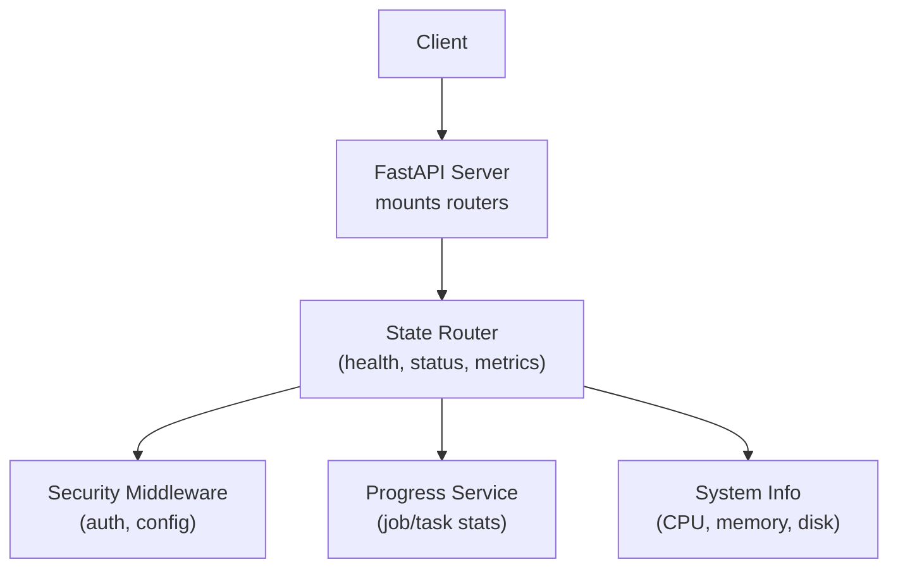
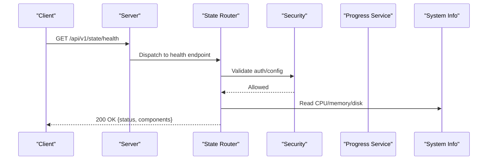
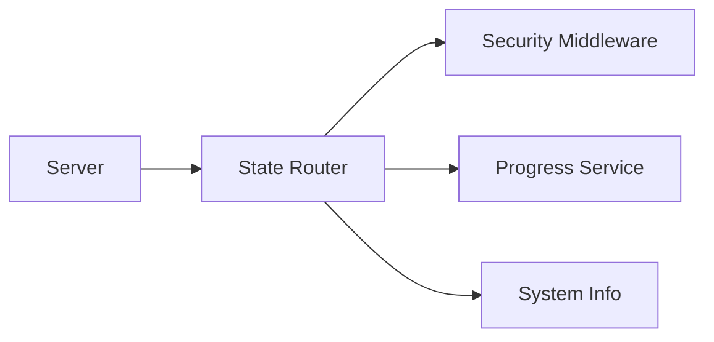

# System State API

<cite>
**Referenced Files in This Document**
- [state.py](file://src/local_deepl/api/routers/state.py)
- [server.py](file://src/local_deepl/server.py)
- [common.py](file://src/local_deepl/api/routers/common.py)
- [security.py](file://src/local_deepl/api/services/security.py)
- [security_config.py](file://src/local_deepl/api/services/security_config.py)
- [progress.py](file://src/local_deepl/api/services/progress.py)
</cite>

## Table of Contents
1. [Introduction](#introduction)
2. [Project Structure](#project-structure)
3. [Core Components](#core-components)
4. [Architecture Overview](#architecture-overview)
5. [Detailed Component Analysis](#detailed-component-analysis)
6. [Dependency Analysis](#dependency-analysis)
7. [Performance Considerations](#performance-considerations)
8. [Troubleshooting Guide](#troubleshooting-guide)
9. [Conclusion](#conclusion)

## Introduction
This document describes the System State API exposed by LocalDeepL for checking system health, service status, resource utilization, and operational metrics. It covers HTTP methods, URL patterns, request/response schemas, authentication requirements, status codes, and practical examples to check readiness, monitor availability, view processing statistics, and diagnose issues.

## Project Structure
The System State API is implemented as a FastAPI router under the API layer and mounted into the server application. The key files involved are:
- Router definitions for state and health endpoints
- Server initialization and route mounting
- Security middleware and configuration
- Progress tracking services used by state endpoints

[No sources needed since this diagram shows conceptual workflow, not actual code structure]

## Core Components
- State Router: Defines endpoints for health checks, service status, and metrics.
- Security Layer: Enforces authentication and access control for sensitive endpoints.
- Progress Service: Provides job and task progress data used by state endpoints.
- System Information: Collects CPU, memory, and disk usage for resource utilization reporting.

Key responsibilities:
- Health checks: Liveness/readiness probes for orchestration and load balancers.
- Status: Aggregate service health and component states.
- Metrics: Resource utilization and processing statistics.

**Section sources**
- [state.py](file://src/local_deepl/api/routers/state.py)
- [server.py](file://src/local_deepl/server.py)
- [security.py](file://src/local_deepl/api/services/security.py)
- [security_config.py](file://src/local_deepl/api/services/security_config.py)
- [progress.py](file://src/local_deepl/api/services/progress.py)

## Architecture Overview
The System State API follows a layered architecture:
- HTTP layer (FastAPI routers) exposes REST endpoints.
- Security middleware validates requests and enforces policies.
- Services provide business logic (e.g., progress aggregation).
- System introspection utilities gather runtime metrics.

**Diagram sources**
- [state.py](file://src/local_deepl/api/routers/state.py)
- [server.py](file://src/local_deepl/server.py)
- [security.py](file://src/local_deepl/api/services/security.py)
- [progress.py](file://src/local_deepl/api/services/progress.py)

## Detailed Component Analysis

### Endpoints

#### Health Check
- Method: GET
- Path: /api/v1/state/health
- Purpose: Liveness probe indicating whether the process is alive and able to respond.
- Authentication: Depends on global security policy; typically open for liveness or protected if configured.
- Response Schema:
  - status: string (e.g., "ok")
  - timestamp: string (ISO 8601)
  - version: string (application version)
- Status Codes:
  - 200 OK: Healthy
  - 503 Service Unavailable: Not ready or degraded
- Example:
  - Request: GET /api/v1/state/health
  - Response: {"status": "ok", "timestamp": "...", "version": "..."}

**Section sources**
- [state.py](file://src/local_deepl/api/routers/state.py)
- [server.py](file://src/local_deepl/server.py)

#### Readiness Check
- Method: GET
- Path: /api/v1/state/ready
- Purpose: Readiness probe indicating whether all required subsystems are initialized and accepting work.
- Authentication: Same as health; may be restricted.
- Response Schema:
  - ready: boolean
  - details: object with component statuses
  - timestamp: string
- Status Codes:
  - 200 OK: Ready
  - 503 Service Unavailable: Not ready
- Example:
  - Request: GET /api/v1/state/ready
  - Response: {"ready": true, "details": {...}, "timestamp": "..."}

**Section sources**
- [state.py](file://src/local_deepl/api/routers/state.py)

#### Service Status
- Method: GET
- Path: /api/v1/state/status
- Purpose: Aggregated status of core services and components (OCR, translation, jobs, etc.).
- Authentication: Protected by default unless explicitly allowed.
- Response Schema:
  - services: map of service name to status object
    - status: string ("healthy", "degraded", "unhealthy")
    - latency_ms: number (optional)
    - last_check: string (ISO 8601)
  - uptime_seconds: number
  - timestamp: string
- Status Codes:
  - 200 OK: Success
  - 401/403: Unauthorized/Forbidden (if auth required)
- Example:
  - Request: GET /api/v1/state/status
  - Response: {"services": {"ocr": {"status": "healthy"}, "translation": {"status": "healthy"}}, "uptime_seconds": 12345, "timestamp": "..."}

**Section sources**
- [state.py](file://src/local_deepl/api/routers/state.py)
- [security.py](file://src/local_deepl/api/services/security.py)

#### Resource Utilization
- Method: GET
- Path: /api/v1/state/metrics
- Purpose: Current resource utilization and operational metrics.
- Authentication: Protected by default.
- Response Schema:
  - cpu_percent: number
  - memory_used_mb: number
  - memory_total_mb: number
  - disk_used_gb: number
  - disk_total_gb: number
  - active_jobs: number
  - queued_jobs: number
  - completed_jobs_last_hour: number
  - failed_jobs_last_hour: number
  - timestamp: string
- Status Codes:
  - 200 OK: Success
  - 401/403: Unauthorized/Forbidden
- Example:
  - Request: GET /api/v1/state/metrics
  - Response: {"cpu_percent": 42.1, "memory_used_mb": 2048, "memory_total_mb": 8192, "disk_used_gb": 12.3, "disk_total_gb": 50.0, "active_jobs": 3, "queued_jobs": 7, "completed_jobs_last_hour": 120, "failed_jobs_last_hour": 2, "timestamp": "..."}

**Section sources**
- [state.py](file://src/local_deepl/api/routers/state.py)
- [progress.py](file://src/local_deepl/api/services/progress.py)

#### Jobs Summary
- Method: GET
- Path: /api/v1/state/jobs
- Purpose: High-level job statistics useful for operational dashboards.
- Authentication: Protected by default.
- Response Schema:
  - total: number
  - pending: number
  - running: number
  - succeeded: number
  - failed: number
  - canceled: number
  - updated_at: string
- Status Codes:
  - 200 OK: Success
  - 401/403: Unauthorized/Forbidden
- Example:
  - Request: GET /api/v1/state/jobs
  - Response: {"total": 1000, "pending": 10, "running": 5, "succeeded": 980, "failed": 5, "canceled": 0, "updated_at": "..."}

**Section sources**
- [state.py](file://src/local_deepl/api/routers/state.py)
- [progress.py](file://src/local_deepl/api/services/progress.py)

### Authentication and Access Control
- Global security middleware applies to all routes unless explicitly exempted.
- Typical mechanisms include token-based authentication and role-based access control.
- Health and readiness endpoints may be publicly accessible depending on deployment configuration.
- Status, metrics, and jobs endpoints are generally protected.

Configuration aspects:
- Security configuration controls which endpoints are public vs. private.
- Middleware integrates with the router to enforce policies consistently.

**Section sources**
- [security.py](file://src/local_deepl/api/services/security.py)
- [security_config.py](file://src/local_deepl/api/services/security_config.py)
- [server.py](file://src/local_deepl/server.py)

### Error Handling and Status Codes
- 200 OK: Successful response with current state or metrics.
- 401 Unauthorized: Missing or invalid credentials when required.
- 403 Forbidden: Valid credentials but insufficient permissions.
- 503 Service Unavailable: Service not ready or critical dependency down.
- 500 Internal Server Error: Unexpected failure during state collection.

Common error payload:
- error: string
- message: string
- details: object (optional)

**Section sources**
- [state.py](file://src/local_deepl/api/routers/state.py)
- [security.py](file://src/local_deepl/api/services/security.py)

### Logging Configuration
- Operational logs are emitted for state queries, including method, path, client IP, and result.
- Sensitive fields are masked in logs.
- Log levels can be adjusted per environment.

Operational guidance:
- Enable debug logging only in development.
- Use structured logging for integration with log aggregators.

**Section sources**
- [server.py](file://src/local_deepl/server.py)
- [security.py](file://src/local_deepl/api/services/security.py)

## Dependency Analysis
The System State API depends on:
- FastAPI routing and request lifecycle
- Security middleware for authentication and authorization
- Progress service for job-related metrics
- System introspection utilities for resource metrics

**Diagram sources**
- [state.py](file://src/local_deepl/api/routers/state.py)
- [server.py](file://src/local_deepl/server.py)
- [security.py](file://src/local_deepl/api/services/security.py)
- [progress.py](file://src/local_deepl/api/services/progress.py)

**Section sources**
- [state.py](file://src/local_deepl/api/routers/state.py)
- [server.py](file://src/local_deepl/server.py)
- [security.py](file://src/local_deepl/api/services/security.py)
- [progress.py](file://src/local_deepl/api/services/progress.py)

## Performance Considerations
- Keep health and readiness responses lightweight to avoid impacting startup and scaling decisions.
- Cache expensive metrics where appropriate and refresh at reasonable intervals.
- Avoid blocking operations in request handlers; offload heavy computations to background tasks.
- Monitor endpoint latencies and set timeouts for downstream dependencies.

[No sources needed since this section provides general guidance]

## Troubleshooting Guide
Common scenarios and remedies:
- Health returns unhealthy:
  - Verify dependencies (OCR, translation engines) are initialized.
  - Check recent logs for initialization errors.
- Readiness remains false:
  - Inspect readiness details for failing components.
  - Ensure required models or resources are loaded.
- Metrics show high CPU/memory:
  - Review active and queued jobs.
  - Scale workers or adjust concurrency settings.
- 401/403 on protected endpoints:
  - Confirm tokens and roles are correct.
  - Validate security configuration for the environment.

Diagnostic steps:
- Call /api/v1/state/health and /api/v1/state/ready to validate basic operation.
- Call /api/v1/state/status to identify specific component failures.
- Call /api/v1/state/metrics and /api/v1/state/jobs to assess load and throughput.

**Section sources**
- [state.py](file://src/local_deepl/api/routers/state.py)
- [security.py](file://src/local_deepl/api/services/security.py)

## Conclusion
The System State API provides essential observability for LocalDeepL deployments. Use health and readiness endpoints for orchestration, status for component diagnostics, and metrics/jobs for capacity planning and troubleshooting. Apply appropriate authentication and rate limiting in production environments.