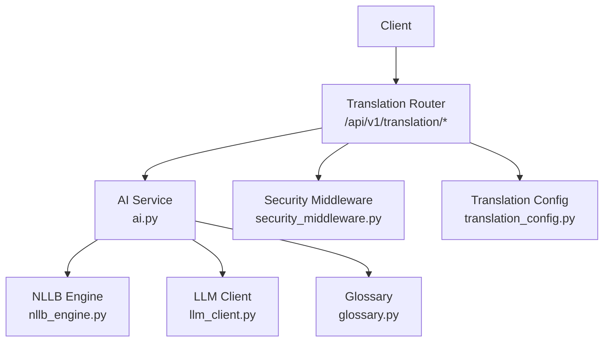
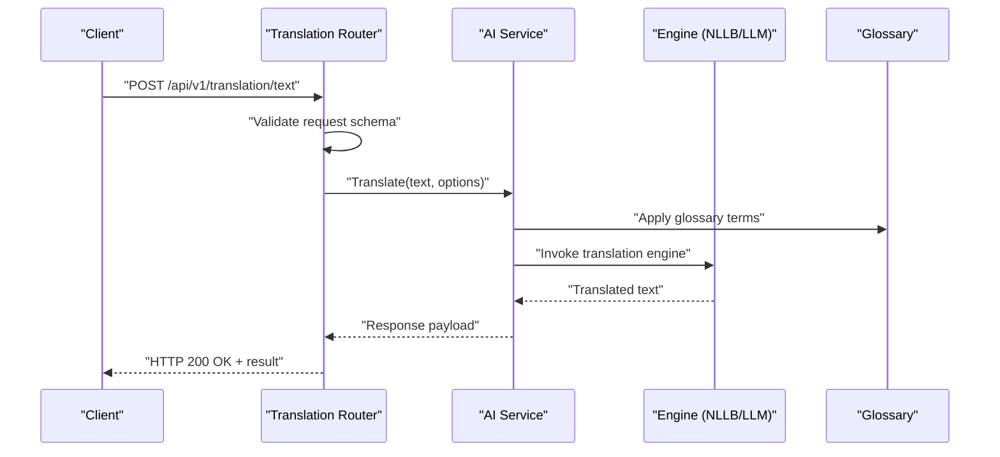
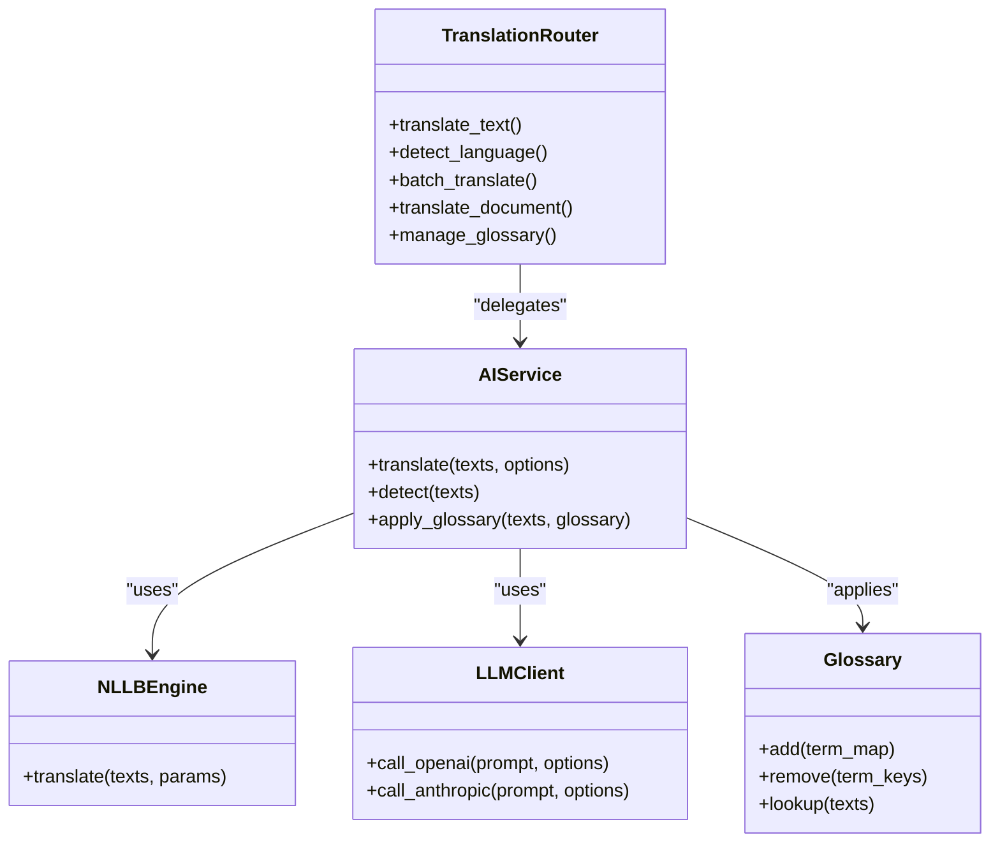
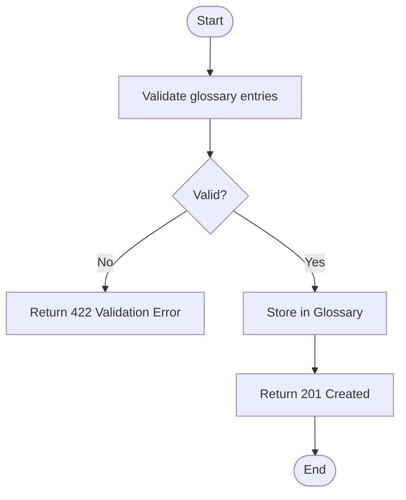
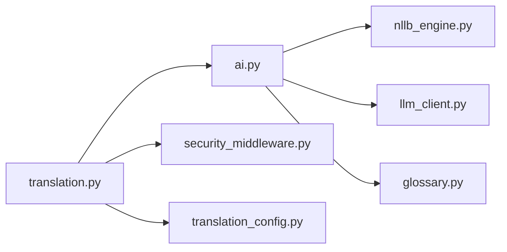

# Translation API

<cite>
**Referenced Files in This Document**
- [server.py](file://src/local_deepl/server.py)
- [translation.py](file://src/local_deepl/api/routers/translation.py)
- [requests.py](file://src/local_deepl/api/schemas/requests.py)
- [ai.py](file://src/local_deepl/api/services/ai.py)
- [nllb_engine.py](file://src/local_deepl/core/nllb_engine.py)
- [llm_client.py](file://src/local_deepl/core/llm_client.py)
- [glossary.py](file://src/local_deepl/core/glossary.py)
- [translation_config.py](file://src/local_deepl/core/translation_config.py)
- [security_middleware.py](file://src/local_deepl/api/services/security_middleware.py)
- [security_config.py](file://src/local_deepl/api/services/security_config.py)
</cite>

## Table of Contents
1. [Introduction](#introduction)
2. [Project Structure](#project-structure)
3. [Core Components](#core-components)
4. [Architecture Overview](#architecture-overview)
5. [Detailed Component Analysis](#detailed-component-analysis)
6. [Dependency Analysis](#dependency-analysis)
7. [Performance Considerations](#performance-considerations)
8. [Troubleshooting Guide](#troubleshooting-guide)
9. [Conclusion](#conclusion)

## Introduction
This document provides comprehensive API documentation for LocalDeepL’s translation endpoints. It covers text and document translation, language detection, batch translation, glossary integration, authentication requirements, request/response schemas, supported language pairs, quality options, entity preservation features, and performance optimization tips. The API is implemented as a FastAPI application with modular routers, Pydantic-based request/response schemas, and pluggable translation engines (local NLLB and LLM providers such as OpenAI and Anthropic).

## Project Structure
The translation API is organized under the FastAPI router layer and core engine/service modules:
- API Router: defines HTTP endpoints and request validation
- Schemas: Pydantic models for requests and responses
- Services: business logic, security middleware, and AI orchestration
- Core Engines: local NLLB and LLM clients
- Glossary: terminology management

**Diagram sources**
- [translation.py](file://src/local_deepl/api/routers/translation.py)
- [ai.py](file://src/local_deepl/api/services/ai.py)
- [nllb_engine.py](file://src/local_deepl/core/nllb_engine.py)
- [llm_client.py](file://src/local_deepl/core/llm_client.py)
- [glossary.py](file://src/local_deepl/core/glossary.py)
- [security_middleware.py](file://src/local_deepl/api/services/security_middleware.py)
- [translation_config.py](file://src/local_deepl/core/translation_config.py)

**Section sources**
- [server.py](file://src/local_deepl/server.py)
- [translation.py](file://src/local_deepl/api/routers/translation.py)

## Core Components
- Translation Router: Exposes REST endpoints for translation operations including text, documents, detection, and batch jobs.
- Request Schemas: Defines typed payloads for translation requests, including source/target languages, options, and metadata.
- AI Service: Orchestrates translation calls across engines and applies glossary and post-processing.
- NLLB Engine: Provides local neural machine translation using NLLB.
- LLM Client: Interfaces with external LLM providers (OpenAI, Anthropic) when configured.
- Glossary: Manages terminology mappings applied during translation.
- Security Middleware: Enforces authentication and access control on endpoints.
- Translation Config: Centralizes configuration for engines, quality settings, and feature flags.

**Section sources**
- [translation.py](file://src/local_deepl/api/routers/translation.py)
- [requests.py](file://src/local_deepl/api/schemas/requests.py)
- [ai.py](file://src/local_deepl/api/services/ai.py)
- [nllb_engine.py](file://src/local_deepl/core/nllb_engine.py)
- [llm_client.py](file://src/local_deepl/core/llm_client.py)
- [glossary.py](file://src/local_deepl/core/glossary.py)
- [security_middleware.py](file://src/local_deepl/api/services/security_middleware.py)
- [translation_config.py](file://src/local_deepl/core/translation_config.py)

## Architecture Overview
The translation API follows a layered architecture:
- HTTP Layer: FastAPI routers define endpoints and validate requests via Pydantic schemas.
- Service Layer: AI service coordinates translation workflows, integrates glossaries, and manages context.
- Engine Layer: Pluggable engines implement translation backends (NLLB locally; LLMs externally).
- Cross-Cutting Concerns: Security middleware enforces authentication; configuration centralizes runtime options.

**Diagram sources**
- [translation.py](file://src/local_deepl/api/routers/translation.py)
- [ai.py](file://src/local_deepl/api/services/ai.py)
- [nllb_engine.py](file://src/local_deepl/core/nllb_engine.py)
- [llm_client.py](file://src/local_deepl/core/llm_client.py)
- [glossary.py](file://src/local_deepl/core/glossary.py)

## Detailed Component Analysis

### Endpoints Reference
Base path: /api/v1/translation/

- Translate Text
  - Method: POST
  - Path: /api/v1/translation/text
  - Description: Translates one or more text segments between specified languages. Supports optional glossary and engine selection.
  - Authentication: Depends on server security configuration; see Security section.
  - Request Schema: See “Request Schemas” below.
  - Response Schema: See “Response Schemas” below.
  - Status Codes: 200 OK, 400 Bad Request, 401 Unauthorized, 403 Forbidden, 422 Validation Error, 500 Internal Server Error.

- Detect Language
  - Method: POST
  - Path: /api/v1/translation/detect
  - Description: Detects the source language(s) of provided text segments.
  - Authentication: Same as above.
  - Request Schema: See “Request Schemas”.
  - Response Schema: See “Response Schemas”.
  - Status Codes: 200 OK, 400 Bad Request, 401 Unauthorized, 403 Forbidden, 422 Validation Error, 500 Internal Server Error.

- Batch Translation
  - Method: POST
  - Path: /api/v1/translation/batch
  - Description: Submits multiple translation tasks asynchronously. Returns job identifiers for progress polling.
  - Authentication: Same as above.
  - Request Schema: See “Request Schemas”.
  - Response Schema: See “Response Schemas”.
  - Status Codes: 201 Created, 400 Bad Request, 401 Unauthorized, 403 Forbidden, 422 Validation Error, 500 Internal Server Error.

- Document Translation
  - Method: POST
  - Path: /api/v1/translation/document
  - Description: Translates uploaded documents (e.g., PDF, DOCX) while preserving structure and entities where supported.
  - Authentication: Same as above.
  - Request Schema: See “Request Schemas”.
  - Response Schema: See “Response Schemas”.
  - Status Codes: 200 OK, 201 Created (if async), 400 Bad Request, 401 Unauthorized, 403 Forbidden, 422 Validation Error, 500 Internal Server Error.

- Glossary Management
  - Method: POST
  - Path: /api/v1/translation/glossary/add
  - Description: Adds terminology entries to the active glossary.
  - Authentication: Same as above.
  - Request Schema: See “Request Schemas”.
  - Response Schema: See “Response Schemas”.
  - Status Codes: 201 Created, 400 Bad Request, 401 Unauthorized, 403 Forbidden, 422 Validation Error, 500 Internal Server Error.

  - Method: DELETE
  - Path: /api/v1/translation/glossary/remove
  - Description: Removes terminology entries from the active glossary.
  - Authentication: Same as above.
  - Request Schema: See “Request Schemas”.
  - Response Schema: See “Response Schemas”.
  - Status Codes: 204 No Content, 400 Bad Request, 401 Unauthorized, 403 Forbidden, 422 Validation Error, 500 Internal Server Error.

- Health and Configuration
  - Method: GET
  - Path: /api/v1/translation/health
  - Description: Returns service health and available engines.
  - Authentication: Optional depending on configuration.
  - Response Schema: See “Response Schemas”.
  - Status Codes: 200 OK, 500 Internal Server Error.

  - Method: GET
  - Path: /api/v1/translation/config
  - Description: Returns current translation configuration (engines, quality options, feature flags).
  - Authentication: Optional depending on configuration.
  - Response Schema: See “Response Schemas”.
  - Status Codes: 200 OK, 500 Internal Server Error.

**Section sources**
- [translation.py](file://src/local_deepl/api/routers/translation.py)
- [requests.py](file://src/local_deepl/api/schemas/requests.py)

### Request Schemas
Common fields used across translation endpoints are defined by Pydantic models. Typical fields include:
- texts: Array of strings representing input segments.
- source_language: ISO language code (e.g., en, es, de, fr, zh).
- target_language: ISO language code (e.g., en, es, de, fr, zh).
- options: Object containing:
  - engine: String selecting backend (e.g., nllb, openai, anthropic).
  - quality: String or numeric option controlling output fidelity.
  - preserve_entities: Boolean to retain named entities and formatting.
  - context: String or structured data providing prior context for coherence.
  - glossary_enabled: Boolean to enable glossary term enforcement.
  - max_tokens: Integer limiting generation length for LLM-backed engines.
  - temperature: Float controlling randomness for LLM-backed engines.
- files: For document translation, array of file references or multipart uploads.
- job_id: For batch operations, returned identifier for status polling.

Validation rules and exact field names are enforced by the request schemas.

**Section sources**
- [requests.py](file://src/local_deepl/api/schemas/requests.py)

### Response Schemas
Typical response structures include:
- translations: Array of translated strings aligned with input order.
- detected_languages: Array of detected source languages per segment.
- job_id: Identifier for asynchronous batch jobs.
- status: Operation status (e.g., success, pending, failed).
- errors: Array of error objects with message and code.
- metadata: Additional info such as token usage, latency, engine version.

Status codes indicate operation outcomes and errors.

**Section sources**
- [requests.py](file://src/local_deepl/api/schemas/requests.py)

### Authentication and Authorization
- Security Middleware: All endpoints can be protected by middleware that validates tokens or API keys.
- Configuration: Authentication behavior is controlled by security configuration.
- Typical Requirements:
  - Authorization header with bearer token or API key.
  - Role-based access may restrict certain endpoints (e.g., glossary management).

If authentication fails, endpoints return 401 Unauthorized or 403 Forbidden based on policy.

**Section sources**
- [security_middleware.py](file://src/local_deepl/api/services/security_middleware.py)
- [security_config.py](file://src/local_deepl/api/services/security_config.py)

### Supported Languages and Pairs
- Language Codes: Uses standard ISO codes (e.g., en, es, de, fr, zh, ja, ko, ru, ar).
- Pair Support: Determined by selected engine capabilities. Local NLLB supports many language pairs; LLM providers support broad coverage.
- Detection: Language detection endpoint returns confidence scores per segment.

For precise pair availability, consult the configuration endpoint or engine-specific documentation.

**Section sources**
- [translation.py](file://src/local_deepl/api/routers/translation.py)
- [ai.py](file://src/local_deepl/api/services/ai.py)

### Translation Engines and Configuration
- Local NLLB Engine:
  - Use engine: nllb
  - Characteristics: Fully local inference, privacy-preserving, suitable for high-volume batch processing.
  - Options: Quality tuning via model selection and parameters.

- LLM Providers:
  - Use engine: openai or anthropic
  - Characteristics: Cloud-based, flexible, supports advanced prompting and context handling.
  - Options: Temperature, max_tokens, system prompts, and provider-specific parameters.

Configuration is centralized and can be queried via the config endpoint.

**Diagram sources**
- [translation.py](file://src/local_deepl/api/routers/translation.py)
- [ai.py](file://src/local_deepl/api/services/ai.py)
- [nllb_engine.py](file://src/local_deepl/core/nllb_engine.py)
- [llm_client.py](file://src/local_deepl/core/llm_client.py)
- [glossary.py](file://src/local_deepl/core/glossary.py)

**Section sources**
- [ai.py](file://src/local_deepl/api/services/ai.py)
- [nllb_engine.py](file://src/local_deepl/core/nllb_engine.py)
- [llm_client.py](file://src/local_deepl/core/llm_client.py)
- [translation_config.py](file://src/local_deepl/core/translation_config.py)

### Context Preservation and Entity Handling
- Context: Provide prior paragraphs or structured context to improve coherence across segments.
- Entities: Enable entity preservation to keep names, numbers, and special tokens intact.
- Post-processing: Aligners and tree exporters maintain document structure and formatting.

These features are controlled via request options and internal services.

**Section sources**
- [ai.py](file://src/local_deepl/api/services/ai.py)
- [translation.py](file://src/local_deepl/core/translation.py)

### Glossary Integration
- Add Terms: Submit source-target term pairs to enforce consistent terminology.
- Remove Terms: Delete outdated or incorrect entries.
- Apply During Translation: Glossary lookup is integrated into the translation pipeline.

**Diagram sources**
- [glossary.py](file://src/local_deepl/core/glossary.py)
- [translation.py](file://src/local_deepl/api/routers/translation.py)

**Section sources**
- [glossary.py](file://src/local_deepl/core/glossary.py)
- [translation.py](file://src/local_deepl/api/routers/translation.py)

### Example Workflows

- Translate Text
  - Endpoint: POST /api/v1/translation/text
  - Payload: texts, source_language, target_language, options (engine, quality, preserve_entities, context, glossary_enabled)
  - Success: 200 OK with translations array
  - Errors: 400/401/403/422/500

- Detect Language
  - Endpoint: POST /api/v1/translation/detect
  - Payload: texts
  - Success: 200 OK with detected_languages and confidence scores
  - Errors: 400/401/403/422/500

- Batch Translation
  - Endpoint: POST /api/v1/translation/batch
  - Payload: jobs array with individual translation requests
  - Success: 201 Created with job_ids
  - Polling: Use job status endpoint if available
  - Errors: 400/401/403/422/500

- Document Translation
  - Endpoint: POST /api/v1/translation/document
  - Payload: files, source_language, target_language, options
  - Success: 200 OK or 201 Created (async) with download links or job_id
  - Errors: 400/401/403/422/500

- Manage Glossary
  - Endpoint: POST /api/v1/translation/glossary/add
  - Payload: term_map (source -> target)
  - Success: 201 Created
  - Endpoint: DELETE /api/v1/translation/glossary/remove
  - Payload: term_keys
  - Success: 204 No Content
  - Errors: 400/401/403/422/500

**Section sources**
- [translation.py](file://src/local_deepl/api/routers/translation.py)
- [requests.py](file://src/local_deepl/api/schemas/requests.py)

## Dependency Analysis
The translation API depends on:
- FastAPI routing and Pydantic validation
- AI service orchestration
- Pluggable engines (NLLB, LLM clients)
- Glossary store
- Security middleware and configuration

**Diagram sources**
- [translation.py](file://src/local_deepl/api/routers/translation.py)
- [ai.py](file://src/local_deepl/api/services/ai.py)
- [nllb_engine.py](file://src/local_deepl/core/nllb_engine.py)
- [llm_client.py](file://src/local_deepl/core/llm_client.py)
- [glossary.py](file://src/local_deepl/core/glossary.py)
- [security_middleware.py](file://src/local_deepl/api/services/security_middleware.py)
- [translation_config.py](file://src/local_deepl/core/translation_config.py)

**Section sources**
- [server.py](file://src/local_deepl/server.py)
- [translation.py](file://src/local_deepl/api/routers/translation.py)

## Performance Considerations
- Prefer local NLLB for high-throughput, low-latency scenarios without external dependencies.
- Use batch endpoints to reduce overhead and optimize throughput.
- Tune quality and max_tokens for LLM engines to balance speed and fidelity.
- Enable entity preservation only when necessary to avoid extra processing.
- Cache frequent glossary lookups and reuse contexts across related segments.
- Monitor health and configuration endpoints to ensure optimal engine selection.

[No sources needed since this section provides general guidance]

## Troubleshooting Guide
Common issues and resolutions:
- 401/403: Ensure correct authentication headers and permissions.
- 422: Validate request schema fields and types; check required arrays and enums.
- 500: Inspect engine logs and configuration; verify model availability and credentials.
- Slow Responses: Reduce batch size, adjust quality settings, or switch to local NLLB.
- Glossary Not Applied: Verify glossary_enabled flag and term validity.

**Section sources**
- [security_middleware.py](file://src/local_deepl/api/services/security_middleware.py)
- [ai.py](file://src/local_deepl/api/services/ai.py)

## Conclusion
LocalDeepL’s Translation API offers robust, configurable translation capabilities across text and documents, with strong support for local NLLB and cloud LLM engines. By leveraging glossaries, context preservation, and batch processing, teams can achieve high-quality, efficient translations tailored to their needs. Use the health and config endpoints to monitor and tune performance, and follow the troubleshooting guide to resolve common issues quickly.