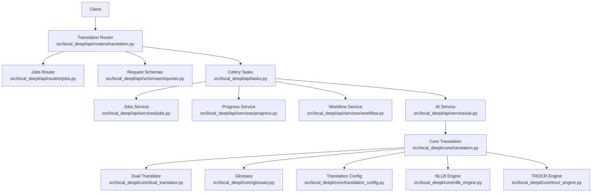
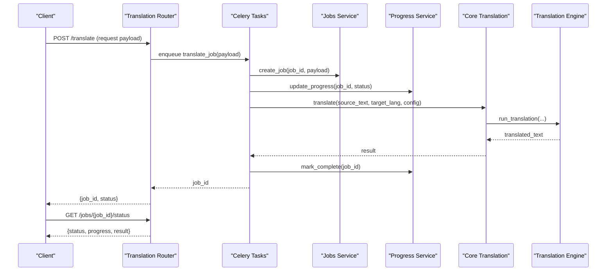
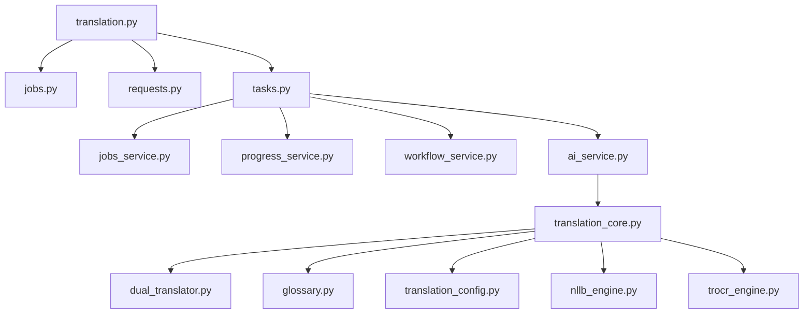

# Translation Endpoints

<cite>
**Referenced Files in This Document**
- [translation.py](file://src/local_deepl/api/routers/translation.py)
- [jobs.py](file://src/local_deepl/api/routers/jobs.py)
- [requests.py](file://src/local_deepl/api/schemas/requests.py)
- [tasks.py](file://src/local_deepl/api/tasks.py)
- [jobs_service.py](file://src/local_deepl/api/services/jobs.py)
- [progress_service.py](file://src/local_deepl/api/services/progress.py)
- [workflow_service.py](file://src/local_deepl/api/services/workflow.py)
- [ai_service.py](file://src/local_deepl/api/services/ai.py)
- [translation_core.py](file://src/local_deepl/core/translation.py)
- [dual_translator.py](file://src/local_deepl/core/dual_translator.py)
- [glossary.py](file://src/local_deepl/core/glossary.py)
- [translation_config.py](file://src/local_deepl/core/translation_config.py)
- [nllb_engine.py](file://src/local_deepl/core/nllb_engine.py)
- [trocr_engine.py](file://src/local_deepl/core/trocr_engine.py)
</cite>

## Table of Contents
1. [Introduction](#introduction)
2. [Project Structure](#project-structure)
3. [Core Components](#core-components)
4. [Architecture Overview](#architecture-overview)
5. [Detailed Component Analysis](#detailed-component-analysis)
6. [Dependency Analysis](#dependency-analysis)
7. [Performance Considerations](#performance-considerations)
8. [Troubleshooting Guide](#troubleshooting-guide)
9. [Conclusion](#conclusion)

## Introduction
This document provides comprehensive API documentation for LocalDeepL’s translation endpoints. It covers initiating translation jobs, managing translation workflows, and retrieving translated content. The guide includes request/response schemas for translation requests (source/target language specifications, glossary integration, quality settings), examples of batch translation requests, progress tracking responses, error handling for unsupported languages or service failures, fallback mechanisms, translation memory usage, and customization options for terminology management.

## Project Structure
LocalDeepL exposes translation functionality through FastAPI routers under the api module, with background job processing via Celery tasks and services that orchestrate translation engines, glossaries, and progress tracking. Core translation logic resides in the core module, including dual translation, glossary handling, configuration, and engine implementations.

**Diagram sources**
- [translation.py](file://src/local_deepl/api/routers/translation.py)
- [jobs.py](file://src/local_deepl/api/routers/jobs.py)
- [requests.py](file://src/local_deepl/api/schemas/requests.py)
- [tasks.py](file://src/local_deepl/api/tasks.py)
- [jobs_service.py](file://src/local_deepl/api/services/jobs.py)
- [progress_service.py](file://src/local_deepl/api/services/progress.py)
- [workflow_service.py](file://src/local_deepl/api/services/workflow.py)
- [ai_service.py](file://src/local_deepl/api/services/ai.py)
- [translation_core.py](file://src/local_deepl/core/translation.py)
- [dual_translator.py](file://src/local_deepl/core/dual_translator.py)
- [glossary.py](file://src/local_deepl/core/glossary.py)
- [translation_config.py](file://src/local_deepl/core/translation_config.py)
- [nllb_engine.py](file://src/local_deepl/core/nllb_engine.py)
- [trocr_engine.py](file://src/local_deepl/core/trocr_engine.py)

**Section sources**
- [translation.py](file://src/local_deepl/api/routers/translation.py)
- [jobs.py](file://src/local_deepl/api/routers/jobs.py)
- [requests.py](file://src/local_deepl/api/schemas/requests.py)
- [tasks.py](file://src/local_deepl/api/tasks.py)
- [jobs_service.py](file://src/local_deepl/api/services/jobs.py)
- [progress_service.py](file://src/local_deepl/api/services/progress.py)
- [workflow_service.py](file://src/local_deepl/api/services/workflow.py)
- [ai_service.py](file://src/local_deepl/api/services/ai.py)
- [translation_core.py](file://src/local_deepl/core/translation.py)
- [dual_translator.py](file://src/local_deepl/core/dual_translator.py)
- [glossary.py](file://src/local_deepl/core/glossary.py)
- [translation_config.py](file://src/local_deepl/core/translation_config.py)
- [nllb_engine.py](file://src/local_deepl/core/nllb_engine.py)
- [trocr_engine.py](file://src/local_deepl/core/trocr_engine.py)

## Core Components
- Translation Router: Exposes HTTP endpoints to initiate translation jobs, manage workflows, and retrieve results.
- Jobs Router: Provides endpoints for job lifecycle management and status retrieval.
- Request Schemas: Defines structured request payloads for translation operations, including source/target languages, glossary entries, and quality settings.
- Celery Tasks: Asynchronous workers that execute translation pipelines and update progress.
- Services: Orchestrate translation execution, progress tracking, workflow state, and AI integrations.
- Core Translation: Implements translation logic, dual translation strategies, glossary application, and configuration.
- Engines: Concrete translation backends (e.g., NLLB, TROCR) used by the core translator.

**Section sources**
- [translation.py](file://src/local_deepl/api/routers/translation.py)
- [jobs.py](file://src/local_deepl/api/routers/jobs.py)
- [requests.py](file://src/local_deepl/api/schemas/requests.py)
- [tasks.py](file://src/local_deepl/api/tasks.py)
- [jobs_service.py](file://src/local_deepl/api/services/jobs.py)
- [progress_service.py](file://src/local_deepl/api/services/progress.py)
- [workflow_service.py](file://src/local_deepl/api/services/workflow.py)
- [ai_service.py](file://src/local_deepl/api/services/ai.py)
- [translation_core.py](file://src/local_deepl/core/translation.py)
- [dual_translator.py](file://src/local_deepl/core/dual_translator.py)
- [glossary.py](file://src/local_deepl/core/glossary.py)
- [translation_config.py](file://src/local_deepl/core/translation_config.py)
- [nllb_engine.py](file://src/local_deepl/core/nllb_engine.py)
- [trocr_engine.py](file://src/local_deepl/core/trocr_engine.py)

## Architecture Overview
The translation API follows a layered architecture:
- API Layer: FastAPI routers handle HTTP requests and validate schemas.
- Task Layer: Celery tasks perform asynchronous translation work.
- Service Layer: Business logic orchestrates translation engines, glossaries, and progress updates.
- Core Layer: Translation algorithms, dual translation strategies, glossary application, and engine implementations.

**Diagram sources**
- [translation.py](file://src/local_deepl/api/routers/translation.py)
- [tasks.py](file://src/local_deepl/api/tasks.py)
- [jobs_service.py](file://src/local_deepl/api/services/jobs.py)
- [progress_service.py](file://src/local_deepl/api/services/progress.py)
- [translation_core.py](file://src/local_deepl/core/translation.py)
- [nllb_engine.py](file://src/local_deepl/core/nllb_engine.py)

## Detailed Component Analysis

### Translation Endpoints
- Initiate Translation Job:
  - Method: POST
  - Endpoint: /translate
  - Request Schema:
    - source_text: string
    - target_language: string
    - source_language: string (optional)
    - glossary_entries: array of {source_term, target_term}
    - quality_settings: object with fields like confidence_threshold, style
    - batch_items: array of translation items (for batch mode)
  - Response:
    - job_id: string
    - status: string
    - message: string
- Retrieve Job Status:
  - Method: GET
  - Endpoint: /jobs/{job_id}/status
  - Response:
    - job_id: string
    - status: string (pending, processing, completed, failed)
    - progress: number (0-100)
    - result: object (when completed)
- Batch Translation:
  - Method: POST
  - Endpoint: /translate/batch
  - Request Schema:
    - items: array of {source_text, target_language, glossary_entries, quality_settings}
  - Response:
    - job_id: string
    - total_items: number
    - status: string
- Cancel Job:
  - Method: DELETE
  - Endpoint: /jobs/{job_id}
  - Response:
    - status: string (cancelled)

**Section sources**
- [translation.py](file://src/local_deepl/api/routers/translation.py)
- [jobs.py](file://src/local_deepl/api/routers/jobs.py)
- [requests.py](file://src/local_deepl/api/schemas/requests.py)

### Request/Response Schemas
- Translation Request:
  - Fields:
    - source_text: string
    - target_language: string
    - source_language: string (optional)
    - glossary_entries: array of {source_term: string, target_term: string}
    - quality_settings: object with confidence_threshold (number), style (string)
    - batch_items: array of translation item objects
- Progress Response:
  - Fields:
    - job_id: string
    - status: string
    - progress: number
    - message: string (optional)
    - result: object (optional, when completed)
- Error Response:
  - Fields:
    - error_code: string
    - message: string
    - details: object (optional)

**Section sources**
- [requests.py](file://src/local_deepl/api/schemas/requests.py)

### Background Job Processing
- Celery Tasks:
  - translate_job: Executes translation pipeline asynchronously
  - update_progress: Updates job progress in storage
  - complete_job: Marks job as completed and stores result
- Jobs Service:
  - create_job: Initializes job metadata and state
  - get_job_status: Retrieves current job status
  - cancel_job: Cancels running job if possible
- Progress Service:
  - track_progress: Updates progress percentage and status
  - get_progress: Retrieves progress information

**Section sources**
- [tasks.py](file://src/local_deepl/api/tasks.py)
- [jobs_service.py](file://src/local_deepl/api/services/jobs.py)
- [progress_service.py](file://src/local_deepl/api/services/progress.py)

### Core Translation Logic
- Dual Translator:
  - Manages bidirectional translation between language pairs
  - Handles fallback mechanisms when primary engine fails
- Glossary Integration:
  - Applies terminology mappings before/after translation
  - Supports custom dictionaries for domain-specific terms
- Translation Configuration:
  - Quality thresholds, style preferences, and engine selection
  - Caching strategies for repeated translations
- Engine Implementations:
  - NLLB Engine: Neural machine translation using NLLB models
  - TROCR Engine: Text recognition and translation for OCR scenarios

**Section sources**
- [translation_core.py](file://src/local_deepl/core/translation.py)
- [dual_translator.py](file://src/local_deepl/core/dual_translator.py)
- [glossary.py](file://src/local_deepl/core/glossary.py)
- [translation_config.py](file://src/local_deepl/core/translation_config.py)
- [nllb_engine.py](file://src/local_deepl/core/nllb_engine.py)
- [trocr_engine.py](file://src/local_deepl/core/trocr_engine.py)

### Workflow Management
- Workflow Service:
  - Orchestrates multi-step translation processes
  - Manages dependencies between translation steps
  - Handles retry logic and error recovery
- State Management:
  - Tracks workflow state transitions
  - Persists intermediate results
  - Supports checkpointing for long-running workflows

**Section sources**
- [workflow_service.py](file://src/local_deepl/api/services/workflow.py)

### AI Integration
- AI Service:
  - Integrates with external AI services for enhanced translation
  - Provides fallback to local engines when AI services are unavailable
  - Manages API keys and rate limiting

**Section sources**
- [ai_service.py](file://src/local_deepl/api/services/ai.py)

## Dependency Analysis
The translation system has clear dependency relationships:
- Routers depend on services for business logic
- Services depend on core translation components
- Core components depend on specific translation engines
- Celery tasks coordinate between API layer and backend services

**Diagram sources**
- [translation.py](file://src/local_deepl/api/routers/translation.py)
- [jobs.py](file://src/local_deepl/api/routers/jobs.py)
- [requests.py](file://src/local_deepl/api/schemas/requests.py)
- [tasks.py](file://src/local_deepl/api/tasks.py)
- [jobs_service.py](file://src/local_deepl/api/services/jobs.py)
- [progress_service.py](file://src/local_deepl/api/services/progress.py)
- [workflow_service.py](file://src/local_deepl/api/services/workflow.py)
- [ai_service.py](file://src/local_deepl/api/services/ai.py)
- [translation_core.py](file://src/local_deepl/core/translation.py)
- [dual_translator.py](file://src/local_deepl/core/dual_translator.py)
- [glossary.py](file://src/local_deepl/core/glossary.py)
- [translation_config.py](file://src/local_deepl/core/translation_config.py)
- [nllb_engine.py](file://src/local_deepl/core/nllb_engine.py)
- [trocr_engine.py](file://src/local_deepl/core/trocr_engine.py)

**Section sources**
- [translation.py](file://src/local_deepl/api/routers/translation.py)
- [jobs.py](file://src/local_deepl/api/routers/jobs.py)
- [requests.py](file://src/local_deepl/api/schemas/requests.py)
- [tasks.py](file://src/local_deepl/api/tasks.py)
- [jobs_service.py](file://src/local_deepl/api/services/jobs.py)
- [progress_service.py](file://src/local_deepl/api/services/progress.py)
- [workflow_service.py](file://src/local_deepl/api/services/workflow.py)
- [ai_service.py](file://src/local_deepl/api/services/ai.py)
- [translation_core.py](file://src/local_deepl/core/translation.py)
- [dual_translator.py](file://src/local_deepl/core/dual_translator.py)
- [glossary.py](file://src/local_deepl/core/glossary.py)
- [translation_config.py](file://src/local_deepl/core/translation_config.py)
- [nllb_engine.py](file://src/local_deepl/core/nllb_engine.py)
- [trocr_engine.py](file://src/local_deepl/core/trocr_engine.py)

## Performance Considerations
- Asynchronous Processing: Use Celery tasks for non-blocking translation operations
- Caching: Implement translation memory caching for repeated content
- Batch Processing: Process multiple translations in single requests to reduce overhead
- Engine Selection: Choose appropriate translation engines based on content type
- Resource Management: Monitor memory usage for large documents and implement chunking

## Troubleshooting Guide
Common issues and solutions:
- Unsupported Languages:
  - Check supported language codes in request validation
  - Verify language pair compatibility in dual translator
- Service Failures:
  - Implement retry logic with exponential backoff
  - Provide fallback to alternative translation engines
- Memory Issues:
  - Process large documents in chunks
  - Implement streaming for very large files
- Glossary Conflicts:
  - Validate terminology mappings for conflicts
  - Provide conflict resolution strategies

Error response patterns:
- Validation errors: 400 Bad Request with detailed field errors
- Not found errors: 404 Not Found for invalid job IDs
- Service errors: 500 Internal Server Error with error codes
- Rate limiting: 429 Too Many Requests with retry-after headers

**Section sources**
- [requests.py](file://src/local_deepl/api/schemas/requests.py)
- [translation_core.py](file://src/local_deepl/core/translation.py)
- [dual_translator.py](file://src/local_deepl/core/dual_translator.py)

## Conclusion
LocalDeepL's translation API provides a comprehensive solution for automated translation with advanced features including glossary integration, quality settings, batch processing, and robust error handling. The modular architecture allows for easy extension with new translation engines and customization options. The asynchronous processing model ensures scalability while maintaining responsiveness for client applications.