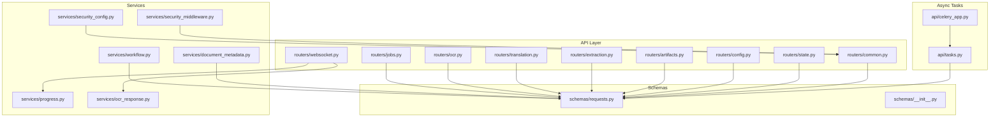
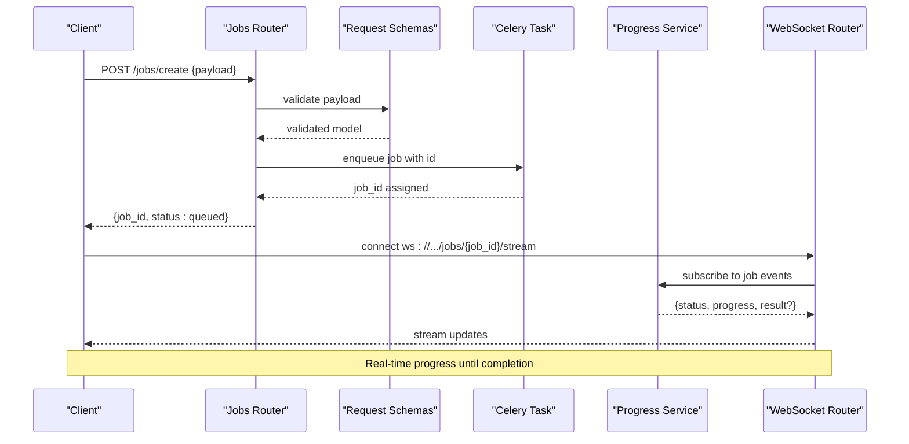
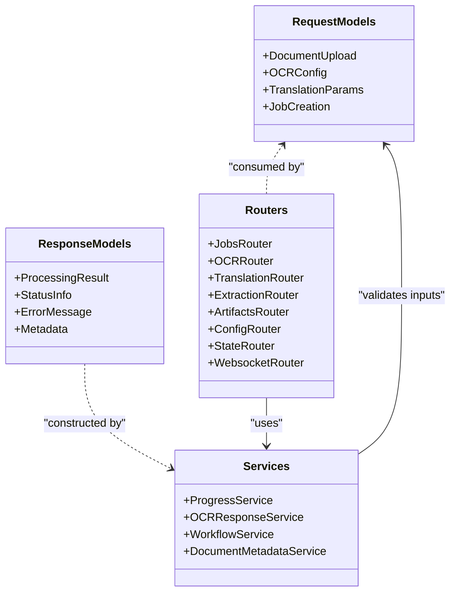

# Request & Response Schemas

<cite>
**Referenced Files in This Document**
- [requests.py](file://src/local_deepl/api/schemas/requests.py)
- [__init__.py](file://src/local_deepl/api/schemas/__init__.py)
- [jobs.py](file://src/local_deepl/api/routers/jobs.py)
- [ocr.py](file://src/local_deepl/api/routers/ocr.py)
- [translation.py](file://src/local_deepl/api/routers/translation.py)
- [extraction.py](file://src/local_deepl/api/routers/extraction.py)
- [artifacts.py](file://src/local_deepl/api/routers/artifacts.py)
- [config.py](file://src/local_deepl/api/routers/config.py)
- [state.py](file://src/local_deepl/api/routers/state.py)
- [websocket.py](file://src/local_deepl/api/routers/websocket.py)
- [common.py](file://src/local_deepl/api/routers/common.py)
- [tasks.py](file://src/local_deepl/api/tasks.py)
- [celery_app.py](file://src/local_deepl/api/celery_app.py)
- [progress.py](file://src/local_deepl/api/services/progress.py)
- [ocr_response.py](file://src/local_deepl/api/services/ocr_response.py)
- [workflow.py](file://src/local_deepl/api/services/workflow.py)
- [document_metadata.py](file://src/local_deepl/api/services/document_metadata.py)
- [security_config.py](file://src/local_deepl/api/services/security_config.py)
- [security_middleware.py](file://src/local_deepl/api/services/security_middleware.py)
</cite>

## Table of Contents
1. [Introduction](#introduction)
2. [Project Structure](#project-structure)
3. [Core Components](#core-components)
4. [Architecture Overview](#architecture-overview)
5. [Detailed Component Analysis](#detailed-component-analysis)
6. [Dependency Analysis](#dependency-analysis)
7. [Performance Considerations](#performance-considerations)
8. [Troubleshooting Guide](#troubleshooting-guide)
9. [Conclusion](#conclusion)
10. [Appendices](#appendices)

## Introduction
This document provides comprehensive data model documentation for LocalDeepL’s API request and response schemas. It focuses on Pydantic models, field definitions, data types, validation rules, constraints, and nested object structures used across endpoints for document uploads, OCR configuration, translation parameters, job creation, processing results, status information, error messages, and metadata. It also includes guidance on schema evolution patterns, backward compatibility considerations, and migration strategies.

## Project Structure
LocalDeepL organizes API schemas under a dedicated module with routers defining endpoints that consume and produce these schemas. The primary schema definitions are centralized in the requests module, while responses are often constructed inline or via service helpers. Routers expose endpoints for jobs, OCR, translation, extraction, artifacts, configuration, state, and WebSocket-based progress streaming.

**Diagram sources**
- [jobs.py](file://src/local_deepl/api/routers/jobs.py)
- [ocr.py](file://src/local_deepl/api/routers/ocr.py)
- [translation.py](file://src/local_deepl/api/routers/translation.py)
- [extraction.py](file://src/local_deepl/api/routers/extraction.py)
- [artifacts.py](file://src/local_deepl/api/routers/artifacts.py)
- [config.py](file://src/local_deepl/api/routers/config.py)
- [state.py](file://src/local_deepl/api/routers/state.py)
- [websocket.py](file://src/local_deepl/api/routers/websocket.py)
- [common.py](file://src/local_deepl/api/routers/common.py)
- [requests.py](file://src/local_deepl/api/schemas/requests.py)
- [__init__.py](file://src/local_deepl/api/schemas/__init__.py)
- [progress.py](file://src/local_deepl/api/services/progress.py)
- [ocr_response.py](file://src/local_deepl/api/services/ocr_response.py)
- [workflow.py](file://src/local_deepl/api/services/workflow.py)
- [document_metadata.py](file://src/local_deepl/api/services/document_metadata.py)
- [security_config.py](file://src/local_deepl/api/services/security_config.py)
- [security_middleware.py](file://src/local_deepl/api/services/security_middleware.py)
- [tasks.py](file://src/local_deepl/api/tasks.py)
- [celery_app.py](file://src/local_deepl/api/celery_app.py)

**Section sources**
- [requests.py](file://src/local_deepl/api/schemas/requests.py)
- [__init__.py](file://src/local_deepl/api/schemas/__init__.py)
- [jobs.py](file://src/local_deepl/api/routers/jobs.py)
- [ocr.py](file://src/local_deepl/api/routers/ocr.py)
- [translation.py](file://src/local_deepl/api/routers/translation.py)
- [extraction.py](file://src/local_deepl/api/routers/extraction.py)
- [artifacts.py](file://src/local_deepl/api/routers/artifacts.py)
- [config.py](file://src/local_deepl/api/routers/config.py)
- [state.py](file://src/local_deepl/api/routers/state.py)
- [websocket.py](file://src/local_deepl/api/routers/websocket.py)
- [common.py](file://src/local_deepl/api/routers/common.py)
- [tasks.py](file://src/local_deepl/api/tasks.py)
- [celery_app.py](file://src/local_deepl/api/celery_app.py)
- [progress.py](file://src/local_deepl/api/services/progress.py)
- [ocr_response.py](file://src/local_deepl/api/services/ocr_response.py)
- [workflow.py](file://src/local_deepl/api/services/workflow.py)
- [document_metadata.py](file://src/local_deepl/api/services/document_metadata.py)
- [security_config.py](file://src/local_deepl/api/services/security_config.py)
- [security_middleware.py](file://src/local_deepl/api/services/security_middleware.py)

## Core Components
The core data models for API payloads live in the schemas module. These include:
- Request models for document upload, OCR configuration, translation parameters, and job creation.
- Shared base models and enums for consistent validation across endpoints.
- Optional nested objects for advanced configurations (e.g., OCR settings, translation options).

Key responsibilities:
- Enforce required fields and constraints at the API boundary.
- Provide default values where appropriate to simplify client usage.
- Support extensibility through optional fields and nested structures.

Validation highlights:
- Type checks enforced by Pydantic.
- Enumerated values for controlled options (e.g., languages, modes).
- Length and format constraints for strings and identifiers.
- Nested object validation for complex payloads.

**Section sources**
- [requests.py](file://src/local_deepl/api/schemas/requests.py)
- [__init__.py](file://src/local_deepl/api/schemas/__init__.py)

## Architecture Overview
The API layer consumes request schemas and produces response payloads. Jobs are created via POST endpoints, processed asynchronously using Celery tasks, and progress is streamed via WebSocket events. OCR and translation workflows leverage shared services to build responses and manage metadata.

**Diagram sources**
- [jobs.py](file://src/local_deepl/api/routers/jobs.py)
- [requests.py](file://src/local_deepl/api/schemas/requests.py)
- [tasks.py](file://src/local_deepl/api/tasks.py)
- [celery_app.py](file://src/local_deepl/api/celery_app.py)
- [progress.py](file://src/local_deepl/api/services/progress.py)
- [websocket.py](file://src/local_deepl/api/routers/websocket.py)

## Detailed Component Analysis

### Request Models: Document Uploads
Document upload requests typically include:
- File identifier or binary content reference.
- Optional metadata such as filename, MIME type, and size hints.
- Flags to control preprocessing or output formats.

Validation rules:
- Required file reference fields.
- Optional metadata fields with defaults when omitted.
- Constraints on allowed MIME types and maximum sizes.

Example valid JSON payload structure:
- A top-level object containing a file reference and optional metadata fields.

Common validation errors:
- Missing required file reference.
- Unsupported MIME type.
- Exceeding maximum file size.

Backward compatibility:
- New optional fields should not break existing clients.
- Deprecation warnings can be added before removing fields.

**Section sources**
- [requests.py](file://src/local_deepl/api/schemas/requests.py)
- [artifacts.py](file://src/local_deepl/api/routers/artifacts.py)

### Request Models: OCR Configuration
OCR configuration requests define how OCR engines process input documents:
- Engine selection and mode flags.
- Language codes and dictionaries.
- Preprocessing options (e.g., deskew, denoise).
- Output preferences (e.g., text-only, structured blocks).

Validation rules:
- Enumerated engine/mode values.
- Language code format validation.
- Boolean flags for enabling/disabling features.
- Nested configuration objects for advanced options.

Example valid JSON payload structure:
- An object with engine-specific settings and global OCR options.

Common validation errors:
- Invalid engine or mode value.
- Malformed language code.
- Conflicting options within nested configuration.

Migration strategy:
- Introduce new engine options as optional fields.
- Maintain default behavior for legacy clients.

**Section sources**
- [requests.py](file://src/local_deepl/api/schemas/requests.py)
- [ocr.py](file://src/local_deepl/api/routers/ocr.py)
- [ocr_response.py](file://src/local_deepl/api/services/ocr_response.py)

### Request Models: Translation Parameters
Translation requests specify source/target languages and formatting:
- Source and target language codes.
- Formatting preferences (e.g., preserve layout, handle tables).
- Glossary or terminology overrides.
- Callback or webhook URLs for asynchronous processing.

Validation rules:
- Language code format validation.
- Allowed formatting options.
- Optional callback URL format validation.

Example valid JSON payload structure:
- An object with language codes and formatting options.

Common validation errors:
- Invalid language code.
- Unsupported formatting option.
- Malformed callback URL.

Backward compatibility:
- Add new formatting options as optional fields.
- Keep default formatting behavior unchanged.

**Section sources**
- [requests.py](file://src/local_deepl/api/schemas/requests.py)
- [translation.py](file://src/local_deepl/api/routers/translation.py)

### Request Models: Job Creation Requests
Job creation requests encapsulate all necessary parameters for processing:
- Input document reference.
- Processing pipeline configuration (OCR + translation).
- Output format and destination.
- Priority and timeout settings.

Validation rules:
- Required input reference.
- Valid pipeline configuration.
- Allowed output formats.
- Numeric constraints for priority and timeouts.

Example valid JSON payload structure:
- A composite object combining document, OCR, and translation settings.

Common validation errors:
- Missing input reference.
- Invalid pipeline configuration.
- Unsupported output format.

Migration strategy:
- Extend job configuration with optional fields.
- Use versioned endpoints if breaking changes are needed.

**Section sources**
- [requests.py](file://src/local_deepl/api/schemas/requests.py)
- [jobs.py](file://src/local_deepl/api/routers/jobs.py)
- [tasks.py](file://src/local_deepl/api/tasks.py)

### Response Models: Processing Results
Processing results include:
- Job status and progress indicators.
- Output artifacts (text, structured data, translations).
- Metadata about processing steps and timings.
- Error details if processing failed.

Validation rules:
- Status enum values.
- Optional artifact fields based on job type.
- Timestamps and duration fields.

Example valid JSON payload structure:
- A result object with status, artifacts, and metadata.

Common validation errors:
- Inconsistent status vs. artifact presence.
- Missing required metadata fields.

Backward compatibility:
- Add new artifact types as optional fields.
- Preserve existing artifact structures.

**Section sources**
- [ocr_response.py](file://src/local_deepl/api/services/ocr_response.py)
- [progress.py](file://src/local_deepl/api/services/progress.py)
- [workflow.py](file://src/local_deepl/api/services/workflow.py)

### Response Models: Status Information
Status responses provide real-time updates during processing:
- Current job state (queued, processing, completed, failed).
- Progress percentage or step indicators.
- Estimated time remaining.

Validation rules:
- Status enum values.
- Numeric progress bounds.
- Optional timing fields.

Example valid JSON payload structure:
- A status object with state and progress fields.

Common validation errors:
- Progress outside valid range.
- Inconsistent state transitions.

**Section sources**
- [progress.py](file://src/local_deepl/api/services/progress.py)
- [websocket.py](file://src/local_deepl/api/routers/websocket.py)

### Response Models: Error Messages
Error responses contain:
- Error code and message.
- Contextual details about the failure.
- Suggestions for resolution.

Validation rules:
- Standardized error code enumeration.
- Human-readable message string.
- Optional contextual data.

Example valid JSON payload structure:
- An error object with code, message, and context.

Common validation errors:
- Missing error code.
- Empty message field.

Backward compatibility:
- Add new error codes without breaking existing clients.
- Maintain message format consistency.

**Section sources**
- [common.py](file://src/local_deepl/api/routers/common.py)
- [security_config.py](file://src/local_deepl/api/services/security_config.py)
- [security_middleware.py](file://src/local_deepl/api/services/security_middleware.py)

### Response Models: Metadata
Metadata responses include:
- Job identifiers and timestamps.
- Input/output file references.
- Processing engine versions and configurations.

Validation rules:
- Identifier format validation.
- Timestamp format validation.
- Version string constraints.

Example valid JSON payload structure:
- A metadata object with identifiers and timestamps.

Common validation errors:
- Malformed timestamp.
- Invalid identifier format.

**Section sources**
- [document_metadata.py](file://src/local_deepl/api/services/document_metadata.py)
- [jobs.py](file://src/local_deepl/api/routers/jobs.py)

## Dependency Analysis
The schemas module depends on shared utilities and is consumed by multiple routers. Services construct response models based on processing outcomes. Async tasks coordinate job execution and update progress.

**Diagram sources**
- [requests.py](file://src/local_deepl/api/schemas/requests.py)
- [jobs.py](file://src/local_deepl/api/routers/jobs.py)
- [ocr.py](file://src/local_deepl/api/routers/ocr.py)
- [translation.py](file://src/local_deepl/api/routers/translation.py)
- [extraction.py](file://src/local_deepl/api/routers/extraction.py)
- [artifacts.py](file://src/local_deepl/api/routers/artifacts.py)
- [config.py](file://src/local_deepl/api/routers/config.py)
- [state.py](file://src/local_deepl/api/routers/state.py)
- [websocket.py](file://src/local_deepl/api/routers/websocket.py)
- [progress.py](file://src/local_deepl/api/services/progress.py)
- [ocr_response.py](file://src/local_deepl/api/services/ocr_response.py)
- [workflow.py](file://src/local_deepl/api/services/workflow.py)
- [document_metadata.py](file://src/local_deepl/api/services/document_metadata.py)

**Section sources**
- [requests.py](file://src/local_deepl/api/schemas/requests.py)
- [jobs.py](file://src/local_deepl/api/routers/jobs.py)
- [ocr.py](file://src/local_deepl/api/routers/ocr.py)
- [translation.py](file://src/local_deepl/api/routers/translation.py)
- [extraction.py](file://src/local_deepl/api/routers/extraction.py)
- [artifacts.py](file://src/local_deepl/api/routers/artifacts.py)
- [config.py](file://src/local_deepl/api/routers/config.py)
- [state.py](file://src/local_deepl/api/routers/state.py)
- [websocket.py](file://src/local_deepl/api/routers/websocket.py)
- [progress.py](file://src/local_deepl/api/services/progress.py)
- [ocr_response.py](file://src/local_deepl/api/services/ocr_response.py)
- [workflow.py](file://src/local_deepl/api/services/workflow.py)
- [document_metadata.py](file://src/local_deepl/api/services/document_metadata.py)

## Performance Considerations
- Validate payloads early to fail fast on invalid requests.
- Use streaming for large file uploads and progress updates.
- Cache frequently used configuration objects to reduce validation overhead.
- Implement pagination for large result sets.
- Optimize serialization/deserialization for high-throughput scenarios.

[No sources needed since this section provides general guidance]

## Troubleshooting Guide
Common issues and resolutions:
- Validation errors: Check field types, required fields, and enum values.
- Timeout errors: Adjust job priority and timeout settings.
- Memory errors: Reduce batch sizes and optimize preprocessing.
- Network errors: Retry logic and exponential backoff for external dependencies.

Debugging tips:
- Enable detailed logging for request/response payloads.
- Inspect WebSocket events for real-time progress.
- Use health check endpoints to verify service status.

**Section sources**
- [common.py](file://src/local_deepl/api/routers/common.py)
- [security_config.py](file://src/local_deepl/api/services/security_config.py)
- [security_middleware.py](file://src/local_deepl/api/services/security_middleware.py)

## Conclusion
LocalDeepL’s API schemas provide a robust foundation for document processing workflows. By leveraging Pydantic models for validation and maintaining backward compatibility, the system ensures reliable and extensible interactions between clients and services. Following the migration strategies outlined here will help evolve schemas safely while preserving existing integrations.

[No sources needed since this section summarizes without analyzing specific files]

## Appendices

### Schema Evolution Patterns
- Add new optional fields to maintain backward compatibility.
- Use versioned endpoints for breaking changes.
- Deprecate fields gradually with clear migration timelines.
- Maintain comprehensive test coverage for schema changes.

### Migration Strategies
- Implement dual-write support during transition periods.
- Provide migration scripts for client upgrades.
- Monitor deprecation warnings in production environments.
- Communicate changes through API documentation and release notes.

[No sources needed since this section provides general guidance]