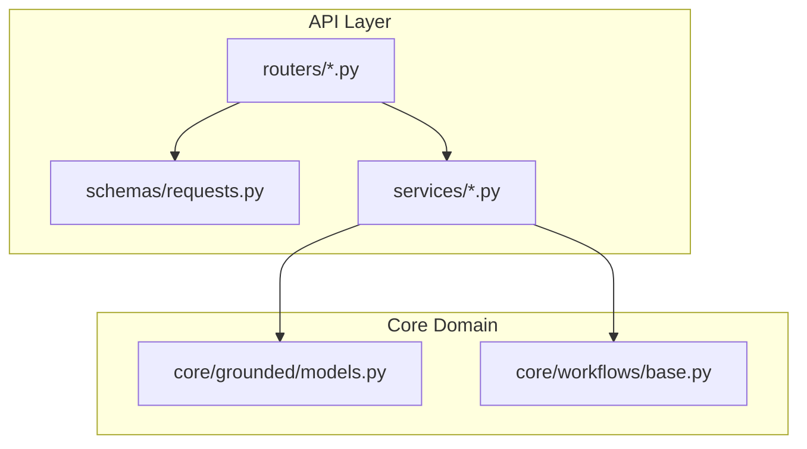
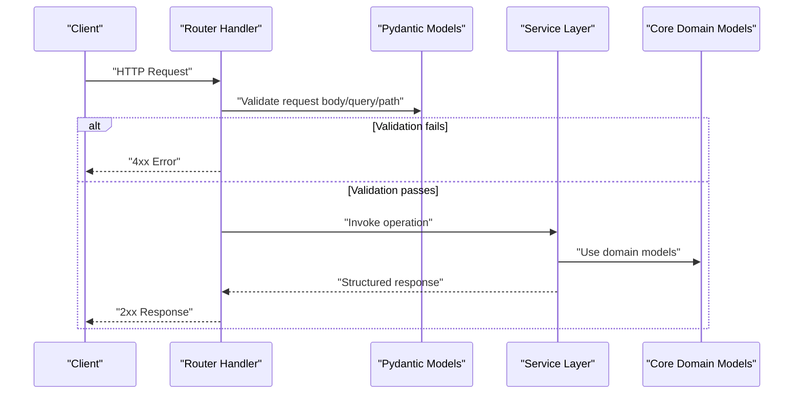
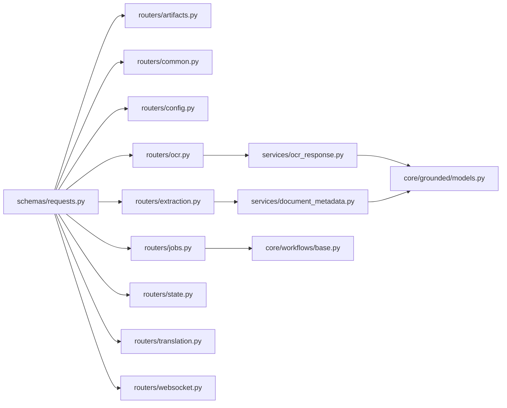

# Request & Response Schemas

<cite>
**Referenced Files in This Document**
- [src/local_deepl/api/schemas/requests.py](file://src/local_deepl/api/schemas/requests.py)
- [src/local_deepl/api/routers/artifacts.py](file://src/local_deepl/api/routers/artifacts.py)
- [src/local_deepl/api/routers/common.py](file://src/local_deepl/api/routers/common.py)
- [src/local_deepl/api/routers/config.py](file://src/local_deepl/api/routers/config.py)
- [src/local_deepl/api/routers/extraction.py](file://src/local_deepl/api/routers/extraction.py)
- [src/local_deepl/api/routers/jobs.py](file://src/local_deepl/api/routers/jobs.py)
- [src/local_deepl/api/routers/ocr.py](file://src/local_deepl/api/routers/ocr.py)
- [src/local_deepl/api/routers/state.py](file://src/local_deepl/api/routers/state.py)
- [src/local_deepl/api/routers/translation.py](file://src/local_deepl/api/routers/translation.py)
- [src/local_deepl/api/routers/websocket.py](file://src/local_deepl/api/routers/websocket.py)
- [src/local_deepl/api/services/ocr_response.py](file://src/local_deepl/api/services/ocr_response.py)
- [src/local_deepl/api/services/document_metadata.py](file://src/local_deepl/api/services/document_metadata.py)
- [src/local_deepl/core/grounded/models.py](file://src/local_deepl/core/grounded/models.py)
- [src/local_deepl/core/workflows/base.py](file://src/local_deepl/core/workflows/base.py)
</cite>

## Table of Contents
1. [Introduction](#introduction)
2. [Project Structure](#project-structure)
3. [Core Components](#core-components)
4. [Architecture Overview](#architecture-overview)
5. [Detailed Component Analysis](#detailed-component-analysis)
6. [Dependency Analysis](#dependency-analysis)
7. [Performance Considerations](#performance-considerations)
8. [Troubleshooting Guide](#troubleshooting-guide)
9. [Conclusion](#conclusion)
10. [Appendices](#appendices)

## Introduction
This document provides comprehensive schema documentation for LocalDeepL’s API data models. It focuses on Pydantic models, request/response structures, validation rules, and data type definitions used across the REST and WebSocket endpoints. The goal is to enable clients to understand field semantics, required/optional parameters, default values, constraints, enums, nested objects, and complex relationships. It also includes guidance on versioning strategies, backward compatibility, and migration practices for evolving schemas.

## Project Structure
LocalDeepL organizes API schemas primarily under the API layer:
- Centralized request schemas are defined in a dedicated module.
- Routers define endpoint contracts and may reference shared or domain-specific response models.
- Services encapsulate business logic and often return typed responses that align with Pydantic models.
- Core domain models (e.g., grounded outputs) live in core modules and can be reused by API layers.

[No sources needed since this diagram shows conceptual structure]

## Core Components
The following components form the backbone of LocalDeepL’s API schemas:
- Centralized request models: Shared input structures for multiple endpoints.
- Router-level models: Endpoint-specific requests/responses and status/error payloads.
- Service-level models: Business-oriented response shapes and intermediate data structures.
- Core domain models: Reusable entities such as grounded translation artifacts.

Key responsibilities:
- Define strict validation via Pydantic fields, types, and constraints.
- Provide clear separation between transport (HTTP/WebSocket) and domain models.
- Ensure consistent error and progress reporting across endpoints.

**Section sources**
- [src/local_deepl/api/schemas/requests.py](file://src/local_deepl/api/schemas/requests.py)
- [src/local_deepl/api/routers/artifacts.py](file://src/local_deepl/api/routers/artifacts.py)
- [src/local_deepl/api/routers/common.py](file://src/local_deepl/api/routers/common.py)
- [src/local_deepl/api/routers/config.py](file://src/local_deepl/api/routers/config.py)
- [src/local_deepl/api/routers/extraction.py](file://src/local_deepl/api/routers/extraction.py)
- [src/local_deepl/api/routers/jobs.py](file://src/local_deepl/api/routers/jobs.py)
- [src/local_deepl/api/routers/ocr.py](file://src/local_deepl/api/routers/ocr.py)
- [src/local_deepl/api/routers/state.py](file://src/local_deepl/api/routers/state.py)
- [src/local_deepl/api/routers/translation.py](file://src/local_deepl/api/routers/translation.py)
- [src/local_deepl/api/routers/websocket.py](file://src/local_deepl/api/routers/websocket.py)
- [src/local_deepl/api/services/ocr_response.py](file://src/local_deepl/api/services/ocr_response.py)
- [src/local_deepl/api/services/document_metadata.py](file://src/local_deepl/api/services/document_metadata.py)
- [src/local_deepl/core/grounded/models.py](file://src/local_deepl/core/grounded/models.py)
- [src/local_deepl/core/workflows/base.py](file://src/local_deepl/core/workflows/base.py)

## Architecture Overview
At runtime, client requests enter routers, which validate inputs against Pydantic models and delegate to services. Services orchestrate workflows and core domain models, then return structured responses. Progress and state updates may be emitted over HTTP or WebSockets.

[No sources needed since this diagram shows conceptual workflow]

## Detailed Component Analysis

### Centralized Request Schemas
Centralized request models provide reusable input structures consumed by multiple endpoints. Typical characteristics include:
- Field names and types aligned with JSON payloads.
- Optional vs required fields explicitly declared.
- Constraints such as length, format, or value ranges where applicable.
- Nested objects for grouped parameters.

Common patterns:
- Pagination and filtering parameters.
- File upload metadata (e.g., filename, content type).
- Feature flags and processing options.

Best practices:
- Prefer explicit defaults for optional fields.
- Use descriptive field aliases when necessary for backward compatibility.
- Keep models focused on transport concerns; avoid embedding business logic.

**Section sources**
- [src/local_deepl/api/schemas/requests.py](file://src/local_deepl/api/schemas/requests.py)

### Artifacts API
Endpoints related to artifacts manage creation, retrieval, and listing of generated assets. Expect:
- Request models for artifact operations (e.g., create, list, get).
- Response models describing artifact metadata and links.
- Status codes indicating success or failure.

Typical fields:
- Artifact identifiers and versions.
- Source references (e.g., job ID).
- Timestamps and ownership information.

**Section sources**
- [src/local_deepl/api/routers/artifacts.py](file://src/local_deepl/api/routers/artifacts.py)

### Common API Utilities
Shared utilities include:
- Standardized error response models.
- Common pagination wrappers.
- Health/status indicators.

These ensure consistent client experiences across endpoints.

**Section sources**
- [src/local_deepl/api/routers/common.py](file://src/local_deepl/api/routers/common.py)

### Configuration API
Configuration endpoints expose system settings and feature toggles. Expect:
- Read-only configuration models.
- Optional write endpoints guarded by authorization.
- Versioned configuration keys.

Validation considerations:
- Enumerated option sets.
- Type-safe numeric ranges.
- Secret masking in responses.

**Section sources**
- [src/local_deepl/api/routers/config.py](file://src/local_deepl/api/routers/config.py)

### Extraction API
Extraction endpoints handle document extraction tasks. Expect:
- Request models specifying target documents and extraction modes.
- Response models containing extracted content and metadata.
- Job IDs for asynchronous processing.

Processing flow:
- Validate inputs.
- Enqueue extraction job.
- Return job status or results depending on sync/async mode.

**Section sources**
- [src/local_deepl/api/routers/extraction.py](file://src/local_deepl/api/routers/extraction.py)

### Jobs API
Jobs API manages long-running operations. Expect:
- Job lifecycle states (e.g., pending, running, completed, failed).
- Progress tracking fields.
- Result references and error details.

Progress model:
- Percentage or step-based progress.
- Estimated completion time.
- Human-readable messages.

**Section sources**
- [src/local_deepl/api/routers/jobs.py](file://src/local_deepl/api/routers/jobs.py)

### OCR API
OCR endpoints process images and documents to extract text. Expect:
- Request models for image uploads and OCR options.
- Response models including recognized text, bounding boxes, and confidence scores.
- Integration with OCR service responses.

Response composition:
- Aggregated text blocks.
- Per-block metadata (confidence, language hints).
- Links to artifacts if applicable.

**Section sources**
- [src/local_deepl/api/routers/ocr.py](file://src/local_deepl/api/routers/ocr.py)
- [src/local_deepl/api/services/ocr_response.py](file://src/local_deepl/api/services/ocr_response.py)

### State API
State endpoints expose current application state and health. Expect:
- Lightweight status models.
- Feature availability flags.
- Version information.

**Section sources**
- [src/local_deepl/api/routers/state.py](file://src/local_deepl/api/routers/state.py)

### Translation API
Translation endpoints perform text translation using configured engines. Expect:
- Request models with source text, target languages, and options.
- Response models with translated text and metadata.
- Support for batch translations.

Options:
- Glossary usage flags.
- Style or tone preferences.
- Confidence thresholds.

**Section sources**
- [src/local_deepl/api/routers/translation.py](file://src/local_deepl/api/routers/translation.py)

### WebSocket API
WebSocket endpoints provide real-time updates for jobs and streaming responses. Expect:
- Message schemas for events (e.g., progress, result, error).
- Connection lifecycle handling.
- Backpressure and reconnection guidance.

Message types:
- Progress updates.
- Completion notifications.
- Error diagnostics.

**Section sources**
- [src/local_deepl/api/routers/websocket.py](file://src/local_deepl/api/routers/websocket.py)

### OCR Response Service
The OCR response service composes final OCR outputs from internal representations. Expect:
- Normalization of OCR blocks.
- Confidence scoring aggregation.
- Formatting for downstream consumers.

**Section sources**
- [src/local_deepl/api/services/ocr_response.py](file://src/local_deepl/api/services/ocr_response.py)

### Document Metadata Service
Document metadata service enriches responses with file and processing metadata. Expect:
- File size, MIME type, page counts.
- Processing timestamps.
- Source provenance.

**Section sources**
- [src/local_deepl/api/services/document_metadata.py](file://src/local_deepl/api/services/document_metadata.py)

### Grounded Models
Grounded models represent structured outputs from grounded translation workflows. Expect:
- Entities and spans.
- Alignment information.
- Confidence metrics.

Relationships:
- Link to original text segments.
- References to artifacts and jobs.

**Section sources**
- [src/local_deepl/core/grounded/models.py](file://src/local_deepl/core/grounded/models.py)

### Workflows Base
Workflows base defines common interfaces and state transitions for processing pipelines. Expect:
- Abstract steps and hooks.
- Context propagation.
- Error handling patterns.

**Section sources**
- [src/local_deepl/core/workflows/base.py](file://src/local_deepl/core/workflows/base.py)

## Dependency Analysis
The API layer depends on centralized request schemas and service-layer models. Core domain models are reused by services to compose responses. Routers orchestrate validation and delegation.

**Diagram sources**
- [src/local_deepl/api/schemas/requests.py](file://src/local_deepl/api/schemas/requests.py)
- [src/local_deepl/api/routers/artifacts.py](file://src/local_deepl/api/routers/artifacts.py)
- [src/local_deepl/api/routers/common.py](file://src/local_deepl/api/routers/common.py)
- [src/local_deepl/api/routers/config.py](file://src/local_deepl/api/routers/config.py)
- [src/local_deepl/api/routers/extraction.py](file://src/local_deepl/api/routers/extraction.py)
- [src/local_deepl/api/routers/jobs.py](file://src/local_deepl/api/routers/jobs.py)
- [src/local_deepl/api/routers/ocr.py](file://src/local_deepl/api/routers/ocr.py)
- [src/local_deepl/api/routers/state.py](file://src/local_deepl/api/routers/state.py)
- [src/local_deepl/api/routers/translation.py](file://src/local_deepl/api/routers/translation.py)
- [src/local_deepl/api/routers/websocket.py](file://src/local_deepl/api/routers/websocket.py)
- [src/local_deepl/api/services/ocr_response.py](file://src/local_deepl/api/services/ocr_response.py)
- [src/local_deepl/api/services/document_metadata.py](file://src/local_deepl/api/services/document_metadata.py)
- [src/local_deepl/core/grounded/models.py](file://src/local_deepl/core/grounded/models.py)
- [src/local_deepl/core/workflows/base.py](file://src/local_deepl/core/workflows/base.py)

**Section sources**
- [src/local_deepl/api/schemas/requests.py](file://src/local_deepl/api/schemas/requests.py)
- [src/local_deepl/api/routers/artifacts.py](file://src/local_deepl/api/routers/artifacts.py)
- [src/local_deepl/api/routers/common.py](file://src/local_deepl/api/routers/common.py)
- [src/local_deepl/api/routers/config.py](file://src/local_deepl/api/routers/config.py)
- [src/local_deepl/api/routers/extraction.py](file://src/local_deepl/api/routers/extraction.py)
- [src/local_deepl/api/routers/jobs.py](file://src/local_deepl/api/routers/jobs.py)
- [src/local_deepl/api/routers/ocr.py](file://src/local_deepl/api/routers/ocr.py)
- [src/local_deepl/api/routers/state.py](file://src/local_deepl/api/routers/state.py)
- [src/local_deepl/api/routers/translation.py](file://src/local_deepl/api/routers/translation.py)
- [src/local_deepl/api/routers/websocket.py](file://src/local_deepl/api/routers/websocket.py)
- [src/local_deepl/api/services/ocr_response.py](file://src/local_deepl/api/services/ocr_response.py)
- [src/local_deepl/api/services/document_metadata.py](file://src/local_deepl/api/services/document_metadata.py)
- [src/local_deepl/core/grounded/models.py](file://src/local_deepl/core/grounded/models.py)
- [src/local_deepl/core/workflows/base.py](file://src/local_deepl/core/workflows/base.py)

## Performance Considerations
- Prefer streaming responses for large OCR or translation outputs to reduce memory pressure.
- Use pagination for list endpoints to limit payload sizes.
- Cache frequently accessed configuration and metadata where appropriate.
- Avoid deep nesting in responses; flatten when possible for efficient parsing.
- Validate early and fail fast to minimize unnecessary processing.

[No sources needed since this section provides general guidance]

## Troubleshooting Guide
Common issues and resolutions:
- Validation errors: Check field types, required flags, and constraints in request models.
- Missing fields: Ensure all required parameters are provided; review defaults for optional fields.
- Unexpected nulls: Verify service-layer transformations and core model mappings.
- Progress not updating: Confirm WebSocket message schemas and router event emission.
- Inconsistent metadata: Inspect document metadata service for missing attributes.

Recommended debugging steps:
- Enable detailed logging at router and service boundaries.
- Compare incoming payloads against documented schemas.
- Inspect error response structures for diagnostic fields.

**Section sources**
- [src/local_deepl/api/routers/common.py](file://src/local_deepl/api/routers/common.py)
- [src/local_deepl/api/routers/websocket.py](file://src/local_deepl/api/routers/websocket.py)
- [src/local_deepl/api/services/document_metadata.py](file://src/local_deepl/api/services/document_metadata.py)

## Conclusion
LocalDeepL’s API schemas are organized around clear Pydantic models that enforce validation and provide consistent contracts across endpoints. By centralizing request schemas, leveraging service-layer models, and reusing core domain models, the system maintains clarity and extensibility. Adopting robust versioning and migration strategies will further enhance backward compatibility and client stability.

[No sources needed since this section summarizes without analyzing specific files]

## Appendices

### Versioning Strategy
- Semantic versioning for API surfaces.
- Deprecation headers and changelogs for breaking changes.
- Feature flags to gradually roll out new fields.

### Backward Compatibility Guidelines
- Additive changes only (new optional fields).
- Preserve existing field semantics and types.
- Maintain legacy endpoints during transition periods.

### Migration Guide
- Announce deprecations well in advance.
- Provide dual support for old and new schemas during migration windows.
- Offer automated tools or scripts to adapt client code.

[No sources needed since this section provides general guidance]