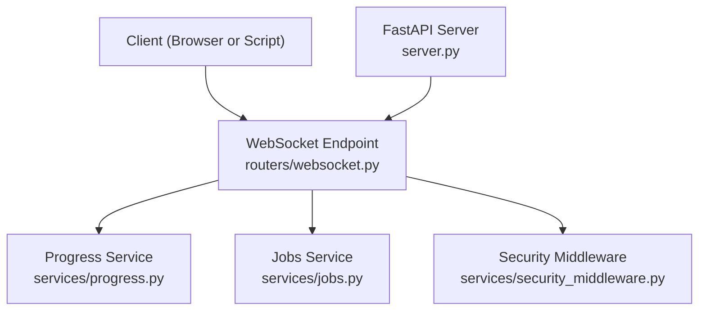
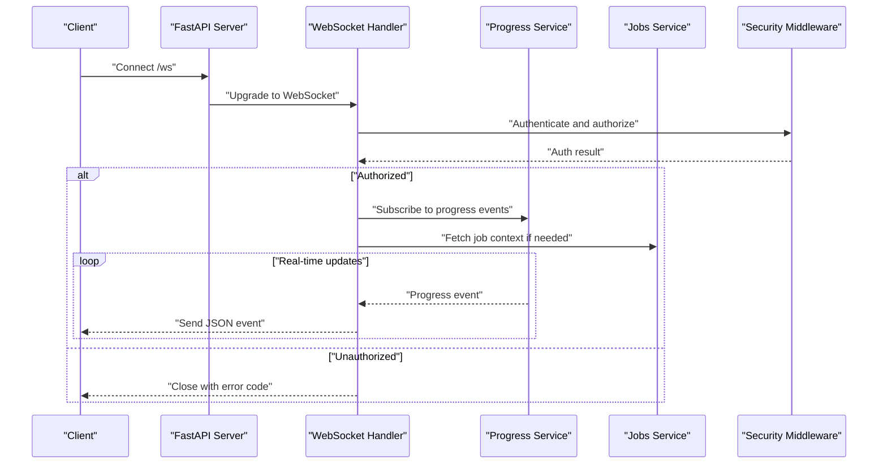
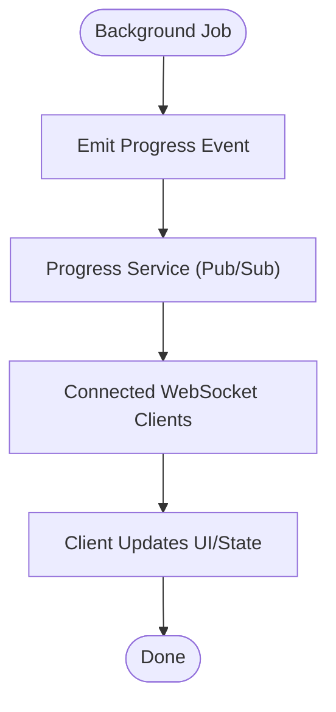
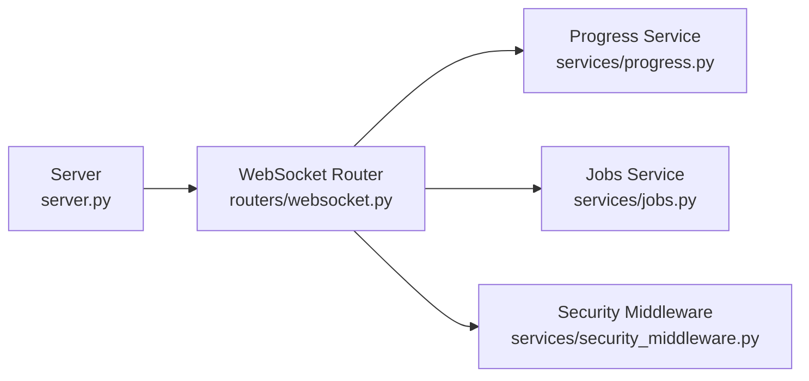

# WebSocket API

<cite>
**Referenced Files in This Document**
- [websocket.py](file://src/local_deepl/api/routers/websocket.py)
- [progress.py](file://src/local_deepl/api/services/progress.py)
- [jobs.py](file://src/local_deepl/api/services/jobs.py)
- [security_middleware.py](file://src/local_deepl/api/services/security_middleware.py)
- [server.py](file://src/local_deepl/server.py)
- [test_websocket_handler.py](file://tests/test_websocket_handler.py)
</cite>

## Table of Contents
1. [Introduction](#introduction)
2. [Project Structure](#project-structure)
3. [Core Components](#core-components)
4. [Architecture Overview](#architecture-overview)
5. [Detailed Component Analysis](#detailed-component-analysis)
6. [Dependency Analysis](#dependency-analysis)
7. [Performance Considerations](#performance-considerations)
8. [Troubleshooting Guide](#troubleshooting-guide)
9. [Conclusion](#conclusion)
10. [Appendices](#appendices)

## Introduction
This document describes the WebSocket-based real-time communication interface for LocalDeepL. It covers connection establishment, authentication handshake, message formats, event types, and protocol specifications. It also explains real-time progress updates, streaming responses, bidirectional communication patterns, and connection lifecycle management. Guidance is provided for client implementations in JavaScript and Python, along with event-driven architecture, message queuing, error handling strategies, and reconnection mechanisms. Security considerations, connection limits, and performance optimization techniques are included to help you build robust integrations.

## Project Structure
The WebSocket feature is implemented as an ASGI route within the FastAPI application. The router defines the WebSocket endpoint, while services handle progress tracking and job state. A security middleware enforces access control on connections. Tests validate handler behavior.

**Diagram sources**
- [websocket.py](file://src/local_deepl/api/routers/websocket.py)
- [progress.py](file://src/local_deepl/api/services/progress.py)
- [jobs.py](file://src/local_deepl/api/services/jobs.py)
- [security_middleware.py](file://src/local_deepl/api/services/security_middleware.py)
- [server.py](file://src/local_deepl/server.py)

**Section sources**
- [websocket.py](file://src/local_deepl/api/routers/websocket.py)
- [progress.py](file://src/local_deepl/api/services/progress.py)
- [jobs.py](file://src/local_deepl/api/services/jobs.py)
- [security_middleware.py](file://src/local_deepl/api/services/security_middleware.py)
- [server.py](file://src/local_deepl/server.py)

## Core Components
- WebSocket Router: Defines the WebSocket endpoint and manages the connection lifecycle, including authentication checks and dispatching messages.
- Progress Service: Publishes and streams progress events to connected clients.
- Jobs Service: Provides job-related state and metadata used by the WebSocket handler.
- Security Middleware: Validates credentials and permissions before allowing a WebSocket connection.
- Server: Registers the WebSocket route within the FastAPI application.

Key responsibilities:
- Connection acceptance and handshake
- Authentication and authorization
- Event publishing and subscription
- Error propagation and graceful disconnects

**Section sources**
- [websocket.py](file://src/local_deepl/api/routers/websocket.py)
- [progress.py](file://src/local_deepl/api/services/progress.py)
- [jobs.py](file://src/local_deepl/api/services/jobs.py)
- [security_middleware.py](file://src/local_deepl/api/services/security_middleware.py)
- [server.py](file://src/local_deepl/server.py)

## Architecture Overview
The WebSocket API follows an event-driven pattern where clients connect to a single endpoint, authenticate, and then subscribe to real-time updates. The server pushes progress and status events to all relevant subscribers.

**Diagram sources**
- [websocket.py](file://src/local_deepl/api/routers/websocket.py)
- [progress.py](file://src/local_deepl/api/services/progress.py)
- [jobs.py](file://src/local_deepl/api/services/jobs.py)
- [security_middleware.py](file://src/local_deepl/api/services/security_middleware.py)
- [server.py](file://src/local_deepl/server.py)

## Detailed Component Analysis

### WebSocket Router
Responsibilities:
- Accept WebSocket connections at the configured path
- Perform authentication via middleware
- Manage client subscriptions to progress events
- Send structured JSON messages for events and errors
- Handle disconnects and resource cleanup

Connection lifecycle:
- On connect: validate credentials, initialize session context
- On message: parse command, perform action, acknowledge
- On progress: forward events from the progress service
- On disconnect: unsubscribe and release resources

Error handling:
- Close with appropriate codes for auth failures
- Send error events for invalid commands or internal failures
- Ensure graceful shutdown on exceptions

**Section sources**
- [websocket.py](file://src/local_deepl/api/routers/websocket.py)

### Progress Service
Responsibilities:
- Maintain a publish/subscribe mechanism for progress events
- Emit typed events such as start, update, complete, and error
- Provide methods for clients to subscribe/unsubscribe safely

Event model:
- Events include a type field and payload with contextual data
- Payload may contain job identifiers, percentages, and status details

Concurrency:
- Thread-safe broadcasting to multiple subscribers
- Backpressure-aware delivery to avoid overwhelming clients

**Section sources**
- [progress.py](file://src/local_deepl/api/services/progress.py)

### Jobs Service
Responsibilities:
- Provide job metadata and current state
- Support queries required during WebSocket initialization
- Coordinate with background tasks that generate progress events

Integration points:
- Used by the WebSocket handler to resolve job context
- Supplies stable identifiers for correlating events across sessions

**Section sources**
- [jobs.py](file://src/local_deepl/api/services/jobs.py)

### Security Middleware
Responsibilities:
- Validate tokens or credentials presented during the WebSocket handshake
- Enforce role-based or scope-based access controls
- Return clear rejection signals when unauthorized

Security posture:
- Reject connections without valid credentials
- Limit exposure of sensitive information in error messages
- Integrate with existing authentication infrastructure

**Section sources**
- [security_middleware.py](file://src/local_deepl/api/services/security_middleware.py)

### Server Registration
Responsibilities:
- Register the WebSocket route within the FastAPI app
- Configure lifespan hooks if necessary
- Ensure consistent routing and middleware ordering

**Section sources**
- [server.py](file://src/local_deepl/server.py)

### Client Implementation Examples

#### JavaScript (Browser)
- Establish a WebSocket connection to the configured endpoint
- Authenticate using a token or credential passed in the initial handshake
- Subscribe to progress events and handle them in a callback
- Implement exponential backoff reconnection on disconnect
- Close the connection gracefully on page unload

Implementation guidance:
- Use a small queue to buffer outgoing messages if needed
- Parse incoming JSON events and map them to UI updates
- Log errors and surface user-friendly messages

[No sources needed since this section provides general implementation guidance]

#### Python (Asyncio)
- Connect using an async WebSocket client library
- Authenticate during connection setup
- Listen for events in a loop and process them asynchronously
- Reconnect with jittered backoff on transient failures
- Clean up resources on exit

Implementation guidance:
- Use a task per connection to avoid blocking
- Serialize event processing to maintain order
- Capture and report exceptions with context

[No sources needed since this section provides general implementation guidance]

### Protocol Specifications

#### Connection Establishment
- Endpoint: WebSocket URL under the FastAPI host
- Handshake: Include authentication credentials as defined by the security middleware
- Upgrade: Standard HTTP upgrade to WebSocket

#### Message Format
All messages are JSON objects with a top-level type field.

Common fields:
- type: string indicating the event or command category
- id: optional string for correlation across requests and events
- payload: object containing event-specific data

Command examples:
- subscribe: request to receive progress updates for a specific job
- unsubscribe: cancel subscription
- ping: keepalive probe; server responds with pong

Event examples:
- progress_update: includes percentage, stage, and status
- job_started: indicates initiation of a long-running operation
- job_completed: final status and result reference
- error: reports failure with a human-readable message

Delivery guarantees:
- Best-effort delivery; clients should implement reconnection and idempotent processing
- Events are ordered per subscriber

**Section sources**
- [websocket.py](file://src/local_deepl/api/routers/websocket.py)
- [progress.py](file://src/local_deepl/api/services/progress.py)

### Event-Driven Architecture
The system uses an event-driven model where background jobs emit progress events. The progress service fans out these events to all subscribed WebSocket clients. Clients react to events to update their UI or trigger downstream actions.

**Diagram sources**
- [progress.py](file://src/local_deepl/api/services/progress.py)
- [websocket.py](file://src/local_deepl/api/routers/websocket.py)

### Message Queuing and Ordering
- In-memory queues are used to fan out events to subscribers
- Messages are delivered in order per subscriber
- Backpressure is managed by dropping or buffering based on capacity policies

Operational notes:
- Monitor queue sizes to detect slow consumers
- Consider scaling horizontally by sharding jobs across processes

**Section sources**
- [progress.py](file://src/local_deepl/api/services/progress.py)

### Error Handling Strategies
- Authentication failures close the connection immediately
- Invalid commands return error events with descriptive messages
- Internal errors send error events and ensure clean disconnection
- Clients should treat transient network errors as recoverable and reconnect

**Section sources**
- [websocket.py](file://src/local_deepl/api/routers/websocket.py)
- [security_middleware.py](file://src/local_deepl/api/services/security_middleware.py)

### Reconnection Mechanisms
Recommended client behavior:
- Detect disconnects and attempt reconnection with exponential backoff and jitter
- Re-authenticate on each reconnect attempt
- Resubscribe to relevant events after successful reconnection
- Maintain a small in-memory buffer for missed events if supported by the server

**Section sources**
- [websocket.py](file://src/local_deepl/api/routers/websocket.py)

### Security Considerations
- Require strong authentication for WebSocket connections
- Validate scopes and roles before granting access
- Avoid leaking sensitive information in error messages
- Rate-limit connections and enforce maximum concurrent connections per user

**Section sources**
- [security_middleware.py](file://src/local_deepl/api/services/security_middleware.py)

### Connection Limits
- Enforce per-user and global connection caps
- Reject new connections when limits are reached
- Gracefully degrade by closing idle or least active connections under pressure

**Section sources**
- [websocket.py](file://src/local_deepl/api/routers/websocket.py)

### Performance Optimization Techniques
- Batch small events when possible to reduce overhead
- Use efficient serialization and minimal payloads
- Apply backpressure to prevent memory growth
- Scale horizontally by distributing jobs and subscribers across workers

**Section sources**
- [progress.py](file://src/local_deepl/api/services/progress.py)
- [websocket.py](file://src/local_deepl/api/routers/websocket.py)

## Dependency Analysis
The WebSocket router depends on the progress and jobs services and integrates with the security middleware. The server registers the route and wires middleware into the application pipeline.

**Diagram sources**
- [websocket.py](file://src/local_deepl/api/routers/websocket.py)
- [progress.py](file://src/local_deepl/api/services/progress.py)
- [jobs.py](file://src/local_deepl/api/services/jobs.py)
- [security_middleware.py](file://src/local_deepl/api/services/security_middleware.py)
- [server.py](file://src/local_deepl/server.py)

**Section sources**
- [websocket.py](file://src/local_deepl/api/routers/websocket.py)
- [progress.py](file://src/local_deepl/api/services/progress.py)
- [jobs.py](file://src/local_deepl/api/services/jobs.py)
- [security_middleware.py](file://src/local_deepl/api/services/security_middleware.py)
- [server.py](file://src/local_deepl/server.py)

## Performance Considerations
- Keep event payloads small and focused
- Avoid heavy computation in the event loop; offload to background tasks
- Monitor memory usage and adjust queue capacities
- Use connection pooling and reuse where applicable on the client side
- Profile latency and throughput under realistic workloads

[No sources needed since this section provides general guidance]

## Troubleshooting Guide
Common issues and resolutions:
- Authentication failures: verify credentials and scopes; check middleware logs
- No events received: confirm subscription commands and job IDs; inspect progress service
- Frequent disconnects: review network stability and reconnection logic; check server-side connection limits
- High memory usage: analyze queue sizes and event rates; tune backpressure settings

Validation aids:
- Use the test suite to simulate WebSocket interactions and verify expected behaviors

**Section sources**
- [test_websocket_handler.py](file://tests/test_websocket_handler.py)

## Conclusion
LocalDeepL’s WebSocket API provides a secure, event-driven interface for real-time progress updates and streaming responses. By following the protocol specifications, implementing robust reconnection logic, and adhering to security and performance best practices, clients can build responsive and reliable integrations.

[No sources needed since this section summarizes without analyzing specific files]

## Appendices

### Appendix A: Example Client Code Paths
- JavaScript example: see browser integration patterns and reconnection strategy
- Python example: see asyncio-based client with backoff and resubscription

[No sources needed since this section references general guidance]

### Appendix B: Test Coverage
- Unit tests cover handler behavior, event flow, and error conditions

**Section sources**
- [test_websocket_handler.py](file://tests/test_websocket_handler.py)