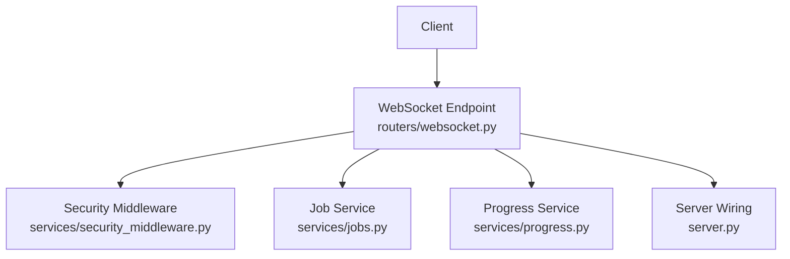
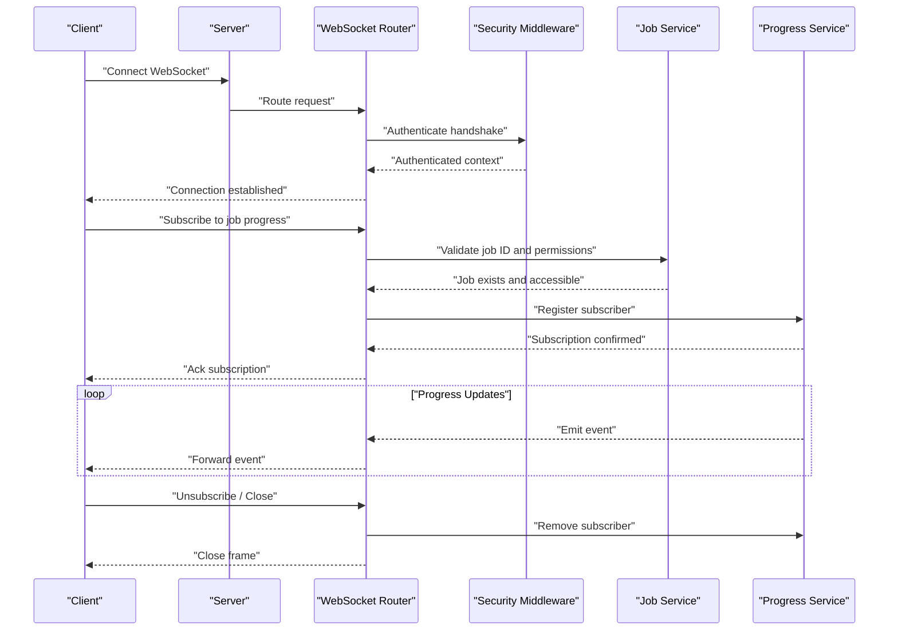
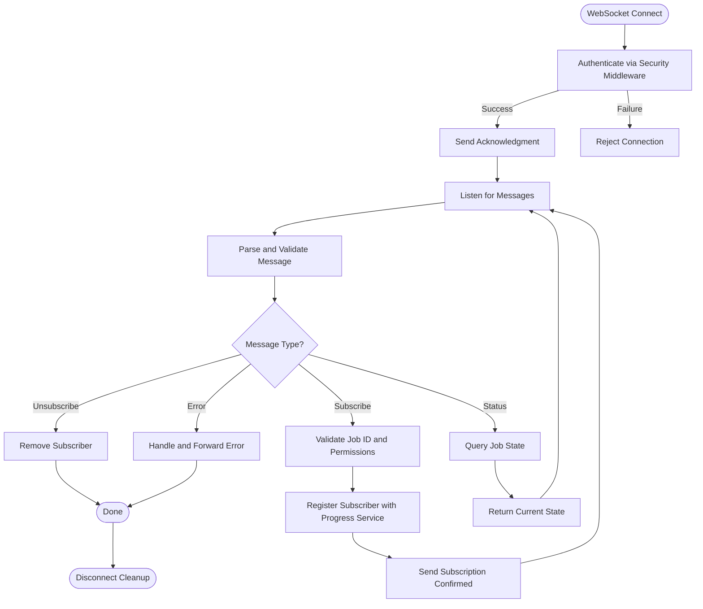
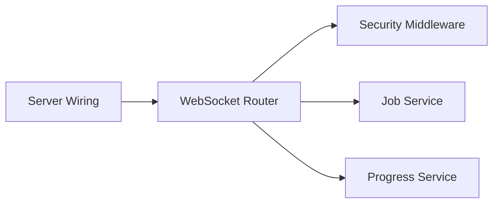

# WebSocket API

<cite>
**Referenced Files in This Document**
- [websocket.py](file://src/local_deepl/api/routers/websocket.py)
- [jobs.py](file://src/local_deepl/api/services/jobs.py)
- [progress.py](file://src/local_deepl/api/services/progress.py)
- [security_middleware.py](file://src/local_deepl/api/services/security_middleware.py)
- [server.py](file://src/local_deepl/server.py)
- [test_websocket_handler.py](file://tests/test_websocket_handler.py)
</cite>

## Table of Contents
1. [Introduction](#introduction)
2. [Project Structure](#project-structure)
3. [Core Components](#core-components)
4. [Architecture Overview](#architecture-overview)
5. [Detailed Component Analysis](#detailed-component-analysis)
6. [Dependency Analysis](#dependency-analysis)
7. [Performance Considerations](#performance-considerations)
8. [Troubleshooting Guide](#troubleshooting-guide)
9. [Conclusion](#conclusion)
10. [Appendices](#appendices)

## Introduction
This document describes LocalDeepL’s real-time communication interface over WebSocket. It explains how clients establish a connection, authenticate, subscribe to progress updates and job status events, handle errors, and manage the lifecycle of long-running operations. It also provides guidance on reconnection strategies, message serialization formats, debugging techniques, monitoring approaches, and performance considerations for robust client implementations.

## Project Structure
The WebSocket API is implemented as an ASGI-compatible endpoint that integrates with the application’s job management and progress services. The key files involved are:
- WebSocket router defining the endpoint and message handling
- Job service managing task lifecycle and state
- Progress service emitting structured progress events
- Security middleware enforcing authentication and authorization
- Server wiring that mounts the WebSocket route
- Tests validating behavior and edge cases

**Diagram sources**
- [websocket.py](file://src/local_deepl/api/routers/websocket.py)
- [security_middleware.py](file://src/local_deepl/api/services/security_middleware.py)
- [jobs.py](file://src/local_deepl/api/services/jobs.py)
- [progress.py](file://src/local_deepl/api/services/progress.py)
- [server.py](file://src/local_deepl/server.py)

**Section sources**
- [websocket.py](file://src/local_deepl/api/routers/websocket.py)
- [server.py](file://src/local_deepl/server.py)

## Core Components
- WebSocket Router: Defines the endpoint path, accepts connections, performs authentication, and routes messages to appropriate handlers.
- Job Service: Manages creation, execution, and lifecycle of jobs; exposes methods to query status and update state.
- Progress Service: Emits structured progress events (percent complete, stage names, timestamps) and supports subscriptions per job or session.
- Security Middleware: Validates tokens or credentials from the handshake, enforces permissions, and attaches user context to the connection scope.
- Server Wiring: Mounts the WebSocket route into the ASGI application and configures global settings like timeouts and limits.

Key responsibilities:
- Connection establishment and handshake
- Authentication and authorization
- Message parsing and validation
- Event emission and subscription management
- Error propagation and graceful degradation

**Section sources**
- [websocket.py](file://src/local_deepl/api/routers/websocket.py)
- [jobs.py](file://src/local_deepl/api/services/jobs.py)
- [progress.py](file://src/local_deepl/api/services/progress.py)
- [security_middleware.py](file://src/local_deepl/api/services/security_middleware.py)
- [server.py](file://src/local_deepl/server.py)

## Architecture Overview
The WebSocket architecture follows a clear separation of concerns:
- Clients connect via WebSocket to the server-mounted endpoint.
- The security middleware authenticates the connection using tokens or credentials provided during the handshake.
- Upon successful authentication, the router establishes a session-scoped channel for the client.
- Clients can subscribe to job-specific progress streams and receive periodic updates.
- Long-running operations emit structured events through the progress service, which fans out to subscribers.
- Errors are propagated as standardized error messages with actionable details.

**Diagram sources**
- [websocket.py](file://src/local_deepl/api/routers/websocket.py)
- [security_middleware.py](file://src/local_deepl/api/services/security_middleware.py)
- [jobs.py](file://src/local_deepl/api/services/jobs.py)
- [progress.py](file://src/local_deepl/api/services/progress.py)
- [server.py](file://src/local_deepl/server.py)

## Detailed Component Analysis

### WebSocket Router
Responsibilities:
- Accepts WebSocket connections at the configured endpoint path.
- Performs authentication using the security middleware before allowing any message processing.
- Parses incoming messages, validates schemas, and dispatches to handlers for subscribe/unsubscribe/status queries.
- Maintains per-connection state for active subscriptions and forwards events from the progress service.
- Handles disconnects by cleaning up subscriptions and releasing resources.

Message flow:
- On connect: validate token/credentials, attach user context, send initial handshake acknowledgment.
- Subscribe: parse job identifiers, verify permissions, register with progress service, confirm subscription.
- Unsubscribe: remove registration, stop forwarding events.
- Status queries: retrieve current job state and return immediately.
- Error handling: propagate standardized error payloads with codes and messages.

**Diagram sources**
- [websocket.py](file://src/local_deepl/api/routers/websocket.py)
- [security_middleware.py](file://src/local_deepl/api/services/security_middleware.py)
- [jobs.py](file://src/local_deepl/api/services/jobs.py)
- [progress.py](file://src/local_deepl/api/services/progress.py)

**Section sources**
- [websocket.py](file://src/local_deepl/api/routers/websocket.py)

### Job Service
Responsibilities:
- Creates and manages job lifecycles (pending, running, completed, failed).
- Provides methods to check job existence, permissions, and current status.
- Integrates with background tasks to execute long-running operations.
- Exposes state transitions and metadata required for progress reporting.

Integration points:
- Called by the WebSocket router to validate job IDs and permissions.
- Used by the progress service to correlate events with specific jobs.
- Supports querying final states for completion signals.

**Section sources**
- [jobs.py](file://src/local_deepl/api/services/jobs.py)

### Progress Service
Responsibilities:
- Emits structured progress events including percent complete, stage names, timestamps, and optional payload data.
- Manages subscriptions per job or session, ensuring efficient fan-out to connected clients.
- Guarantees ordering within a single stream and handles backpressure gracefully.
- Supports filtering by event types and stages if needed.

Event structure:
- Includes fields such as job identifier, event type, timestamp, progress percentage, stage name, and additional metadata.
- Standardized error events include error codes and human-readable messages.

**Section sources**
- [progress.py](file://src/local_deepl/api/services/progress.py)

### Security Middleware
Responsibilities:
- Authenticates WebSocket handshakes using tokens or credentials passed in headers or query parameters.
- Enforces authorization rules based on user roles and job ownership.
- Attaches authenticated user context to the connection scope for downstream use.
- Returns rejection responses for invalid or expired credentials.

Authentication flow:
- Extracts credentials from the handshake.
- Validates against configured providers or internal stores.
- Sets session-scoped identity and permissions.

**Section sources**
- [security_middleware.py](file://src/local_deepl/api/services/security_middleware.py)

### Server Wiring
Responsibilities:
- Mounts the WebSocket endpoint into the ASGI application.
- Configures global settings such as maximum connections, timeouts, and rate limits.
- Ensures consistent routing and middleware chain execution.

**Section sources**
- [server.py](file://src/local_deepl/server.py)

## Dependency Analysis
The WebSocket router depends on:
- Security middleware for authentication and authorization
- Job service for lifecycle and permission checks
- Progress service for event emission and subscription management
- Server wiring for mounting and configuration

**Diagram sources**
- [websocket.py](file://src/local_deepl/api/routers/websocket.py)
- [security_middleware.py](file://src/local_deepl/api/services/security_middleware.py)
- [jobs.py](file://src/local_deepl/api/services/jobs.py)
- [progress.py](file://src/local_deepl/api/services/progress.py)
- [server.py](file://src/local_deepl/server.py)

**Section sources**
- [websocket.py](file://src/local_deepl/api/routers/websocket.py)
- [jobs.py](file://src/local_deepl/api/services/jobs.py)
- [progress.py](file://src/local_deepl/api/services/progress.py)
- [security_middleware.py](file://src/local_deepl/api/services/security_middleware.py)
- [server.py](file://src/local_deepl/server.py)

## Performance Considerations
- Connection pooling and reuse: Implement persistent connections with keep-alive to reduce handshake overhead.
- Backpressure handling: Apply flow control to prevent memory growth when clients cannot consume events fast enough.
- Efficient serialization: Use compact JSON structures and avoid unnecessary fields to minimize bandwidth usage.
- Subscription scoping: Limit subscriptions to relevant jobs and stages to reduce event volume.
- Concurrency limits: Configure maximum concurrent connections and per-client message rates to protect server resources.
- Monitoring: Track metrics such as connection count, event throughput, latency, and error rates for observability.

[No sources needed since this section provides general guidance]

## Troubleshooting Guide
Common issues and resolutions:
- Authentication failures: Verify token validity, expiration, and permissions; ensure credentials are correctly transmitted in the handshake.
- Subscription errors: Confirm job IDs exist and are accessible; check role-based permissions and ownership constraints.
- Missing progress events: Ensure the job is actively running and the progress service is emitting events; verify client subscription registration.
- Disconnections: Implement reconnection with exponential backoff; handle transient network errors gracefully.
- High memory usage: Monitor subscription counts and event queues; implement cleanup on disconnect and enforce rate limits.

Debugging techniques:
- Log handshake attempts, authentication results, and subscription changes.
- Emit diagnostic events for connection lifecycle and error conditions.
- Use structured logging with correlation IDs to trace requests across components.

Monitoring approaches:
- Instrument metrics for connection uptime, event delivery success rates, and error frequencies.
- Set alerts for abnormal patterns such as sudden spikes in disconnections or failed authentications.

**Section sources**
- [test_websocket_handler.py](file://tests/test_websocket_handler.py)

## Conclusion
LocalDeepL’s WebSocket API provides a robust, secure, and scalable real-time communication interface for progress tracking and job status updates. By following the authentication, subscription, and error-handling patterns outlined here, clients can reliably integrate with long-running operations and deliver responsive user experiences. Adhering to performance best practices and implementing comprehensive monitoring ensures stable operation under varying loads.

[No sources needed since this section summarizes without analyzing specific files]

## Appendices

### Connection Establishment and Authentication
- Establish a WebSocket connection to the configured endpoint.
- Include authentication credentials in the handshake (token or credentials).
- Receive an acknowledgment upon successful authentication.
- Handle rejection responses with appropriate error codes and messages.

### Message Formats
- Subscribe message: includes job identifiers and desired event filters.
- Progress event: contains job ID, event type, timestamp, progress percentage, stage name, and optional payload.
- Status query: returns current job state and metadata.
- Error event: includes error code, message, and contextual details.

### Lifecycle Management
- Connect and authenticate.
- Subscribe to job progress streams.
- Process real-time events and update UI/state accordingly.
- Unsubscribe and close connections cleanly.
- Implement reconnection logic with backoff and jitter.

### Client Implementation Guidelines
- Use persistent connections and handle reconnects automatically.
- Validate all incoming messages and ignore unknown types.
- Implement backpressure handling to avoid overwhelming consumers.
- Log and monitor connection health and event delivery.
- Provide user feedback for errors and retries.

[No sources needed since this section provides general guidance]