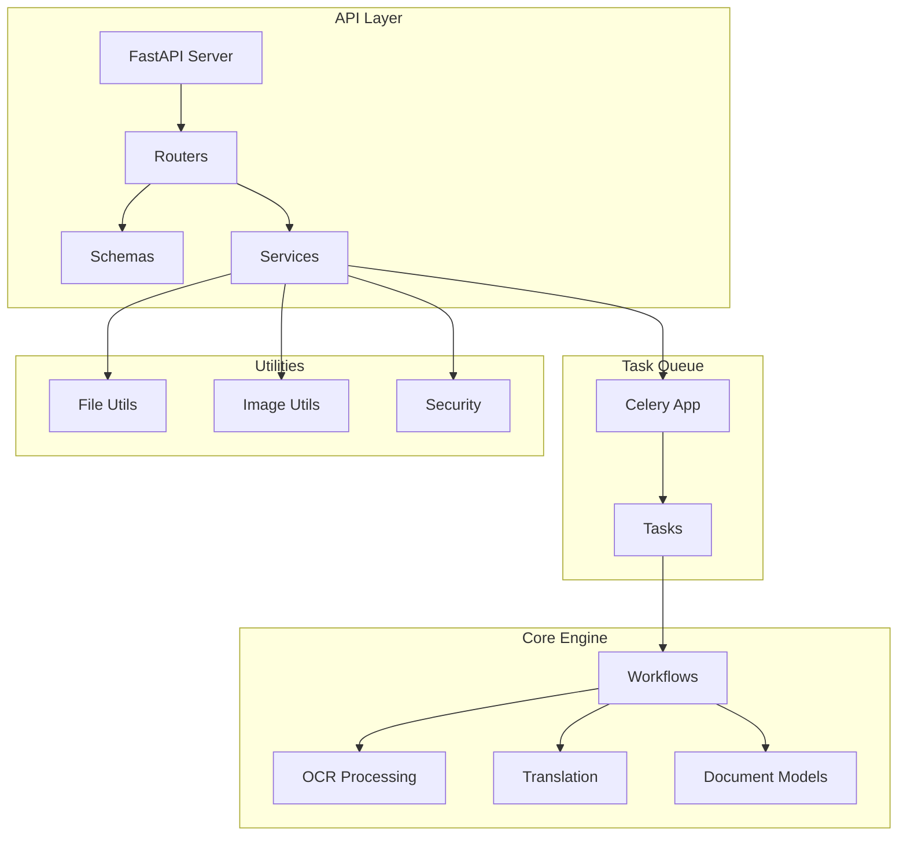
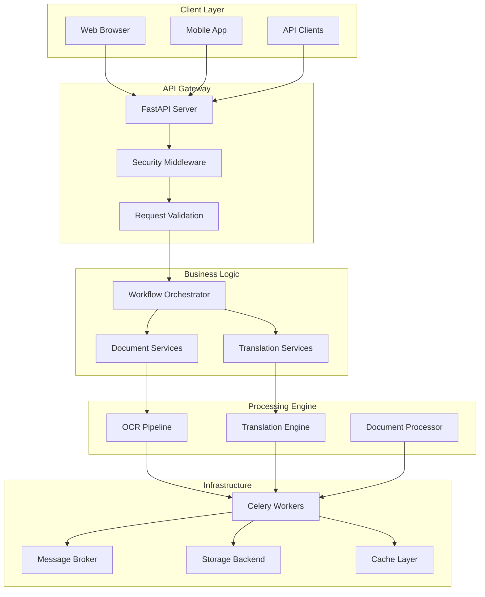
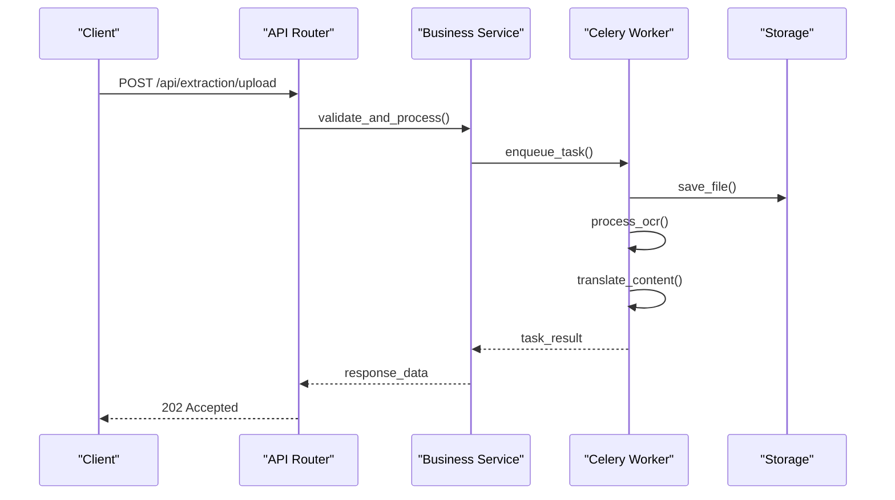
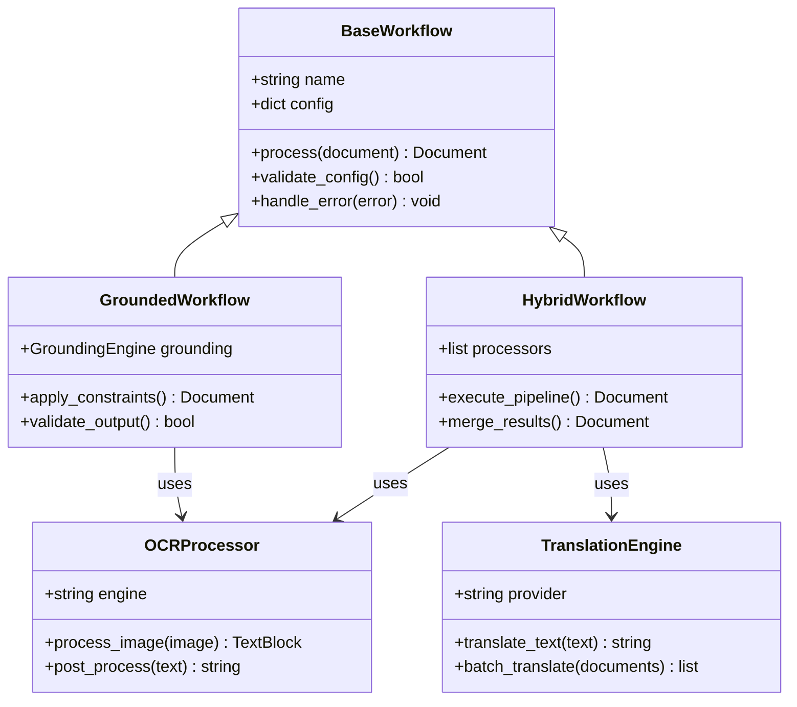
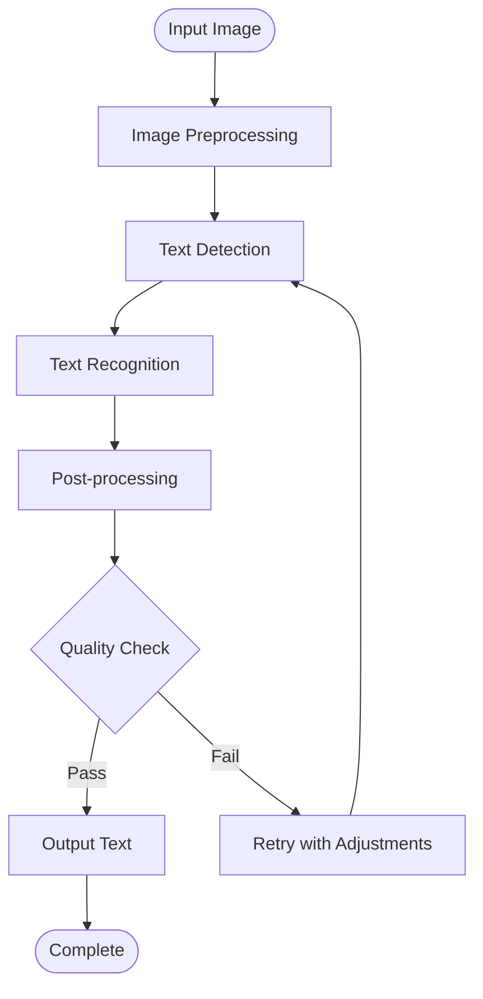
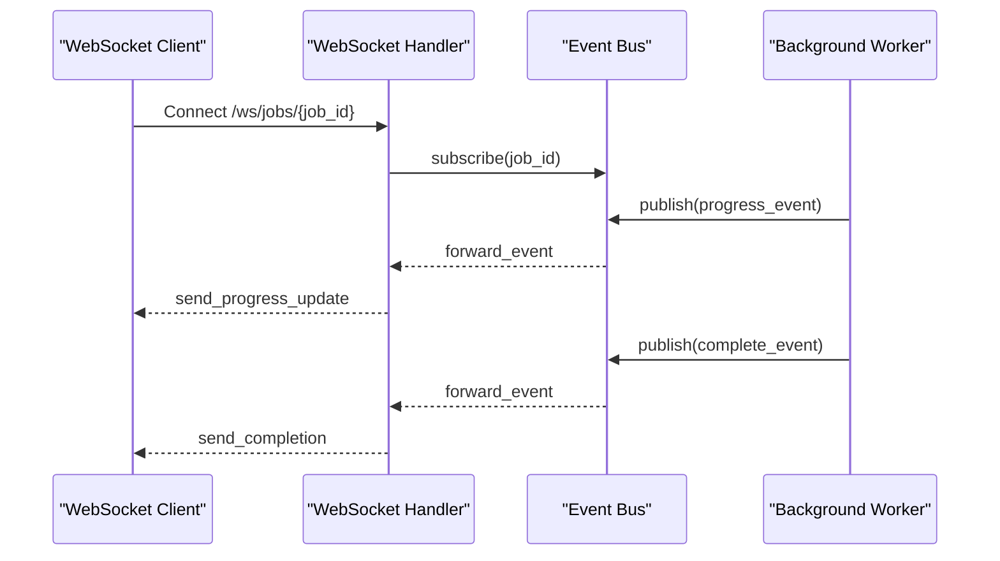
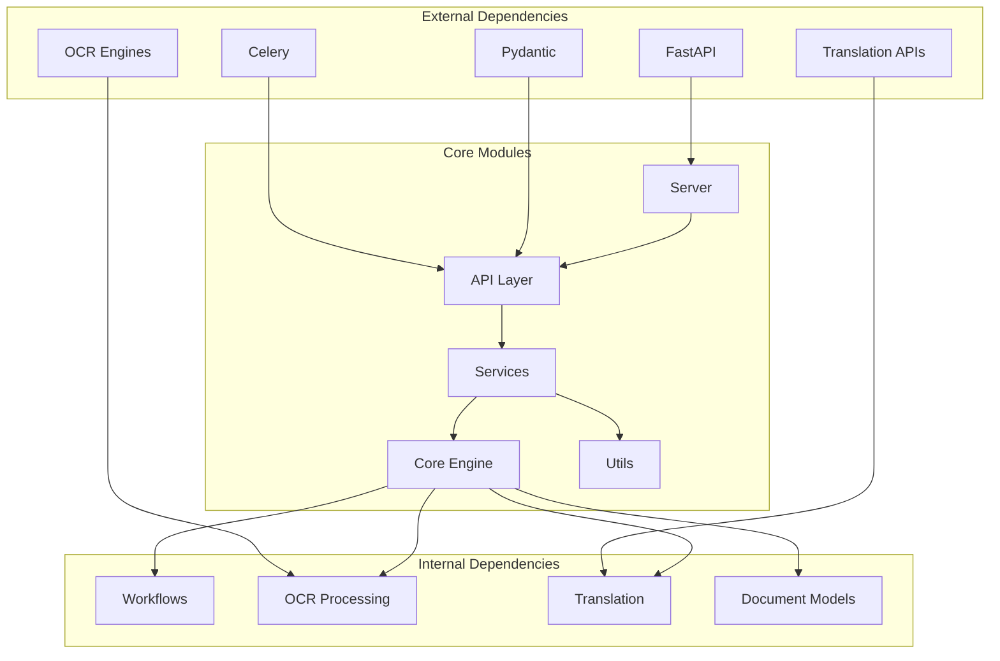

# Architecture Overview

<cite>
**Referenced Files in This Document**
- [server.py](file://src/local_deepl/server.py)
- [celery_app.py](file://src/local_deepl/api/celery_app.py)
- [tasks.py](file://src/local_deepl/api/tasks.py)
- [routers/extraction.py](file://src/local_deepl/api/routers/extraction.py)
- [routers/ocr.py](file://src/local_deepl/api/routers/ocr.py)
- [routers/translation.py](file://src/local_deepl/api/routers/translation.py)
- [routers/websocket.py](file://src/local_deepl/api/routers/websocket.py)
- [services/workflow.py](file://src/local_deepl/api/services/workflow.py)
- [services/security_middleware.py](file://src/local_deepl/api/services/security_middleware.py)
- [core/workflows/base.py](file://src/local_deepl/core/workflows/base.py)
- [core/workflows/hybrid.py](file://src/local_deepl/core/workflows/hybrid.py)
- [core/workflows/grounded.py](file://src/local_deepl/core/workflows/grounded.py)
- [core/ocr/processor.py](file://src/local_deepl/core/ocr/processor.py)
- [core/translation.py](file://src/local_deepl/core/translation.py)
- [pipeline.py](file://src/local_deepl/pipeline.py)
- [compose.yaml](file://compose.yaml)
- [Dockerfile](file://Dockerfile)
</cite>

## Table of Contents
1. [Introduction](#introduction)
2. [Project Structure](#project-structure)
3. [Core Components](#core-components)
4. [Architecture Overview](#architecture-overview)
5. [Detailed Component Analysis](#detailed-component-analysis)
6. [Dependency Analysis](#dependency-analysis)
7. [Performance Considerations](#performance-considerations)
8. [Troubleshooting Guide](#troubleshooting-guide)
9. [Conclusion](#conclusion)
10. [Appendices](#appendices)

## Introduction

LocalDeepL is a sophisticated document processing system that combines Optical Character Recognition (OCR), translation, and document manipulation capabilities through a modular, microservices-inspired architecture. The system leverages FastAPI for high-performance REST APIs, Celery for asynchronous task processing, and a flexible workflow engine to handle complex document processing pipelines.

The architecture emphasizes separation of concerns, scalability, and maintainability while providing both synchronous and asynchronous processing modes for different use cases. It supports multiple OCR engines, translation services, and export formats, making it a versatile solution for document automation workflows.

## Project Structure

The LocalDeepL codebase follows a well-organized modular architecture with clear separation between API layer, business logic, core processing engine, and utilities:

**Diagram sources**
- [server.py:1-50](file://src/local_deepl/server.py#L1-L50)
- [celery_app.py:1-30](file://src/local_deepl/api/celery_app.py#L1-L30)
- [workflow.py:1-40](file://src/local_deepl/api/services/workflow.py#L1-L40)

**Section sources**
- [server.py:1-100](file://src/local_deepl/server.py#L1-L100)
- [pyproject.toml:1-50](file://pyproject.toml#L1-L50)

## Core Components

### FastAPI Server Layer
The server layer provides RESTful APIs for document processing operations, including file uploads, OCR processing, translation, and export functionality. It implements middleware for security, logging, and request validation.

### Celery Task Queue Integration
Background job processing is handled by Celery workers, enabling asynchronous execution of long-running tasks like OCR processing and document transformation. The integration supports progress tracking and result caching.

### Modular Core Processing Engine
The core engine consists of modular components for OCR processing, translation, document manipulation, and workflow orchestration. Each component follows consistent interfaces and error handling patterns.

**Section sources**
- [server.py:1-150](file://src/local_deepl/server.py#L1-L150)
- [celery_app.py:1-80](file://src/local_deepl/api/celery_app.py#L1-L80)
- [workflow.py:1-120](file://src/local_deepl/api/services/workflow.py#L1-L120)

## Architecture Overview

The system follows a layered architecture pattern with clear separation between presentation, business logic, and data processing layers:

**Diagram sources**
- [server.py:1-100](file://src/local_deepl/server.py#L1-L100)
- [workflow.py:1-80](file://src/local_deepl/api/services/workflow.py#L1-L80)
- [celery_app.py:1-50](file://src/local_deepl/api/celery_app.py#L1-L50)

## Detailed Component Analysis

### API Routers and Request Handling

The API layer consists of specialized routers for different domains: extraction, OCR, translation, jobs management, and WebSocket communication. Each router handles specific HTTP endpoints with proper request/response schemas.

**Diagram sources**
- [extraction.py:1-100](file://src/local_deepl/api/routers/extraction.py#L1-L100)
- [workflow.py:1-150](file://src/local_deepl/api/services/workflow.py#L1-L150)
- [tasks.py:1-80](file://src/local_deepl/api/tasks.py#L1-L80)

### Workflow Orchestration System

The workflow engine provides a flexible pipeline for document processing with support for multiple processing stages, conditional branching, and error recovery:

**Diagram sources**
- [base.py:1-80](file://src/local_deepl/core/workflows/base.py#L1-L80)
- [hybrid.py:1-120](file://src/local_deepl/core/workflows/hybrid.py#L1-L120)
- [grounded.py:1-100](file://src/local_deepl/core/workflows/grounded.py#L1-L100)

### OCR Processing Pipeline

The OCR pipeline supports multiple engines and includes preprocessing, detection, recognition, and post-processing stages:

**Diagram sources**
- [processor.py:1-150](file://src/local_deepl/core/ocr/processor.py#L1-L150)
- [client.py:1-80](file://src/local_deepl/core/ocr/client.py#L1-L80)

### WebSocket Real-time Communication

WebSocket handlers provide real-time progress updates and event streaming for long-running operations:

**Diagram sources**
- [websocket.py:1-120](file://src/local_deepl/api/routers/websocket.py#L1-L120)

**Section sources**
- [extraction.py:1-200](file://src/local_deepl/api/routers/extraction.py#L1-L200)
- [ocr.py:1-150](file://src/local_deepl/api/routers/ocr.py#L1-L150)
- [translation.py:1-180](file://src/local_deepl/api/routers/translation.py#L1-L180)
- [workflow.py:1-200](file://src/local_deepl/api/services/workflow.py#L1-L200)

## Dependency Analysis

The system exhibits a well-structured dependency hierarchy with clear separation between layers:

**Diagram sources**
- [server.py:1-50](file://src/local_deepl/server.py#L1-L50)
- [pipeline.py:1-100](file://src/local_deepl/pipeline.py#L1-L100)
- [pyproject.toml:1-100](file://pyproject.toml#L1-L100)

**Section sources**
- [pyproject.toml:1-150](file://pyproject.toml#L1-L150)
- [pipeline.py:1-200](file://src/local_deepl/pipeline.py#L1-L200)

## Performance Considerations

### Scalability Architecture
The system is designed for horizontal scalability through Celery worker pools and stateless API servers. Key scalability features include:

- **Worker Pool Management**: Configurable number of Celery workers per task type
- **Load Balancing**: Multiple API server instances behind a reverse proxy
- **Caching Strategy**: Multi-level caching for OCR results and translations
- **Database Connection Pooling**: Efficient database connection management

### Memory and Resource Optimization
- **Lazy Loading**: Components are loaded on-demand to minimize memory footprint
- **Streaming Processing**: Large documents are processed in chunks
- **Resource Cleanup**: Automatic cleanup of temporary files and resources
- **Memory Monitoring**: Built-in monitoring for memory usage patterns

### Concurrency Patterns
- **Async/Await Support**: Non-blocking I/O operations where possible
- **Task Prioritization**: Priority queues for time-sensitive operations
- **Rate Limiting**: Protection against resource exhaustion
- **Circuit Breaker Pattern**: Graceful degradation when external services fail

## Troubleshooting Guide

### Common Issues and Solutions

#### Celery Worker Connectivity
- **Symptoms**: Tasks not executing, timeout errors
- **Solution**: Verify message broker connectivity and worker health
- **Monitoring**: Use Celery Flower dashboard for worker status

#### OCR Processing Failures
- **Symptoms**: Poor text recognition quality, timeouts
- **Solution**: Adjust image preprocessing parameters and retry logic
- **Debugging**: Enable detailed logging for OCR pipeline stages

#### Memory Exhaustion
- **Symptoms**: Process crashes, slow performance
- **Solution**: Implement chunked processing and garbage collection tuning
- **Monitoring**: Set up memory usage alerts and automatic restarts

#### API Rate Limiting
- **Symptoms**: 429 Too Many Requests errors
- **Solution**: Implement client-side retry logic with exponential backoff
- **Configuration**: Adjust rate limits based on deployment capacity

**Section sources**
- [security_middleware.py:1-100](file://src/local_deepl/api/services/security_middleware.py#L1-L100)
- [resilience.py:1-80](file://src/local_deepl/core/ocr/resilience.py#L1-L80)

## Conclusion

LocalDeepL demonstrates a robust, scalable architecture for document processing that effectively separates concerns across API, business logic, and processing layers. The system's modular design enables easy extension and maintenance while providing high performance through asynchronous processing and efficient resource utilization.

Key architectural strengths include:
- **Modular Design**: Clear separation between components facilitates independent development and testing
- **Scalability**: Horizontal scaling through Celery workers and stateless API servers
- **Resilience**: Comprehensive error handling and retry mechanisms
- **Flexibility**: Pluggable architecture supporting multiple OCR engines and translation providers

The system is well-suited for production deployment with proper infrastructure setup and monitoring. Future enhancements could include additional OCR engines, improved caching strategies, and enhanced monitoring capabilities.

## Appendices

### Infrastructure Requirements

#### Minimum Hardware Requirements
- **CPU**: 4+ cores for API server, additional cores per Celery worker
- **RAM**: 8GB minimum, 16GB+ recommended for large document processing
- **Storage**: SSD storage for optimal I/O performance
- **Network**: High-bandwidth network for large file transfers

#### Software Dependencies
- **Python**: 3.9+ with required packages from pyproject.toml
- **Message Broker**: Redis or RabbitMQ for Celery backend
- **Database**: PostgreSQL or SQLite for metadata storage
- **Cache**: Redis for session and result caching

### Deployment Topology Options

#### Single-Node Deployment
Suitable for development and small-scale production:
- All components on single machine
- Shared filesystem for artifacts
- Limited scalability but simple management

#### Distributed Deployment
Production-ready architecture:
- Separate containers for API, workers, and services
- Load balancer for API servers
- Centralized message broker and cache
- Persistent storage for artifacts

#### Cloud-Native Deployment
Containerized deployment with orchestration:
- Kubernetes pods for each service type
- Auto-scaling based on workload
- Service mesh for inter-service communication
- Centralized logging and monitoring

**Section sources**
- [compose.yaml:1-100](file://compose.yaml#L1-L100)
- [Dockerfile:1-80](file://Dockerfile#L1-L80)