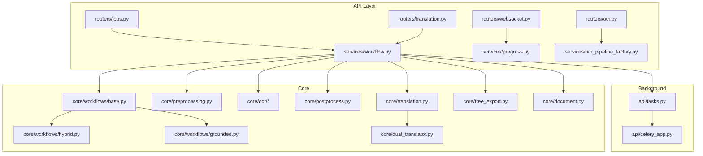
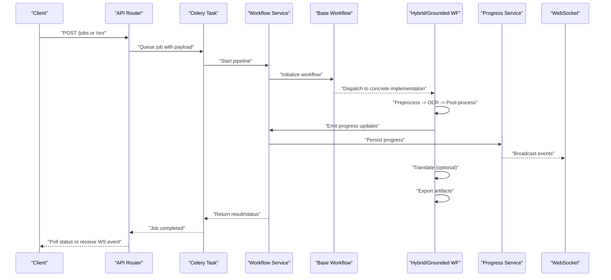
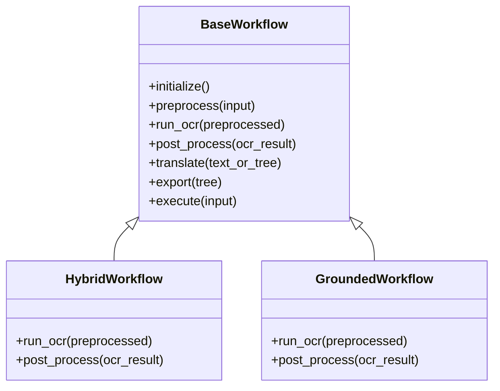
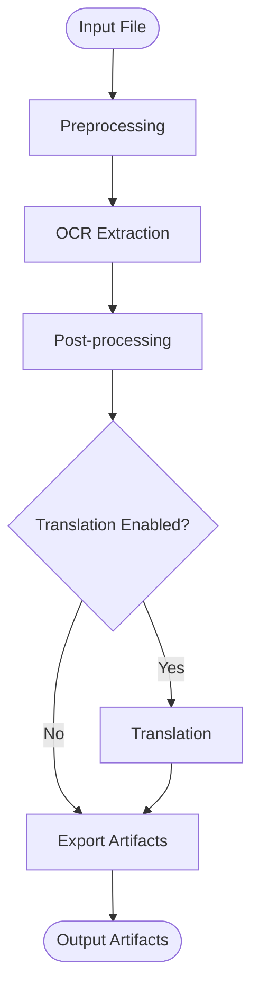
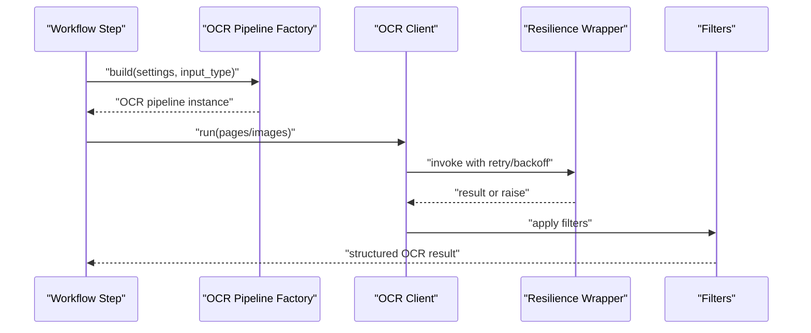
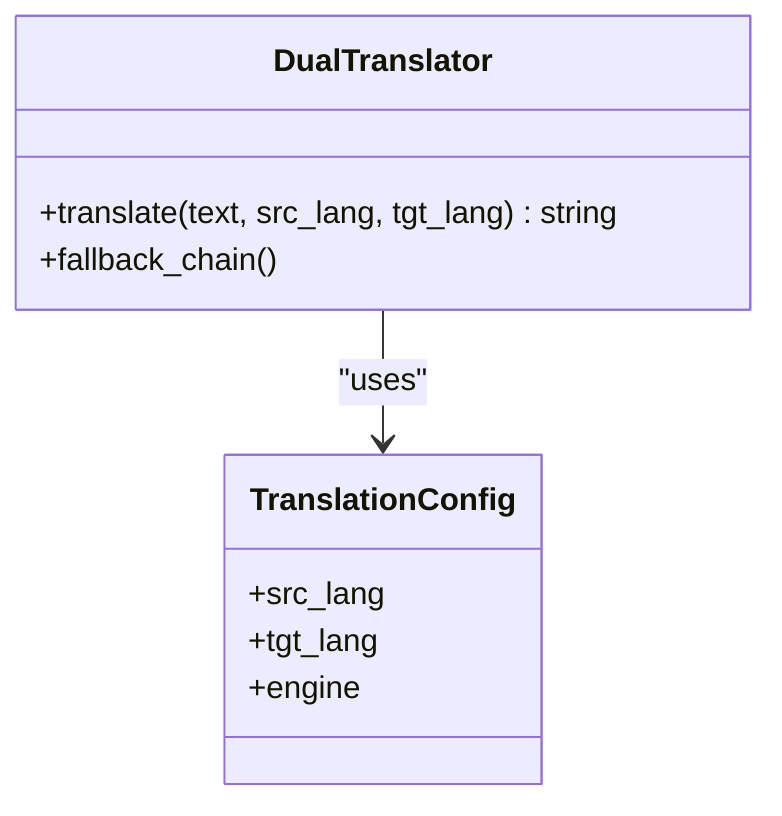
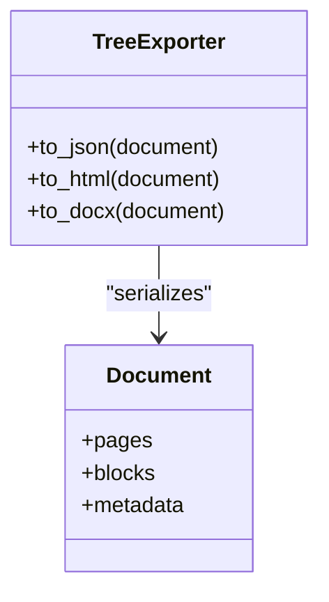
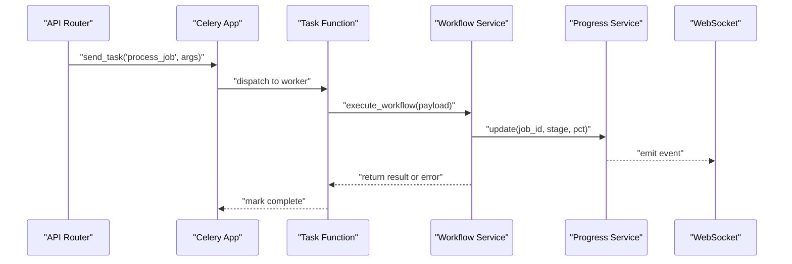
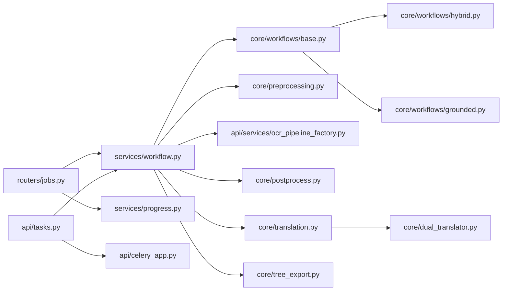

# Data Flow and Processing Pipelines

<cite>
**Referenced Files in This Document**
- [server.py](file://src/local_deepl/server.py)
- [pipeline.py](file://src/local_deepl/pipeline.py)
- [tasks.py](file://src/local_deepl/api/tasks.py)
- [celery_app.py](file://src/local_deepl/api/celery_app.py)
- [jobs.py](file://src/local_deepl/api/routers/jobs.py)
- [progress.py](file://src/local_deepl/api/services/progress.py)
- [workflow.py](file://src/local_deepl/api/services/workflow.py)
- [base.py](file://src/local_deepl/core/workflows/base.py)
- [hybrid.py](file://src/local_deepl/core/workflows/hybrid.py)
- [grounded.py](file://src/local_deepl/core/workflows/grounded.py)
- [preprocessing.py](file://src/local_deepl/core/preprocessing.py)
- [postprocess.py](file://src/local_deepl/core/postprocess.py)
- [translation.py](file://src/local_deepl/core/translation.py)
- [dual_translator.py](file://src/local_deepl/core/dual_translator.py)
- [tree_export.py](file://src/local_deepl/core/tree_export.py)
- [document.py](file://src/local_deepl/core/document.py)
- [ocr_pipeline_factory.py](file://src/local_deepl/api/services/ocr_pipeline_factory.py)
- [ocr_response.py](file://src/local_deepl/api/services/ocr_response.py)
- [ocr_settings.py](file://src/local_deepl/api/services/ocr_settings.py)
- [websocket.py](file://src/local_deepl/api/routers/websocket.py)
- [resilience.py](file://src/local_deepl/core/ocr/resilience.py)
- [exceptions.py](file://src/local_deepl/core/ocr/exceptions.py)
</cite>

## Table of Contents
1. [Introduction](#introduction)
2. [Project Structure](#project-structure)
3. [Core Components](#core-components)
4. [Architecture Overview](#architecture-overview)
5. [Detailed Component Analysis](#detailed-component-analysis)
6. [Dependency Analysis](#dependency-analysis)
7. [Performance Considerations](#performance-considerations)
8. [Troubleshooting Guide](#troubleshooting-guide)
9. [Conclusion](#conclusion)

## Introduction
This document explains LocalDeepL’s data flow and processing pipelines from file upload through OCR, translation, and export. It covers the pipeline orchestration via a base workflow class and concrete implementations (hybrid and grounded), how data transforms across stages (preprocessing, OCR extraction, post-processing, output generation), error handling and retries, progress tracking, and background job execution with Celery workers.

## Project Structure
LocalDeepL is organized into API routers and services that expose HTTP/WebSocket endpoints, Celery task definitions for background processing, and core modules implementing OCR, translation, workflows, and document I/O. The key areas relevant to data flow are:
- API layer: routers for jobs, OCR, translation, websocket events; services for workflow orchestration, progress tracking, and settings.
- Core layer: preprocessing, OCR engines, post-processing, translation engines, tree export, and workflow base/impls.
- Background processing: Celery app and tasks that execute long-running jobs.

**Diagram sources**
- [jobs.py](file://src/local_deepl/api/routers/jobs.py)
- [websocket.py](file://src/local_deepl/api/routers/websocket.py)
- [workflow.py](file://src/local_deepl/api/services/workflow.py)
- [progress.py](file://src/local_deepl/api/services/progress.py)
- [ocr_pipeline_factory.py](file://src/local_deepl/api/services/ocr_pipeline_factory.py)
- [base.py](file://src/local_deepl/core/workflows/base.py)
- [hybrid.py](file://src/local_deepl/core/workflows/hybrid.py)
- [grounded.py](file://src/local_deepl/core/workflows/grounded.py)
- [preprocessing.py](file://src/local_deepl/core/preprocessing.py)
- [postprocess.py](file://src/local_deepl/core/postprocess.py)
- [translation.py](file://src/local_deepl/core/translation.py)
- [dual_translator.py](file://src/local_deepl/core/dual_translator.py)
- [tree_export.py](file://src/local_deepl/core/tree_export.py)
- [document.py](file://src/local_deepl/core/document.py)
- [celery_app.py](file://src/local_deepl/api/celery_app.py)
- [tasks.py](file://src/local_deepl/api/tasks.py)

**Section sources**
- [server.py](file://src/local_deepl/server.py)
- [pipeline.py](file://src/local_deepl/pipeline.py)

## Core Components
- Workflow base and implementations: define the abstract pipeline steps and concrete strategies (hybrid, grounded).
- Preprocessing and post-processing: prepare images/PDFs and refine OCR results.
- OCR subsystem: client, resilience, filters, and prompts for robust extraction.
- Translation subsystem: dual translator and engines for language conversion.
- Export subsystem: tree-based export utilities for final artifacts.
- API services: workflow orchestration, progress tracking, OCR settings, and response shaping.
- Background jobs: Celery app and tasks for asynchronous processing.

**Section sources**
- [base.py](file://src/local_deepl/core/workflows/base.py)
- [hybrid.py](file://src/local_deepl/core/workflows/hybrid.py)
- [grounded.py](file://src/local_deepl/core/workflows/grounded.py)
- [preprocessing.py](file://src/local_deepl/core/preprocessing.py)
- [postprocess.py](file://src/local_deepl/core/postprocess.py)
- [ocr_pipeline_factory.py](file://src/local_deepl/api/services/ocr_pipeline_factory.py)
- [ocr_response.py](file://src/local_deepl/api/services/ocr_response.py)
- [ocr_settings.py](file://src/local_deepl/api/services/ocr_settings.py)
- [translation.py](file://src/local_deepl/core/translation.py)
- [dual_translator.py](file://src/local_deepl/core/dual_translator.py)
- [tree_export.py](file://src/local_deepl/core/tree_export.py)
- [document.py](file://src/local_deepl/core/document.py)
- [progress.py](file://src/local_deepl/api/services/progress.py)
- [celery_app.py](file://src/local_deepl/api/celery_app.py)
- [tasks.py](file://src/local_deepl/api/tasks.py)

## Architecture Overview
The system exposes HTTP endpoints to start jobs, tracks progress via WebSocket events, and executes long-running tasks asynchronously using Celery. A workflow orchestrator composes preprocessing, OCR, post-processing, translation, and export steps. Concrete workflows implement strategy-specific logic while reusing shared components.

**Diagram sources**
- [jobs.py](file://src/local_deepl/api/routers/jobs.py)
- [tasks.py](file://src/local_deepl/api/tasks.py)
- [celery_app.py](file://src/local_deepl/api/celery_app.py)
- [workflow.py](file://src/local_deepl/api/services/workflow.py)
- [base.py](file://src/local_deepl/core/workflows/base.py)
- [hybrid.py](file://src/local_deepl/core/workflows/hybrid.py)
- [grounded.py](file://src/local_deepl/core/workflows/grounded.py)
- [progress.py](file://src/local_deepl/api/services/progress.py)
- [websocket.py](file://src/local_deepl/api/routers/websocket.py)

## Detailed Component Analysis

### Pipeline Orchestration: Base Workflow and Implementations
The base workflow defines the canonical pipeline stages and lifecycle hooks. Concrete workflows (hybrid, grounded) override specific steps to tailor OCR and post-processing behavior while sharing common orchestration.

Key responsibilities:
- Initialization and input validation
- Stage dispatching and state passing between steps
- Hook points for progress callbacks and error propagation
- Optional translation and artifact export

**Diagram sources**
- [base.py](file://src/local_deepl/core/workflows/base.py)
- [hybrid.py](file://src/local_deepl/core/workflows/hybrid.py)
- [grounded.py](file://src/local_deepl/core/workflows/grounded.py)

**Section sources**
- [base.py](file://src/local_deepl/core/workflows/base.py)
- [hybrid.py](file://src/local_deepl/core/workflows/hybrid.py)
- [grounded.py](file://src/local_deepl/core/workflows/grounded.py)

### Data Transformations Across Stages
- Preprocessing: normalizes inputs (images/PDFs), enhances readability, prepares pages/chunks for OCR.
- OCR extraction: runs OCR engines with resilience and filtering; produces structured text and optional layout metadata.
- Post-processing: refines OCR output (cleanups, normalization, structure inference).
- Translation: converts extracted text using dual translator and configured engines.
- Export: serializes results into target formats via tree export utilities.

**Diagram sources**
- [preprocessing.py](file://src/local_deepl/core/preprocessing.py)
- [ocr_pipeline_factory.py](file://src/local_deepl/api/services/ocr_pipeline_factory.py)
- [postprocess.py](file://src/local_deepl/core/postprocess.py)
- [translation.py](file://src/local_deepl/core/translation.py)
- [dual_translator.py](file://src/local_deepl/core/dual_translator.py)
- [tree_export.py](file://src/local_deepl/core/tree_export.py)

**Section sources**
- [preprocessing.py](file://src/local_deepl/core/preprocessing.py)
- [postprocess.py](file://src/local_deepl/core/postprocess.py)
- [translation.py](file://src/local_deepl/core/translation.py)
- [dual_translator.py](file://src/local_deepl/core/dual_translator.py)
- [tree_export.py](file://src/local_deepl/core/tree_export.py)

### OCR Subsystem and Resilience
OCR is encapsulated with resilience mechanisms, exception types, and configuration. The factory selects appropriate OCR pipelines based on settings and input characteristics.

**Diagram sources**
- [ocr_pipeline_factory.py](file://src/local_deepl/api/services/ocr_pipeline_factory.py)
- [client.py](file://src/local_deepl/core/ocr/client.py)
- [resilience.py](file://src/local_deepl/core/ocr/resilience.py)
- [filters.py](file://src/local_deepl/core/ocr/filters.py)
- [exceptions.py](file://src/local_deepl/core/ocr/exceptions.py)

**Section sources**
- [ocr_pipeline_factory.py](file://src/local_deepl/api/services/ocr_pipeline_factory.py)
- [ocr_response.py](file://src/local_deepl/api/services/ocr_response.py)
- [ocr_settings.py](file://src/local_deepl/api/services/ocr_settings.py)
- [resilience.py](file://src/local_deepl/core/ocr/resilience.py)
- [exceptions.py](file://src/local_deepl/core/ocr/exceptions.py)

### Translation Subsystem
Translation uses a dual translator abstraction to support multiple engines and fallback strategies. Settings control source/target languages and engine selection.

**Diagram sources**
- [dual_translator.py](file://src/local_deepl/core/dual_translator.py)
- [translation.py](file://src/local_deepl/core/translation.py)

**Section sources**
- [translation.py](file://src/local_deepl/core/translation.py)
- [dual_translator.py](file://src/local_deepl/core/dual_translator.py)

### Export and Document Models
Tree export utilities serialize processed structures into various formats. The document model represents the unified intermediate representation used throughout the pipeline.

**Diagram sources**
- [document.py](file://src/local_deepl/core/document.py)
- [tree_export.py](file://src/local_deepl/core/tree_export.py)

**Section sources**
- [document.py](file://src/local_deepl/core/document.py)
- [tree_export.py](file://src/local_deepl/core/tree_export.py)

### Background Jobs and Celery Integration
Long-running jobs are queued via Celery tasks. The Celery app configures brokers and workers; tasks invoke the workflow service and emit progress updates.

**Diagram sources**
- [celery_app.py](file://src/local_deepl/api/celery_app.py)
- [tasks.py](file://src/local_deepl/api/tasks.py)
- [workflow.py](file://src/local_deepl/api/services/workflow.py)
- [progress.py](file://src/local_deepl/api/services/progress.py)
- [websocket.py](file://src/local_deepl/api/routers/websocket.py)

**Section sources**
- [celery_app.py](file://src/local_deepl/api/celery_app.py)
- [tasks.py](file://src/local_deepl/api/tasks.py)
- [workflow.py](file://src/local_deepl/api/services/workflow.py)
- [progress.py](file://src/local_deepl/api/services/progress.py)
- [websocket.py](file://src/local_deepl/api/routers/websocket.py)

## Dependency Analysis
- API routers depend on services for orchestration and progress.
- Services depend on core workflows and utilities (OCR, translation, export).
- Workflows depend on preprocessing, OCR, post-processing, translation, and export modules.
- Celery tasks depend on the workflow service and progress service.

**Diagram sources**
- [jobs.py](file://src/local_deepl/api/routers/jobs.py)
- [workflow.py](file://src/local_deepl/api/services/workflow.py)
- [progress.py](file://src/local_deepl/api/services/progress.py)
- [base.py](file://src/local_deepl/core/workflows/base.py)
- [hybrid.py](file://src/local_deepl/core/workflows/hybrid.py)
- [grounded.py](file://src/local_deepl/core/workflows/grounded.py)
- [preprocessing.py](file://src/local_deepl/core/preprocessing.py)
- [ocr_pipeline_factory.py](file://src/local_deepl/api/services/ocr_pipeline_factory.py)
- [postprocess.py](file://src/local_deepl/core/postprocess.py)
- [translation.py](file://src/local_deepl/core/translation.py)
- [dual_translator.py](file://src/local_deepl/core/dual_translator.py)
- [tree_export.py](file://src/local_deepl/core/tree_export.py)
- [tasks.py](file://src/local_deepl/api/tasks.py)
- [celery_app.py](file://src/local_deepl/api/celery_app.py)

**Section sources**
- [jobs.py](file://src/local_deepl/api/routers/jobs.py)
- [workflow.py](file://src/local_deepl/api/services/workflow.py)
- [tasks.py](file://src/local_deepl/api/tasks.py)
- [celery_app.py](file://src/local_deepl/api/celery_app.py)

## Performance Considerations
- Prefer batched OCR calls where possible to reduce overhead.
- Use resilient wrappers with tuned backoff to avoid cascading failures.
- Cache reusable assets (e.g., dictionaries, models) to minimize cold starts.
- Stream large documents page-by-page to limit memory usage.
- Offload heavy work to Celery workers to keep API responsive.

[No sources needed since this section provides general guidance]

## Troubleshooting Guide
Common issues and remedies:
- OCR failures: check resilience configuration, network timeouts, and engine availability. Inspect exceptions raised by OCR clients.
- Translation errors: verify language codes and engine credentials; use dual translator fallback chain.
- Progress not updating: ensure progress service is invoked at each stage and WebSocket connections are active.
- Job stuck: inspect Celery worker logs, broker connectivity, and task queue depth.

**Section sources**
- [resilience.py](file://src/local_deepl/core/ocr/resilience.py)
- [exceptions.py](file://src/local_deepl/core/ocr/exceptions.py)
- [progress.py](file://src/local_deepl/api/services/progress.py)
- [websocket.py](file://src/local_deepl/api/routers/websocket.py)
- [tasks.py](file://src/local_deepl/api/tasks.py)
- [celery_app.py](file://src/local_deepl/api/celery_app.py)

## Conclusion
LocalDeepL’s pipeline is orchestrated by a base workflow with concrete hybrid and grounded implementations, enabling flexible OCR and translation strategies. Robustness is achieved through resilience wrappers, clear exception handling, and background job execution via Celery. Progress tracking and WebSocket events provide real-time visibility into job states. The modular design supports extensibility and performance tuning across preprocessing, OCR, post-processing, translation, and export stages.