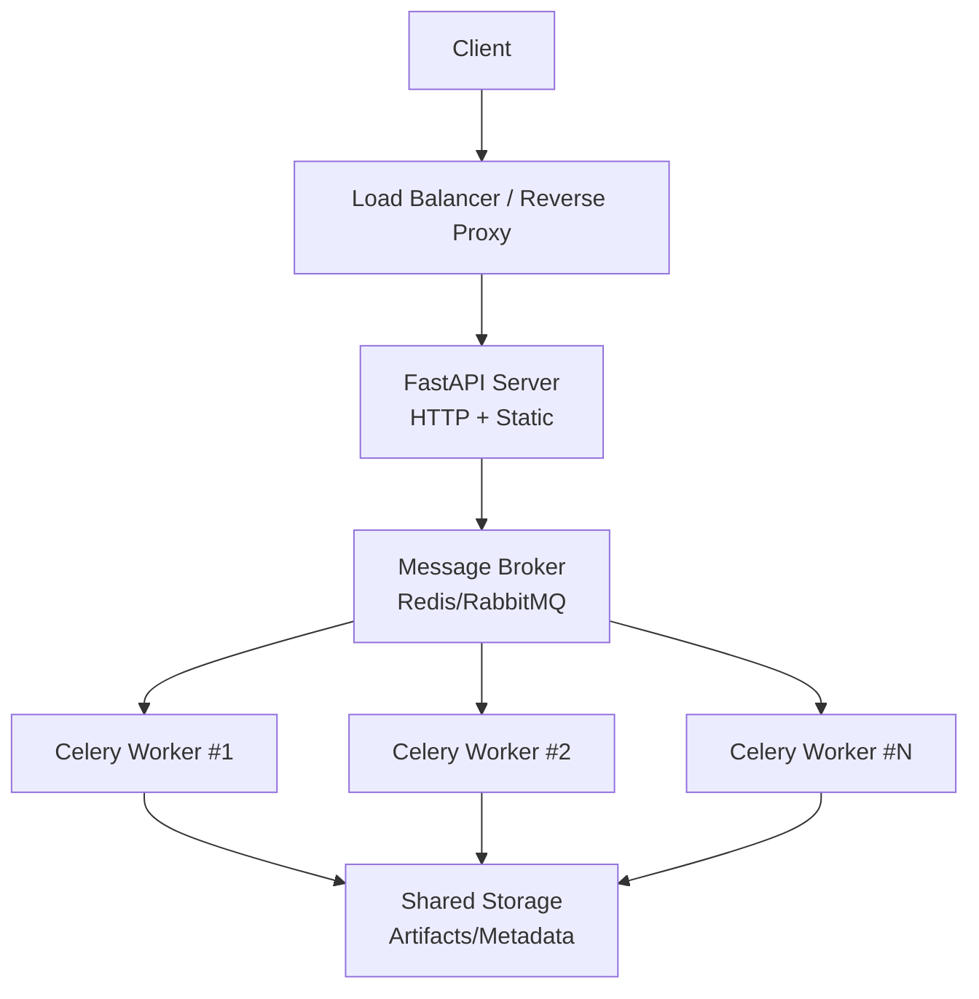
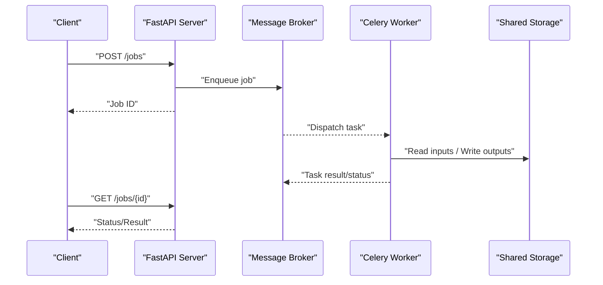
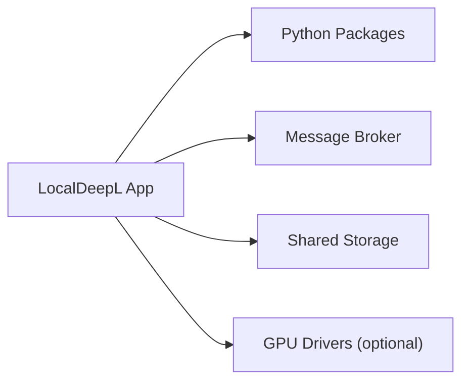

# Deployment Architecture and Scaling

<cite>
**Referenced Files in This Document**
- [Dockerfile](file://Dockerfile)
- [compose.yaml](file://compose.yaml)
- [pyproject.toml](file://pyproject.toml)
- [Makefile](file://Makefile)
- [.github/workflows/test.yml](file://.github/workflows/test.yml)
- [.github/workflows/release.yml](file://.github/workflows/release.yml)
- [.github/workflows/nightly.yml](file://.github/workflows/nightly.yml)
- [src/local_deepl/server.py](file://src/local_deepl/server.py)
- [src/local_deepl/api/celery_app.py](file://src/local_deepl/api/celery_app.py)
- [src/local_deepl/api/tasks.py](file://src/local_deepl/api/tasks.py)
- [src/local_deepl/pipeline.py](file://src/local_deepl/pipeline.py)
- [README.md](file://README.md)
</cite>

## Table of Contents
1. [Introduction](#introduction)
2. [Project Structure](#project-structure)
3. [Core Components](#core-components)
4. [Architecture Overview](#architecture-overview)
5. [Detailed Component Analysis](#detailed-component-analysis)
6. [Dependency Analysis](#dependency-analysis)
7. [Performance Considerations](#performance-considerations)
8. [Troubleshooting Guide](#troubleshooting-guide)
9. [Conclusion](#conclusion)
10. [Appendices](#appendices)

## Introduction
This document explains LocalDeepL’s deployment architecture and scaling considerations for production environments. It covers containerized deployment with Docker and Docker Compose, horizontal scaling using multiple Celery workers, load balancing approaches, environment configuration and secrets management, service discovery patterns, CI/CD automation via GitHub Actions, monitoring and logging strategies, performance optimization, capacity planning, and disaster recovery procedures. The goal is to provide actionable guidance for operators and platform engineers deploying LocalDeepL at scale.

## Project Structure
LocalDeepL is a Python application packaged as a container image and orchestrated with Docker Compose. The runtime consists of:
- A FastAPI web server exposing HTTP APIs and serving static assets
- Background processing via Celery workers for long-running tasks (OCR, translation, artifact generation)
- Shared storage for artifacts and metadata
- Optional external services such as message brokers and object stores

Key files relevant to deployment:
- Container build and packaging: [Dockerfile](file://Dockerfile), [pyproject.toml](file://pyproject.toml)
- Orchestration: [compose.yaml](file://compose.yaml)
- Application entrypoints: [server.py](file://src/local_deepl/server.py), [celery_app.py](file://src/local_deepl/api/celery_app.py), [tasks.py](file://src/local_deepl/api/tasks.py)
- Build and dev tooling: [Makefile](file://Makefile)
- CI/CD workflows: [test.yml](file://.github/workflows/test.yml), [release.yml](file://.github/workflows/release.yml), [nightly.yml](file://.github/workflows/nightly.yml)

[No sources needed since this diagram shows conceptual workflow, not actual code structure]

**Section sources**
- [Dockerfile](file://Dockerfile)
- [compose.yaml](file://compose.yaml)
- [pyproject.toml](file://pyproject.toml)
- [Makefile](file://Makefile)
- [README.md](file://README.md)

## Core Components
- Web API server: Exposes REST endpoints and serves static UI assets. Handles request validation, orchestration, and progress updates.
- Celery worker pool: Executes background jobs asynchronously. Scales horizontally by increasing the number of worker processes or containers.
- Message broker: Decouples API requests from task execution. Supports Redis or RabbitMQ depending on configuration.
- Shared storage: Persists artifacts and metadata across workers and restarts. Can be local volumes or cloud object storage.
- Configuration and secrets: Environment variables and secret mounts control runtime behavior securely.

**Section sources**
- [src/local_deepl/server.py](file://src/local_deepl/server.py)
- [src/local_deepl/api/celery_app.py](file://src/local_deepl/api/celery_app.py)
- [src/local_deepl/api/tasks.py](file://src/local_deepl/api/tasks.py)

## Architecture Overview
The system follows a microservice-oriented pattern within a single container image:
- The FastAPI server handles synchronous HTTP traffic and delegates heavy work to Celery tasks.
- Celery workers consume tasks from the broker and write results to shared storage.
- Horizontal scaling is achieved by running multiple worker replicas behind a reverse proxy or orchestrator.

**Diagram sources**
- [src/local_deepl/server.py](file://src/local_deepl/server.py)
- [src/local_deepl/api/celery_app.py](file://src/local_deepl/api/celery_app.py)
- [src/local_deepl/api/tasks.py](file://src/local_deepl/api/tasks.py)

## Detailed Component Analysis

### Container Image and Build
- The Dockerfile defines the base image, installs dependencies, copies source code, and configures runtime entrypoints for both the API server and Celery workers.
- Dependency management is handled via [pyproject.toml](file://pyproject.toml), which declares project metadata and package requirements.
- The Makefile provides convenience targets for building, testing, and running locally.

Best practices:
- Use multi-stage builds to minimize image size.
- Pin dependency versions for reproducibility.
- Separate build-time and runtime dependencies.

**Section sources**
- [Dockerfile](file://Dockerfile)
- [pyproject.toml](file://pyproject.toml)
- [Makefile](file://Makefile)

### Orchestration with Docker Compose
- compose.yaml defines services for the API server, Celery workers, and supporting infrastructure (broker, storage).
- Services share networks and volumes for inter-process communication and persistent data.
- Environment variables and secrets are injected via environment files or mounted secret files.

Scaling considerations:
- Scale workers with docker-compose up --scale worker=3 or an orchestrator like Kubernetes.
- Use health checks to ensure readiness before routing traffic.

**Section sources**
- [compose.yaml](file://compose.yaml)

### API Server Entrypoint
- The server initializes middleware, routes, and static file serving.
- Request handling validates payloads, enforces security policies, and delegates long-running operations to Celery tasks.
- Progress tracking and status endpoints allow clients to poll or subscribe to job outcomes.

Operational tips:
- Configure concurrency limits per worker to avoid resource exhaustion.
- Enable graceful shutdown to finish in-flight tasks.

**Section sources**
- [src/local_deepl/server.py](file://src/local_deepl/server.py)

### Celery Application and Tasks
- celery_app.py configures the Celery app, including broker URL, result backend, and task serialization settings.
- tasks.py defines background jobs for OCR, translation, and artifact processing.
- Workers consume tasks concurrently based on CPU/GPU availability and memory constraints.

Scaling strategies:
- Increase worker count to handle higher throughput.
- Tune prefetch and concurrency parameters to balance latency and resource usage.
- Use separate queues for different job types to isolate critical paths.

**Section sources**
- [src/local_deepl/api/celery_app.py](file://src/local_deepl/api/celery_app.py)
- [src/local_deepl/api/tasks.py](file://src/local_deepl/api/tasks.py)

### Pipeline Processing
- pipeline.py coordinates preprocessing, OCR, translation, and postprocessing steps.
- It integrates with OCR engines, LLM clients, and export utilities.
- Error handling and retries are implemented to improve resilience.

Optimization opportunities:
- Cache intermediate results to reduce recomputation.
- Parallelize independent stages where possible.
- Stream large payloads to avoid memory spikes.

**Section sources**
- [src/local_deepl/pipeline.py](file://src/local_deepl/pipeline.py)

## Dependency Analysis
LocalDeepL depends on:
- Python runtime and packages defined in pyproject.toml
- Message broker for task distribution
- Shared storage for artifacts and metadata
- Optional GPU drivers for accelerated OCR/translation

**Diagram sources**
- [pyproject.toml](file://pyproject.toml)
- [compose.yaml](file://compose.yaml)

**Section sources**
- [pyproject.toml](file://pyproject.toml)
- [compose.yaml](file://compose.yaml)

## Performance Considerations
- Concurrency tuning: Adjust Celery worker concurrency and prefetch limits based on workload characteristics.
- Resource allocation: Allocate sufficient CPU and memory per worker; consider GPU acceleration for OCR/translation-heavy tasks.
- Caching: Implement response caching for repeated queries and cache intermediate results in pipelines.
- I/O optimization: Use efficient formats for artifacts and metadata; enable compression where appropriate.
- Backpressure: Implement rate limiting and queue depth controls to prevent overload.

[No sources needed since this section provides general guidance]

## Troubleshooting Guide
Common issues and resolutions:
- Broker connectivity failures: Verify network policies and credentials; check broker logs.
- Worker crashes: Inspect worker logs for OOM errors or missing dependencies; adjust resource limits.
- Slow job completion: Profile pipeline stages; identify bottlenecks in OCR or translation engines.
- Artifact persistence errors: Validate storage permissions and disk space; verify volume mounts.

Monitoring recommendations:
- Track queue lengths, task durations, and error rates.
- Alert on broker disconnections and worker restarts.
- Monitor storage utilization and I/O latency.

**Section sources**
- [src/local_deepl/api/celery_app.py](file://src/local_deepl/api/celery_app.py)
- [src/local_deepl/api/tasks.py](file://src/local_deepl/api/tasks.py)

## Conclusion
LocalDeepL’s deployment architecture supports scalable, resilient operation through containerization, asynchronous task processing, and horizontal scaling of Celery workers. By following the recommended configurations, monitoring practices, and scaling strategies outlined here, operators can deploy production-grade instances that meet performance and reliability requirements.

[No sources needed since this section summarizes without analyzing specific files]

## Appendices

### CI/CD Pipeline Setup
- Automated testing: [test.yml](file://.github/workflows/test.yml) runs unit and integration tests on pull requests and pushes.
- Release automation: [release.yml](file://.github/workflows/release.yml) builds images, tags releases, and publishes artifacts.
- Nightly jobs: [nightly.yml](file://.github/workflows/nightly.yml) executes extended test suites and performance benchmarks.

Recommendations:
- Cache dependencies to speed up builds.
- Use matrix builds for multiple Python versions and platforms.
- Enforce security scanning and license checks in CI.

**Section sources**
- [.github/workflows/test.yml](file://.github/workflows/test.yml)
- [.github/workflows/release.yml](file://.github/workflows/release.yml)
- [.github/workflows/nightly.yml](file://.github/workflows/nightly.yml)

### Horizontal Scaling Strategies
- Multiple Celery workers: Scale worker replicas to increase throughput; use auto-scaling policies based on queue depth and CPU utilization.
- Load balancing: Place a reverse proxy (e.g., Nginx, Traefik) in front of API servers; distribute requests evenly across instances.
- Queue partitioning: Route high-priority jobs to dedicated queues to prevent starvation.

[No sources needed since this section provides general guidance]

### Production Deployment Patterns
- Environment configuration: Centralize environment variables in secure vaults or secret managers; inject them into containers at runtime.
- Secrets management: Mount sensitive files (e.g., API keys, certificates) as secrets; avoid embedding secrets in images.
- Service discovery: Use DNS-based discovery or a service mesh for dynamic scaling and failover.

[No sources needed since this section provides general guidance]

### Monitoring and Logging
- Metrics: Export Prometheus metrics for queue length, task duration, error rates, and resource usage.
- Logging: Aggregate structured logs with correlation IDs; ship to centralized log aggregation systems.
- Tracing: Instrument key endpoints and tasks for end-to-end tracing.

[No sources needed since this section provides general guidance]

### Disaster Recovery and Backup
- Artifacts backup: Schedule regular backups of shared storage; store offsite copies for durability.
- Metadata backup: Back up database or metadata stores used by the application.
- Recovery procedures: Define runbooks for restoring from backups, validating integrity, and rehydrating caches.

[No sources needed since this section provides general guidance]