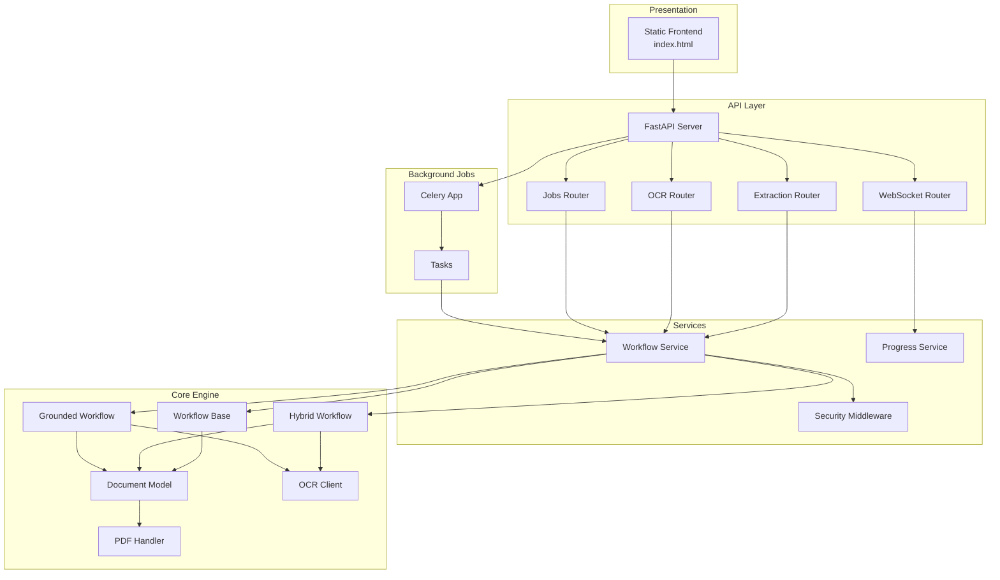
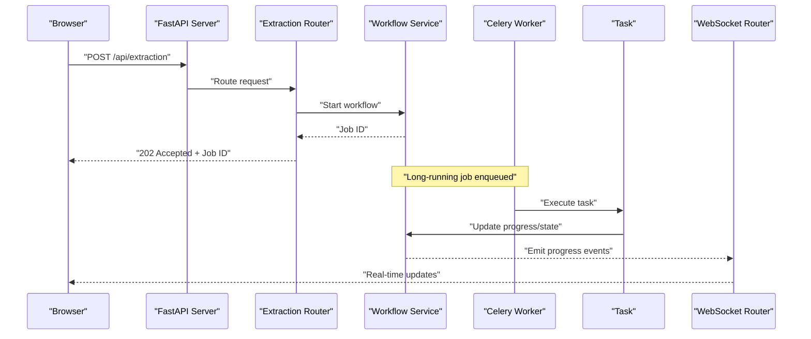
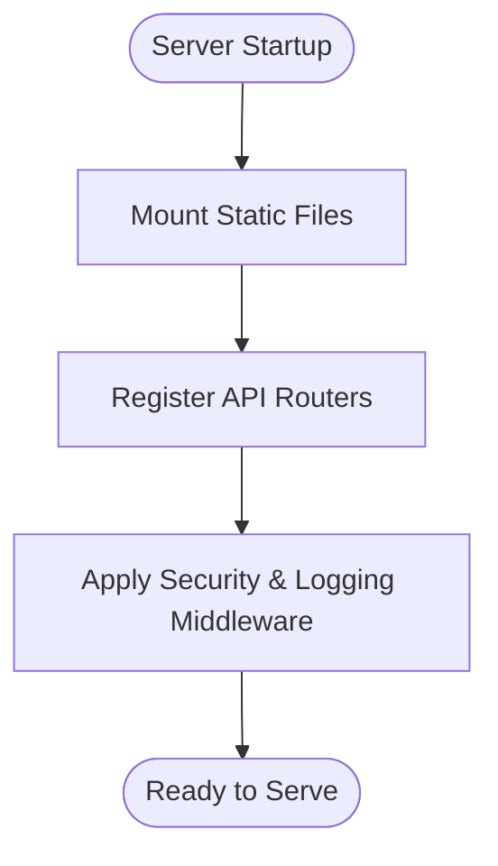
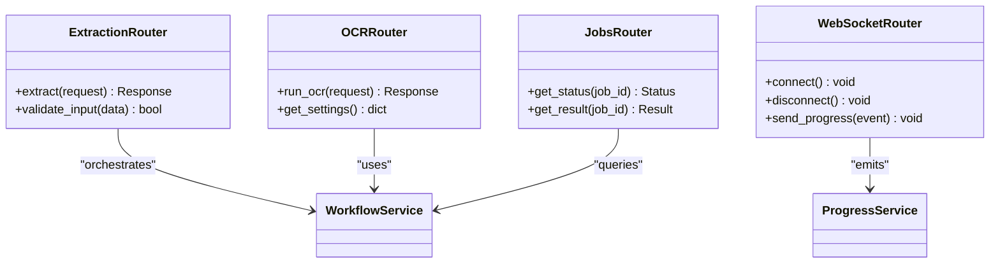
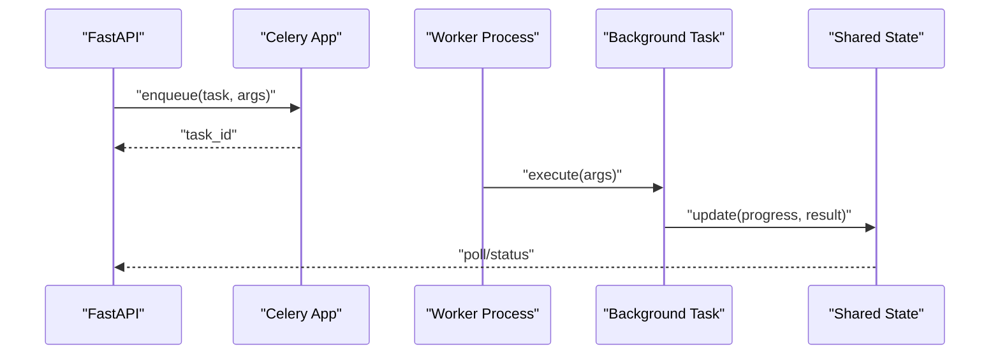
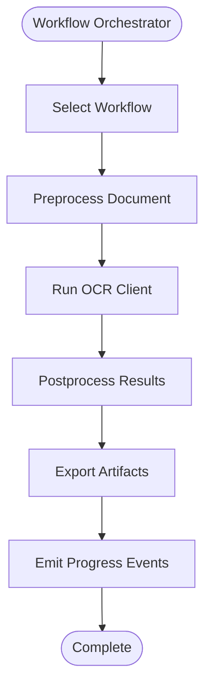
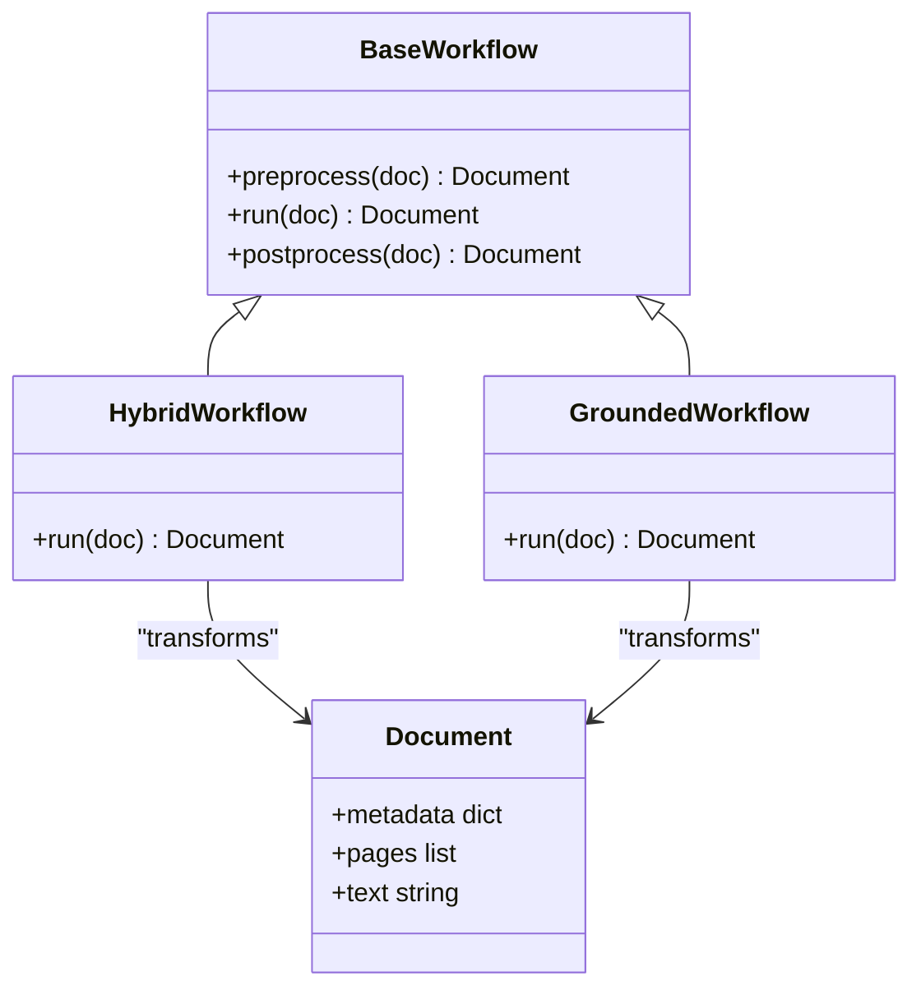
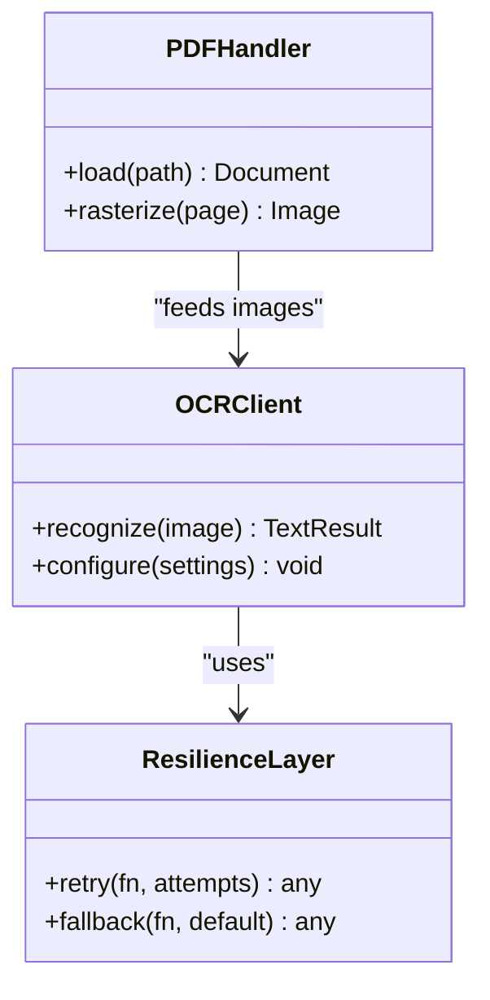
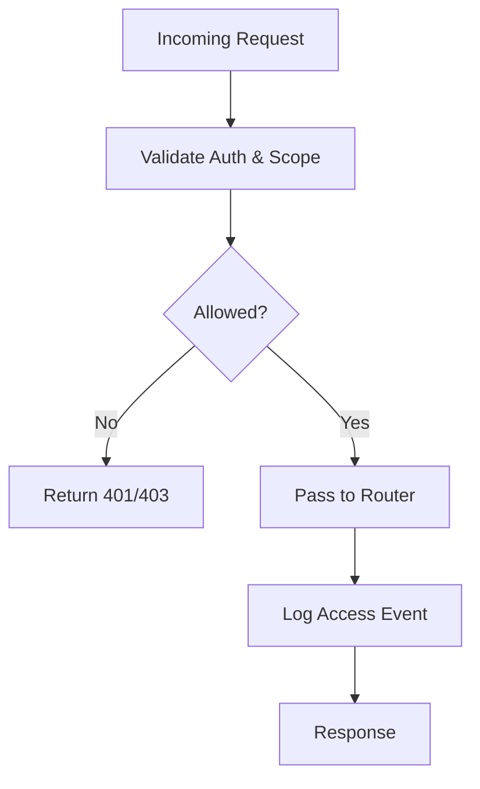
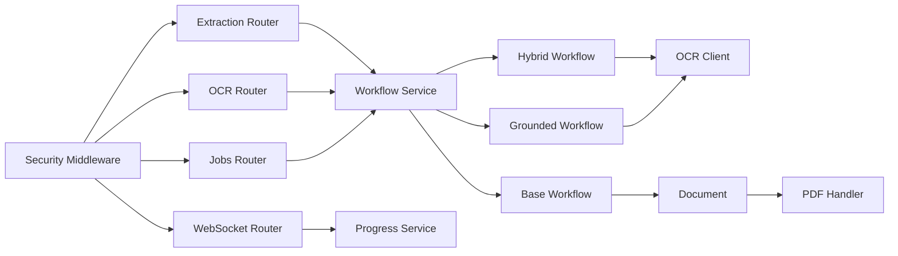

# System Architecture

<cite>
**Referenced Files in This Document**
- [server.py](file://src/local_deepl/server.py)
- [celery_app.py](file://src/local_deepl/api/celery_app.py)
- [tasks.py](file://src/local_deepl/api/tasks.py)
- [routers/extraction.py](file://src/local_deepl/api/routers/extraction.py)
- [routers/ocr.py](file://src/local_deepl/api/routers/ocr.py)
- [routers/jobs.py](file://src/local_deepl/api/routers/jobs.py)
- [routers/websocket.py](file://src/local_deepl/api/routers/websocket.py)
- [services/workflow.py](file://src/local_deepl/api/services/workflow.py)
- [services/security_middleware.py](file://src/local_deepl/api/services/security_middleware.py)
- [core/workflows/base.py](file://src/local_deepl/core/workflows/base.py)
- [core/workflows/hybrid.py](file://src/local_deepl/core/workflows/hybrid.py)
- [core/workflows/grounded.py](file://src/local_deepl/core/workflows/grounded.py)
- [core/ocr/client.py](file://src/local_deepl/core/ocr/client.py)
- [core/pdf/handler.py](file://src/local_deepl/core/pdf/handler.py)
- [core/document.py](file:///src/local_deepl/core/document.py)
- [static/index.html](file://src/local_deepl/static/index.html)
</cite>

## Table of Contents
1. [Introduction](#introduction)
2. [Project Structure](#project-structure)
3. [Core Components](#core-components)
4. [Architecture Overview](#architecture-overview)
5. [Detailed Component Analysis](#detailed-component-analysis)
6. [Dependency Analysis](#dependency-analysis)
7. [Performance Considerations](#performance-considerations)
8. [Troubleshooting Guide](#troubleshooting-guide)
9. [Conclusion](#conclusion)

## Introduction
This document describes the system architecture of LocalDeepL, focusing on its layered design and modular components. The application exposes a FastAPI-based REST API and WebSocket endpoints for real-time updates, delegates long-running OCR and processing tasks to Celery workers, and implements a core processing engine with pluggable workflows and OCR clients. A static frontend provides the presentation layer. Cross-cutting concerns such as security middleware, logging, and monitoring are integrated at the API boundary and within services.

## Project Structure
LocalDeepL follows a clear separation of concerns:
- Presentation: Static assets served by the FastAPI server.
- API Layer: FastAPI routers for HTTP and WebSocket endpoints.
- Services: Business logic, workflow orchestration, and cross-cutting features (security, progress tracking).
- Core Engine: Modular OCR, PDF handling, translation, and workflow implementations.
- Background Jobs: Celery app and task definitions.

**Diagram sources**
- [server.py:1-200](file://src/local_deepl/server.py#L1-L200)
- [routers/extraction.py:1-200](file://src/local_deepl/api/routers/extraction.py#L1-L200)
- [routers/ocr.py:1-200](file://src/local_deepl/api/routers/ocr.py#L1-L200)
- [routers/jobs.py:1-200](file://src/local_deepl/api/routers/jobs.py#L1-L200)
- [routers/websocket.py:1-200](file://src/local_deepl/api/routers/websocket.py#L1-L200)
- [services/workflow.py:1-200](file://src/local_deepl/api/services/workflow.py#L1-L200)
- [services/security_middleware.py:1-200](file://src/local_deepl/api/services/security_middleware.py#L1-L200)
- [core/workflows/base.py:1-200](file://src/local_deepl/core/workflows/base.py#L1-L200)
- [core/workflows/hybrid.py:1-200](file://src/local_deepl/core/workflows/hybrid.py#L1-L200)
- [core/workflows/grounded.py:1-200](file://src/local_deepl/core/workflows/grounded.py#L1-L200)
- [core/ocr/client.py:1-200](file://src/local_deepl/core/ocr/client.py#L1-L200)
- [core/pdf/handler.py:1-200](file://src/local_deepl/core/pdf/handler.py#L1-L200)
- [core/document.py:1-200](file://src/local_deepl/core/document.py#L1-L200)
- [celery_app.py:1-200](file://src/local_deepl/api/celery_app.py#L1-L200)
- [tasks.py:1-200](file://src/local_deepl/api/tasks.py#L1-L200)
- [static/index.html:1-200](file://src/local_deepl/static/index.html#L1-L200)

**Section sources**
- [server.py:1-200](file://src/local_deepl/server.py#L1-L200)
- [static/index.html:1-200](file://src/local_deepl/static/index.html#L1-L200)

## Core Components
- FastAPI Server: Wires routers, mounts static files, and integrates ASGI middleware stack.
- API Routers: Define REST endpoints for extraction, OCR, jobs, configuration, translation, glossary imports, and artifacts; WebSocket router for live progress.
- API Services: OCR pipeline factory, response shaping, settings, progress tracking, security middleware, artifact stores, job history, document metadata/exports.
- Celery Integration: Centralized Celery app and task definitions for background processing (async translation).
- OCRPipeline Facade: Thin facade (`pipeline.py`) that delegates to `HybridEngine` or `GroundedEngine` based on injected components.
- Core Workflows (`core/workflows/`): `EngineBase`, `HybridEngine`, `GroundedEngine` — pluggable processing engines.
- Core OCR (`core/ocr/`): LiteLLM-based OCR client, prompts, filters, resilience (retry + circuit breaker).
- Core PDF (`core/pdf/`): Rasterizer, sandwich-PDF embedder, `PDFHandler` facade.
- Core Grounded (`core/grounded/`): Bbox-native VLM backends and JSON parsers.
- Core Processors (`core/processors/`): Deterministic document processors (reading_order, quality, structure, section, layout, table).
- Block Tree & Translation Tree: `block_tree.py` (rich document IR with headings/tables/figures), `translation_tree.py` (structure-preserving translation), `tree_export.py`, `docx_tree_writer.py`.
- Glossary System (`core/glossary_library/`, `core/glossary_sources/`): Multi-format glossary import (CSV, TBX, TMX, XLIFF, JSON, SQL, Git).
- Translation: `translation.py` (LangGraph workflow), `dual_translator.py`, `nllb_engine.py`, `trocr_engine.py`, `entity_memory.py`.
- Security Middleware: Three ASGI middlewares (BearerAuth, MaxUploadSize, RateLimit) enforced before routing.

**Section sources**
- [server.py:1-200](file://src/local_deepl/server.py#L1-L200)
- [routers/extraction.py:1-200](file://src/local_deepl/api/routers/extraction.py#L1-L200)
- [routers/ocr.py:1-200](file://src/local_deepl/api/routers/ocr.py#L1-L200)
- [routers/jobs.py:1-200](file://src/local_deepl/api/routers/jobs.py#L1-L200)
- [routers/websocket.py:1-200](file://src/local_deepl/api/routers/websocket.py#L1-L200)
- [celery_app.py:1-200](file://src/local_deepl/api/celery_app.py#L1-L200)
- [tasks.py:1-200](file://src/local_deepl/api/tasks.py#L1-L200)
- [services/workflow.py:1-200](file://src/local_deepl/api/services/workflow.py#L1-L200)
- [core/workflows/base.py:1-200](file://src/local_deepl/core/workflows/base.py#L1-L200)
- [core/workflows/hybrid.py:1-200](file://src/local_deepl/core/workflows/hybrid.py#L1-L200)
- [core/workflows/grounded.py:1-200](file://src/local_deepl/core/workflows/grounded.py#L1-L200)
- [core/ocr/client.py:1-200](file://src/local_deepl/core/ocr/client.py#L1-L200)
- [core/pdf/handler.py:1-200](file://src/local_deepl/core/pdf/handler.py#L1-L200)
- [services/security_middleware.py:1-200](file://src/local_deepl/api/services/security_middleware.py#L1-L200)

## Architecture Overview
The system is organized into layers:
- Presentation: Static HTML/CSS/JS served via FastAPI.
- API: REST endpoints and WebSocket channels.
- Services: Business logic, workflow selection, and cross-cutting concerns.
- Core: Processing pipelines, OCR abstraction, and document models.
- Background: Celery workers executing long-running tasks and updating shared state.

**Diagram sources**
- [routers/extraction.py:1-200](file://src/local_deepl/api/routers/extraction.py#L1-L200)
- [services/workflow.py:1-200](file://src/local_deepl/api/services/workflow.py#L1-L200)
- [celery_app.py:1-200](file://src/local_deepl/api/celery_app.py#L1-L200)
- [tasks.py:1-200](file://src/local_deepl/api/tasks.py#L1-L200)
- [routers/websocket.py:1-200](file://src/local_deepl/api/routers/websocket.py#L1-L200)

## Detailed Component Analysis

### FastAPI Server and Static Frontend
- Mounts static assets and registers routers.
- Integrates security middleware and CORS/logging where applicable.
- Serves index.html and related assets for the workspace UI.

**Diagram sources**
- [server.py:1-200](file://src/local_deepl/server.py#L1-L200)
- [static/index.html:1-200](file://src/local_deepl/static/index.html#L1-L200)

**Section sources**
- [server.py:1-200](file://src/local_deepl/server.py#L1-L200)
- [static/index.html:1-200](file://src/local_deepl/static/index.html#L1-L200)

### API Routers and WebSocket
- Extraction router: Accepts documents, validates input, triggers workflow, returns job identifiers.
- OCR router: Provides direct OCR operations and settings.
- Jobs router: Exposes job status and results retrieval.
- WebSocket router: Streams progress and completion events to clients.

**Diagram sources**
- [routers/extraction.py:1-200](file://src/local_deepl/api/routers/extraction.py#L1-L200)
- [routers/ocr.py:1-200](file://src/local_deepl/api/routers/ocr.py#L1-L200)
- [routers/jobs.py:1-200](file://src/local_deepl/api/routers/jobs.py#L1-L200)
- [routers/websocket.py:1-200](file://src/local_deepl/api/routers/websocket.py#L1-L200)
- [services/workflow.py:1-200](file://src/local_deepl/api/services/workflow.py#L1-L200)

**Section sources**
- [routers/extraction.py:1-200](file://src/local_deepl/api/routers/extraction.py#L1-L200)
- [routers/ocr.py:1-200](file://src/local_deepl/api/routers/ocr.py#L1-L200)
- [routers/jobs.py:1-200](file://src/local_deepl/api/routers/jobs.py#L1-L200)
- [routers/websocket.py:1-200](file://src/local_deepl/api/routers/websocket.py#L1-L200)

### Celery Task Queue Integration
- Centralized Celery app configuration.
- Task definitions for long-running OCR and processing jobs.
- Workers execute tasks asynchronously and update shared state or emit events via services.

**Diagram sources**
- [celery_app.py:1-200](file://src/local_deepl/api/celery_app.py#L1-L200)
- [tasks.py:1-200](file://src/local_deepl/api/tasks.py#L1-L200)

**Section sources**
- [celery_app.py:1-200](file://src/local_deepl/api/celery_app.py#L1-L200)
- [tasks.py:1-200](file://src/local_deepl/api/tasks.py#L1-L200)

### Workflow Orchestration Service
- Selects appropriate workflow based on request parameters.
- Coordinates preprocessing, OCR, postprocessing, and export steps.
- Emits progress updates and handles errors consistently.

**Diagram sources**
- [services/workflow.py:1-200](file://src/local_deepl/api/services/workflow.py#L1-L200)

**Section sources**
- [services/workflow.py:1-200](file://src/local_deepl/api/services/workflow.py#L1-L200)

### Core Workflows and Document Model
- Base workflow defines common lifecycle hooks and interfaces.
- Hybrid and grounded workflows implement specific strategies for OCR and grounding.
- Document model centralizes structure and metadata used across processors.

**Diagram sources**
- [core/workflows/base.py:1-200](file://src/local_deepl/core/workflows/base.py#L1-L200)
- [core/workflows/hybrid.py:1-200](file://src/local_deepl/core/workflows/hybrid.py#L1-L200)
- [core/workflows/grounded.py:1-200](file://src/local_deepl/core/workflows/grounded.py#L1-L200)
- [core/document.py:1-200](file://src/local_deepl/core/document.py#L1-L200)

**Section sources**
- [core/workflows/base.py:1-200](file://src/local_deepl/core/workflows/base.py#L1-L200)
- [core/workflows/hybrid.py:1-200](file://src/local_deepl/core/workflows/hybrid.py#L1-L200)
- [core/workflows/grounded.py:1-200](file://src/local_deepl/core/workflows/grounded.py#L1-L200)
- [core/document.py:1-200](file://src/local_deepl/core/document.py#L1-L200)

### OCR Client and PDF Handler
- OCR client abstracts OCR engines, providing resilience and filtering.
- PDF handler manages ingestion, parsing, and rasterization for image-based content.

**Diagram sources**
- [core/ocr/client.py:1-200](file://src/local_deepl/core/ocr/client.py#L1-L200)
- [core/pdf/handler.py:1-200](file://src/local_deepl/core/pdf/handler.py#L1-L200)

**Section sources**
- [core/ocr/client.py:1-200](file://src/local_deepl/core/ocr/client.py#L1-L200)
- [core/pdf/handler.py:1-200](file://src/local_deepl/core/pdf/handler.py#L1-L200)

### Security Middleware
- Enforces authentication/authorization checks on incoming requests.
- Validates tokens, scopes, and rate limits where configured.
- Integrates with logging and monitoring for audit trails.

**Diagram sources**
- [services/security_middleware.py:1-200](file://src/local_deepl/api/services/security_middleware.py#L1-L200)

**Section sources**
- [services/security_middleware.py:1-200](file://src/local_deepl/api/services/security_middleware.py#L1-L200)

## Dependency Analysis
The system exhibits clear layering and decoupling:
- Routers depend on services for business logic.
- Services depend on core workflows and OCR/PDF modules.
- Celery tasks operate independently but communicate through shared state/events.
- Security middleware sits at the API boundary.

**Diagram sources**
- [routers/extraction.py:1-200](file://src/local_deepl/api/routers/extraction.py#L1-L200)
- [routers/ocr.py:1-200](file://src/local_deepl/api/routers/ocr.py#L1-L200)
- [routers/jobs.py:1-200](file://src/local_deepl/api/routers/jobs.py#L1-L200)
- [routers/websocket.py:1-200](file://src/local_deepl/api/routers/websocket.py#L1-L200)
- [services/workflow.py:1-200](file://src/local_deepl/api/services/workflow.py#L1-L200)
- [core/workflows/base.py:1-200](file://src/local_deepl/core/workflows/base.py#L1-L200)
- [core/workflows/hybrid.py:1-200](file://src/local_deepl/core/workflows/hybrid.py#L1-L200)
- [core/workflows/grounded.py:1-200](file://src/local_deepl/core/workflows/grounded.py#L1-L200)
- [core/ocr/client.py:1-200](file://src/local_deepl/core/ocr/client.py#L1-L200)
- [core/pdf/handler.py:1-200](file://src/local_deepl/core/pdf/handler.py#L1-L200)
- [services/security_middleware.py:1-200](file://src/local_deepl/api/services/security_middleware.py#L1-L200)

**Section sources**
- [routers/extraction.py:1-200](file://src/local_deepl/api/routers/extraction.py#L1-L200)
- [routers/ocr.py:1-200](file://src/local_deepl/api/routers/ocr.py#L1-L200)
- [routers/jobs.py:1-200](file://src/local_deepl/api/routers/jobs.py#L1-L200)
- [routers/websocket.py:1-200](file://src/local_deepl/api/routers/websocket.py#L1-L200)
- [services/workflow.py:1-200](file://src/local_deepl/api/services/workflow.py#L1-L200)
- [core/workflows/base.py:1-200](file://src/local_deepl/core/workflows/base.py#L1-L200)
- [core/workflows/hybrid.py:1-200](file://src/local_deepl/core/workflows/hybrid.py#L1-L200)
- [core/workflows/grounded.py:1-200](file://src/local_deepl/core/workflows/grounded.py#L1-L200)
- [core/ocr/client.py:1-200](file://src/local_deepl/core/ocr/client.py#L1-L200)
- [core/pdf/handler.py:1-200](file://src/local_deepl/core/pdf/handler.py#L1-L200)
- [services/security_middleware.py:1-200](file://src/local_deepl/api/services/security_middleware.py#L1-L200)

## Performance Considerations
- Offload heavy OCR and processing tasks to Celery workers to keep API responsive.
- Use streaming WebSockets for real-time progress updates without polling overhead.
- Cache reusable resources (models, dictionaries) where possible.
- Implement retry and fallback mechanisms in OCR client to handle transient failures.
- Monitor worker concurrency and queue depth to prevent bottlenecks.

[No sources needed since this section provides general guidance]

## Troubleshooting Guide
- Authentication failures: Inspect security middleware logs and token validation paths.
- Stalled jobs: Check Celery worker health, queue backlog, and task logs.
- OCR errors: Review resilience layer retries, fallback behavior, and input image quality.
- WebSocket disconnects: Verify event emission points and client reconnection logic.

**Section sources**
- [services/security_middleware.py:1-200](file://src/local_deepl/api/services/security_middleware.py#L1-L200)
- [celery_app.py:1-200](file://src/local_deepl/api/celery_app.py#L1-L200)
- [tasks.py:1-200](file://src/local_deepl/api/tasks.py#L1-L200)
- [core/ocr/client.py:1-200](file://src/local_deepl/core/ocr/client.py#L1-L200)
- [routers/websocket.py:1-200](file://src/local_deepl/api/routers/websocket.py#L1-L200)

## Conclusion
LocalDeepL’s architecture cleanly separates presentation, API, services, core processing, and background jobs. The modular workflow engine and OCR abstraction enable flexible processing strategies, while Celery ensures scalability for long-running tasks. Security middleware and observability practices provide robustness and maintainability. This design supports extensibility and clear ownership of responsibilities across components.