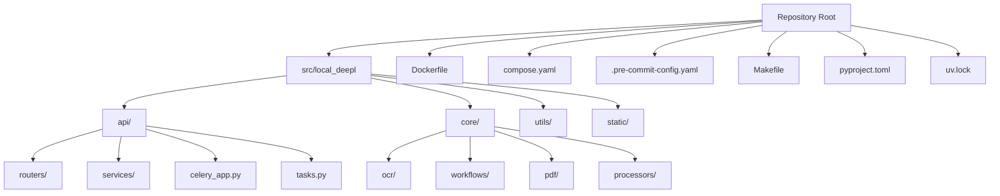
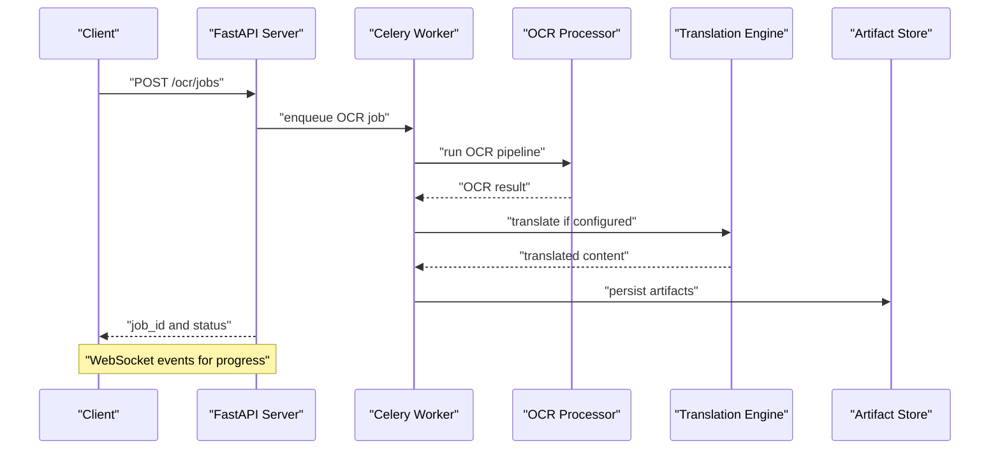
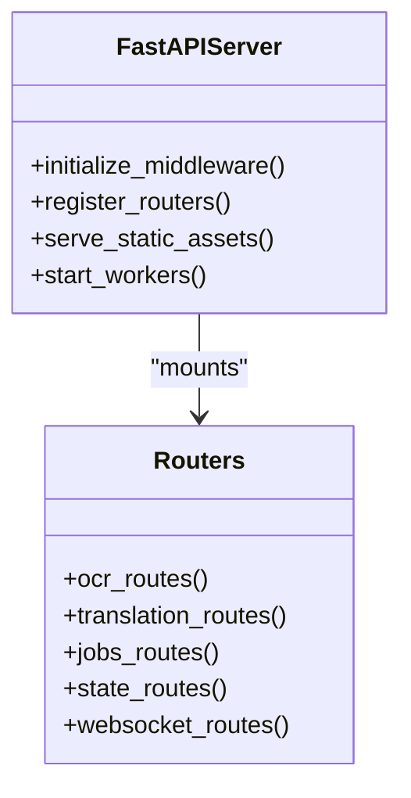
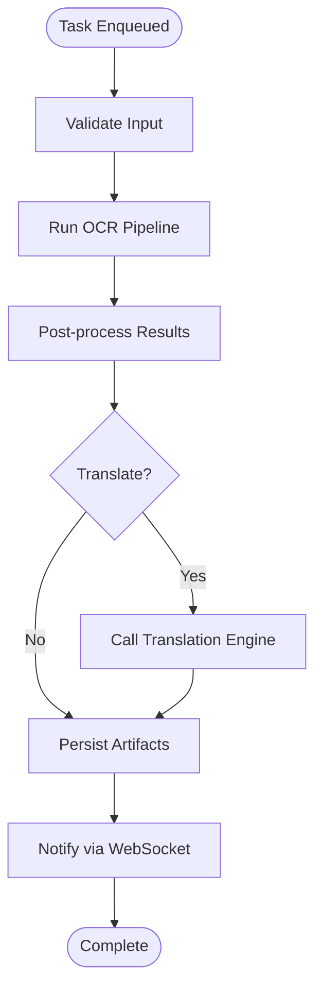
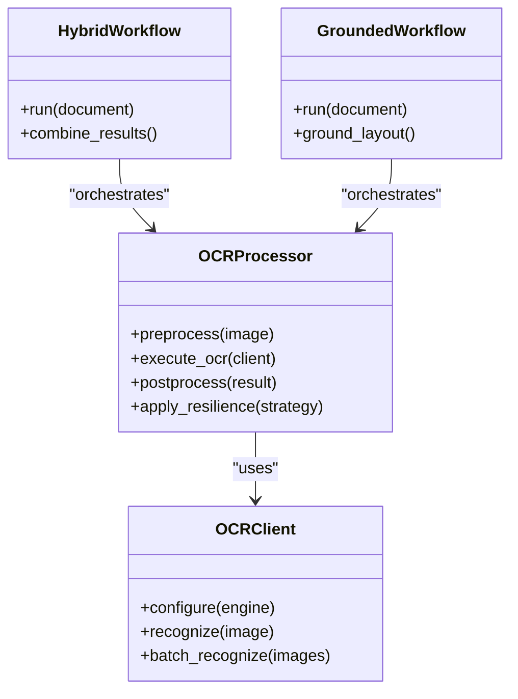
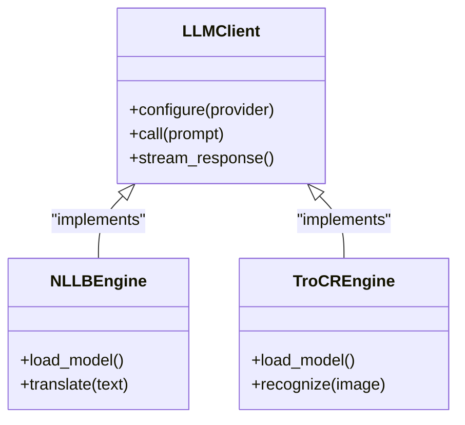
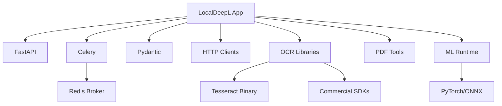

# Technology Stack and Dependencies

<cite>
**Referenced Files in This Document**
- [README.md](file://README.md)
- [pyproject.toml](file://pyproject.toml)
- [uv.lock](file://uv.lock)
- [Dockerfile](file://Dockerfile)
- [compose.yaml](file://compose.yaml)
- [.pre-commit-config.yaml](file://.pre-commit-config.yaml)
- [Makefile](file://Makefile)
- [src/local_deepl/server.py](file://src/local_deepl/server.py)
- [src/local_deepl/api/celery_app.py](file://src/local_deepl/api/celery_app.py)
- [src/local_deepl/api/tasks.py](file://src/local_deepl/api/tasks.py)
- [src/local_deepl/core/ocr/client.py](file://src/local_deepl/core/ocr/client.py)
- [src/local_deepl/core/ocr/processor.py](file://src/local_deepl/core/ocr/processor.py)
- [src/local_deepl/core/workflows/hybrid.py](file://src/local_deepl/core/workflows/hybrid.py)
- [src/local_deepl/core/workflows/grounded.py](file://src/local_deepl/core/workflows/grounded.py)
- [src/local_deepl/core/llm_client.py](file://src/local_deepl/core/llm_client.py)
- [src/local_deepl/core/nllb_engine.py](file://src/local_deepl/core/nllb_engine.py)
- [src/local_deepl/core/trocr_engine.py](file://src/local_deepl/core/trocr_engine.py)
- [scripts/dev.py](file://scripts/dev.py)
</cite>

## Table of Contents
1. [Introduction](#introduction)
2. [Project Structure](#project-structure)
3. [Core Components](#core-components)
4. [Architecture Overview](#architecture-overview)
5. [Detailed Component Analysis](#detailed-component-analysis)
6. [Dependency Analysis](#dependency-analysis)
7. [Performance Considerations](#performance-considerations)
8. [Troubleshooting Guide](#troubleshooting-guide)
9. [Conclusion](#conclusion)
10. [Appendices](#appendices)

## Introduction
This document describes LocalDeepL’s technology stack, dependencies, and deployment model. It focuses on the web framework (FastAPI), task queuing (Celery), OCR engines (Tesseract and commercial APIs), Python version requirements, third-party libraries, containerization with Docker and Docker Compose, dependency management, upgrade procedures, development tooling, and production infrastructure considerations.

## Project Structure
LocalDeepL is organized into a Python package under src/local_deepl with clear separation between API routes, services, core processing logic (OCR, PDF handling, translation, workflows), utilities, and static assets. Configuration and packaging are defined at the repository root using modern Python tooling. Containerization is provided via Dockerfile and compose.yaml. Development and CI automation are present under .github/workflows and scripts.

**Diagram sources**
- [pyproject.toml:1-200](file://pyproject.toml#L1-L200)
- [Dockerfile:1-200](file://Dockerfile#L1-L200)
- [compose.yaml:1-200](file://compose.yaml#L1-L200)

**Section sources**
- [README.md:1-200](file://README.md#L1-L200)
- [pyproject.toml:1-200](file://pyproject.toml#L1-L200)
- [uv.lock:1-200](file://uv.lock#L1-L200)
- [Dockerfile:1-200](file://Dockerfile#L1-L200)
- [compose.yaml:1-200](file://compose.yaml#L1-L200)

## Core Components
- Web Framework: FastAPI-based HTTP server exposing REST endpoints and WebSocket support for real-time progress.
- Task Queue: Celery application and tasks for asynchronous OCR and translation jobs.
- OCR Engines: Pluggable OCR clients supporting Tesseract and commercial APIs; processors orchestrate OCR pipelines and resilience strategies.
- Translation Engines: Integration points for local models (NLLB, TroCR) and external LLMs via a unified client interface.
- Workflows: Hybrid and grounded workflows that combine OCR, layout analysis, and translation steps.

Key files:
- Server entrypoint and configuration
- Celery app and task definitions
- OCR client and processor abstractions
- Translation engine implementations
- Workflow orchestrators

**Section sources**
- [src/local_deepl/server.py:1-200](file://src/local_deepl/server.py#L1-L200)
- [src/local_deepl/api/celery_app.py:1-200](file://src/local_deepl/api/celery_app.py#L1-L200)
- [src/local_deepl/api/tasks.py:1-200](file://src/local_deepl/api/tasks.py#L1-L200)
- [src/local_deepl/core/ocr/client.py:1-200](file://src/local_deepl/core/ocr/client.py#L1-L200)
- [src/local_deepl/core/ocr/processor.py:1-200](file://src/local_deepl/core/ocr/processor.py#L1-L200)
- [src/local_deepl/core/workflows/hybrid.py:1-200](file://src/local_deepl/core/workflows/hybrid.py#L1-L200)
- [src/local_deepl/core/workflows/grounded.py:1-200](file://src/local_deepl/core/workflows/grounded.py#L1-L200)
- [src/local_deepl/core/llm_client.py:1-200](file://src/local_deepl/core/llm_client.py#L1-L200)
- [src/local_deepl/core/nllb_engine.py:1-200](file://src/local_deepl/core/nllb_engine.py#L1-L200)
- [src/local_deepl/core/trocr_engine.py:1-200](file://src/local_deepl/core/trocr_engine.py#L1-L200)

## Architecture Overview
LocalDeepL exposes an HTTP API built with FastAPI. Requests trigger Celery tasks to perform OCR and translation asynchronously. OCR results flow through processors and workflows to produce structured outputs. Optional WebSocket updates provide job progress.

**Diagram sources**
- [src/local_deepl/server.py:1-200](file://src/local_deepl/server.py#L1-L200)
- [src/local_deepl/api/tasks.py:1-200](file://src/local_deepl/api/tasks.py#L1-L200)
- [src/local_deepl/core/ocr/processor.py:1-200](file://src/local_deepl/core/ocr/processor.py#L1-L200)
- [src/local_deepl/core/llm_client.py:1-200](file://src/local_deepl/core/llm_client.py#L1-L200)

## Detailed Component Analysis

### FastAPI Web Framework
- Entry point initializes middleware, routers, and static assets.
- Routes expose endpoints for OCR, translation, jobs, configuration, and state.
- WebSocket integration supports real-time progress updates.

**Diagram sources**
- [src/local_deepl/server.py:1-200](file://src/local_deepl/server.py#L1-L200)

**Section sources**
- [src/local_deepl/server.py:1-200](file://src/local_deepl/server.py#L1-L200)

### Celery Task Queuing
- Celery app configuration and worker lifecycle managed centrally.
- Tasks encapsulate long-running OCR and translation operations.
- Progress tracking integrates with API responses and WebSocket events.

**Diagram sources**
- [src/local_deepl/api/celery_app.py:1-200](file://src/local_deepl/api/celery_app.py#L1-L200)
- [src/local_deepl/api/tasks.py:1-200](file://src/local_deepl/api/tasks.py#L1-L200)

**Section sources**
- [src/local_deepl/api/celery_app.py:1-200](file://src/local_deepl/api/celery_app.py#L1-L200)
- [src/local_deepl/api/tasks.py:1-200](file://src/local_deepl/api/tasks.py#L1-L200)

### OCR Engines and Processing
- OCR client abstraction supports multiple backends (Tesseract, commercial APIs).
- Processor coordinates preprocessing, OCR execution, filtering, and resilience strategies.
- Workflows (hybrid, grounded) combine OCR with layout analysis and translation.

**Diagram sources**
- [src/local_deepl/core/ocr/client.py:1-200](file://src/local_deepl/core/ocr/client.py#L1-L200)
- [src/local_deepl/core/ocr/processor.py:1-200](file://src/local_deepl/core/ocr/processor.py#L1-L200)
- [src/local_deepl/core/workflows/hybrid.py:1-200](file://src/local_deepl/core/workflows/hybrid.py#L1-L200)
- [src/local_deepl/core/workflows/grounded.py:1-200](file://src/local_deepl/core/workflows/grounded.py#L1-L200)

**Section sources**
- [src/local_deepl/core/ocr/client.py:1-200](file://src/local_deepl/core/ocr/client.py#L1-L200)
- [src/local_deepl/core/ocr/processor.py:1-200](file://src/local_deepl/core/ocr/processor.py#L1-L200)
- [src/local_deepl/core/workflows/hybrid.py:1-200](file://src/local_deepl/core/workflows/hybrid.py#L1-L200)
- [src/local_deepl/core/workflows/grounded.py:1-200](file://src/local_deepl/core/workflows/grounded.py#L1-L200)

### Translation Engines and LLM Client
- Unified client abstracts calls to external LLMs and local engines.
- NLLB and TroCR engines implement local model inference paths.
- Engines integrate with workflows to translate OCR results.

**Diagram sources**
- [src/local_deepl/core/llm_client.py:1-200](file://src/local_deepl/core/llm_client.py#L1-L200)
- [src/local_deepl/core/nllb_engine.py:1-200](file://src/local_deepl/core/nllb_engine.py#L1-L200)
- [src/local_deepl/core/trocr_engine.py:1-200](file://src/local_deepl/core/trocr_engine.py#L1-L200)

**Section sources**
- [src/local_deepl/core/llm_client.py:1-200](file://src/local_deepl/core/llm_client.py#L1-L200)
- [src/local_deepl/core/nllb_engine.py:1-200](file://src/local_deepl/core/nllb_engine.py#L1-L200)
- [src/local_deepl/core/trocr_engine.py:1-200](file://src/local_deepl/core/trocr_engine.py#L1-L200)

## Dependency Analysis
- Python Version: Defined in pyproject.toml; ensure compatibility with all wheels and native extensions.
- Package Manager: uv used for lockfile management; uv.lock pins exact versions for reproducible builds.
- Core Libraries: FastAPI, Uvicorn/Gunicorn, Celery, Redis (broker/backend), Pydantic, requests/httpx, Pillow, pdfplumber or similar PDF tools, and OCR-specific packages (e.g., pytesseract, commercial SDKs).
- Optional ML Libraries: Transformers, PyTorch, or ONNX runtime depending on local model usage.

Upgrade strategy:
- Update pyproject.toml constraints carefully; run uv sync to regenerate uv.lock.
- Validate compatibility by running tests and integration checks.
- For native dependencies (e.g., Tesseract binaries), update system packages separately.

**Diagram sources**
- [pyproject.toml:1-200](file://pyproject.toml#L1-L200)
- [uv.lock:1-200](file://uv.lock#L1-L200)

**Section sources**
- [pyproject.toml:1-200](file://pyproject.toml#L1-L200)
- [uv.lock:1-200](file://uv.lock#L1-L200)

## Performance Considerations
- CPU: OCR and translation can be CPU-intensive; allocate cores based on concurrent job limits.
- Memory: Large images and models require sufficient RAM; tune batch sizes and concurrency.
- Storage: Artifacts and intermediate files should use fast storage; consider SSDs for high throughput.
- Concurrency: Adjust Celery worker count and pool type (prefork vs gevent) to match workload characteristics.
- GPU: If using local ML engines, provision GPUs and configure runtime accordingly.

[No sources needed since this section provides general guidance]

## Troubleshooting Guide
Common issues and resolutions:
- Celery workers not starting: Verify broker connectivity (Redis), environment variables, and permissions.
- OCR failures: Check Tesseract installation and language packs; validate image formats and sizes.
- Translation errors: Confirm provider credentials and rate limits; inspect network connectivity.
- Memory exhaustion: Reduce batch size, increase memory limits, or scale horizontally.

Debugging aids:
- Use dev script to start services locally with verbose logging.
- Inspect job states and logs via API endpoints and worker logs.

**Section sources**
- [scripts/dev.py:1-200](file://scripts/dev.py#L1-L200)

## Conclusion
LocalDeepL combines FastAPI, Celery, and pluggable OCR/translation engines to deliver robust document processing. The project leverages modern Python tooling (uv, pyproject.toml) and containerization (Docker, Compose) for consistent deployments. Careful attention to dependency versions, resource allocation, and workflow configuration ensures reliable performance across diverse environments.

[No sources needed since this section summarizes without analyzing specific files]

## Appendices

### Python Version Requirements
- Specify minimum and maximum supported Python versions in pyproject.toml.
- Ensure binary distributions (wheels) are available for target platforms.

**Section sources**
- [pyproject.toml:1-200](file://pyproject.toml#L1-L200)

### Third-Party Libraries and Roles
- FastAPI: Web framework for HTTP and WebSocket endpoints.
- Celery: Asynchronous task queue for OCR and translation jobs.
- Redis: Message broker and result backend for Celery.
- OCR libraries: Tesseract bindings and optional commercial SDKs.
- PDF tools: Parsing and rasterization utilities.
- ML runtimes: PyTorch/ONNX for local model inference.

**Section sources**
- [pyproject.toml:1-200](file://pyproject.toml#L1-L200)
- [uv.lock:1-200](file://uv.lock#L1-L200)

### Containerization Approach
- Dockerfile defines the runtime environment, dependencies, and entrypoints.
- compose.yaml orchestrates services (app, workers, Redis, optional DB).
- Environment variables control configuration (e.g., broker URL, OCR settings).

**Section sources**
- [Dockerfile:1-200](file://Dockerfile#L1-L200)
- [compose.yaml:1-200](file://compose.yaml#L1-L200)

### Dependency Management Strategies
- Use uv for deterministic builds via uv.lock.
- Pin critical versions in pyproject.toml; update incrementally with tests.
- Separate system-level dependencies (e.g., Tesseract binaries) from Python packages.

**Section sources**
- [pyproject.toml:1-200](file://pyproject.toml#L1-L200)
- [uv.lock:1-200](file://uv.lock#L1-L200)

### Upgrade Procedures
- Update constraints in pyproject.toml.
- Regenerate uv.lock with uv sync.
- Rebuild Docker images and redeploy.
- Validate with test suites and integration checks.

**Section sources**
- [pyproject.toml:1-200](file://pyproject.toml#L1-L200)
- [uv.lock:1-200](file://uv.lock#L1-L200)
- [Dockerfile:1-200](file://Dockerfile#L1-L200)

### Development Tools and Code Quality
- Pre-commit hooks enforce formatting, linting, and security checks.
- Makefile centralizes common commands (build, test, lint).
- GitHub Actions automate testing and releases.

**Section sources**
- [.pre-commit-config.yaml:1-200](file://.pre-commit-config.yaml#L1-L200)
- [Makefile:1-200](file://Makefile#L1-L200)

### Infrastructure Requirements for Production
- CPU: Scale workers based on OCR/translation load.
- Memory: Allocate sufficient RAM per worker; monitor peak usage.
- Storage: Use fast disks for artifacts; plan retention policies.
- Networking: Ensure low-latency access to broker and optional external APIs.

[No sources needed since this section provides general guidance]