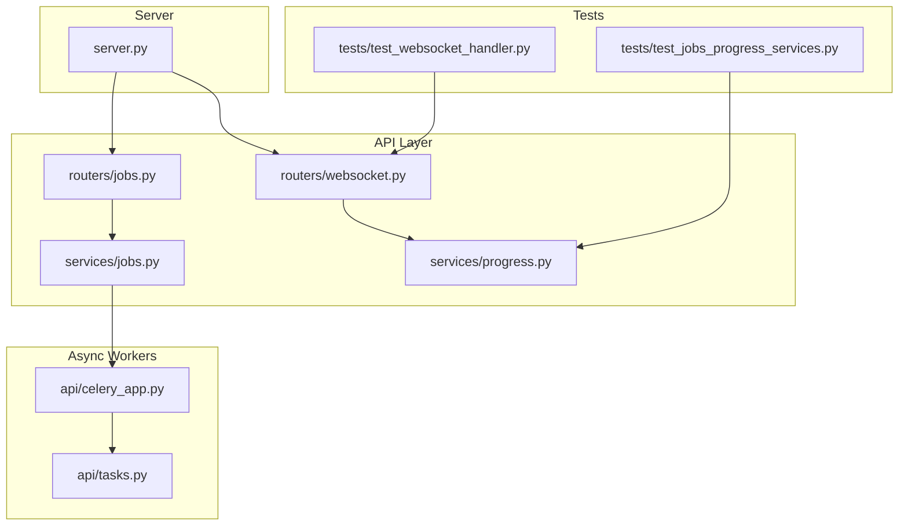
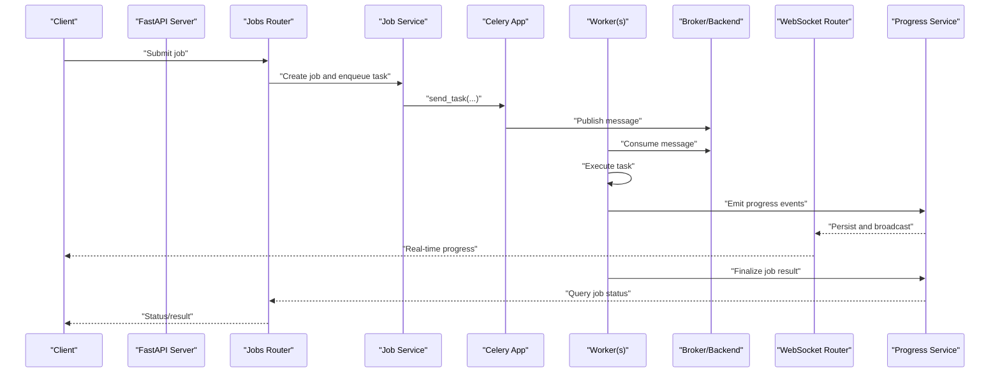
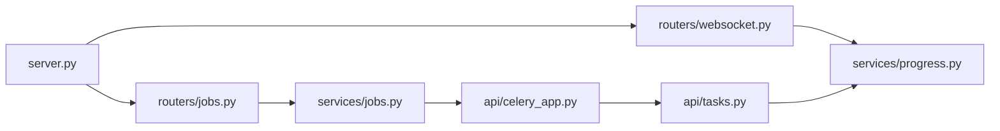

# Background Job Management

<cite>
**Referenced Files in This Document**
- [celery_app.py](file://src/local_deepl/api/celery_app.py)
- [tasks.py](file://src/local_deepl/api/tasks.py)
- [jobs.py](file://src/local_deepl/api/routers/jobs.py)
- [websocket.py](file://src/local_deepl/api/routers/websocket.py)
- [progress.py](file://src/local_deepl/api/services/progress.py)
- [jobs_service.py](file://src/local_deepl/api/services/jobs.py)
- [server.py](file://src/local_deepl/server.py)
- [test_websocket_handler.py](file://tests/test_websocket_handler.py)
- [test_jobs_progress_services.py](file://tests/test_jobs_progress_services.py)
</cite>

## Table of Contents
1. [Introduction](#introduction)
2. [Project Structure](#project-structure)
3. [Core Components](#core-components)
4. [Architecture Overview](#architecture-overview)
5. [Detailed Component Analysis](#detailed-component-analysis)
6. [Dependency Analysis](#dependency-analysis)
7. [Performance Considerations](#performance-considerations)
8. [Troubleshooting Guide](#troubleshooting-guide)
9. [Conclusion](#conclusion)
10. [Appendices](#appendices)

## Introduction
This document explains LocalDeepL’s background job management system for asynchronous, long-running document processing. It covers the Celery-based architecture, job queuing and prioritization, worker scaling, job lifecycle management, progress tracking via WebSocket, error recovery, retry logic, resource cleanup, configuration examples, monitoring, debugging failed jobs, performance tuning, memory management, and distributed processing considerations.

## Project Structure
The background job subsystem is implemented under the API layer with clear separation between:
- Celery application and task definitions
- HTTP routers to submit and query jobs
- WebSocket router for real-time progress updates
- Services encapsulating job orchestration and progress state
- Tests validating WebSocket and progress behavior

**Diagram sources**
- [server.py](file://src/local_deepl/server.py)
- [jobs.py](file://src/local_deepl/api/routers/jobs.py)
- [websocket.py](file://src/local_deepl/api/routers/websocket.py)
- [jobs_service.py](file://src/local_deepl/api/services/jobs.py)
- [progress.py](file://src/local_deepl/api/services/progress.py)
- [celery_app.py](file://src/local_deepl/api/celery_app.py)
- [tasks.py](file://src/local_deepl/api/tasks.py)
- [test_websocket_handler.py](file://tests/test_websocket_handler.py)
- [test_jobs_progress_services.py](file://tests/test_jobs_progress_services.py)

**Section sources**
- [server.py](file://src/local_deepl/server.py)
- [jobs.py](file://src/local_deepl/api/routers/jobs.py)
- [websocket.py](file://src/local_deepl/api/routers/websocket.py)
- [jobs_service.py](file://src/local_deepl/api/services/jobs.py)
- [progress.py](file://src/local_deepl/api/services/progress.py)
- [celery_app.py](file://src/local_deepl/api/celery_app.py)
- [tasks.py](file://src/local_deepl/api/tasks.py)
- [test_websocket_handler.py](file://tests/test_websocket_handler.py)
- [test_jobs_progress_services.py](file://tests/test_jobs_progress_services.py)

## Core Components
- Celery app initialization and worker configuration
- Task definitions for long-running document processing
- Job submission and status APIs
- WebSocket endpoint for live progress events
- Progress service for event persistence and retrieval
- Job service for orchestrating tasks and coordinating state

Key responsibilities:
- Decouple heavy work from the web server using Celery workers
- Provide durable job state and real-time progress updates
- Support retries, prioritization, and graceful resource cleanup
- Enable horizontal scaling by running multiple workers

**Section sources**
- [celery_app.py](file://src/local_deepl/api/celery_app.py)
- [tasks.py](file://src/local_deepl/api/tasks.py)
- [jobs.py](file://src/local_deepl/api/routers/jobs.py)
- [websocket.py](file://src/local_deepl/api/routers/websocket.py)
- [progress.py](file://src/local_deepl/api/services/progress.py)
- [jobs_service.py](file://src/local_deepl/api/services/jobs.py)

## Architecture Overview
LocalDeepL uses a producer-consumer pattern:
- The FastAPI server (producer) enqueues tasks via Celery
- One or more Celery workers (consumers) execute tasks asynchronously
- A shared backend stores job metadata and progress events
- Clients subscribe to WebSocket events for real-time updates

**Diagram sources**
- [jobs.py](file://src/local_deepl/api/routers/jobs.py)
- [jobs_service.py](file://src/local_deepl/api/services/jobs.py)
- [celery_app.py](file://src/local_deepl/api/celery_app.py)
- [tasks.py](file://src/local_deepl/api/tasks.py)
- [websocket.py](file://src/local_deepl/api/routers/websocket.py)
- [progress.py](file://src/local_deepl/api/services/progress.py)

## Detailed Component Analysis

### Celery Application and Worker Configuration
Responsibilities:
- Initialize Celery app with broker and backend URLs
- Configure concurrency, prefetch multiplier, and serialization
- Set up task routing and queue names for prioritization
- Define worker autoscaling parameters and soft/hard time limits

Operational notes:
- Use separate queues for high/normal/low priority tasks
- Tune prefetch and concurrency based on CPU-bound vs I/O-bound workloads
- Ensure broker and backend are highly available for production

Configuration examples:
- Broker URL and backend URL
- Concurrency and prefetch settings
- Queue names and routing keys
- Time limits and retry policies

**Section sources**
- [celery_app.py](file://src/local_deepl/api/celery_app.py)

### Task Definitions and Lifecycle
Responsibilities:
- Define Celery tasks for document processing steps
- Implement idempotency and checkpointing where possible
- Emit structured progress events at key milestones
- Handle exceptions and trigger retries with backoff

Lifecycle stages:
- Enqueued -> Started -> Processing -> Completed/Failed
- Progress events emitted during processing
- Final state persisted upon completion or failure

Retry and error handling:
- Exponential backoff with jitter for transient errors
- Max retries and dead-letter handling for persistent failures
- Cleanup of temporary resources on failure paths

**Section sources**
- [tasks.py](file://src/local_deepl/api/tasks.py)

### Job Submission and Status APIs
Responsibilities:
- Accept job submissions with required inputs and options
- Assign unique job IDs and initial status
- Provide endpoints to poll job status and results
- Integrate with progress service for consistent state

Prioritization:
- Map client-specified priorities to Celery queues
- Route tasks accordingly for fair scheduling

**Section sources**
- [jobs.py](file://src/local_deepl/api/routers/jobs.py)
- [jobs_service.py](file://src/local_deepl/api/services/jobs.py)

### WebSocket Progress Streaming
Responsibilities:
- Maintain per-job WebSocket connections
- Broadcast structured progress events to subscribers
- Handle connection lifecycle and reconnection scenarios

Event model:
- Event types include start, step, complete, fail
- Payload includes job ID, percentage, and optional details

**Section sources**
- [websocket.py](file://src/local_deepl/api/routers/websocket.py)
- [progress.py](file://src/local_deepl/api/services/progress.py)
- [test_websocket_handler.py](file://tests/test_websocket_handler.py)

### Progress Service
Responsibilities:
- Persist progress events and job states
- Provide read APIs for clients and workers
- Ensure thread-safe writes and efficient reads

Design patterns:
- Append-only event log for progress
- Latest snapshot cache for fast status queries

**Section sources**
- [progress.py](file://src/local_deepl/api/services/progress.py)
- [test_jobs_progress_services.py](file://tests/test_jobs_progress_services.py)

### Job Service Orchestration
Responsibilities:
- Validate inputs and create job records
- Enqueue tasks with appropriate queues and options
- Coordinate finalization and cleanup

Integration points:
- Calls Celery app to dispatch tasks
- Uses progress service to emit and track events

**Section sources**
- [jobs_service.py](file://src/local_deepl/api/services/jobs.py)

### Server Integration
Responsibilities:
- Mount routers and configure lifespan hooks
- Start/stop services and ensure clean shutdown

**Section sources**
- [server.py](file://src/local_deepl/server.py)

## Dependency Analysis
High-level dependencies among components:

**Diagram sources**
- [jobs.py](file://src/local_deepl/api/routers/jobs.py)
- [jobs_service.py](file://src/local_deepl/api/services/jobs.py)
- [celery_app.py](file://src/local_deepl/api/celery_app.py)
- [tasks.py](file://src/local_deepl/api/tasks.py)
- [websocket.py](file://src/local_deepl/api/routers/websocket.py)
- [progress.py](file://src/local_deepl/api/services/progress.py)
- [server.py](file://src/local_deepl/server.py)

**Section sources**
- [jobs.py](file://src/local_deepl/api/routers/jobs.py)
- [jobs_service.py](file://src/local_deepl/api/services/jobs.py)
- [celery_app.py](file://src/local_deepl/api/celery_app.py)
- [tasks.py](file://src/local_deepl/api/tasks.py)
- [websocket.py](file://src/local_deepl/api/routers/websocket.py)
- [progress.py](file://src/local_deepl/api/services/progress.py)
- [server.py](file://src/local_deepl/server.py)

## Performance Considerations
- Worker scaling
  - Run multiple workers per host; scale horizontally across hosts
  - Use separate queues for priority tiers; monitor queue depths
- Concurrency and prefetch
  - Adjust concurrency and prefetch multiplier based on workload type
  - For CPU-bound tasks, set concurrency close to CPU cores; for I/O-bound, increase concurrency
- Memory management
  - Limit task payload sizes; stream large files when possible
  - Periodically restart workers to reclaim memory fragmentation
- Timeouts and retries
  - Set soft and hard time limits; implement exponential backoff
  - Use idempotent operations and checkpoints to resume efficiently
- Broker and backend
  - Choose a reliable broker (e.g., Redis/RabbitMQ) and backend (e.g., Redis/DB)
  - Monitor broker lag and backend latency
- Observability
  - Track metrics: queue lengths, task duration, success/failure rates
  - Log structured events including job IDs and timestamps

[No sources needed since this section provides general guidance]

## Troubleshooting Guide
Common issues and diagnostics:
- Stuck or slow jobs
  - Inspect worker logs and task execution times
  - Check queue depth and consumer lag
- Failed jobs and retries
  - Review retry counts and backoff intervals
  - Identify transient vs permanent failures
- WebSocket connectivity
  - Verify client subscriptions and event delivery
  - Confirm progress events are persisted and retrievable
- Resource leaks
  - Ensure cleanup of temporary files and handles on all paths
  - Monitor worker memory growth over time

Debugging steps:
- Query job status via API
- Subscribe to WebSocket for real-time events
- Inspect progress events and final result payloads
- Reproduce with smaller inputs and enable verbose logging

**Section sources**
- [test_websocket_handler.py](file://tests/test_websocket_handler.py)
- [test_jobs_progress_services.py](file://tests/test_jobs_progress_services.py)

## Conclusion
LocalDeepL’s background job system decouples long-running document processing from the web server using Celery, providing robust job lifecycle management, real-time progress via WebSocket, and scalable worker deployment. With careful configuration of queues, concurrency, retries, and observability, it supports both local development and distributed production environments.

[No sources needed since this section summarizes without analyzing specific files]

## Appendices

### Configuration Examples
- Broker and backend URLs
- Worker concurrency and prefetch multipliers
- Queue names and routing keys for prioritization
- Time limits and retry policies
- Autoscaling parameters

[No sources needed since this section provides general guidance]

### Monitoring Setup
- Metrics collection for queues, tasks, and workers
- Alerting on queue backlog and failure rates
- Dashboards for throughput and latency

[No sources needed since this section provides general guidance]

### Debugging Failed Jobs
- Retrieve last error and stack trace
- Replay with minimal inputs
- Inspect intermediate artifacts and progress snapshots

[No sources needed since this section provides general guidance]