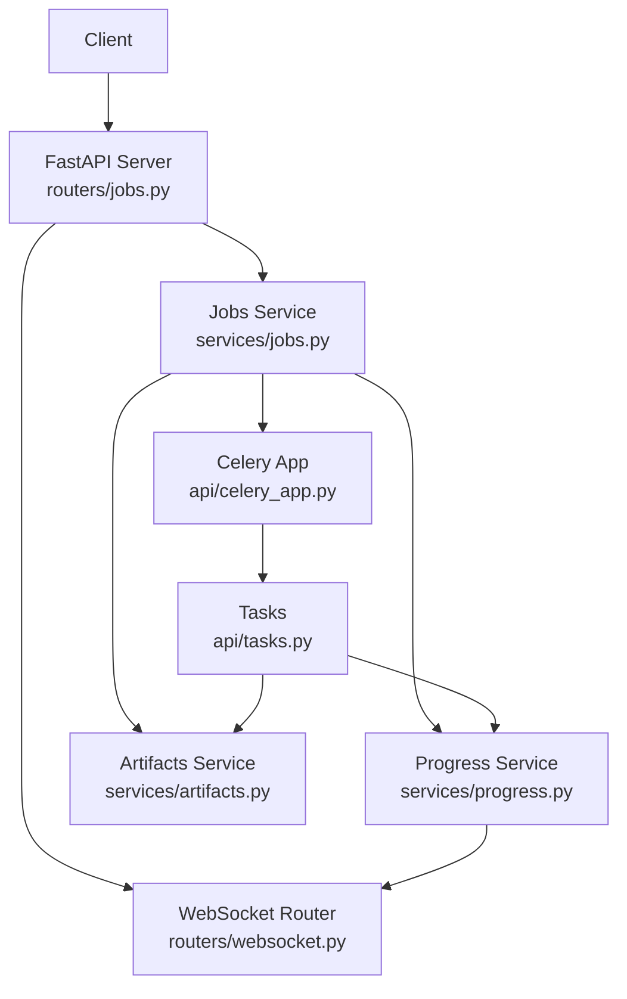
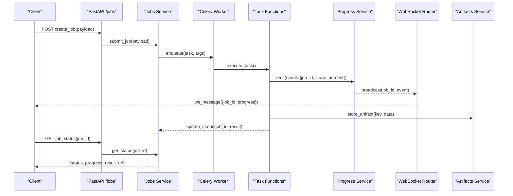
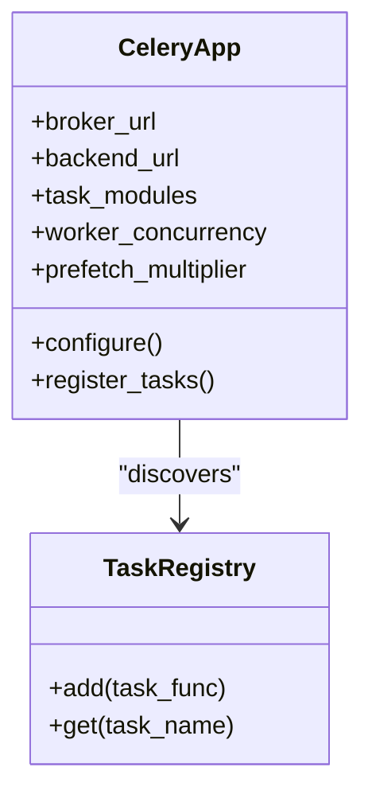
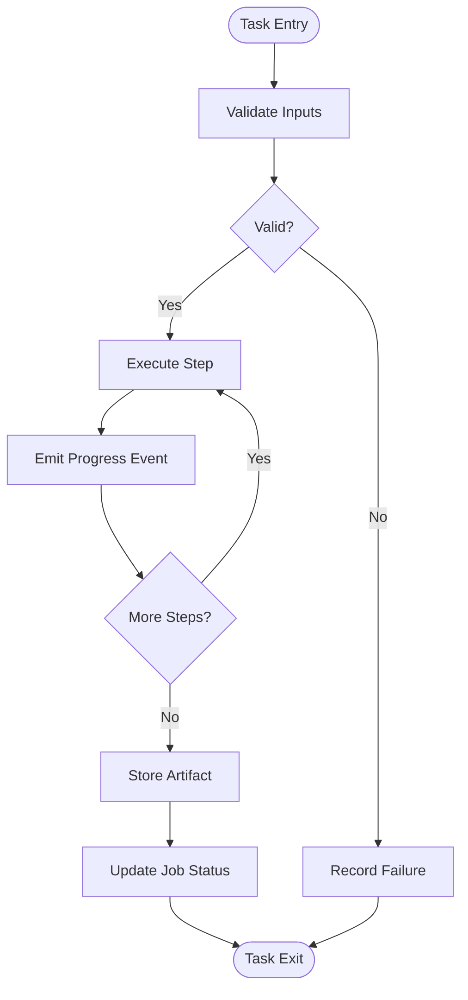
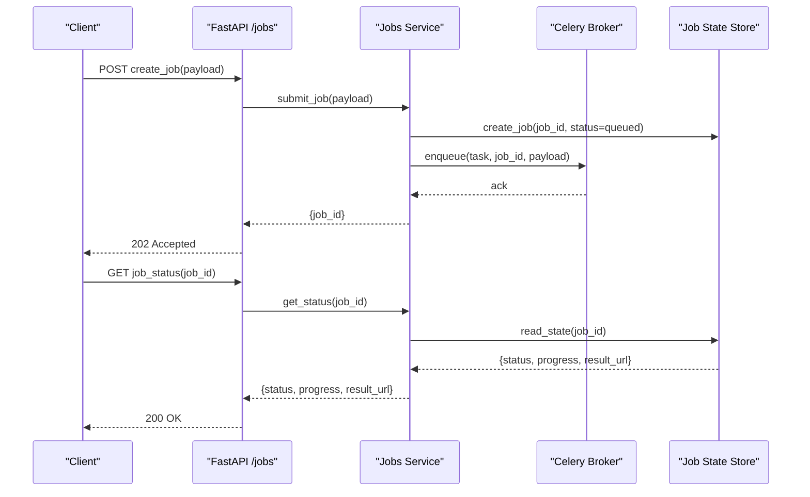
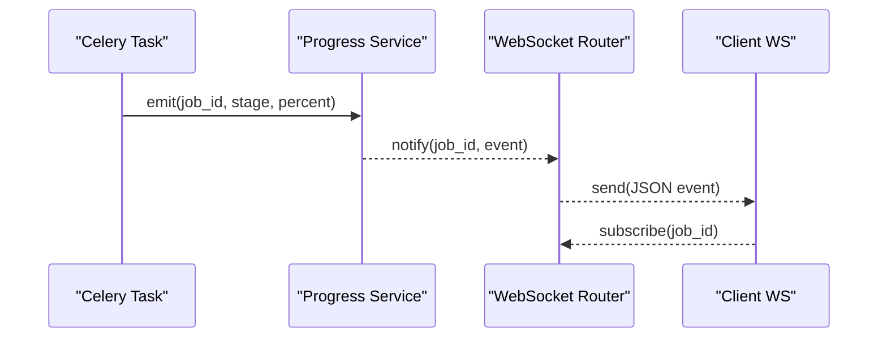
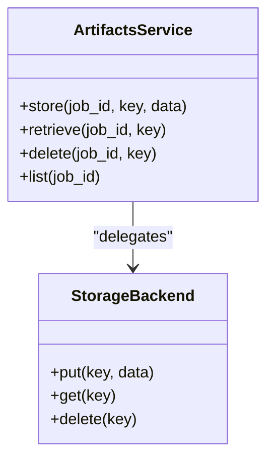
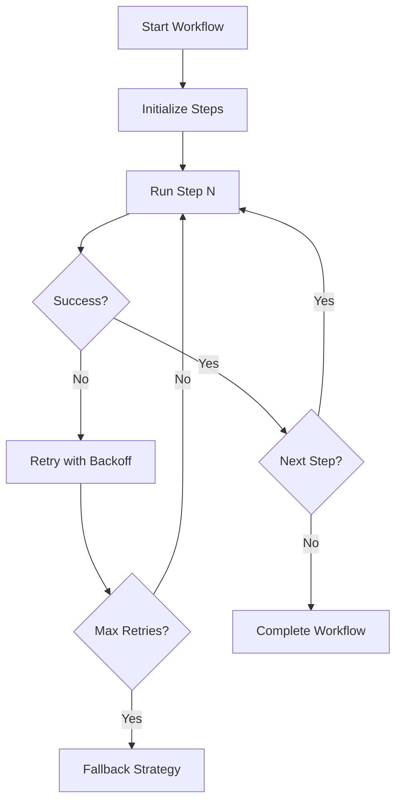
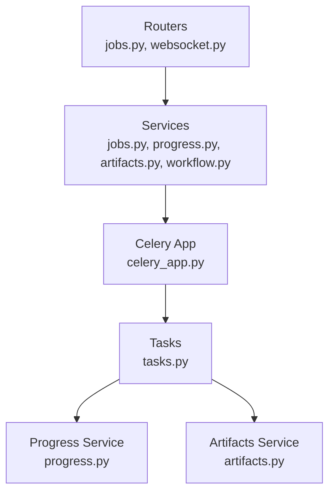

# Background Job Processing

<cite>
**Referenced Files in This Document**
- [celery_app.py](file://src/local_deepl/api/celery_app.py)
- [tasks.py](file://src/local_deepl/api/tasks.py)
- [jobs.py](file://src/local_deepl/api/routers/jobs.py)
- [jobs_service.py](file://src/local_deepl/api/services/jobs.py)
- [progress_service.py](file://src/local_deepl/api/services/progress.py)
- [websocket_router.py](file://src/local_deepl/api/routers/websocket.py)
- [artifacts_service.py](file://src/local_deepl/api/services/artifacts.py)
- [workflow_service.py](file://src/local_deepl/api/services/workflow.py)
- [server.py](file://src/local_deepl/server.py)
- [pyproject.toml](file://pyproject.toml)
- [test_jobs_progress_services.py](file://tests/test_jobs_progress_services.py)
- [test_websocket_handler.py](file://tests/test_websocket_handler.py)
</cite>

## Table of Contents
1. [Introduction](#introduction)
2. [Project Structure](#project-structure)
3. [Core Components](#core-components)
4. [Architecture Overview](#architecture-overview)
5. [Detailed Component Analysis](#detailed-component-analysis)
6. [Dependency Analysis](#dependency-analysis)
7. [Performance Considerations](#performance-considerations)
8. [Troubleshooting Guide](#troubleshooting-guide)
9. [Conclusion](#conclusion)
10. [Appendices](#appendices)

## Introduction
This document explains the background job processing system used by the application to execute long-running or CPU-intensive tasks asynchronously. It covers Celery integration, task lifecycle management, queue configuration, and the job service layer for creating, monitoring, and retrieving results. It also documents how WebSocket progress updates are integrated with job execution and how artifacts are stored and retrieved. Practical examples from the codebase illustrate job submission, status checking, and result handling. Finally, it provides guidance on worker scaling, retry policies, monitoring, debugging techniques, performance optimization, and building custom multi-step workflows with robust error handling and recovery.

## Project Structure
The background job subsystem is implemented under the API module and integrates with the FastAPI server. Key files include:
- Celery app initialization and configuration
- Task definitions for background work
- REST endpoints for job operations
- Service layer for job orchestration and state management
- Progress tracking via events and WebSocket broadcasting
- Artifact storage services
- Workflow utilities for complex multi-step jobs

**Diagram sources**
- [jobs.py](file://src/local_deepl/api/routers/jobs.py)
- [jobs_service.py](file://src/local_deepl/api/services/jobs.py)
- [celery_app.py](file://src/local_deepl/api/celery_app.py)
- [tasks.py](file://src/local_deepl/api/tasks.py)
- [progress_service.py](file://src/local_deepl/api/services/progress.py)
- [artifacts_service.py](file://src/local_deepl/api/services/artifacts.py)
- [websocket_router.py](file://src/local_deepl/api/routers/websocket.py)

**Section sources**
- [server.py](file://src/local_deepl/server.py)
- [pyproject.toml](file://pyproject.toml)

## Core Components
- Celery Application: Initializes and configures the Celery worker process, including broker/backend settings and task discovery.
- Tasks: Define asynchronous functions that perform actual work (e.g., OCR, translation, artifact generation).
- Jobs Service: Provides APIs to submit jobs, poll status, retrieve results, and manage lifecycle states.
- Progress Service: Publishes and consumes progress events, enabling real-time updates over WebSockets.
- WebSocket Router: Manages WebSocket connections and broadcasts progress updates to clients.
- Artifacts Service: Stores and retrieves job-related artifacts such as outputs, logs, and intermediate data.
- Workflow Service: Orchestrates multi-step jobs using reusable steps and handles retries and error propagation.

**Section sources**
- [celery_app.py](file://src/local_deepl/api/celery_app.py)
- [tasks.py](file://src/local_deepl/api/tasks.py)
- [jobs_service.py](file://src/local_deepl/api/services/jobs.py)
- [progress_service.py](file://src/local_deepl/api/services/progress.py)
- [websocket_router.py](file://src/local_deepl/api/routers/websocket.py)
- [artifacts_service.py](file://src/local_deepl/api/services/artifacts.py)
- [workflow_service.py](file://src/local_deepl/api/services/workflow.py)

## Architecture Overview
The system follows a decoupled architecture where the FastAPI server exposes REST endpoints for job control and WebSocket endpoints for live progress. Celery workers execute tasks asynchronously, publishing progress events consumed by the progress service and broadcasted to connected clients. Artifacts are persisted through an artifacts service, which can be backed by local filesystem or object storage.

**Diagram sources**
- [jobs.py](file://src/local_deepl/api/routers/jobs.py)
- [jobs_service.py](file://src/local_deepl/api/services/jobs.py)
- [celery_app.py](file://src/local_deepl/api/celery_app.py)
- [tasks.py](file://src/local_deepl/api/tasks.py)
- [progress_service.py](file://src/local_deepl/api/services/progress.py)
- [websocket_router.py](file://src/local_deepl/api/routers/websocket.py)
- [artifacts_service.py](file://src/local_deepl/api/services/artifacts.py)

## Detailed Component Analysis

### Celery Integration
- Initialization: The Celery app is configured with broker and backend URLs, task modules, and concurrency settings.
- Task Discovery: Tasks are registered under the Celery app so workers can load them at startup.
- Queue Configuration: Separate queues can be defined for different workload types (e.g., high-priority vs background).
- Worker Scaling: Concurrency and prefetch multiplier are tuned based on CPU/memory constraints and I/O characteristics.

**Diagram sources**
- [celery_app.py](file://src/local_deepl/api/celery_app.py)

**Section sources**
- [celery_app.py](file://src/local_deepl/api/celery_app.py)

### Task Definitions
- Task Functions: Each background operation is wrapped as a Celery task with explicit inputs and outputs.
- Retry Policies: Tasks define retry strategies with exponential backoff and maximum attempts.
- Error Handling: Tasks catch exceptions, record failure reasons, and mark jobs accordingly.
- Progress Emission: Tasks publish incremental progress events to the progress service.

**Diagram sources**
- [tasks.py](file://src/local_deepl/api/tasks.py)
- [progress_service.py](file://src/local_deepl/api/services/progress.py)
- [artifacts_service.py](file://src/local_deepl/api/services/artifacts.py)

**Section sources**
- [tasks.py](file://src/local_deepl/api/tasks.py)

### Jobs Service Layer
- Job Creation: Accepts payloads, validates them, enqueues tasks via Celery, and returns a job identifier.
- Status Monitoring: Retrieves current job state, progress percentage, and any partial results.
- Result Retrieval: Returns final results or links to stored artifacts.
- Lifecycle Management: Transitions between states like queued, running, completed, failed, and cancelled.

**Diagram sources**
- [jobs.py](file://src/local_deepl/api/routers/jobs.py)
- [jobs_service.py](file://src/local_deepl/api/services/jobs.py)

**Section sources**
- [jobs.py](file://src/local_deepl/api/routers/jobs.py)
- [jobs_service.py](file://src/local_deepl/api/services/jobs.py)

### Progress Service and WebSocket Updates
- Event Publishing: Tasks call the progress service to emit structured events containing job identifiers, stages, and percentages.
- Event Consumption: The progress service maintains per-job progress maps and notifies subscribers.
- WebSocket Broadcasting: The router manages client connections and forwards progress events to relevant clients.

**Diagram sources**
- [progress_service.py](file://src/local_deepl/api/services/progress.py)
- [websocket_router.py](file://src/local_deepl/api/routers/websocket.py)
- [tasks.py](file://src/local_deepl/api/tasks.py)

**Section sources**
- [progress_service.py](file://src/local_deepl/api/services/progress.py)
- [websocket_router.py](file://src/local_deepl/api/routers/websocket.py)

### Artifact Storage
- Storage Abstraction: The artifacts service encapsulates storage operations, supporting multiple backends.
- Job Association: Artifacts are linked to job IDs for retrieval and cleanup.
- Access Patterns: Upload during task execution; download via REST endpoints after completion.

**Diagram sources**
- [artifacts_service.py](file://src/local_deepl/api/services/artifacts.py)

**Section sources**
- [artifacts_service.py](file://src/local_deepl/api/services/artifacts.py)

### Workflow Service for Multi-Step Jobs
- Step Orchestration: Defines ordered steps with dependencies and conditional branching.
- Error Recovery: Implements retries per step and fallback strategies.
- State Persistence: Persists workflow state to resume after failures.

**Diagram sources**
- [workflow_service.py](file://src/local_deepl/api/services/workflow.py)

**Section sources**
- [workflow_service.py](file://src/local_deepl/api/services/workflow.py)

## Dependency Analysis
The background job system has clear separation between API, services, and Celery workers. Dependencies are minimized through well-defined interfaces:
- Routers depend on services for business logic.
- Services depend on Celery for task execution and on storage/progress services for side effects.
- Tasks depend on progress and artifacts services for state and persistence.

**Diagram sources**
- [jobs.py](file://src/local_deepl/api/routers/jobs.py)
- [websocket_router.py](file://src/local_deepl/api/routers/websocket.py)
- [jobs_service.py](file://src/local_deepl/api/services/jobs.py)
- [progress_service.py](file://src/local_deepl/api/services/progress.py)
- [artifacts_service.py](file://src/local_deepl/api/services/artifacts.py)
- [workflow_service.py](file://src/local_deepl/api/services/workflow.py)
- [celery_app.py](file://src/local_deepl/api/celery_app.py)
- [tasks.py](file://src/local_deepl/api/tasks.py)

**Section sources**
- [jobs.py](file://src/local_deepl/api/routers/jobs.py)
- [jobs_service.py](file://src/local_deepl/api/services/jobs.py)
- [celery_app.py](file://src/local_deepl/api/celery_app.py)
- [tasks.py](file://src/local_deepl/api/tasks.py)

## Performance Considerations
- Worker Concurrency: Tune concurrency based on task type (CPU-bound vs I/O-bound). Use separate queues for different priorities.
- Prefetch Multiplier: Adjust to balance throughput and responsiveness; lower values reduce latency at the cost of throughput.
- Batch Processing: Where possible, batch small tasks to reduce overhead.
- Artifact Size: Stream large artifacts and avoid storing unnecessary intermediates.
- Monitoring: Integrate metrics and logging to identify bottlenecks and optimize resource usage.

[No sources needed since this section provides general guidance]

## Troubleshooting Guide
Common issues and debugging techniques:
- Task Not Executing: Verify Celery worker is running and broker connectivity is healthy. Check task registration and queue names.
- Stalled Progress: Ensure tasks emit progress events consistently and that the progress service persists updates.
- Failed Jobs: Inspect task logs and exception traces; validate retry policies and error handling paths.
- WebSocket Disconnections: Confirm subscription scopes and reconnection logic on the client side.
- Artifact Retrieval Failures: Validate storage backend permissions and key naming conventions.

Use tests to validate behavior:
- Job and progress service interactions
- WebSocket handler correctness

**Section sources**
- [test_jobs_progress_services.py](file://tests/test_jobs_progress_services.py)
- [test_websocket_handler.py](file://tests/test_websocket_handler.py)

## Conclusion
The background job processing system leverages Celery for reliable asynchronous execution, a robust service layer for lifecycle management, and WebSocket-based progress updates for real-time feedback. By separating concerns across routers, services, and tasks, the system remains scalable and maintainable. Proper configuration of workers, queues, and retry policies ensures resilience and performance. Following the guidance in this document will help you create custom tasks, implement complex workflows, and troubleshoot effectively.

[No sources needed since this section summarizes without analyzing specific files]

## Appendices

### Creating Custom Background Tasks
- Define a new task function and register it with the Celery app.
- Include input validation and error handling.
- Emit progress events at meaningful milestones.
- Store artifacts as needed and update job status upon completion.

**Section sources**
- [tasks.py](file://src/local_deepl/api/tasks.py)
- [celery_app.py](file://src/local_deepl/api/celery_app.py)

### Implementing Complex Multi-Step Workflows
- Use the workflow service to orchestrate steps with dependencies.
- Persist workflow state to support resumption after failures.
- Implement per-step retry policies and fallback strategies.

**Section sources**
- [workflow_service.py](file://src/local_deepl/api/services/workflow.py)

### Configuration Options
- Worker Scaling: Set concurrency and prefetch multiplier in the Celery app configuration.
- Retry Policies: Configure max_retries and backoff_factor in task definitions.
- Monitoring: Enable logging and integrate with external monitoring tools as needed.

**Section sources**
- [celery_app.py](file://src/local_deepl/api/celery_app.py)
- [tasks.py](file://src/local_deepl/api/tasks.py)