# Core Processing Engine

<cite>
**Referenced Files in This Document**
- [pipeline.py](file://src/local_deepl/pipeline.py)
- [core/document.py](file://src/local_deepl/core/document.py)
- [core/preprocessing.py](file://src/local_deepl/core/preprocessing.py)
- [core/ocr/processor.py](file://src/local_deepl/core/ocr/processor.py)
- [core/workflows/base.py](file://src/local_deepl/core/workflows/base.py)
- [core/workflows/grounded.py](file://src/local_deepl/core/workflows/grounded.py)
- [core/workflows/hybrid.py](file://src/local_deepl/core/workflows/hybrid.py)
- [api/services/ocr_pipeline_factory.py](file://src/local_deepl/api/services/ocr_pipeline_factory.py)
- [api/services/workflow.py](file://src/local_deepl/api/services/workflow.py)
- [core/callbacks.py](file://src/local_deepl/core/callbacks.py)
- [core/postprocess.py](file://src/local_deepl/core/postprocess.py)
- [core/docx_writer.py](file://src/local_deepl/core/docx_writer.py)
- [core/html_writer.py](file://src/local_deepl/core/html_writer.py)
- [core/tree_export.py](file://src/local_deepl/core/tree_export.py)
- [core/routing.py](file://src/local_deepl/core/routing.py)
- [core/pdf.py](file://src/local_deepl/core/pdf.py)
- [core/block_tree.py](file://src/local_deepl/core/block_tree.py)
- [core/aligner.py](file://src/local_deepl/core/aligner.py)
- [core/glossary.py](file://src/local_deepl/core/glossary.py)
- [core/dual_translator.py](file://src/local_deepl/core/dual_translator.py)
- [core/translation_config.py](file://src/local_deepl/core/translation_config.py)
- [core/llm_client.py](file://src/local_deepl/core/llm_client.py)
- [core/nllb_engine.py](file://src/local_deepl/core/nllb_engine.py)
- [core/trocr_engine.py](file://src/local_deepl/core/trocr_engine.py)
- [core/handwriting_preprocessor.py](file://src/local_deepl/core/handwriting_preprocessor.py)
- [api/tasks.py](file://src/local_deepl/api/tasks.py)
- [api/celery_app.py](file://src/local_deepl/api/celery_app.py)
</cite>

## Table of Contents
1. [Introduction](#introduction)
2. [Project Structure](#project-structure)
3. [Core Components](#core-components)
4. [Architecture Overview](#architecture-overview)
5. [Detailed Component Analysis](#detailed-component-analysis)
6. [Dependency Analysis](#dependency-analysis)
7. [Performance Considerations](#performance-considerations)
8. [Troubleshooting Guide](#troubleshooting-guide)
9. [Conclusion](#conclusion)
10. [Appendices](#appendices)

## Introduction
This document explains LocalDeepL’s core processing engine with a focus on document processing pipelines and workflow orchestration. It covers the end-to-end flow from input validation through format detection, preprocessing, OCR extraction, translation, alignment, and output generation. It also documents the pluggable processor architecture, grounded vs hybrid workflow strategies, error handling, pipeline pattern implementation, callback systems, progress tracking, performance optimization, memory management, and batch processing capabilities.

## Project Structure
The core processing engine is implemented under src/local_deepl/core and exposed via API services and Celery tasks for asynchronous execution. The key modules include:
- Pipeline orchestration and routing
- Document model and block tree representation
- Preprocessing and OCR processors
- Workflow strategies (base, grounded, hybrid)
- Postprocessing and export writers
- Callbacks and progress tracking
- Translation engines and configuration
- Asynchronous task execution

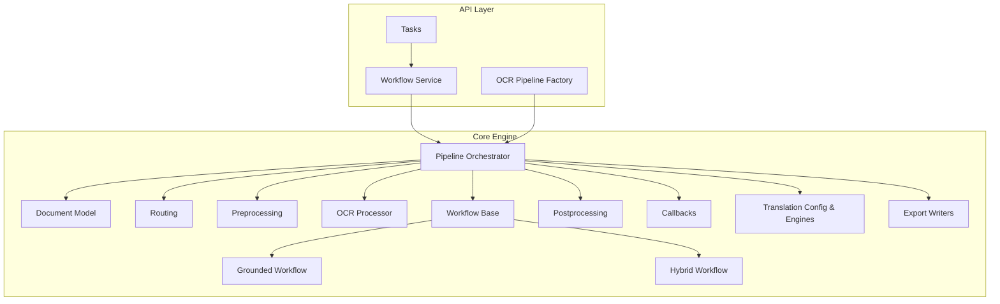

**Diagram sources**
- [api/tasks.py](file://src/local_deepl/api/tasks.py)
- [api/services/workflow.py](file://src/local_deepl/api/services/workflow.py)
- [api/services/ocr_pipeline_factory.py](file://src/local_deepl/api/services/ocr_pipeline_factory.py)
- [pipeline.py](file://src/local_deepl/pipeline.py)
- [core/document.py](file://src/local_deepl/core/document.py)
- [core/routing.py](file://src/local_deepl/core/routing.py)
- [core/preprocessing.py](file://src/local_deepl/core/preprocessing.py)
- [core/ocr/processor.py](file://src/local_deepl/core/ocr/processor.py)
- [core/workflows/base.py](file://src/local_deepl/core/workflows/base.py)
- [core/workflows/grounded.py](file://src/local_deepl/core/workflows/grounded.py)
- [core/workflows/hybrid.py](file://src/local_deepl/core/workflows/hybrid.py)
- [core/postprocess.py](file://src/local_deepl/core/postprocess.py)
- [core/callbacks.py](file://src/local_deepl/core/callbacks.py)
- [core/translation_config.py](file://src/local_deepl/core/translation_config.py)
- [core/docx_writer.py](file://src/local_deepl/core/docx_writer.py)
- [core/html_writer.py](file://src/local_deepl/core/html_writer.py)
- [core/tree_export.py](file://src/local_deepl/core/tree_export.py)

**Section sources**
- [pipeline.py](file://src/local_deepl/pipeline.py)
- [core/document.py](file://src/local_deepl/core/document.py)
- [core/routing.py](file://src/local_deepl/core/routing.py)
- [core/preprocessing.py](file://src/local_deepl/core/preprocessing.py)
- [core/ocr/processor.py](file://src/local_deepl/core/ocr/processor.py)
- [core/workflows/base.py](file://src/local_deepl/core/workflows/base.py)
- [core/workflows/grounded.py](file://src/local_deepl/core/workflows/grounded.py)
- [core/workflows/hybrid.py](file://src/local_deepl/core/workflows/hybrid.py)
- [core/postprocess.py](file://src/local_deepl/core/postprocess.py)
- [core/callbacks.py](file://src/local_deepl/core/callbacks.py)
- [core/translation_config.py](file://src/local_deepl/core/translation_config.py)
- [core/docx_writer.py](file://src/local_deepl/core/docx_writer.py)
- [core/html_writer.py](file://src/local_deepl/core/html_writer.py)
- [core/tree_export.py](file://src/local_deepl/core/tree_export.py)
- [api/tasks.py](file://src/local_deepl/api/tasks.py)
- [api/services/workflow.py](file://src/local_deepl/api/services/workflow.py)
- [api/services/ocr_pipeline_factory.py](file://src/local_deepl/api/services/ocr_pipeline_factory.py)

## Core Components
- Pipeline orchestrator: coordinates stages, manages state, invokes callbacks, and handles errors.
- Document model: represents parsed content, blocks, and metadata; used across stages.
- Routing: selects appropriate processors based on file type and settings.
- Preprocessing: normalizes inputs, prepares images/PDFs, and applies optional handwriting preprocessor.
- OCR processor: abstracts OCR backends and integrates with LLM-based parsing when needed.
- Workflows: base strategy plus grounded and hybrid variants that differ in how text is extracted and aligned.
- Postprocessing: merges results, resolves conflicts, and finalizes structures.
- Export writers: generate DOCX, HTML, or structured tree artifacts.
- Callbacks and progress: decoupled event system to report stage completion and partial results.
- Translation subsystem: configuration, dual translator, and engines (NLLB, TROCR).
- Async execution: Celery app and tasks for background job processing.

**Section sources**
- [pipeline.py](file://src/local_deepl/pipeline.py)
- [core/document.py](file://src/local_deepl/core/document.py)
- [core/routing.py](file://src/local_deepl/core/routing.py)
- [core/preprocessing.py](file://src/local_deepl/core/preprocessing.py)
- [core/ocr/processor.py](file://src/local_deepl/core/ocr/processor.py)
- [core/workflows/base.py](file://src/local_deepl/core/workflows/base.py)
- [core/workflows/grounded.py](file://src/local_deepl/core/workflows/grounded.py)
- [core/workflows/hybrid.py](file://src/local_deepl/core/workflows/hybrid.py)
- [core/postprocess.py](file://src/local_deepl/core/postprocess.py)
- [core/docx_writer.py](file://src/local_deepl/core/docx_writer.py)
- [core/html_writer.py](file://src/local_deepl/core/html_writer.py)
- [core/tree_export.py](file://src/local_deepl/core/tree_export.py)
- [core/callbacks.py](file://src/local_deepl/core/callbacks.py)
- [core/translation_config.py](file://src/local_deepl/core/translation_config.py)
- [core/dual_translator.py](file://src/local_deepl/core/dual_translator.py)
- [core/nllb_engine.py](file://src/local_deepl/core/nllb_engine.py)
- [core/trocr_engine.py](file://src/local_deepl/core/trocr_engine.py)
- [api/tasks.py](file://src/local_deepl/api/tasks.py)
- [api/celery_app.py](file://src/local_deepl/api/celery_app.py)

## Architecture Overview
The processing engine follows a pipeline pattern with pluggable processors and strategy-based workflows. Input documents are validated and routed to the appropriate workflow. Each workflow composes stages such as preprocessing, OCR, translation, alignment, and postprocessing. Progress and events are emitted via callbacks, enabling real-time UI updates and external monitoring.

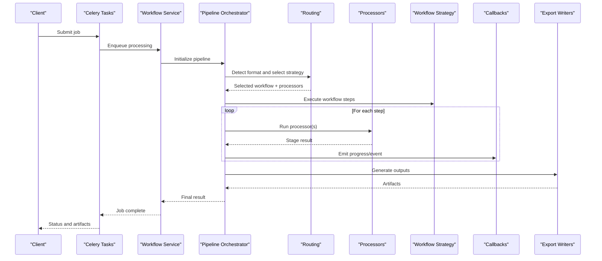

**Diagram sources**
- [api/tasks.py](file://src/local_deepl/api/tasks.py)
- [api/services/workflow.py](file://src/local_deepl/api/services/workflow.py)
- [pipeline.py](file://src/local_deepl/pipeline.py)
- [core/routing.py](file://src/local_deepl/core/routing.py)
- [core/workflows/base.py](file://src/local_deepl/core/workflows/base.py)
- [core/workflows/grounded.py](file://src/local_deepl/core/workflows/grounded.py)
- [core/workflows/hybrid.py](file://src/local_deepl/core/workflows/hybrid.py)
- [core/callbacks.py](file://src/local_deepl/core/callbacks.py)
- [core/docx_writer.py](file://src/local_deepl/core/docx_writer.py)
- [core/html_writer.py](file://src/local_deepl/core/html_writer.py)
- [core/tree_export.py](file://src/local_deepl/core/tree_export.py)

## Detailed Component Analysis

### Pipeline Orchestrator
Responsibilities:
- Initialize and manage lifecycle of processing stages
- Coordinate data passing between processors
- Invoke callbacks for progress and intermediate artifacts
- Handle errors and retries per stage
- Support both synchronous and asynchronous execution contexts

Key behaviors:
- Validates inputs and config before starting
- Selects workflow strategy via routing
- Iterates over ordered steps, capturing results and emitting events
- Aggregates outputs and delegates to exporters

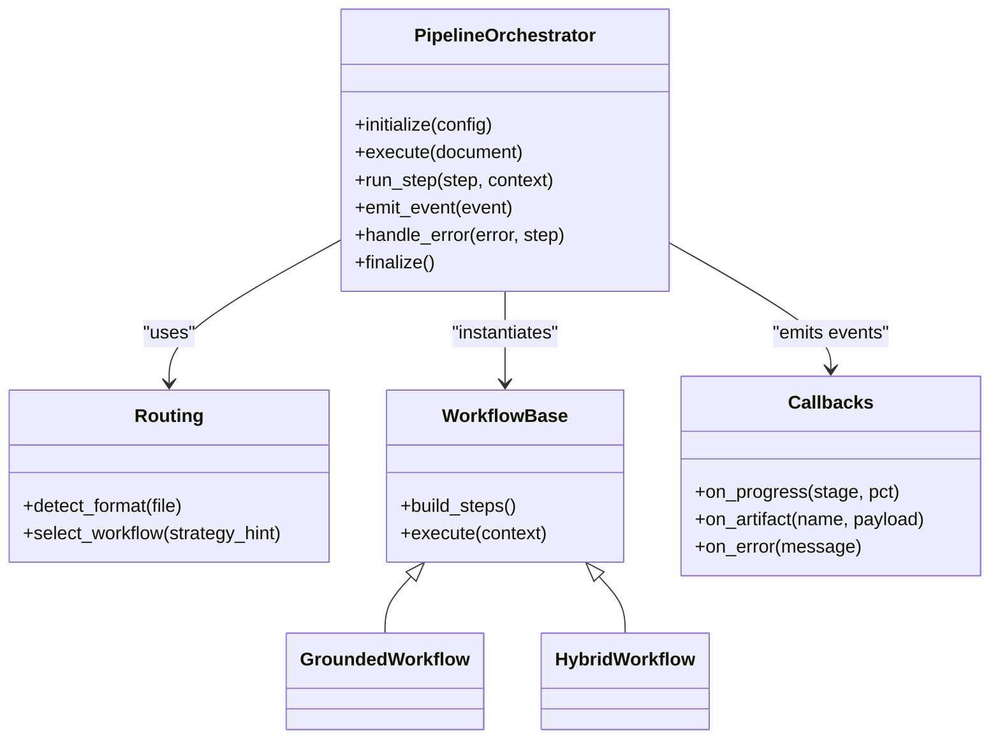

**Diagram sources**
- [pipeline.py](file://src/local_deepl/pipeline.py)
- [core/routing.py](file://src/local_deepl/core/routing.py)
- [core/workflows/base.py](file://src/local_deepl/core/workflows/base.py)
- [core/workflows/grounded.py](file://src/local_deepl/core/workflows/grounded.py)
- [core/workflows/hybrid.py](file://src/local_deepl/core/workflows/hybrid.py)
- [core/callbacks.py](file://src/local_deepl/core/callbacks.py)

**Section sources**
- [pipeline.py](file://src/local_deepl/pipeline.py)
- [core/routing.py](file://src/local_deepl/core/routing.py)
- [core/workflows/base.py](file://src/local_deepl/core/workflows/base.py)
- [core/workflows/grounded.py](file://src/local_deepl/core/workflows/grounded.py)
- [core/workflows/hybrid.py](file://src/local_deepl/core/workflows/hybrid.py)
- [core/callbacks.py](file://src/local_deepl/core/callbacks.py)

### Document Model and Block Tree
Responsibilities:
- Represent document structure, pages, blocks, and spans
- Provide utilities for traversal and transformation
- Maintain metadata and provenance information

Key relationships:
- Document contains pages and blocks
- Blocks contain spans and annotations
- Aligner maps source spans to target spans after translation

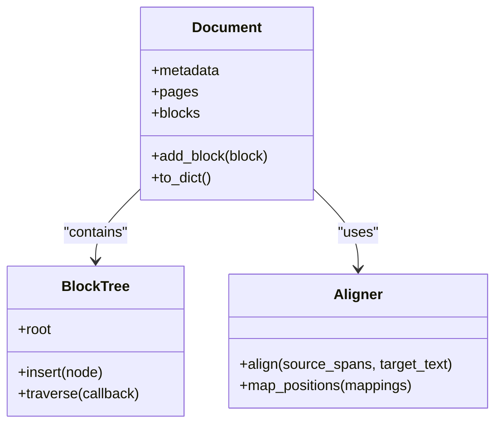

**Diagram sources**
- [core/document.py](file://src/local_deepl/core/document.py)
- [core/block_tree.py](file://src/local_deepl/core/block_tree.py)
- [core/aligner.py](file://src/local_deepl/core/aligner.py)

**Section sources**
- [core/document.py](file://src/local_deepl/core/document.py)
- [core/block_tree.py](file://src/local_deepl/core/block_tree.py)
- [core/aligner.py](file://src/local_deepl/core/aligner.py)

### Preprocessing and OCR
Responsibilities:
- Normalize inputs (PDF rasterization, image enhancement)
- Prepare content for OCR or direct text extraction
- Integrate OCR backends and LLM-based parsers

Processing logic:
- Format detection determines whether to use PDF-native text, OCR, or hybrid path
- Handwriting preprocessor can be applied for scanned or handwritten content
- OCR processor returns structured text with bounding boxes and confidence scores

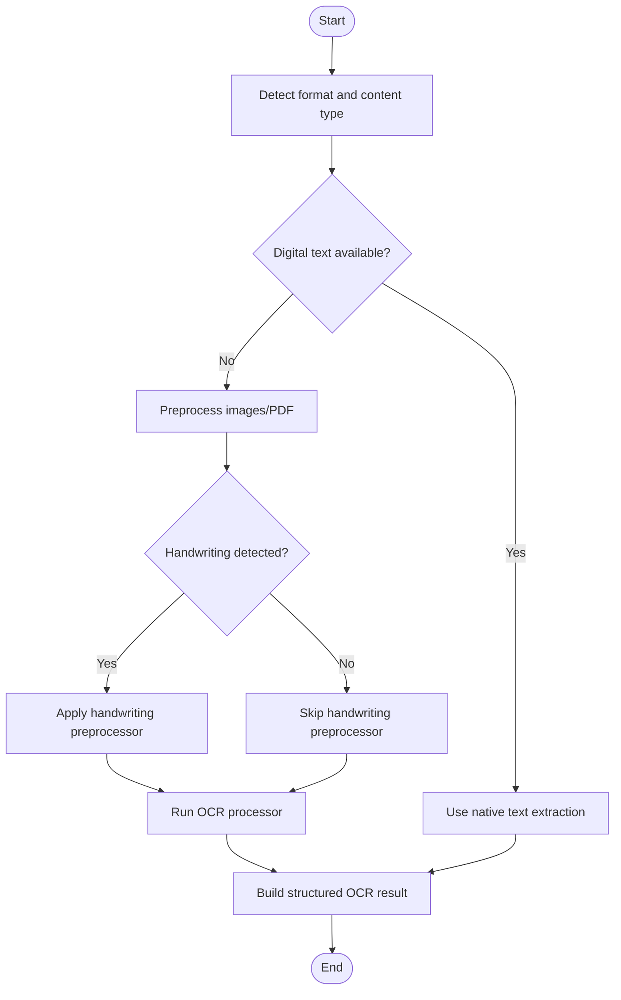

**Diagram sources**
- [core/preprocessing.py](file://src/local_deepl/core/preprocessing.py)
- [core/handwriting_preprocessor.py](file://src/local_deepl/core/handwriting_preprocessor.py)
- [core/ocr/processor.py](file://src/local_deepl/core/ocr/processor.py)
- [core/pdf.py](file://src/local_deepl/core/pdf.py)

**Section sources**
- [core/preprocessing.py](file://src/local_deepl/core/preprocessing.py)
- [core/handwriting_preprocessor.py](file://src/local_deepl/core/handwriting_preprocessor.py)
- [core/ocr/processor.py](file://src/local_deepl/core/ocr/processor.py)
- [core/pdf.py](file://src/local_deepl/core/pdf.py)

### Workflow Strategies: Grounded vs Hybrid
Responsibilities:
- Define ordering and composition of stages
- Decide when to rely on OCR vs native text
- Control alignment and translation integration points

Differences:
- Grounded workflow emphasizes strict grounding of translations to source positions using OCR-derived anchors
- Hybrid workflow blends native text where possible and falls back to OCR for missing or unreliable regions

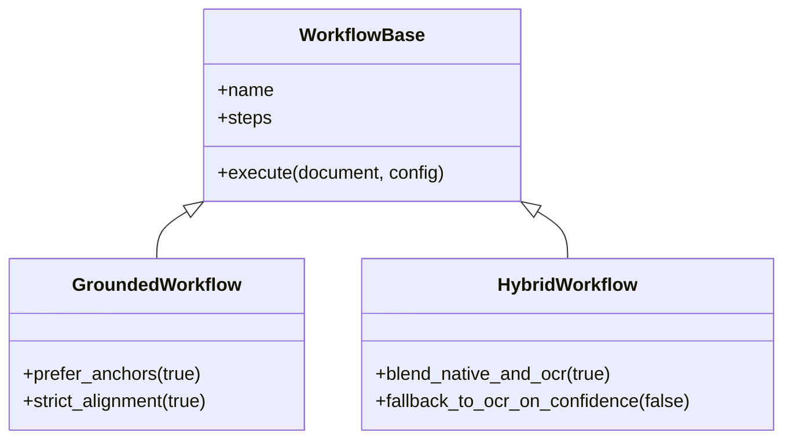

**Diagram sources**
- [core/workflows/base.py](file://src/local_deepl/core/workflows/base.py)
- [core/workflows/grounded.py](file://src/local_deepl/core/workflows/grounded.py)
- [core/workflows/hybrid.py](file://src/local_deepl/core/workflows/hybrid.py)

**Section sources**
- [core/workflows/base.py](file://src/local_deepl/core/workflows/base.py)
- [core/workflows/grounded.py](file://src/local_deepl/core/workflows/grounded.py)
- [core/workflows/hybrid.py](file://src/local_deepl/core/workflows/hybrid.py)

### Postprocessing and Output Generation
Responsibilities:
- Merge intermediate results, resolve overlaps, and finalize structures
- Write outputs to multiple formats (DOCX, HTML, tree artifacts)

Output writers:
- DOCX writer preserves layout and embedded artifacts
- HTML writer generates web-friendly representations
- Tree exporter serializes internal structures for inspection and downstream tools

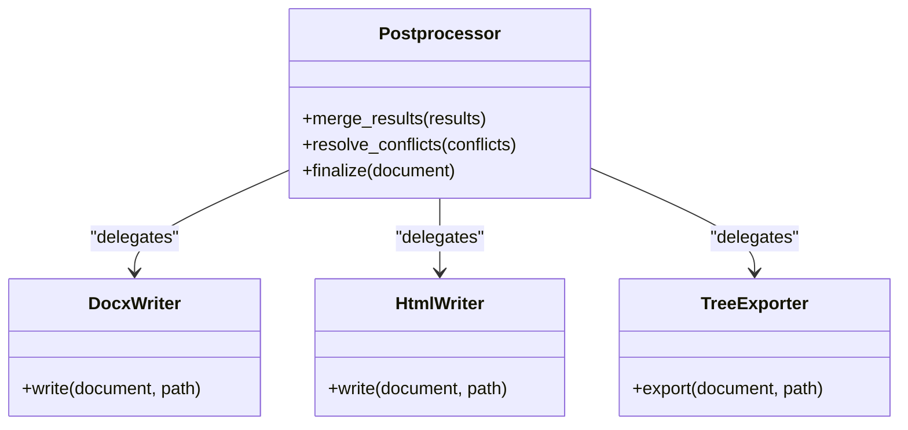

**Diagram sources**
- [core/postprocess.py](file://src/local_deepl/core/postprocess.py)
- [core/docx_writer.py](file://src/local_deepl/core/docx_writer.py)
- [core/html_writer.py](file://src/local_deepl/core/html_writer.py)
- [core/tree_export.py](file://src/local_deepl/core/tree_export.py)

**Section sources**
- [core/postprocess.py](file://src/local_deepl/core/postprocess.py)
- [core/docx_writer.py](file://src/local_deepl/core/docx_writer.py)
- [core/html_writer.py](file://src/local_deepl/core/html_writer.py)
- [core/tree_export.py](file://src/local_deepl/core/tree_export.py)

### Callbacks and Progress Tracking
Responsibilities:
- Decouple pipeline internals from observers (UI, logging, metrics)
- Emit standardized events for progress, artifacts, and errors
- Support streaming updates and resumable jobs

Event types:
- Progress updates with stage names and percentages
- Artifact notifications for intermediate files or payloads
- Error reports with contextual details for diagnostics

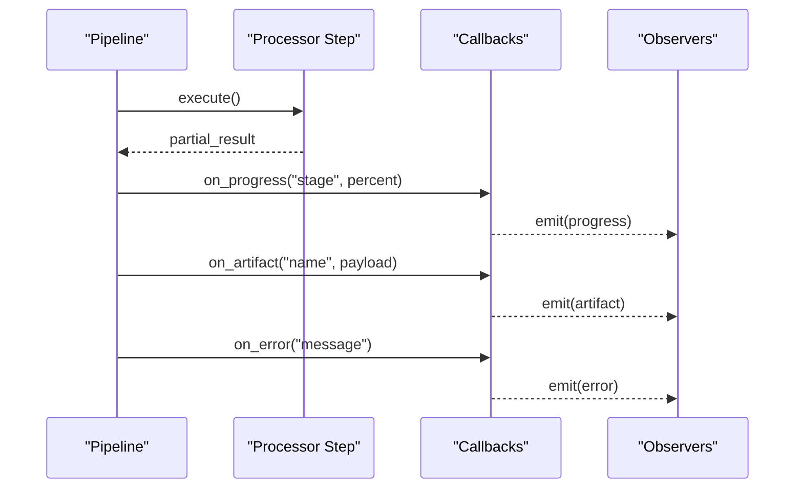

**Diagram sources**
- [core/callbacks.py](file://src/local_deepl/core/callbacks.py)
- [pipeline.py](file://src/local_deepl/pipeline.py)

**Section sources**
- [core/callbacks.py](file://src/local_deepl/core/callbacks.py)
- [pipeline.py](file://src/local_deepl/pipeline.py)

### Translation Subsystem
Responsibilities:
- Configure translation engines and providers
- Manage dual translation paths and fallbacks
- Integrate with LLM clients for advanced processing

Engines:
- NLLB engine for neural machine translation
- TROCR engine for OCR-related tasks
- LLM client abstraction for provider-agnostic calls

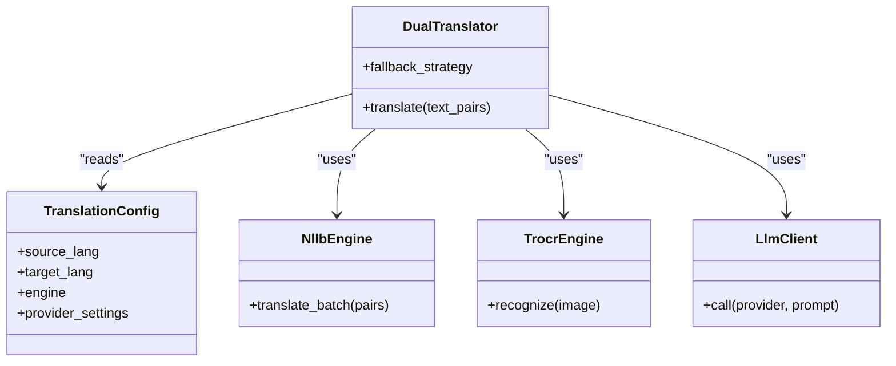

**Diagram sources**
- [core/translation_config.py](file://src/local_deepl/core/translation_config.py)
- [core/dual_translator.py](file://src/local_deepl/core/dual_translator.py)
- [core/nllb_engine.py](file://src/local_deepl/core/nllb_engine.py)
- [core/trocr_engine.py](file://src/local_deepl/core/trocr_engine.py)
- [core/llm_client.py](file://src/local_deepl/core/llm_client.py)

**Section sources**
- [core/translation_config.py](file://src/local_deepl/core/translation_config.py)
- [core/dual_translator.py](file://src/local_deepl/core/dual_translator.py)
- [core/nllb_engine.py](file://src/local_deepl/core/nllb_engine.py)
- [core/trocr_engine.py](file://src/local_deepl/core/trocr_engine.py)
- [core/llm_client.py](file://src/local_deepl/core/llm_client.py)

### Glossary and Entity Memory
Responsibilities:
- Apply glossary terms during translation to ensure consistency
- Maintain entity memory across segments to preserve terminology

Integration:
- Glossary lookup hooks in translation pipeline
- Entity memory persistence and retrieval within workflow steps

**Section sources**
- [core/glossary.py](file://src/local_deepl/core/glossary.py)
- [core/entity_memory.py](file://src/local_deepl/core/entity_memory.py)

### Asynchronous Execution
Responsibilities:
- Queue long-running jobs via Celery
- Track job status and results
- Provide retry and failure handling at the task level

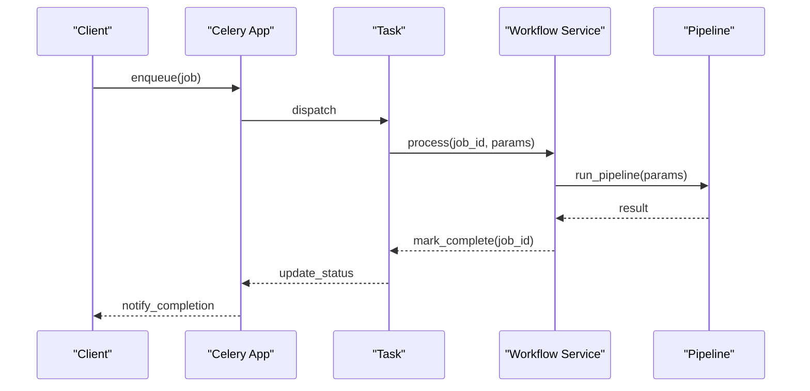

**Diagram sources**
- [api/celery_app.py](file://src/local_deepl/api/celery_app.py)
- [api/tasks.py](file://src/local_deepl/api/tasks.py)
- [api/services/workflow.py](file://src/local_deepl/api/services/workflow.py)
- [pipeline.py](file://src/local_deepl/pipeline.py)

**Section sources**
- [api/celery_app.py](file://src/local_deepl/api/celery_app.py)
- [api/tasks.py](file://src/local_deepl/api/tasks.py)
- [api/services/workflow.py](file://src/local_deepl/api/services/workflow.py)
- [pipeline.py](file://src/local_deepl/pipeline.py)

## Dependency Analysis
The core engine exhibits clear separation of concerns:
- Pipeline orchestrator depends on routing, workflows, processors, callbacks, and exporters
- Workflows depend on preprocessing, OCR, translation, and aligner components
- Exporters depend on document model and postprocessed results
- Async layer depends on services and pipeline

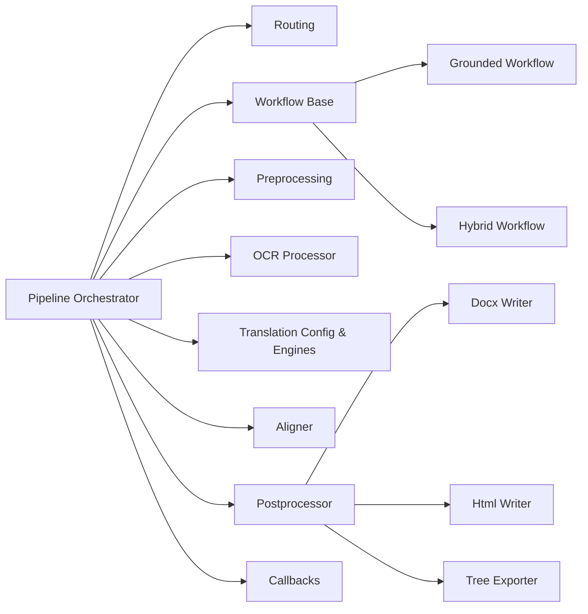

**Diagram sources**
- [pipeline.py](file://src/local_deepl/pipeline.py)
- [core/routing.py](file://src/local_deepl/core/routing.py)
- [core/workflows/base.py](file://src/local_deepl/core/workflows/base.py)
- [core/workflows/grounded.py](file://src/local_deepl/core/workflows/grounded.py)
- [core/workflows/hybrid.py](file://src/local_deepl/core/workflows/hybrid.py)
- [core/preprocessing.py](file://src/local_deepl/core/preprocessing.py)
- [core/ocr/processor.py](file://src/local_deepl/core/ocr/processor.py)
- [core/translation_config.py](file://src/local_deepl/core/translation_config.py)
- [core/dual_translator.py](file://src/local_deepl/core/dual_translator.py)
- [core/nllb_engine.py](file://src/local_deepl/core/nllb_engine.py)
- [core/trocr_engine.py](file://src/local_deepl/core/trocr_engine.py)
- [core/aligner.py](file://src/local_deepl/core/aligner.py)
- [core/postprocess.py](file://src/local_deepl/core/postprocess.py)
- [core/docx_writer.py](file://src/local_deepl/core/docx_writer.py)
- [core/html_writer.py](file://src/local_deepl/core/html_writer.py)
- [core/tree_export.py](file://src/local_deepl/core/tree_export.py)
- [core/callbacks.py](file://src/local_deepl/core/callbacks.py)

**Section sources**
- [pipeline.py](file://src/local_deepl/pipeline.py)
- [core/routing.py](file://src/local_deepl/core/routing.py)
- [core/workflows/base.py](file://src/local_deepl/core/workflows/base.py)
- [core/workflows/grounded.py](file://src/local_deepl/core/workflows/grounded.py)
- [core/workflows/hybrid.py](file://src/local_deepl/core/workflows/hybrid.py)
- [core/preprocessing.py](file://src/local_deepl/core/preprocessing.py)
- [core/ocr/processor.py](file://src/local_deepl/core/ocr/processor.py)
- [core/translation_config.py](file://src/local_deepl/core/translation_config.py)
- [core/dual_translator.py](file://src/local_deepl/core/dual_translator.py)
- [core/nllb_engine.py](file://src/local_deepl/core/nllb_engine.py)
- [core/trocr_engine.py](file://src/local_deepl/core/trocr_engine.py)
- [core/aligner.py](file://src/local_deepl/core/aligner.py)
- [core/postprocess.py](file://src/local_deepl/core/postprocess.py)
- [core/docx_writer.py](file://src/local_deepl/core/docx_writer.py)
- [core/html_writer.py](file://src/local_deepl/core/html_writer.py)
- [core/tree_export.py](file://src/local_deepl/core/tree_export.py)
- [core/callbacks.py](file://src/local_deepl/core/callbacks.py)

## Performance Considerations
- Batch processing: group segments or pages to reduce overhead in OCR and translation calls
- Streaming: emit artifacts incrementally via callbacks to avoid large in-memory payloads
- Caching: reuse OCR results and translation lookups where possible
- Resource limits: cap concurrent workers and set timeouts for external services
- Memory management: release intermediate buffers after each stage; prefer generators for large sequences
- Algorithmic choices: prefer native text extraction when available; limit OCR to problematic regions

[No sources needed since this section provides general guidance]

## Troubleshooting Guide
Common issues and remedies:
- Format detection failures: verify supported file types and MIME detection; inspect routing decisions
- OCR errors: check backend availability, image quality, and preprocessing options
- Translation failures: validate language codes, provider credentials, and rate limits
- Alignment mismatches: review span mappings and confidence thresholds
- Progress not updating: ensure callbacks are registered and observers handle events correctly
- Job hangs: monitor Celery worker health, queue depth, and task timeouts

Operational checks:
- Inspect artifact outputs for intermediate stages
- Enable detailed logs in pipeline and workflow steps
- Validate configuration for translation engines and OCR backends

**Section sources**
- [core/routing.py](file://src/local_deepl/core/routing.py)
- [core/ocr/processor.py](file://src/local_deepl/core/ocr/processor.py)
- [core/translation_config.py](file://src/local_deepl/core/translation_config.py)
- [core/aligner.py](file://src/local_deepl/core/aligner.py)
- [core/callbacks.py](file://src/local_deepl/core/callbacks.py)
- [api/tasks.py](file://src/local_deepl/api/tasks.py)
- [api/celery_app.py](file://src/local_deepl/api/celery_app.py)

## Conclusion
LocalDeepL’s core processing engine implements a robust, extensible pipeline with strategy-driven workflows. The design separates concerns across routing, preprocessing, OCR, translation, alignment, and export, while providing a decoupled callback system for progress and artifacts. Grounded and hybrid workflows offer flexible trade-offs between accuracy and speed. With async execution, batch processing, and careful resource management, the engine scales to diverse document types and workloads.

[No sources needed since this section summarizes without analyzing specific files]

## Appendices

### Practical Examples

#### Custom Processor Development
Steps:
- Implement a processor adhering to the expected interface (input/output contracts)
- Register it in the routing or factory configuration
- Emit progress and artifacts via callbacks
- Add unit tests covering edge cases and error paths

Implementation references:
- Processor interface and usage patterns
- Registration and selection mechanisms

**Section sources**
- [core/ocr/processor.py](file://src/local_deepl/core/ocr/processor.py)
- [api/services/ocr_pipeline_factory.py](file://src/local_deepl/api/services/ocr_pipeline_factory.py)
- [core/routing.py](file://src/local_deepl/core/routing.py)
- [core/callbacks.py](file://src/local_deepl/core/callbacks.py)

#### Workflow Customization
Steps:
- Extend the workflow base to define custom step ordering
- Override decision points (e.g., when to fall back to OCR)
- Integrate additional translators or aligners
- Test with representative documents and measure outcomes

Implementation references:
- Workflow base and strategy classes
- Grounded and hybrid implementations for reference

**Section sources**
- [core/workflows/base.py](file://src/local_deepl/core/workflows/base.py)
- [core/workflows/grounded.py](file://src/local_deepl/core/workflows/grounded.py)
- [core/workflows/hybrid.py](file://src/local_deepl/core/workflows/hybrid.py)