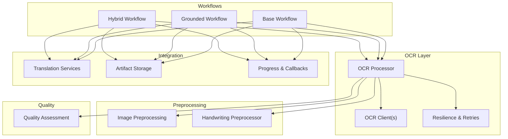
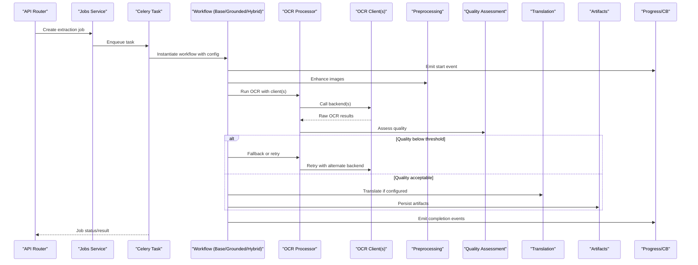
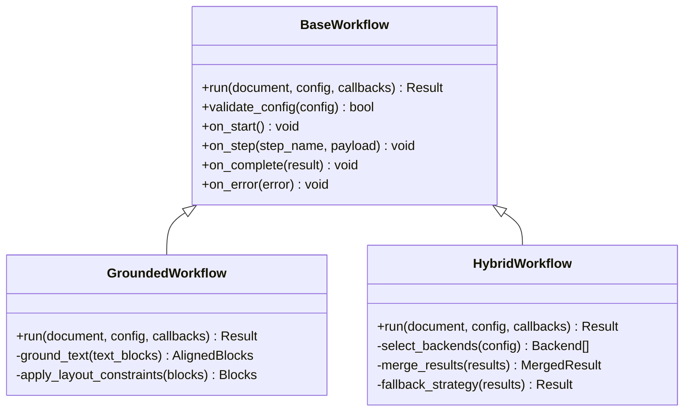
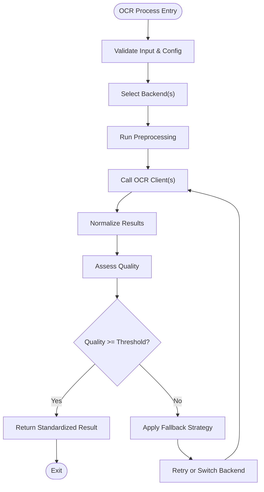
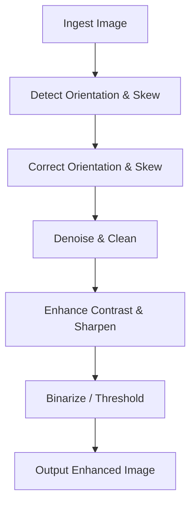
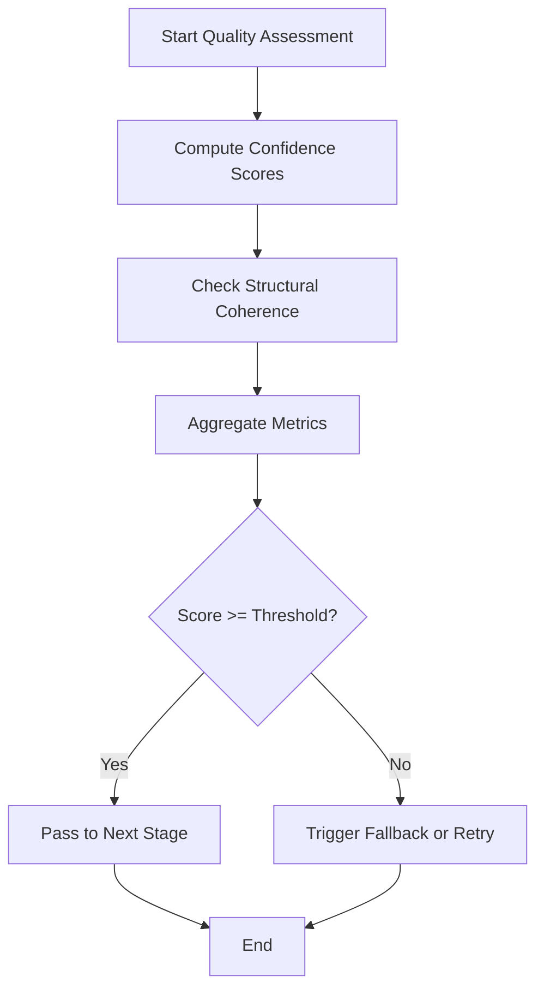
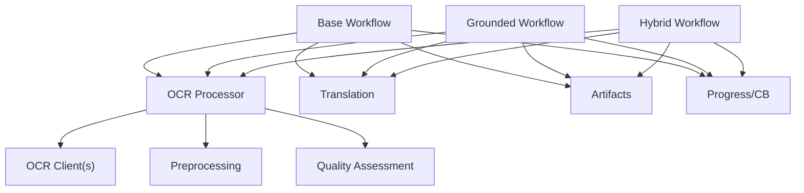

# Core Processing Engine

<cite>
**Referenced Files in This Document**
- [base.py](file://src/local_deepl/core/workflows/base.py)
- [grounded.py](file://src/local_deepl/core/workflows/grounded.py)
- [hybrid.py](file://src/local_deepl/core/workflows/hybrid.py)
- [utils.py](file://src/local_deepl/core/workflows/utils.py)
- [processor.py](file://src/local_deepl/core/ocr/processor.py)
- [client.py](file://src/local_deepl/core/ocr/client.py)
- [resilience.py](file://src/local_deepl/core/ocr/resilience.py)
- [preprocessing.py](file://src/local_deepl/core/preprocessing.py)
- [handwriting_preprocessor.py](file://src/local_deepl/core/handwriting_preprocessor.py)
- [quality.py](file://src/local_deepl/core/processors/quality.py)
- [callbacks.py](file://src/local_deepl/core/callbacks.py)
- [document.py](file://src/local_deepl/core/document.py)
- [translation.py](file://src/local_deepl/core/translation.py)
- [dual_translator.py](file://src/local_deepl/core/dual_translator.py)
- [artifacts.py](file://src/local_deepl/api/services/artifacts.py)
- [ocr_pipeline_factory.py](file://src/local_deepl/api/services/ocr_pipeline_factory.py)
- [ocr_settings.py](file://src/local_deepl/api/services/ocr_settings.py)
- [progress.py](file://src/local_deepl/api/services/progress.py)
- [jobs.py](file://src/local_deepl/api/services/jobs.py)
- [tasks.py](file://src/local_deepl/api/tasks.py)
</cite>

## Table of Contents
1. [Introduction](#introduction)
2. [Project Structure](#project-structure)
3. [Core Components](#core-components)
4. [Architecture Overview](#architecture-overview)
5. [Detailed Component Analysis](#detailed-component-analysis)
6. [Dependency Analysis](#dependency-analysis)
7. [Performance Considerations](#performance-considerations)
8. [Troubleshooting Guide](#troubleshooting-guide)
9. [Conclusion](#conclusion)
10. [Appendices](#appendices)

## Introduction
This document explains the core processing engine that powers OCR-driven document workflows. It focuses on the workflow system architecture, including base workflow abstractions, grounded OCR workflows, and hybrid strategies that combine multiple OCR backends. It also documents the OCR processor abstraction layer, preprocessing pipeline for image enhancement, quality assessment mechanisms, configuration options, callback-based progress tracking, error handling patterns, and integration points with translation services and artifact storage. The goal is to make the system accessible to beginners while providing sufficient depth for experienced developers extending or customizing the pipeline.

## Project Structure
The core processing engine spans several modules:
- Workflows define high-level orchestration (base, grounded, hybrid).
- OCR subsystem provides a unified processor abstraction over multiple backends.
- Preprocessing enhances input images for better OCR accuracy.
- Quality processors assess OCR output reliability.
- Callbacks and progress services enable real-time updates.
- Translation and artifacts integrate downstream processing and persistence.

**Diagram sources**
- [base.py](file://src/local_deepl/core/workflows/base.py)
- [grounded.py](file://src/local_deepl/core/workflows/grounded.py)
- [hybrid.py](file://src/local_deepl/core/workflows/hybrid.py)
- [processor.py](file://src/local_deepl/core/ocr/processor.py)
- [client.py](file://src/local_deepl/core/ocr/client.py)
- [resilience.py](file://src/local_deepl/core/ocr/resilience.py)
- [preprocessing.py](file://src/local_deepl/core/preprocessing.py)
- [handwriting_preprocessor.py](file://src/local_deepl/core/handwriting_preprocessor.py)
- [quality.py](file://src/local_deepl/core/processors/quality.py)
- [progress.py](file://src/local_deepl/api/services/progress.py)
- [translation.py](file://src/local_deepl/core/translation.py)
- [artifacts.py](file://src/local_deepl/api/services/artifacts.py)

**Section sources**
- [base.py](file://src/local_deepl/core/workflows/base.py)
- [grounded.py](file://src/local_deepl/core/workflows/grounded.py)
- [hybrid.py](file://src/local_deepl/core/workflows/hybrid.py)
- [processor.py](file://src/local_deepl/core/ocr/processor.py)
- [client.py](file://src/local_deepl/core/ocr/client.py)
- [resilience.py](file://src/local_deepl/core/ocr/resilience.py)
- [preprocessing.py](file://src/local_deepl/core/preprocessing.py)
- [handwriting_preprocessor.py](file://src/local_deepl/core/handwriting_preprocessor.py)
- [quality.py](file://src/local_deepl/core/processors/quality.py)
- [progress.py](file://src/local_deepl/api/services/progress.py)
- [translation.py](file://src/local_deepl/core/translation.py)
- [artifacts.py](file://src/local_deepl/api/services/artifacts.py)

## Core Components
- Base workflow defines the common orchestration contract, lifecycle hooks, and shared utilities used by all concrete workflows.
- Grounded workflow implements an OCR-first strategy with grounding steps to align extracted text with original layout or structure.
- Hybrid workflow orchestrates multiple OCR backends, combining results via voting or confidence-weighted merging, and falls back when needed.
- OCR processor abstracts backend calls, normalizes outputs, and integrates resilience/retry logic.
- Preprocessing pipeline prepares images (enhancement, deskewing, binarization) and includes specialized handwriting preprocessor.
- Quality assessment evaluates OCR confidence and structural coherence to guide fallbacks and merges.
- Callbacks and progress services provide event-driven updates for long-running jobs.
- Translation services and artifact storage integrate downstream tasks and persist intermediate/final artifacts.

**Section sources**
- [base.py](file://src/local_deepl/core/workflows/base.py)
- [grounded.py](file://src/local_deepl/core/workflows/grounded.py)
- [hybrid.py](file://src/local_deepl/core/workflows/hybrid.py)
- [processor.py](file://src/local_deepl/core/ocr/processor.py)
- [client.py](file://src/local_deepl/core/ocr/client.py)
- [resilience.py](file://src/local_deepl/core/ocr/resilience.py)
- [preprocessing.py](file://src/local_deepl/core/preprocessing.py)
- [handwriting_preprocessor.py](file://src/local_deepl/core/handwriting_preprocessor.py)
- [quality.py](file://src/local_deepl/core/processors/quality.py)
- [callbacks.py](file://src/local_deepl/core/callbacks.py)
- [progress.py](file://src/local_deepl/api/services/progress.py)
- [translation.py](file://src/local_deepl/core/translation.py)
- [artifacts.py](file://src/local_deepl/api/services/artifacts.py)

## Architecture Overview
The processing engine follows a layered architecture:
- API layer exposes endpoints and job management.
- Workflow layer orchestrates steps and coordinates components.
- OCR layer abstracts backends and ensures robustness.
- Preprocessing and quality layers improve accuracy and reliability.
- Integration layer handles translation and artifact persistence.

**Diagram sources**
- [jobs.py](file://src/local_deepl/api/services/jobs.py)
- [tasks.py](file://src/local_deepl/api/tasks.py)
- [base.py](file://src/local_deepl/core/workflows/base.py)
- [grounded.py](file://src/local_deepl/core/workflows/grounded.py)
- [hybrid.py](file://src/local_deepl/core/workflows/hybrid.py)
- [processor.py](file://src/local_deepl/core/ocr/processor.py)
- [client.py](file://src/local_deepl/core/ocr/client.py)
- [preprocessing.py](file://src/local_deepl/core/preprocessing.py)
- [quality.py](file://src/local_deepl/core/processors/quality.py)
- [translation.py](file://src/local_deepl/core/translation.py)
- [artifacts.py](file://src/local_deepl/api/services/artifacts.py)
- [progress.py](file://src/local_deepl/api/services/progress.py)

## Detailed Component Analysis

### Workflow System Architecture
The workflow system provides a consistent interface for orchestrating OCR and post-processing steps.

- Base workflow: Defines lifecycle methods, parameter validation, and shared utilities. Concrete workflows inherit and override specific steps.
- Grounded workflow: Implements OCR-first extraction followed by grounding to align text with original structure; suitable for structured documents.
- Hybrid workflow: Combines multiple OCR backends, applies quality checks, and merges results using confidence scores or voting.

**Diagram sources**
- [base.py](file://src/local_deepl/core/workflows/base.py)
- [grounded.py](file://src/local_deepl/core/workflows/grounded.py)
- [hybrid.py](file://src/local_deepl/core/workflows/hybrid.py)

**Section sources**
- [base.py](file://src/local_deepl/core/workflows/base.py)
- [grounded.py](file://src/local_deepl/core/workflows/grounded.py)
- [hybrid.py](file://src/local_deepl/core/workflows/hybrid.py)

### OCR Processor Abstraction Layer
The OCR processor abstracts backend interactions and normalizes outputs across different engines.

- Unified interface: Accepts images and configuration, returns standardized OCR results.
- Backend selection: Chooses appropriate clients based on configuration and capabilities.
- Resilience: Implements retries, timeouts, and fallback strategies.
- Error handling: Normalizes exceptions and provides actionable diagnostics.

**Diagram sources**
- [processor.py](file://src/local_deepl/core/ocr/processor.py)
- [client.py](file://src/local_deepl/core/ocr/client.py)
- [resilience.py](file://src/local_deepl/core/ocr/resilience.py)
- [preprocessing.py](file://src/local_deepl/core/preprocessing.py)
- [quality.py](file://src/local_deepl/core/processors/quality.py)

**Section sources**
- [processor.py](file://src/local_deepl/core/ocr/processor.py)
- [client.py](file://src/local_deepl/core/ocr/client.py)
- [resilience.py](file://src/local_deepl/core/ocr/resilience.py)

### Preprocessing Pipeline for Image Enhancement
Preprocessing improves OCR accuracy by enhancing input images before recognition.

- Common enhancements: Deskewing, noise reduction, contrast adjustment, binarization.
- Handwriting-specific: Specialized filters and normalization for handwritten content.
- Configurable stages: Allows tuning per document type or backend requirements.

**Diagram sources**
- [preprocessing.py](file://src/local_deepl/core/preprocessing.py)
- [handwriting_preprocessor.py](file://src/local_deepl/core/handwriting_preprocessor.py)

**Section sources**
- [preprocessing.py](file://src/local_deepl/core/preprocessing.py)
- [handwriting_preprocessor.py](file://src/local_deepl/core/handwriting_preprocessor.py)

### Quality Assessment Mechanisms
Quality assessment evaluates OCR output reliability to guide fallbacks and merges.

- Confidence scoring: Aggregates per-block and global confidence metrics.
- Structural coherence: Checks alignment, spacing, and layout consistency.
- Thresholding: Triggers fallback strategies when quality is insufficient.

**Diagram sources**
- [quality.py](file://src/local_deepl/core/processors/quality.py)

**Section sources**
- [quality.py](file://src/local_deepl/core/processors/quality.py)

### Configuration Options for OCR Strategies
Configuration controls which workflows and backends are used, along with behavior parameters.

- Strategy selection: Choose grounded or hybrid workflows based on document characteristics.
- Backend settings: Configure OCR clients, timeouts, and retry policies.
- Preprocessing options: Tune enhancement steps and thresholds.
- Quality thresholds: Set minimum confidence levels for acceptance.

**Section sources**
- [ocr_settings.py](file://src/local_deepl/api/services/ocr_settings.py)
- [ocr_pipeline_factory.py](file://src/local_deepl/api/services/ocr_pipeline_factory.py)

### Callback Mechanisms for Progress Tracking
Callbacks provide event-driven updates during long-running operations.

- Lifecycle events: Start, step completion, errors, and final result.
- Real-time updates: Integrated with progress services for UI feedback.
- Decoupled design: Workflows emit events without tight coupling to consumers.

**Section sources**
- [callbacks.py](file://src/local_deepl/core/callbacks.py)
- [progress.py](file://src/local_deepl/api/services/progress.py)

### Error Handling Patterns
Robust error handling ensures resilience and actionable diagnostics.

- Normalized exceptions: Consistent error types across backends.
- Retry logic: Automatic retries with exponential backoff where appropriate.
- Fallback strategies: Switch backends or reduce complexity when failures occur.
- Logging and tracing: Detailed logs for debugging and monitoring.

**Section sources**
- [resilience.py](file://src/local_deepl/core/ocr/resilience.py)
- [processor.py](file://src/local_deepl/core/ocr/processor.py)

### Integration with Translation Services and Artifact Storage
Downstream integration enables translation and persistent storage of results.

- Translation: Optional translation step after OCR, configurable per language pair.
- Artifacts: Store intermediate and final artifacts for auditability and reuse.
- Document model: Central representation linking OCR results, translations, and metadata.

**Section sources**
- [translation.py](file://src/local_deepl/core/translation.py)
- [dual_translator.py](file://src/local_deepl/core/dual_translator.py)
- [artifacts.py](file://src/local_deepl/api/services/artifacts.py)
- [document.py](file://src/local_deepl/core/document.py)

## Dependency Analysis
The core processing engine exhibits clear separation of concerns with minimal coupling between layers.

**Diagram sources**
- [base.py](file://src/local_deepl/core/workflows/base.py)
- [grounded.py](file://src/local_deepl/core/workflows/grounded.py)
- [hybrid.py](file://src/local_deepl/core/workflows/hybrid.py)
- [processor.py](file://src/local_deepl/core/ocr/processor.py)
- [client.py](file://src/local_deepl/core/ocr/client.py)
- [preprocessing.py](file://src/local_deepl/core/preprocessing.py)
- [quality.py](file://src/local_deepl/core/processors/quality.py)
- [translation.py](file://src/local_deepl/core/translation.py)
- [artifacts.py](file://src/local_deepl/api/services/artifacts.py)
- [progress.py](file://src/local_deepl/api/services/progress.py)

**Section sources**
- [base.py](file://src/local_deepl/core/workflows/base.py)
- [grounded.py](file://src/local_deepl/core/workflows/grounded.py)
- [hybrid.py](file://src/local_deepl/core/workflows/hybrid.py)
- [processor.py](file://src/local_deepl/core/ocr/processor.py)
- [client.py](file://src/local_deepl/core/ocr/client.py)
- [preprocessing.py](file://src/local_deepl/core/preprocessing.py)
- [quality.py](file://src/local_deepl/core/processors/quality.py)
- [translation.py](file://src/local_deepl/core/translation.py)
- [artifacts.py](file://src/local_deepl/api/services/artifacts.py)
- [progress.py](file://src/local_deepl/api/services/progress.py)

## Performance Considerations
- Parallel backend calls: Hybrid workflow can invoke multiple OCR clients concurrently to reduce latency.
- Caching: Cache preprocessing results and OCR outputs for repeated inputs.
- Adaptive preprocessing: Dynamically adjust enhancement steps based on image characteristics.
- Resource limits: Configure timeouts and memory usage to prevent overload.
- Batch processing: Group similar documents to optimize resource utilization.

[No sources needed since this section provides general guidance]

## Troubleshooting Guide
Common issues and solutions:
- Low OCR accuracy: Adjust preprocessing parameters, switch backends, or increase confidence thresholds.
- Timeout errors: Increase timeouts or reduce image resolution; implement retry with backoff.
- Memory issues: Limit batch sizes and enable garbage collection between steps.
- Inconsistent results: Use hybrid strategy with consensus merging; log detailed diagnostics.
- Translation failures: Verify language pairs and credentials; fall back to source text if necessary.

**Section sources**
- [resilience.py](file://src/local_deepl/core/ocr/resilience.py)
- [quality.py](file://src/local_deepl/core/processors/quality.py)
- [ocr_settings.py](file://src/local_deepl/api/services/ocr_settings.py)

## Conclusion
The core processing engine provides a flexible, robust framework for OCR-driven document processing. By separating workflow orchestration, OCR abstraction, preprocessing, quality assessment, and integration layers, it supports diverse strategies and backends while maintaining performance and reliability. Developers can extend the system by implementing new backends, preprocessing steps, or quality metrics, leveraging the established interfaces and patterns.

[No sources needed since this section summarizes without analyzing specific files]

## Appendices
- Example workflow instantiation: Refer to API routers and job services for concrete usage patterns.
- Parameter configuration: Consult OCR settings and pipeline factory for available options.
- Result processing: Examine document model and artifact storage for data structures and persistence.

[No sources needed since this section provides general guidance]