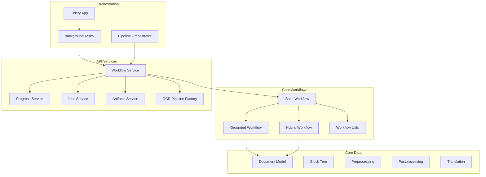
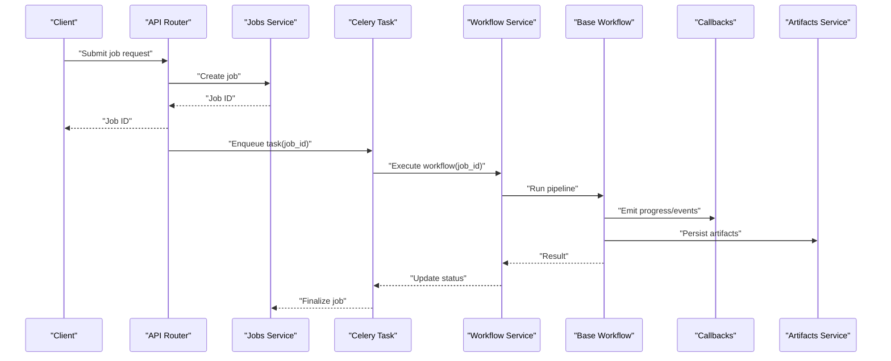
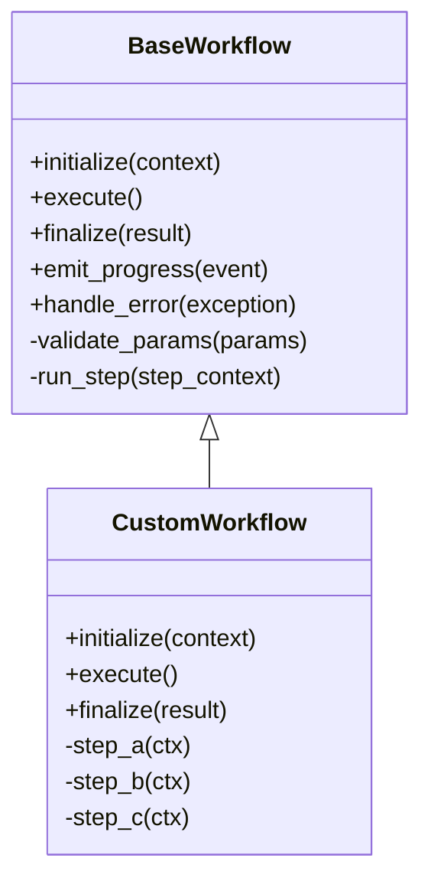
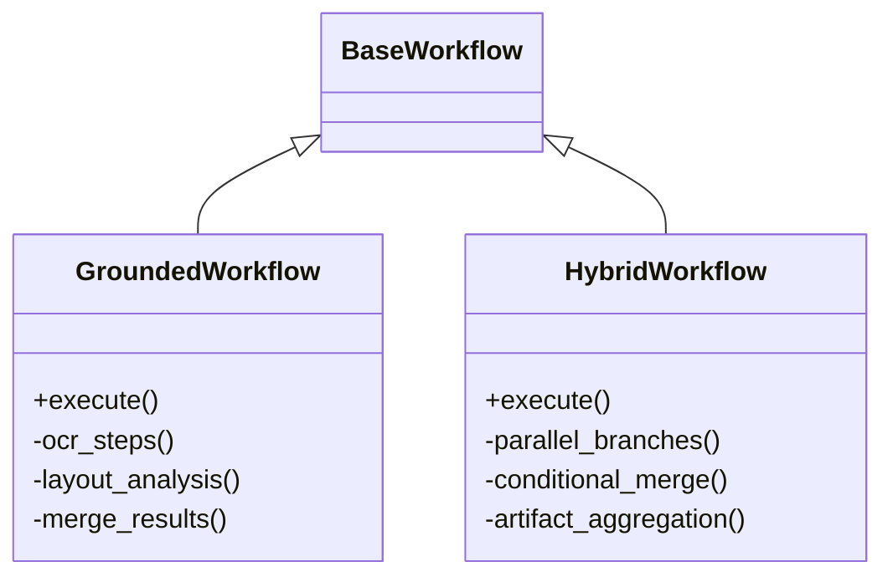
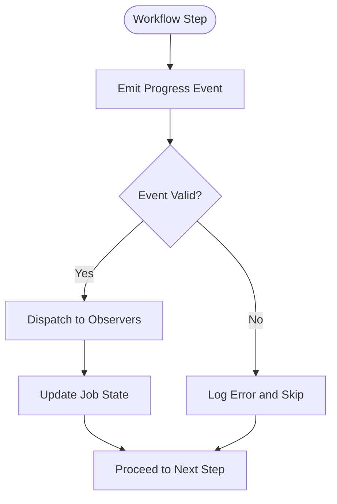
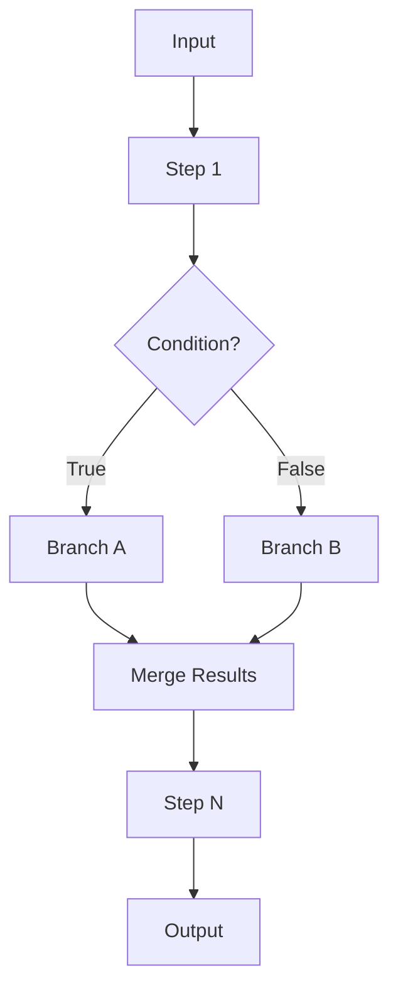
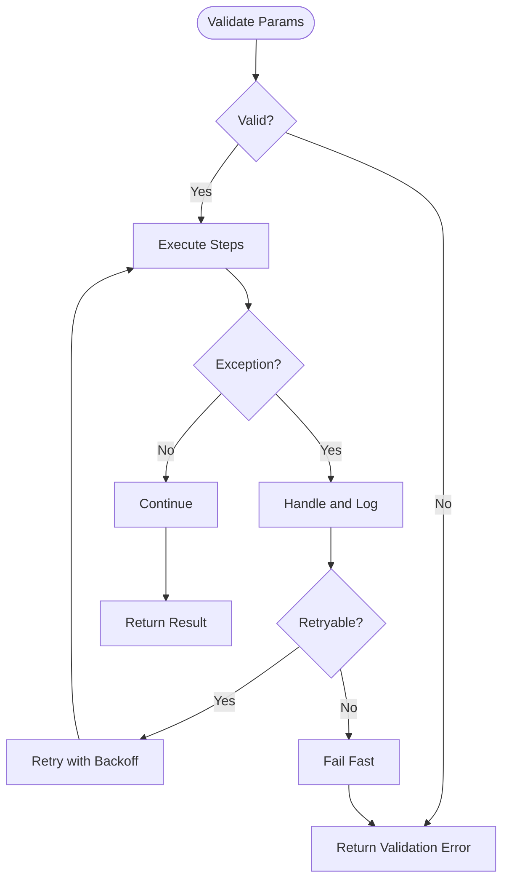
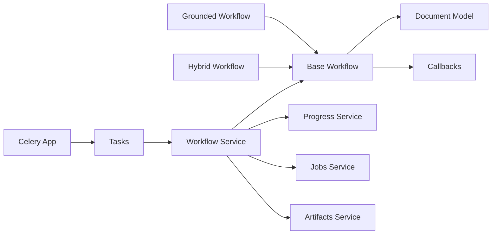

# Custom Workflow Development

<cite>
**Referenced Files in This Document**
- [base.py](file://src/local_deepl/core/workflows/base.py)
- [grounded.py](file://src/local_deepl/core/workflows/grounded.py)
- [hybrid.py](file://src/local_deepl/core/workflows/hybrid.py)
- [utils.py](file://src/local_deepl/core/workflows/utils.py)
- [callbacks.py](file://src/local_deepl/core/callbacks.py)
- [pipeline.py](file://src/local_deepl/pipeline.py)
- [workflow.py](file://src/local_deepl/api/services/workflow.py)
- [progress.py](file://src/local_deepl/api/services/progress.py)
- [tasks.py](file://src/local_deepl/api/tasks.py)
- [celery_app.py](file://src/local_deepl/api/celery_app.py)
- [document.py](file://src/local_deepl/core/document.py)
- [block_tree.py](file://src/local_deepl/core/block_tree.py)
- [preprocessing.py](file://src/local_deepl/core/preprocessing.py)
- [postprocess.py](file://src/local_deepl/core/postprocess.py)
- [translation.py](file://src/local_deepl/core/translation.py)
- [translation_config.py](file://src/local_deepl/core/translation_config.py)
- [ocr_pipeline_factory.py](file://src/local_deepl/api/services/ocr_pipeline_factory.py)
- [jobs.py](file://src/local_deepl/api/services/jobs.py)
- [artifacts.py](file://src/local_deepl/api/services/artifacts.py)
- [tree_artifact.py](file://src/local_deepl/api/services/tree_artifact.py)
- [test_workflows_base.py](file://tests/test_workflows_base.py)
- [test_workflows_callback_decoupling.py](file://tests/test_workflows_callback_decoupling.py)
- [test_workflows_grounded.py](file://tests/test_workflows_grounded.py)
- [test_workflows_hybrid.py](file://tests/test_workflows_hybrid.py)
</cite>

## Table of Contents
1. [Introduction](#introduction)
2. [Project Structure](#project-structure)
3. [Core Components](#core-components)
4. [Architecture Overview](#architecture-overview)
5. [Detailed Component Analysis](#detailed-component-analysis)
6. [Dependency Analysis](#dependency-analysis)
7. [Performance Considerations](#performance-considerations)
8. [Troubleshooting Guide](#troubleshooting-guide)
9. [Conclusion](#conclusion)
10. [Appendices](#appendices)

## Introduction
This document explains how to develop custom workflows and extension points for the project’s document processing pipeline. It covers extending the base workflow abstraction, implementing required methods, integrating with the orchestrator, using the callback system for progress and events, composing workflows (chaining, branching, parallelism), validating parameters, handling errors, testing strategies, integrating external services and storage, performance and resource management, debugging techniques, versioning, compatibility, and deployment strategies. The content is designed to be accessible to beginners while providing sufficient depth for experienced developers building complex pipelines.

## Project Structure
The workflow subsystem lives under core/workflows and integrates with API services and background tasks. Key areas:
- Core workflow abstractions and implementations
- Callbacks for progress and events
- Pipeline orchestration and task execution
- Services for jobs, artifacts, and progress tracking
- Tests demonstrating usage patterns

**Diagram sources**
- [base.py](file://src/local_deepl/core/workflows/base.py)
- [grounded.py](file://src/local_deepl/core/workflows/grounded.py)
- [hybrid.py](file://src/local_deepl/core/workflows/hybrid.py)
- [utils.py](file://src/local_deepl/core/workflows/utils.py)
- [document.py](file://src/local_deepl/core/document.py)
- [block_tree.py](file://src/local_deepl/core/block_tree.py)
- [preprocessing.py](file://src/local_deepl/core/preprocessing.py)
- [postprocess.py](file://src/local_deepl/core/postprocess.py)
- [translation.py](file://src/local_deepl/core/translation.py)
- [workflow.py](file://src/local_deepl/api/services/workflow.py)
- [progress.py](file://src/local_deepl/api/services/progress.py)
- [jobs.py](file://src/local_deepl/api/services/jobs.py)
- [artifacts.py](file://src/local_deepl/api/services/artifacts.py)
- [celery_app.py](file://src/local_deepl/api/celery_app.py)
- [tasks.py](file://src/local_deepl/api/tasks.py)
- [pipeline.py](file://src/local_deepl/pipeline.py)

**Section sources**
- [base.py](file://src/local_deepl/core/workflows/base.py)
- [grounded.py](file://src/local_deepl/core/workflows/grounded.py)
- [hybrid.py](file://src/local_deepl/core/workflows/hybrid.py)
- [utils.py](file://src/local_deepl/core/workflows/utils.py)
- [workflow.py](file://src/local_deepl/api/services/workflow.py)
- [progress.py](file://src/local_deepl/api/services/progress.py)
- [jobs.py](file://src/local_deepl/api/services/jobs.py)
- [artifacts.py](file://src/local_deepl/api/services/artifacts.py)
- [celery_app.py](file://src/local_deepl/api/celery_app.py)
- [tasks.py](file://src/local_deepl/api/tasks.py)
- [pipeline.py](file://src/local_deepl/pipeline.py)

## Core Components
- Base workflow abstraction defines the lifecycle hooks and contract for executing steps, emitting progress, and handling errors.
- Concrete workflows implement domain-specific logic (e.g., grounded and hybrid variants).
- Callbacks provide a decoupled mechanism for progress updates and event notifications.
- Services coordinate job lifecycle, artifact storage, and progress broadcasting.
- Background tasks execute long-running workflows asynchronously via Celery.

Key responsibilities:
- Extend the base workflow to add new processing stages.
- Use callbacks to report progress and emit structured events.
- Compose multiple steps into a single workflow or chain them across workflows.
- Integrate external services through service calls within workflow steps.
- Persist intermediate and final artifacts via artifact services.

**Section sources**
- [base.py](file://src/local_deepl/core/workflows/base.py)
- [callbacks.py](file://src/local_deepl/core/callbacks.py)
- [workflow.py](file://src/local_deepl/api/services/workflow.py)
- [progress.py](file://src/local_deepl/api/services/progress.py)
- [jobs.py](file://src/local_deepl/api/services/jobs.py)
- [artifacts.py](file://src/local_deepl/api/services/artifacts.py)

## Architecture Overview
The system follows a layered architecture:
- API layer exposes endpoints that trigger workflows.
- Services manage job state, progress, and artifacts.
- Background tasks run workflows asynchronously.
- Core workflows encapsulate processing logic and interact with data models and utilities.

**Diagram sources**
- [workflow.py](file://src/local_deepl/api/services/workflow.py)
- [base.py](file://src/local_deepl/core/workflows/base.py)
- [callbacks.py](file://src/local_deepl/core/callbacks.py)
- [jobs.py](file://src/local_deepl/api/services/jobs.py)
- [artifacts.py](file://src/local_deepl/api/services/artifacts.py)
- [celery_app.py](file://src/local_deepl/api/celery_app.py)
- [tasks.py](file://src/local_deepl/api/tasks.py)

## Detailed Component Analysis

### Base Workflow Abstraction
The base workflow defines the lifecycle and extension points:
- Lifecycle hooks for initialization, step execution, and cleanup.
- Progress emission and error propagation mechanisms.
- Context management for shared state across steps.
- Hooks for pre/post processing and validation.

When creating a custom workflow:
- Subclass the base workflow.
- Implement required lifecycle methods.
- Register steps and define their order.
- Emit progress and events at meaningful checkpoints.
- Handle exceptions and ensure consistent state transitions.

**Diagram sources**
- [base.py](file://src/local_deepl/core/workflows/base.py)

**Section sources**
- [base.py](file://src/local_deepl/core/workflows/base.py)

### Concrete Workflows: Grounded and Hybrid
- Grounded workflow implements a specific processing path tailored for grounded document analysis.
- Hybrid workflow combines multiple strategies (e.g., OCR and translation) with conditional branching and parallel execution.

Implementation patterns:
- Define step sequences and branching conditions.
- Reuse shared utilities for common operations.
- Integrate with OCR pipeline factory when needed.
- Manage artifacts per step and aggregate results.

**Diagram sources**
- [grounded.py](file://src/local_deepl/core/workflows/grounded.py)
- [hybrid.py](file://src/local_deepl/core/workflows/hybrid.py)
- [base.py](file://src/local_deepl/core/workflows/base.py)

**Section sources**
- [grounded.py](file://src/local_deepl/core/workflows/grounded.py)
- [hybrid.py](file://src/local_deepl/core/workflows/hybrid.py)

### Callback System for Progress and Events
Callbacks provide a decoupled communication channel between workflows and observers:
- Progress updates with granular metrics.
- Structured events for lifecycle milestones.
- Inter-component messaging without tight coupling.

Usage guidelines:
- Emit progress at step boundaries and key checkpoints.
- Include contextual metadata in events (e.g., step name, percentage, message).
- Ensure thread-safety if used from background tasks.
- Avoid heavy computations inside callbacks; delegate to workers if needed.

**Diagram sources**
- [callbacks.py](file://src/local_deepl/core/callbacks.py)
- [progress.py](file://src/local_deepl/api/services/progress.py)

**Section sources**
- [callbacks.py](file://src/local_deepl/core/callbacks.py)
- [progress.py](file://src/local_deepl/api/services/progress.py)

### Workflow Composition Patterns
Composition enables chaining, branching, and parallelism:
- Chaining: Sequential steps where each step consumes output from the previous.
- Branching: Conditional paths based on input characteristics or configuration.
- Parallel execution: Independent steps executed concurrently with later merging.

Best practices:
- Keep steps idempotent and isolated.
- Use shared context for passing data between steps.
- Aggregate results deterministically.
- Fail fast on invalid inputs and log detailed errors.

[No sources needed since this diagram shows conceptual workflow, not actual code structure]

**Section sources**
- [utils.py](file://src/local_deepl/core/workflows/utils.py)
- [hybrid.py](file://src/local_deepl/core/workflows/hybrid.py)

### Parameter Validation and Error Handling
Validation ensures robustness:
- Validate inputs early and return clear errors.
- Normalize parameters and apply defaults safely.
- Wrap external calls with retries and fallbacks.
- Propagate errors consistently to the orchestrator.

Error handling strategy:
- Catch expected exceptions and convert to workflow-level errors.
- Record diagnostic information for debugging.
- Ensure partial failures do not corrupt shared state.

**Diagram sources**
- [base.py](file://src/local_deepl/core/workflows/base.py)

**Section sources**
- [base.py](file://src/local_deepl/core/workflows/base.py)

### Integration with External Services and Storage
Integration points:
- External APIs: Use resilient clients with timeouts and retries.
- Database operations: Prefer transactional writes and batch operations.
- Artifact storage: Persist intermediate and final outputs with unique IDs.

Guidelines:
- Abstract external dependencies behind interfaces.
- Cache frequently accessed data where appropriate.
- Version artifact schemas and handle migrations gracefully.

**Section sources**
- [artifacts.py](file://src/local_deepl/api/services/artifacts.py)
- [tree_artifact.py](file://src/local_deepl/api/services/tree_artifact.py)
- [ocr_pipeline_factory.py](file://src/local_deepl/api/services/ocr_pipeline_factory.py)

### Testing Strategies
Testing approaches:
- Unit tests for individual steps and validation logic.
- Integration tests for end-to-end workflows with mocked external services.
- Property-based tests for robustness against varied inputs.
- Regression tests for backward compatibility.

Tips:
- Mock I/O and network calls.
- Assert progress events and artifact persistence.
- Verify error paths and recovery behavior.

**Section sources**
- [test_workflows_base.py](file://tests/test_workflows_base.py)
- [test_workflows_callback_decoupling.py](file://tests/test_workflows_callback_decoupling.py)
- [test_workflows_grounded.py](file://tests/test_workflows_grounded.py)
- [test_workflows_hybrid.py](file://tests/test_workflows_hybrid.py)

## Dependency Analysis
Workflows depend on core data models, utilities, and API services. Dependencies are intentionally layered to maintain cohesion and reduce coupling.

**Diagram sources**
- [base.py](file://src/local_deepl/core/workflows/base.py)
- [grounded.py](file://src/local_deepl/core/workflows/grounded.py)
- [hybrid.py](file://src/local_deepl/core/workflows/hybrid.py)
- [workflow.py](file://src/local_deepl/api/services/workflow.py)
- [progress.py](file://src/local_deepl/api/services/progress.py)
- [jobs.py](file://src/local_deepl/api/services/jobs.py)
- [artifacts.py](file://src/local_deepl/api/services/artifacts.py)
- [celery_app.py](file://src/local_deepl/api/celery_app.py)
- [tasks.py](file://src/local_deepl/api/tasks.py)

**Section sources**
- [base.py](file://src/local_deepl/core/workflows/base.py)
- [workflow.py](file://src/local_deepl/api/services/workflow.py)
- [celery_app.py](file://src/local_deepl/api/celery_app.py)
- [tasks.py](file://src/local_deepl/api/tasks.py)

## Performance Considerations
- Minimize blocking I/O by using asynchronous tasks and connection pooling.
- Batch database writes and use transactions to reduce overhead.
- Stream large artifacts instead of loading entirely into memory.
- Tune concurrency limits for parallel steps based on resource availability.
- Profile hot paths and cache reusable results.

Resource management:
- Close file handles and release locks promptly.
- Use context managers for resource acquisition and cleanup.
- Monitor memory usage and set appropriate worker limits.

Debugging techniques:
- Enable detailed logging with correlation IDs.
- Emit structured logs for each step and event.
- Use tracing spans for distributed calls.

[No sources needed since this section provides general guidance]

## Troubleshooting Guide
Common issues and resolutions:
- Stalled progress: Verify callback dispatch and observer subscriptions.
- Failed steps: Inspect error logs and validate inputs.
- Artifact corruption: Check schema versions and migration scripts.
- Resource exhaustion: Adjust concurrency and memory limits.

Diagnostic tools:
- Job status queries via jobs service.
- Artifact inspection utilities.
- Progress history and event logs.

**Section sources**
- [jobs.py](file://src/local_deepl/api/services/jobs.py)
- [artifacts.py](file://src/local_deepl/api/services/artifacts.py)
- [progress.py](file://src/local_deepl/api/services/progress.py)

## Conclusion
Custom workflows extend the base abstraction to implement domain-specific processing. By following the patterns outlined here—lifecycle hooks, callbacks, composition, validation, error handling, integration, testing, performance tuning, and debugging—you can build robust, scalable document processing pipelines. Maintain versioning and compatibility to ensure smooth deployments and upgrades.

[No sources needed since this section summarizes without analyzing specific files]

## Appendices

### Appendix A: Creating a Custom Workflow Step-by-Step
- Subclass the base workflow and implement lifecycle methods.
- Register steps in the desired order and define branching logic.
- Emit progress and events at meaningful checkpoints.
- Validate parameters and handle errors consistently.
- Persist artifacts and finalize results.

**Section sources**
- [base.py](file://src/local_deepl/core/workflows/base.py)
- [callbacks.py](file://src/local_deepl/core/callbacks.py)
- [artifacts.py](file://src/local_deepl/api/services/artifacts.py)

### Appendix B: Workflow Versioning and Compatibility
- Version workflow schemas and configurations explicitly.
- Provide migration scripts for evolving artifact formats.
- Support backward-compatible reads and graceful deprecations.
- Test compatibility across versions before deployment.

**Section sources**
- [artifacts.py](file://src/local_deepl/api/services/artifacts.py)
- [tree_artifact.py](file://src/local_deepl/api/services/tree_artifact.py)

### Appendix C: Deployment Strategies
- Containerize workflows and services for consistent environments.
- Use feature flags to roll out new workflows gradually.
- Monitor health checks and metrics for proactive alerting.
- Implement blue/green or canary deployments for zero-downtime updates.

[No sources needed since this section provides general guidance]