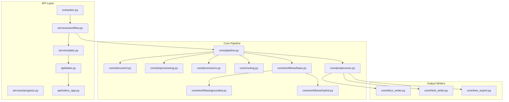
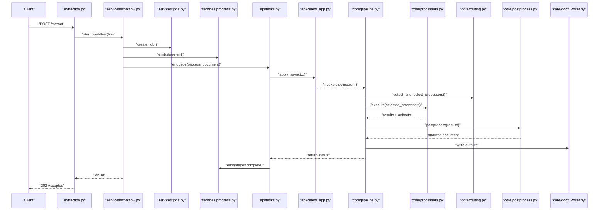
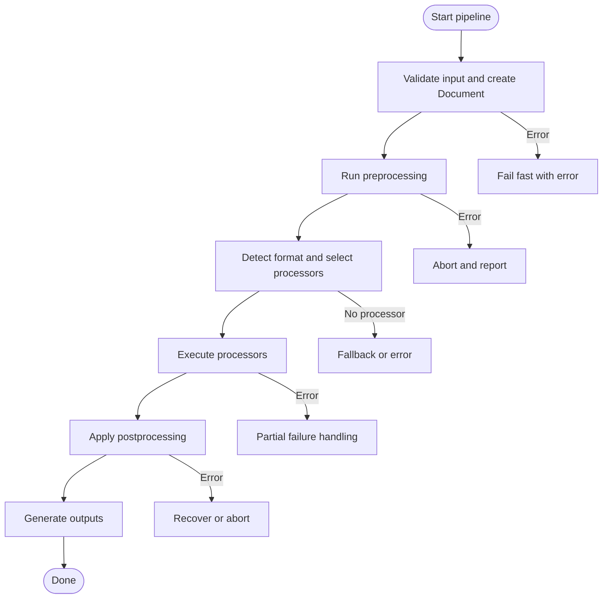
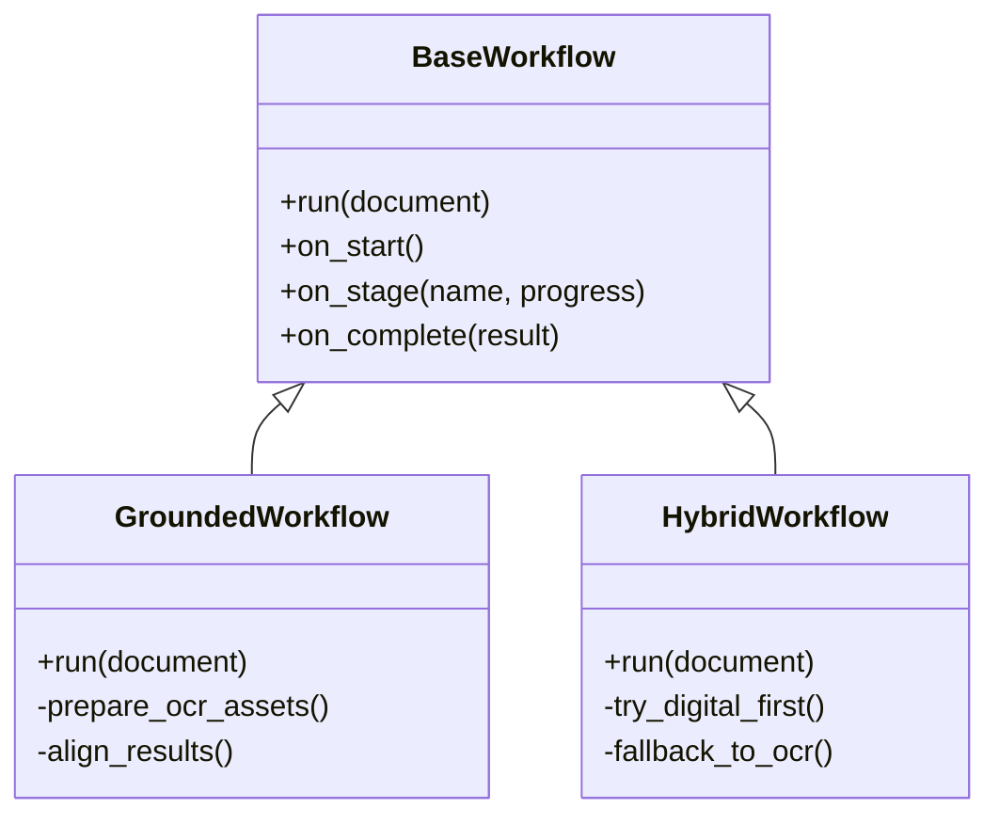
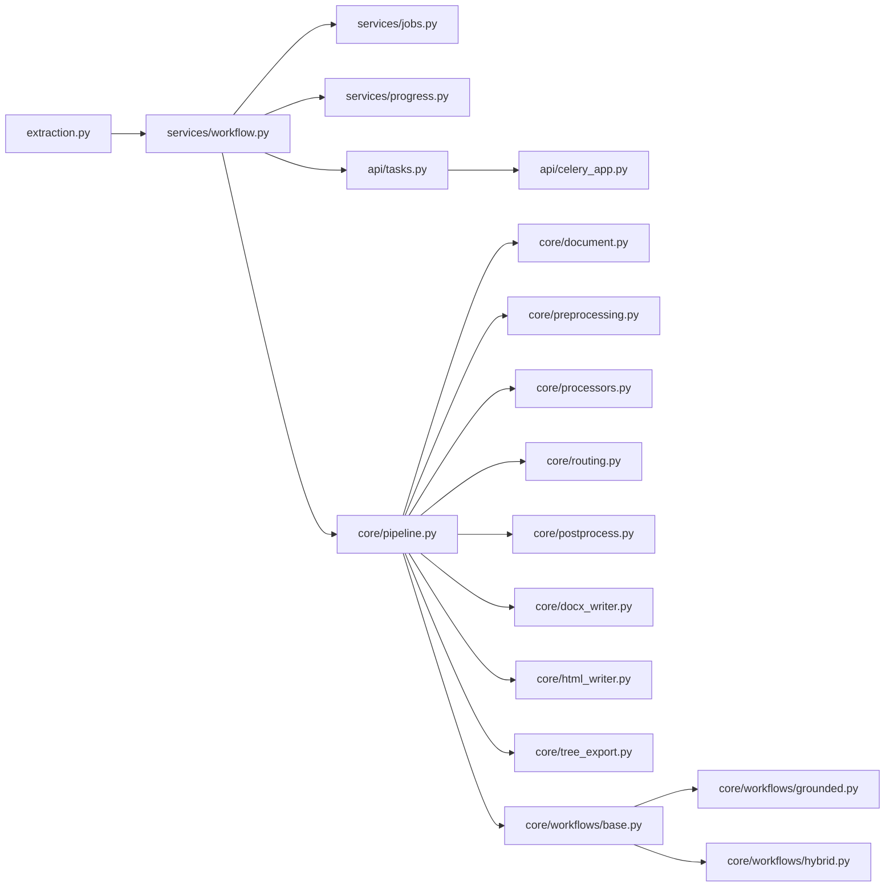

# Document Processing Pipeline

<cite>
**Referenced Files in This Document**
- [pipeline.py](file://src/local_deepl/pipeline.py)
- [server.py](file://src/local_deepl/server.py)
- [document.py](file://src/local_deepl/core/document.py)
- [preprocessing.py](file://src/local_deepl/core/preprocessing.py)
- [processors.py](file://src/local_deepl/core/processors.py)
- [routing.py](file://src/local_deepl/core/routing.py)
- [postprocess.py](file://src/local_deepl/core/postprocess.py)
- [docx_writer.py](file://src/local_deepl/core/docx_writer.py)
- [html_writer.py](file://src/local_deepl/core/html_writer.py)
- [tree_export.py](file://src/local_deepl/core/tree_export.py)
- [ocr_pipeline_factory.py](file://src/local_deepl/api/services/ocr_pipeline_factory.py)
- [progress.py](file://src/local_deepl/api/services/progress.py)
- [jobs.py](file://src/local_deepl/api/services/jobs.py)
- [workflow.py](file://src/local_deepl/api/services/workflow.py)
- [tasks.py](file://src/local_deepl/api/tasks.py)
- [celery_app.py](file://src/local_deepl/api/celery_app.py)
- [extraction.py](file://src/local_deepl/api/routers/extraction.py)
- [grounded.py](file://src/local_deepl/core/workflows/grounded.py)
- [hybrid.py](file://src/local_deepl/core/workflows/hybrid.py)
- [base.py](file://src/local_deepl/core/workflows/base.py)
</cite>

## Table of Contents
1. [Introduction](#introduction)
2. [Project Structure](#project-structure)
3. [Core Components](#core-components)
4. [Architecture Overview](#architecture-overview)
5. [Detailed Component Analysis](#detailed-component-analysis)
6. [Dependency Analysis](#dependency-analysis)
7. [Performance Considerations](#performance-considerations)
8. [Troubleshooting Guide](#troubleshooting-guide)
9. [Conclusion](#conclusion)
10. [Appendices](#appendices)

## Introduction
This document explains LocalDeepL’s end-to-end document processing pipeline. It covers the pipeline architecture, format detection and processor selection, document lifecycle from upload to output generation, implementation details of the pipeline pattern, error handling strategies, progress tracking, customization points for processors and workflows, performance optimization, memory management, and batch processing capabilities. The goal is to provide both a high-level understanding and actionable guidance for extending and operating the system effectively.

## Project Structure
The document processing pipeline spans core logic under src/local_deepl/core and API orchestration under src/local_deepl/api. Key responsibilities:
- Core pipeline and document model: pipeline.py, document.py
- Preprocessing and postprocessing: preprocessing.py, postprocess.py
- Processor registry and routing: processors.py, routing.py
- Output writers: docx_writer.py, html_writer.py, tree_export.py
- Workflows (OCR-focused): base.py, grounded.py, hybrid.py
- API services and background tasks: ocr_pipeline_factory.py, progress.py, jobs.py, workflow.py, tasks.py, celery_app.py
- HTTP entrypoints: extraction.py, server.py

**Diagram sources**
- [extraction.py](file://src/local_deepl/api/routers/extraction.py)
- [workflow.py](file://src/local_deepl/api/services/workflow.py)
- [jobs.py](file://src/local_deepl/api/services/jobs.py)
- [progress.py](file://src/local_deepl/api/services/progress.py)
- [tasks.py](file://src/local_deepl/api/tasks.py)
- [celery_app.py](file://src/local_deepl/api/celery_app.py)
- [pipeline.py](file://src/local_deepl/pipeline.py)
- [document.py](file://src/local_deepl/core/document.py)
- [preprocessing.py](file://src/local_deepl/core/preprocessing.py)
- [processors.py](file://src/local_deepl/core/processors.py)
- [routing.py](file://src/local_deepl/core/routing.py)
- [postprocess.py](file://src/local_deepl/core/postprocess.py)
- [base.py](file://src/local_deepl/core/workflows/base.py)
- [grounded.py](file://src/local_deepl/core/workflows/grounded.py)
- [hybrid.py](file://src/local_deepl/core/workflows/hybrid.py)
- [docx_writer.py](file://src/local_deepl/core/docx_writer.py)
- [html_writer.py](file://src/local_deepl/core/html_writer.py)
- [tree_export.py](file://src/local_deepl/core/tree_export.py)

**Section sources**
- [server.py](file://src/local_deepl/server.py)
- [extraction.py](file://src/local_deepl/api/routers/extraction.py)
- [pipeline.py](file://src/local_deepl/pipeline.py)

## Core Components
- Document model: Represents parsed content, metadata, and intermediate structures used across stages.
- Pipeline orchestrator: Coordinates validation, preprocessing, processor selection, execution, postprocessing, and output generation.
- Processor registry and router: Maps detected formats or heuristics to concrete processors.
- Workflows: Encapsulate specialized flows (e.g., OCR-grounded, hybrid).
- Progress and job services: Track stage completion and persist state for long-running operations.
- Background task integration: Celery-based workers execute heavy steps asynchronously.
- Output writers: Convert processed results into DOCX, HTML, or structured trees.

Key responsibilities by file:
- pipeline.py: End-to-end orchestration, stage sequencing, error propagation, and result assembly.
- document.py: Data model for documents and blocks, serialization helpers.
- preprocessing.py: Input normalization, image/PDF handling, text extraction scaffolding.
- processors.py: Concrete processor implementations and registration.
- routing.py: Format detection and processor selection logic.
- postprocess.py: Cleanup, alignment, glossary application, confidence scoring.
- docx_writer.py / html_writer.py / tree_export.py: Exporters for final artifacts.
- workflow.py / jobs.py / progress.py: Service layer for job lifecycle and progress updates.
- tasks.py / celery_app.py: Async task definitions and worker configuration.
- grounded.py / hybrid.py / base.py: Workflow abstractions and specialized strategies.

**Section sources**
- [pipeline.py](file://src/local_deepl/pipeline.py)
- [document.py](file://src/local_deepl/core/document.py)
- [preprocessing.py](file://src/local_deepl/core/preprocessing.py)
- [processors.py](file://src/local_deepl/core/processors.py)
- [routing.py](file://src/local_deepl/core/routing.py)
- [postprocess.py](file://src/local_deepl/core/postprocess.py)
- [docx_writer.py](file://src/local_deepl/core/docx_writer.py)
- [html_writer.py](file://src/local_deepl/core/html_writer.py)
- [tree_export.py](file://src/local_deepl/core/tree_export.py)
- [workflow.py](file://src/local_deepl/api/services/workflow.py)
- [jobs.py](file://src/local_deepl/api/services/jobs.py)
- [progress.py](file://src/local_deepl/api/services/progress.py)
- [tasks.py](file://src/local_deepl/api/tasks.py)
- [celery_app.py](file://src/local_deepl/api/celery_app.py)
- [grounded.py](file://src/local_deepl/core/workflows/grounded.py)
- [hybrid.py](file://src/local_deepl/core/workflows/hybrid.py)
- [base.py](file://src/local_deepl/core/workflows/base.py)

## Architecture Overview
The pipeline follows a staged, composable design:
- Ingestion: Accepts files via API, validates inputs, and creates a Document object.
- Preprocessing: Normalizes input (images, PDFs), extracts raw text where possible, and prepares assets.
- Routing and Selection: Detects document type/format and selects appropriate processors/workflows.
- Execution: Runs selected processors (OCR, grounding, translation, etc.) with progress callbacks.
- Postprocessing: Aligns results, applies glossaries, computes confidence, and cleans up.
- Output Generation: Writes DOCX, HTML, or structured tree exports.
- Orchestration: Services manage jobs, progress, and async execution through Celery.

**Diagram sources**
- [extraction.py](file://src/local_deepl/api/routers/extraction.py)
- [workflow.py](file://src/local_deepl/api/services/workflow.py)
- [jobs.py](file://src/local_deepl/api/services/jobs.py)
- [progress.py](file://src/local_deepl/api/services/progress.py)
- [tasks.py](file://src/local_deepl/api/tasks.py)
- [celery_app.py](file://src/local_deepl/api/celery_app.py)
- [pipeline.py](file://src/local_deepl/pipeline.py)
- [processors.py](file://src/local_deepl/core/processors.py)
- [routing.py](file://src/local_deepl/core/routing.py)
- [postprocess.py](file://src/local_deepl/core/postprocess.py)
- [docx_writer.py](file://src/local_deepl/core/docx_writer.py)

## Detailed Component Analysis

### Pipeline Orchestrator
Responsibilities:
- Validate inputs and construct a Document instance.
- Run preprocessing, then delegate to routing and processor execution.
- Apply postprocessing and generate outputs.
- Emit progress events at each stage.
- Handle errors per stage and propagate meaningful diagnostics.

Implementation highlights:
- Stage gating ensures that failures stop downstream work early.
- Contextual logging and progress emission enable real-time UI feedback.
- Result aggregation collects artifacts from multiple processors.

**Diagram sources**
- [pipeline.py](file://src/local_deepl/pipeline.py)

**Section sources**
- [pipeline.py](file://src/local_deepl/pipeline.py)

### Document Model
Responsibilities:
- Represent document metadata, pages/blocks, and extracted content.
- Provide serialization/deserialization helpers for persistence and export.
- Maintain references to artifacts produced during processing.

Design notes:
- Immutable snapshots at key stages aid reproducibility.
- Typed fields improve validation and tooling support.

**Section sources**
- [document.py](file://src/local_deepl/core/document.py)

### Preprocessing
Responsibilities:
- Normalize inputs (PDF rasterization, image scaling, encoding checks).
- Extract raw text when available (digital text layers).
- Prepare temporary assets and ensure consistent coordinate systems.

Optimization tips:
- Lazy loading of large assets.
- Reuse decoded images across processors.

**Section sources**
- [preprocessing.py](file://src/local_deepl/core/preprocessing.py)

### Processor Registry and Routing
Responsibilities:
- Register processors by capability and supported formats.
- Detect document characteristics (extension, MIME, content hints).
- Select one or more processors based on heuristics and configuration.

Selection logic:
- Prefer digital-first processors if text layers exist.
- Fall back to OCR-based processors for scanned images.
- Allow explicit overrides via configuration.

**Section sources**
- [processors.py](file://src/local_deepl/core/processors.py)
- [routing.py](file://src/local_deepl/core/routing.py)

### Postprocessing
Responsibilities:
- Align extracted elements to original coordinates.
- Apply glossaries and entity normalization.
- Compute confidence scores and finalize structure.

Quality controls:
- Sanity checks on block counts and overlaps.
- Deterministic ordering for stable outputs.

**Section sources**
- [postprocess.py](file://src/local_deepl/core/postprocess.py)

### Output Writers
Responsibilities:
- DOCX writer: Build editable documents preserving layout and styles.
- HTML writer: Generate web-friendly markup with embedded assets.
- Tree exporter: Serialize hierarchical structures for analysis.

Extensibility:
- Implement new writers by adhering to the writer interface and registering them.

**Section sources**
- [docx_writer.py](file://src/local_deepl/core/docx_writer.py)
- [html_writer.py](file://src/local_deepl/core/html_writer.py)
- [tree_export.py](file://src/local_deepl/core/tree_export.py)

### Workflows (OCR-Focused)
Responsibilities:
- Base workflow defines common hooks and lifecycle.
- Grounded workflow integrates OCR with grounding to preserve spatial fidelity.
- Hybrid workflow combines multiple strategies (e.g., digital text plus OCR fallback).

Customization:
- Extend base workflow to add custom stages.
- Compose multiple processors within a single workflow run.

**Diagram sources**
- [base.py](file://src/local_deepl/core/workflows/base.py)
- [grounded.py](file://src/local_deepl/core/workflows/grounded.py)
- [hybrid.py](file://src/local_deepl/core/workflows/hybrid.py)

**Section sources**
- [base.py](file://src/local_deepl/core/workflows/base.py)
- [grounded.py](file://src/local_deepl/core/workflows/grounded.py)
- [hybrid.py](file://src/local_deepl/core/workflows/hybrid.py)

### API Services and Background Tasks
Responsibilities:
- workflow.py: Exposes start/monitor endpoints and ties into job/progress services.
- jobs.py: Persists job metadata and lifecycle states.
- progress.py: Emits and aggregates progress events for clients.
- tasks.py: Defines Celery tasks for CPU/memory-intensive steps.
- celery_app.py: Configures workers and concurrency.

Integration:
- Long-running jobs are enqueued; clients poll or subscribe for updates.
- Progress events map to pipeline stages for granular feedback.

**Section sources**
- [workflow.py](file://src/local_deepl/api/services/workflow.py)
- [jobs.py](file://src/local_deepl/api/services/jobs.py)
- [progress.py](file://src/local_deepl/api/services/progress.py)
- [tasks.py](file://src/local_deepl/api/tasks.py)
- [celery_app.py](file://src/local_deepl/api/celery_app.py)

### OCR Pipeline Factory
Responsibilities:
- Centralizes creation of OCR-specific pipelines and configurations.
- Provides defaults for OCR engines and parameters.
- Allows overriding via service configuration.

Usage:
- Used by workflows and tasks to instantiate OCR components consistently.

**Section sources**
- [ocr_pipeline_factory.py](file://src/local_deepl/api/services/ocr_pipeline_factory.py)

## Dependency Analysis
High-level dependencies:
- API routers depend on services for orchestration.
- Services depend on pipeline and core modules.
- Pipeline depends on preprocessing, routing, processors, postprocessing, and writers.
- Workflows extend base workflow and may use OCR factory.

**Diagram sources**
- [extraction.py](file://src/local_deepl/api/routers/extraction.py)
- [workflow.py](file://src/local_deepl/api/services/workflow.py)
- [jobs.py](file://src/local_deepl/api/services/jobs.py)
- [progress.py](file://src/local_deepl/api/services/progress.py)
- [tasks.py](file://src/local_deepl/api/tasks.py)
- [celery_app.py](file://src/local_deepl/api/celery_app.py)
- [pipeline.py](file://src/local_deepl/pipeline.py)
- [document.py](file://src/local_deepl/core/document.py)
- [preprocessing.py](file://src/local_deepl/core/preprocessing.py)
- [processors.py](file://src/local_deepl/core/processors.py)
- [routing.py](file://src/local_deepl/core/routing.py)
- [postprocess.py](file://src/local_deepl/core/postprocess.py)
- [docx_writer.py](file://src/local_deepl/core/docx_writer.py)
- [html_writer.py](file://src/local_deepl/core/html_writer.py)
- [tree_export.py](file://src/local_deepl/core/tree_export.py)
- [base.py](file://src/local_deepl/core/workflows/base.py)
- [grounded.py](file://src/local_deepl/core/workflows/grounded.py)
- [hybrid.py](file://src/local_deepl/core/workflows/hybrid.py)

**Section sources**
- [server.py](file://src/local_deepl/server.py)
- [extraction.py](file://src/local_deepl/api/routers/extraction.py)
- [pipeline.py](file://src/local_deepl/pipeline.py)

## Performance Considerations
- Batch processing: Enqueue multiple jobs and process concurrently using Celery workers. Tune concurrency based on CPU/GPU resources.
- Memory management: Use lazy loading for large assets; avoid holding full-page bitmaps in memory when not needed.
- Caching: Cache OCR models and intermediate artifacts where safe to reduce repeated work.
- Parallelism: Within a job, parallelize independent processors; serialize shared resource access.
- I/O: Stream large files when possible; prefer temporary directories with cleanup hooks.
- Output size: Limit artifact retention; compress exports when appropriate.

[No sources needed since this section provides general guidance]

## Troubleshooting Guide
Common issues and remedies:
- No processor selected: Verify format detection rules and ensure required processors are registered. Check routing heuristics and MIME types.
- OCR failures: Inspect OCR engine configuration and asset preparation; validate image quality and resolution thresholds.
- Progress stalls: Confirm Celery worker health and queue connectivity; check progress event emission paths.
- Output missing: Ensure writers are registered and invoked; verify permissions for output directories.
- High memory usage: Reduce rasterization resolution; reuse decoded assets; limit concurrent heavy tasks.

Operational checks:
- Monitor job states and progress endpoints.
- Review logs around pipeline stages for precise failure locations.
- Validate environment variables for OCR and model paths.

**Section sources**
- [progress.py](file://src/local_deepl/api/services/progress.py)
- [jobs.py](file://src/local_deepl/api/services/jobs.py)
- [tasks.py](file://src/local_deepl/api/tasks.py)
- [celery_app.py](file://src/local_deepl/api/celery_app.py)
- [routing.py](file://src/local_deepl/core/routing.py)
- [processors.py](file://src/local_deepl/core/processors.py)

## Conclusion
LocalDeepL’s document processing pipeline is a modular, extensible system that supports diverse document types through robust format detection, processor selection, and workflow composition. Its staged architecture enables clear error handling, fine-grained progress tracking, and flexible output generation. By leveraging asynchronous tasks and careful resource management, it scales to batch workloads while maintaining reliability and performance.

[No sources needed since this section summarizes without analyzing specific files]

## Appendices

### Custom Processor Development
Steps:
- Implement a processor class conforming to the expected interface.
- Register the processor with the registry and declare supported formats/capabilities.
- Integrate with preprocessing and postprocessing as needed.
- Add tests to validate behavior and edge cases.

Best practices:
- Keep processors focused and idempotent.
- Emit progress events for long-running steps.
- Avoid global mutable state; pass context explicitly.

**Section sources**
- [processors.py](file://src/local_deepl/core/processors.py)
- [routing.py](file://src/local_deepl/core/routing.py)
- [pipeline.py](file://src/local_deepl/pipeline.py)

### Pipeline Customization
Options:
- Override routing heuristics to prioritize certain processors.
- Compose custom workflows by extending the base workflow.
- Inject alternative writers for specialized export formats.
- Configure OCR pipeline factory for engine-specific tuning.

**Section sources**
- [routing.py](file://src/local_deepl/core/routing.py)
- [base.py](file://src/local_deepl/core/workflows/base.py)
- [grounded.py](file://src/local_deepl/core/workflows/grounded.py)
- [hybrid.py](file://src/local_deepl/core/workflows/hybrid.py)
- [ocr_pipeline_factory.py](file://src/local_deepl/api/services/ocr_pipeline_factory.py)
- [docx_writer.py](file://src/local_deepl/core/docx_writer.py)
- [html_writer.py](file://src/local_deepl/core/html_writer.py)
- [tree_export.py](file://src/local_deepl/core/tree_export.py)