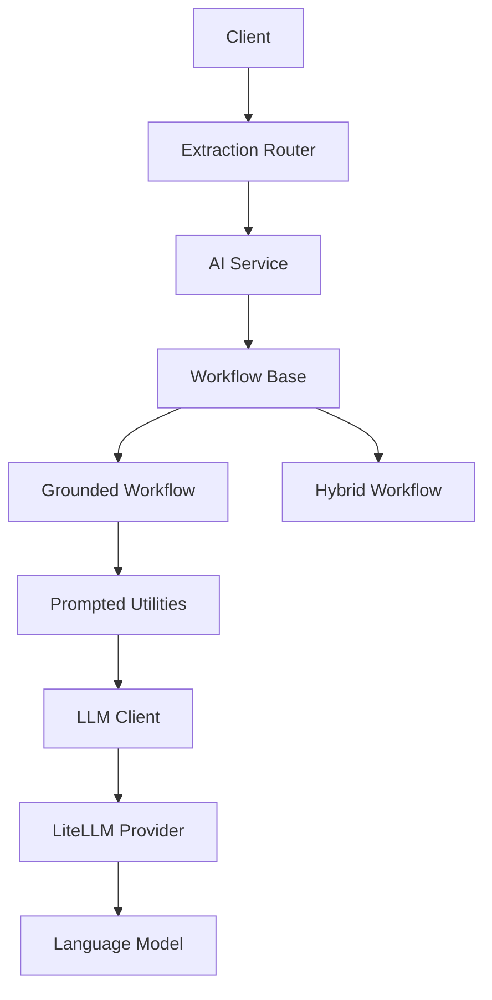
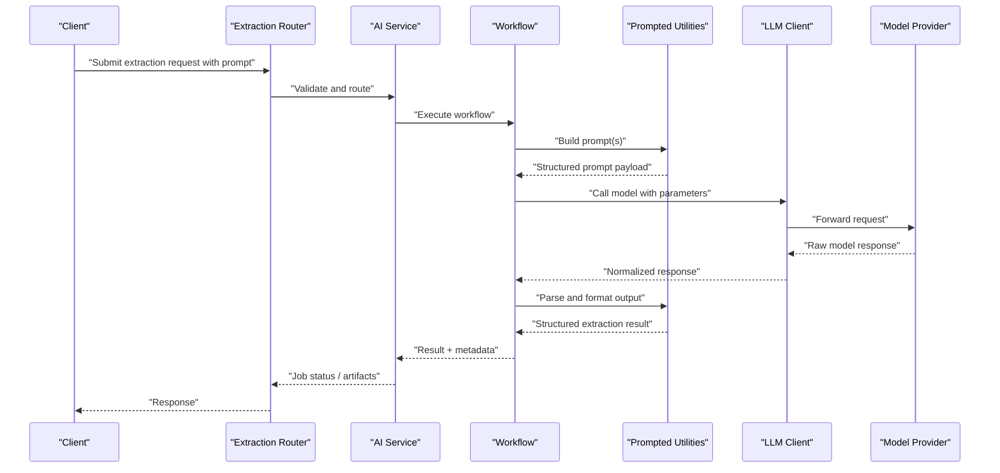
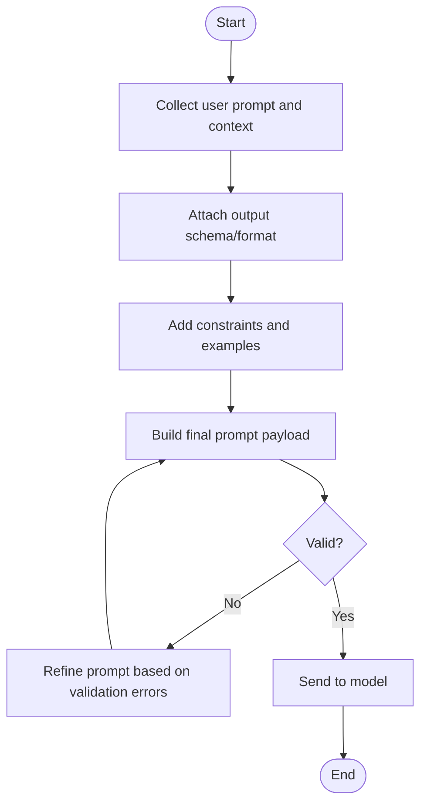
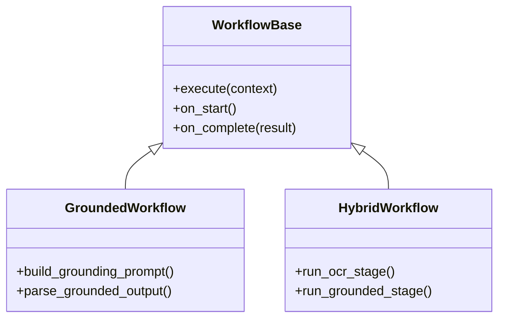
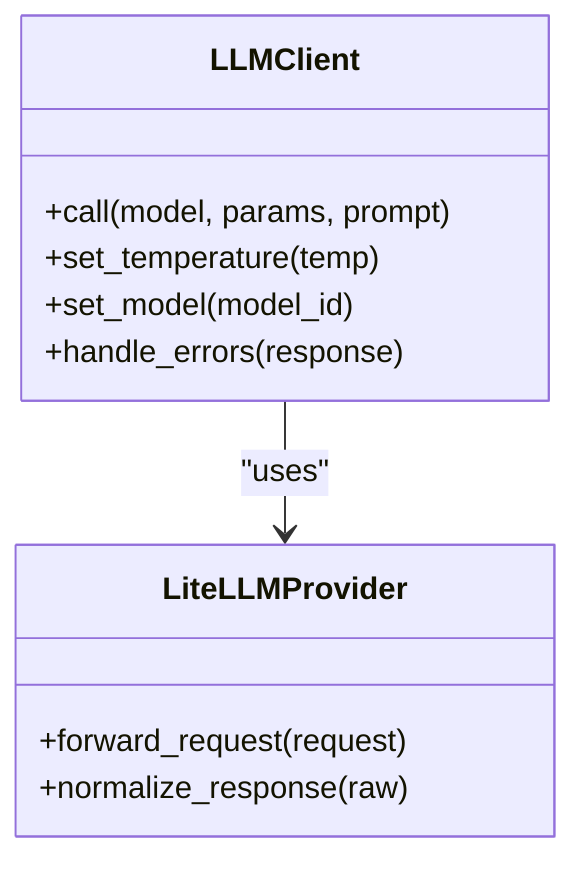
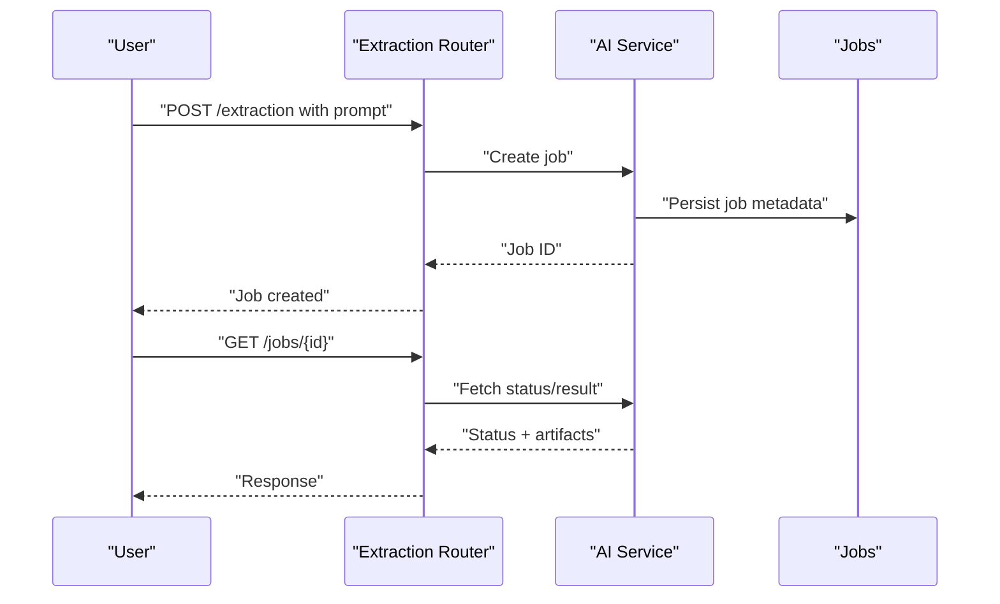
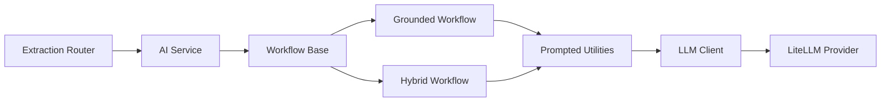

# AI-Powered Prompted Extraction

<cite>
**Referenced Files in This Document**
- [README.md](file://README.md)
- [ARCHITECTURE.md](file://ARCHITECTURE.md)
- [src/local_deepl/core/llm_client.py](file://src/local_deepl/core/llm_client.py)
- [src/local_deepl/api/services/ai.py](file://src/local_deepl/api/services/ai.py)
- [src/local_deepl/api/routers/extraction.py](file://src/local_deepl/api/routers/extraction.py)
- [src/local_deepl/core/workflows/base.py](file://src/local_deepl/core/workflows/base.py)
- [src/local_deepl/core/workflows/grounded.py](file://src/local_deepl/core/workflows/grounded.py)
- [src/local_deepl/core/workflows/hybrid.py](file://src/local_deepl/core/workflows/hybrid.py)
- [src/local_deepl/core/grounded/prompted.py](file://src/local_deepl/core/grounded/prompted.py)
- [src/local_deepl/core/ocr/prompts.py](file://src/local_deepl/core/ocr/prompts.py)
- [src/local_deepl/utils/litellm_provider.py](file://src/local_deepl/utils/litellm_provider.py)
- [examples/](file://examples/)
</cite>

## Table of Contents
1. [Introduction](#introduction)
2. [Project Structure](#project-structure)
3. [Core Components](#core-components)
4. [Architecture Overview](#architecture-overview)
5. [Detailed Component Analysis](#detailed-component-analysis)
6. [Dependency Analysis](#dependency-analysis)
7. [Performance Considerations](#performance-considerations)
8. [Troubleshooting Guide](#troubleshooting-guide)
9. [Conclusion](#conclusion)
10. [Appendices](#appendices)

## Introduction
This document explains the AI-powered prompted extraction system that uses natural language prompts to guide text and structure extraction from documents. It covers how prompts are constructed, interpreted, and executed; how the system integrates with language models; prompt engineering best practices; response processing; model selection and temperature settings; output formatting options; and troubleshooting guidance for common prompting issues. The goal is to help both technical and non-technical users design effective prompts and reliably extract structured information from diverse document types.

## Project Structure
The prompted extraction feature spans API routing, orchestration services, workflow definitions, grounded prompting utilities, and LLM client integration:

- API layer exposes endpoints for extraction jobs and artifacts.
- Services coordinate workflows and interact with LLM clients.
- Workflows define execution strategies (grounded, hybrid).
- Grounded components implement prompt construction and parsing.
- OCR subsystem provides prompt templates for OCR-related tasks.
- LiteLLM provider abstracts model backends and parameters.

**Diagram sources**
- [src/local_deepl/api/routers/extraction.py](file://src/local_deepl/api/routers/extraction.py)
- [src/local_deepl/api/services/ai.py](file://src/local_deepl/api/services/ai.py)
- [src/local_deepl/core/workflows/base.py](file://src/local_deepl/core/workflows/base.py)
- [src/local_deepl/core/workflows/grounded.py](file://src/local_deepl/core/workflows/grounded.py)
- [src/local_deepl/core/workflows/hybrid.py](file://src/local_deepl/core/workflows/hybrid.py)
- [src/local_deepl/core/grounded/prompted.py](file://src/local_deepl/core/grounded/prompted.py)
- [src/local_deepl/core/llm_client.py](file://src/local_deepl/core/llm_client.py)
- [src/local_deepl/utils/litellm_provider.py](file://src/local_deepl/utils/litellm_provider.py)

**Section sources**
- [README.md](file://README.md)
- [ARCHITECTURE.md](file://ARCHITECTURE.md)

## Core Components
- Extraction Router: Accepts user requests containing prompts and document context, validates inputs, and delegates to the AI service.
- AI Service: Orchestrates workflow execution, manages job state, and returns results or artifacts.
- Workflow Base: Defines common lifecycle hooks and execution patterns used by specific workflows.
- Grounded Workflow: Executes extraction using grounded prompting techniques, including grounding against document content.
- Hybrid Workflow: Combines multiple strategies (for example, OCR plus grounded prompting) to improve robustness.
- Prompted Utilities: Builds prompts from natural language instructions, formats outputs, and parses model responses into structured data.
- LLM Client: Encapsulates calls to language models, parameterization (model, temperature), and retries.
- LiteLLM Provider: Abstracts different model providers and standardizes request/response handling.
- OCR Prompts: Provides reusable prompt templates for OCR-related tasks when needed.

Key responsibilities:
- Interpret user intent from natural language prompts.
- Construct well-formed prompts tailored to the target extraction schema.
- Execute model calls with appropriate parameters.
- Parse and validate model outputs into consistent structures.
- Provide feedback loops for refinement and iteration.

**Section sources**
- [src/local_deepl/api/routers/extraction.py](file://src/local_deepl/api/routers/extraction.py)
- [src/local_deepl/api/services/ai.py](file://src/local_deepl/api/services/ai.py)
- [src/local_deepl/core/workflows/base.py](file://src/local_deepl/core/workflows/base.py)
- [src/local_deepl/core/workflows/grounded.py](file://src/local_deepl/core/workflows/grounded.py)
- [src/local_deepl/core/workflows/hybrid.py](file://src/local_deepl/core/workflows/hybrid.py)
- [src/local_deepl/core/grounded/prompted.py](file://src/local_deepl/core/grounded/prompted.py)
- [src/local_deepl/core/llm_client.py](file://src/local_deepl/core/llm_client.py)
- [src/local_deepl/utils/litellm_provider.py](file://src/local_deepl/utils/litellm_provider.py)
- [src/local_deepl/core/ocr/prompts.py](file://src/local_deepl/core/ocr/prompts.py)

## Architecture Overview
The system follows a layered architecture:
- API Layer: Receives extraction requests with prompts and optional constraints.
- Orchestration Layer: Chooses a workflow strategy and coordinates steps.
- Prompting Layer: Translates natural language into structured prompts and post-processes outputs.
- Model Integration Layer: Calls language models via a unified client/provider abstraction.

**Diagram sources**
- [src/local_deepl/api/routers/extraction.py](file://src/local_deepl/api/routers/extraction.py)
- [src/local_deepl/api/services/ai.py](file://src/local_deepl/api/services/ai.py)
- [src/local_deepl/core/workflows/base.py](file://src/local_deepl/core/workflows/base.py)
- [src/local_deepl/core/workflows/grounded.py](file://src/local_deepl/core/workflows/grounded.py)
- [src/local_deepl/core/workflows/hybrid.py](file://src/local_deepl/core/workflows/hybrid.py)
- [src/local_deepl/core/grounded/prompted.py](file://src/local_deepl/core/grounded/prompted.py)
- [src/local_deepl/core/llm_client.py](file://src/local_deepl/core/llm_client.py)
- [src/local_deepl/utils/litellm_provider.py](file://src/local_deepl/utils/litellm_provider.py)

## Detailed Component Analysis

### Prompt Construction and Interpretation
Natural language prompts are transformed into structured prompts that include:
- Task description and objective
- Input context (document excerpts, OCR text, or images)
- Output schema or format specification
- Constraints and examples (optional)
- Confidence or justification fields (optional)

The prompted utilities assemble these elements, ensuring consistency across runs and enabling deterministic parsing of model outputs.

**Diagram sources**
- [src/local_deepl/core/grounded/prompted.py](file://src/local_deepl/core/grounded/prompted.py)

**Section sources**
- [src/local_deepl/core/grounded/prompted.py](file://src/local_deepl/core/grounded/prompted.py)

### Workflow Execution Strategies
- Grounded Workflow: Uses grounded prompting to align extracted entities with source content, improving accuracy and traceability.
- Hybrid Workflow: Combines OCR-derived text with grounded prompting to handle scanned or image-based documents.

**Diagram sources**
- [src/local_deepl/core/workflows/base.py](file://src/local_deepl/core/workflows/base.py)
- [src/local_deepl/core/workflows/grounded.py](file://src/local_deepl/core/workflows/grounded.py)
- [src/local_deepl/core/workflows/hybrid.py](file://src/local_deepl/core/workflows/hybrid.py)

**Section sources**
- [src/local_deepl/core/workflows/base.py](file://src/local_deepl/core/workflows/base.py)
- [src/local_deepl/core/workflows/grounded.py](file://src/local_deepl/core/workflows/grounded.py)
- [src/local_deepl/core/workflows/hybrid.py](file://src/local_deepl/core/workflows/hybrid.py)

### LLM Integration and Parameterization
The LLM client centralizes model calls and parameter configuration:
- Model selection via provider abstraction
- Temperature control for creativity vs determinism
- Retry and error handling policies
- Response normalization

**Diagram sources**
- [src/local_deepl/core/llm_client.py](file://src/local_deepl/core/llm_client.py)
- [src/local_deepl/utils/litellm_provider.py](file://src/local_deepl/utils/litellm_provider.py)

**Section sources**
- [src/local_deepl/core/llm_client.py](file://src/local_deepl/core/llm_client.py)
- [src/local_deepl/utils/litellm_provider.py](file://src/local_deepl/utils/litellm_provider.py)

### OCR Prompt Templates
When OCR is involved, specialized prompt templates ensure consistent extraction from recognized text. These templates can be extended to support domain-specific schemas.

**Section sources**
- [src/local_deepl/core/ocr/prompts.py](file://src/local_deepl/core/ocr/prompts.py)

### API Entry Points and Job Management
The extraction router accepts prompts and orchestrates job lifecycles through the AI service. Jobs may return immediate results or artifacts for later retrieval.

**Diagram sources**
- [src/local_deepl/api/routers/extraction.py](file://src/local_deepl/api/routers/extraction.py)
- [src/local_deepl/api/services/ai.py](file://src/local_deepl/api/services/ai.py)

**Section sources**
- [src/local_deepl/api/routers/extraction.py](file://src/local_deepl/api/routers/extraction.py)
- [src/local_deepl/api/services/ai.py](file://src/local_deepl/api/services/ai.py)

## Dependency Analysis
The following diagram shows key dependencies among core modules:

**Diagram sources**
- [src/local_deepl/api/routers/extraction.py](file://src/local_deepl/api/routers/extraction.py)
- [src/local_deepl/api/services/ai.py](file://src/local_deepl/api/services/ai.py)
- [src/local_deepl/core/workflows/base.py](file://src/local_deepl/core/workflows/base.py)
- [src/local_deepl/core/workflows/grounded.py](file://src/local_deepl/core/workflows/grounded.py)
- [src/local_deepl/core/workflows/hybrid.py](file://src/local_deepl/core/workflows/hybrid.py)
- [src/local_deepl/core/grounded/prompted.py](file://src/local_deepl/core/grounded/prompted.py)
- [src/local_deepl/core/llm_client.py](file://src/local_deepl/core/llm_client.py)
- [src/local_deepl/utils/litellm_provider.py](file://src/local_deepl/utils/litellm_provider.py)

**Section sources**
- [src/local_deepl/api/routers/extraction.py](file://src/local_deepl/api/routers/extraction.py)
- [src/local_deepl/api/services/ai.py](file://src/local_deepl/api/services/ai.py)
- [src/local_deepl/core/workflows/base.py](file://src/local_deepl/core/workflows/base.py)
- [src/local_deepl/core/workflows/grounded.py](file://src/local_deepl/core/workflows/grounded.py)
- [src/local_deepl/core/workflows/hybrid.py](file://src/local_deepl/core/workflows/hybrid.py)
- [src/local_deepl/core/grounded/prompted.py](file://src/local_deepl/core/grounded/prompted.py)
- [src/local_deepl/core/llm_client.py](file://src/local_deepl/core/llm_client.py)
- [src/local_deepl/utils/litellm_provider.py](file://src/local_deepl/utils/litellm_provider.py)

## Performance Considerations
- Model selection: Choose smaller models for speed and larger models for complex reasoning. Use provider abstractions to switch easily.
- Temperature: Lower values yield more deterministic outputs; higher values increase variability and creativity.
- Prompt length: Keep prompts concise and focused to reduce token usage and latency.
- Batch processing: Where possible, batch similar extractions to amortize overhead.
- Caching: Cache repeated prompts and results when safe to do so.
- Streaming: For long outputs, consider streaming responses if supported by the provider.

[No sources needed since this section provides general guidance]

## Troubleshooting Guide
Common prompting issues and resolutions:
- Ambiguous requests: Add explicit output schema, field definitions, and examples to disambiguate.
- Inconsistent formats: Enforce strict JSON or structured formats and validate responses before use.
- Missing entities: Include negative examples and clarify scope to prevent over-extraction.
- Hallucinations: Use grounded workflows to tie outputs to source content and require citations or confidence scores.
- Overly verbose outputs: Specify maximum lengths and required fields only.
- Model drift: Monitor performance across models and adjust temperature or prompt templates accordingly.

Operational checks:
- Verify model connectivity and credentials via the provider.
- Inspect raw model responses for unexpected formats.
- Review job logs and artifacts for step-by-step diagnostics.

**Section sources**
- [src/local_deepl/core/grounded/prompted.py](file://src/local_deepl/core/grounded/prompted.py)
- [src/local_deepl/core/llm_client.py](file://src/local_deepl/core/llm_client.py)
- [src/local_deepl/utils/litellm_provider.py](file://src/local_deepl/utils/litellm_provider.py)

## Conclusion
The AI-powered prompted extraction system enables flexible, high-quality extraction driven by natural language prompts. By combining grounded and hybrid workflows, structured prompt construction, and robust LLM integration, it supports a wide range of extraction scenarios. Following the best practices and troubleshooting guidance here will help you achieve reliable, repeatable results while maintaining clarity and control over model behavior.

[No sources needed since this section summarizes without analyzing specific files]

## Appendices

### Prompt Engineering Best Practices
- Be explicit about objectives and constraints.
- Define a clear output schema with field types and allowed values.
- Provide positive and negative examples to steer behavior.
- Prefer grounded approaches for accuracy-critical tasks.
- Iterate with small changes and measure impact.

[No sources needed since this section provides general guidance]

### Effective Prompt Examples by Scenario
- Entity extraction: Specify entity types, attributes, and relationships; include examples and expected JSON structure.
- Summarization with facts: Request concise summaries and require citation markers tied to source segments.
- Classification with rationale: Ask for category labels and brief justifications to aid review.
- Table reconstruction: Describe column semantics and row ordering; enforce tabular output format.

[No sources needed since this section provides general guidance]

### Handling Ambiguous Requests
- Clarify missing context by asking follow-up questions or providing defaults.
- Use fallback schemas and mark uncertain fields explicitly.
- Employ confidence scoring and allow human-in-the-loop review.

[No sources needed since this section provides general guidance]

### Model Selection and Settings
- Model selection: Evaluate trade-offs between cost, speed, and quality; leverage provider abstractions to swap models.
- Temperature: Start low for deterministic tasks; increase cautiously for creative generation.
- Output formatting: Prefer machine-readable formats (JSON) with strict schemas; add validation layers.

[No sources needed since this section provides general guidance]

### Example Artifacts and Tests
Explore example scripts and tests to understand end-to-end flows and refine your prompts:
- Example directory for sample usage and integrations
- Test suites for AI services, workflows, and grounding logic

**Section sources**
- [examples/](file://examples/)
- [tests/test_ai_services.py](file://tests/test_ai_services.py)
- [tests/test_workflows_grounded.py](file://tests/test_workflows_grounded.py)
- [tests/test_workflows_hybrid.py](file://tests/test_workflows_hybrid.py)