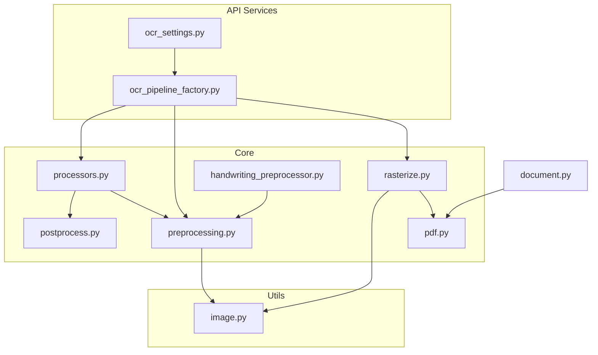
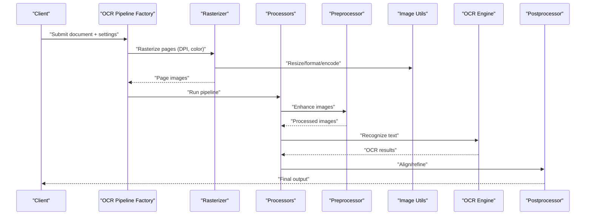
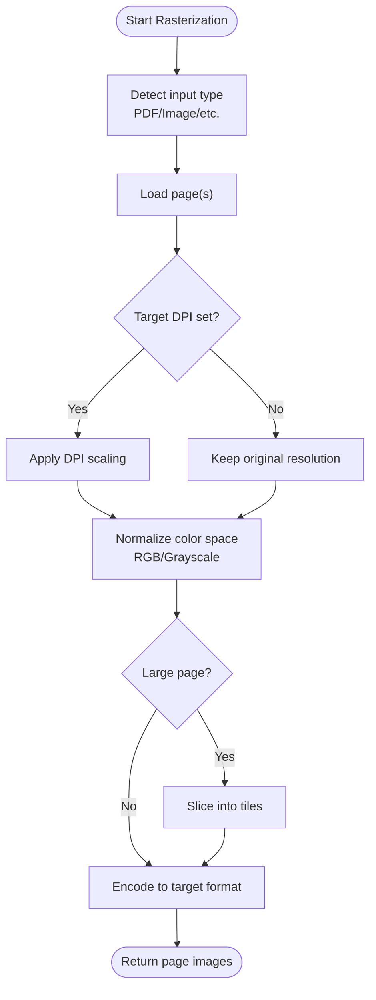
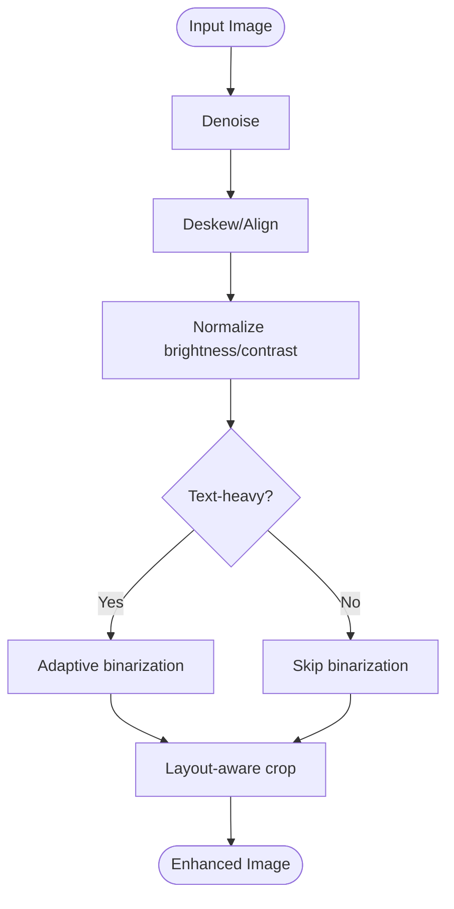
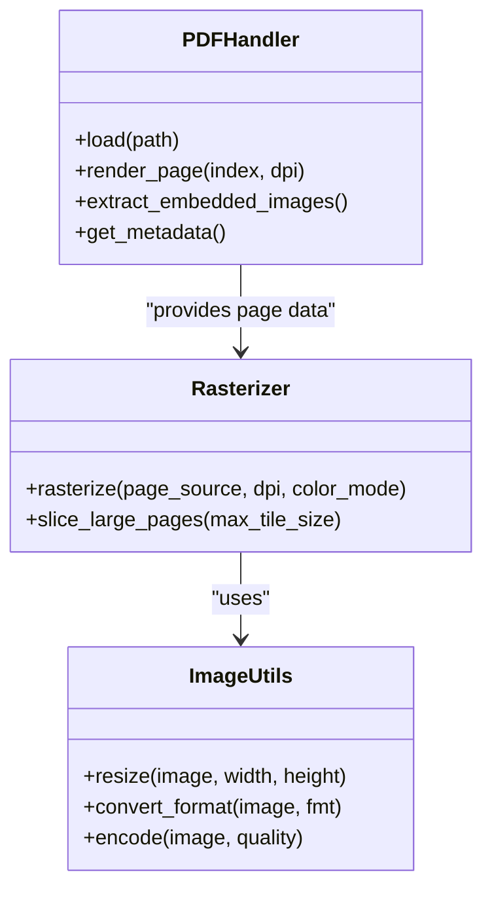
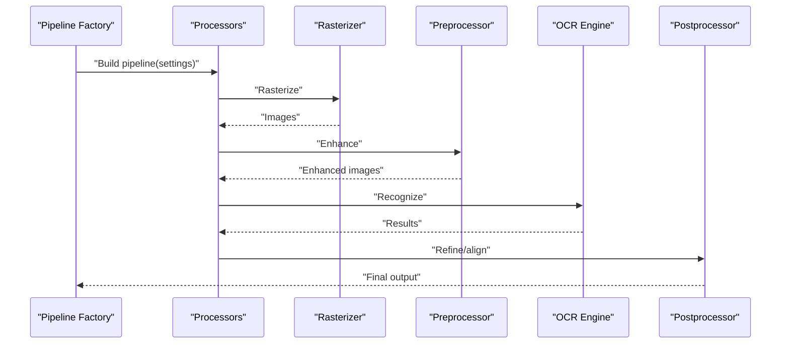
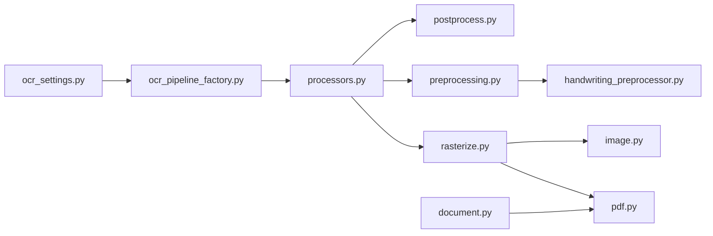

# Document Rasterization and Image Processing

<cite>
**Referenced Files in This Document**
- [rasterize.py](file://src/local_deepl/core/grounded/rasterize.py)
- [preprocessing.py](file://src/local_deepl/core/preprocessing.py)
- [image.py](file://src/local_deepl/utils/image.py)
- [ocr_pipeline_factory.py](file://src/local_deepl/api/services/ocr_pipeline_factory.py)
- [ocr_settings.py](file://src/local_deepl/api/services/ocr_settings.py)
- [document.py](file://src/local_deepl/core/document.py)
- [pdf.py](file://src/local_deepl/core/pdf.py)
- [processors.py](file://src/local_deepl/core/processors.py)
- [postprocess.py](file://src/local_deepl/core/postprocess.py)
- [handwriting_preprocessor.py](file://src/local_deepl/core/handwriting_preprocessor.py)
</cite>

## Table of Contents
1. [Introduction](#introduction)
2. [Project Structure](#project-structure)
3. [Core Components](#core-components)
4. [Architecture Overview](#architecture-overview)
5. [Detailed Component Analysis](#detailed-component-analysis)
6. [Dependency Analysis](#dependency-analysis)
7. [Performance Considerations](#performance-considerations)
8. [Troubleshooting Guide](#troubleshooting-guide)
9. [Conclusion](#conclusion)
10. [Appendices](#appendices)

## Introduction
This document explains the document rasterization and image processing capabilities used to convert documents into images for OCR. It covers resolution management, format conversion, quality optimization, preprocessing and post-processing steps, configuration examples for different input types, handling high-resolution documents, memory management strategies, batch processing approaches, performance tuning, and guidance for choosing appropriate settings per use case.

## Project Structure
The rasterization and image processing logic is primarily implemented under core modules (rasterization, preprocessing, PDF handling, processors) and utility helpers for image operations. The API services layer exposes configuration and pipeline orchestration that tie these components together.

**Diagram sources**
- [ocr_pipeline_factory.py](file://src/local_deepl/api/services/ocr_pipeline_factory.py)
- [ocr_settings.py](file://src/local_deepl/api/services/ocr_settings.py)
- [rasterize.py](file://src/local_deepl/core/grounded/rasterize.py)
- [preprocessing.py](file://src/local_deepl/core/preprocessing.py)
- [pdf.py](file://src/local_deepl/core/pdf.py)
- [processors.py](file://src/local_deepl/core/processors.py)
- [postprocess.py](file://src/local_deepl/core/postprocess.py)
- [handwriting_preprocessor.py](file://src/local_deepl/core/handwriting_preprocessor.py)
- [image.py](file://src/local_deepl/utils/image.py)
- [document.py](file://src/local_deepl/core/document.py)

**Section sources**
- [ocr_pipeline_factory.py](file://src/local_deepl/api/services/ocr_pipeline_factory.py)
- [ocr_settings.py](file://src/local_deepl/api/services/ocr_settings.py)
- [rasterize.py](file://src/local_deepl/core/grounded/rasterize.py)
- [preprocessing.py](file://src/local_deepl/core/preprocessing.py)
- [pdf.py](file://src/local_deepl/core/pdf.py)
- [processors.py](file://src/local_deepl/core/processors.py)
- [postprocess.py](file://src/local_deepl/core/postprocess.py)
- [handwriting_preprocessor.py](file://src/local_deepl/core/handwriting_preprocessor.py)
- [image.py](file://src/local_deepl/utils/image.py)
- [document.py](file://src/local_deepl/core/document.py)

## Core Components
- Rasterizer: Converts pages from various formats (PDFs, images, etc.) into standardized image buffers suitable for OCR. Handles DPI scaling, color space conversions, and page slicing.
- Preprocessor: Applies image enhancements such as denoising, deskewing, contrast/brightness normalization, binarization, and layout-aware cropping. Includes specialized preprocessor paths for handwritten content.
- PDF Handler: Loads and renders PDF pages efficiently, managing vector vs. bitmap rendering and extracting embedded images when applicable.
- Processors: Orchestrates the full pipeline including rasterization, preprocessing, OCR invocation, and optional post-processing.
- Postprocessor: Refines OCR outputs and aligns them with source layouts; may also perform minor image corrections if needed.
- Image Utilities: Provides common operations like resizing, format conversion, encoding/decoding, and memory-safe buffer handling.
- Configuration and Pipeline Factory: Exposes settings for DPI, compression, batching, and selects the appropriate pipeline based on input type and OCR engine.

Key responsibilities and interactions are detailed in the following sections.

**Section sources**
- [rasterize.py](file://src/local_deepl/core/grounded/rasterize.py)
- [preprocessing.py](file://src/local_deepl/core/preprocessing.py)
- [pdf.py](file://src/local_deepl/core/pdf.py)
- [processors.py](file://src/local_deepl/core/processors.py)
- [postprocess.py](file://src/local_deepl/core/postprocess.py)
- [handwriting_preprocessor.py](file://src/local_deepl/core/handwriting_preprocessor.py)
- [image.py](file://src/local_deepl/utils/image.py)
- [ocr_pipeline_factory.py](file://src/local_deepl/api/services/ocr_pipeline_factory.py)
- [ocr_settings.py](file://src/local_deepl/api/services/ocr_settings.py)

## Architecture Overview
The rasterization pipeline transforms a document into one or more images optimized for OCR. The flow includes:
- Input ingestion and type detection
- Rasterization with controlled DPI and color space
- Optional preprocessing tailored to document characteristics
- OCR execution
- Post-processing and alignment

**Diagram sources**
- [ocr_pipeline_factory.py](file://src/local_deepl/api/services/ocr_pipeline_factory.py)
- [rasterize.py](file://src/local_deepl/core/grounded/rasterize.py)
- [preprocessing.py](file://src/local_deepl/core/preprocessing.py)
- [image.py](file://src/local_deepl/utils/image.py)
- [processors.py](file://src/local_deepl/core/processors.py)
- [postprocess.py](file://src/local_deepl/core/postprocess.py)

## Detailed Component Analysis

### Rasterization Pipeline
- Purpose: Convert each page into an image buffer with consistent dimensions, DPI, and color space.
- Key behaviors:
  - Resolution management: Configurable target DPI; supports upscaling/downscaling while preserving aspect ratio.
  - Format conversion: Normalizes to a single internal image representation; can export to PNG/JPEG depending on downstream needs.
  - Quality optimization: Balances sharpness and file size via compression parameters and anti-aliasing controls.
  - Page slicing: For very large pages, splits into tiles to reduce peak memory usage.

**Diagram sources**
- [rasterize.py](file://src/local_deepl/core/grounded/rasterize.py)
- [pdf.py](file://src/local_deepl/core/pdf.py)
- [image.py](file://src/local_deepl/utils/image.py)

**Section sources**
- [rasterize.py](file://src/local_deepl/core/grounded/rasterize.py)
- [pdf.py](file://src/local_deepl/core/pdf.py)
- [image.py](file://src/local_deepl/utils/image.py)

### Image Preprocessing
- Purpose: Improve OCR accuracy by enhancing image quality before recognition.
- Typical steps:
  - Denoising and deblurring
  - Deskewing and straightening
  - Contrast/brightness normalization
  - Adaptive binarization for printed text
  - Layout-aware cropping to remove margins and noise
  - Handwriting-specific enhancements (sharpening, stroke normalization)

**Diagram sources**
- [preprocessing.py](file://src/local_deepl/core/preprocessing.py)
- [handwriting_preprocessor.py](file://src/local_deepl/core/handwriting_preprocessor.py)
- [image.py](file://src/local_deepl/utils/image.py)

**Section sources**
- [preprocessing.py](file://src/local_deepl/core/preprocessing.py)
- [handwriting_preprocessor.py](file://src/local_deepl/core/handwriting_preprocessor.py)
- [image.py](file://src/local_deepl/utils/image.py)

### PDF Handling and Rendering
- Purpose: Efficiently load and render PDF pages, handling both vector and embedded bitmap content.
- Capabilities:
  - Vector-to-bitmap rendering at specified DPI
  - Extracting embedded images without re-rasterizing vectors
  - Managing page boundaries and rotation metadata

**Diagram sources**
- [pdf.py](file://src/local_deepl/core/pdf.py)
- [rasterize.py](file://src/local_deepl/core/grounded/rasterize.py)
- [image.py](file://src/local_deepl/utils/image.py)

**Section sources**
- [pdf.py](file://src/local_deepl/core/pdf.py)
- [rasterize.py](file://src/local_deepl/core/grounded/rasterize.py)
- [image.py](file://src/local_deepl/utils/image.py)

### Processors and Orchestration
- Purpose: Coordinate the end-to-end workflow from input to final OCR output.
- Responsibilities:
  - Selecting pipeline variants based on input type and OCR engine
  - Applying preprocessing and postprocessing stages
  - Managing progress callbacks and error propagation

**Diagram sources**
- [ocr_pipeline_factory.py](file://src/local_deepl/api/services/ocr_pipeline_factory.py)
- [processors.py](file://src/local_deepl/core/processors.py)
- [rasterize.py](file://src/local_deepl/core/grounded/rasterize.py)
- [preprocessing.py](file://src/local_deepl/core/preprocessing.py)
- [postprocess.py](file://src/local_deepl/core/postprocess.py)

**Section sources**
- [ocr_pipeline_factory.py](file://src/local_deepl/api/services/ocr_pipeline_factory.py)
- [processors.py](file://src/local_deepl/core/processors.py)
- [postprocess.py](file://src/local_deepl/core/postprocess.py)

### Post-processing
- Purpose: Align OCR results with source layout, refine text segmentation, and optionally correct minor image artifacts.
- Operations:
  - Text block alignment and ordering
  - Confidence-based filtering
  - Minor image adjustments if required for verification

**Section sources**
- [postprocess.py](file://src/local_deepl/core/postprocess.py)

### Configuration and Settings
- Purpose: Centralize rasterization and OCR-related options.
- Typical options:
  - Target DPI and maximum tile size
  - Color mode (grayscale vs. RGB)
  - Compression quality for output images
  - Batch size and concurrency limits
  - Preprocessing toggles (binarization, deskew, handwriting mode)

**Section sources**
- [ocr_settings.py](file://src/local_deepl/api/services/ocr_settings.py)
- [ocr_pipeline_factory.py](file://src/local_deepl/api/services/ocr_pipeline_factory.py)

## Dependency Analysis
The rasterization subsystem depends on PDF rendering utilities and image processing helpers. The API services layer composes these components through a factory pattern and configuration objects.

**Diagram sources**
- [ocr_settings.py](file://src/local_deepl/api/services/ocr_settings.py)
- [ocr_pipeline_factory.py](file://src/local_deepl/api/services/ocr_pipeline_factory.py)
- [processors.py](file://src/local_deepl/core/processors.py)
- [rasterize.py](file://src/local_deepl/core/grounded/rasterize.py)
- [pdf.py](file://src/local_deepl/core/pdf.py)
- [image.py](file://src/local_deepl/utils/image.py)
- [preprocessing.py](file://src/local_deepl/core/preprocessing.py)
- [postprocess.py](file://src/local_deepl/core/postprocess.py)
- [handwriting_preprocessor.py](file://src/local_deepl/core/handwriting_preprocessor.py)
- [document.py](file://src/local_deepl/core/document.py)

**Section sources**
- [ocr_settings.py](file://src/local_deepl/api/services/ocr_settings.py)
- [ocr_pipeline_factory.py](file://src/local_deepl/api/services/ocr_pipeline_factory.py)
- [processors.py](file://src/local_deepl/core/processors.py)
- [rasterize.py](file://src/local_deepl/core/grounded/rasterize.py)
- [pdf.py](file://src/local_deepl/core/pdf.py)
- [image.py](file://src/local_deepl/utils/image.py)
- [preprocessing.py](file://src/local_deepl/core/preprocessing.py)
- [postprocess.py](file://src/local_deepl/core/postprocess.py)
- [handwriting_preprocessor.py](file://src/local_deepl/core/handwriting_preprocessor.py)
- [document.py](file://src/local_deepl/core/document.py)

## Performance Considerations
- Resolution and DPI:
  - Use moderate DPI (e.g., 300–400) for general OCR; increase only when fine details matter.
  - Downscale oversized images to avoid excessive memory and CPU usage.
- Color Mode:
  - Grayscale often suffices for printed text and reduces memory footprint.
  - Use RGB for color-rich documents where color aids OCR.
- Binarization:
  - Enable adaptive binarization for scanned text; disable for photos or mixed content.
- Tiling:
  - Split large pages into tiles to cap peak memory; ensure overlap is minimal to avoid cutting characters.
- Compression:
  - Prefer lossless formats (PNG) for OCR inputs; use JPEG with tuned quality only if storage/bandwidth constraints dominate.
- Concurrency:
  - Limit parallel tasks to available CPU cores; tune batch sizes to balance throughput and memory.
- Caching:
  - Cache intermediate images when reprocessing multiple times; clear caches between jobs to prevent leaks.

[No sources needed since this section provides general guidance]

## Troubleshooting Guide
- Blurry or low-confidence OCR:
  - Increase DPI moderately; enable deskewing and denoising; verify binarization thresholds.
- Memory errors on large PDFs:
  - Reduce max tile size; switch to grayscale; lower concurrent tasks; ensure tiling is enabled.
- Slow processing:
  - Disable unnecessary preprocessing steps; reduce output image quality; limit batch size.
- Incorrect orientation:
  - Ensure deskew and rotation correction are active; check input metadata.
- Artifacts after binarization:
  - Adjust thresholding parameters; consider keeping grayscale for complex backgrounds.

**Section sources**
- [preprocessing.py](file://src/local_deepl/core/preprocessing.py)
- [handwriting_preprocessor.py](file://src/local_deepl/core/handwriting_preprocessor.py)
- [rasterize.py](file://src/local_deepl/core/grounded/rasterize.py)
- [image.py](file://src/local_deepl/utils/image.py)

## Conclusion
The rasterization and image processing subsystem provides a flexible, configurable pipeline for converting documents into OCR-ready images. By carefully selecting DPI, color mode, preprocessing steps, and tiling strategies, you can optimize for accuracy, speed, and memory efficiency across diverse document types. Use the configuration and factory interfaces to tailor behavior per use case and scale effectively with batch processing and concurrency controls.

[No sources needed since this section summarizes without analyzing specific files]

## Appendices

### Configuration Examples by Use Case
- Printed documents (scanned):
  - DPI: 300–400
  - Color: Grayscale
  - Preprocessing: Denoise, deskew, adaptive binarization
  - Tiles: Enabled for pages > 2000px on any side
- Mixed content (photos + text):
  - DPI: 300
  - Color: RGB
  - Preprocessing: Denoise, deskew; skip binarization
- Handwritten notes:
  - DPI: 300–350
  - Color: Grayscale
  - Preprocessing: Handwriting-specific sharpening and stroke normalization
- High-resolution originals:
  - Downscale to target DPI; enable tiling; prefer grayscale unless color is essential

[No sources needed since this section provides general guidance]