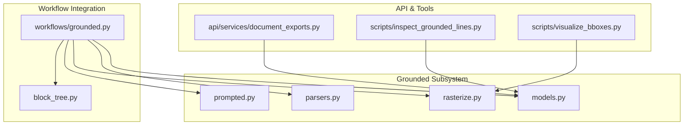
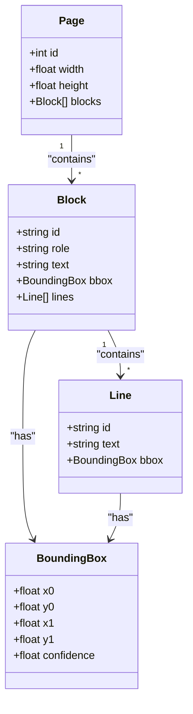
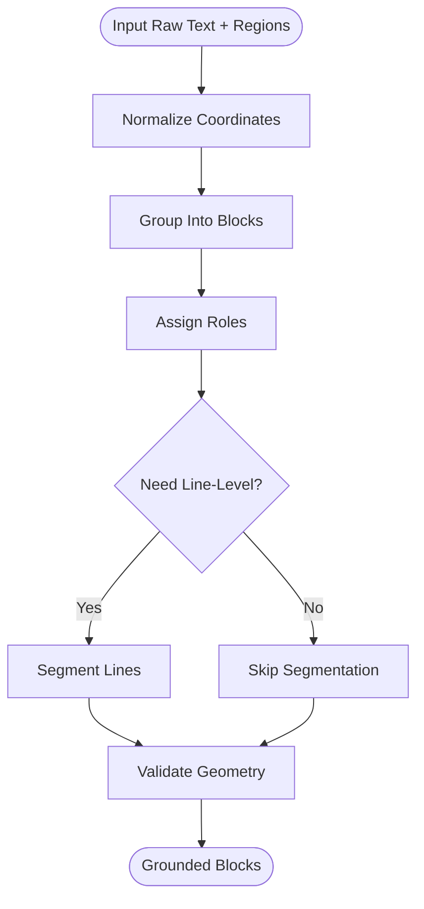
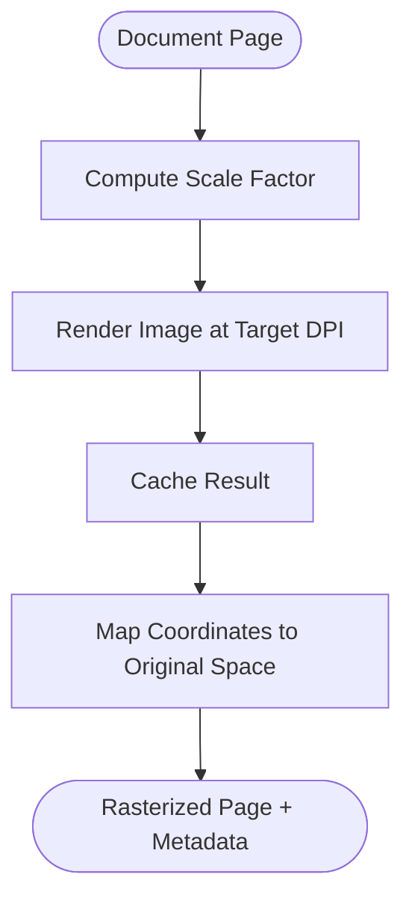
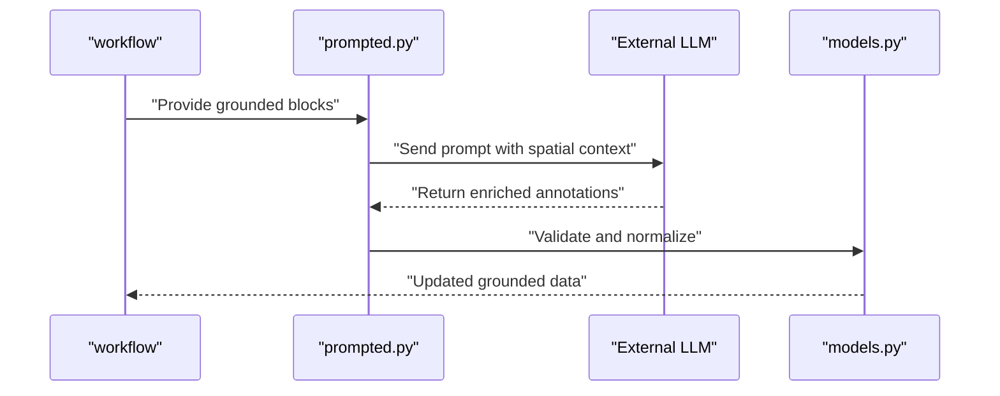
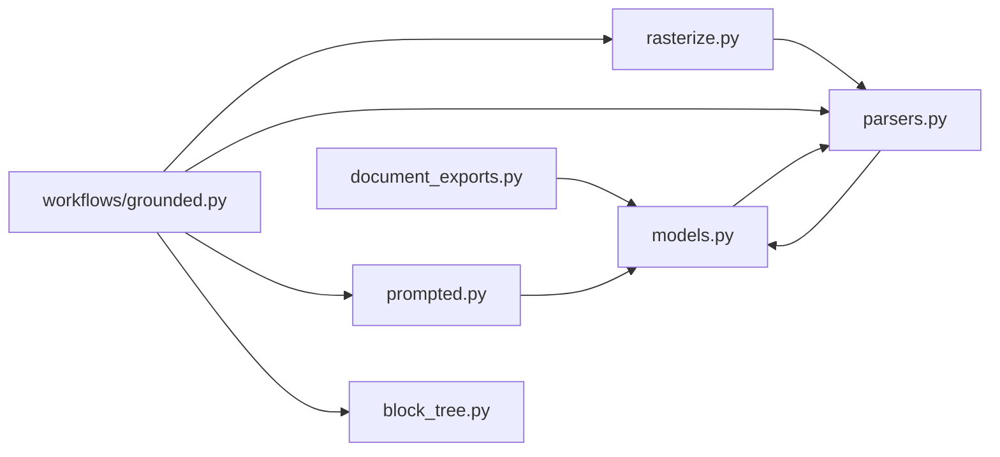

# Grounded Text Extraction

<cite>
**Referenced Files in This Document**
- [core/grounded/models.py](file://src/local_deepl/core/grounded/models.py)
- [core/grounded/parsers.py](file://src/local_deepl/core/grounded/parsers.py)
- [core/grounded/rasterize.py](file://src/local_deepl/core/grounded/rasterize.py)
- [core/grounded/prompted.py](file://src/local_deepl/core/grounded/prompted.py)
- [core/workflows/grounded.py](file://src/local_deepl/core/workflows/grounded.py)
- [core/block_tree.py](file://src/local_deepl/core/block_tree.py)
- [api/services/document_exports.py](file://src/local_deepl/api/services/document_exports.py)
- [scripts/inspect_grounded_lines.py](file://scripts/inspect_grounded_lines.py)
- [scripts/visualize_bboxes.py](file://scripts/visualize_bboxes.py)
</cite>

## Table of Contents
1. Introduction
2. Project Structure
3. Core Components
4. Architecture Overview
5. Detailed Component Analysis
6. Dependency Analysis
7. Performance Considerations
8. Troubleshooting Guide
9. Conclusion

## Introduction
This document explains LocalDeepL’s grounded text extraction subsystem, which performs spatial-aware text extraction to preserve document layout and positioning information. It covers the grounding models, parsing algorithms, rasterization techniques, prompted extraction system, model integration, output formatting options, and performance optimization strategies for large documents and complex layouts. The goal is to help users work with grounded data structures, extract structured content, and maintain visual relationships across pages and blocks.

## Project Structure
The grounded extraction subsystem is implemented under src/local_deepl/core/grounded and integrated via a workflow module. Supporting utilities include block tree construction, export services, and scripts for inspection and visualization.



**Diagram sources**
- [core/grounded/models.py](file://src/local_deepl/core/grounded/models.py)
- [core/grounded/parsers.py](file://src/local_deepl/core/grounded/parsers.py)
- [core/grounded/rasterize.py](file://src/local_deepl/core/grounded/rasterize.py)
- [core/grounded/prompted.py](file://src/local_deepl/core/grounded/prompted.py)
- [core/workflows/grounded.py](file://src/local_deepl/core/workflows/grounded.py)
- [core/block_tree.py](file://src/local_deepl/core/block_tree.py)
- [api/services/document_exports.py](file://src/local_deepl/api/services/document_exports.py)
- [scripts/inspect_grounded_lines.py](file://scripts/inspect_grounded_lines.py)
- [scripts/visualize_bboxes.py](file://scripts/visualize_bboxes.py)

**Section sources**
- [core/grounded/models.py](file://src/local_deepl/core/grounded/models.py)
- [core/grounded/parsers.py](file://src/local_deepl/core/grounded/parsers.py)
- [core/grounded/rasterize.py](file://src/local_deepl/core/grounded/rasterize.py)
- [core/grounded/prompted.py](file://src/local_deepl/core/grounded/prompted.py)
- [core/workflows/grounded.py](file://src/local_deepl/core/workflows/grounded.py)
- [core/block_tree.py](file://src/local_deepl/core/block_tree.py)
- [api/services/document_exports.py](file://src/local_deepl/api/services/document_exports.py)
- [scripts/inspect_grounded_lines.py](file://scripts/inspect_grounded_lines.py)
- [scripts/visualize_bboxes.py](file://scripts/visualize_bboxes.py)

## Core Components
- Grounding models define the canonical data structures for text spans, bounding boxes, page coordinates, and semantic roles. These structures carry both textual content and precise spatial metadata.
- Parsers convert raw OCR or digital text outputs into grounded representations, aligning text fragments to their bounding boxes and assigning structural roles (e.g., headings, paragraphs).
- Rasterization renders page images at appropriate resolutions and scales, enabling robust detection and alignment while preserving coordinate systems.
- Prompted extraction integrates language models to infer structure and semantics from grounded inputs, producing enriched outputs that respect spatial relationships.
- Workflow orchestration ties together preprocessing, grounding, parsing, prompting, and postprocessing steps, exposing consistent APIs for consumers.

Key responsibilities:
- Maintain a unified coordinate space per page.
- Preserve hierarchical relationships among blocks and lines.
- Provide stable identifiers for cross-referencing between text and visuals.
- Support multiple output formats for downstream applications.

**Section sources**
- [core/grounded/models.py](file://src/local_deepl/core/grounded/models.py)
- [core/grounded/parsers.py](file://src/local_deepl/core/grounded/parsers.py)
- [core/grounded/rasterize.py](file://src/local_deepl/core/grounded/rasterize.py)
- [core/grounded/prompted.py](file://src/local_deepl/core/grounded/prompted.py)
- [core/workflows/grounded.py](file://src/local_deepl/core/workflows/grounded.py)

## Architecture Overview
The grounded extraction pipeline ingests document pages, rasterizes them as needed, extracts text with spatial anchors, parses into structured blocks, optionally prompts an LLM to enrich semantics, and exports results in multiple formats.

```mermaid
sequenceDiagram
participant Client as "Client"
participant API as "document_exports.py"
participant WF as "workflows/grounded.py"
participant RS as "rasterize.py"
participant PAR as "parsers.py"
participant MOD as "models.py"
participant PROM as "prompted.py"
Client->>API : "Request grounded extraction"
API->>WF : "Invoke pipeline"
WF->>RS : "Rasterize pages"
RS-->>WF : "Page images + scale info"
WF->>PAR : "Parse text + bboxes"
PAR-->>WF : "Grounded blocks"
WF->>MOD : "Normalize to canonical models"
MOD-->>WF : "Structured grounded data"
WF->>PROM : "Optional prompted enrichment"
PROM-->>WF : "Enriched grounded data"
WF-->>API : "Export-ready result"
API-->>Client : "Formatted output"
```

**Diagram sources**
- [api/services/document_exports.py](file://src/local_deepl/api/services/document_exports.py)
- [core/workflows/grounded.py](file://src/local_deepl/core/workflows/grounded.py)
- [core/grounded/rasterize.py](file://src/local_deepl/core/grounded/rasterize.py)
- [core/grounded/parsers.py](file://src/local_deepl/core/grounded/parsers.py)
- [core/grounded/models.py](file://src/local_deepl/core/grounded/models.py)
- [core/grounded/prompted.py](file://src/local_deepl/core/grounded/prompted.py)

## Detailed Component Analysis

### Grounding Models
The grounding models provide the canonical representation for text elements with spatial context. They typically include:
- Page-level containers holding ordered blocks.
- Block entities with role labels, text content, and bounding boxes.
- Line-level granularity for fine-grained alignment.
- Stable IDs for linking across processing stages.

These models ensure consistency across parsers, rasterization, and prompting modules. Consumers can traverse the hierarchy to reconstruct layout and compute distances or alignments.



**Diagram sources**
- [core/grounded/models.py](file://src/local_deepl/core/grounded/models.py)

**Section sources**
- [core/grounded/models.py](file://src/local_deepl/core/grounded/models.py)

### Parsing Algorithms
Parsing transforms raw OCR or digital text into grounded blocks by:
- Detecting text regions and associating them with bounding boxes.
- Grouping adjacent regions into logical blocks based on proximity and alignment.
- Assigning semantic roles using heuristics or learned signals.
- Normalizing coordinates to a common page scale.

The parser ensures robust handling of multi-column layouts, rotated text, and nested structures. It also computes line-level segmentation when necessary for high-fidelity reconstruction.



**Diagram sources**
- [core/grounded/parsers.py](file://src/local_deepl/core/grounded/parsers.py)

**Section sources**
- [core/grounded/parsers.py](file://src/local_deepl/core/grounded/parsers.py)

### Rasterization Techniques
Rasterization prepares page images for reliable text detection and alignment:
- Resampling to target DPI to balance accuracy and memory usage.
- Preserving aspect ratio and scaling factors for coordinate mapping.
- Handling color spaces and binarization where beneficial.
- Caching intermediate renderings to avoid recomputation.

Coordinate transformations are applied consistently so that all bounding boxes remain aligned with the original document geometry.



**Diagram sources**
- [core/grounded/rasterize.py](file://src/local_deepl/core/grounded/rasterize.py)

**Section sources**
- [core/grounded/rasterize.py](file://src/local_deepl/core/grounded/rasterize.py)

### Prompted Extraction System
Prompted extraction leverages language models to enhance grounded data:
- Input includes grounded blocks with spatial context.
- Prompts instruct the model to infer structure, entity types, and relationships while respecting layout.
- Outputs are validated against spatial constraints to prevent hallucinated positions.
- Results integrate back into the grounded schema for downstream use.

This approach improves semantic understanding without sacrificing spatial fidelity.



**Diagram sources**
- [core/grounded/prompted.py](file://src/local_deepl/core/grounded/prompted.py)
- [core/grounded/models.py](file://src/local_deepl/core/grounded/models.py)

**Section sources**
- [core/grounded/prompted.py](file://src/local_deepl/core/grounded/prompted.py)

### Workflow Orchestration
The grounded workflow orchestrates the full pipeline:
- Loads document pages and configures rasterization parameters.
- Invokes parsers to produce grounded blocks.
- Optionally runs prompted enrichment.
- Builds a block tree for hierarchical navigation.
- Exports results in multiple formats.

It exposes a clean interface for clients and supports callbacks for progress tracking and error handling.

```mermaid
sequenceDiagram
participant Client as "Client"
participant WF as "workflows/grounded.py"
participant RS as "rasterize.py"
participant PAR as "parsers.py"
participant PROM as "prompted.py"
participant BT as "block_tree.py"
participant EXP as "document_exports.py"
Client->>WF : "Start extraction"
WF->>RS : "Rasterize"
RS-->>WF : "Images + scale"
WF->>PAR : "Parse to grounded"
PAR-->>WF : "Blocks"
WF->>PROM : "Prompt if enabled"
PROM-->>WF : "Enriched blocks"
WF->>BT : "Build block tree"
BT-->>WF : "Tree structure"
WF->>EXP : "Export"
EXP-->>Client : "Output artifacts"
```

**Diagram sources**
- [core/workflows/grounded.py](file://src/local_deepl/core/workflows/grounded.py)
- [core/grounded/rasterize.py](file://src/local_deepl/core/grounded/rasterize.py)
- [core/grounded/parsers.py](file://src/local_deepl/core/grounded/parsers.py)
- [core/grounded/prompted.py](file://src/local_deepl/core/grounded/prompted.py)
- [core/block_tree.py](file://src/local_deepl/core/block_tree.py)
- [api/services/document_exports.py](file://src/local_deepl/api/services/document_exports.py)

**Section sources**
- [core/workflows/grounded.py](file://src/local_deepl/core/workflows/grounded.py)
- [core/block_tree.py](file://src/local_deepl/core/block_tree.py)
- [api/services/document_exports.py](file://src/local_deepl/api/services/document_exports.py)

### Working With Grounded Data Structures
Practical examples of using grounded data:
- Traversing page-block-line hierarchy to reconstruct reading order.
- Computing relative positions to detect columns or side-by-side elements.
- Filtering blocks by role or confidence thresholds.
- Linking text spans to image regions for annotation tools.

Use the provided scripts to inspect and visualize grounded outputs:
- Inspect grounded lines to validate parsing quality.
- Visualize bounding boxes to confirm spatial alignment.

**Section sources**
- [scripts/inspect_grounded_lines.py](file://scripts/inspect_grounded_lines.py)
- [scripts/visualize_bboxes.py](file://scripts/visualize_bboxes.py)

### Output Formatting Options
The export service supports multiple output formats:
- JSON with full spatial metadata for programmatic consumption.
- Structured text with preserved layout markers for human readability.
- Tree-based representations for hierarchical navigation.

Clients can select formats based on downstream needs, balancing fidelity and verbosity.

**Section sources**
- [api/services/document_exports.py](file://src/local_deepl/api/services/document_exports.py)

## Dependency Analysis
The grounded subsystem exhibits clear separation of concerns:
- Models define shared contracts used by parsers, rasterizer, and prompted extractor.
- Parsers depend on rasterization outputs and feed normalized structures into models.
- Prompted extraction consumes grounded models and returns enriched versions.
- Workflow orchestrates these components and builds auxiliary structures like block trees.
- Export services consume final grounded data to produce user-facing artifacts.



**Diagram sources**
- [core/grounded/models.py](file://src/local_deepl/core/grounded/models.py)
- [core/grounded/parsers.py](file://src/local_deepl/core/grounded/parsers.py)
- [core/grounded/rasterize.py](file://src/local_deepl/core/grounded/rasterize.py)
- [core/grounded/prompted.py](file://src/local_deepl/core/grounded/prompted.py)
- [core/workflows/grounded.py](file://src/local_deepl/core/workflows/grounded.py)
- [core/block_tree.py](file://src/local_deepl/core/block_tree.py)
- [api/services/document_exports.py](file://src/local_deepl/api/services/document_exports.py)

**Section sources**
- [core/grounded/models.py](file://src/local_deepl/core/grounded/models.py)
- [core/grounded/parsers.py](file://src/local_deepl/core/grounded/parsers.py)
- [core/grounded/rasterize.py](file://src/local_deepl/core/grounded/rasterize.py)
- [core/grounded/prompted.py](file://src/local_deepl/core/grounded/prompted.py)
- [core/workflows/grounded.py](file://src/local_deepl/core/workflows/grounded.py)
- [core/block_tree.py](file://src/local_deepl/core/block_tree.py)
- [api/services/document_exports.py](file://src/local_deepl/api/services/document_exports.py)

## Performance Considerations
Optimizations for large documents and complex layouts:
- Adaptive rasterization: choose DPI per page complexity; cache rendered images to avoid recomputation.
- Parallel processing: process independent pages concurrently; limit concurrency to control memory usage.
- Incremental parsing: parse pages lazily and stream grounded blocks to reduce peak memory.
- Spatial pruning: skip low-confidence regions early to speed up grouping and role assignment.
- Efficient block tree construction: build hierarchies incrementally and reuse computed metrics.
- Export batching: write large outputs in chunks to minimize I/O overhead.

[No sources needed since this section provides general guidance]

## Troubleshooting Guide
Common issues and remedies:
- Misaligned bounding boxes: verify rasterization scale factors and coordinate normalization; re-run rasterization with adjusted DPI.
- Missing lines or merged blocks: tune grouping thresholds and segmentation parameters in the parser.
- Poor prompted enrichment: refine prompts to emphasize spatial constraints; add validation checks to reject implausible annotations.
- High memory usage: enable streaming exports and reduce concurrency; consider downsampling rasterization for very large pages.
- Slow processing: profile rasterization and parsing hotspots; leverage caching and parallelism appropriately.

Use diagnostic scripts:
- Inspect grounded lines to identify parsing anomalies.
- Visualize bounding boxes to confirm spatial correctness.

**Section sources**
- [scripts/inspect_grounded_lines.py](file://scripts/inspect_grounded_lines.py)
- [scripts/visualize_bboxes.py](file://scripts/visualize_bboxes.py)

## Conclusion
LocalDeepL’s grounded text extraction subsystem delivers spatially faithful, semantically enriched document analysis. By combining robust rasterization, precise parsing, and optional prompted enhancement, it preserves layout and positioning while providing flexible output formats. The modular architecture enables scalability and adaptability for diverse document types and workloads.

[No sources needed since this section summarizes without analyzing specific files]