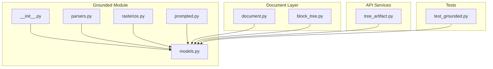
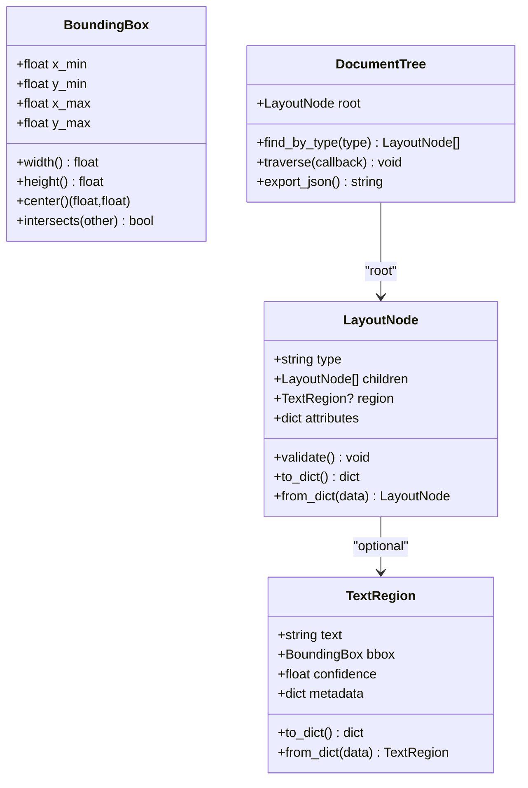
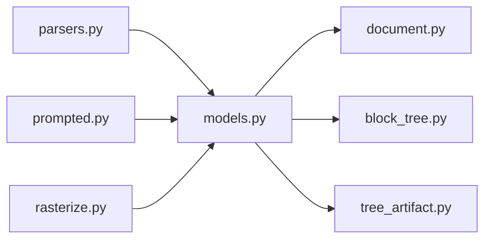

# Grounding Models and Data Structures

<cite>
**Referenced Files in This Document**
- [models.py](file://src/local_deepl/core/grounded/models.py)
- [parsers.py](file://src/local_deepl/core/grounded/parsers.py)
- [rasterize.py](file://src/local_deepl/core/grounded/rasterize.py)
- [prompted.py](file://src/local_deepl/core/grounded/prompted.py)
- [__init__.py](file://src/local_deepl/core/grounded/__init__.py)
- [document.py](file://src/local_deepl/core/document.py)
- [block_tree.py](file://src/local_deepl/core/block_tree.py)
- [tree_artifact.py](file://src/local_deepl/api/services/tree_artifact.py)
- [test_grounded.py](file://tests/test_grounded.py)
</cite>

## Table of Contents
1. [Introduction](#introduction)
2. [Project Structure](#project-structure)
3. [Core Components](#core-components)
4. [Architecture Overview](#architecture-overview)
5. [Detailed Component Analysis](#detailed-component-analysis)
6. [Dependency Analysis](#dependency-analysis)
7. [Performance Considerations](#performance-considerations)
8. [Troubleshooting Guide](#troubleshooting-guide)
9. [Conclusion](#conclusion)
10. [Appendices](#appendices)

## Introduction
This document explains the grounded text extraction models and data structures that represent spatial-aware text content. It focuses on how bounding boxes, text regions, layout information, and hierarchical document structure are modeled, serialized, validated, and used across the system. It also provides guidance for creating, manipulating, and querying grounded text objects, clarifies coordinate conventions, and outlines performance considerations for large documents.

## Project Structure
The grounded models live under a dedicated module and integrate with higher-level document and tree artifacts:
- Core grounded models and utilities: src/local_deepl/core/grounded
- Document model integration: src/local_deepl/core/document.py
- Block tree representation: src/local_deepl/core/block_tree.py
- Tree artifact serialization: src/local_deepl/api/services/tree_artifact.py
- Tests exercising grounded behavior: tests/test_grounded.py

**Diagram sources**
- [models.py](file://src/local_deepl/core/grounded/models.py)
- [parsers.py](file://src/local_deepl/core/grounded/parsers.py)
- [rasterize.py](file://src/local_deepl/core/grounded/rasterize.py)
- [prompted.py](file://src/local_deepl/core/grounded/prompted.py)
- [__init__.py](file://src/local_deepl/core/grounded/__init__.py)
- [document.py](file://src/local_deepl/core/document.py)
- [block_tree.py](file://src/local_deepl/core/block_tree.py)
- [tree_artifact.py](file://src/local_deepl/api/services/tree_artifact.py)
- [test_grounded.py](file://tests/test_grounded.py)

**Section sources**
- [models.py](file://src/local_deepl/core/grounded/models.py)
- [document.py](file://src/local_deepl/core/document.py)
- [block_tree.py](file://src/local_deepl/core/block_tree.py)
- [tree_artifact.py](file://src/local_deepl/api/services/tree_artifact.py)
- [test_grounded.py](file://tests/test_grounded.py)

## Core Components
This section summarizes the primary data models and their responsibilities:
- Bounding box and geometry primitives for spatial coordinates
- Text region and line-level entities with grounding metadata
- Layout nodes forming a hierarchical document structure
- Serialization helpers and validation rules ensuring consistent formats

Key aspects:
- Spatial coordinates are represented using normalized or pixel-based bounding boxes with explicit origin and axis orientation documented by the models.
- Text regions encapsulate both textual content and associated geometry, enabling precise alignment and reflow.
- Layout hierarchy maintains parent-child relationships among blocks, lines, and spans to preserve document structure.
- Validation enforces non-empty text, valid coordinate ranges, and consistent nesting.

**Section sources**
- [models.py](file://src/local_deepl/core/grounded/models.py)
- [__init__.py](file://src/local_deepl/core/grounded/__init__.py)

## Architecture Overview
The grounded models are consumed by multiple layers:
- The document layer constructs and navigates grounded structures.
- The block tree organizes layout into a navigable hierarchy.
- The API services serialize grounded trees for export and storage.
- Tests validate correctness and edge cases.

**Diagram sources**
- [models.py](file://src/local_deepl/core/grounded/models.py)

## Detailed Component Analysis

### Bounding Box and Geometry
- Purpose: Represent rectangular regions in page space.
- Attributes:
  - Coordinates: x_min, y_min, x_max, y_max
  - Derived properties: width, height, center
  - Operations: intersection checks, containment queries
- Coordinate convention:
  - Origin at top-left; x increases rightward, y increases downward.
  - Values may be pixel-based or normalized depending on context; models expose helpers to convert between representations when needed.
- Validation:
  - Non-negative dimensions
  - x_min <= x_max and y_min <= y_max
  - Optional normalization to [0,1] range for portability

Example usage patterns:
- Create a bounding box from four floats and compute its area.
- Check if two boxes overlap to merge nearby lines.
- Normalize coordinates relative to page size for consistent downstream processing.

**Section sources**
- [models.py](file://src/local_deepl/core/grounded/models.py)

### Text Region Model
- Purpose: Pair textual content with spatial grounding and optional metadata.
- Attributes:
  - text: the extracted string
  - bbox: associated bounding box
  - confidence: detection confidence score
  - metadata: additional fields such as font hints, language tags, or source provenance
- Methods:
  - Serialization: to_dict/from_dict for JSON interchange
  - Query helpers: contains_point, overlaps_with
- Validation:
  - Non-empty text
  - Valid bounding box
  - Confidence within expected range

Example usage patterns:
- Build a region from OCR output and attach a bounding box.
- Serialize a region for storage or transmission.
- Filter regions by confidence threshold before further processing.

**Section sources**
- [models.py](file://src/local_deepl/core/grounded/models.py)

### Layout Node and Hierarchy
- Purpose: Represent structured layout elements (blocks, paragraphs, lines, spans).
- Attributes:
  - type: semantic label (e.g., paragraph, line, span)
  - children: ordered list of child nodes
  - region: optional TextRegion for leaf nodes
  - attributes: free-form key-value pairs for extra info
- Methods:
  - validate(): ensure structural invariants
  - to_dict()/from_dict(): full tree serialization
  - traversal helpers: find_by_type, iterate leaves
- Invariants:
  - Parent-child ordering preserved
  - Leaf nodes carry text regions; internal nodes aggregate structure
  - No cycles in the tree

Example usage patterns:
- Construct a paragraph node containing multiple line nodes.
- Traverse the tree to collect all spans with bounding boxes.
- Export the entire layout tree to JSON for persistence.

**Section sources**
- [models.py](file://src/local_deepl/core/grounded/models.py)

### Parsing and Prompted Generation
- parsers.py:
  - Converts raw OCR or LLM outputs into grounded models.
  - Applies normalization and validation during parsing.
- prompted.py:
  - Integrates prompt-driven generation of grounded structures.
  - Ensures generated outputs conform to model schemas.

Typical flow:
- Input raw tokens or segments -> parse into TextRegion and LayoutNode -> validate -> assemble DocumentTree.

**Section sources**
- [parsers.py](file://src/local_deepl/core/grounded/parsers.py)
- [prompted.py](file://src/local_deepl/core/grounded/prompted.py)

### Rasterization Utilities
- rasterize.py:
  - Provides helpers to render or visualize grounded regions.
  - May include utilities to map between coordinate systems (e.g., image vs. PDF units).

Use cases:
- Visual debugging of detected regions.
- Generating overlays for quality assurance.

**Section sources**
- [rasterize.py](file://src/local_deepl/core/grounded/rasterize.py)

### Integration with Document and Block Tree
- document.py:
  - Consumes grounded models to build high-level document representations.
  - Exposes APIs to query grounded content by position or semantics.
- block_tree.py:
  - Organizes layout into a navigable block tree aligned with grounded nodes.

Integration points:
- Document creation pipelines instantiate grounded models and populate the block tree.
- Queries traverse grounded structures to answer spatial or semantic questions.

**Section sources**
- [document.py](file://src/local_deepl/core/document.py)
- [block_tree.py](file://src/local_deepl/core/block_tree.py)

### Serialization via Tree Artifact Service
- tree_artifact.py:
  - Serializes grounded trees to standardized JSON artifacts.
  - Handles versioning and compatibility transformations.

Export workflow:
- DocumentTree.to_dict() -> TreeArtifactService.serialize() -> persisted artifact.

**Section sources**
- [tree_artifact.py](file://src/local_deepl/api/services/tree_artifact.py)

### Example Workflows

#### Creating Grounded Objects
- Instantiate a bounding box with page coordinates.
- Create a TextRegion with text and bbox.
- Compose LayoutNode(s) to form a paragraph or line.
- Attach regions to leaf nodes and validate the tree.

#### Manipulating and Querying
- Merge adjacent lines based on bbox proximity.
- Filter regions by confidence or type.
- Traverse the tree to extract all spans with their coordinates.

#### Serializing and Persisting
- Convert the DocumentTree to a dictionary.
- Use the tree artifact service to write a versioned JSON file.

These workflows are exercised in tests and can be adapted for custom pipelines.

**Section sources**
- [test_grounded.py](file://tests/test_grounded.py)
- [models.py](file://src/local_deepl/core/grounded/models.py)
- [tree_artifact.py](file://src/local_deepl/api/services/tree_artifact.py)

## Dependency Analysis
The grounded module depends on minimal external libraries and is designed for low coupling:
- Internal dependencies:
  - document.py consumes grounded models for higher-level operations.
  - block_tree.py builds a navigation-friendly view over grounded layouts.
  - tree_artifact.py serializes grounded trees for storage/export.
- External dependencies:
  - Standard library for JSON and math operations.
  - Optional visualization helpers in rasterize.py.

**Diagram sources**
- [models.py](file://src/local_deepl/core/grounded/models.py)
- [document.py](file://src/local_deepl/core/document.py)
- [block_tree.py](file://src/local_deepl/core/block_tree.py)
- [tree_artifact.py](file://src/local_deepl/api/services/tree_artifact.py)
- [parsers.py](file://src/local_deepl/core/grounded/parsers.py)
- [prompted.py](file://src/local_deepl/core/grounded/prompted.py)
- [rasterize.py](file://src/local_deepl/core/grounded/rasterize.py)

**Section sources**
- [models.py](file://src/local_deepl/core/grounded/models.py)
- [document.py](file://src/local_deepl/core/document.py)
- [block_tree.py](file://src/local_deepl/core/block_tree.py)
- [tree_artifact.py](file://src/local_deepl/api/services/tree_artifact.py)

## Performance Considerations
- Memory optimization:
  - Prefer lazy construction of heavy objects; defer rasterization until needed.
  - Use generators or iterators when traversing large trees to avoid materializing full lists.
  - Normalize coordinates once and reuse computed values (width, height, center).
- Large documents:
  - Process pages incrementally and stream results to disk rather than holding entire trees in memory.
  - Batch serialization to reduce overhead.
- Spatial queries:
  - Precompute bounding box indices (e.g., R-tree) for efficient overlap queries on dense pages.
- Validation:
  - Validate early and fail fast to avoid building invalid structures that consume memory.

[No sources needed since this section provides general guidance]

## Troubleshooting Guide
Common issues and resolutions:
- Invalid coordinates:
  - Ensure x_min <= x_max and y_min <= y_max; normalize negative or out-of-range values.
- Empty text regions:
  - Reject or sanitize empty strings before constructing TextRegion instances.
- Confidence thresholds:
  - Apply consistent filtering to remove low-confidence detections.
- Serialization errors:
  - Verify that all required fields are present and types match schema expectations.
- Visualization mismatches:
  - Confirm coordinate system and origin assumptions align with image/PDF rendering code.

Validation and test coverage:
- Refer to tests for examples of correct object creation and error handling paths.

**Section sources**
- [test_grounded.py](file://tests/test_grounded.py)
- [models.py](file://src/local_deepl/core/grounded/models.py)

## Conclusion
The grounded models provide a robust foundation for representing spatial-aware text content. By combining precise geometry, rich layout hierarchy, and strict validation, they enable reliable extraction, manipulation, and export of document structures. Following the recommended practices for memory efficiency and coordinate consistency ensures scalability for large documents and smooth integration across the system.

## Appendices

### Coordinate System Reference
- Origin: top-left
- Axes: x rightward, y downward
- Units: pixels unless explicitly normalized; models support conversion helpers

### Serialization Format Notes
- JSON-compatible dictionaries produced by to_dict/from_dict methods.
- Versioned artifacts handled by the tree artifact service.

**Section sources**
- [models.py](file://src/local_deepl/core/grounded/models.py)
- [tree_artifact.py](file://src/local_deepl/api/services/tree_artifact.py)