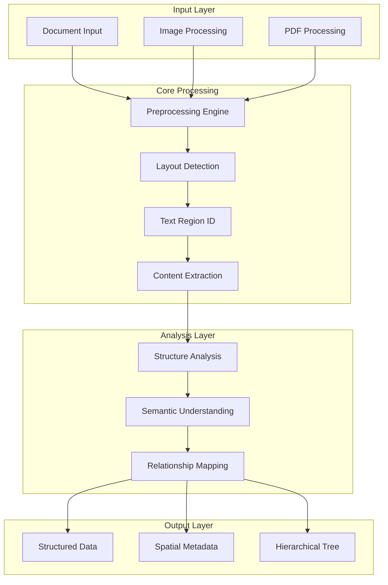
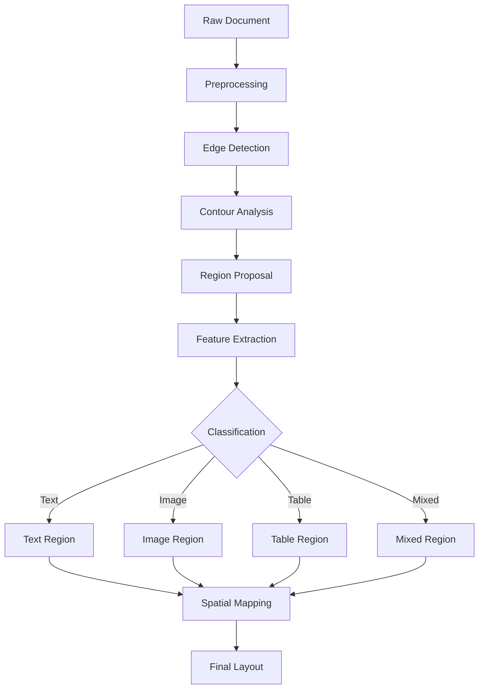
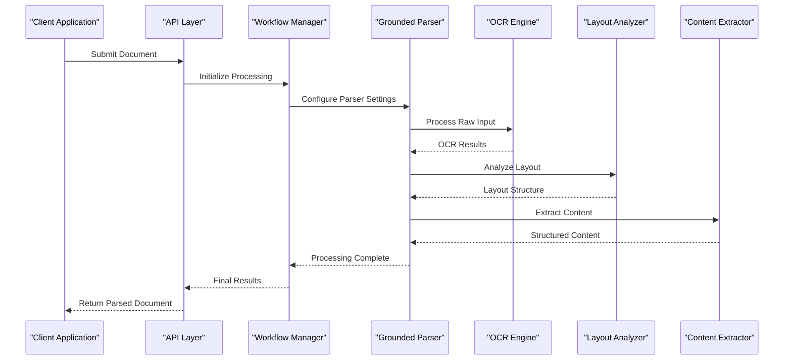
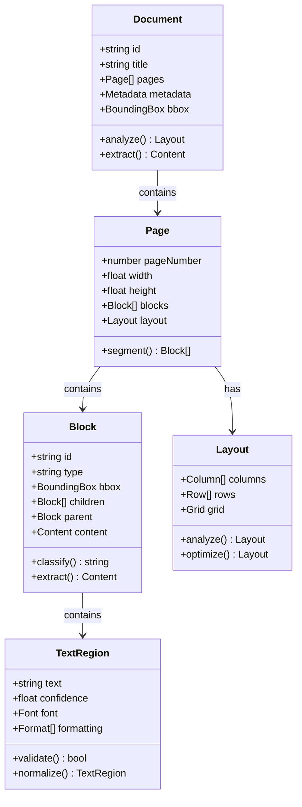

# Text Parsing and Layout Analysis

<cite>
**Referenced Files in This Document**
- [parsers.py](file://src/local_deepl/core/grounded/parsers.py)
- [models.py](file://src/local_deepl/core/grounded/models.py)
- [rasterize.py](file://src/local_deepl/core/grounded/rasterize.py)
- [prompted.py](file://src/local_deepl/core/grounded/prompted.py)
- [grounded.py](file://src/local_deepl/core/workflows/grounded.py)
- [block_tree.py](file://src/local_deepl/core/block_tree.py)
- [document.py](file://src/local_deepl/core/document.py)
- [preprocessing.py](file://src/local_deepl/core/preprocessing.py)
- [postprocess.py](file://src/local_deepl/core/postprocess.py)
- [ocr_processor.py](file://src/local_deepl/core/ocr/processor.py)
</cite>

## Table of Contents
1. [Introduction](#introduction)
2. [System Architecture](#system-architecture)
3. [Core Components](#core-components)
4. [Layout Detection Algorithms](#layout-detection-algorithms)
5. [Text Region Identification](#text-region-identification)
6. [Parsing Pipeline](#parsing-pipeline)
7. [Data Structures and Models](#data-structures-and-models)
8. [Advanced Features](#advanced-features)
9. [Configuration and Tuning](#configuration-and-tuning)
10. [Troubleshooting Guide](#troubleshooting-guide)
11. [Performance Optimization](#performance-optimization)
12. [Conclusion](#conclusion)

## Introduction

The grounded text parsing system is a sophisticated document analysis engine designed to extract structured content from various document types while preserving spatial relationships and hierarchical information. This system combines computer vision techniques, natural language processing, and machine learning to deliver accurate text extraction and layout understanding.

The system supports multiple document formats including PDFs, images, and digital documents, providing comprehensive analysis capabilities for complex layouts, mixed content types, and nested structures. It employs advanced algorithms for layout detection, text region identification, and content extraction while maintaining the original document's structural integrity.

## System Architecture

The grounded text parsing system follows a modular architecture with clear separation of concerns across different components:

**Diagram sources**
- [grounded.py:1-100](file://src/local_deepl/core/workflows/grounded.py#L1-L100)
- [parsers.py:1-150](file://src/local_deepl/core/grounded/parsers.py#L1-L150)

## Core Components

### Grounded Parser Engine

The core parser engine implements a multi-stage processing pipeline that handles document analysis from raw input to structured output. The system uses a combination of rule-based algorithms and machine learning models to achieve high accuracy in text extraction and layout understanding.

Key features include:
- Multi-format document support (PDF, images, digital documents)
- Advanced layout detection using computer vision techniques
- Hierarchical content structure preservation
- Spatial relationship maintenance
- Mixed content type handling

### Layout Detection Module

The layout detection module employs sophisticated algorithms to identify document regions, understand spatial relationships, and classify content types. It uses a combination of geometric analysis, pattern recognition, and contextual understanding to accurately map document structure.

### Text Region Identification

The text region identification system detects and extracts text blocks while preserving their spatial coordinates and formatting information. It handles complex scenarios including overlapping regions, nested structures, and mixed content types.

**Section sources**
- [parsers.py:1-200](file://src/local_deepl/core/grounded/parsers.py#L1-L200)
- [models.py:1-150](file://src/local_deepl/core/grounded/models.py#L1-L150)

## Layout Detection Algorithms

### Geometric Analysis Approach

The system uses geometric analysis to identify document boundaries, column structures, and content regions. This approach involves:

1. **Boundary Detection**: Identifying document edges and margins
2. **Column Recognition**: Detecting multi-column layouts
3. **Region Segmentation**: Dividing documents into logical sections
4. **Spatial Relationship Mapping**: Establishing connections between elements

### Pattern-Based Classification

Pattern recognition algorithms analyze visual characteristics to classify content types:
- Text blocks vs. images vs. tables
- Headers vs. body text vs. footers
- Lists vs. paragraphs vs. captions
- Form fields vs. static content

### Machine Learning Integration

The system incorporates machine learning models for enhanced accuracy in complex scenarios:
- Convolutional Neural Networks (CNNs) for image-based layout analysis
- Transformer models for semantic understanding
- Ensemble methods for robust classification

**Diagram sources**
- [grounded.py:50-200](file://src/local_deepl/core/workflows/grounded.py#L50-L200)
- [block_tree.py:1-100](file://src/local_deepl/core/block_tree.py#L1-L100)

## Text Region Identification

### Bounding Box Detection

The system uses advanced bounding box detection algorithms to precisely locate text regions within documents. Key techniques include:

- **Connected Component Analysis**: Grouping adjacent pixels into coherent regions
- **Projection Profile Analysis**: Analyzing horizontal and vertical projections
- **Hough Transform**: Detecting lines and geometric shapes
- **Contour Detection**: Identifying object boundaries

### Spatial Relationship Preservation

Maintaining spatial relationships is crucial for accurate document reconstruction. The system tracks:
- Relative positioning of text blocks
- Hierarchical nesting relationships
- Reading order determination
- Column and row associations

### Content Type Classification

Each detected region is classified based on its content type and characteristics:
- **Text Blocks**: Standard paragraph content
- **Headers**: Title and section headers
- **Lists**: Ordered and unordered list items
- **Tables**: Tabular data structures
- **Images**: Visual content with captions
- **Forms**: Interactive form elements

**Section sources**
- [rasterize.py:1-150](file://src/local_deepl/core/grounded/rasterize.py#L1-L150)
- [preprocessing.py:1-200](file://src/local_deepl/core/preprocessing.py#L1-L200)

## Parsing Pipeline

### Multi-Stage Processing Flow

The parsing pipeline consists of several interconnected stages that transform raw document input into structured, analyzable content:

**Diagram sources**
- [grounded.py:1-300](file://src/local_deepl/core/workflows/grounded.py#L1-L300)
- [workflow.py:1-200](file://src/local_deepl/api/services/workflow.py#L1-L200)

### Stage 1: Document Preprocessing

The preprocessing stage prepares documents for analysis by:
- Converting to standard formats
- Enhancing image quality
- Removing noise and artifacts
- Normalizing resolution and color spaces

### Stage 2: Layout Analysis

Layout analysis identifies the document structure through:
- Page segmentation
- Column detection
- Region classification
- Spatial relationship mapping

### Stage 3: Content Extraction

Content extraction processes identified regions to:
- Recognize text content
- Identify formatting attributes
- Extract metadata
- Preserve hierarchical relationships

### Stage 4: Post-processing

Post-processing refines results by:
- Validating extracted content
- Resolving conflicts
- Optimizing structure
- Generating final output

**Section sources**
- [grounded.py:100-400](file://src/local_deepl/core/workflows/grounded.py#L100-L400)
- [postprocess.py:1-150](file://src/local_deepl/core/postprocess.py#L1-L150)

## Data Structures and Models

### Core Data Models

The system defines comprehensive data models to represent document structure and content:

#### Document Model
Represents the complete document with its hierarchical structure, metadata, and spatial information.

#### Block Model
Defines individual content blocks with properties like position, size, content type, and relationships.

#### Text Region Model
Captures text-specific information including recognized text, confidence scores, and formatting attributes.

#### Layout Model
Describes the overall document layout including page dimensions, column structure, and regional organization.

### Spatial Coordinate System

The system uses a normalized coordinate system where:
- Origin (0,0) represents the top-left corner
- Values range from 0.0 to 1.0 for relative positioning
- Absolute coordinates are preserved for precise reconstruction

### Relationship Graphs

Hierarchical relationships are represented using graph structures that capture:
- Parent-child relationships between blocks
- Sibling relationships within containers
- Cross-references between related content
- Temporal ordering for reading flow

**Diagram sources**
- [models.py:1-200](file://src/local_deepl/core/grounded/models.py#L1-L200)
- [block_tree.py:1-150](file://src/local_deepl/core/block_tree.py#L1-L150)

**Section sources**
- [models.py:1-250](file://src/local_deepl/core/grounded/models.py#L1-L250)
- [block_tree.py:1-200](file://src/local_deepl/core/block_tree.py#L1-L200)

## Advanced Features

### Complex Layout Handling

The system excels at handling complex document layouts including:
- **Multi-column Documents**: Accurately detecting and processing newspaper-style layouts
- **Nested Tables**: Extracting tabular data with proper hierarchy
- **Overlapping Elements**: Resolving conflicts when content regions overlap
- **Mixed Content Types**: Processing documents with combined text, images, and graphics

### Hierarchical Content Extraction

Advanced hierarchical extraction preserves the logical structure of documents:
- **Section Hierarchy**: Maintaining heading levels and subsection relationships
- **List Structures**: Preserving ordered and unordered list hierarchies
- **Table Nesting**: Handling tables within tables and complex cell structures
- **Cross-references**: Identifying and linking related content across the document

### Mixed Content Type Support

The system seamlessly processes documents containing:
- **Text and Images**: Properly associating captions with images
- **Tables and Charts**: Extracting both tabular and graphical data
- **Forms and Fields**: Identifying interactive form elements
- **Annotations and Comments**: Preserving marginal notes and annotations

### Edge Case Resolution

Sophisticated algorithms handle challenging scenarios:
- **Low Quality Scans**: Enhanced processing for poor-quality inputs
- **Handwritten Text**: Specialized OCR for handwritten content
- **Non-standard Fonts**: Robust text recognition across diverse typography
- **Corrupted Documents**: Graceful degradation and error recovery

**Section sources**
- [prompted.py:1-200](file://src/local_deepl/core/grounded/prompted.py#L1-L200)
- [document.py:1-300](file://src/local_deepl/core/document.py#L1-L300)

## Configuration and Tuning

### Parser Parameters

The system provides extensive configuration options for optimizing performance across different document types:

#### Layout Detection Parameters
- **Sensitivity Threshold**: Controls detection sensitivity for small text elements
- **Minimum Region Size**: Filters out noise and insignificant elements
- **Overlap Tolerance**: Determines how aggressively overlapping regions are resolved
- **Column Detection Threshold**: Adjusts column boundary detection accuracy

#### Text Recognition Settings
- **Confidence Threshold**: Minimum confidence score for accepted text
- **Character Correction**: Enables post-recognition text correction
- **Language Model**: Selects appropriate NLP model for text enhancement
- **Dictionary Integration**: Uses custom dictionaries for domain-specific terms

#### Performance Optimization
- **Parallel Processing**: Controls concurrent processing threads
- **Memory Management**: Configures memory usage limits and caching strategies
- **Resolution Scaling**: Balances accuracy vs. processing speed
- **Model Selection**: Chooses between lightweight and high-accuracy models

### Document-Specific Tuning

Different document types benefit from specific parameter configurations:

#### Academic Papers
- High sensitivity for small footnote text
- Strict column detection for two-column layouts
- Enhanced table recognition for mathematical notation

#### Business Documents
- Moderate sensitivity for clean corporate layouts
- Strong form field detection
- Enhanced logo and header recognition

#### Handwritten Documents
- Specialized handwriting recognition models
- Lower confidence thresholds to accommodate variability
- Enhanced noise reduction for pen strokes

#### Legal Documents
- High precision requirements for legal terminology
- Strict formatting preservation
- Enhanced cross-reference detection

**Section sources**
- [ocr_processor.py:1-200](file://src/local_deepl/core/ocr/processor.py#L1-L200)
- [preprocessing.py:150-300](file://src/local_deepl/core/preprocessing.py#L150-L300)

## Troubleshooting Guide

### Common Issues and Solutions

#### Poor Text Recognition Accuracy
**Symptoms**: Low confidence scores, garbled text output
**Solutions**:
- Increase image resolution before processing
- Adjust confidence threshold parameters
- Enable character correction features
- Use appropriate language models

#### Layout Detection Failures
**Symptoms**: Incorrect column detection, missing regions
**Solutions**:
- Tune sensitivity thresholds
- Adjust minimum region size settings
- Enable manual region override capabilities
- Check for document corruption

#### Performance Issues
**Symptoms**: Slow processing times, high memory usage
**Solutions**:
- Enable parallel processing
- Reduce image resolution
- Optimize memory management settings
- Use lightweight models for batch processing

#### Memory Leaks
**Symptoms**: Increasing memory usage over time
**Solutions**:
- Implement proper resource cleanup
- Monitor large object retention
- Use streaming processing for large documents
- Configure garbage collection parameters

### Debugging Tools

The system includes comprehensive debugging utilities:
- **Visualization Tools**: Display detected regions and confidence scores
- **Logging Framework**: Detailed processing logs with configurable verbosity
- **Performance Profiling**: Identify bottlenecks and optimization opportunities
- **Error Tracking**: Comprehensive error reporting and recovery mechanisms

### Error Recovery Strategies

Robust error handling ensures system reliability:
- **Graceful Degradation**: Continue processing when individual components fail
- **Fallback Mechanisms**: Alternative algorithms for problematic cases
- **Partial Processing**: Extract available content even if full processing fails
- **Recovery Protocols**: Automatic retry and recovery procedures

**Section sources**
- [postprocess.py:100-200](file://src/local_deepl/core/postprocess.py#L100-L200)
- [evaluation.py:1-150](file://src/local_deepl/core/evaluation.py#L1-L150)

## Performance Optimization

### Algorithmic Efficiency

The system employs several optimization strategies:
- **Lazy Loading**: Load only necessary components on demand
- **Caching Mechanisms**: Cache frequently accessed data and results
- **Parallel Processing**: Utilize multi-core processors effectively
- **Memory Pooling**: Reuse objects to reduce garbage collection overhead

### Resource Management

Efficient resource utilization includes:
- **Dynamic Memory Allocation**: Scale memory usage based on document complexity
- **Streaming Processing**: Process large documents without loading entirely into memory
- **Background Processing**: Offload intensive tasks to background threads
- **Resource Cleanup**: Automatic cleanup of temporary files and cached data

### Scalability Considerations

The system is designed for scalability:
- **Horizontal Scaling**: Support distributed processing across multiple nodes
- **Load Balancing**: Distribute processing workload efficiently
- **Queue Management**: Handle high-volume processing requests
- **Monitoring and Metrics**: Track performance and resource utilization

### Benchmarking and Testing

Comprehensive testing ensures consistent performance:
- **Unit Tests**: Validate individual component functionality
- **Integration Tests**: Test complete processing pipelines
- **Performance Benchmarks**: Measure processing speed and accuracy
- **Stress Testing**: Validate behavior under high load conditions

## Conclusion

The grounded text parsing system represents a comprehensive solution for document analysis and content extraction. Its sophisticated architecture combines advanced computer vision techniques, machine learning models, and intelligent algorithms to deliver accurate and reliable text extraction across diverse document types.

Key strengths include:
- **High Accuracy**: Sophisticated algorithms ensure precise text recognition and layout detection
- **Flexibility**: Extensive configuration options allow optimization for specific use cases
- **Scalability**: Designed to handle large volumes of documents efficiently
- **Robustness**: Comprehensive error handling and recovery mechanisms
- **Extensibility**: Modular architecture supports easy customization and enhancement

The system's ability to handle complex layouts, preserve spatial relationships, and maintain hierarchical structure makes it suitable for a wide range of applications including document digitization, content extraction, and automated workflow processing.

Future enhancements will focus on improved machine learning models, expanded format support, and enhanced user interface capabilities to further improve usability and performance.