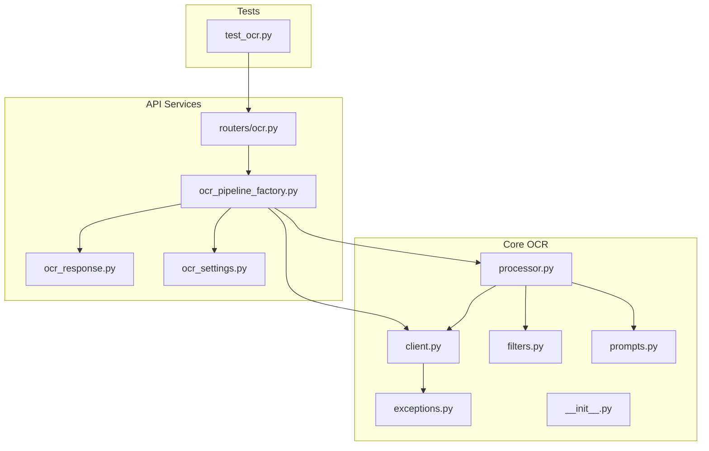
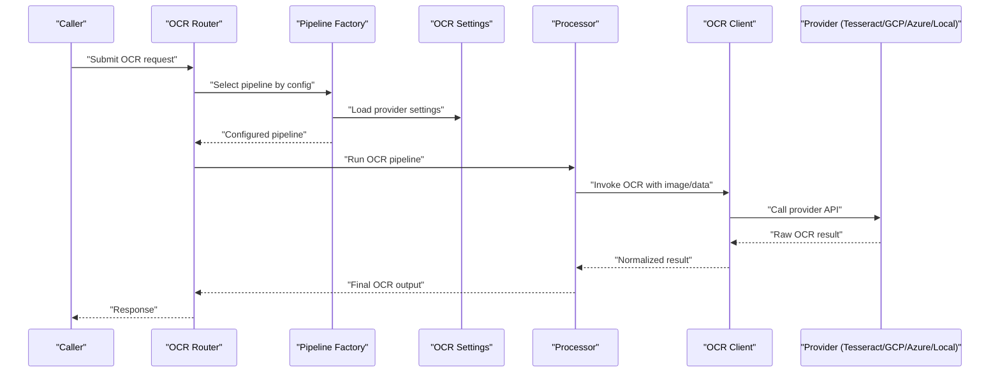
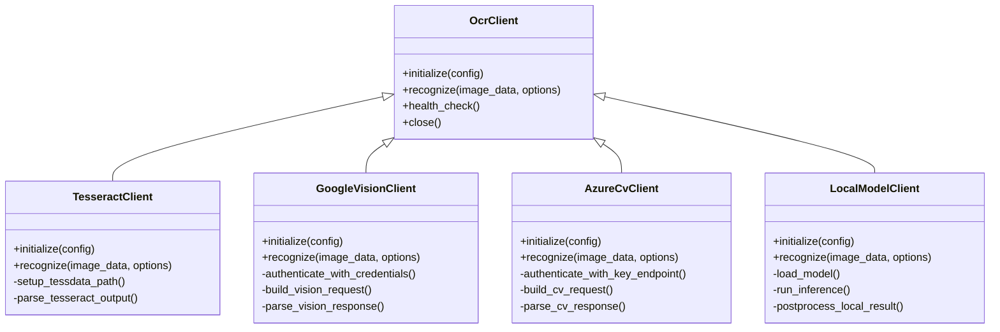
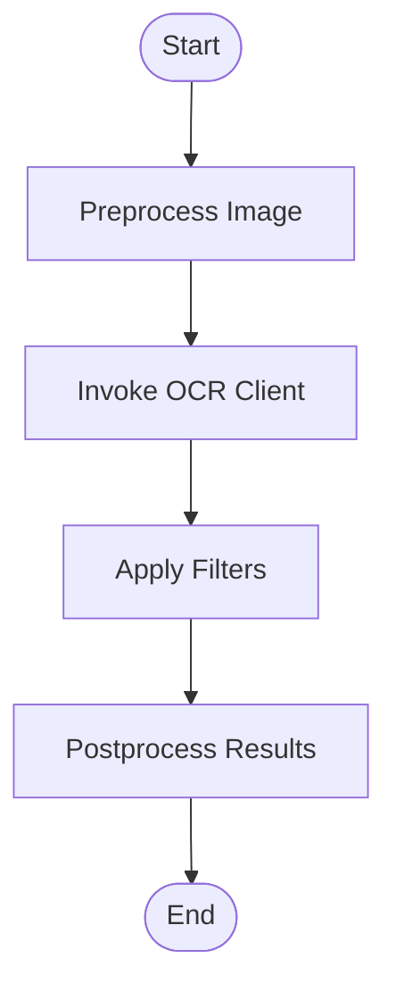
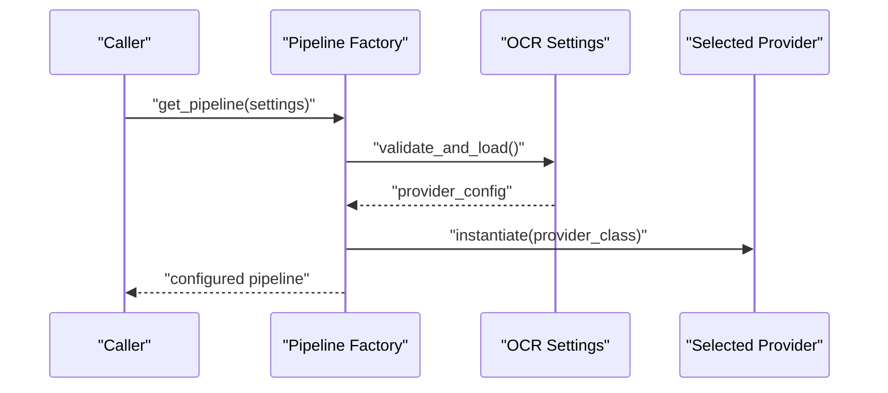
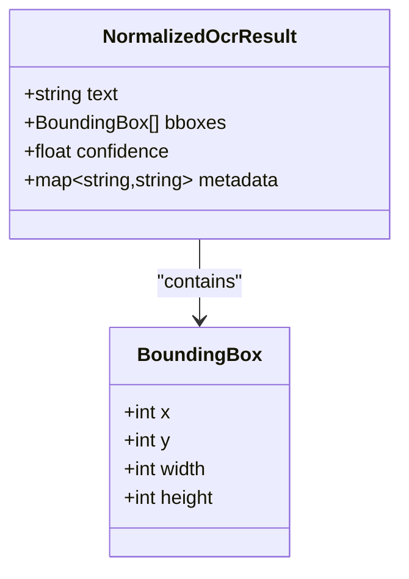
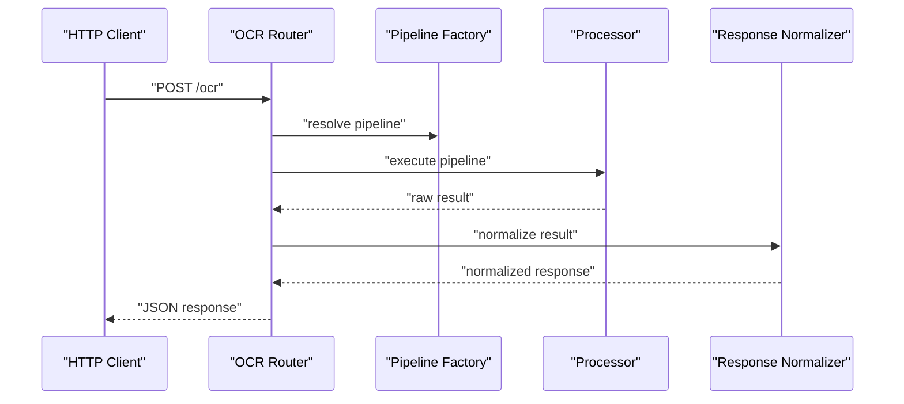
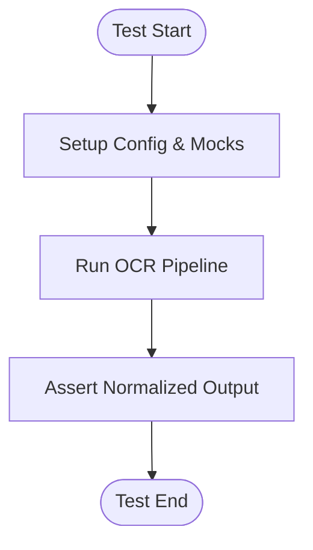
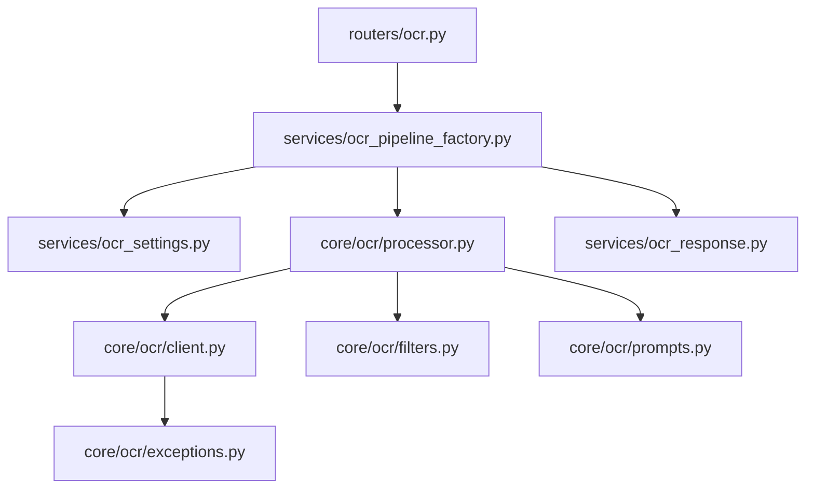

# OCR Client Management

<cite>
**Referenced Files in This Document**
- [client.py](file://src/local_deepl/core/ocr/client.py)
- [exceptions.py](file://src/local_deepl/core/ocr/exceptions.py)
- [processor.py](file://src/local_deepl/core/ocr/processor.py)
- [filters.py](file://src/local_deepl/core/ocr/filters.py)
- [prompts.py](file://src/local_deepl/core/ocr/prompts.py)
- [__init__.py](file://src/local_deepl/core/ocr/__init__.py)
- [ocr_pipeline_factory.py](file://src/local_deepl/api/services/ocr_pipeline_factory.py)
- [ocr_response.py](file://src/local_deepl/api/services/ocr_response.py)
- [ocr_settings.py](file://src/local_deepl/api/services/ocr_settings.py)
- [ocr.py](file://src/local_deepl/api/routers/ocr.py)
- [test_ocr.py](file://tests/test_ocr.py)
</cite>

## Table of Contents
1. [Introduction](#introduction)
2. [Project Structure](#project-structure)
3. [Core Components](#core-components)
4. [Architecture Overview](#architecture-overview)
5. [Detailed Component Analysis](#detailed-component-analysis)
6. [Dependency Analysis](#dependency-analysis)
7. [Performance Considerations](#performance-considerations)
8. [Troubleshooting Guide](#troubleshooting-guide)
9. [Conclusion](#conclusion)
10. [Appendices](#appendices)

## Introduction
This document explains the OCR client management system that provides a unified interface for multiple OCR backends, including Tesseract, Google Vision, Azure Computer Vision, and local models. It covers the client abstraction layer, initialization process, configuration options, authentication methods, connection pooling, error handling strategies, retry mechanisms, fallback configurations, performance considerations, rate limiting, and monitoring capabilities. The goal is to help developers integrate and operate OCR services reliably across diverse providers while maintaining consistent behavior and observability.

## Project Structure
The OCR subsystem is organized into a core module and API integration points:
- Core OCR module: defines the client abstraction, exceptions, processing pipeline, filters, and prompts.
- API services: provide factory-based selection of OCR pipelines, response normalization, settings management, and HTTP routing.
- Tests: validate OCR behaviors and provider integrations.

**Diagram sources**
- [client.py](file://src/local_deepl/core/ocr/client.py)
- [exceptions.py](file://src/local_deepl/core/ocr/exceptions.py)
- [processor.py](file://src/local_deepl/core/ocr/processor.py)
- [filters.py](file://src/local_deepl/core/ocr/filters.py)
- [prompts.py](file://src/local_deepl/core/ocr/prompts.py)
- [__init__.py](file://src/local_deepl/core/ocr/__init__.py)
- [ocr_pipeline_factory.py](file://src/local_deepl/api/services/ocr_pipeline_factory.py)
- [ocr_response.py](file://src/local_deepl/api/services/ocr_response.py)
- [ocr_settings.py](file://src/local_deepl/api/services/ocr_settings.py)
- [ocr.py](file://src/local_deepl/api/routers/ocr.py)
- [test_ocr.py](file://tests/test_ocr.py)

**Section sources**
- [client.py](file://src/local_deepl/core/ocr/client.py)
- [ocr_pipeline_factory.py](file://src/local_deepl/api/services/ocr_pipeline_factory.py)
- [ocr_settings.py](file://src/local_deepl/api/services/ocr_settings.py)
- [ocr.py](file://src/local_deepl/api/routers/ocr.py)
- [test_ocr.py](file://tests/test_ocr.py)

## Core Components
- Client Abstraction Layer: Defines a common interface for OCR providers, enabling pluggable implementations (Tesseract, Google Vision, Azure Computer Vision, local models).
- Processor Pipeline: Orchestrates preprocessing, OCR invocation, filtering, and postprocessing steps.
- Exceptions: Centralized error types for provider failures, timeouts, and invalid configurations.
- Filters: Post-processing utilities to refine OCR results (e.g., noise removal, confidence thresholds).
- Prompts: Optional prompt templates used by LLM-assisted OCR or hybrid workflows.
- Factory and Settings: Provider selection based on runtime configuration; normalized responses for consumers.

Key responsibilities:
- Unified method signatures across providers.
- Consistent error propagation and diagnostics.
- Configurable retries, timeouts, and fallbacks.
- Connection pooling where applicable (HTTP clients).
- Observability hooks for metrics and logging.

**Section sources**
- [client.py](file://src/local_deepl/core/ocr/client.py)
- [processor.py](file://src/local_deepl/core/ocr/processor.py)
- [exceptions.py](file://src/local_deepl/core/ocr/exceptions.py)
- [filters.py](file://src/local_deepl/core/ocr/filters.py)
- [prompts.py](file://src/local_deepl/core/ocr/prompts.py)
- [ocr_pipeline_factory.py](file://src/local_deepl/api/services/ocr_pipeline_factory.py)
- [ocr_response.py](file://src/local_deepl/api/services/ocr_response.py)
- [ocr_settings.py](file://src/local_deepl/api/services/ocr_settings.py)

## Architecture Overview
The OCR client management architecture centers around a provider-agnostic client interface with a processor pipeline that coordinates calls to specific backend implementations. A factory selects the appropriate provider based on configuration, and responses are normalized before being returned to API consumers.

**Diagram sources**
- [ocr.py](file://src/local_deepl/api/routers/ocr.py)
- [ocr_pipeline_factory.py](file://src/local_deepl/api/services/ocr_pipeline_factory.py)
- [ocr_settings.py](file://src/local_deepl/api/services/ocr_settings.py)
- [processor.py](file://src/local_deepl/core/ocr/processor.py)
- [client.py](file://src/local_deepl/core/ocr/client.py)

## Detailed Component Analysis

### Client Abstraction Layer
The client abstraction defines a uniform interface for OCR operations. Implementations encapsulate provider-specific details such as authentication, request formatting, and response parsing.

- Initialization: Each provider sets up credentials, endpoints, and optional model assets.
- Recognition: Accepts image data and options; returns structured text and bounding boxes.
- Health Check: Validates connectivity and readiness.
- Lifecycle: Supports graceful shutdown and resource cleanup.

**Diagram sources**
- [client.py](file://src/local_deepl/core/ocr/client.py)

**Section sources**
- [client.py](file://src/local_deepl/core/ocr/client.py)

### Processor Pipeline
The processor orchestrates preprocessing, OCR invocation, filtering, and postprocessing. It integrates with the client abstraction and applies configurable filters and prompts.

- Preprocessing: Resizing, denoising, contrast enhancement.
- Invocation: Calls the selected provider via the client abstraction.
- Filtering: Removes low-confidence segments, merges adjacent lines, normalizes text.
- Postprocessing: Formats outputs, attaches metadata, and prepares for downstream consumers.

**Diagram sources**
- [processor.py](file://src/local_deepl/core/ocr/processor.py)
- [filters.py](file://src/local_deepl/core/ocr/filters.py)
- [prompts.py](file://src/local_deepl/core/ocr/prompts.py)

**Section sources**
- [processor.py](file://src/local_deepl/core/ocr/processor.py)
- [filters.py](file://src/local_deepl/core/ocr/filters.py)
- [prompts.py](file://src/local_deepl/core/ocr/prompts.py)

### Factory and Settings
The factory selects an OCR pipeline based on runtime configuration loaded from settings. It ensures that only valid provider combinations are instantiated and that defaults are applied when necessary.

- Configuration Options: Provider name, credentials, endpoints, timeouts, retries, and fallbacks.
- Validation: Ensures required fields exist and are well-formed.
- Instantiation: Creates provider-specific client instances with configured parameters.

**Diagram sources**
- [ocr_pipeline_factory.py](file://src/local_deepl/api/services/ocr_pipeline_factory.py)
- [ocr_settings.py](file://src/local_deepl/api/services/ocr_settings.py)

**Section sources**
- [ocr_pipeline_factory.py](file://src/local_deepl/api/services/ocr_pipeline_factory.py)
- [ocr_settings.py](file://src/local_deepl/api/services/ocr_settings.py)

### Response Normalization
Responses from different providers are normalized into a consistent schema for consumers. This includes text content, bounding boxes, confidence scores, and metadata.

- Text: Aggregated or segmented text depending on provider capabilities.
- Bounding Boxes: Coordinates aligned to input image dimensions.
- Confidence: Overall or per-segment confidence scores.
- Metadata: Provider-specific attributes (e.g., language hints, model version).

**Diagram sources**
- [ocr_response.py](file://src/local_deepl/api/services/ocr_response.py)

**Section sources**
- [ocr_response.py](file://src/local_deepl/api/services/ocr_response.py)

### API Integration
The OCR router exposes endpoints that accept requests, delegate to the pipeline factory, and return normalized responses. It also handles progress updates and job tracking where applicable.

**Diagram sources**
- [ocr.py](file://src/local_deepl/api/routers/ocr.py)
- [ocr_pipeline_factory.py](file://src/local_deepl/api/services/ocr_pipeline_factory.py)
- [ocr_response.py](file://src/local_deepl/api/services/ocr_response.py)

**Section sources**
- [ocr.py](file://src/local_deepl/api/routers/ocr.py)

### Testing and Validation
Tests verify OCR behavior across providers, ensuring correct initialization, recognition outcomes, error propagation, and fallback logic.

**Diagram sources**
- [test_ocr.py](file://tests/test_ocr.py)

**Section sources**
- [test_ocr.py](file://tests/test_ocr.py)

## Dependency Analysis
The OCR subsystem has clear separation between core abstractions and API integration. Dependencies flow from routers to factories, processors, and clients, with minimal coupling between providers.

**Diagram sources**
- [ocr.py](file://src/local_deepl/api/routers/ocr.py)
- [ocr_pipeline_factory.py](file://src/local_deepl/api/services/ocr_pipeline_factory.py)
- [ocr_settings.py](file://src/local_deepl/api/services/ocr_settings.py)
- [processor.py](file://src/local_deepl/core/ocr/processor.py)
- [client.py](file://src/local_deepl/core/ocr/client.py)
- [filters.py](file://src/local_deepl/core/ocr/filters.py)
- [prompts.py](file://src/local_deepl/core/ocr/prompts.py)
- [exceptions.py](file://src/local_deepl/core/ocr/exceptions.py)
- [ocr_response.py](file://src/local_deepl/api/services/ocr_response.py)

**Section sources**
- [ocr.py](file://src/local_deepl/api/routers/ocr.py)
- [ocr_pipeline_factory.py](file://src/local_deepl/api/services/ocr_pipeline_factory.py)
- [ocr_settings.py](file://src/local_deepl/api/services/ocr_settings.py)
- [processor.py](file://src/local_deepl/core/ocr/processor.py)
- [client.py](file://src/local_deepl/core/ocr/client.py)
- [filters.py](file://src/local_deepl/core/ocr/filters.py)
- [prompts.py](file://src/local_deepl/core/ocr/prompts.py)
- [exceptions.py](file://src/local_deepl/core/ocr/exceptions.py)
- [ocr_response.py](file://src/local_deepl/api/services/ocr_response.py)

## Performance Considerations
- Connection Pooling: Use pooled HTTP clients for cloud providers to reduce handshake overhead and improve throughput.
- Batch Processing: Group images when supported by providers to leverage batch APIs and reduce latency.
- Concurrency Limits: Configure max concurrent requests per provider to avoid throttling and resource exhaustion.
- Timeout Tuning: Set appropriate read and connect timeouts based on provider SLAs and network conditions.
- Caching: Cache repeated OCR results for identical inputs to minimize redundant work.
- Model Loading: For local models, preload models at startup and reuse instances to avoid reload costs.
- Memory Management: Stream large images and release buffers promptly to prevent memory pressure.
- Rate Limiting: Respect provider quotas and implement exponential backoff with jitter.
- Monitoring: Emit metrics for latency, success rates, and errors; log provider-specific diagnostics.

[No sources needed since this section provides general guidance]

## Troubleshooting Guide
Common issues and resolutions:
- Authentication Failures: Verify credentials, scopes, and endpoint URLs; ensure secrets are correctly loaded.
- Timeouts: Increase timeouts or reduce payload size; check network connectivity and provider status.
- Invalid Configuration: Validate required fields and types; use factory validation to catch misconfigurations early.
- Provider Errors: Inspect normalized error messages and codes; map provider-specific errors to internal exceptions.
- Fallback Behavior: Ensure fallback chains are configured and tested; monitor which provider handled the request.
- Resource Leaks: Confirm client close and cleanup paths are invoked; monitor open connections and file descriptors.

Operational checks:
- Health endpoints: Use health checks to verify provider readiness.
- Metrics: Track request counts, latencies, and failure rates per provider.
- Logs: Include correlation IDs and provider names for traceability.

**Section sources**
- [exceptions.py](file://src/local_deepl/core/ocr/exceptions.py)
- [ocr_pipeline_factory.py](file://src/local_deepl/api/services/ocr_pipeline_factory.py)
- [ocr_settings.py](file://src/local_deepl/api/services/ocr_settings.py)

## Conclusion
The OCR client management system provides a robust, extensible foundation for integrating multiple OCR backends through a unified interface. By centralizing configuration, error handling, and response normalization, it simplifies provider switching and enhances reliability. With attention to performance tuning, rate limiting, and monitoring, teams can deploy scalable OCR pipelines that meet diverse operational requirements.

[No sources needed since this section summarizes without analyzing specific files]

## Appendices

### Configuration Examples
- Tesseract: Specify tessdata path, language packs, and engine options.
- Google Vision: Provide service account credentials and enable Vision API.
- Azure Computer Vision: Supply subscription key and endpoint URL.
- Local Models: Define model path, device preferences, and inference options.

[No sources needed since this section provides general guidance]

### Error Handling Strategies
- Retry with Backoff: Implement exponential backoff for transient errors.
- Circuit Breaker: Temporarily disable failing providers to protect system stability.
- Fallback Chains: Configure secondary providers when primary fails.
- Graceful Degradation: Return partial results with warnings when possible.

**Section sources**
- [exceptions.py](file://src/local_deepl/core/ocr/exceptions.py)
- [ocr_pipeline_factory.py](file://src/local_deepl/api/services/ocr_pipeline_factory.py)