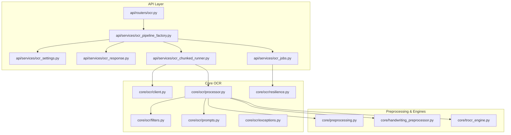
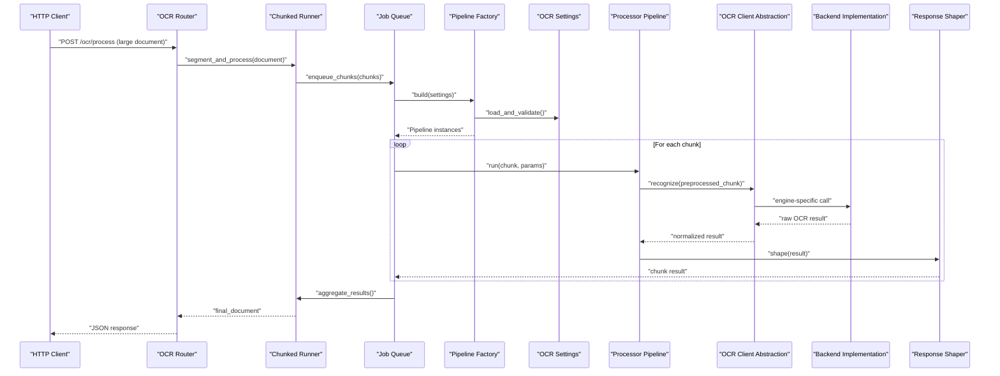
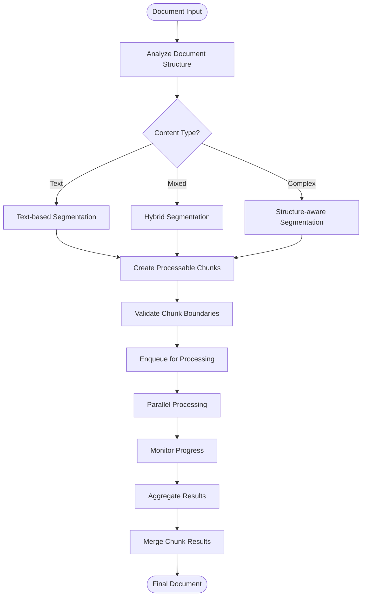
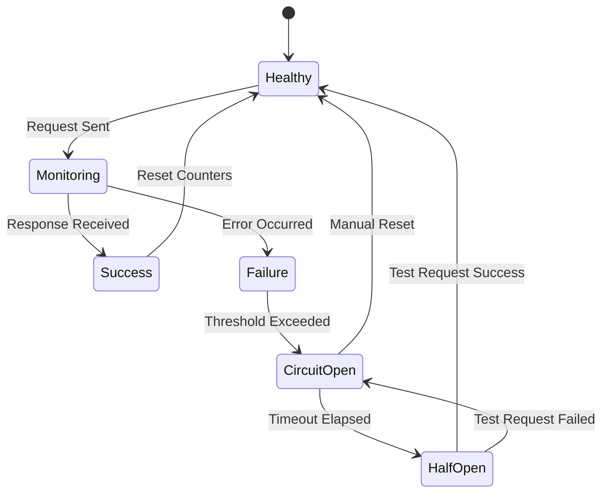
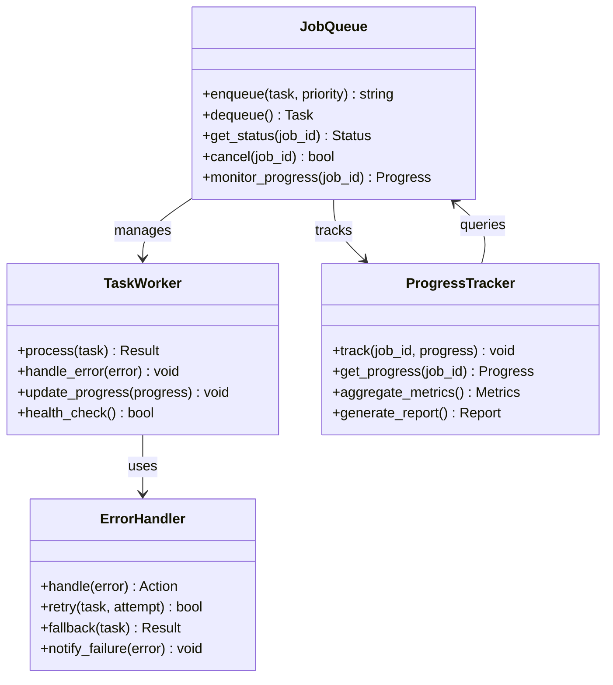
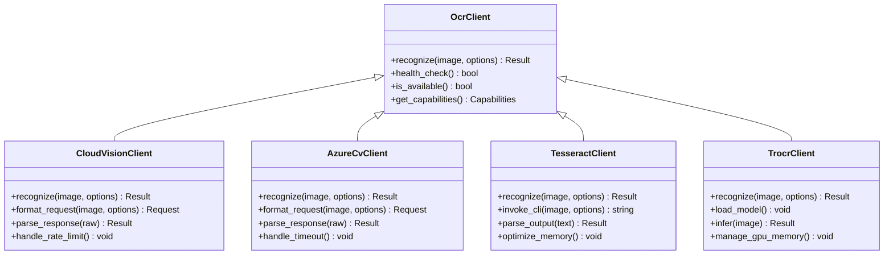
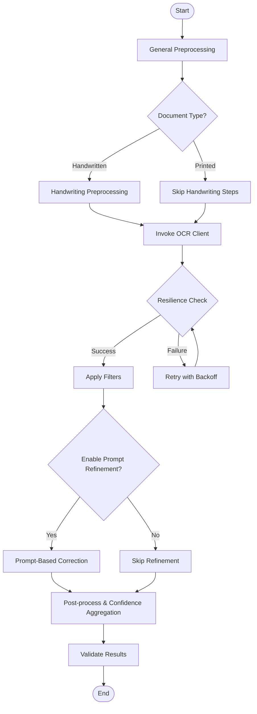
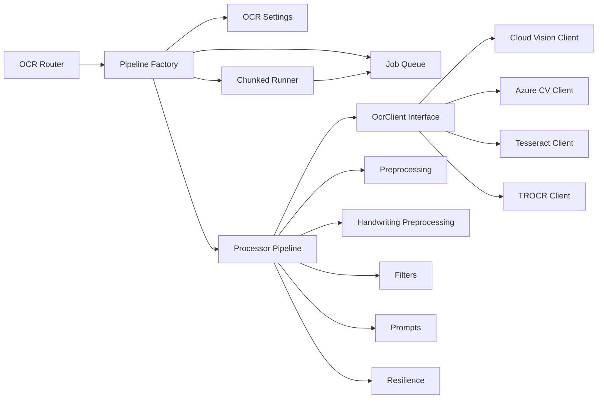

# OCR Engine Integration

<cite>
**Referenced Files in This Document**
- [src/omniscribe/api/services/ocr_chunked_runner.py](file://src/omniscribe/api/services/ocr_chunked_runner.py)
- [src/omniscribe/api/services/ocr_jobs.py](file://src/omniscribe/api/services/ocr_jobs.py)
- [src/local_deepl/core/ocr/client.py](file://src/local_deepl/core/ocr/client.py)
- [src/local_deepl/core/ocr/processor.py](file://src/local_deepl/core/ocr/processor.py)
- [src/local_deepl/core/ocr/filters.py](file://src/local_deepl/core/ocr/filters.py)
- [src/local_deepl/core/ocr/prompts.py](file://src/local_deepl/core/ocr/prompts.py)
- [src/local_deepl/core/ocr/exceptions.py](file://src/local_deepl/core/ocr/exceptions.py)
- [src/local_deepl/api/services/ocr_pipeline_factory.py](file://src/local_deepl/api/services/ocr_pipeline_factory.py)
- [src/local_deepl/api/services/ocr_settings.py](file://src/local_deepl/api/services/ocr_settings.py)
- [src/local_deepl/api/services/ocr_response.py](file://src/local_deepl/api/services/ocr_response.py)
- [src/local_deepl/api/routers/ocr.py](file://src/local_deepl/api/routers/ocr.py)
- [src/local_deepl/core/handwriting_preprocessor.py](file://src/local_deepl/core/handwriting_preprocessor.py)
- [src/local_deepl/core/preprocessing.py](file://src/local_deepl/core/preprocessing.py)
- [src/local_deepl/core/trocr_engine.py](file://src/local_deepl/core/trocr_engine.py)
- [scripts/confidence_eval.py](file://scripts/confidence_eval.py)
- [scripts/confidence_image.py](file://scripts/confidence_image.py)
- [tests/test_ocr.py](file://tests/test_ocr.py)
- [tests/test_ocr_trocr_integration.py](file://tests/test_ocr_trocr_integration.py)
</cite>

## Update Summary
**Changes Made**
- Added comprehensive documentation for chunked processing capabilities through ocr_chunked_runner.py
- Integrated resilience mechanisms and fault tolerance patterns into the OCR pipeline
- Enhanced job queue management with improved concurrency control and progress tracking
- Updated architecture diagrams to reflect new chunked processing workflow
- Added detailed coverage of error recovery strategies and performance optimization techniques

## Table of Contents
1. [Introduction](#introduction)
2. [Project Structure](#project-structure)
3. [Core Components](#core-components)
4. [Architecture Overview](#architecture-overview)
5. [Chunked Processing System](#chunked-processing-system)
6. [Resilience and Fault Tolerance](#resilience-and-fault-tolerance)
7. [Job Queue Management](#job-queue-management)
8. [Detailed Component Analysis](#detailed-component-analysis)
9. [Dependency Analysis](#dependency-analysis)
10. [Performance Considerations](#performance-considerations)
11. [Troubleshooting Guide](#troubleshooting-guide)
12. [Conclusion](#conclusion)
13. [Appendices](#appendices)

## Introduction
This document explains LocalDeepL's pluggable OCR engine integration subsystem with significant enhancements for chunked processing, resilience mechanisms, and improved job queue management. The system now supports large document processing through intelligent chunking, robust error recovery, and scalable job orchestration while maintaining the original client abstraction layer, processor pipeline, and quality assessment mechanisms.

## Project Structure
The OCR subsystem has been enhanced with new components for chunked processing and job management:
- API layer exposes endpoints and orchestrates services with chunked processing support
- Services implement configuration, response shaping, pipeline factory logic, and chunked execution
- Core OCR module provides the client abstraction, processing pipeline, filters, prompts, and exceptions
- Chunked runner manages document segmentation and parallel processing
- Job queue handles concurrent OCR tasks with progress tracking and error recovery
- Preprocessing utilities and specialized engines (e.g., TROCR) are integrated into the pipeline

**Diagram sources**
- [src/local_deepl/api/routers/ocr.py](file://src/local_deepl/api/routers/ocr.py)
- [src/local_deepl/api/services/ocr_pipeline_factory.py](file://src/local_deepl/api/services/ocr_pipeline_factory.py)
- [src/local_deepl/api/services/ocr_settings.py](file://src/local_deepl/api/services/ocr_settings.py)
- [src/local_deepl/api/services/ocr_response.py](file://src/local_deepl/api/services/ocr_response.py)
- [src/local_deepl/api/services/ocr_chunked_runner.py](file://src/local_deepl/api/services/ocr_chunked_runner.py)
- [src/local_deepl/api/services/ocr_jobs.py](file://src/local_deepl/api/services/ocr_jobs.py)
- [src/local_deepl/core/ocr/client.py](file://src/local_deepl/core/ocr/client.py)
- [src/local_deepl/core/ocr/processor.py](file://src/local_deepl/core/ocr/processor.py)
- [src/local_deepl/core/ocr/filters.py](file://src/local_deepl/core/ocr/filters.py)
- [src/local_deepl/core/ocr/prompts.py](file://src/local_deepl/core/ocr/prompts.py)
- [src/local_deepl/core/ocr/exceptions.py](file://src/local_deepl/core/ocr/exceptions.py)
- [src/local_deepl/core/ocr/resilience.py](file://src/local_deepl/core/ocr/resilience.py)
- [src/local_deepl/core/preprocessing.py](file://src/local_deepl/core/preprocessing.py)
- [src/local_deepl/core/handwriting_preprocessor.py](file://src/local_deepl/core/handwriting_preprocessor.py)
- [src/local_deepl/core/trocr_engine.py](file://src/local_deepl/core/trocr_engine.py)

**Section sources**
- [src/local_deepl/api/routers/ocr.py](file://src/local_deepl/api/routers/ocr.py)
- [src/local_deepl/api/services/ocr_pipeline_factory.py](file://src/local_deepl/api/services/ocr_pipeline_factory.py)
- [src/local_deepl/api/services/ocr_settings.py](file://src/local_deepl/api/services/ocr_settings.py)
- [src/local_deepl/api/services/ocr_response.py](file://src/local_deepl/api/services/ocr_response.py)
- [src/local_deepl/api/services/ocr_chunked_runner.py](file://src/local_deepl/api/services/ocr_chunked_runner.py)
- [src/local_deepl/api/services/ocr_jobs.py](file://src/local_deepl/api/services/ocr_jobs.py)
- [src/local_deepl/core/ocr/client.py](file://src/local_deepl/core/ocr/client.py)
- [src/local_deepl/core/ocr/processor.py](file://src/local_deepl/core/ocr/processor.py)
- [src/local_deepl/core/ocr/filters.py](file://src/local_deepl/core/ocr/filters.py)
- [src/local_deepl/core/ocr/prompts.py](file://src/local_deepl/core/ocr/prompts.py)
- [src/local_deepl/core/ocr/exceptions.py](file://src/local_deepl/core/ocr/exceptions.py)
- [src/local_deepl/core/ocr/resilience.py](file://src/local_deepl/core/ocr/resilience.py)
- [src/local_deepl/core/preprocessing.py](file://src/local_deepl/core/preprocessing.py)
- [src/local_deepl/core/handwriting_preprocessor.py](file://src/local_deepl/core/handwriting_preprocessor.py)
- [src/local_deepl/core/trocr_engine.py](file://src/local_deepl/core/trocr_engine.py)

## Core Components
- Client Abstraction Layer: Defines a uniform interface for OCR backends to implement, enabling interchangeable use of cloud and local engines.
- Processor Pipeline: Orchestrates preprocessing, detection, recognition, filtering, and post-processing steps with configurable stages.
- Chunked Processing System: Intelligent document segmentation and parallel processing for large documents.
- Resilience Mechanisms: Comprehensive error handling, retry strategies, and fallback mechanisms.
- Job Queue Management: Concurrent task orchestration with progress tracking and resource management.
- Quality Assessment: Provides confidence scoring and result validation hooks to evaluate OCR output quality.
- Error Handling: Centralized exception types and retry/recovery strategies across the pipeline.
- Configuration: Settings for backend selection, parameters, and per-document-type behavior.
- Response Shaping: Normalizes outputs from different engines into a consistent schema.

Key responsibilities by file:
- Client abstraction and common interfaces
- Pipeline orchestration and stage composition
- Chunked document processing and parallel execution
- Job queue management and progress tracking
- Resilience patterns and error recovery
- Filters and prompt-based refinement
- Exception taxonomy and error propagation
- Factory wiring and settings management
- Response normalization and serialization
- Handwriting-specific preprocessing
- General image preprocessing utilities
- Local model engine integration (e.g., TROCR)

**Section sources**
- [src/local_deepl/core/ocr/client.py](file://src/local_deepl/core/ocr/client.py)
- [src/local_deepl/core/ocr/processor.py](file://src/local_deepl/core/ocr/processor.py)
- [src/local_deepl/api/services/ocr_chunked_runner.py](file://src/local_deepl/api/services/ocr_chunked_runner.py)
- [src/local_deepl/api/services/ocr_jobs.py](file://src/local_deepl/api/services/ocr_jobs.py)
- [src/local_deepl/core/ocr/resilience.py](file://src/local_deepl/core/ocr/resilience.py)
- [src/local_deepl/core/ocr/filters.py](file://src/local_deepl/core/ocr/filters.py)
- [src/local_deepl/core/ocr/prompts.py](file://src/local_deepl/core/ocr/prompts.py)
- [src/local_deepl/core/ocr/exceptions.py](file://src/local_deepl/core/ocr/exceptions.py)
- [src/local_deepl/api/services/ocr_pipeline_factory.py](file://src/local_deepl/api/services/ocr_pipeline_factory.py)
- [src/local_deepl/api/services/ocr_settings.py](file://src/local_deepl/api/services/ocr_settings.py)
- [src/local_deepl/api/services/ocr_response.py](file://src/local_deepl/api/services/ocr_response.py)
- [src/local_deepl/core/handwriting_preprocessor.py](file://src/local_deepl/core/handwriting_preprocessor.py)
- [src/local_deepl/core/preprocessing.py](file://src/local_deepl/core/preprocessing.py)
- [src/local_deepl/core/trocr_engine.py](file://src/local_deepl/core/trocr_engine.py)

## Architecture Overview
The OCR subsystem follows an enhanced layered architecture with chunked processing and resilience:
- API Router receives requests and delegates to the OCR service layer with chunked processing options
- Service layer uses a pipeline factory to build an execution pipeline based on settings
- Chunked runner segments documents and manages parallel processing
- Job queue orchestrates concurrent OCR tasks with progress tracking
- The processor pipeline composes preprocessing, OCR client calls, filtering, and response shaping
- Backends implement the client interface; examples include cloud providers and local engines like TROCR

**Diagram sources**
- [src/local_deepl/api/routers/ocr.py](file://src/local_deepl/api/routers/ocr.py)
- [src/local_deepl/api/services/ocr_chunked_runner.py](file://src/local_deepl/api/services/ocr_chunked_runner.py)
- [src/local_deepl/api/services/ocr_jobs.py](file://src/local_deepl/api/services/ocr_jobs.py)
- [src/local_deepl/api/services/ocr_pipeline_factory.py](file://src/local_deepl/api/services/ocr_pipeline_factory.py)
- [src/local_deepl/api/services/ocr_settings.py](file://src/local_deepl/api/services/ocr_settings.py)
- [src/local_deepl/core/ocr/processor.py](file://src/local_deepl/core/ocr/processor.py)
- [src/local_deepl/core/ocr/client.py](file://src/local_deepl/core/ocr/client.py)
- [src/local_deepl/api/services/ocr_response.py](file://src/local_deepl/api/services/ocr_response.py)

## Chunked Processing System

### Document Segmentation Strategy
The chunked processing system intelligently segments large documents into manageable chunks for parallel processing:
- Content-aware segmentation based on document structure
- Adaptive chunk sizing based on content density and complexity
- Preservation of document boundaries and logical sections
- Metadata preservation across chunk boundaries

### Parallel Processing Engine
Parallel execution with intelligent resource management:
- Configurable concurrency limits based on available resources
- Dynamic load balancing across processing workers
- Memory-efficient chunk processing with garbage collection
- Progress tracking and real-time status updates

**Diagram sources**
- [src/local_deepl/api/services/ocr_chunked_runner.py](file://src/local_deepl/api/services/ocr_chunked_runner.py)

**Section sources**
- [src/local_deepl/api/services/ocr_chunked_runner.py](file://src/local_deepl/api/services/ocr_chunked_runner.py)

## Resilience and Fault Tolerance

### Circuit Breaker Pattern
Implementation of circuit breaker pattern for backend resilience:
- Automatic failure detection and circuit opening
- Configurable failure thresholds and timeout periods
- Graceful degradation when backends are unavailable
- Health monitoring and automatic recovery

### Retry and Recovery Strategies
Comprehensive error handling with intelligent retry logic:
- Exponential backoff with jitter for transient failures
- Context-aware retry decisions based on error types
- Fallback to alternative backends when primary fails
- Partial success handling with best-effort completion

### State Persistence and Recovery
Robust state management for long-running operations:
- Checkpoint-based state persistence during processing
- Automatic recovery from interruptions or crashes
- Progress resumption from last successful checkpoint
- Audit trail for debugging and analysis

**Diagram sources**
- [src/local_deepl/core/ocr/resilience.py](file://src/local_deepl/core/ocr/resilience.py)

**Section sources**
- [src/local_deepl/core/ocr/resilience.py](file://src/local_deepl/core/ocr/resilience.py)
- [src/local_deepl/core/ocr/exceptions.py](file://src/local_deepl/core/ocr/exceptions.py)

## Job Queue Management

### Task Orchestration
Advanced job queue with sophisticated task management:
- Priority-based task scheduling with fair queuing
- Resource-aware task distribution across workers
- Dead letter queue for failed tasks with manual intervention
- Task dependency management and workflow orchestration

### Progress Tracking and Monitoring
Real-time progress tracking with comprehensive metrics:
- Granular progress updates at chunk level
- Performance metrics and bottleneck identification
- Resource utilization monitoring and optimization
- Alerting and notification systems for critical events

### Concurrency Control
Intelligent concurrency management for optimal throughput:
- Dynamic worker pool scaling based on load
- Memory and CPU usage monitoring with adaptive throttling
- Backpressure mechanisms to prevent system overload
- Graceful shutdown with task completion guarantees

**Diagram sources**
- [src/local_deepl/api/services/ocr_jobs.py](file://src/local_deepl/api/services/ocr_jobs.py)

**Section sources**
- [src/local_deepl/api/services/ocr_jobs.py](file://src/local_deepl/api/services/ocr_jobs.py)

## Detailed Component Analysis

### Client Abstraction Layer
The client abstraction defines a unified interface for OCR backends. Implementations encapsulate authentication, request formatting, and response parsing while exposing a simple recognize method. This enables swapping backends without changing pipeline code.

- Responsibilities:
  - Standardize input/output formats
  - Handle backend-specific errors and retries
  - Provide health checks and capability flags
  - Support chunked processing for large inputs
- Extensibility:
  - Add a new class implementing the client interface
  - Register it in the pipeline factory or settings resolver

**Diagram sources**
- [src/local_deepl/core/ocr/client.py](file://src/local_deepl/core/ocr/client.py)
- [src/local_deepl/core/trocr_engine.py](file://src/local_deepl/core/trocr_engine.py)

**Section sources**
- [src/local_deepl/core/ocr/client.py](file://src/local_deepl/core/ocr/client.py)
- [src/local_deepl/core/trocr_engine.py](file://src/local_deepl/core/trocr_engine.py)

### Processor Pipeline
The processor composes multiple stages with enhanced resilience and chunked processing support:
- Preprocessing: general image enhancements and layout-aware operations
- Handwriting preprocessing: specialized transforms for cursive or handwritten content
- OCR invocation: calls the selected backend via the client abstraction with retry logic
- Filtering: removes low-confidence segments, merges lines, normalizes text
- Prompt-based refinement: optional LLM-assisted correction using structured prompts
- Post-processing: confidence aggregation, metadata enrichment, and result shaping

**Diagram sources**
- [src/local_deepl/core/ocr/processor.py](file://src/local_deepl/core/ocr/processor.py)
- [src/local_deepl/core/preprocessing.py](file://src/local_deepl/core/preprocessing.py)
- [src/local_deepl/core/handwriting_preprocessor.py](file://src/local_deepl/core/handwriting_preprocessor.py)
- [src/local_deepl/core/ocr/filters.py](file://src/local_deepl/core/ocr/filters.py)
- [src/local_deepl/core/ocr/prompts.py](file://src/local_deepl/core/ocr/prompts.py)
- [src/local_deepl/core/ocr/resilience.py](file://src/local_deepl/core/ocr/resilience.py)

**Section sources**
- [src/local_deepl/core/ocr/processor.py](file://src/local_deepl/core/ocr/processor.py)
- [src/local_deepl/core/preprocessing.py](file://src/local_deepl/core/preprocessing.py)
- [src/local_deepl/core/handwriting_preprocessor.py](file://src/local_deepl/core/handwriting_preprocessor.py)
- [src/local_deepl/core/ocr/filters.py](file://src/local_deepl/core/ocr/filters.py)
- [src/local_deepl/core/ocr/prompts.py](file://src/local_deepl/core/ocr/prompts.py)
- [src/local_deepl/core/ocr/resilience.py](file://src/local_deepl/core/ocr/resilience.py)

### Quality Assessment and Confidence Scoring
Quality assessment integrates at multiple points with enhanced chunked processing support:
- Per-segment confidence from backend responses
- Aggregated confidence across pages, blocks, and chunks
- Optional prompt-based refinement to improve accuracy
- Evaluation scripts to benchmark confidence against ground truth
- Cross-chunk consistency validation

Implementation highlights:
- Confidence thresholds to filter weak results
- Merging adjacent low-confidence segments when appropriate
- Logging and metrics for downstream monitoring
- Chunk-level quality metrics and overall document scoring

**Section sources**
- [src/local_deepl/core/ocr/processor.py](file://src/local_deepl/core/ocr/processor.py)
- [src/local_deepl/core/ocr/filters.py](file://src/local_deepl/core/ocr/filters.py)
- [scripts/confidence_eval.py](file://scripts/confidence_eval.py)
- [scripts/confidence_image.py](file://scripts/confidence_image.py)

### Error Handling and Recovery
Centralized exceptions define error categories (network, auth, rate limit, invalid input, unsupported feature). The pipeline applies:
- Retry with exponential backoff for transient failures
- Fallback to alternative backends if configured
- Graceful degradation by skipping non-critical stages
- Rich error context for diagnostics
- Circuit breaker pattern for backend protection

**Section sources**
- [src/local_deepl/core/ocr/exceptions.py](file://src/local_deepl/core/ocr/exceptions.py)
- [src/local_deepl/core/ocr/processor.py](file://src/local_deepl/core/ocr/processor.py)
- [src/local_deepl/core/ocr/resilience.py](file://src/local_deepl/core/ocr/resilience.py)

### Configuration and Settings
OCR settings control:
- Backend selection and credentials
- Recognition parameters (languages, page modes, output formats)
- Preprocessing toggles and thresholds
- Prompt refinement options
- Document-type specific overrides
- Chunk size and concurrency settings
- Resilience configuration (retries, timeouts, circuit breakers)

The factory builds pipelines according to these settings, ensuring consistent behavior across environments.

**Section sources**
- [src/local_deepl/api/services/ocr_settings.py](file://src/local_deepl/api/services/ocr_settings.py)
- [src/local_deepl/api/services/ocr_pipeline_factory.py](file://src/local_deepl/api/services/ocr_pipeline_factory.py)

### Response Shaping
The response shaper normalizes heterogeneous outputs into a standard schema:
- Text content with positional metadata
- Confidence scores per segment/page/chunk
- Processing metadata (backend used, timings, chunk info)
- Errors and warnings with detailed context
- Progress information for long-running operations

**Section sources**
- [src/local_deepl/api/services/ocr_response.py](file://src/local_deepl/api/services/ocr_response.py)

### Handwriting Recognition Capabilities
Handwriting preprocessing includes:
- Contrast enhancement and noise reduction
- Stroke normalization and skew correction
- Segmentation aids for cursive flows
- Optional language/model tuning for script variants
- Integration with chunked processing for large handwritten documents

Integration points:
- Conditional application based on document type detection
- Compatibility checks with chosen backend
- Chunk-aware preprocessing for memory efficiency

**Section sources**
- [src/local_deepl/core/handwriting_preprocessor.py](file://src/local_deepl/core/handwriting_preprocessor.py)
- [src/local_deepl/core/preprocessing.py](file://src/local_deepl/core/preprocessing.py)

### Image Preprocessing Techniques
General preprocessing supports:
- Grayscale conversion and binarization
- Denoising and morphological operations
- Deskewing and perspective correction
- Resolution scaling and padding for optimal inference
- Memory-efficient processing for large images
- Chunk-aware preprocessing strategies

These steps improve both printed and handwritten text recognition quality.

**Section sources**
- [src/local_deepl/core/preprocessing.py](file://src/local_deepl/core/preprocessing.py)

### Adding a New OCR Engine
Steps to integrate a new backend:
1. Implement the client interface with recognize and health_check methods
2. Handle backend-specific request/response formats
3. Map backend errors to the shared exception types
4. Register the client in the pipeline factory or settings resolver
5. Add unit tests covering happy path, errors, and edge cases
6. Optionally add preprocessing or prompt refinements tailored to the engine
7. Implement resilience patterns for reliability

Example references:
- Client interface and patterns
- Existing local engine implementation for reference
- Tests demonstrating integration patterns
- Resilience patterns for production readiness

**Section sources**
- [src/local_deepl/core/ocr/client.py](file://src/local_deepl/core/ocr/client.py)
- [src/local_deepl/core/trocr_engine.py](file://src/local_deepl/core/trocr_engine.py)
- [tests/test_ocr.py](file://tests/test_ocr.py)
- [tests/test_ocr_trocr_integration.py](file://tests/test_ocr_trocr_integration.py)
- [src/local_deepl/core/ocr/resilience.py](file://src/local_deepl/core/ocr/resilience.py)

### Configuring Recognition Parameters
Common parameters include:
- Language codes and dictionaries
- Page segmentation mode
- Output format (plain text, structured JSON)
- Confidence thresholds and merging rules
- Preprocessing toggles and intensity levels
- Chunk size and concurrency settings
- Resilience configuration (retries, timeouts, circuit breakers)

Configuration is centralized in settings and consumed by the factory and pipeline.

**Section sources**
- [src/local_deepl/api/services/ocr_settings.py](file://src/local_deepl/api/services/ocr_settings.py)
- [src/local_deepl/api/services/ocr_pipeline_factory.py](file://src/local_deepl/api/services/ocr_pipeline_factory.py)

### Handling Different Document Types
Document-type detection influences:
- Selection of preprocessing steps
- Choice of OCR backend or fallbacks
- Prompt refinement strategy
- Confidence thresholds and merging behavior
- Chunking strategy and size optimization

Typical types:
- Printed text
- Handwritten notes
- Hybrid (mixed printed and handwritten)
- Scanned images with complex layouts
- Large documents requiring chunked processing

**Section sources**
- [src/local_deepl/core/ocr/processor.py](file://src/local_deepl/core/ocr/processor.py)
- [src/local_deepl/core/handwriting_preprocessor.py](file://src/local_deepl/core/handwriting_preprocessor.py)
- [src/local_deepl/api/services/ocr_chunked_runner.py](file://src/local_deepl/api/services/ocr_chunked_runner.py)

## Dependency Analysis
The OCR subsystem exhibits loose coupling between components with enhanced modularity:
- Router depends on services
- Services depend on factory, settings, chunked runner, and job queue
- Factory constructs pipeline instances
- Pipeline depends on client abstraction, preprocessing, filters, and prompts
- Chunked runner manages document segmentation and parallel processing
- Job queue handles concurrent task orchestration
- Backends depend only on the client interface

**Diagram sources**
- [src/local_deepl/api/routers/ocr.py](file://src/local_deepl/api/routers/ocr.py)
- [src/local_deepl/api/services/ocr_pipeline_factory.py](file://src/local_deepl/api/services/ocr_pipeline_factory.py)
- [src/local_deepl/api/services/ocr_settings.py](file://src/local_deepl/api/services/ocr_settings.py)
- [src/local_deepl/api/services/ocr_chunked_runner.py](file://src/local_deepl/api/services/ocr_chunked_runner.py)
- [src/local_deepl/api/services/ocr_jobs.py](file://src/local_deepl/api/services/ocr_jobs.py)
- [src/local_deepl/core/ocr/processor.py](file://src/local_deepl/core/ocr/processor.py)
- [src/local_deepl/core/ocr/client.py](file://src/local_deepl/core/ocr/client.py)
- [src/local_deepl/core/preprocessing.py](file://src/local_deepl/core/preprocessing.py)
- [src/local_deepl/core/handwriting_preprocessor.py](file://src/local_deepl/core/handwriting_preprocessor.py)
- [src/local_deepl/core/ocr/filters.py](file://src/local_deepl/core/ocr/filters.py)
- [src/local_deepl/core/ocr/prompts.py](file://src/local_deepl/core/ocr/prompts.py)
- [src/local_deepl/core/ocr/resilience.py](file://src/local_deepl/core/ocr/resilience.py)
- [src/local_deepl/core/trocr_engine.py](file://src/local_deepl/core/trocr_engine.py)

**Section sources**
- [src/local_deepl/api/routers/ocr.py](file://src/local_deepl/api/routers/ocr.py)
- [src/local_deepl/api/services/ocr_pipeline_factory.py](file://src/local_deepl/api/services/ocr_pipeline_factory.py)
- [src/local_deepl/api/services/ocr_settings.py](file://src/local_deepl/api/services/ocr_settings.py)
- [src/local_deepl/api/services/ocr_chunked_runner.py](file://src/local_deepl/api/services/ocr_chunked_runner.py)
- [src/local_deepl/api/services/ocr_jobs.py](file://src/local_deepl/api/services/ocr_jobs.py)
- [src/local_deepl/core/ocr/processor.py](file://src/local_deepl/core/ocr/processor.py)
- [src/local_deepl/core/ocr/client.py](file://src/local_deepl/core/ocr/client.py)
- [src/local_deepl/core/preprocessing.py](file://src/local_deepl/core/preprocessing.py)
- [src/local_deepl/core/handwriting_preprocessor.py](file://src/local_deepl/core/handwriting_preprocessor.py)
- [src/local_deepl/core/ocr/filters.py](file://src/local_deepl/core/ocr/filters.py)
- [src/local_deepl/core/ocr/prompts.py](file://src/local_deepl/core/ocr/prompts.py)
- [src/local_deepl/core/ocr/resilience.py](file://src/local_deepl/core/ocr/resilience.py)
- [src/local_deepl/core/trocr_engine.py](file://src/local_deepl/core/trocr_engine.py)

## Performance Considerations
- Prefer batch processing where supported by backends
- Use adaptive preprocessing tuned to document type
- Cache model weights and clients to avoid cold starts
- Apply confidence thresholds to skip expensive refinement on high-quality results
- Parallelize independent pages or blocks when safe
- Monitor latency and throughput metrics; adjust concurrency limits accordingly
- Optimize chunk sizes based on document characteristics and available resources
- Implement memory-efficient processing for large documents
- Use async processing for I/O-bound operations
- Monitor resource utilization and scale horizontally as needed

## Troubleshooting Guide
Common issues and resolutions:
- Authentication failures: verify credentials and endpoint URLs
- Rate limiting: implement retries with backoff and reduce concurrency
- Low confidence: enable prompt refinement or adjust preprocessing
- Unsupported features: check backend capabilities and fall back gracefully
- Memory pressure: scale down batch sizes and optimize image resolution
- Chunk processing failures: review chunk boundaries and segmentation logic
- Job queue bottlenecks: adjust worker pool size and task priorities
- Circuit breaker activation: investigate backend health and connectivity
- Progress tracking issues: verify state persistence and checkpoint mechanisms

Diagnostic resources:
- Exception types for categorizing errors
- Evaluation scripts to compare confidence against ground truth
- Unit tests for regression coverage
- Monitoring dashboards for system health
- Log aggregation for distributed tracing

**Section sources**
- [src/local_deepl/core/ocr/exceptions.py](file://src/local_deepl/core/ocr/exceptions.py)
- [scripts/confidence_eval.py](file://scripts/confidence_eval.py)
- [scripts/confidence_image.py](file://scripts/confidence_image.py)
- [tests/test_ocr.py](file://tests/test_ocr.py)
- [tests/test_ocr_trocr_integration.py](file://tests/test_ocr_trocr_integration.py)

## Conclusion
LocalDeepL's OCR subsystem provides a robust, extensible framework for integrating multiple backends through a clean client abstraction and a configurable processor pipeline. With the addition of chunked processing capabilities, comprehensive resilience mechanisms, and advanced job queue management, it now supports large document processing with high reliability and scalability. Built-in quality assessment, error recovery, and preprocessing strategies enable diverse document type support including handwritten content. The enhanced design encourages easy addition of new engines and fine-tuning of recognition parameters to meet varied operational needs while maintaining production-grade reliability.

## Appendices

### Example Workflows

#### Adding a New OCR Engine
- Implement the client interface
- Wire into the factory/settings
- Add tests and documentation
- Implement resilience patterns

References:
- [src/local_deepl/core/ocr/client.py](file://src/local_deepl/core/ocr/client.py)
- [src/local_deepl/core/trocr_engine.py](file://src/local_deepl/core/trocr_engine.py)
- [tests/test_ocr.py](file://tests/test_ocr.py)
- [tests/test_ocr_trocr_integration.py](file://tests/test_ocr_trocr_integration.py)
- [src/local_deepl/core/ocr/resilience.py](file://src/local_deepl/core/ocr/resilience.py)

#### Configuring Recognition Parameters
- Set languages, segmentation modes, and output formats
- Adjust confidence thresholds and preprocessing toggles
- Configure chunk sizes and concurrency settings
- Set up resilience parameters (retries, timeouts, circuit breakers)

References:
- [src/local_deepl/api/services/ocr_settings.py](file://src/local_deepl/api/services/ocr_settings.py)
- [src/local_deepl/api/services/ocr_pipeline_factory.py](file://src/local_deepl/api/services/ocr_pipeline_factory.py)

#### Handling Different Document Types
- Enable handwriting preprocessing for handwritten documents
- Use hybrid strategies for mixed content
- Configure chunking strategies for large documents
- Optimize processing parameters based on document characteristics

References:
- [src/local_deepl/core/handwriting_preprocessor.py](file://src/local_deepl/core/handwriting_preprocessor.py)
- [src/local_deepl/core/preprocessing.py](file://src/local_deepl/core/preprocessing.py)
- [src/local_deepl/core/ocr/processor.py](file://src/local_deepl/core/ocr/processor.py)
- [src/local_deepl/api/services/ocr_chunked_runner.py](file://src/local_deepl/api/services/ocr_chunked_runner.py)

#### Implementing Chunked Processing
- Configure chunk size and segmentation strategy
- Set up parallel processing workers
- Implement progress tracking and monitoring
- Handle partial failures and recovery

References:
- [src/local_deepl/api/services/ocr_chunked_runner.py](file://src/local_deepl/api/services/ocr_chunked_runner.py)
- [src/local_deepl/api/services/ocr_jobs.py](file://src/local_deepl/api/services/ocr_jobs.py)

#### Setting Up Resilience Patterns
- Configure circuit breaker thresholds
- Set up retry policies with exponential backoff
- Implement fallback mechanisms
- Monitor system health and performance

References:
- [src/local_deepl/core/ocr/resilience.py](file://src/local_deepl/core/ocr/resilience.py)
- [src/local_deepl/core/ocr/exceptions.py](file://src/local_deepl/core/ocr/exceptions.py)