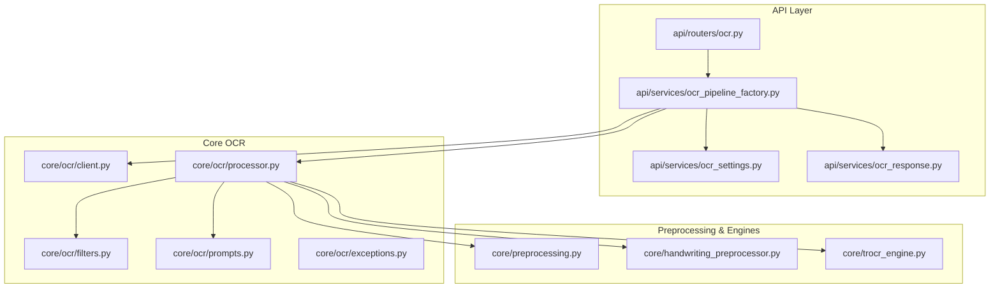
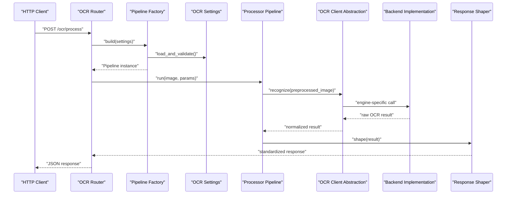
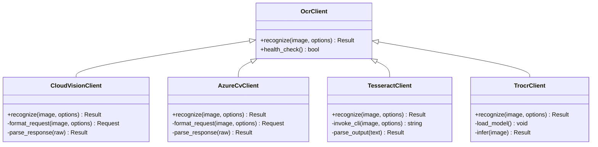
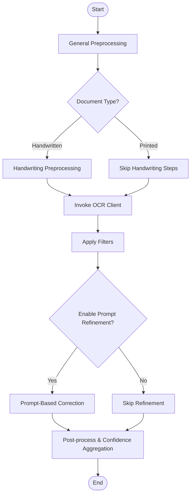
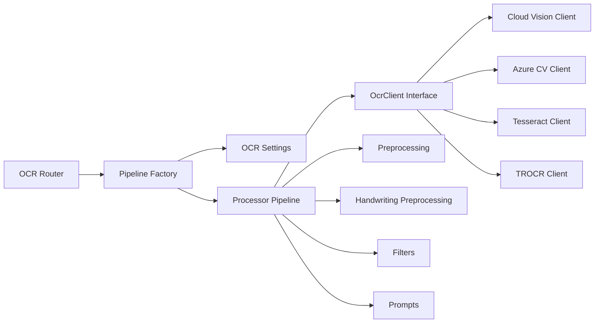

# OCR Engine Integration

<cite>
**Referenced Files in This Document**
- [src/local_deepl/core/ocr/client.py](file://src/local_deepl/core/ocr/client.py)
- [src/local_deepl/core/ocr/processor.py](file://src/local_deepl/core/ocr/processor.py)
- [src/local_deepl/core/ocr/filters.py](file://src/local_deepl/core/ocr/filters.py)
- [src/local_deepl/core/ocr/prompts.py](file://src/local_deepl/core/ocr/prompts.py)
- [src/local_deepl/core/ocr/exceptions.py](file://src/local_deepl/core/ocr/exceptions.py)
- [src/local_deepl/api/services/ocr_pipeline_factory.py](file://src/local_deepl/api/services/ocr_pipeline_factory.py)
- [src/local_deepl/api/services/ocr_settings.py](file://src/local_deepl/api/services/ocr_settings.py)
- [src/local_deepl/api/services/ocr_response.py](file://src/local_deepl/api/services/ocr_response.py)
- [src/local_deepl/api/routers/ocr.py](file://src/local_deepl/api/routers/ocr.py)
- [src/local_deepl/core/handwriting_preprocessor.py](file://src/local_deepl/core/handwriting_preprocessor.py)
- [src/local_deepl/core/preprocessing.py](file://src/local_deepl/core/preprocessing.py)
- [src/local_deepl/core/trocr_engine.py](file://src/local_deepl/core/trocr_engine.py)
- [scripts/confidence_eval.py](file://scripts/confidence_eval.py)
- [scripts/confidence_image.py](file://scripts/confidence_image.py)
- [tests/test_ocr.py](file://tests/test_ocr.py)
- [tests/test_ocr_trocr_integration.py](file://tests/test_ocr_trocr_integration.py)
</cite>

## Table of Contents
1. [Introduction](#introduction)
2. [Project Structure](#project-structure)
3. [Core Components](#core-components)
4. [Architecture Overview](#architecture-overview)
5. [Detailed Component Analysis](#detailed-component-analysis)
6. [Dependency Analysis](#dependency-analysis)
7. [Performance Considerations](#performance-considerations)
8. [Troubleshooting Guide](#troubleshooting-guide)
9. [Conclusion](#conclusion)
10. [Appendices](#appendices)

## Introduction
This document explains LocalDeepL’s pluggable OCR engine integration subsystem. It covers the client abstraction layer, processor pipeline, quality assessment mechanisms, and strategies for adding new OCR backends (Tesseract, Google Vision, Azure Computer Vision, and local models). It also documents confidence scoring, error recovery, performance optimization, handwriting recognition support, and image preprocessing techniques.

## Project Structure
The OCR subsystem is organized around a clear separation of concerns:
- API layer exposes endpoints and orchestrates services
- Services implement configuration, response shaping, and pipeline factory logic
- Core OCR module provides the client abstraction, processing pipeline, filters, prompts, and exceptions
- Preprocessing utilities and specialized engines (e.g., TROCR) are integrated into the pipeline
- Scripts and tests provide evaluation and verification tools

**Diagram sources**
- [src/local_deepl/api/routers/ocr.py](file://src/local_deepl/api/routers/ocr.py)
- [src/local_deepl/api/services/ocr_pipeline_factory.py](file://src/local_deepl/api/services/ocr_pipeline_factory.py)
- [src/local_deepl/api/services/ocr_settings.py](file://src/local_deepl/api/services/ocr_settings.py)
- [src/local_deepl/api/services/ocr_response.py](file://src/local_deepl/api/services/ocr_response.py)
- [src/local_deepl/core/ocr/client.py](file://src/local_deepl/core/ocr/client.py)
- [src/local_deepl/core/ocr/processor.py](file://src/local_deepl/core/ocr/processor.py)
- [src/local_deepl/core/ocr/filters.py](file://src/local_deepl/core/ocr/filters.py)
- [src/local_deepl/core/ocr/prompts.py](file://src/local_deepl/core/ocr/prompts.py)
- [src/local_deepl/core/ocr/exceptions.py](file://src/local_deepl/core/ocr/exceptions.py)
- [src/local_deepl/core/preprocessing.py](file://src/local_deepl/core/preprocessing.py)
- [src/local_deepl/core/handwriting_preprocessor.py](file://src/local_deepl/core/handwriting_preprocessor.py)
- [src/local_deepl/core/trocr_engine.py](file://src/local_deepl/core/trocr_engine.py)

**Section sources**
- [src/local_deepl/api/routers/ocr.py](file://src/local_deepl/api/routers/ocr.py)
- [src/local_deepl/api/services/ocr_pipeline_factory.py](file://src/local_deepl/api/services/ocr_pipeline_factory.py)
- [src/local_deepl/api/services/ocr_settings.py](file://src/local_deepl/api/services/ocr_settings.py)
- [src/local_deepl/api/services/ocr_response.py](file://src/local_deepl/api/services/ocr_response.py)
- [src/local_deepl/core/ocr/client.py](file://src/local_deepl/core/ocr/client.py)
- [src/local_deepl/core/ocr/processor.py](file://src/local_deepl/core/ocr/processor.py)
- [src/local_deepl/core/ocr/filters.py](file://src/local_deepl/core/ocr/filters.py)
- [src/local_deepl/core/ocr/prompts.py](file://src/local_deepl/core/ocr/prompts.py)
- [src/local_deepl/core/ocr/exceptions.py](file://src/local_deepl/core/ocr/exceptions.py)
- [src/local_deepl/core/preprocessing.py](file://src/local_deepl/core/preprocessing.py)
- [src/local_deepl/core/handwriting_preprocessor.py](file://src/local_deepl/core/handwriting_preprocessor.py)
- [src/local_deepl/core/trocr_engine.py](file://src/local_deepl/core/trocr_engine.py)

## Core Components
- Client Abstraction Layer: Defines a uniform interface for OCR backends to implement, enabling interchangeable use of cloud and local engines.
- Processor Pipeline: Orchestrates preprocessing, detection, recognition, filtering, and post-processing steps with configurable stages.
- Quality Assessment: Provides confidence scoring and result validation hooks to evaluate OCR output quality.
- Error Handling: Centralized exception types and retry/recovery strategies across the pipeline.
- Configuration: Settings for backend selection, parameters, and per-document-type behavior.
- Response Shaping: Normalizes outputs from different engines into a consistent schema.

Key responsibilities by file:
- Client abstraction and common interfaces
- Pipeline orchestration and stage composition
- Filters and prompt-based refinement
- Exception taxonomy and error propagation
- Factory wiring and settings management
- Response normalization and serialization
- Handwriting-specific preprocessing
- General image preprocessing utilities
- Local model engine integration (e.g., TROCR)

**Section sources**
- [src/local_deepl/core/ocr/client.py](file://src/local_deepl/core/ocr/client.py)
- [src/local_deepl/core/ocr/processor.py](file://src/local_deepl/core/ocr/processor.py)
- [src/local_deepl/core/ocr/filters.py](file://src/local_deepl/core/ocr/filters.py)
- [src/local_deepl/core/ocr/prompts.py](file://src/local_deepl/core/ocr/prompts.py)
- [src/local_deepl/core/ocr/exceptions.py](file://src/local_deepl/core/ocr/exceptions.py)
- [src/local_deepl/api/services/ocr_pipeline_factory.py](file://src/local_deepl/api/services/ocr_pipeline_factory.py)
- [src/local_deepl/api/services/ocr_settings.py](file://src/local_deepl/api/services/ocr_settings.py)
- [src/local_deepl/api/services/ocr_response.py](file://src/local_deepl/api/services/ocr_response.py)
- [src/local_deepl/core/handwriting_preprocessor.py](file://src/local_deepl/core/handwriting_preprocessor.py)
- [src/local_deepl/core/preprocessing.py](file://src/local_deepl/core/preprocessing.py)
- [src/local_deepl/core/trocr_engine.py](file://src/local_deepl/core/trocr_engine.py)

## Architecture Overview
The OCR subsystem follows a layered architecture:
- API Router receives requests and delegates to the OCR service layer
- Service layer uses a pipeline factory to build an execution pipeline based on settings
- The processor pipeline composes preprocessing, OCR client calls, filtering, and response shaping
- Backends implement the client interface; examples include cloud providers and local engines like TROCR

**Diagram sources**
- [src/local_deepl/api/routers/ocr.py](file://src/local_deepl/api/routers/ocr.py)
- [src/local_deepl/api/services/ocr_pipeline_factory.py](file://src/local_deepl/api/services/ocr_pipeline_factory.py)
- [src/local_deepl/api/services/ocr_settings.py](file://src/local_deepl/api/services/ocr_settings.py)
- [src/local_deepl/core/ocr/processor.py](file://src/local_deepl/core/ocr/processor.py)
- [src/local_deepl/core/ocr/client.py](file://src/local_deepl/core/ocr/client.py)
- [src/local_deepl/api/services/ocr_response.py](file://src/local_deepl/api/services/ocr_response.py)

## Detailed Component Analysis

### Client Abstraction Layer
The client abstraction defines a unified interface for OCR backends. Implementations encapsulate authentication, request formatting, and response parsing while exposing a simple recognize method. This enables swapping backends without changing pipeline code.

- Responsibilities:
  - Standardize input/output formats
  - Handle backend-specific errors and retries
  - Provide health checks and capability flags
- Extensibility:
  - Add a new class implementing the client interface
  - Register it in the pipeline factory or settings resolver

**Diagram sources**
- [src/local_deepl/core/ocr/client.py](file://src/local_deepl/core/ocr/client.py)
- [src/local_deepl/core/trocr_engine.py](file://src/local_deepl/core/trocr_engine.py)

**Section sources**
- [src/local_deepl/core/ocr/client.py](file://src/local_deepl/core/ocr/client.py)
- [src/local_deepl/core/trocr_engine.py](file://src/local_deepl/core/trocr_engine.py)

### Processor Pipeline
The processor composes multiple stages:
- Preprocessing: general image enhancements and layout-aware operations
- Handwriting preprocessing: specialized transforms for cursive or handwritten content
- OCR invocation: calls the selected backend via the client abstraction
- Filtering: removes low-confidence segments, merges lines, normalizes text
- Prompt-based refinement: optional LLM-assisted correction using structured prompts
- Post-processing: confidence aggregation, metadata enrichment, and result shaping

**Diagram sources**
- [src/local_deepl/core/ocr/processor.py](file://src/local_deepl/core/ocr/processor.py)
- [src/local_deepl/core/preprocessing.py](file://src/local_deepl/core/preprocessing.py)
- [src/local_deepl/core/handwriting_preprocessor.py](file://src/local_deepl/core/handwriting_preprocessor.py)
- [src/local_deepl/core/ocr/filters.py](file://src/local_deepl/core/ocr/filters.py)
- [src/local_deepl/core/ocr/prompts.py](file://src/local_deepl/core/ocr/prompts.py)

**Section sources**
- [src/local_deepl/core/ocr/processor.py](file://src/local_deepl/core/ocr/processor.py)
- [src/local_deepl/core/preprocessing.py](file://src/local_deepl/core/preprocessing.py)
- [src/local_deepl/core/handwriting_preprocessor.py](file://src/local_deepl/core/handwriting_preprocessor.py)
- [src/local_deepl/core/ocr/filters.py](file://src/local_deepl/core/ocr/filters.py)
- [src/local_deepl/core/ocr/prompts.py](file://src/local_deepl/core/ocr/prompts.py)

### Quality Assessment and Confidence Scoring
Quality assessment integrates at multiple points:
- Per-segment confidence from backend responses
- Aggregated confidence across pages and blocks
- Optional prompt-based refinement to improve accuracy
- Evaluation scripts to benchmark confidence against ground truth

Implementation highlights:
- Confidence thresholds to filter weak results
- Merging adjacent low-confidence segments when appropriate
- Logging and metrics for downstream monitoring

**Section sources**
- [src/local_deepl/core/ocr/processor.py](file://src/local_deepl/core/ocr/processor.py)
- [src/local_deepl/core/ocr/filters.py](file://src/local_deepl/core/ocr/filters.py)
- [scripts/confidence_eval.py](file://scripts/confidence_eval.py)
- [scripts/confidence_image.py](file://scripts/confidence_image.py)

### Error Handling and Recovery
Centralized exceptions define error categories (network, auth, rate limit, invalid input, unsupported feature). The pipeline applies:
- Retry with exponential backoff for transient failures
- Fallback to alternative backends if configured
- Graceful degradation by skipping non-critical stages
- Rich error context for diagnostics

**Section sources**
- [src/local_deepl/core/ocr/exceptions.py](file://src/local_deepl/core/ocr/exceptions.py)
- [src/local_deepl/core/ocr/processor.py](file://src/local_deepl/core/ocr/processor.py)

### Configuration and Settings
OCR settings control:
- Backend selection and credentials
- Recognition parameters (languages, page modes, output formats)
- Preprocessing toggles and thresholds
- Prompt refinement options
- Document-type specific overrides

The factory builds pipelines according to these settings, ensuring consistent behavior across environments.

**Section sources**
- [src/local_deepl/api/services/ocr_settings.py](file://src/local_deepl/api/services/ocr_settings.py)
- [src/local_deepl/api/services/ocr_pipeline_factory.py](file://src/local_deepl/api/services/ocr_pipeline_factory.py)

### Response Shaping
The response shaper normalizes heterogeneous outputs into a standard schema:
- Text content with positional metadata
- Confidence scores per segment/page
- Processing metadata (backend used, timings)
- Errors and warnings

**Section sources**
- [src/local_deepl/api/services/ocr_response.py](file://src/local_deepl/api/services/ocr_response.py)

### Handwriting Recognition Capabilities
Handwriting preprocessing includes:
- Contrast enhancement and noise reduction
- Stroke normalization and skew correction
- Segmentation aids for cursive flows
- Optional language/model tuning for script variants

Integration points:
- Conditional application based on document type detection
- Compatibility checks with chosen backend

**Section sources**
- [src/local_deepl/core/handwriting_preprocessor.py](file://src/local_deepl/core/handwriting_preprocessor.py)
- [src/local_deepl/core/preprocessing.py](file://src/local_deepl/core/preprocessing.py)

### Image Preprocessing Techniques
General preprocessing supports:
- Grayscale conversion and binarization
- Denoising and morphological operations
- Deskewing and perspective correction
- Resolution scaling and padding for optimal inference

These steps improve both printed and handwritten text recognition quality.

**Section sources**
- [src/local_deepl/core/preprocessing.py](file://src/local_deepl/core/preprocessing.py)

### Adding a New OCR Engine
Steps to integrate a new backend:
1. Implement the client interface with recognize and health_check methods
2. Handle backend-specific request/response formats
3. Map backend errors to the shared exception types
4. Register the client in the pipeline factory or settings resolver
5. Add unit tests covering happy path, errors, and edge cases
6. Optionally add preprocessing or prompt refinements tailored to the engine

Example references:
- Client interface and patterns
- Existing local engine implementation for reference
- Tests demonstrating integration patterns

**Section sources**
- [src/local_deepl/core/ocr/client.py](file://src/local_deepl/core/ocr/client.py)
- [src/local_deepl/core/trocr_engine.py](file://src/local_deepl/core/trocr_engine.py)
- [tests/test_ocr.py](file://tests/test_ocr.py)
- [tests/test_ocr_trocr_integration.py](file://tests/test_ocr_trocr_integration.py)

### Configuring Recognition Parameters
Common parameters include:
- Language codes and dictionaries
- Page segmentation mode
- Output format (plain text, structured JSON)
- Confidence thresholds and merging rules
- Preprocessing toggles and intensity levels

Configuration is centralized in settings and consumed by the factory and pipeline.

**Section sources**
- [src/local_deepl/api/services/ocr_settings.py](file://src/local_deepl/api/services/ocr_settings.py)
- [src/local_deepl/api/services/ocr_pipeline_factory.py](file://src/local_deepl/api/services/ocr_pipeline_factory.py)

### Handling Different Document Types
Document-type detection influences:
- Selection of preprocessing steps
- Choice of OCR backend or fallbacks
- Prompt refinement strategy
- Confidence thresholds and merging behavior

Typical types:
- Printed text
- Handwritten notes
- Hybrid (mixed printed and handwritten)
- Scanned images with complex layouts

**Section sources**
- [src/local_deepl/core/ocr/processor.py](file://src/local_deepl/core/ocr/processor.py)
- [src/local_deepl/core/handwriting_preprocessor.py](file://src/local_deepl/core/handwriting_preprocessor.py)

## Dependency Analysis
The OCR subsystem exhibits loose coupling between components:
- Router depends on services
- Services depend on factory and settings
- Factory constructs pipeline instances
- Pipeline depends on client abstraction, preprocessing, filters, and prompts
- Backends depend only on the client interface

**Diagram sources**
- [src/local_deepl/api/routers/ocr.py](file://src/local_deepl/api/routers/ocr.py)
- [src/local_deepl/api/services/ocr_pipeline_factory.py](file://src/local_deepl/api/services/ocr_pipeline_factory.py)
- [src/local_deepl/api/services/ocr_settings.py](file://src/local_deepl/api/services/ocr_settings.py)
- [src/local_deepl/core/ocr/processor.py](file://src/local_deepl/core/ocr/processor.py)
- [src/local_deepl/core/ocr/client.py](file://src/local_deepl/core/ocr/client.py)
- [src/local_deepl/core/preprocessing.py](file://src/local_deepl/core/preprocessing.py)
- [src/local_deepl/core/handwriting_preprocessor.py](file://src/local_deepl/core/handwriting_preprocessor.py)
- [src/local_deepl/core/ocr/filters.py](file://src/local_deepl/core/ocr/filters.py)
- [src/local_deepl/core/ocr/prompts.py](file://src/local_deepl/core/ocr/prompts.py)
- [src/local_deepl/core/trocr_engine.py](file://src/local_deepl/core/trocr_engine.py)

**Section sources**
- [src/local_deepl/api/routers/ocr.py](file://src/local_deepl/api/routers/ocr.py)
- [src/local_deepl/api/services/ocr_pipeline_factory.py](file://src/local_deepl/api/services/ocr_pipeline_factory.py)
- [src/local_deepl/api/services/ocr_settings.py](file://src/local_deepl/api/services/ocr_settings.py)
- [src/local_deepl/core/ocr/processor.py](file://src/local_deepl/core/ocr/processor.py)
- [src/local_deepl/core/ocr/client.py](file://src/local_deepl/core/ocr/client.py)
- [src/local_deepl/core/preprocessing.py](file://src/local_deepl/core/preprocessing.py)
- [src/local_deepl/core/handwriting_preprocessor.py](file://src/local_deepl/core/handwriting_preprocessor.py)
- [src/local_deepl/core/ocr/filters.py](file://src/local_deepl/core/ocr/filters.py)
- [src/local_deepl/core/ocr/prompts.py](file://src/local_deepl/core/ocr/prompts.py)
- [src/local_deepl/core/trocr_engine.py](file://src/local_deepl/core/trocr_engine.py)

## Performance Considerations
- Prefer batch processing where supported by backends
- Use adaptive preprocessing tuned to document type
- Cache model weights and clients to avoid cold starts
- Apply confidence thresholds to skip expensive refinement on high-quality results
- Parallelize independent pages or blocks when safe
- Monitor latency and throughput metrics; adjust concurrency limits accordingly

[No sources needed since this section provides general guidance]

## Troubleshooting Guide
Common issues and resolutions:
- Authentication failures: verify credentials and endpoint URLs
- Rate limiting: implement retries with backoff and reduce concurrency
- Low confidence: enable prompt refinement or adjust preprocessing
- Unsupported features: check backend capabilities and fall back gracefully
- Memory pressure: scale down batch sizes and optimize image resolution

Diagnostic resources:
- Exception types for categorizing errors
- Evaluation scripts to compare confidence against ground truth
- Unit tests for regression coverage

**Section sources**
- [src/local_deepl/core/ocr/exceptions.py](file://src/local_deepl/core/ocr/exceptions.py)
- [scripts/confidence_eval.py](file://scripts/confidence_eval.py)
- [scripts/confidence_image.py](file://scripts/confidence_image.py)
- [tests/test_ocr.py](file://tests/test_ocr.py)
- [tests/test_ocr_trocr_integration.py](file://tests/test_ocr_trocr_integration.py)

## Conclusion
LocalDeepL’s OCR subsystem provides a robust, extensible framework for integrating multiple backends through a clean client abstraction and a configurable processor pipeline. With built-in quality assessment, error recovery, and preprocessing strategies, it supports diverse document types including handwritten content. The design encourages easy addition of new engines and fine-tuning of recognition parameters to meet varied operational needs.

[No sources needed since this section summarizes without analyzing specific files]

## Appendices

### Example Workflows

#### Adding a New OCR Engine
- Implement the client interface
- Wire into the factory/settings
- Add tests and documentation

References:
- [src/local_deepl/core/ocr/client.py](file://src/local_deepl/core/ocr/client.py)
- [src/local_deepl/core/trocr_engine.py](file://src/local_deepl/core/trocr_engine.py)
- [tests/test_ocr.py](file://tests/test_ocr.py)
- [tests/test_ocr_trocr_integration.py](file://tests/test_ocr_trocr_integration.py)

#### Configuring Recognition Parameters
- Set languages, segmentation modes, and output formats
- Adjust confidence thresholds and preprocessing toggles

References:
- [src/local_deepl/api/services/ocr_settings.py](file://src/local_deepl/api/services/ocr_settings.py)
- [src/local_deepl/api/services/ocr_pipeline_factory.py](file://src/local_deepl/api/services/ocr_pipeline_factory.py)

#### Handling Different Document Types
- Enable handwriting preprocessing for handwritten documents
- Use hybrid strategies for mixed content

References:
- [src/local_deepl/core/handwriting_preprocessor.py](file://src/local_deepl/core/handwriting_preprocessor.py)
- [src/local_deepl/core/preprocessing.py](file://src/local_deepl/core/preprocessing.py)
- [src/local_deepl/core/ocr/processor.py](file://src/local_deepl/core/ocr/processor.py)