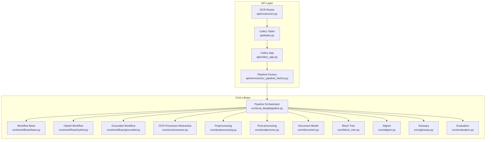
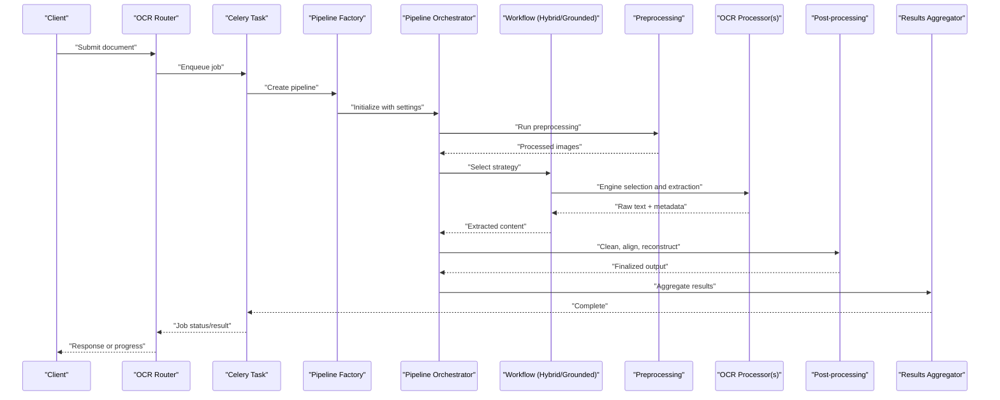
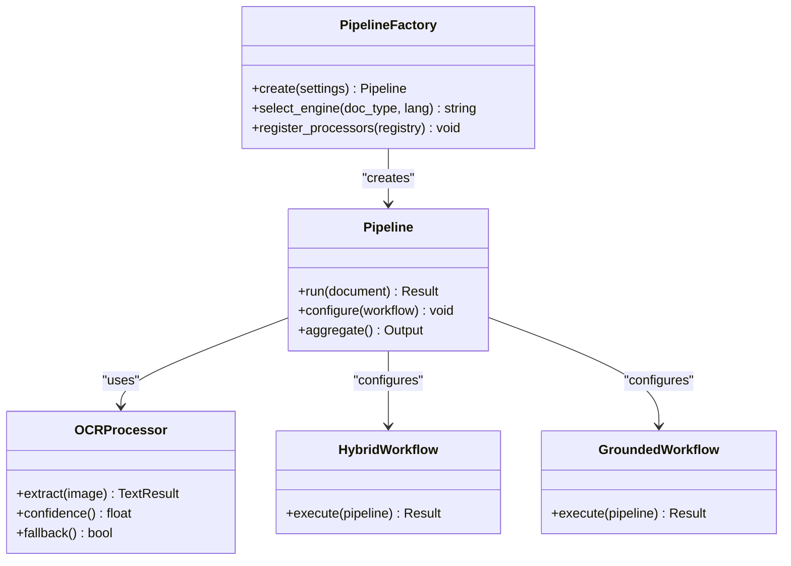
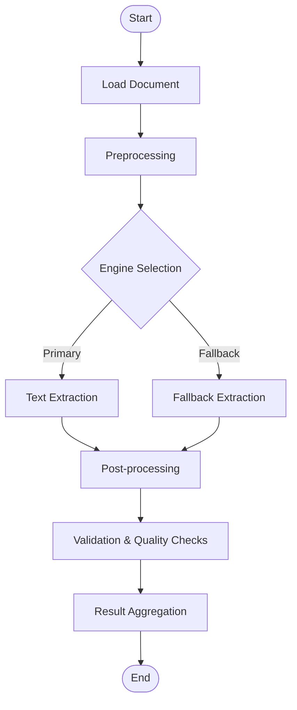
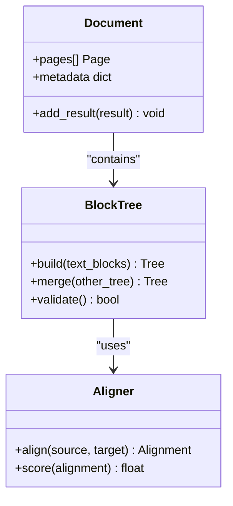
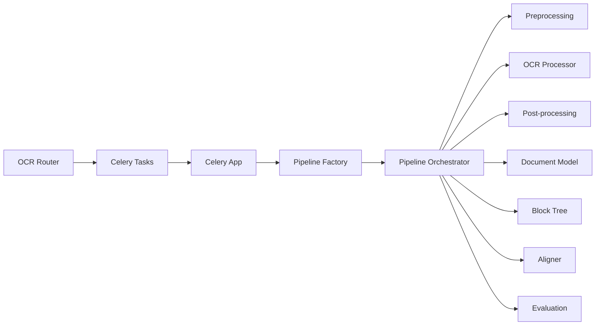

# OCR Processing Pipeline

<cite>
**Referenced Files in This Document**
- [pipeline.py](file://src/local_deepl/pipeline.py)
- [core/ocr/processor.py](file://src/local_deepl/core/ocr/processor.py)
- [api/services/ocr_pipeline_factory.py](file://src/local_deepl/api/services/ocr_pipeline_factory.py)
- [core/workflows/base.py](file://src/local_deepl/core/workflows/base.py)
- [core/workflows/hybrid.py](file://src/local_deepl/core/workflows/hybrid.py)
- [core/workflows/grounded.py](file://src/local_deepl/core/workflows/grounded.py)
- [core/preprocessing.py](file://src/local_deepl/core/preprocessing.py)
- [core/postprocess.py](file://src/local_deepl/core/postprocess.py)
- [core/document.py](file://src/local_deepl/core/document.py)
- [core/block_tree.py](file://src/local_deepl/core/block_tree.py)
- [core/aligner.py](file://src/local_deepl/core/aligner.py)
- [core/glossary.py](file://src/local_deepl/core/glossary.py)
- [core/evaluation.py](file://src/local_deepl/core/evaluation.py)
- [api/routers/ocr.py](file://src/local_deepl/api/routers/ocr.py)
- [api/tasks.py](file://src/local_deepl/api/tasks.py)
- [api/celery_app.py](file://src/local_deepl/api/celery_app.py)
- [scripts/confidence_eval.py](file://scripts/confidence_eval.py)
- [scripts/confidence_image.py](file://scripts/confidence_image.py)
</cite>

## Table of Contents
1. [Introduction](#introduction)
2. [Project Structure](#project-structure)
3. [Core Components](#core-components)
4. [Architecture Overview](#architecture-overview)
5. [Detailed Component Analysis](#detailed-component-analysis)
6. [Dependency Analysis](#dependency-analysis)
7. [Performance Considerations](#performance-considerations)
8. [Troubleshooting Guide](#troubleshooting-guide)
9. [Conclusion](#conclusion)
10. [Appendices](#appendices)

## Introduction
This document explains the OCR processing pipeline architecture, focusing on how documents flow through a multi-stage workflow: preprocessing, engine selection, text extraction, and post-processing. It details the processor factory pattern, stage orchestration, result aggregation, confidence scoring, quality assessment, error recovery, batch processing, parallel execution, and resource management. The goal is to help developers understand, customize, and extend the pipeline with new processors and validation rules.

## Project Structure
The OCR pipeline spans several modules:
- API layer exposes endpoints and orchestrates tasks via Celery for background processing.
- Core library defines the pipeline stages, workflows, and data models.
- Utilities provide image handling, alignment, glossaries, and evaluation tools.
- Scripts support evaluation and visualization.

**Diagram sources**
- [api/routers/ocr.py](file://src/local_deepl/api/routers/ocr.py)
- [api/tasks.py](file://src/local_deepl/api/tasks.py)
- [api/celery_app.py](file://src/local_deepl/api/celery_app.py)
- [api/services/ocr_pipeline_factory.py](file://src/local_deepl/api/services/ocr_pipeline_factory.py)
- [pipeline.py](file://src/local_deepl/pipeline.py)
- [core/workflows/base.py](file://src/local_deepl/core/workflows/base.py)
- [core/workflows/hybrid.py](file://src/local_deepl/core/workflows/hybrid.py)
- [core/workflows/grounded.py](file://src/local_deepl/core/workflows/grounded.py)
- [core/ocr/processor.py](file://src/local_deepl/core/ocr/processor.py)
- [core/preprocessing.py](file://src/local_deepl/core/preprocessing.py)
- [core/postprocess.py](file://src/local_deepl/core/postprocess.py)
- [core/document.py](file://src/local_deepl/core/document.py)
- [core/block_tree.py](file://src/local_deepl/core/block_tree.py)
- [core/aligner.py](file://src/local_deepl/core/aligner.py)
- [core/glossary.py](file://src/local_deepl/core/glossary.py)
- [core/evaluation.py](file://src/local_deepl/core/evaluation.py)

**Section sources**
- [api/routers/ocr.py](file://src/local_deepl/api/routers/ocr.py)
- [api/tasks.py](file://src/local_deepl/api/tasks.py)
- [api/celery_app.py](file://src/local_deepl/api/celery_app.py)
- [api/services/ocr_pipeline_factory.py](file://src/local_deepl/api/services/ocr_pipeline_factory.py)
- [pipeline.py](file://src/local_deepl/pipeline.py)
- [core/workflows/base.py](file://src/local_deepl/core/workflows/base.py)
- [core/workflows/hybrid.py](file://src/local_deepl/core/workflows/hybrid.py)
- [core/workflows/grounded.py](file://src/local_deepl/core/workflows/grounded.py)
- [core/ocr/processor.py](file://src/local_deepl/core/ocr/processor.py)
- [core/preprocessing.py](file://src/local_deepl/core/preprocessing.py)
- [core/postprocess.py](file://src/local_deepl/core/postprocess.py)
- [core/document.py](file://src/local_deepl/core/document.py)
- [core/block_tree.py](file://src/local_deepl/core/block_tree.py)
- [core/aligner.py](file://src/local_deepl/core/aligner.py)
- [core/glossary.py](file://src/local_deepl/core/glossary.py)
- [core/evaluation.py](file://src/local_deepl/core/evaluation.py)

## Core Components
- Pipeline Orchestrator: Coordinates stages, manages state, and aggregates results across stages.
- Processor Factory: Creates and configures OCR processors based on input characteristics and settings.
- Workflows: Encapsulate different strategies (hybrid, grounded) that combine OCR, grounding, and translation.
- Preprocessing: Image normalization, deskewing, binarization, and layout analysis preparation.
- Post-processing: Text cleaning, dictionary-based corrections, alignment, and tree reconstruction.
- Data Models: Document and Block Tree structures carry intermediate and final outputs.
- Evaluation and Confidence: Metrics and scripts to assess OCR quality and confidence.

Key responsibilities:
- Stage orchestration and error propagation.
- Engine selection and fallbacks.
- Result aggregation and consistency checks.
- Resource control and concurrency limits.

**Section sources**
- [pipeline.py](file://src/local_deepl/pipeline.py)
- [api/services/ocr_pipeline_factory.py](file://src/local_deepl/api/services/ocr_pipeline_factory.py)
- [core/workflows/base.py](file://src/local_deepl/core/workflows/base.py)
- [core/workflows/hybrid.py](file://src/local_deepl/core/workflows/hybrid.py)
- [core/workflows/grounded.py](file://src/local_deepl/core/workflows/grounded.py)
- [core/preprocessing.py](file://src/local_deepl/core/preprocessing.py)
- [core/postprocess.py](file://src/local_deepl/core/postprocess.py)
- [core/document.py](file://src/local_deepl/core/document.py)
- [core/block_tree.py](file://src/local_deepl/core/block_tree.py)
- [core/evaluation.py](file://src/local_deepl/core/evaluation.py)

## Architecture Overview
The pipeline follows a staged architecture with clear separation between API, task queue, factory, and core processing logic.

**Diagram sources**
- [api/routers/ocr.py](file://src/local_deepl/api/routers/ocr.py)
- [api/tasks.py](file://src/local_deepl/api/tasks.py)
- [api/celery_app.py](file://src/local_deepl/api/celery_app.py)
- [api/services/ocr_pipeline_factory.py](file://src/local_deepl/api/services/ocr_pipeline_factory.py)
- [pipeline.py](file://src/local_deepl/pipeline.py)
- [core/workflows/hybrid.py](file://src/local_deepl/core/workflows/hybrid.py)
- [core/workflows/grounded.py](file://src/local_deepl/core/workflows/grounded.py)
- [core/preprocessing.py](file://src/local_deepl/core/preprocessing.py)
- [core/ocr/processor.py](file://src/local_deepl/core/ocr/processor.py)
- [core/postprocess.py](file://src/local_deepl/core/postprocess.py)

## Detailed Component Analysis

### Processor Factory Pattern
The factory creates and configures OCR processors based on document type, language, and user settings. It supports multiple engines and fallbacks.

**Diagram sources**
- [api/services/ocr_pipeline_factory.py](file://src/local_deepl/api/services/ocr_pipeline_factory.py)
- [pipeline.py](file://src/local_deepl/pipeline.py)
- [core/ocr/processor.py](file://src/local_deepl/core/ocr/processor.py)
- [core/workflows/hybrid.py](file://src/local_deepl/core/workflows/hybrid.py)
- [core/workflows/grounded.py](file://src/local_deepl/core/workflows/grounded.py)

**Section sources**
- [api/services/ocr_pipeline_factory.py](file://src/local_deepl/api/services/ocr_pipeline_factory.py)
- [pipeline.py](file://src/local_deepl/pipeline.py)
- [core/ocr/processor.py](file://src/local_deepl/core/ocr/processor.py)
- [core/workflows/hybrid.py](file://src/local_deepl/core/workflows/hybrid.py)
- [core/workflows/grounded.py](file://src/local_deepl/core/workflows/grounded.py)

### Stage Orchestration and Data Flow
The orchestrator coordinates preprocessing, engine selection, extraction, and post-processing while maintaining consistent state and aggregating results.

**Diagram sources**
- [pipeline.py](file://src/local_deepl/pipeline.py)
- [core/preprocessing.py](file://src/local_deepl/core/preprocessing.py)
- [core/ocr/processor.py](file://src/local_deepl/core/ocr/processor.py)
- [core/postprocess.py](file://src/local_deepl/core/postprocess.py)

**Section sources**
- [pipeline.py](file://src/local_deepl/pipeline.py)
- [core/preprocessing.py](file://src/local_deepl/core/preprocessing.py)
- [core/ocr/processor.py](file://src/local_deepl/core/ocr/processor.py)
- [core/postprocess.py](file://src/local_deepl/core/postprocess.py)

### Result Aggregation and Consistency
Aggregation merges outputs from multiple engines or stages, resolves conflicts, and ensures structural integrity using block trees and alignment utilities.

**Diagram sources**
- [core/document.py](file://src/local_deepl/core/document.py)
- [core/block_tree.py](file://src/local_deepl/core/block_tree.py)
- [core/aligner.py](file://src/local_deepl/core/aligner.py)

**Section sources**
- [core/document.py](file://src/local_deepl/core/document.py)
- [core/block_tree.py](file://src/local_deepl/core/block_tree.py)
- [core/aligner.py](file://src/local_deepl/core/aligner.py)

### Customizing Processing Stages
To add a custom stage:
- Implement a stage function compatible with the orchestrator’s interface.
- Register it in the pipeline configuration or factory registry.
- Ensure it updates the shared document state and returns structured results.

Example customization paths:
- Add a new preprocessing step: [core/preprocessing.py](file://src/local_deepl/core/preprocessing.py)
- Integrate a new OCR engine: [core/ocr/processor.py](file://src/local_deepl/core/ocr/processor.py)
- Extend post-processing rules: [core/postprocess.py](file://src/local_deepl/core/postprocess.py)

**Section sources**
- [core/preprocessing.py](file://src/local_deepl/core/preprocessing.py)
- [core/ocr/processor.py](file://src/local_deepl/core/ocr/processor.py)
- [core/postprocess.py](file://src/local_deepl/core/postprocess.py)

### Adding New Processors
To implement a new processor:
- Follow the processor abstraction interface.
- Provide confidence metrics and fallback behavior.
- Register the processor with the factory for selection.

Reference implementation patterns:
- Processor interface and methods: [core/ocr/processor.py](file://src/local_deepl/core/ocr/processor.py)
- Factory registration and selection: [api/services/ocr_pipeline_factory.py](file://src/local_deepl/api/services/ocr_pipeline_factory.py)

**Section sources**
- [core/ocr/processor.py](file://src/local_deepl/core/ocr/processor.py)
- [api/services/ocr_pipeline_factory.py](file://src/local_deepl/api/services/ocr_pipeline_factory.py)

### Implementing Custom Validation Rules
Validation can be added at post-processing or workflow levels:
- Define rule functions that inspect text blocks and return pass/fail with reasons.
- Integrate into the validation phase of the orchestrator.
- Use glossary and alignment utilities to enforce domain-specific constraints.

Suggested integration points:
- Validation hooks in post-processing: [core/postprocess.py](file://src/local_deepl/core/postprocess.py)
- Glossary-based corrections: [core/glossary.py](file://src/local_deepl/core/glossary.py)
- Alignment scoring: [core/aligner.py](file://src/local_deepl/core/aligner.py)

**Section sources**
- [core/postprocess.py](file://src/local_deepl/core/postprocess.py)
- [core/glossary.py](file://src/local_deepl/core/glossary.py)
- [core/aligner.py](file://src/local_deepl/core/aligner.py)

### Confidence Scoring Algorithms and Quality Assessment
Confidence scoring combines per-block scores, global document metrics, and alignment quality. Evaluation utilities compute accuracy against ground truth and visualize confidence distributions.

Key references:
- Evaluation metrics and helpers: [core/evaluation.py](file://src/local_deepl/core/evaluation.py)
- Confidence evaluation script: [scripts/confidence_eval.py](file://scripts/confidence_eval.py)
- Confidence visualization for images: [scripts/confidence_image.py](file://scripts/confidence_image.py)

**Section sources**
- [core/evaluation.py](file://src/local_deepl/core/evaluation.py)
- [scripts/confidence_eval.py](file://scripts/confidence_eval.py)
- [scripts/confidence_image.py](file://scripts/confidence_image.py)

### Error Recovery Strategies
Robust pipelines include retry policies, fallback engines, and graceful degradation:
- Retry transient failures with backoff.
- Switch to alternative engines when primary fails.
- Preserve partial results and mark low-confidence sections.

Integration points:
- Task-level retries and timeouts: [api/tasks.py](file://src/local_deepl/api/tasks.py), [api/celery_app.py](file://src/local_deepl/api/celery_app.py)
- Processor fallback logic: [core/ocr/processor.py](file://src/local_deepl/core/ocr/processor.py)
- Workflow-level recovery: [core/workflows/hybrid.py](file://src/local_deepl/core/workflows/hybrid.py), [core/workflows/grounded.py](file://src/local_deepl/core/workflows/grounded.py)

**Section sources**
- [api/tasks.py](file://src/local_deepl/api/tasks.py)
- [api/celery_app.py](file://src/local_deepl/api/celery_app.py)
- [core/ocr/processor.py](file://src/local_deepl/core/ocr/processor.py)
- [core/workflows/hybrid.py](file://src/local_deepl/core/workflows/hybrid.py)
- [core/workflows/grounded.py](file://src/local_deepl/core/workflows/grounded.py)

### Batch Processing, Parallel Execution, and Resource Management
Batch jobs are enqueued via Celery tasks; workers execute them concurrently with configurable concurrency limits. Resource management includes memory bounds, image resizing, and temporary file cleanup.

References:
- Celery app configuration: [api/celery_app.py](file://src/local_deepl/api/celery_app.py)
- Task definitions for OCR jobs: [api/tasks.py](file://src/local_deepl/api/tasks.py)
- Pipeline orchestration for batching: [pipeline.py](file://src/local_deepl/pipeline.py)

**Section sources**
- [api/celery_app.py](file://src/local_deepl/api/celery_app.py)
- [api/tasks.py](file://src/local_deepl/api/tasks.py)
- [pipeline.py](file://src/local_deepl/pipeline.py)

## Dependency Analysis
The following diagram shows key dependencies among components involved in OCR processing.

**Diagram sources**
- [api/routers/ocr.py](file://src/local_deepl/api/routers/ocr.py)
- [api/tasks.py](file://src/local_deepl/api/tasks.py)
- [api/celery_app.py](file://src/local_deepl/api/celery_app.py)
- [api/services/ocr_pipeline_factory.py](file://src/local_deepl/api/services/ocr_pipeline_factory.py)
- [pipeline.py](file://src/local_deepl/pipeline.py)
- [core/preprocessing.py](file://src/local_deepl/core/preprocessing.py)
- [core/ocr/processor.py](file://src/local_deepl/core/ocr/processor.py)
- [core/postprocess.py](file://src/local_deepl/core/postprocess.py)
- [core/document.py](file://src/local_deepl/core/document.py)
- [core/block_tree.py](file://src/local_deepl/core/block_tree.py)
- [core/aligner.py](file://src/local_deepl/core/aligner.py)
- [core/evaluation.py](file://src/local_deepl/core/evaluation.py)

**Section sources**
- [api/routers/ocr.py](file://src/local_deepl/api/routers/ocr.py)
- [api/tasks.py](file://src/local_deepl/api/tasks.py)
- [api/celery_app.py](file://src/local_deepl/api/celery_app.py)
- [api/services/ocr_pipeline_factory.py](file://src/local_deepl/api/services/ocr_pipeline_factory.py)
- [pipeline.py](file://src/local_deepl/pipeline.py)
- [core/preprocessing.py](file://src/local_deepl/core/preprocessing.py)
- [core/ocr/processor.py](file://src/local_deepl/core/ocr/processor.py)
- [core/postprocess.py](file://src/local_deepl/core/postprocess.py)
- [core/document.py](file://src/local_deepl/core/document.py)
- [core/block_tree.py](file://src/local_deepl/core/block_tree.py)
- [core/aligner.py](file://src/local_deepl/core/aligner.py)
- [core/evaluation.py](file://src/local_deepl/core/evaluation.py)

## Performance Considerations
- Concurrency tuning: Adjust worker count and task queues to match hardware resources.
- Memory management: Limit image sizes and reuse buffers where possible.
- Engine selection: Prefer faster engines for large batches; use high-quality engines selectively.
- Caching: Cache repeated preprocessing results and glossary lookups.
- I/O optimization: Stream large documents and minimize disk writes.

[No sources needed since this section provides general guidance]

## Troubleshooting Guide
Common issues and resolutions:
- Task failures: Check Celery logs and retry policies; ensure environment variables and credentials are set.
- Engine errors: Verify model availability and network connectivity; enable fallback engines.
- Low confidence: Inspect preprocessing quality; adjust thresholds and run additional passes.
- Alignment mismatches: Review glossary entries and alignment parameters; validate block tree structure.

Relevant files:
- Task and worker configuration: [api/tasks.py](file://src/local_deepl/api/tasks.py), [api/celery_app.py](file://src/local_deepl/api/celery_app.py)
- Processor fallback and error handling: [core/ocr/processor.py](file://src/local_deepl/core/ocr/processor.py)
- Evaluation and diagnostics: [core/evaluation.py](file://src/local_deepl/core/evaluation.py)

**Section sources**
- [api/tasks.py](file://src/local_deepl/api/tasks.py)
- [api/celery_app.py](file://src/local_deepl/api/celery_app.py)
- [core/ocr/processor.py](file://src/local_deepl/core/ocr/processor.py)
- [core/evaluation.py](file://src/local_deepl/core/evaluation.py)

## Conclusion
The OCR pipeline is modular and extensible, leveraging a processor factory, orchestrated stages, and robust workflows. By following the provided patterns, you can add custom stages, integrate new engines, implement validation rules, and optimize performance for batch and parallel execution.

[No sources needed since this section summarizes without analyzing specific files]

## Appendices

### Example: Adding a New Processor
- Implement the processor interface and confidence reporting.
- Register the processor in the factory registry.
- Configure engine selection logic to include the new processor.

Paths:
- [core/ocr/processor.py](file://src/local_deepl/core/ocr/processor.py)
- [api/services/ocr_pipeline_factory.py](file://src/local_deepl/api/services/ocr_pipeline_factory.py)

**Section sources**
- [core/ocr/processor.py](file://src/local_deepl/core/ocr/processor.py)
- [api/services/ocr_pipeline_factory.py](file://src/local_deepl/api/services/ocr_pipeline_factory.py)

### Example: Custom Validation Rule
- Create a validation function that inspects text blocks and returns pass/fail.
- Integrate into post-processing or workflow validation phases.
- Use glossary and alignment utilities for domain-specific checks.

Paths:
- [core/postprocess.py](file://src/local_deepl/core/postprocess.py)
- [core/glossary.py](file://src/local_deepl/core/glossary.py)
- [core/aligner.py](file://src/local_deepl/core/aligner.py)

**Section sources**
- [core/postprocess.py](file://src/local_deepl/core/postprocess.py)
- [core/glossary.py](file://src/local_deepl/core/glossary.py)
- [core/aligner.py](file://src/local_deepl/core/aligner.py)