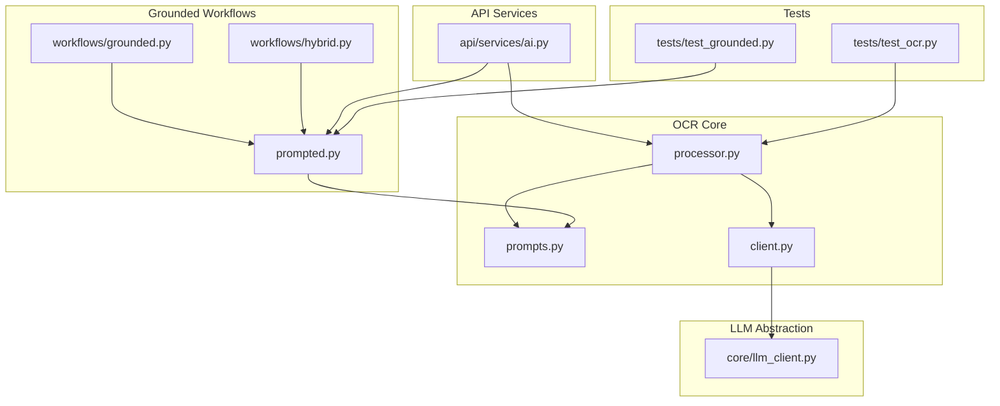
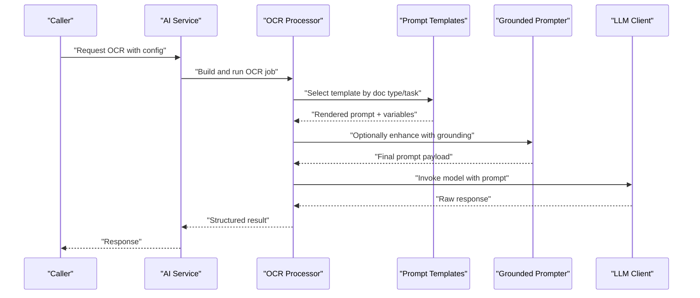
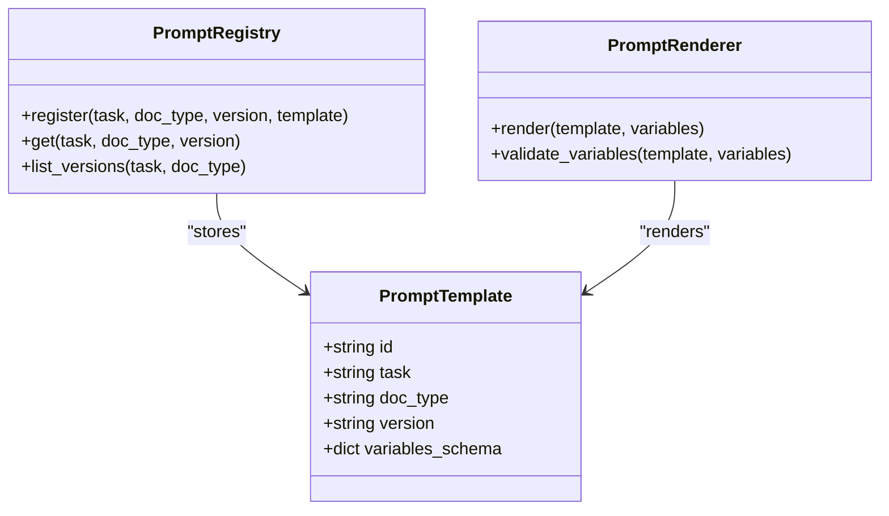
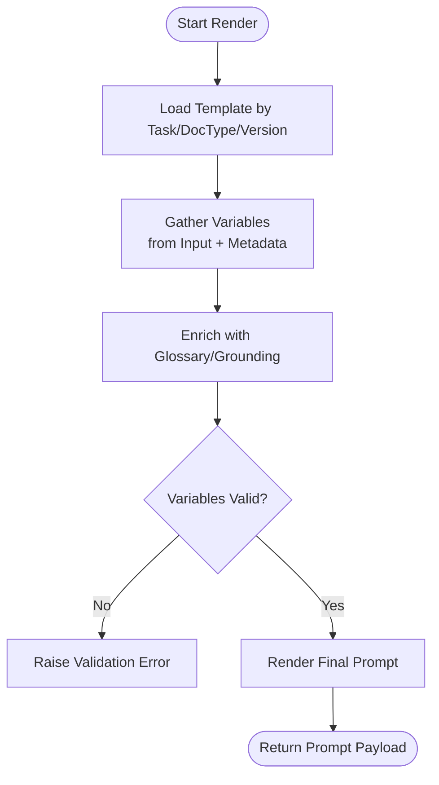
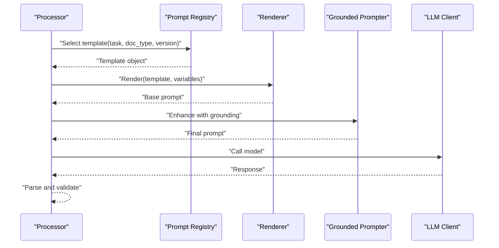
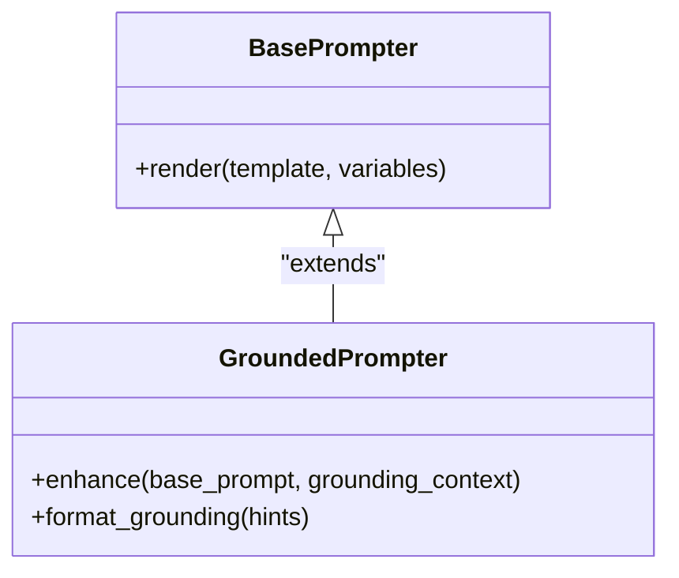
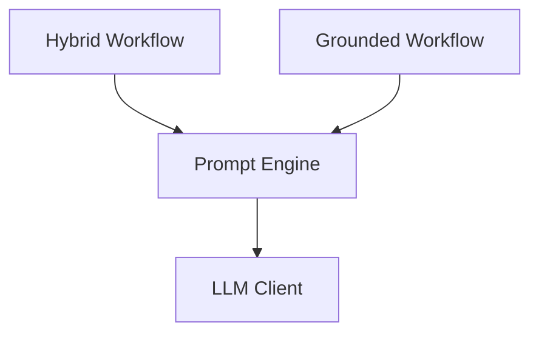
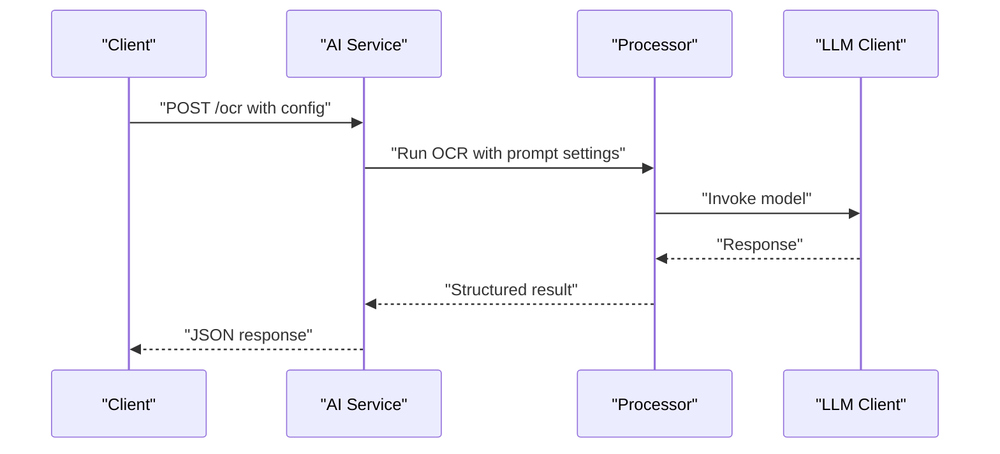
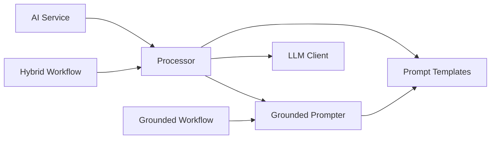

# OCR Prompt Engineering

<cite>
**Referenced Files in This Document**
- [src/local_deepl/core/ocr/prompts.py](file://src/local_deepl/core/ocr/prompts.py)
- [src/local_deepl/core/ocr/client.py](file://src/local_deepl/core/ocr/client.py)
- [src/local_deepl/core/ocr/processor.py](file://src/local_deepl/core/ocr/processor.py)
- [src/local_deepl/core/grounded/prompted.py](file://src/local_deepl/core/grounded/prompted.py)
- [src/local_deepl/api/services/ai.py](file://src/local_deepl/api/services/ai.py)
- [src/local_deepl/core/llm_client.py](file://src/local_deepl/core/llm_client.py)
- [src/local_deepl/core/workflows/hybrid.py](file://src/local_deepl/core/workflows/hybrid.py)
- [src/local_deepl/core/workflows/grounded.py](file://src/local_deepl/core/workflows/grounded.py)
- [tests/test_ocr.py](file://tests/test_ocr.py)
- [tests/test_grounded.py](file://tests/test_grounded.py)
</cite>

## Table of Contents
1. [Introduction](#introduction)
2. [Project Structure](#project-structure)
3. [Core Components](#core-components)
4. [Architecture Overview](#architecture-overview)
5. [Detailed Component Analysis](#detailed-component-analysis)
6. [Dependency Analysis](#dependency-analysis)
7. [Performance Considerations](#performance-considerations)
8. [Troubleshooting Guide](#troubleshooting-guide)
9. [Conclusion](#conclusion)
10. [Appendices](#appendices)

## Introduction
This document explains the OCR prompt engineering system used to construct, template, and optimize prompts for AI-powered recognition models. It covers how prompts are built for different document types and tasks, how variables and context are injected, and how to create custom prompts for specialized formats. It also documents prompt versioning strategies, testing frameworks, evaluation metrics, and best practices for design and maintenance.

## Project Structure
The OCR prompt system is implemented across several modules:
- Prompt templates and templating utilities live under the OCR core module.
- The OCR processor orchestrates prompt construction and execution.
- Grounded workflows integrate prompts with grounding logic.
- API services expose configuration and orchestration endpoints.
- LLM client abstraction provides a unified interface for model calls.
- Tests validate prompt behavior and integration points.

**Diagram sources**
- [src/local_deepl/core/ocr/prompts.py](file://src/local_deepl/core/ocr/prompts.py)
- [src/local_deepl/core/ocr/client.py](file://src/local_deepl/core/ocr/client.py)
- [src/local_deepl/core/ocr/processor.py](file://src/local_deepl/core/ocr/processor.py)
- [src/local_deepl/core/grounded/prompted.py](file://src/local_deepl/core/grounded/prompted.py)
- [src/local_deepl/core/workflows/grounded.py](file://src/local_deepl/core/workflows/grounded.py)
- [src/local_deepl/core/workflows/hybrid.py](file://src/local_deepl/core/workflows/hybrid.py)
- [src/local_deepl/api/services/ai.py](file://src/local_deepl/api/services/ai.py)
- [src/local_deepl/core/llm_client.py](file://src/local_deepl/core/llm_client.py)
- [tests/test_ocr.py](file://tests/test_ocr.py)
- [tests/test_grounded.py](file://tests/test_grounded.py)

**Section sources**
- [src/local_deepl/core/ocr/prompts.py](file://src/local_deepl/core/ocr/prompts.py)
- [src/local_deepl/core/ocr/processor.py](file://src/local_deepl/core/ocr/processor.py)
- [src/local_deepl/core/grounded/prompted.py](file://src/local_deepl/core/grounded/prompted.py)
- [src/local_deepl/core/workflows/hybrid.py](file://src/local_deepl/core/workflows/hybrid.py)
- [src/local_deepl/core/workflows/grounded.py](file://src/local_deepl/core/workflows/grounded.py)
- [src/local_deepl/api/services/ai.py](file://src/local_deepl/api/services/ai.py)
- [src/local_deepl/core/llm_client.py](file://src/local_deepl/core/llm_client.py)
- [tests/test_ocr.py](file://tests/test_ocr.py)
- [tests/test_grounded.py](file://tests/test_grounded.py)

## Core Components
- Prompt Template System: Centralized definitions and rendering utilities for building structured prompts tailored to document types and tasks.
- Variable Substitution: Mechanisms to inject runtime values (document metadata, schema hints, constraints) into templates.
- Context Injection: Strategies to include relevant context such as glossary terms, prior results, or grounding information.
- Processor Orchestration: Coordinates prompt selection, rendering, and invocation against OCR/AI backends.
- Grounded Prompt Integration: Extends base prompts with grounding-aware instructions and outputs.
- LLM Client Abstraction: Provides a consistent interface for calling underlying models while abstracting provider specifics.

Key responsibilities:
- Maintain prompt versions and variants for A/B testing.
- Provide deterministic rendering with clear variable contracts.
- Support task-specific customization without duplicating logic.

**Section sources**
- [src/local_deepl/core/ocr/prompts.py](file://src/local_deepl/core/ocr/prompts.py)
- [src/local_deepl/core/ocr/processor.py](file://src/local_deepl/core/ocr/processor.py)
- [src/local_deepl/core/grounded/prompted.py](file://src/local_deepl/core/grounded/prompted.py)
- [src/local_deepl/core/llm_client.py](file://src/local_deepl/core/llm_client.py)

## Architecture Overview
The OCR prompt pipeline integrates templated prompts with processing and grounding workflows, then invokes an LLM client.

**Diagram sources**
- [src/local_deepl/api/services/ai.py](file://src/local_deepl/api/services/ai.py)
- [src/local_deepl/core/ocr/processor.py](file://src/local_deepl/core/ocr/processor.py)
- [src/local_deepl/core/ocr/prompts.py](file://src/local_deepl/core/ocr/prompts.py)
- [src/local_deepl/core/grounded/prompted.py](file://src/local_deepl/core/grounded/prompted.py)
- [src/local_deepl/core/llm_client.py](file://src/local_deepl/core/llm_client.py)

## Detailed Component Analysis

### Prompt Template System
- Purpose: Define reusable prompt structures for different document types and recognition tasks.
- Features:
  - Template registry keyed by task and document type.
  - Versioned templates to support evolution and rollback.
  - Rendering engine that substitutes variables safely.
- Usage patterns:
  - Select a template based on input metadata.
  - Inject variables like schema hints, constraints, and glossary entries.
  - Render final prompt text or structured payload for the model.

**Diagram sources**
- [src/local_deepl/core/ocr/prompts.py](file://src/local_deepl/core/ocr/prompts.py)

**Section sources**
- [src/local_deepl/core/ocr/prompts.py](file://src/local_deepl/core/ocr/prompts.py)

### Variable Substitution and Context Injection
- Variables:
  - Document-level: page count, language, orientation, resolution.
  - Task-level: extraction fields, output format, confidence thresholds.
  - Contextual: glossary terms, prior results, grounding hints.
- Injection mechanisms:
  - Explicit variable mapping passed at render time.
  - Automatic context gathering from document metadata and workflow state.
  - Optional enrichment via grounded prompters.

**Diagram sources**
- [src/local_deepl/core/ocr/prompts.py](file://src/local_deepl/core/ocr/prompts.py)
- [src/local_deepl/core/grounded/prompted.py](file://src/local_deepl/core/grounded/prompted.py)

**Section sources**
- [src/local_deepl/core/ocr/prompts.py](file://src/local_deepl/core/ocr/prompts.py)
- [src/local_deepl/core/grounded/prompted.py](file://src/local_deepl/core/grounded/prompted.py)

### Processor Orchestration
- Responsibilities:
  - Choose appropriate template and version.
  - Build variables and inject context.
  - Invoke grounded enhancements if configured.
  - Call LLM client and parse responses.
- Error handling:
  - Template not found or invalid variables.
  - Model call failures and retries.
  - Structured error propagation to API layer.

**Diagram sources**
- [src/local_deepl/core/ocr/processor.py](file://src/local_deepl/core/ocr/processor.py)
- [src/local_deepl/core/ocr/prompts.py](file://src/local_deepl/core/ocr/prompts.py)
- [src/local_deepl/core/grounded/prompted.py](file://src/local_deepl/core/grounded/prompted.py)
- [src/local_deepl/core/llm_client.py](file://src/local_deepl/core/llm_client.py)

**Section sources**
- [src/local_deepl/core/ocr/processor.py](file://src/local_deepl/core/ocr/processor.py)
- [src/local_deepl/core/ocr/prompts.py](file://src/local_deepl/core/ocr/prompts.py)
- [src/local_deepl/core/grounded/prompted.py](file://src/local_deepl/core/grounded/prompted.py)
- [src/local_deepl/core/llm_client.py](file://src/local_deepl/core/llm_client.py)

### Grounded Prompt Integration
- Purpose: Augment base prompts with grounding information to improve accuracy for complex layouts and tables.
- Capabilities:
  - Append grounding hints derived from layout analysis.
  - Include references to detected blocks or lines.
  - Adjust instruction phrasing for grounded vs. ungrounded modes.

**Diagram sources**
- [src/local_deepl/core/grounded/prompted.py](file://src/local_deepl/core/grounded/prompted.py)

**Section sources**
- [src/local_deepl/core/grounded/prompted.py](file://src/local_deepl/core/grounded/prompted.py)

### Workflow Integration
- Hybrid Workflow:
  - Combines OCR and translation steps with prompt-driven decisions.
  - Uses prompt templates to guide segmentation and extraction.
- Grounded Workflow:
  - Emphasizes grounding-enhanced prompts for high-fidelity structure recovery.

**Diagram sources**
- [src/local_deepl/core/workflows/hybrid.py](file://src/local_deepl/core/workflows/hybrid.py)
- [src/local_deepl/core/workflows/grounded.py](file://src/local_deepl/core/workflows/grounded.py)
- [src/local_deepl/core/llm_client.py](file://src/local_deepl/core/llm_client.py)

**Section sources**
- [src/local_deepl/core/workflows/hybrid.py](file://src/local_deepl/core/workflows/hybrid.py)
- [src/local_deepl/core/workflows/grounded.py](file://src/local_deepl/core/workflows/grounded.py)

### API Service Exposure
- Exposes endpoints to configure prompt settings, trigger OCR jobs, and retrieve results.
- Integrates with processor and grounded prompter to build final payloads.

**Diagram sources**
- [src/local_deepl/api/services/ai.py](file://src/local_deepl/api/services/ai.py)
- [src/local_deepl/core/ocr/processor.py](file://src/local_deepl/core/ocr/processor.py)
- [src/local_deepl/core/llm_client.py](file://src/local_deepl/core/llm_client.py)

**Section sources**
- [src/local_deepl/api/services/ai.py](file://src/local_deepl/api/services/ai.py)
- [src/local_deepl/core/ocr/processor.py](file://src/local_deepl/core/ocr/processor.py)
- [src/local_deepl/core/llm_client.py](file://src/local_deepl/core/llm_client.py)

## Dependency Analysis
- Internal dependencies:
  - Processor depends on Prompt Registry and Renderer.
  - Grounded Prompter extends base prompting capabilities.
  - Workflows depend on prompt engine and LLM client.
  - API service orchestrates processor and grounded prompter.
- External dependencies:
  - LLM client abstracts provider-specific calls.

**Diagram sources**
- [src/local_deepl/api/services/ai.py](file://src/local_deepl/api/services/ai.py)
- [src/local_deepl/core/ocr/processor.py](file://src/local_deepl/core/ocr/processor.py)
- [src/local_deepl/core/ocr/prompts.py](file://src/local_deepl/core/ocr/prompts.py)
- [src/local_deepl/core/grounded/prompted.py](file://src/local_deepl/core/grounded/prompted.py)
- [src/local_deepl/core/workflows/hybrid.py](file://src/local_deepl/core/workflows/hybrid.py)
- [src/local_deepl/core/workflows/grounded.py](file://src/local_deepl/core/workflows/grounded.py)
- [src/local_deepl/core/llm_client.py](file://src/local_deepl/core/llm_client.py)

**Section sources**
- [src/local_deepl/api/services/ai.py](file://src/local_deepl/api/services/ai.py)
- [src/local_deepl/core/ocr/processor.py](file://src/local_deepl/core/ocr/processor.py)
- [src/local_deepl/core/ocr/prompts.py](file://src/local_deepl/core/ocr/prompts.py)
- [src/local_deepl/core/grounded/prompted.py](file://src/local_deepl/core/grounded/prompted.py)
- [src/local_deepl/core/workflows/hybrid.py](file://src/local_deepl/core/workflows/hybrid.py)
- [src/local_deepl/core/workflows/grounded.py](file://src/local_deepl/core/workflows/grounded.py)
- [src/local_deepl/core/llm_client.py](file://src/local_deepl/core/llm_client.py)

## Performance Considerations
- Prompt size management: Keep prompts concise; avoid redundant context to reduce token usage and latency.
- Caching rendered prompts: Cache frequently used templates with stable variables to minimize rendering overhead.
- Batched operations: Where possible, batch multiple pages or segments to leverage model throughput.
- Grounding trade-offs: Enable grounding selectively for complex documents; disable for simple cases to save tokens.
- Retry and timeout policies: Implement robust retry with exponential backoff for transient failures.

[No sources needed since this section provides general guidance]

## Troubleshooting Guide
Common issues and resolutions:
- Template not found: Verify task/doc_type/version keys and ensure registration.
- Invalid variables: Check variable schemas and required fields before rendering.
- Model errors: Inspect LLM client logs, adjust timeouts, and consider fallback templates.
- Grounding mismatches: Ensure grounding context aligns with expected block/line identifiers.

Validation and tests:
- Unit tests for prompt rendering and variable validation.
- Integration tests for processor and grounded prompter flows.
- Regression tests comparing baseline vs. variant prompts.

**Section sources**
- [tests/test_ocr.py](file://tests/test_ocr.py)
- [tests/test_grounded.py](file://tests/test_grounded.py)

## Conclusion
The OCR prompt engineering system provides a flexible, versioned, and testable foundation for constructing and optimizing prompts across diverse document types and recognition tasks. By centralizing templates, enforcing variable contracts, and integrating grounding enhancements, it enables accurate, maintainable, and scalable OCR pipelines. Adopting the recommended best practices and leveraging the provided testing and evaluation tools will help teams iterate confidently and measure improvements reliably.

[No sources needed since this section summarizes without analyzing specific files]

## Appendices

### Creating Custom Prompts for Specialized Formats
Steps:
- Define a new template entry with task, doc_type, and version.
- Specify variable schema including required fields and defaults.
- Register the template in the prompt registry.
- Add unit tests validating rendering and edge cases.
- Optionally add grounded enhancements for complex layouts.

Best practices:
- Use descriptive variable names and clear documentation.
- Keep instructions explicit and minimal.
- Separate concerns: keep formatting rules separate from extraction logic.
- Version increment on breaking changes; deprecate old versions gradually.

**Section sources**
- [src/local_deepl/core/ocr/prompts.py](file://src/local_deepl/core/ocr/prompts.py)
- [src/local_deepl/core/grounded/prompted.py](file://src/local_deepl/core/grounded/prompted.py)

### Fine-Tuning Recognition Accuracy
Strategies:
- Refine variable injection to provide richer context (glossary, schema).
- Adjust grounding hints to better reflect document structure.
- Experiment with prompt phrasing to emphasize critical fields.
- Use A/B testing to compare variants on representative datasets.

Evaluation metrics:
- Field-level accuracy and F1 scores.
- Confidence calibration and error distribution.
- Latency and token usage per request.

**Section sources**
- [src/local_deepl/core/ocr/processor.py](file://src/local_deepl/core/ocr/processor.py)
- [src/local_deepl/core/grounded/prompted.py](file://src/local_deepl/core/grounded/prompted.py)

### A/B Testing Different Prompt Strategies
Approach:
- Create variant templates with distinct versions.
- Route requests to variants using feature flags or routing rules.
- Collect performance metrics and user feedback.
- Analyze results and promote winning variants.

**Section sources**
- [src/local_deepl/core/ocr/prompts.py](file://src/local_deepl/core/ocr/prompts.py)
- [src/local_deepl/core/ocr/processor.py](file://src/local_deepl/core/ocr/processor.py)

### Prompt Versioning and Maintenance
Guidelines:
- Increment major version for breaking changes; minor for additive features.
- Maintain backward compatibility where feasible.
- Deprecation notices and migration guides for consumers.
- Automated tests for each active version.

**Section sources**
- [src/local_deepl/core/ocr/prompts.py](file://src/local_deepl/core/ocr/prompts.py)