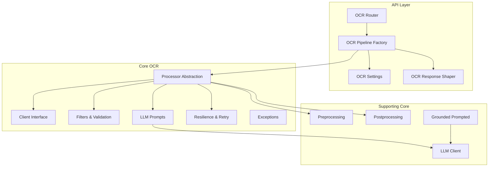
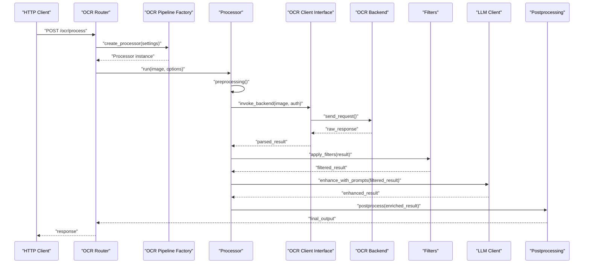
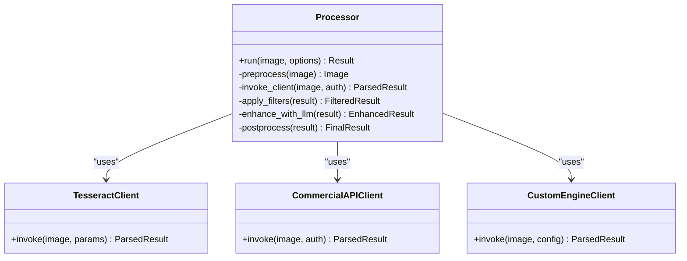
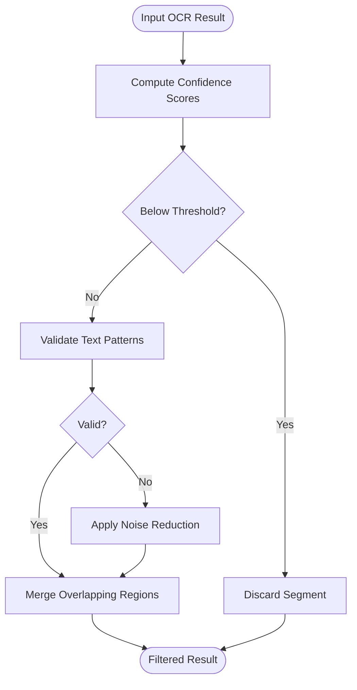
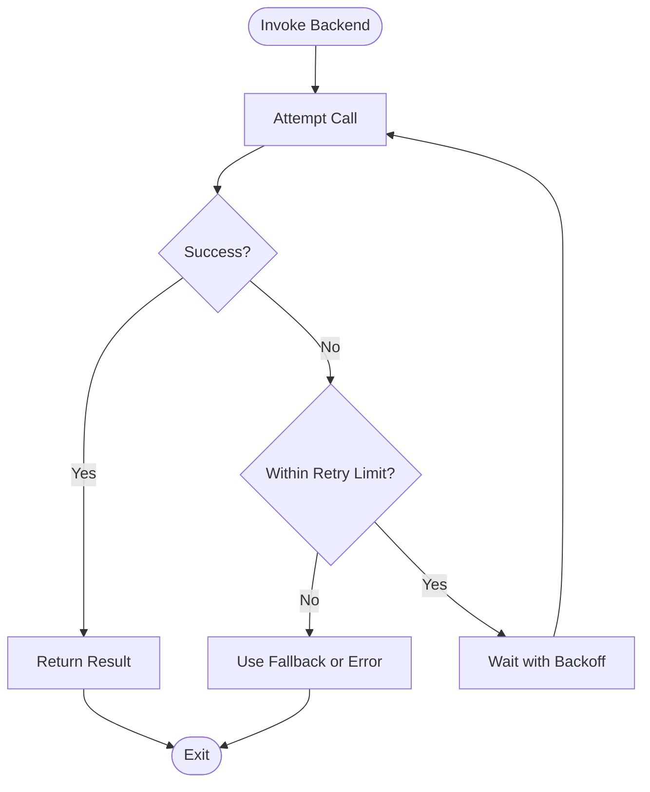
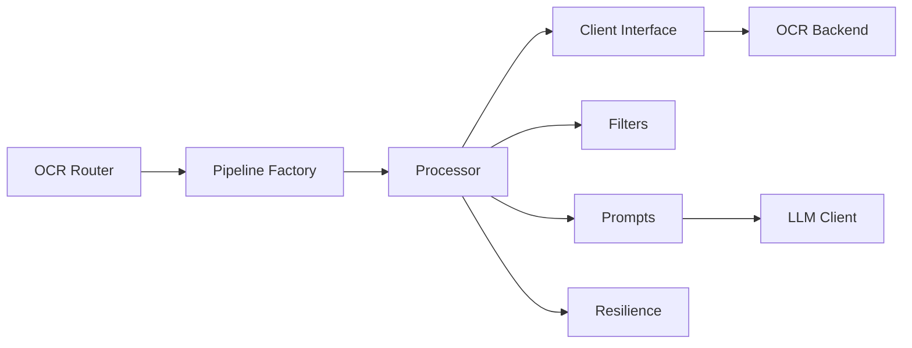

# OCR Processing Pipeline

<cite>
**Referenced Files in This Document**
- [processor.py](file://src/local_deepl/core/ocr/processor.py)
- [client.py](file://src/local_deepl/core/ocr/client.py)
- [filters.py](file://src/local_deepl/core/ocr/filters.py)
- [prompts.py](file://src/local_deepl/core/ocr/prompts.py)
- [resilience.py](file://src/local_deepl/core/ocr/resilience.py)
- [exceptions.py](file://src/local_deepl/core/ocr/exceptions.py)
- [ocr_pipeline_factory.py](file://src/local_deepl/api/services/ocr_pipeline_factory.py)
- [ocr_response.py](file://src/local_deepl/api/services/ocr_response.py)
- [ocr_settings.py](file://src/local_deepl/api/services/ocr_settings.py)
- [llm_client.py](file://src/local_deepl/core/llm_client.py)
- [preprocessing.py](file://src/local_deepl/core/preprocessing.py)
- [postprocess.py](file://src/local_deepl/core/postprocess.py)
- [grounded/prompted.py](file://src/local_deepl/core/grounded/prompted.py)
- [api/routers/ocr.py](file://src/local_deepl/api/routers/ocr.py)
- [test_ocr.py](file://tests/test_ocr.py)
- [test_ocr_resilience.py](file://tests/test_ocr_resilience.py)
</cite>

## Table of Contents
1. [Introduction](#introduction)
2. [Project Structure](#project-structure)
3. [Core Components](#core-components)
4. [Architecture Overview](#architecture-overview)
5. [Detailed Component Analysis](#detailed-component-analysis)
6. [Dependency Analysis](#dependency-analysis)
7. [Performance Considerations](#performance-considerations)
8. [Troubleshooting Guide](#troubleshooting-guide)
9. [Conclusion](#conclusion)
10. [Appendices](#appendices)

## Introduction
This document explains the OCR processing pipeline component, focusing on the processor abstraction layer that supports multiple OCR backends (Tesseract, commercial APIs, and custom engines). It covers client interface patterns, request/response handling, authentication mechanisms, filtering for OCR results (confidence scoring, text validation, noise reduction), prompt engineering for LLM-based enhancement, and resilience patterns for API failures and timeouts. Concrete examples from the codebase are referenced via file paths to guide configuration, integration, and post-processing. The content is designed to be accessible to beginners while providing sufficient technical depth for experienced developers implementing custom OCR backends.

## Project Structure
The OCR pipeline spans core logic under src/local_deepl/core/ocr and supporting services under src/local_deepl/api/services. Key modules include:
- Processor abstraction and orchestration
- Client interfaces for OCR backends
- Filtering and post-processing utilities
- Resilience and retry strategies
- Prompt templates for LLM-based enhancement
- API service wiring and response shaping

**Diagram sources**
- [ocr_pipeline_factory.py](file://src/local_deepl/api/services/ocr_pipeline_factory.py)
- [ocr_settings.py](file://src/local_deepl/api/services/ocr_settings.py)
- [ocr_response.py](file://src/local_deepl/api/services/ocr_response.py)
- [processor.py](file://src/local_deepl/core/ocr/processor.py)
- [client.py](file://src/local_deepl/core/ocr/client.py)
- [filters.py](file://src/local_deepl/core/ocr/filters.py)
- [prompts.py](file://src/local_deepl/core/ocr/prompts.py)
- [resilience.py](file://src/local/local_deepl/core/ocr/resilience.py)
- [exceptions.py](file://src/local_deepl/core/ocr/exceptions.py)
- [preprocessing.py](file://src/local_deepl/core/preprocessing.py)
- [postprocess.py](file://src/local_deepl/core/postprocess.py)
- [llm_client.py](file://src/local_deepl/core/llm_client.py)
- [grounded/prompted.py](file://src/local_deepl/core/grounded/prompted.py)

**Section sources**
- [ocr_pipeline_factory.py](file://src/local_deepl/api/services/ocr_pipeline_factory.py)
- [ocr_settings.py](file://src/local_deepl/api/services/ocr_settings.py)
- [ocr_response.py](file://src/local_deepl/api/services/ocr_response.py)
- [processor.py](file://src/local_deepl/core/ocr/processor.py)
- [client.py](file://src/local_deepl/core/ocr/client.py)
- [filters.py](file://src/local_deepl/core/ocr/filters.py)
- [prompts.py](file://src/local_deepl/core/ocr/prompts.py)
- [resilience.py](file://src/local_deepl/core/ocr/resilience.py)
- [exceptions.py](file://src/local_deepl/core/ocr/exceptions.py)
- [preprocessing.py](file://src/local_deepl/core/preprocessing.py)
- [postprocess.py](file://src/local_deepl/core/postprocess.py)
- [llm_client.py](file://src/local_deepl/core/llm_client.py)
- [grounded/prompted.py](file://src/local_deepl/core/grounded/prompted.py)

## Core Components
- Processor abstraction: Defines a unified interface for invoking OCR backends, orchestrating preprocessing, filtering, and postprocessing steps.
- Client interface: Encapsulates backend-specific requests, authentication, and response parsing.
- Filters: Confidence scoring, text validation, and noise reduction applied to OCR outputs.
- Prompts: Templates and strategies for LLM-based enhancement of OCR results.
- Resilience: Retry policies, timeouts, and fallbacks for robust operation against unreliable APIs.
- Exceptions: Domain-specific error types for OCR operations.

Key responsibilities:
- Decouple backend selection from pipeline orchestration
- Standardize request/response formats across backends
- Provide configurable filtering and validation
- Ensure resilient execution with retries and fallbacks
- Enable LLM-based enhancement through prompts

**Section sources**
- [processor.py](file://src/local_deepl/core/ocr/processor.py)
- [client.py](file://src/local_deepl/core/ocr/client.py)
- [filters.py](file://src/local_deepl/core/ocr/filters.py)
- [prompts.py](file://src/local_deepl/core/ocr/prompts.py)
- [resilience.py](file://src/local_deepl/core/ocr/resilience.py)
- [exceptions.py](file://src/local_deepl/core/ocr/exceptions.py)

## Architecture Overview
The OCR pipeline integrates API routing, factory-driven processor instantiation, backend clients, filtering, and LLM enhancement. The router receives OCR requests, the factory selects and configures processors based on settings, processors coordinate preprocessing, client calls, filtering, and postprocessing, and resilience ensures reliability.

**Diagram sources**
- [api/routers/ocr.py](file://src/local_deepl/api/routers/ocr.py)
- [ocr_pipeline_factory.py](file://src/local_deepl/api/services/ocr_pipeline_factory.py)
- [processor.py](file://src/local_deepl/core/ocr/processor.py)
- [client.py](file://src/local_deepl/core/ocr/client.py)
- [filters.py](file://src/local_deepl/core/ocr/filters.py)
- [prompts.py](file://src/local_deepl/core/ocr/prompts.py)
- [llm_client.py](file://src/local_deepl/core/llm_client.py)
- [postprocess.py](file://src/local_deepl/core/postprocess.py)

## Detailed Component Analysis

### Processor Abstraction Layer
The processor defines a consistent interface for executing OCR pipelines regardless of backend. It coordinates preprocessing, client invocation, filtering, optional LLM enhancement, and postprocessing. Configuration includes backend selection, timeout, retry policy, and filter thresholds.

Implementation highlights:
- Backend-agnostic run method
- Configurable preprocessing and postprocessing hooks
- Pluggable client implementations
- Integration points for filters and LLM enhancement

**Diagram sources**
- [processor.py](file://src/local_deepl/core/ocr/processor.py)
- [client.py](file://src/local_deepl/core/ocr/client.py)

**Section sources**
- [processor.py](file://src/local_deepl/core/ocr/processor.py)
- [client.py](file://src/local_deepl/core/ocr/client.py)

### Client Interface Patterns
The client interface standardizes how OCR backends are invoked. Each backend implements a common interface with methods for sending requests and parsing responses. Authentication can be handled per-backend (API keys, tokens, headers).

Patterns:
- Unified invoke method signature
- Request construction tailored to backend specifics
- Response normalization into a common structure
- Error mapping to domain exceptions

Authentication mechanisms:
- API key injection via headers or query parameters
- Token refresh workflows
- Secret management through environment variables or secure stores

**Section sources**
- [client.py](file://src/local_deepl/core/ocr/client.py)
- [ocr_settings.py](file://src/local_deepl/api/services/ocr_settings.py)

### Filtering System for OCR Results
Filtering applies confidence scoring, text validation, and noise reduction to improve output quality. Strategies include:
- Confidence thresholding to discard low-quality segments
- Regex-based validation for expected patterns (e.g., dates, IDs)
- Noise removal by eliminating non-printable characters or excessive whitespace
- Deduplication and merging of overlapping regions

**Diagram sources**
- [filters.py](file://src/local_deepl/core/ocr/filters.py)

**Section sources**
- [filters.py](file://src/local_deepl/core/ocr/filters.py)

### Prompt Engineering for LLM-Based Enhancement
Prompts define instructions for LLMs to refine OCR outputs. Techniques include:
- Contextual correction using domain knowledge
- Formatting normalization (e.g., consistent punctuation, casing)
- Structured extraction (e.g., JSON schema enforcement)
- Multi-step refinement (e.g., detect errors, then correct)

Integration points:
- Prompt templates parameterized by document type and language
- LLM client abstraction for flexible model selection
- Guardrails to prevent hallucination and maintain fidelity

**Section sources**
- [prompts.py](file://src/local_deepl/core/ocr/prompts.py)
- [llm_client.py](file://src/local_deepl/core/llm_client.py)
- [grounded/prompted.py](file://src/local_deepl/core/grounded/prompted.py)

### Resilience Patterns for API Failures and Timeouts
Resilience ensures robust operation under adverse conditions:
- Retry policies with exponential backoff
- Circuit breakers to prevent cascading failures
- Fallback backends or degraded modes
- Timeout handling with graceful degradation

**Diagram sources**
- [resilience.py](file://src/local_deepl/core/ocr/resilience.py)

**Section sources**
- [resilience.py](file://src/local_deepl/core/ocr/resilience.py)
- [exceptions.py](file://src/local_deepl/core/ocr/exceptions.py)

### API Service Wiring and Response Handling
The API layer wires processors via a factory, applies settings, and shapes responses. Key aspects:
- Factory pattern for dynamic processor instantiation
- Settings validation and defaults
- Response serialization and error formatting
- Progress tracking and job management

**Section sources**
- [ocr_pipeline_factory.py](file://src/local_deepl/api/services/ocr_pipeline_factory.py)
- [ocr_response.py](file://src/local_deepl/api/services/ocr_response.py)
- [ocr_settings.py](file://src/local_deepl/api/services/ocr_settings.py)
- [api/routers/ocr.py](file://src/local_deepl/api/routers/ocr.py)

## Dependency Analysis
The OCR pipeline exhibits clear separation of concerns:
- API layer depends on factory and settings
- Processor depends on client, filters, prompts, and resilience
- Clients depend on external backends
- LLM integration is optional and decoupled

**Diagram sources**
- [api/routers/ocr.py](file://src/local_deepl/api/routers/ocr.py)
- [ocr_pipeline_factory.py](file://src/local_deepl/api/services/ocr_pipeline_factory.py)
- [processor.py](file://src/local_deepl/core/ocr/processor.py)
- [client.py](file://src/local_deepl/core/ocr/client.py)
- [filters.py](file://src/local_deepl/core/ocr/filters.py)
- [prompts.py](file://src/local_deepl/core/ocr/prompts.py)
- [resilience.py](file://src/local_deepl/core/ocr/resilience.py)
- [llm_client.py](file://src/local_deepl/core/llm_client.py)

**Section sources**
- [api/routers/ocr.py](file://src/local_deepl/api/routers/ocr.py)
- [ocr_pipeline_factory.py](file://src/local_deepl/api/services/ocr_pipeline_factory.py)
- [processor.py](file://src/local_deepl/core/ocr/processor.py)
- [client.py](file://src/local_deepl/core/ocr/client.py)
- [filters.py](file://src/local_deepl/core/ocr/filters.py)
- [prompts.py](file://src/local_deepl/core/ocr/prompts.py)
- [resilience.py](file://src/local_deepl/core/ocr/resilience.py)
- [llm_client.py](file://src/local_deepl/core/llm_client.py)

## Performance Considerations
- Preprocessing optimization: Resize images appropriately, convert to grayscale when suitable, and remove unnecessary metadata.
- Batch processing: Group multiple images to reduce overhead for cloud APIs.
- Caching: Cache frequent OCR results or intermediate representations.
- Concurrency: Use async I/O for client calls where supported.
- Resource limits: Set timeouts and memory limits to prevent resource exhaustion.
- Monitoring: Track latency, error rates, and throughput for each backend.

[No sources needed since this section provides general guidance]

## Troubleshooting Guide
Common issues and solutions:
- Low confidence scores: Adjust preprocessing, tune filter thresholds, or enable LLM enhancement.
- API timeouts: Increase timeouts, implement retries, or switch to fallback backends.
- Authentication failures: Verify credentials, check token expiration, and ensure secure secret storage.
- Inconsistent outputs: Normalize prompts, enforce structured schemas, and validate outputs with regex.
- Memory errors: Reduce image sizes, process in chunks, and monitor resource usage.

Error handling strategies:
- Domain-specific exceptions for clear error classification
- Retry with exponential backoff for transient failures
- Circuit breaker patterns to isolate failing backends
- Graceful degradation to fallback modes

Monitoring capabilities:
- Metrics collection for latency, success rates, and error codes
- Logging structured events for auditability
- Alerts for critical failures and performance regressions

**Section sources**
- [exceptions.py](file://src/local_deepl/core/ocr/exceptions.py)
- [resilience.py](file://src/local_deepl/core/ocr/resilience.py)
- [test_ocr.py](file://tests/test_ocr.py)
- [test_ocr_resilience.py](file://tests/test_ocr_resilience.py)

## Conclusion
The OCR processing pipeline provides a robust, extensible framework for integrating multiple OCR backends. Its modular design supports customization through client implementations, filtering strategies, and LLM-based enhancement. Resilience patterns ensure reliable operation under varying conditions. By following the documented patterns and configurations, developers can implement custom backends, optimize accuracy, and maintain high availability.

[No sources needed since this section summarizes without analyzing specific files]

## Appendices
- Example configurations: Refer to [ocr_settings.py](file://src/local_deepl/api/services/ocr_settings.py) for default settings and environment variables.
- Custom backend integration: Implement the client interface as shown in [client.py](file://src/local_deepl/core/ocr/client.py).
- Result post-processing: Explore [postprocess.py](file://src/local_deepl/core/postprocess.py) for additional transformations.
- Testing patterns: Review [test_ocr.py](file://tests/test_ocr.py) and [test_ocr_resilience.py](file://tests/test_ocr_resilience.py) for unit and resilience tests.

**Section sources**
- [ocr_settings.py](file://src/local_deepl/api/services/ocr_settings.py)
- [client.py](file://src/local_deepl/core/ocr/client.py)
- [postprocess.py](file://src/local_deepl/core/postprocess.py)
- [test_ocr.py](file://tests/test_ocr.py)
- [test_ocr_resilience.py](file://tests/test_ocr_resilience.py)