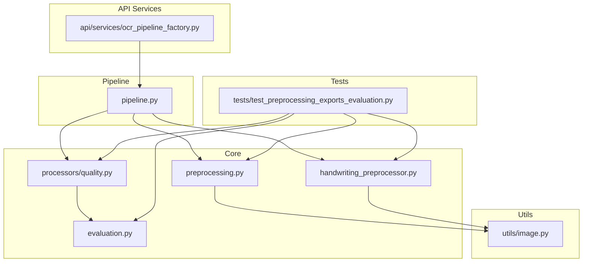
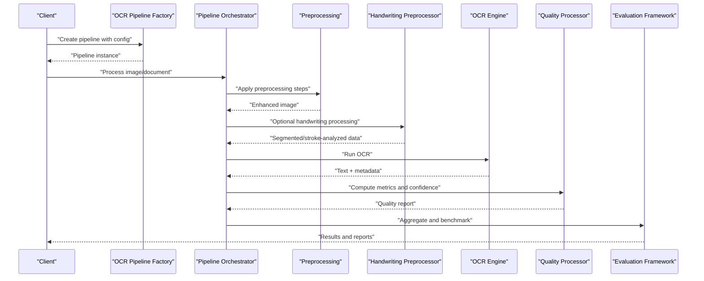
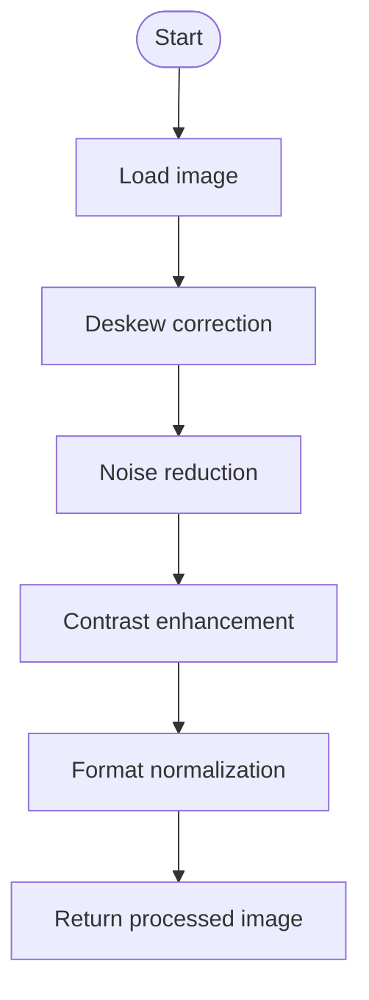
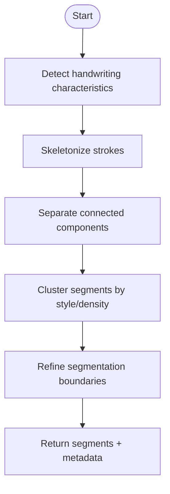
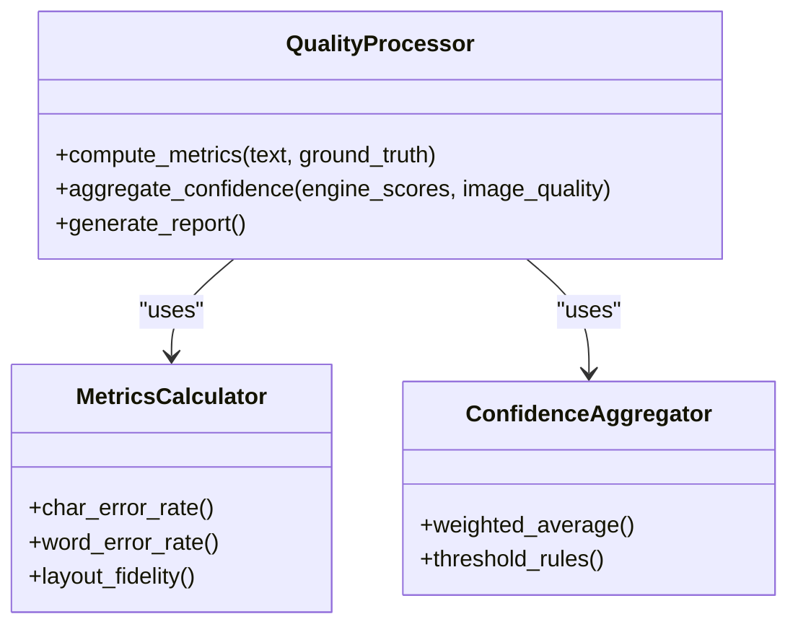
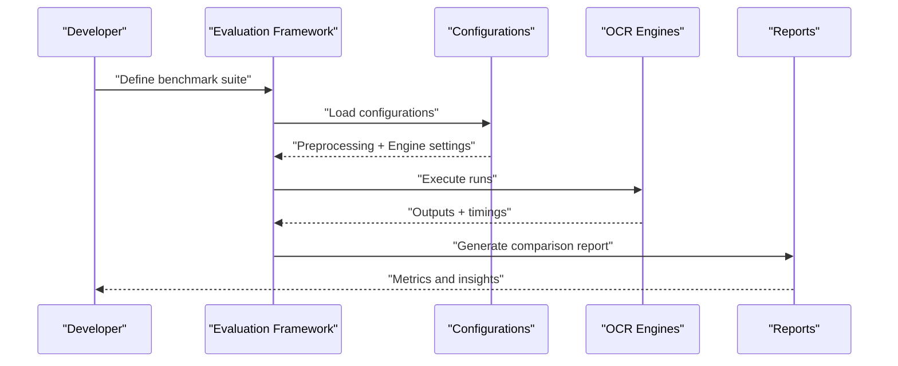
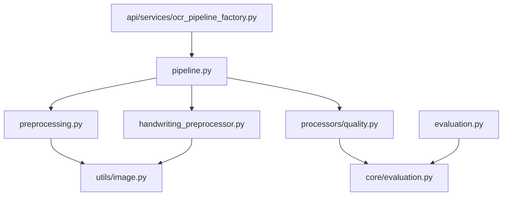

# Preprocessing and Quality Assessment

<cite>
**Referenced Files in This Document**
- [preprocessing.py](file://src/local_deepl/core/preprocessing.py)
- [handwriting_preprocessor.py](file://src/local_deepl/core/handwriting_preprocessor.py)
- [quality.py](file://src/local_deepl/core/processors/quality.py)
- [evaluation.py](file://src/local_deepl/core/evaluation.py)
- [evaluation.py](file://src/local_deepl/evaluation.py)
- [image.py](file://src/local_deepl/utils/image.py)
- [pipeline.py](file://src/local_deepl/pipeline.py)
- [ocr_pipeline_factory.py](file://src/local_deepl/api/services/ocr_pipeline_factory.py)
- [test_preprocessing_exports_evaluation.py](file://tests/test_preprocessing_exports_evaluation.py)
</cite>

## Table of Contents
1. [Introduction](#introduction)
2. [Project Structure](#project-structure)
3. [Core Components](#core-components)
4. [Architecture Overview](#architecture-overview)
5. [Detailed Component Analysis](#detailed-component-analysis)
6. [Dependency Analysis](#dependency-analysis)
7. [Performance Considerations](#performance-considerations)
8. [Troubleshooting Guide](#troubleshooting-guide)
9. [Conclusion](#conclusion)
10. [Appendices](#appendices)

## Introduction
This document explains the preprocessing and quality assessment subsystem for OCR within the project. It covers image preprocessing techniques (deskewing, noise reduction, contrast enhancement, format normalization), a handwriting preprocessor specialized for handwritten text recognition (stroke analysis and character segmentation), and a quality assessment framework that evaluates OCR accuracy, confidence scoring, and automated metrics. It also provides guidance on configuring preprocessing pipelines, adding custom steps, evaluating OCR performance, benchmarking approaches, and generating quality reports. The content is designed to be accessible to beginners while offering sufficient technical depth for experienced developers extending the system.

## Project Structure
The preprocessing and quality assessment functionality spans several modules:
- Core preprocessing utilities and workflows
- Handwriting-specific preprocessing
- Quality processors and evaluation utilities
- Pipeline orchestration and factory wiring
- Utility functions for image operations
- Tests validating exports and behavior

**Diagram sources**
- [preprocessing.py](file://src/local_deepl/core/preprocessing.py)
- [handwriting_preprocessor.py](file://src/local_deepl/core/handwriting_preprocessor.py)
- [quality.py](file://src/local_deepl/core/processors/quality.py)
- [evaluation.py](file://src/local_deepl/core/evaluation.py)
- [image.py](file://src/local_deepl/utils/image.py)
- [ocr_pipeline_factory.py](file://src/local_deepl/api/services/ocr_pipeline_factory.py)
- [pipeline.py](file://src/local_deepl/pipeline.py)
- [test_preprocessing_exports_evaluation.py](file://tests/test_preprocessing_exports_evaluation.py)

**Section sources**
- [preprocessing.py](file://src/local_deepl/core/preprocessing.py)
- [handwriting_preprocessor.py](file://src/local_deepl/core/handwriting_preprocessor.py)
- [quality.py](file://src/local_deepl/core/processors/quality.py)
- [evaluation.py](file://src/local_deepl/core/evaluation.py)
- [image.py](file://src/local_deepl/utils/image.py)
- [ocr_pipeline_factory.py](file://src/local_deepl/api/services/ocr_pipeline_factory.py)
- [pipeline.py](file://src/local_deepl/pipeline.py)
- [test_preprocessing_exports_evaluation.py](file://tests/test_preprocessing_exports_evaluation.py)

## Core Components
- Image preprocessing pipeline: Provides a composable set of transformations including deskewing, noise reduction, contrast enhancement, and format normalization. These are orchestrated to improve OCR readability and robustness across varied inputs.
- Handwriting preprocessor: Specialized routines for stroke analysis and character segmentation tailored to handwritten text, improving downstream recognition accuracy.
- Quality processor: Automated metrics and confidence scoring mechanisms to evaluate OCR outputs and guide decisions such as reprocessing or fallback strategies.
- Evaluation framework: Tools to measure OCR performance, compare approaches, and generate reports for continuous improvement.

Key responsibilities:
- Transform raw images into optimized representations for OCR engines
- Segment and analyze strokes for handwriting
- Compute quality metrics and confidence scores
- Provide configuration hooks for customization and extension

**Section sources**
- [preprocessing.py](file://src/local_deepl/core/preprocessing.py)
- [handwriting_preprocessor.py](file://src/local_deepl/core/handwriting_preprocessor.py)
- [quality.py](file://src/local_deepl/core/processors/quality.py)
- [evaluation.py](file://src/local_deepl/core/evaluation.py)

## Architecture Overview
The preprocessing and quality assessment subsystem integrates with the OCR pipeline through a factory and orchestrator. The flow typically involves:
- Input ingestion and validation
- Applying preprocessing steps based on configuration
- Running OCR engines
- Computing quality metrics and confidence scores
- Producing results and reports

**Diagram sources**
- [ocr_pipeline_factory.py](file://src/local_deepl/api/services/ocr_pipeline_factory.py)
- [pipeline.py](file://src/local_deepl/pipeline.py)
- [preprocessing.py](file://src/local_deepl/core/preprocessing.py)
- [handwriting_preprocessor.py](file://src/local_deepl/core/handwriting_preprocessor.py)
- [quality.py](file://src/local_deepl/core/processors/quality.py)
- [evaluation.py](file://src/local_deepl/core/evaluation.py)

## Detailed Component Analysis

### Image Preprocessing Pipeline
Responsibilities:
- Deskewing: Corrects rotation and skew to align text lines horizontally
- Noise reduction: Removes artifacts and speckles while preserving text edges
- Contrast enhancement: Improves legibility by adjusting brightness and contrast
- Format normalization: Standardizes color spaces, bit depths, and dimensions for consistent OCR behavior

Configuration and usage:
- Steps can be composed and ordered according to input characteristics
- Thresholds and parameters are tunable per step
- Custom steps can be added via the pipeline’s extension points

Common challenges:
- Over-sharpening leading to false edges
- Excessive noise removal erasing thin strokes
- Skew detection failures on low-contrast pages
- Color space conversions causing banding

Optimization techniques:
- Adaptive thresholds based on local statistics
- Multi-pass denoising with edge preservation
- Histogram equalization for contrast where appropriate
- Batch processing and caching of intermediate results

**Diagram sources**
- [preprocessing.py](file://src/local_deepl/core/preprocessing.py)
- [image.py](file://src/local_deepl/utils/image.py)

**Section sources**
- [preprocessing.py](file://src/local_deepl/core/preprocessing.py)
- [image.py](file://src/local_deepl/utils/image.py)

### Handwriting Preprocessor
Responsibilities:
- Stroke analysis: Detects and characterizes strokes to understand writing style and density
- Character segmentation: Splits connected components into individual characters suitable for recognition
- Heuristics for handwriting variability: Adapts to different pen widths, slants, and spacing

Algorithm highlights:
- Contour detection and skeletonization for stroke extraction
- Morphological operations to separate overlapping characters
- Clustering-based grouping to refine segmentation boundaries
- Confidence estimation per segment to guide OCR selection

Integration:
- Optional stage invoked when input is detected as handwritten
- Parameters tuned for handwriting datasets and styles
- Outputs include segmented regions and metadata for downstream use

**Diagram sources**
- [handwriting_preprocessor.py](file://src/local_deepl/core/handwriting_preprocessor.py)
- [image.py](file://src/local_deepl/utils/image.py)

**Section sources**
- [handwriting_preprocessor.py](file://src/local_deepl/core/handwriting_preprocessor.py)
- [image.py](file://src/local_deepl/utils/image.py)

### Quality Assessment Framework
Responsibilities:
- Automated metrics: Computes measures like character error rate, word error rate, and layout fidelity
- Confidence scoring: Aggregates engine-level confidences and image quality indicators
- Decision logic: Triggers reprocessing, fallback engines, or human review based on thresholds

Components:
- Metric calculators for text and layout
- Confidence aggregation strategies (weighted averages, min/max rules)
- Reporting utilities to summarize results and trends

Evaluation criteria:
- Accuracy thresholds for acceptable output
- Consistency across batches and documents
- Robustness under varying image qualities

**Diagram sources**
- [quality.py](file://src/local_deepl/core/processors/quality.py)
- [evaluation.py](file://src/local_deepl/core/evaluation.py)

**Section sources**
- [quality.py](file://src/local_deepl/core/processors/quality.py)
- [evaluation.py](file://src/local_deepl/core/evaluation.py)

### Evaluation Framework
Responsibilities:
- Benchmarking: Compares OCR engines and preprocessing configurations
- Performance measurement: Tracks latency, throughput, and accuracy
- Report generation: Produces structured outputs for analysis and auditing

Usage patterns:
- Define test sets with ground truth
- Run multiple configurations and collect metrics
- Aggregate results and visualize trends

**Diagram sources**
- [evaluation.py](file://src/local_deepl/core/evaluation.py)
- [evaluation.py](file://src/local_deepl/evaluation.py)

**Section sources**
- [evaluation.py](file://src/local_deepl/core/evaluation.py)
- [evaluation.py](file://src/local_deepl/evaluation.py)

## Dependency Analysis
The subsystem exhibits clear separation of concerns:
- Preprocessing depends on image utilities for pixel-level operations
- Handwriting preprocessor leverages image utilities and optional segmentation helpers
- Quality processor consumes OCR outputs and computes metrics independently
- Evaluation framework aggregates results from quality and pipeline stages
- Pipeline orchestrator wires preprocessing, handwriting, OCR, and quality into a cohesive workflow

**Diagram sources**
- [preprocessing.py](file://src/local_deepl/core/preprocessing.py)
- [handwriting_preprocessor.py](file://src/local_deepl/core/handwriting_preprocessor.py)
- [quality.py](file://src/local_deepl/core/processors/quality.py)
- [evaluation.py](file://src/local_deepl/core/evaluation.py)
- [evaluation.py](file://src/local_deepl/evaluation.py)
- [image.py](file://src/local_deepl/utils/image.py)
- [pipeline.py](file://src/local_deepl/pipeline.py)
- [ocr_pipeline_factory.py](file://src/local_deepl/api/services/ocr_pipeline_factory.py)

**Section sources**
- [preprocessing.py](file://src/local_deepl/core/preprocessing.py)
- [handwriting_preprocessor.py](file://src/local_deepl/core/handwriting_preprocessor.py)
- [quality.py](file://src/local_deepl/core/processors/quality.py)
- [evaluation.py](file://src/local_deepl/core/evaluation.py)
- [evaluation.py](file://src/local_deepl/evaluation.py)
- [image.py](file://src/local_deepl/utils/image.py)
- [pipeline.py](file://src/local_deepl/pipeline.py)
- [ocr_pipeline_factory.py](file://src/local_deepl/api/services/ocr_pipeline_factory.py)

## Performance Considerations
- Prefer adaptive algorithms over fixed thresholds to handle diverse inputs efficiently
- Cache intermediate results where possible to avoid recomputation
- Use batch processing for large document sets to reduce overhead
- Monitor memory usage during heavy image operations and consider streaming where applicable
- Profile critical paths in preprocessing and quality computation to identify bottlenecks

[No sources needed since this section provides general guidance]

## Troubleshooting Guide
Common issues and resolutions:
- Poor deskewing results: Verify edge detection parameters and ensure adequate contrast; consider multi-pass skew estimation
- Over-smoothing in noise reduction: Adjust kernel sizes and preserve edges using bilateral filters
- Inconsistent contrast enhancement: Apply histogram equalization selectively and clamp values to avoid saturation
- Handwriting segmentation failures: Tune morphological operations and clustering thresholds; inspect skeletonization quality
- Low confidence scores: Investigate image quality indicators and engine-specific confidences; consider alternative preprocessing chains

Validation and diagnostics:
- Use tests to verify preprocessing exports and evaluation behaviors
- Inspect intermediate images and segmentation masks
- Generate quality reports to track trends and regressions

**Section sources**
- [test_preprocessing_exports_evaluation.py](file://tests/test_preprocessing_exports_evaluation.py)

## Conclusion
The preprocessing and quality assessment subsystem provides a robust foundation for improving OCR accuracy across varied inputs. By combining configurable image preprocessing, specialized handwriting handling, and comprehensive quality evaluation, it enables reliable and extensible OCR workflows. Developers can tailor pipelines to specific domains, add custom steps, and continuously monitor performance through automated metrics and reports.

[No sources needed since this section summarizes without analyzing specific files]

## Appendices

### Configuration Examples
- Preprocessing pipeline configuration: Define steps, order, and parameters for deskewing, denoising, contrast enhancement, and normalization
- Handwriting mode: Enable handwriting-specific heuristics and segmentation thresholds
- Quality thresholds: Set acceptance criteria for confidence and error rates

[No sources needed since this section provides general guidance]

### Extending the System
- Add custom preprocessing steps by implementing the expected interface and registering them in the pipeline
- Extend quality metrics by integrating new calculators and aggregators
- Introduce new OCR engines by conforming to the pipeline’s execution contract

[No sources needed since this section provides general guidance]