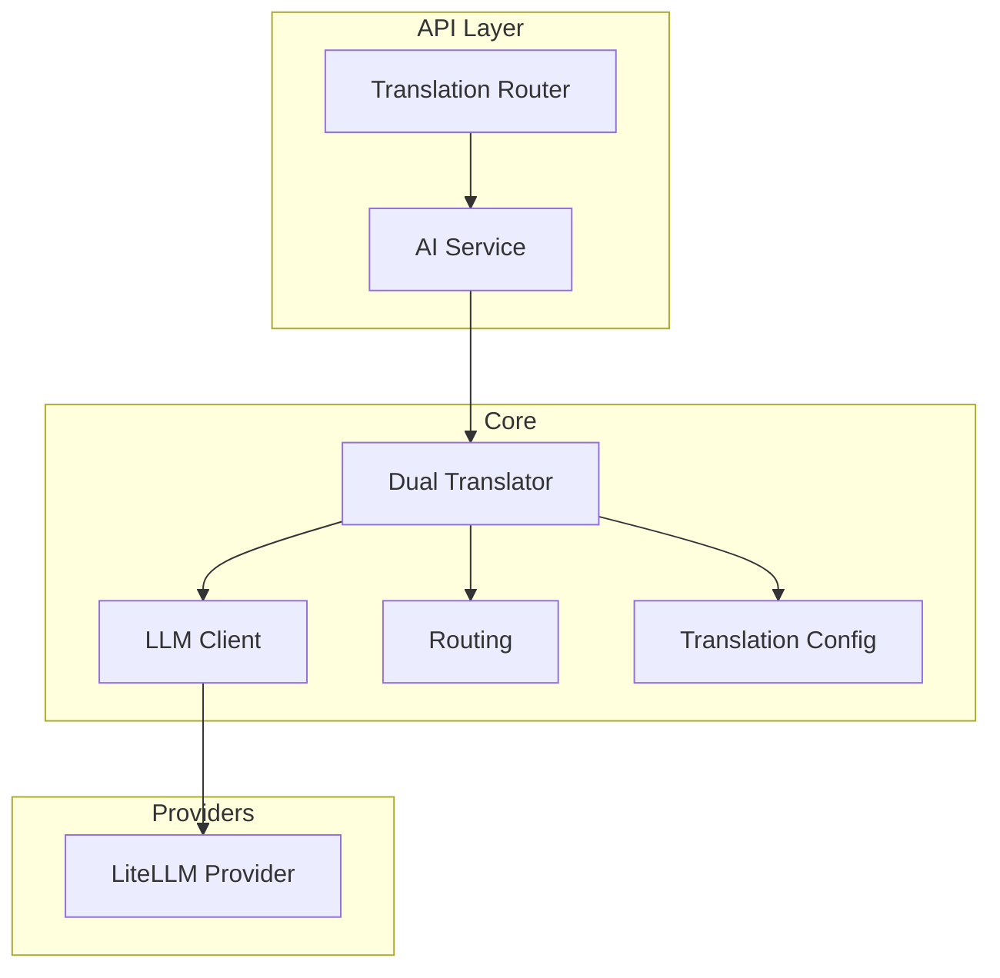
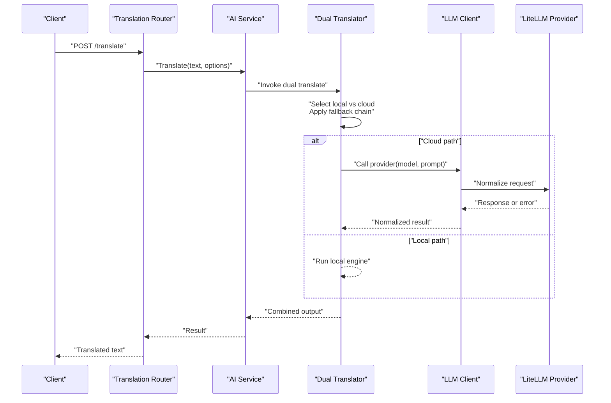
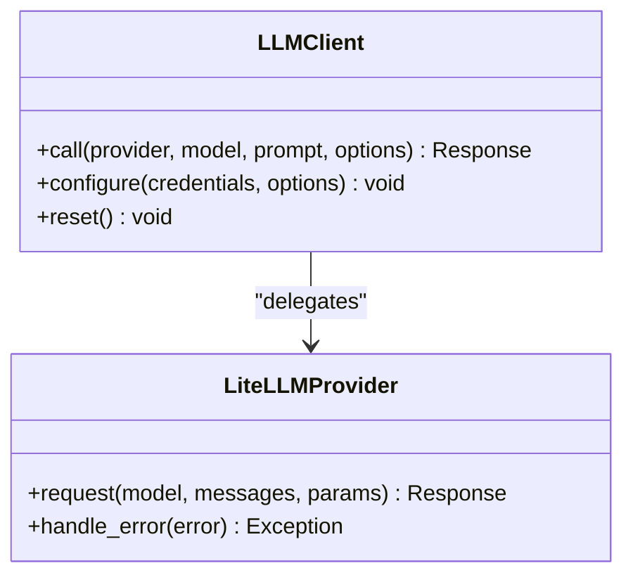
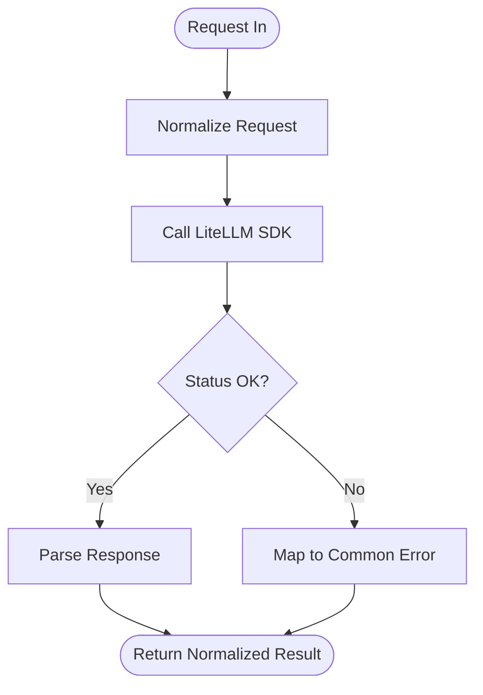
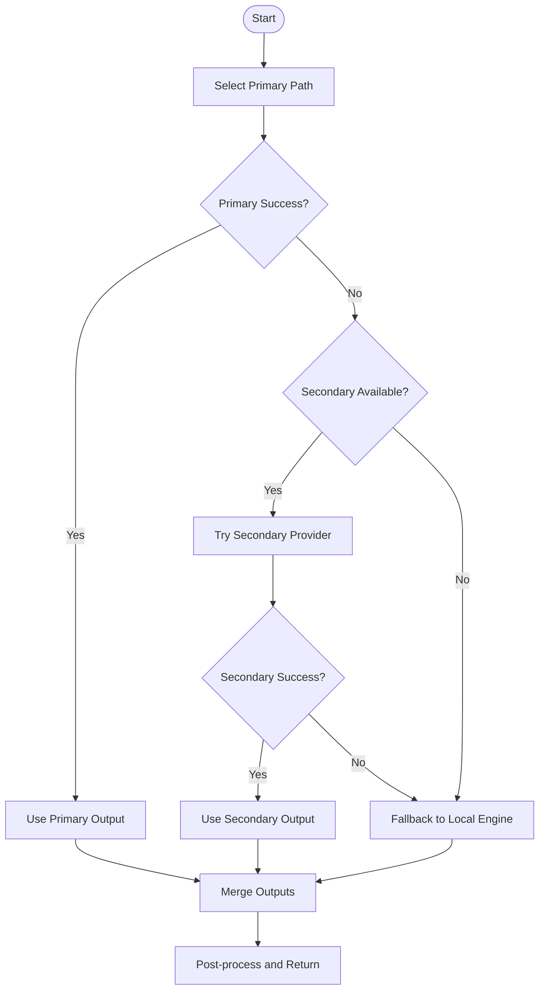
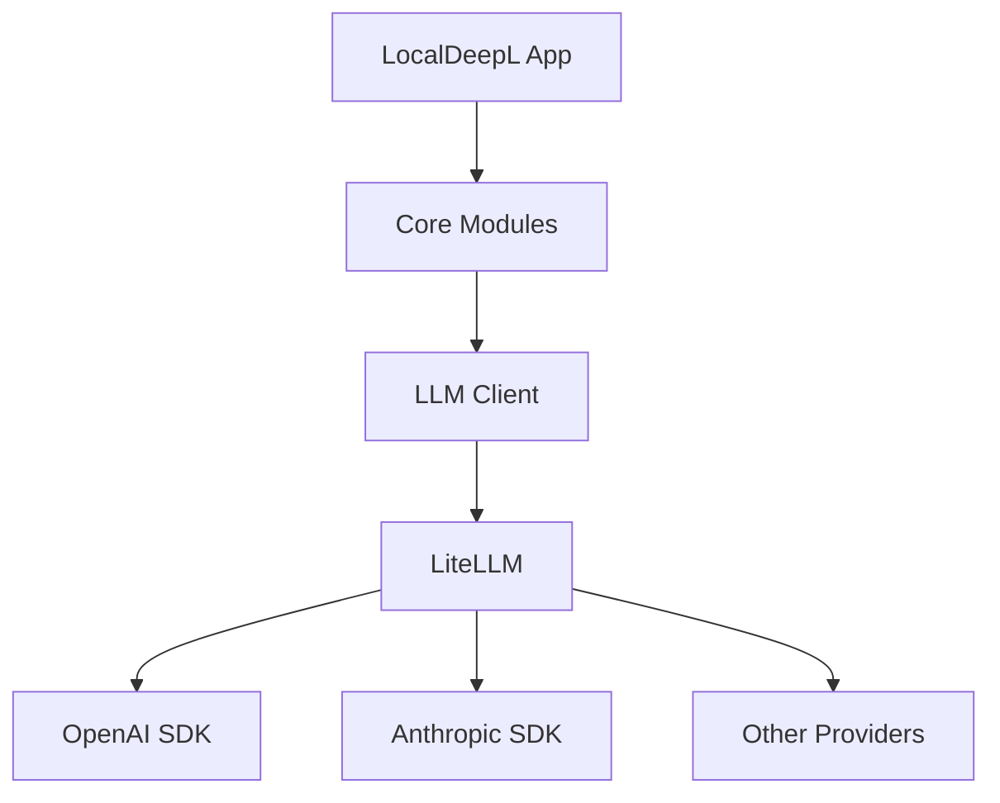

# Cloud API Integration

<cite>
**Referenced Files in This Document**
- [README.md](file://README.md)
- [ARCHITECTURE.md](file://ARCHITECTURE.md)
- [pyproject.toml](file://pyproject.toml)
- [src/local_deepl/core/llm_client.py](file://src/local_deepl/core/llm_client.py)
- [src/local_deepl/utils/litellm_provider.py](file://src/local_deepl/utils/litellm_provider.py)
- [src/local_deepl/core/dual_translator.py](file://src/local_deepl/core/dual_translator.py)
- [src/local_deepl/core/translation_config.py](file://src/local_deepl/core/translation_config.py)
- [src/local_deepl/core/routing.py](file://src/local_deepl/core/routing.py)
- [src/local_deepl/api/services/ai.py](file://src/local_deepl/api/services/ai.py)
- [src/local_deepl/api/routers/translation.py](file://src/local_deepl/api/routers/translation.py)
- [tests/test_litellm_provider.py](file://tests/test_litellm_provider.py)
</cite>

## Table of Contents
1. [Introduction](#introduction)
2. [Project Structure](#project-structure)
3. [Core Components](#core-components)
4. [Architecture Overview](#architecture-overview)
5. [Detailed Component Analysis](#detailed-component-analysis)
6. [Dependency Analysis](#dependency-analysis)
7. [Performance Considerations](#performance-considerations)
8. [Troubleshooting Guide](#troubleshooting-guide)
9. [Conclusion](#conclusion)
10. [Appendices](#appendices)

## Introduction
This document explains how LocalDeepL integrates with cloud-based translation APIs, including OpenAI GPT and Anthropic Claude, as well as other providers through a unified interface. It covers authentication methods, rate limiting, error handling, configuration examples, fallback strategies between local and cloud models, cost optimization, request batching, response caching, and the dual translator that combines local and cloud outputs for improved quality and resilience.

## Project Structure
LocalDeepL organizes cloud integrations under core modules and utilities:
- A provider abstraction layer for LLMs and translation services
- A LiteLLM-backed provider implementation to support multiple vendors
- A dual translator that orchestrates local and cloud models
- Configuration and routing for selecting providers and managing fallback chains
- API services and routers that expose translation endpoints using these components

**Diagram sources**
- [src/local_deepl/api/routers/translation.py](file://src/local_deepl/api/routers/translation.py)
- [src/local_deepl/api/services/ai.py](file://src/local_deepl/api/services/ai.py)
- [src/local_deepl/core/dual_translator.py](file://src/local_deepl/core/dual_translator.py)
- [src/local_deepl/core/llm_client.py](file://src/local_deepl/core/llm_client.py)
- [src/local_deepl/utils/litellm_provider.py](file://src/local_deepl/utils/litellm_provider.py)
- [src/local_deepl/core/routing.py](file://src/local_deepl/core/routing.py)
- [src/local_deepl/core/translation_config.py](file://src/local_deepl/core/translation_config.py)

**Section sources**
- [README.md](file://README.md)
- [ARCHITECTURE.md](file://ARCHITECTURE.md)

## Core Components
- Unified LLM client: abstracts calls to different providers (OpenAI, Anthropic, others) via a common interface.
- LiteLLM provider: leverages LiteLLM to normalize requests and responses across providers.
- Dual translator: coordinates local and cloud translations, applies fallback logic, and merges results.
- Translation config: centralizes provider settings, keys, timeouts, and model selection.
- Routing: selects appropriate provider or local engine based on context and policy.

Key responsibilities:
- Authentication: manage API keys and per-provider credentials securely.
- Rate limiting: enforce per-provider limits and backoff policies.
- Error handling: retry, circuit break, and fallback to local models when needed.
- Cost control: choose cheaper providers or models, batch requests, cache responses.

**Section sources**
- [src/local_deepl/core/llm_client.py](file://src/local_deepl/core/llm_client.py)
- [src/local_deepl/utils/litellm_provider.py](file://src/local_deepl/utils/litellm_provider.py)
- [src/local_deepl/core/dual_translator.py](file://src/local_deepl/core/dual_translator.py)
- [src/local_deepl/core/translation_config.py](file://src/local_deepl/core/translation_config.py)
- [src/local_deepl/core/routing.py](file://src/local_deepl/core/routing.py)

## Architecture Overview
The system exposes translation endpoints that route through an AI service to a dual translator. The dual translator decides whether to use local engines or cloud providers, applying fallback chains and merging outputs. The LLM client delegates to a LiteLLM provider for vendor-specific calls.

**Diagram sources**
- [src/local_deepl/api/routers/translation.py](file://src/local_deepl/api/routers/translation.py)
- [src/local_deepl/api/services/ai.py](file://src/local_deepl/api/services/ai.py)
- [src/local_deepl/core/dual_translator.py](file://src/local_deepl/core/dual_translator.py)
- [src/local_deepl/core/llm_client.py](file://src/local_deepl/core/llm_client.py)
- [src/local_deepl/utils/litellm_provider.py](file://src/local_deepl/utils/litellm_provider.py)

## Detailed Component Analysis

### Unified LLM Client
Responsibilities:
- Provide a consistent interface for calling cloud providers.
- Normalize prompts and responses.
- Surface errors consistently for upstream handling.

Design patterns:
- Strategy pattern for provider implementations.
- Retry/backoff wrappers around provider calls.

**Diagram sources**
- [src/local_deepl/core/llm_client.py](file://src/local_deepl/core/llm_client.py)
- [src/local_deepl/utils/litellm_provider.py](file://src/local_deepl/utils/litellm_provider.py)

**Section sources**
- [src/local_deepl/core/llm_client.py](file://src/local_deepl/core/llm_client.py)
- [src/local_deepl/utils/litellm_provider.py](file://src/local_deepl/utils/litellm_provider.py)

### LiteLLM Provider
Responsibilities:
- Translate normalized requests into provider-specific formats.
- Parse provider responses into a common structure.
- Handle provider-specific errors and status codes.

Integration points:
- Uses LiteLLM SDK to call OpenAI, Anthropic, and other compatible endpoints.
- Supports streaming and non-streaming modes.

**Diagram sources**
- [src/local_deepl/utils/litellm_provider.py](file://src/local_deepl/utils/litellm_provider.py)

**Section sources**
- [src/local_deepl/utils/litellm_provider.py](file://src/local_deepl/utils/litellm_provider.py)
- [tests/test_litellm_provider.py](file://tests/test_litellm_provider.py)

### Dual Translator
Responsibilities:
- Orchestrate local and cloud translations.
- Implement fallback chains (cloud -> local or vice versa).
- Merge outputs and apply post-processing.

Fallback strategy:
- Attempt primary provider; if it fails or is throttled, try secondary provider or local engine.
- Respect configured priorities and budgets.

**Diagram sources**
- [src/local_deepl/core/dual_translator.py](file://src/local_deepl/core/dual_translator.py)
- [src/local_deepl/core/routing.py](file://src/local_deepl/core/routing.py)

**Section sources**
- [src/local_deepl/core/dual_translator.py](file://src/local_deepl/core/dual_translator.py)
- [src/local_deepl/core/routing.py](file://src/local_deepl/core/routing.py)

### Translation Config
Responsibilities:
- Centralize provider configurations, API keys, model names, and runtime options.
- Validate required fields and defaults.
- Expose safe accessors for secrets.

Security considerations:
- Prefer environment variables or secret managers for API keys.
- Avoid logging sensitive values.

**Section sources**
- [src/local_deepl/core/translation_config.py](file://src/local_deepl/core/translation_config.py)

### API Services and Routers
Responsibilities:
- Expose REST endpoints for translation.
- Validate inputs and map to internal services.
- Stream responses where supported.

Integration:
- Router invokes AI service, which uses dual translator and underlying providers.

**Section sources**
- [src/local_deepl/api/routers/translation.py](file://src/local_deepl/api/routers/translation.py)
- [src/local_deepl/api/services/ai.py](file://src/local_deepl/api/services/ai.py)

## Dependency Analysis
External dependencies relevant to cloud integrations include LiteLLM and provider SDKs. These are declared in the project configuration.

**Diagram sources**
- [pyproject.toml](file://pyproject.toml)
- [src/local_deepl/core/llm_client.py](file://src/local_deepl/core/llm_client.py)
- [src/local_deepl/utils/litellm_provider.py](file://src/local_deepl/utils/litellm_provider.py)

**Section sources**
- [pyproject.toml](file://pyproject.toml)

## Performance Considerations
- Request batching: group small segments to reduce overhead when using cloud providers.
- Response caching: cache frequent or identical requests to avoid redundant calls and costs.
- Streaming: prefer streaming for long outputs to improve latency and user experience.
- Model selection: choose smaller or cheaper models for drafts and larger models for final passes.
- Circuit breaking: quickly fail over to local models when providers are degraded.

[No sources needed since this section provides general guidance]

## Troubleshooting Guide
Common issues and resolutions:
- Authentication failures: verify API keys and provider endpoints; ensure environment variables are set correctly.
- Rate limit errors: implement exponential backoff and queue retries; consider switching to a secondary provider or local fallback.
- Timeouts: adjust timeouts per provider and segment size; enable streaming for large outputs.
- Parsing errors: inspect normalized response structures and provider-specific error mappings.

Operational tips:
- Enable detailed logs for provider calls while masking secrets.
- Monitor provider health and latency metrics.
- Use tests to validate provider integration behavior.

**Section sources**
- [src/local_deepl/utils/litellm_provider.py](file://src/local_deepl/utils/litellm_provider.py)
- [tests/test_litellm_provider.py](file://tests/test_litellm_provider.py)

## Conclusion
LocalDeepL’s cloud API integration provides a robust, extensible foundation for combining local and cloud translation capabilities. Through a unified client, LiteLLM-backed provider, dual translator orchestration, and centralized configuration, it supports reliable fallbacks, cost-conscious choices, and high-quality outputs. Adopting batching, caching, and streaming further improves performance and reduces costs.

[No sources needed since this section summarizes without analyzing specific files]

## Appendices

### Configuration Examples
- OpenAI GPT:
  - Set provider name, model identifier, and API key via environment variables or secure secret store.
  - Configure timeout and max tokens to balance speed and quality.
- Anthropic Claude:
  - Set provider name, model identifier, and API key similarly.
  - Adjust temperature and top_p for creativity versus determinism.
- Other providers:
  - Follow the same pattern: provider name, model, and credentials.
  - Ensure compatibility with the LiteLLM endpoint format.

[No sources needed since this section provides general guidance]

### Fallback Chain Patterns
- Cloud-first:
  - Primary: OpenAI GPT
  - Secondary: Anthropic Claude
  - Fallback: Local engine
- Local-first:
  - Primary: Local engine
  - Fallback: Cloud provider(s) for difficult segments

[No sources needed since this section provides general guidance]

### Cost Optimization Strategies
- Use smaller models for preflight and draft translations.
- Cache repeated segments and glossary terms.
- Batch short segments to amortize overhead.
- Route low-priority jobs to cheaper providers.

[No sources needed since this section provides general guidance]