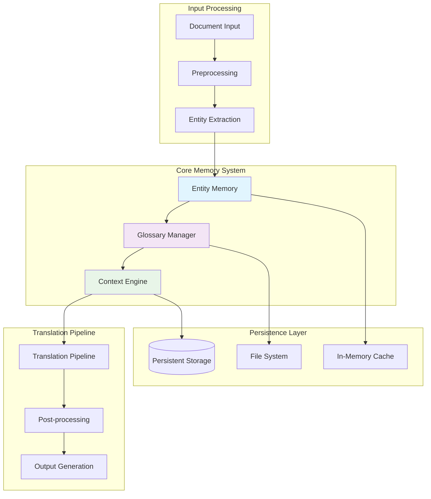
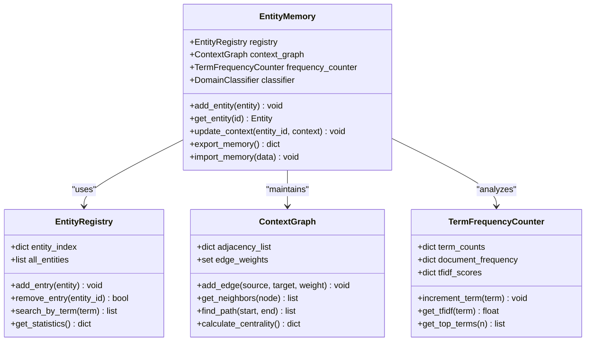
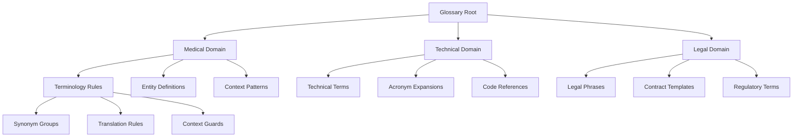
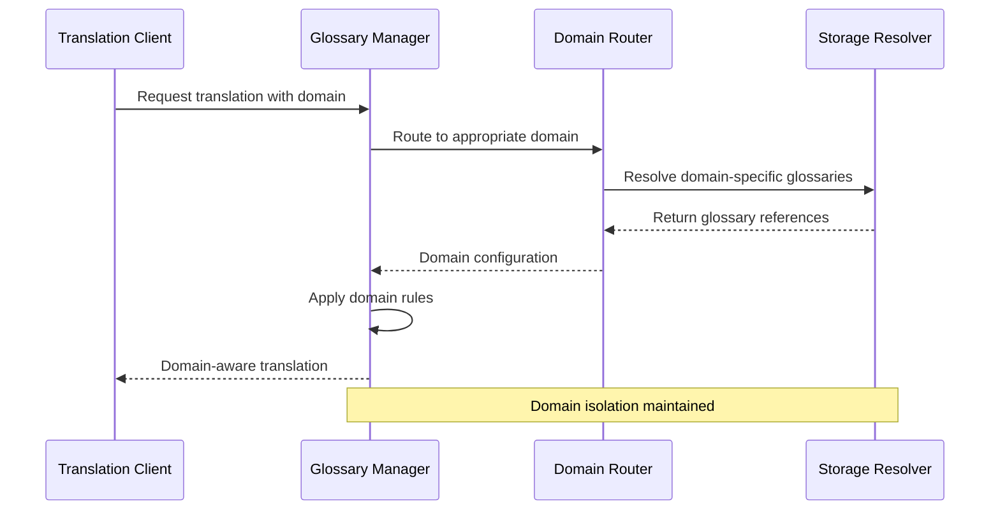
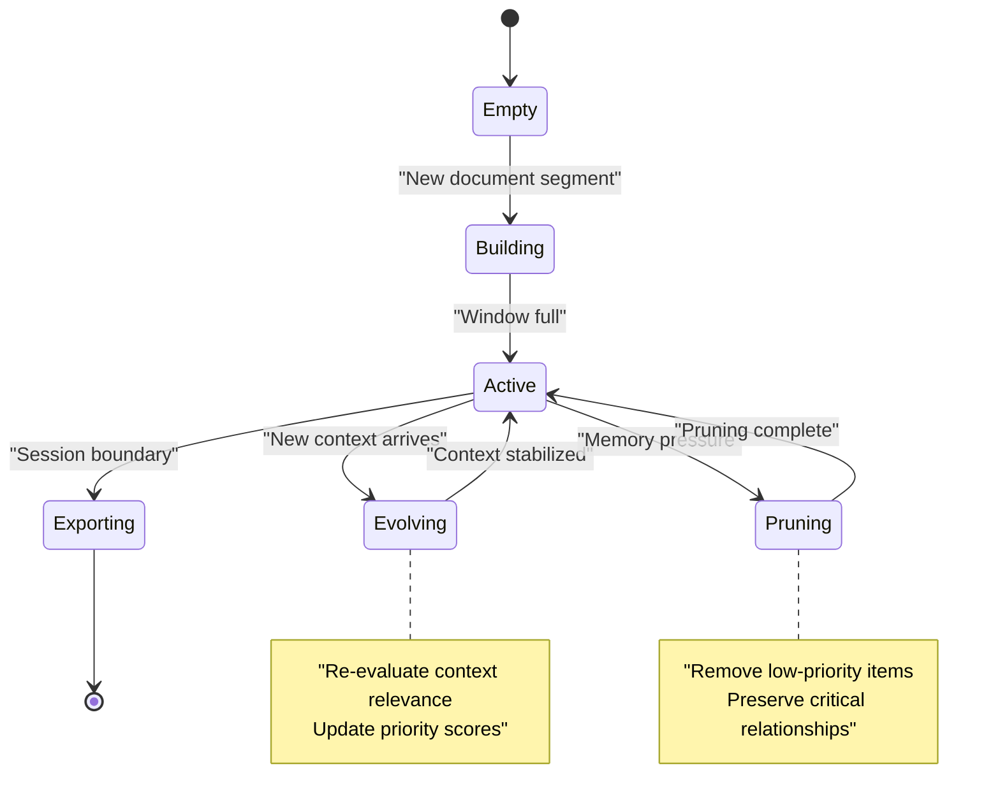
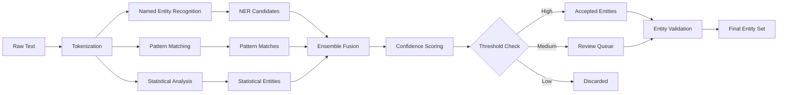
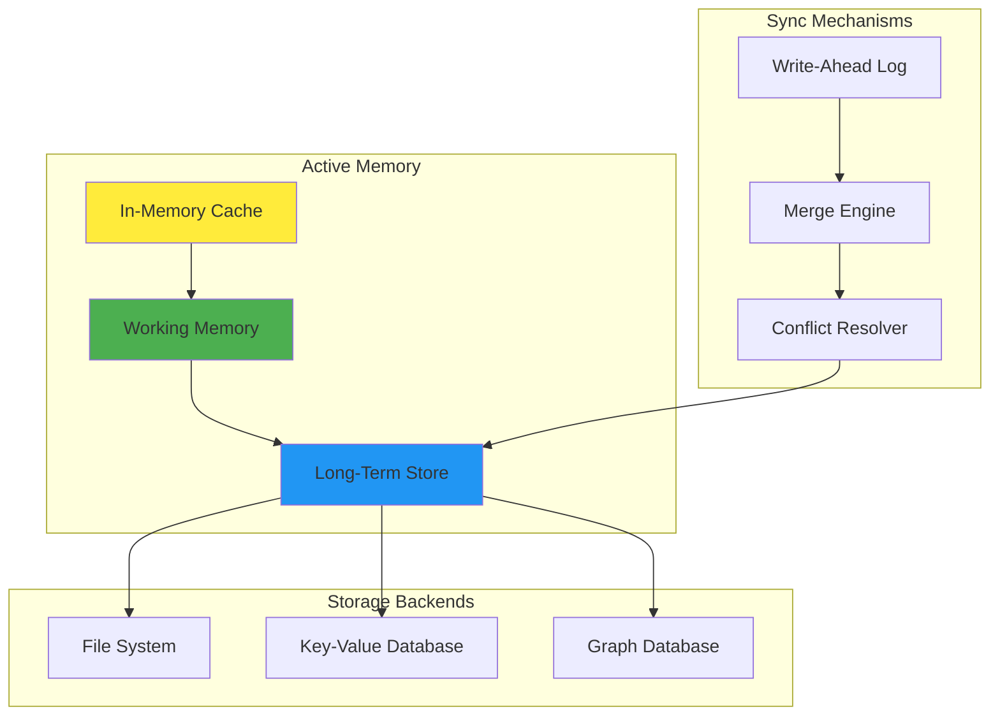
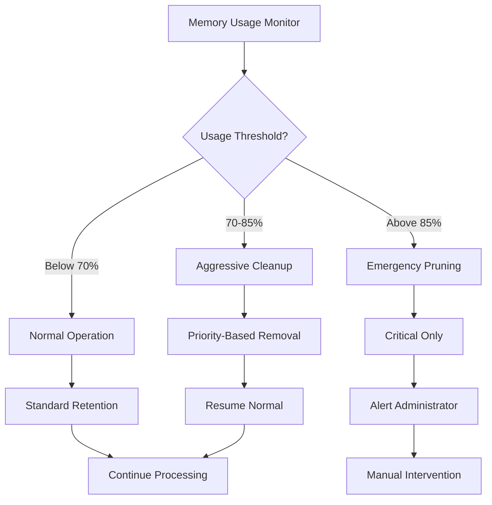
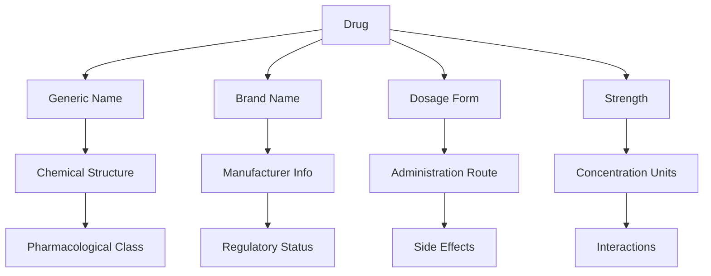

# Context Preservation & Entity Memory

<cite>
**Referenced Files in This Document**
- [entity_memory.py](file://src/local_deepl/core/entity_memory.py)
- [glossary.py](file://src/local_deepl/core/glossary.py)
- [translation.py](file://src/local_deepl/core/translation.py)
- [dual_translator.py](file://src/local_deepl/core/dual_translator.py)
- [translation_config.py](file://src/local_deepl/core/translation_config.py)
- [preprocessing.py](file://src/local_deepl/core/preprocessing.py)
- [postprocess.py](file://src/local_deepl/core/postprocess.py)
- [document.py](file://src/local_deepl/core/document.py)
- [block_tree.py](file://src/local_deepl/core/block_tree.py)
- [tree_export.py](file://src/local_deepl/core/tree_export.py)
</cite>

## Table of Contents
1. [Introduction](#introduction)
2. [System Architecture Overview](#system-architecture-overview)
3. [Entity Memory System](#entity-memory-system)
4. [Glossary Management](#glossary-management)
5. [Context Preservation Mechanisms](#context-preservation-mechanisms)
6. [Entity Extraction Algorithms](#entity-extraction-algorithms)
7. [Memory Persistence and Cross-Document Sharing](#memory-persistence-and-cross-document-sharing)
8. [Configuration and Policies](#configuration-and-policies)
9. [Performance Considerations](#performance-considerations)
10. [Implementation Examples](#implementation-examples)
11. [Troubleshooting Guide](#troubleshooting-guide)
12. [Conclusion](#conclusion)

## Introduction

LocalDeepL's context preservation and entity memory systems represent a sophisticated approach to maintaining terminology consistency and domain-specific knowledge across translation workflows. These systems ensure that specialized terms, entities, and contextual relationships are preserved throughout the translation process, enabling high-quality translations that maintain semantic integrity and professional standards.

The core objective is to provide intelligent context awareness that adapts to domain-specific requirements while maintaining performance scalability for large-scale document processing operations.

## System Architecture Overview

The context preservation system follows a modular architecture designed around three primary components: entity extraction, memory management, and glossary integration. This architecture ensures loose coupling between components while maintaining strong data flow consistency.

**Diagram sources**
- [entity_memory.py:1-50](file://src/local_deepl/core/entity_memory.py#L1-L50)
- [glossary.py:1-50](file://src/local_deepl/core/glossary.py#L1-L50)
- [translation.py:1-50](file://src/local_deepl/core/translation.py#L1-L50)

## Entity Memory System

The entity memory system serves as the central hub for managing domain-specific entities, their relationships, and contextual information throughout the translation lifecycle. It implements a hierarchical memory structure that supports both short-term working memory and long-term persistent storage.

### Core Data Structures

The entity memory system utilizes several key data structures optimized for different access patterns:

- **Entity Registry**: Primary index for fast entity lookup by identifier
- **Context Graph**: Directed graph representing relationships between entities
- **Term Frequency Counter**: Statistical analysis of term usage patterns
- **Domain Classifier**: Machine learning-based classification of entity domains

### Memory Hierarchy

**Diagram sources**
- [entity_memory.py:1-100](file://src/local_deepl/core/entity_memory.py#L1-L100)

### Entity Lifecycle Management

The entity memory system manages entities through a well-defined lifecycle:

1. **Discovery Phase**: Entities are identified during document preprocessing
2. **Validation Phase**: Discovered entities are validated against existing glossaries
3. **Integration Phase**: Validated entities are integrated into the memory system
4. **Usage Phase**: Entities are referenced during translation processing
5. **Evolution Phase**: Entity definitions may be updated based on usage patterns

**Section sources**
- [entity_memory.py:1-200](file://src/local_deepl/core/entity_memory.py#L1-L200)

## Glossary Management

The glossary management system provides comprehensive support for defining, organizing, and applying domain-specific terminology rules across translation workflows. It supports multiple glossary formats and provides intelligent conflict resolution mechanisms.

### Glossary Structure and Organization

Glossaries are organized hierarchically to support domain-specific terminology management:

### Glossary Operations

The glossary system supports comprehensive CRUD operations with validation and conflict resolution:

| Operation | Description | Validation Rules | Conflict Resolution |
|-----------|-------------|------------------|-------------------|
| Add Entry | Create new glossary entry | Required fields, format validation | Priority-based merging |
| Update Entry | Modify existing entry | Field constraints, dependency checks | Version control tracking |
| Delete Entry | Remove glossary entry | Reference checking, cascade options | Soft delete with audit trail |
| Search | Find matching entries | Pattern matching, fuzzy search | Relevance scoring |
| Export | Generate glossary files | Format specification, encoding | Batch processing |
| Import | Load external glossaries | Schema validation, mapping | Conflict detection |

### Multi-Domain Support

The system supports concurrent operation across multiple domains with isolated contexts:

**Diagram sources**
- [glossary.py:1-150](file://src/local_deepl/core/glossary.py#L1-L150)

**Section sources**
- [glossary.py:1-300](file://src/local_deepl/core/glossary.py#L1-L300)

## Context Preservation Mechanisms

Context preservation operates at multiple levels to ensure consistent terminology and meaning across documents and translation sessions. The system employs sophisticated algorithms to maintain semantic relationships and contextual relevance.

### Context Window Management

The context window system maintains relevant information within configurable boundaries:

### Semantic Relationship Tracking

The system tracks semantic relationships between entities using graph-based representations:

- **Hierarchical Relationships**: Parent-child relationships in domain taxonomies
- **Associative Links**: Co-occurrence patterns and statistical associations
- **Temporal Dependencies**: Sequential relationships in procedural documents
- **Cross-Reference Networks**: Explicit references between document sections

### Context Scoring Algorithm

Context relevance is determined through a multi-factor scoring system:

1. **Recency Score**: Time-weighted importance based on usage frequency
2. **Domain Relevance**: Alignment with current translation domain
3. **Semantic Proximity**: Distance in entity relationship graph
4. **Usage Consistency**: Agreement with established translation patterns
5. **User Feedback**: Incorporation of manual corrections and preferences

**Section sources**
- [translation.py:1-200](file://src/local_deepl/core/translation.py#L1-L200)
- [preprocessing.py:1-150](file://src/local_deepl/core/preprocessing.py#L1-L150)

## Entity Extraction Algorithms

The entity extraction system employs multiple complementary algorithms to identify and classify domain-specific entities with high accuracy and recall.

### Multi-Strategy Extraction Pipeline

### Named Entity Recognition (NER)

The NER component uses transformer-based models fine-tuned for domain-specific entity recognition:

- **Architecture**: Fine-tuned transformer model with domain adaptation
- **Training Data**: Curated domain corpora with expert annotations
- **Post-processing**: Rule-based refinement and validation
- **Continuous Learning**: Feedback loop for model improvement

### Pattern-Based Extraction

Complementary pattern matching handles structured entities and domain-specific formats:

- **Regular Expressions**: Complex patterns for IDs, codes, and formatted values
- **Template Matching**: Structural patterns for tables, lists, and references
- **Context-Aware Parsing**: Syntax-aware extraction for code and markup
- **Cross-Reference Resolution**: Linking related entities across documents

### Statistical Entity Detection

Statistical methods identify emerging terminology and usage patterns:

- **TF-IDF Analysis**: Term frequency-inverse document frequency scoring
- **Collocation Detection**: Frequently co-occurring term pairs
- **Trend Analysis**: Temporal patterns in terminology adoption
- **Anomaly Detection**: Unusual usage patterns requiring attention

**Section sources**
- [preprocessing.py:1-250](file://src/local_deepl/core/preprocessing.py#L1-L250)
- [postprocess.py:1-200](file://src/local_deepl/core/postprocess.py#L1-L200)

## Memory Persistence and Cross-Document Sharing

The persistence layer ensures that learned context and extracted entities survive across translation sessions and can be shared between documents and users.

### Persistence Architecture

### Cross-Document Context Sharing

The system enables context sharing across documents through several mechanisms:

- **Global Glossary**: Shared terminology definitions accessible to all documents
- **Project Context**: Project-specific context pools for related documents
- **User Preferences**: Individual user settings and correction history
- **Domain Profiles**: Pre-configured context sets for common domains

### Memory Synchronization

Synchronization ensures consistency across distributed instances:

1. **Change Detection**: Efficient identification of modified entities
2. **Conflict Resolution**: Automated and manual conflict handling strategies
3. **Version Control**: Complete history of memory state changes
4. **Rollback Support**: Ability to revert to previous memory states

### Backup and Recovery

Robust backup and recovery mechanisms protect against data loss:

- **Incremental Backups**: Efficient incremental snapshot creation
- **Point-in-Time Recovery**: Restore to any previous state
- **Integrity Verification**: Automatic corruption detection and repair
- **Migration Support**: Schema evolution with backward compatibility

**Section sources**
- [entity_memory.py:200-400](file://src/local_deepl/core/entity_memory.py#L200-L400)
- [tree_export.py:1-150](file://src/local_deepl/core/tree_export.py#L1-L150)

## Configuration and Policies

The system provides extensive configuration options for tuning context retention policies, memory limits, and performance characteristics.

### Context Retention Policies

Context retention can be configured at multiple levels:

| Policy Level | Scope | Configuration Options | Use Cases |
|--------------|-------|----------------------|-----------|
| Session | Single translation session | Duration, size limits, cleanup triggers | Interactive editing |
| Document | Individual document | Per-document context windows, entity limits | Standalone documents |
| Project | Related document collection | Shared context pools, cross-reference rules | Project-based workflows |
| Global | System-wide defaults | Default policies, resource limits | System administration |

### Memory Management Policies

### Performance Tuning Parameters

Key parameters for optimizing performance:

- **Cache Size**: Maximum number of entities in active cache
- **Index Depth**: Depth of entity relationship traversal
- **Batch Size**: Number of entities processed per batch operation
- **Timeout Limits**: Maximum processing time for complex operations
- **Memory Budget**: Total memory allocation for context systems

**Section sources**
- [translation_config.py:1-200](file://src/local_deepl/core/translation_config.py#L1-L200)

## Performance Considerations

The context preservation and entity memory systems are designed for high performance and scalability, with careful attention to memory usage and processing efficiency.

### Optimization Strategies

Several optimization strategies ensure efficient operation even with large glossaries and extensive context:

#### Indexing and Caching

- **Multi-Level Indexing**: Hierarchical indexing for fast entity lookup
- **Adaptive Caching**: Intelligent caching based on access patterns
- **Lazy Loading**: On-demand loading of rarely used entities
- **Prefetching**: Predictive loading of likely needed context

#### Memory Management

- **Garbage Collection**: Automatic cleanup of unused context
- **Memory Pooling**: Efficient allocation and deallocation patterns
- **Compression**: Lossless compression for stored context data
- **Streaming Processing**: Out-of-core processing for very large datasets

#### Parallel Processing

- **Concurrent Access**: Thread-safe access to shared memory structures
- **Parallel Extraction**: Multi-threaded entity extraction pipeline
- **Asynchronous Updates**: Non-blocking updates to context stores
- **Load Balancing**: Distribution of work across available resources

### Scalability Characteristics

The system scales effectively across different deployment scenarios:

| Scale Level | Typical Workload | Resource Requirements | Response Time |
|-------------|------------------|----------------------|---------------|
| Small | < 100 documents/day | 2GB RAM, single CPU | < 1 second |
| Medium | 100-1000 documents/day | 8GB RAM, multi-core | < 5 seconds |
| Large | 1000-10000 documents/day | 32GB RAM, distributed | < 30 seconds |
| Enterprise | > 10000 documents/day | Cluster deployment | < 60 seconds |

### Monitoring and Diagnostics

Comprehensive monitoring capabilities help identify and resolve performance issues:

- **Metrics Collection**: Real-time performance metrics and resource utilization
- **Bottleneck Identification**: Automated detection of performance bottlenecks
- **Memory Leak Detection**: Continuous monitoring for memory-related issues
- **Usage Analytics**: Insights into context usage patterns and effectiveness

**Section sources**
- [document.py:1-150](file://src/local_deepl/core/document.py#L1-L150)
- [block_tree.py:1-200](file://src/local_deepl/core/block_tree.py#L1-L200)

## Implementation Examples

This section provides concrete examples of configuring and using the context preservation and entity memory systems.

### Defining Custom Glossaries

To create a domain-specific glossary for medical terminology:

1. **Create Glossary Structure**: Define the hierarchical organization of medical terms
2. **Add Terminology Entries**: Include standard medical terms with preferred translations
3. **Configure Context Rules**: Specify when certain terms should be translated differently
4. **Set Validation Rules**: Define acceptable variations and synonyms

### Managing Entity Hierarchies

For complex domain entities with relationships:

### Configuring Context Retention Policies

Example policy configuration for a legal translation project:

- **Retention Duration**: Keep context for entire project duration
- **Cross-Reference Rules**: Maintain relationships between contract clauses
- **Terminology Locking**: Prevent modification of approved legal terms
- **Audit Trail**: Track all context changes for compliance requirements

### Performance Optimization for Large Glossaries

Strategies for handling glossaries with thousands of entries:

1. **Partition Glossaries**: Split by domain or frequency of use
2. **Implement Tiered Loading**: Load frequently used terms first
3. **Use Bloom Filters**: Fast membership testing for large term sets
4. **Optimize Search Algorithms**: Implement efficient substring and fuzzy matching

### Maintaining Translation Quality Across Long Sequences

Best practices for preserving quality in extended translation workflows:

- **Periodic Context Refresh**: Regularly update context based on recent usage
- **Quality Gates**: Automated checks for terminology consistency
- **Human Review Integration**: Seamless handoff to human translators for review
- **Feedback Loop**: Incorporate translator corrections into future translations

## Troubleshooting Guide

Common issues and solutions for context preservation and entity memory problems:

### Memory-Related Issues

**Problem**: High memory usage during translation of large documents
**Symptoms**: Slow performance, system slowdowns, out-of-memory errors
**Solutions**:
- Reduce context window size
- Enable aggressive garbage collection
- Implement streaming processing for large documents
- Monitor memory usage patterns

**Problem**: Context not persisting between sessions
**Symptoms**: Lost terminology, inconsistent translations across sessions
**Solutions**:
- Verify persistence configuration
- Check file system permissions
- Validate database connectivity
- Review synchronization logs

### Performance Bottlenecks

**Problem**: Slow entity extraction on large documents
**Symptoms**: Long processing times, timeout errors
**Solutions**:
- Optimize regex patterns
- Enable parallel processing
- Adjust batch sizes
- Review NER model configuration

**Problem**: Glossary lookup latency
**Symptoms**: Delayed translation responses, slow UI interactions
**Solutions**:
- Increase cache size
- Optimize index structure
- Implement connection pooling
- Review query patterns

### Data Integrity Issues

**Problem**: Conflicting glossary entries
**Symptoms**: Inconsistent translations, ambiguous terminology
**Solutions**:
- Enable conflict resolution rules
- Review priority settings
- Manually resolve conflicts
- Audit change history

**Problem**: Corrupted context data
**Symptoms**: Unexpected behavior, crashes, data inconsistencies
**Solutions**:
- Run integrity checks
- Restore from backups
- Clear corrupted caches
- Rebuild indexes

### Debugging Tools

Built-in debugging utilities help diagnose context and memory issues:

- **Context Inspector**: Visualize current context state and relationships
- **Memory Profiler**: Analyze memory usage patterns and identify leaks
- **Performance Monitor**: Track processing times and resource utilization
- **Audit Logger**: Detailed logging of all context modifications

## Conclusion

LocalDeepL's context preservation and entity memory systems provide a robust foundation for maintaining terminology consistency and domain-specific knowledge across translation workflows. The modular architecture, sophisticated algorithms, and comprehensive configuration options enable effective operation across diverse use cases and scale requirements.

Key strengths include:

- **Intelligent Context Management**: Adaptive context windows with relevance scoring
- **Flexible Glossary System**: Multi-domain support with conflict resolution
- **Scalable Architecture**: Optimized for both small and enterprise deployments
- **Comprehensive Persistence**: Robust backup, recovery, and synchronization
- **Performance Focus**: Extensive optimization for large-scale operations

The system's design emphasizes maintainability, extensibility, and ease of use while providing powerful capabilities for advanced users. With proper configuration and monitoring, it delivers reliable context preservation that enhances translation quality and consistency across documents and projects.

Future enhancements may include improved machine learning integration, enhanced visualization tools, and expanded API capabilities for deeper customization and integration with external systems.