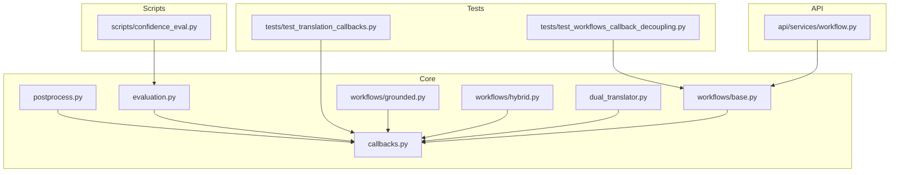
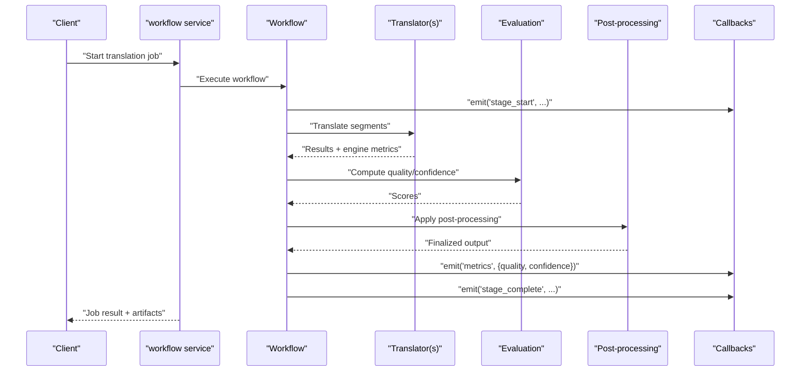
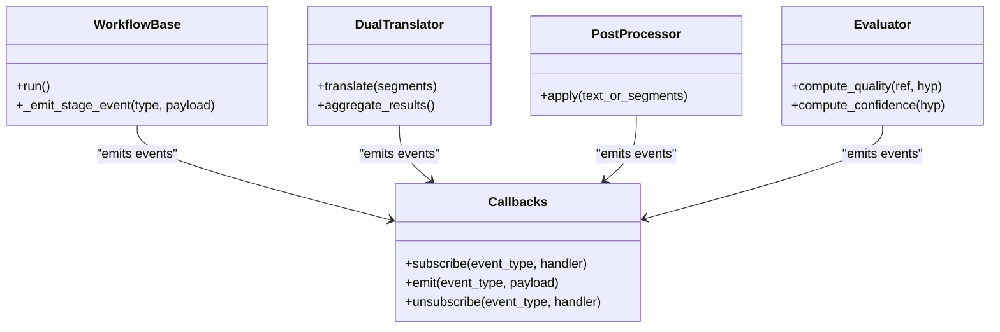
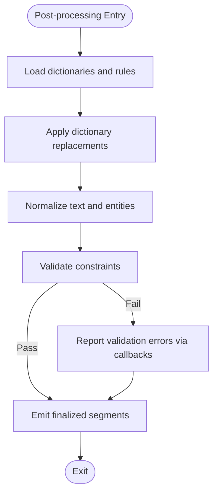
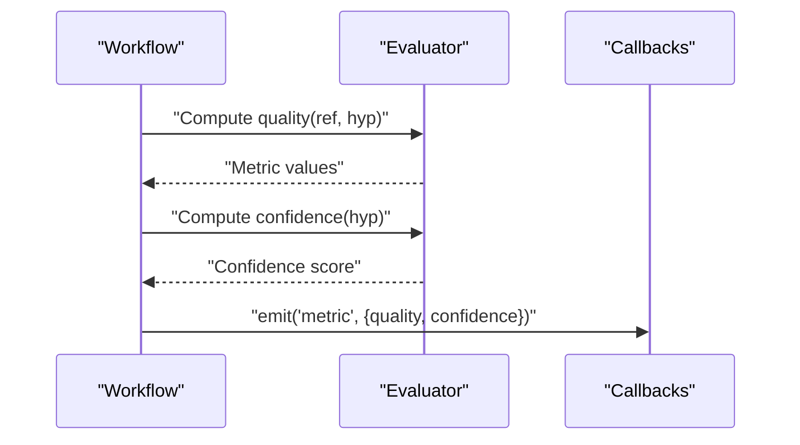
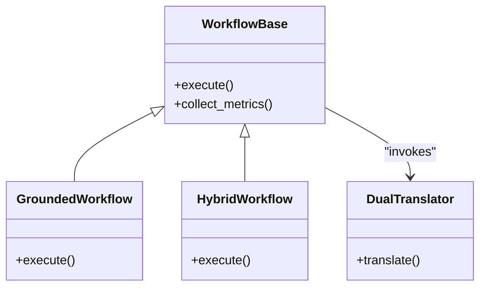
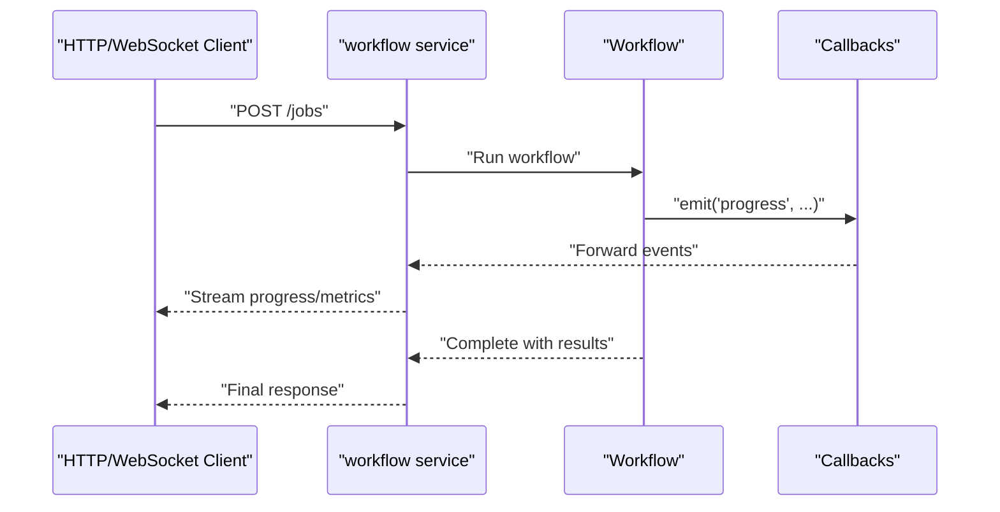
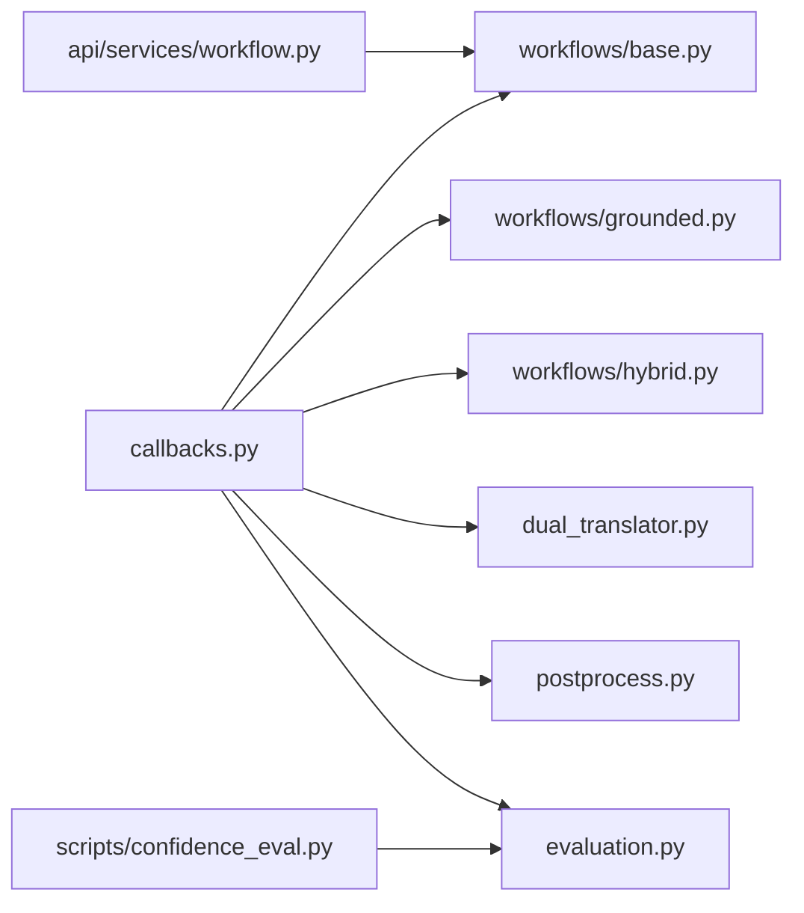

# Quality Assessment & Callbacks

<cite>
**Referenced Files in This Document**
- [src/local_deepl/core/callbacks.py](file://src/local_deepl/core/callbacks.py)
- [src/local_deepl/core/postprocess.py](file://src/local_deepl/core/postprocess.py)
- [src/local_deepl/core/evaluation.py](file://src/local_deepl/core/evaluation.py)
- [src/local_deepl/core/workflows/base.py](file://src/local_deepl/core/workflows/base.py)
- [src/local_deepl/core/workflows/grounded.py](file://src/local_deepl/core/workflows/grounded.py)
- [src/local_deepl/core/workflows/hybrid.py](file://src/local_deepl/core/workflows/hybrid.py)
- [src/local_deepl/core/dual_translator.py](file://src/local_deepl/core/dual_translator.py)
- [src/local_deepl/api/services/workflow.py](file://src/local_deepl/api/services/workflow.py)
- [scripts/confidence_eval.py](file://scripts/confidence_eval.py)
- [tests/test_translation_callbacks.py](file://tests/test_translation_callbacks.py)
- [tests/test_workflows_callback_decoupling.py](file://tests/test_workflows_callback_decoupling.py)
</cite>

## Table of Contents
1. [Introduction](#introduction)
2. [Project Structure](#project-structure)
3. [Core Components](#core-components)
4. [Architecture Overview](#architecture-overview)
5. [Detailed Component Analysis](#detailed-component-analysis)
6. [Dependency Analysis](#dependency-analysis)
7. [Performance Considerations](#performance-considerations)
8. [Troubleshooting Guide](#troubleshooting-guide)
9. [Conclusion](#conclusion)
10. [Appendices](#appendices)

## Introduction
This document explains LocalDeepL’s translation quality assessment and callback systems. It covers the post-processing pipeline, quality scoring mechanisms, confidence metrics, and the callback architecture for integrating custom checks, logging, and monitoring. It also provides guidance on implementing custom post-processors, configuring quality thresholds, setting up automated quality gates, validation strategies, error detection patterns, performance impact considerations, and building custom evaluation pipelines.

## Project Structure
Quality assessment and callbacks are implemented across core modules and workflows:
- Callbacks define a pluggable interface used by workflows and translators to report events and results.
- Post-processing applies dictionary-based and other transformations to translations.
- Evaluation utilities compute quality metrics and confidence scores.
- Workflows orchestrate OCR, translation, alignment, and post-processing while invoking callbacks at key steps.
- API services wire workflow execution into HTTP endpoints and expose progress/events via callbacks.

**Diagram sources**
- [src/local_deepl/core/callbacks.py](file://src/local_deepl/core/callbacks.py)
- [src/local_deepl/core/postprocess.py](file://src/local_deepl/core/postprocess.py)
- [src/local_deepl/core/evaluation.py](file://src/local_deepl/core/evaluation.py)
- [src/local_deepl/core/workflows/base.py](file://src/local_deepl/core/workflows/base.py)
- [src/local_deepl/core/workflows/grounded.py](file://src/local_deepl/core/workflows/grounded.py)
- [src/local_deepl/core/workflows/hybrid.py](file://src/local_deepl/core/workflows/hybrid.py)
- [src/local_deepl/core/dual_translator.py](file://src/local_deepl/core/dual_translator.py)
- [src/local_deepl/api/services/workflow.py](file://src/local_deepl/api/services/workflow.py)
- [scripts/confidence_eval.py](file://scripts/confidence_eval.py)
- [tests/test_translation_callbacks.py](file://tests/test_translation_callbacks.py)
- [tests/test_workflows_callback_decoupling.py](file://tests/test_workflows_callback_decoupling.py)

**Section sources**
- [src/local_deepl/core/callbacks.py](file://src/local_deepl/core/callbacks.py)
- [src/local_deepl/core/postprocess.py](file://src/local_deepl/core/postprocess.py)
- [src/local_deepl/core/evaluation.py](file://src/local_deepl/core/evaluation.py)
- [src/local_deepl/core/workflows/base.py](file://src/local_deepl/core/workflows/base.py)
- [src/local_deepl/core/workflows/grounded.py](file://src/local_deepl/core/workflows/grounded.py)
- [src/local_deepl/core/workflows/hybrid.py](file://src/local_deepl/core/workflows/hybrid.py)
- [src/local_deepl/core/dual_translator.py](file://src/local_deepl/core/dual_translator.py)
- [src/local_deepl/api/services/workflow.py](file://src/local_deepl/api/services/workflow.py)
- [scripts/confidence_eval.py](file://scripts/confidence_eval.py)
- [tests/test_translation_callbacks.py](file://tests/test_translation_callbacks.py)
- [tests/test_workflows_callback_decoupling.py](file://tests/test_workflows_callback_decoupling.py)

## Core Components
- Callbacks: A decoupled eventing mechanism that allows workflows, translators, and post-processors to emit structured events (start, progress, result, error, metric). Consumers can subscribe to these events to implement logging, monitoring, or gating logic.
- Post-processing: Applies deterministic transformations to translated content (for example, dictionary lookups and normalization), with optional side effects reported through callbacks.
- Evaluation: Provides functions to compute quality metrics and confidence scores from translations and references, emitting metrics via callbacks when appropriate.
- Workflows: Orchestrate multi-step translation pipelines (OCR, grounding, hybrid strategies), invoking callbacks at each stage and aggregating results.
- Dual Translator: Coordinates multiple translation engines and may use callbacks to report per-engine outcomes and aggregated confidence.

Key responsibilities:
- Emit standardized events for lifecycle and metrics.
- Allow external integrations without changing core logic.
- Provide hooks for custom quality checks and automated gates.

**Section sources**
- [src/local_deepl/core/callbacks.py](file://src/local_deepl/core/callbacks.py)
- [src/local_deepl/core/postprocess.py](file://src/local_deepl/core/postprocess.py)
- [src/local_deepl/core/evaluation.py](file://src/local_deepl/core/evaluation.py)
- [src/local_deepl/core/workflows/base.py](file://src/local_deepl/core/workflows/base.py)
- [src/local_deepl/core/workflows/grounded.py](file://src/local_deepl/core/workflows/grounded.py)
- [src/local_deepl/core/workflows/hybrid.py](file://src/local_deepl/core/workflows/hybrid.py)
- [src/local_deepl/core/dual_translator.py](file://src/local_deepl/core/dual_translator.py)

## Architecture Overview
The quality assessment and callback system is designed around an event-driven architecture:
- Orchestrators (workflows, dual translator) call into processing stages.
- Each stage emits callback events describing inputs, outputs, and metrics.
- Post-processing and evaluation components consume and produce data while reporting their own events.
- API services integrate with workflows and forward events to clients (for example, via websockets or job status updates).

**Diagram sources**
- [src/local_deepl/api/services/workflow.py](file://src/local_deepl/api/services/workflow.py)
- [src/local_deepl/core/workflows/base.py](file://src/local_deepl/core/workflows/base.py)
- [src/local_deepl/core/dual_translator.py](file://src/local_deepl/core/dual_translator.py)
- [src/local_deepl/core/evaluation.py](file://src/local_deepl/core/evaluation.py)
- [src/local_deepl/core/postprocess.py](file://src/local_deepl/core/postprocess.py)
- [src/local_deepl/core/callbacks.py](file://src/local_deepl/core/callbacks.py)

## Detailed Component Analysis

### Callbacks Interface and Usage
The callbacks module defines a consistent event contract used throughout the system. Events typically include:
- Event type identifiers (for example, start, progress, complete, error, metric).
- Contextual metadata (job id, segment id, stage name).
- Payloads such as partial results, metrics, or errors.

Workflows and translators subscribe to and emit these events to decouple processing from observability and gating logic. Tests demonstrate how to attach listeners and assert emitted events.

**Diagram sources**
- [src/local_deepl/core/callbacks.py](file://src/local_deepl/core/callbacks.py)
- [src/local_deepl/core/workflows/base.py](file://src/local_deepl/core/workflows/base.py)
- [src/local_deepl/core/dual_translator.py](file://src/local_deepl/core/dual_translator.py)
- [src/local_deepl/core/postprocess.py](file://src/local_deepl/core/postprocess.py)
- [src/local_deepl/core/evaluation.py](file://src/local_deepl/core/evaluation.py)

**Section sources**
- [src/local_deepl/core/callbacks.py](file://src/local_deepl/core/callbacks.py)
- [tests/test_translation_callbacks.py](file://tests/test_translation_callbacks.py)

### Post-processing Pipeline
Post-processing transforms translated content after model inference. Typical operations include:
- Dictionary-based replacements and normalization.
- Formatting adjustments and entity preservation.
- Optional validation and correction passes.

The pipeline integrates with callbacks to report:
- Input/output snapshots for auditability.
- Transformation counts and reasons.
- Errors encountered during application of rules.

**Diagram sources**
- [src/local_deepl/core/postprocess.py](file://src/local_deepl/core/postprocess.py)
- [src/local_deepl/core/callbacks.py](file://src/local_deepl/core/callbacks.py)

**Section sources**
- [src/local_deepl/core/postprocess.py](file://src/local_deepl/core/postprocess.py)

### Quality Scoring and Confidence Metrics
Quality assessment computes metrics comparing hypotheses against references and derives confidence scores for translations. The evaluation module exposes functions to:
- Compute reference-based metrics (for example, similarity, fidelity).
- Derive confidence indicators from model outputs and consistency checks.
- Aggregate scores across segments and jobs.

These computations are integrated with callbacks so downstream consumers can react to quality signals (for example, trigger re-translation or alert operators).

**Diagram sources**
- [src/local_deepl/core/evaluation.py](file://src/local_deepl/core/evaluation.py)
- [src/local_deepl/core/callbacks.py](file://src/local_deepl/core/callbacks.py)
- [scripts/confidence_eval.py](file://scripts/confidence_eval.py)

**Section sources**
- [src/local_deepl/core/evaluation.py](file://src/local_deepl/core/evaluation.py)
- [scripts/confidence_eval.py](file://scripts/confidence_eval.py)

### Workflow Integration and Quality Gates
Workflows orchestrate OCR, translation, alignment, and post-processing. They:
- Wrap each stage with callback emissions for visibility.
- Aggregate metrics and propagate them to consumers.
- Support decision points where quality gates can block or escalate based on thresholds.

Grounded and hybrid workflows extend base behavior to accommodate different input modalities and strategies while preserving the same callback contract.

**Diagram sources**
- [src/local_deepl/core/workflows/base.py](file://src/local_deepl/core/workflows/base.py)
- [src/local_deepl/core/workflows/grounded.py](file://src/local_deepl/core/workflows/grounded.py)
- [src/local_deepl/core/workflows/hybrid.py](file://src/local_deepl/core/workflows/hybrid.py)
- [src/local_deepl/core/dual_translator.py](file://src/local_deepl/core/dual_translator.py)

**Section sources**
- [src/local_deepl/core/workflows/base.py](file://src/local_deepl/core/workflows/base.py)
- [src/local_deepl/core/workflows/grounded.py](file://src/local_deepl/core/workflows/grounded.py)
- [src/local_deepl/core/workflows/hybrid.py](file://src/local_deepl/core/workflows/hybrid.py)
- [tests/test_workflows_callback_decoupling.py](file://tests/test_workflows_callback_decoupling.py)

### API Services and External Integration
The API workflow service coordinates job execution and forwards callback events to clients. It enables:
- Real-time progress and metric streaming.
- Job-level quality summaries.
- Error propagation and retry policies.

**Diagram sources**
- [src/local_deepl/api/services/workflow.py](file://src/local_deepl/api/services/workflow.py)
- [src/local_deepl/core/workflows/base.py](file://src/local_deepl/core/workflows/base.py)
- [src/local_deepl/core/callbacks.py](file://src/local_deepl/core/callbacks.py)

**Section sources**
- [src/local_deepl/api/services/workflow.py](file://src/local_deepl/api/services/workflow.py)

## Dependency Analysis
The following diagram highlights key dependencies among quality assessment and callback components:

**Diagram sources**
- [src/local_deepl/core/callbacks.py](file://src/local_deepl/core/callbacks.py)
- [src/local_deepl/core/workflows/base.py](file://src/local_deepl/core/workflows/base.py)
- [src/local_deepl/core/workflows/grounded.py](file://src/local_deepl/core/workflows/grounded.py)
- [src/local_deepl/core/workflows/hybrid.py](file://src/local_deepl/core/workflows/hybrid.py)
- [src/local_deepl/core/dual_translator.py](file://src/local_deepl/core/dual_translator.py)
- [src/local_deepl/core/postprocess.py](file://src/local_deepl/core/postprocess.py)
- [src/local_deepl/core/evaluation.py](file://src/local_deepl/core/evaluation.py)
- [src/local_deepl/api/services/workflow.py](file://src/local_deepl/api/services/workflow.py)
- [scripts/confidence_eval.py](file://scripts/confidence_eval.py)

**Section sources**
- [src/local_deepl/core/callbacks.py](file://src/local_deepl/core/callbacks.py)
- [src/local_deepl/core/workflows/base.py](file://src/local_deepl/core/workflows/base.py)
- [src/local_deepl/core/workflows/grounded.py](file://src/local_deepl/core/workflows/grounded.py)
- [src/local_deepl/core/workflows/hybrid.py](file://src/local_deepl/core/workflows/hybrid.py)
- [src/local_deepl/core/dual_translator.py](file://src/local_deepl/core/dual_translator.py)
- [src/local_deepl/core/postprocess.py](file://src/local_deepl/core/postprocess.py)
- [src/local_deepl/core/evaluation.py](file://src/local_deepl/core/evaluation.py)
- [src/local_deepl/api/services/workflow.py](file://src/local_deepl/api/services/workflow.py)
- [scripts/confidence_eval.py](file://scripts/confidence_eval.py)

## Performance Considerations
- Minimize synchronous I/O in callbacks; prefer async handlers or background workers to avoid blocking the main pipeline.
- Batch metric emissions where possible to reduce overhead.
- Keep post-processing rules efficient; prefer vectorized operations and early exits for invalid inputs.
- Use sampling for expensive evaluations in high-throughput scenarios.
- Cache dictionary lookups and precomputed indices to reduce repeated work.
- Monitor latency and throughput of quality checks; consider gating only on critical segments or using tiered evaluation (fast heuristics first, deeper checks later).

[No sources needed since this section provides general guidance]

## Troubleshooting Guide
Common issues and resolutions:
- Missing callback handlers: Ensure all expected event types are subscribed before starting workflows. Verify tests that assert event emission to validate wiring.
- Inconsistent metrics: Confirm that evaluation functions receive aligned references and hypotheses; check that confidence computation uses the correct hypothesis representation.
- Post-processing failures: Inspect rule definitions and input formats; ensure validation errors are captured and emitted via callbacks for diagnostics.
- API event delivery: Check that the workflow service forwards callback events to clients and handles backpressure appropriately.

Operational tips:
- Log event payloads with redaction for sensitive data.
- Implement retries for transient errors in external quality checks.
- Use job-level checkpoints to resume after failures.

**Section sources**
- [tests/test_translation_callbacks.py](file://tests/test_translation_callbacks.py)
- [tests/test_workflows_callback_decoupling.py](file://tests/test_workflows_callback_decoupling.py)
- [src/local_deepl/core/callbacks.py](file://src/local_deepl/core/callbacks.py)
- [src/local_deepl/core/evaluation.py](file://src/local_deepl/core/evaluation.py)
- [src/local_deepl/core/postprocess.py](file://src/local_deepl/core/postprocess.py)
- [src/local_deepl/api/services/workflow.py](file://src/local_deepl/api/services/workflow.py)

## Conclusion
LocalDeepL’s quality assessment and callback systems provide a flexible, extensible foundation for translation quality control. By leveraging standardized events, modular post-processing, and robust evaluation utilities, teams can implement custom quality checks, enforce thresholds, and integrate monitoring seamlessly. The design supports both real-time feedback and batch analysis, enabling reliable automated quality gates and continuous improvement of translation outputs.

[No sources needed since this section summarizes without analyzing specific files]

## Appendices

### Implementing Custom Post-processors
Steps:
- Create a component that accepts translated segments and returns processed segments.
- Integrate with the post-processing pipeline and emit relevant events via callbacks for transparency.
- Add unit tests asserting transformation correctness and event emission.

**Section sources**
- [src/local_deepl/core/postprocess.py](file://src/local_deepl/core/postprocess.py)
- [src/local_deepl/core/callbacks.py](file://src/local_deepl/core/callbacks.py)

### Configuring Quality Thresholds and Automated Gates
Approach:
- Subscribe to metric events emitted by workflows and evaluators.
- Define threshold policies (for example, minimum confidence or maximum error rate).
- Trigger actions such as re-translation, human review, or job failure based on policy decisions.
- Persist gate decisions and metrics for auditing.

**Section sources**
- [src/local_deepl/core/workflows/base.py](file://src/local_deepl/core/workflows/base.py)
- [src/local_deepl/core/evaluation.py](file://src/local_deepl/core/evaluation.py)
- [src/local_deepl/core/callbacks.py](file://src/local_deepl/core/callbacks.py)

### Translation Validation Strategies
Recommendations:
- Combine reference-based metrics with heuristic checks (length ratios, punctuation preservation).
- Use confidence scores to prioritize segments for deeper review.
- Employ cross-engine agreement (via dual translator) to detect outliers.
- Track drift over time to adjust thresholds dynamically.

**Section sources**
- [src/local_deepl/core/dual_translator.py](file://src/local_deepl/core/dual_translator.py)
- [src/local_deepl/core/evaluation.py](file://src/local_deepl/core/evaluation.py)
- [scripts/confidence_eval.py](file://scripts/confidence_eval.py)

### Building Custom Evaluation Pipelines
Guidance:
- Compose evaluation functions to compute multiple metrics and aggregate them.
- Emit intermediate metrics via callbacks for fine-grained monitoring.
- Provide configuration options for selecting metrics and weighting schemes.
- Validate pipeline outputs with test fixtures and ground truth datasets.

**Section sources**
- [src/local_deepl/core/evaluation.py](file://src/local_deepl/core/evaluation.py)
- [scripts/confidence_eval.py](file://scripts/confidence_eval.py)
- [tests/test_evaluation.py](file://tests/test_evaluation.py)