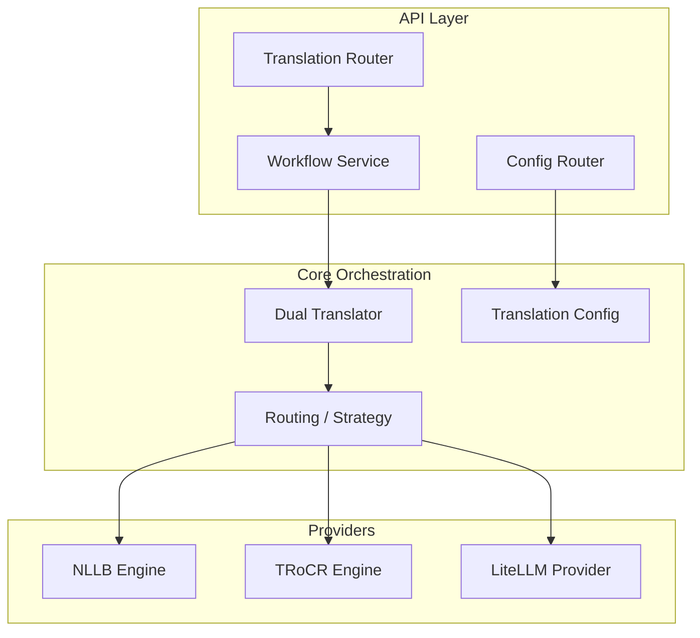
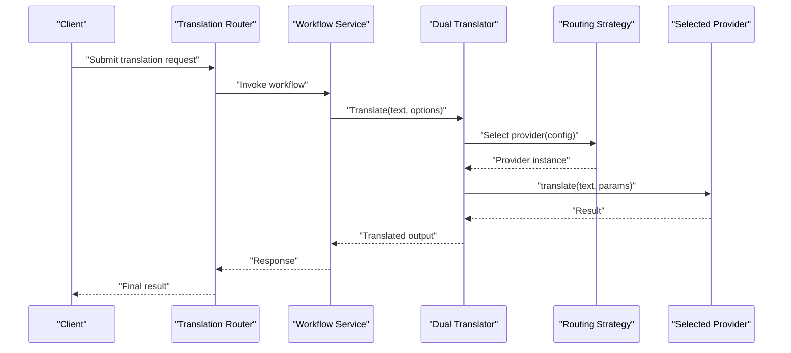
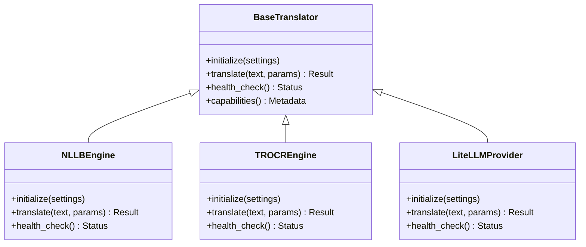
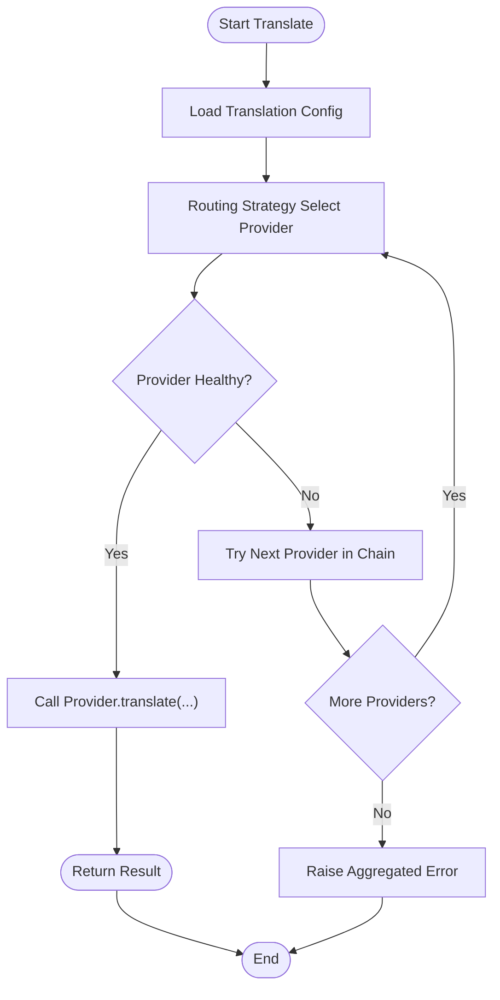
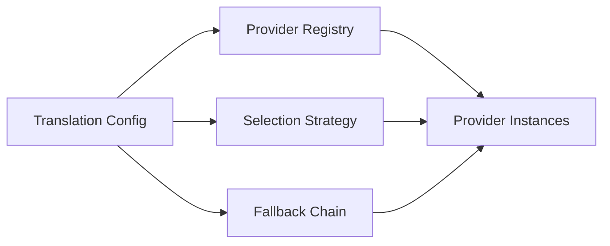
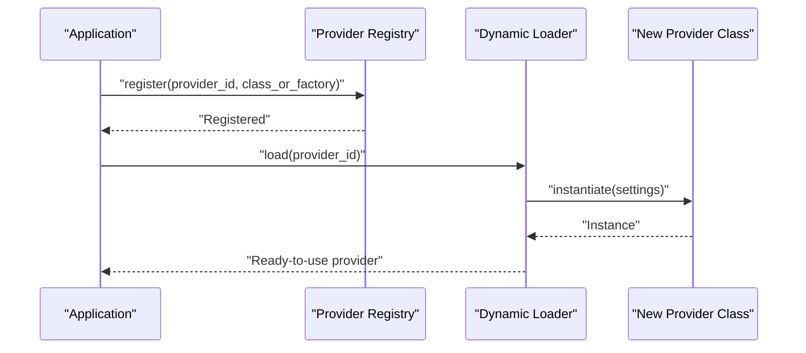
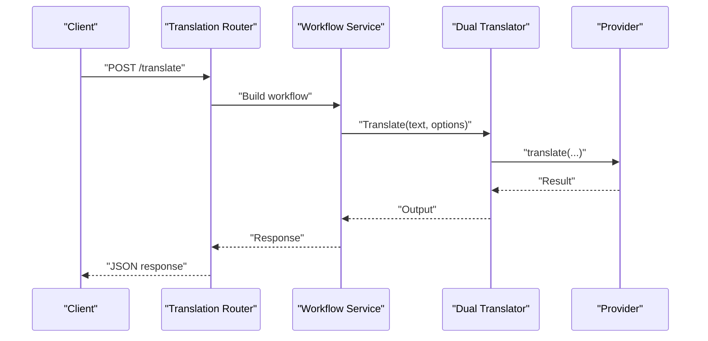
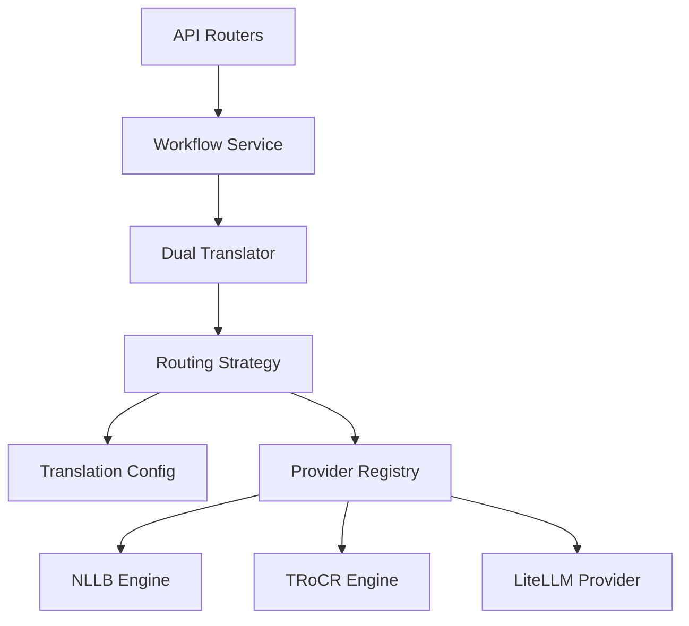

# Translation Engine Architecture

<cite>
**Referenced Files in This Document**
- [translation.py](file://src/local_deepl/core/translation.py)
- [translation_config.py](file://src/local_deepl/core/translation_config.py)
- [dual_translator.py](file://src/local_deepl/core/dual_translator.py)
- [nllb_engine.py](file://src/local_deepl/core/nllb_engine.py)
- [trocr_engine.py](file://src/local_deepl/core/trocr_engine.py)
- [litellm_provider.py](file://src/local_deepl/utils/litellm_provider.py)
- [routing.py](file://src/local_deepl/core/routing.py)
- [translation.py](file://src/local_deepl/api/routers/translation.py)
- [config.py](file://src/local_deepl/api/routers/config.py)
- [workflow.py](file://src/local_deepl/api/services/workflow.py)
- [ocr_pipeline_factory.py](file://src/local_deepl/api/services/ocr_pipeline_factory.py)
</cite>

## Table of Contents
1. [Introduction](#introduction)
2. [Project Structure](#project-structure)
3. [Core Components](#core-components)
4. [Architecture Overview](#architecture-overview)
5. [Detailed Component Analysis](#detailed-component-analysis)
6. [Dependency Analysis](#dependency-analysis)
7. [Performance Considerations](#performance-considerations)
8. [Troubleshooting Guide](#troubleshooting-guide)
9. [Conclusion](#conclusion)
10. [Appendices](#appendices)

## Introduction
This document explains LocalDeepL’s translation engine architecture with a focus on the pluggable translation provider system, abstract base classes and interface contracts, configuration management, provider registration and dynamic loading patterns, error handling and fallbacks, health monitoring, and guidance for extending the system with new backends. It is intended for both developers integrating new providers and operators configuring production deployments.

## Project Structure
The translation subsystem spans core orchestration, provider implementations, utilities, and API integration:
- Core orchestration and routing live under src/local_deepl/core.
- Provider-specific engines are implemented as separate modules.
- A utility provider bridges to LiteLLM-based LLM services.
- API routers expose endpoints that consume the translation pipeline.
- Services coordinate workflows and factory-based component creation.

**Diagram sources**
- [translation.py](file://src/local_deepl/api/routers/translation.py)
- [config.py](file://src/local_deepl/api/routers/config.py)
- [workflow.py](file://src/local_deepl/api/services/workflow.py)
- [dual_translator.py](file://src/local_deepl/core/dual_translator.py)
- [routing.py](file://src/local_deepl/core/routing.py)
- [translation_config.py](file://src/local_deepl/core/translation_config.py)
- [nllb_engine.py](file://src/local_deepl/core/nllb_engine.py)
- [trocr_engine.py](file://src/local_deepl/core/trocr_engine.py)
- [litellm_provider.py](file://src/local_deepl/utils/litellm_provider.py)

**Section sources**
- [translation.py](file://src/local_deepl/api/routers/translation.py)
- [config.py](file://src/local_deepl/api/routers/config.py)
- [workflow.py](file://src/local_deepl/api/services/workflow.py)
- [dual_translator.py](file://src/local_deepl/core/dual_translator.py)
- [routing.py](file://src/local_deepl/core/routing.py)
- [translation_config.py](file://src/local_deepl/core/translation_config.py)
- [nllb_engine.py](file://src/local_deepl/core/nllb_engine.py)
- [trocr_engine.py](file://src/local_deepl/core/trocr_engine.py)
- [litellm_provider.py](file://src/local_deepl/utils/litellm_provider.py)

## Core Components
- Abstract base class and interface contract define how any translation provider must behave (initialization, translate, health check, metadata).
- Dual translator orchestrates multi-stage or dual-path translation flows and delegates to a selected provider via a routing strategy.
- Routing strategy selects a provider based on configuration, runtime conditions, or explicit selection.
- Translation config centralizes provider settings, selection strategies, and fallback chains.
- Concrete engines implement specific backends (e.g., NLLB, TRoCR), while a utility provider integrates with LiteLLM-compatible LLM APIs.

Key responsibilities:
- Provider abstraction ensures consistent initialization, translation calls, and health checks.
- Routing decouples selection logic from provider implementations.
- Configuration drives provider instantiation and behavior without code changes.
- API layer exposes translation and configuration endpoints consumed by clients.

**Section sources**
- [translation.py](file://src/local_deepl/core/translation.py)
- [dual_translator.py](file://src/local_deepl/core/dual_translator.py)
- [routing.py](file://src/local_deepl/core/routing.py)
- [translation_config.py](file://src/local_deepl/core/translation_config.py)
- [nllb_engine.py](file://src/local_deepl/core/nllb_engine.py)
- [trocr_engine.py](file://src/local_deepl/core/trocr_engine.py)
- [litellm_provider.py](file://src/local_deepl/utils/litellm_provider.py)

## Architecture Overview
The translation engine follows a layered design:
- API layer receives requests and delegates to workflow services.
- Workflow service composes translation steps and invokes the dual translator.
- Dual translator uses a routing strategy to pick a provider at runtime.
- Providers encapsulate backend-specific logic and expose a uniform interface.
- Configuration module supplies provider options and selection policies.

**Diagram sources**
- [translation.py](file://src/local_deepl/api/routers/translation.py)
- [workflow.py](file://src/local_deepl/api/services/workflow.py)
- [dual_translator.py](file://src/local_deepl/core/dual_translator.py)
- [routing.py](file://src/local_deepl/core/routing.py)
- [nllb_engine.py](file://src/local_deepl/core/nllb_engine.py)
- [trocr_engine.py](file://src/local_deepl/core/trocr_engine.py)
- [litellm_provider.py](file://src/local_deepl/utils/litellm_provider.py)

## Detailed Component Analysis

### Provider Abstraction and Interface Contracts
The provider abstraction defines a stable contract for all translation backends:
- Initialization with provider-specific settings.
- Translate method accepting text and parameters.
- Health check to validate connectivity and readiness.
- Optional metadata such as supported languages and capabilities.

Implementations must adhere to this contract so the router and dual translator can treat them uniformly.

**Diagram sources**
- [translation.py](file://src/local_deepl/core/translation.py)
- [nllb_engine.py](file://src/local_deepl/core/nllb_engine.py)
- [trocr_engine.py](file://src/local_deepl/core/trocr_engine.py)
- [litellm_provider.py](file://src/local_deepl/utils/litellm_provider.py)

**Section sources**
- [translation.py](file://src/local_deepl/core/translation.py)
- [nllb_engine.py](file://src/local_deepl/core/nllb_engine.py)
- [trocr_engine.py](file://src/local_deepl/core/trocr_engine.py)
- [litellm_provider.py](file://src/local_deepl/utils/litellm_provider.py)

### Dual Translator and Routing Strategy
The dual translator coordinates translation stages and delegates to a selected provider through a routing strategy. The strategy evaluates configuration and runtime context to choose an appropriate backend.

**Diagram sources**
- [dual_translator.py](file://src/local_deepl/core/dual_translator.py)
- [routing.py](file://src/local_deepl/core/routing.py)
- [translation_config.py](file://src/local_deepl/core/translation_config.py)

**Section sources**
- [dual_translator.py](file://src/local_deepl/core/dual_translator.py)
- [routing.py](file://src/local_deepl/core/routing.py)
- [translation_config.py](file://src/local_deepl/core/translation_config.py)

### Configuration Management
Configuration centralizes provider settings, selection strategies, and fallback chains. It enables dynamic switching without code changes and supports environment-driven overrides.

Key aspects:
- Provider registry maps identifiers to concrete classes or factories.
- Selection strategy determines which provider to use per request or globally.
- Fallback chain specifies ordered list of providers to try on failure.
- Provider-specific settings are validated and applied during initialization.

**Diagram sources**
- [translation_config.py](file://src/local_deepl/core/translation_config.py)

**Section sources**
- [translation_config.py](file://src/local_deepl/core/translation_config.py)

### Provider Registration and Dynamic Loading
Providers are registered into a registry and dynamically loaded when selected by the routing strategy. Registration typically involves mapping a provider identifier to its class or factory function. Dynamic loading allows adding new providers without restarting the server if hot-reload is enabled.

**Diagram sources**
- [translation_config.py](file://src/local_deepl/core/translation_config.py)

**Section sources**
- [translation_config.py](file://src/local_deepl/core/translation_config.py)

### Concrete Provider Implementations
- NLLB Engine: Implements the provider contract for the NLLB model backend.
- TRoCR Engine: Implements OCR-aware translation using TRoCR.
- LiteLLM Provider: Bridges to LiteLLM-compatible LLM APIs for translation-like tasks.

Each implementation adheres to the base interface, ensuring compatibility with the dual translator and routing strategy.

**Section sources**
- [nllb_engine.py](file://src/local_deepl/core/nllb_engine.py)
- [trocr_engine.py](file://src/local_deepl/core/trocr_engine.py)
- [litellm_provider.py](file://src/local_deepl/utils/litellm_provider.py)

### API Integration and Workflows
The API layer exposes translation endpoints and configuration endpoints. Workflow services compose translation steps and interact with the dual translator. Factory components (such as OCR pipeline factory) integrate with translation where needed.

**Diagram sources**
- [translation.py](file://src/local_deepl/api/routers/translation.py)
- [workflow.py](file://src/local_deepl/api/services/workflow.py)
- [dual_translator.py](file://src/local_deepl/core/dual_translator.py)
- [nllb_engine.py](file://src/local_deepl/core/nllb_engine.py)
- [trocr_engine.py](file://src/local_deepl/core/trocr_engine.py)
- [litellm_provider.py](file://src/local_deepl/utils/litellm_provider.py)

**Section sources**
- [translation.py](file://src/local_deepl/api/routers/translation.py)
- [workflow.py](file://src/local_deepl/api/services/workflow.py)
- [ocr_pipeline_factory.py](file://src/local_deepl/api/services/ocr_pipeline_factory.py)

## Dependency Analysis
The translation subsystem exhibits clear separation of concerns:
- API depends on workflow services.
- Workflow depends on dual translator and routing.
- Dual translator depends on routing strategy and provider instances.
- Providers depend only on their respective backends and shared utilities.

**Diagram sources**
- [translation.py](file://src/local_deepl/api/routers/translation.py)
- [workflow.py](file://src/local_deepl/api/services/workflow.py)
- [dual_translator.py](file://src/local_deepl/core/dual_translator.py)
- [routing.py](file://src/local_deepl/core/routing.py)
- [translation_config.py](file://src/local_deepl/core/translation_config.py)
- [nllb_engine.py](file://src/local_deepl/core/nllb_engine.py)
- [trocr_engine.py](file://src/local_deepl/core/trocr_engine.py)
- [litellm_provider.py](file://src/local_deepl/utils/litellm_provider.py)

**Section sources**
- [translation.py](file://src/local_deepl/api/routers/translation.py)
- [workflow.py](file://src/local_deepl/api/services/workflow.py)
- [dual_translator.py](file://src/local_deepl/core/dual_translator.py)
- [routing.py](file://src/local_deepl/core/routing.py)
- [translation_config.py](file://src/local_deepl/core/translation_config.py)
- [nllb_engine.py](file://src/local_deepl/core/nllb_engine.py)
- [trocr_engine.py](file://src/local_deepl/core/trocr_engine.py)
- [litellm_provider.py](file://src/local_deepl/utils/litellm_provider.py)

## Performance Considerations
- Prefer caching provider instances to avoid repeated initialization overhead.
- Use connection pooling for external APIs where applicable.
- Batch translations when possible to reduce network round-trips.
- Monitor provider latency and adjust selection strategy accordingly.
- Enable timeouts and retries with exponential backoff for resilience.
- Profile memory usage for large documents and consider streaming responses.

[No sources needed since this section provides general guidance]

## Troubleshooting Guide
Common issues and resolutions:
- Provider initialization failures: Validate configuration keys and credentials; ensure required environment variables are set.
- Health check errors: Inspect provider connectivity and quotas; verify endpoint availability.
- Routing misconfiguration: Confirm provider identifiers match registry entries; review selection strategy rules.
- Fallback not triggering: Ensure fallback chain is defined and ordered correctly; verify error types are handled.
- API errors: Check request payloads and parameter validation; inspect logs for provider-specific error messages.

Operational tips:
- Log provider selection decisions and outcomes for auditability.
- Expose health endpoints for each provider to support readiness probes.
- Use structured logging to capture provider names, request IDs, and timing metrics.

**Section sources**
- [translation_config.py](file://src/local_deepl/core/translation_config.py)
- [routing.py](file://src/local_deepl/core/routing.py)
- [dual_translator.py](file://src/local_deepl/core/dual_translator.py)
- [config.py](file://src/local_deepl/api/routers/config.py)

## Conclusion
LocalDeepL’s translation engine provides a robust, extensible architecture centered on a well-defined provider interface, flexible routing and configuration, and clear API integration points. By adhering to the documented contracts and leveraging the configuration and registration mechanisms, teams can add new backends, implement custom selection strategies, and manage operational concerns like health monitoring and fallbacks effectively.

[No sources needed since this section summarizes without analyzing specific files]

## Appendices

### Implementing a Custom Translation Provider
Steps to extend the system:
- Create a new class implementing the base translator interface (initialize, translate, health_check, capabilities).
- Register the provider in the configuration registry with a unique identifier.
- Update selection strategy or fallback chain to include the new provider.
- Test with sample inputs and health checks before enabling in production.

Best practices:
- Keep provider implementations stateless where possible.
- Handle transient errors gracefully and propagate meaningful diagnostics.
- Document provider-specific settings and constraints.

**Section sources**
- [translation.py](file://src/local_deepl/core/translation.py)
- [translation_config.py](file://src/local_deepl/core/translation_config.py)
- [routing.py](file://src/local_deepl/core/routing.py)

### Configuring Provider Selection Strategies
Guidance:
- Define global defaults and per-request overrides.
- Use environment variables for sensitive settings.
- Maintain a fallback chain to improve reliability.
- Periodically evaluate provider performance and adjust strategies.

**Section sources**
- [translation_config.py](file://src/local_deepl/core/translation_config.py)
- [routing.py](file://src/local_deepl/core/routing.py)

### Managing Provider-Specific Settings
Recommendations:
- Validate settings at startup and fail fast on invalid configurations.
- Separate secrets from non-sensitive settings.
- Provide sensible defaults and document required fields.
- Support hot reload for non-secret settings when safe.

**Section sources**
- [translation_config.py](file://src/local_deepl/core/translation_config.py)
- [config.py](file://src/local_deepl/api/routers/config.py)